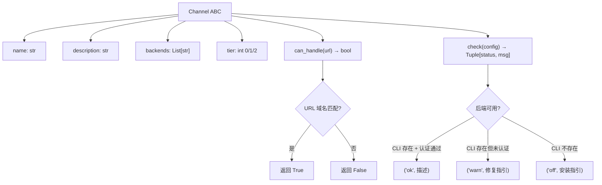
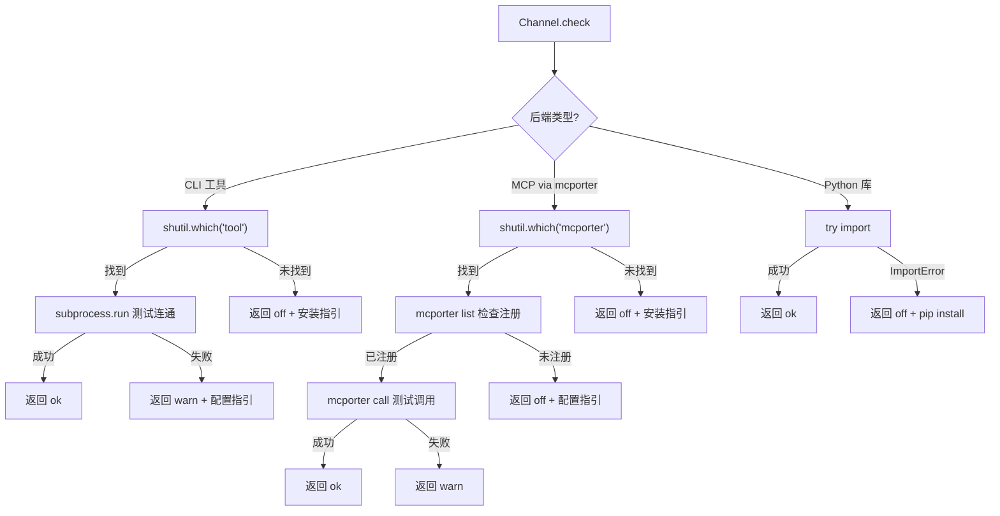

# PD-04.AR Agent-Reach — Channel 抽象基类与 Tier 分级注册表

> 文档编号：PD-04.AR
> 来源：Agent-Reach `agent_reach/channels/base.py`, `agent_reach/channels/__init__.py`, `agent_reach/integrations/mcp_server.py`
> GitHub：https://github.com/Panniantong/Agent-Reach.git
> 问题域：PD-04 工具系统 Tool System Design
> 状态：可复用方案

---

## 第 1 章 问题与动机

### 1.1 核心问题

AI Agent 需要访问互联网上的多个平台（Twitter、YouTube、GitHub、小红书、抖音等），但每个平台的接入方式截然不同：有的需要 CLI 工具（`gh`、`bird`、`yt-dlp`），有的需要 MCP 服务器（小红书、抖音通过 `mcporter` 桥接），有的只需 HTTP API（Reddit JSON API、Jina Reader）。

核心挑战：
- **异构后端统一管理**：CLI、MCP Server、HTTP API、Python 库四种后端类型，如何用统一接口管理？
- **配置复杂度分级**：有些工具装好即用（tier 0），有些需要免费 API Key（tier 1），有些需要复杂配置（tier 2），如何让用户渐进式解锁？
- **健康检测多样性**：不同后端的可用性检测方式完全不同（`shutil.which` 检测 CLI、`subprocess.run` 测试连通性、`import` 检测 Python 库），如何统一？
- **URL 自动路由**：给定一个 URL，如何自动匹配到正确的平台渠道？

### 1.2 Agent-Reach 的解法概述

Agent-Reach 采用"安装器 + 健康检查器"的定位，不做工具调用的包装层，而是帮 Agent 安装和检测上游工具，然后让 Agent 直接调用上游工具。

1. **Channel 抽象基类**（`agent_reach/channels/base.py:18`）：定义 `name`/`description`/`backends`/`tier` 四个属性 + `can_handle(url)`/`check(config)` 两个方法，所有平台渠道继承此基类
2. **ALL_CHANNELS 全局注册表**（`agent_reach/channels/__init__.py:25`）：手动实例化 12 个 Channel 对象的有序列表，WebChannel 放最后作为 fallback
3. **Tier 分级体系**（`base.py:24`）：0=零配置、1=需免费 Key、2=需复杂配置，Doctor 报告按 tier 分组展示
4. **Doctor 健康检查**（`agent_reach/doctor.py:12`）：遍历所有 Channel 调用 `check(config)`，返回 ok/warn/off/error 四态状态
5. **MCP Server 暴露**（`agent_reach/integrations/mcp_server.py:36`）：将 doctor 报告作为 MCP tool 暴露，让 Agent 通过 MCP 协议查询渠道状态

### 1.3 设计思想

| 设计原则 | 具体实现 | 理由 | 替代方案 |
|----------|----------|------|----------|
| 不包装，只检测 | Agent 直接调用 `bird`/`yt-dlp`/`mcporter`，Agent-Reach 只负责安装和健康检查 | 避免维护 N 个平台的 API 包装层，减少中间层故障点 | 统一 SDK 包装所有平台 API |
| Tier 渐进解锁 | tier 0/1/2 三级，用户从零配置开始逐步解锁高级渠道 | 降低首次使用门槛，避免一次性要求配置所有凭据 | 全部平铺，用户自选 |
| URL 域名路由 | `can_handle(url)` 通过 `urlparse` 匹配域名，WebChannel 兜底 | 简单可靠，无需维护 URL 正则库 | 正则匹配、ML 分类 |
| 四态健康状态 | ok/warn/off/error 区分"完全可用/部分可用/未安装/异常" | 比二值状态更精确，warn 表示有降级方案 | 布尔值 True/False |
| YAML 凭据管理 | `~/.agent-reach/config.yaml` + `chmod 600` 权限保护 | 人类可读可编辑，文件权限防止其他用户读取 | 环境变量、加密存储 |

---

## 第 2 章 源码实现分析

### 2.1 架构概览

Agent-Reach 的工具系统由三层组成：Channel 抽象层、Doctor 检查层、MCP 暴露层。

```
┌─────────────────────────────────────────────────────────┐
│                    MCP Server Layer                       │
│  mcp_server.py: list_tools() → get_status                │
│                 call_tool()  → doctor_report()            │
├─────────────────────────────────────────────────────────┤
│                    Doctor Layer                            │
│  doctor.py: check_all(config) → 遍历 ALL_CHANNELS        │
│             format_report()   → Tier 分组文本报告         │
├─────────────────────────────────────────────────────────┤
│                  Channel Layer (12 channels)               │
│  ┌──────────┐ ┌──────────┐ ┌──────────┐ ┌──────────┐    │
│  │ GitHub   │ │ Twitter  │ │ YouTube  │ │ Reddit   │    │
│  │ tier=0   │ │ tier=1   │ │ tier=0   │ │ tier=1   │    │
│  │ gh CLI   │ │ bird CLI │ │ yt-dlp   │ │ JSON API │    │
│  └──────────┘ └──────────┘ └──────────┘ └──────────┘    │
│  ┌──────────┐ ┌──────────┐ ┌──────────┐ ┌──────────┐    │
│  │ Bilibili │ │ XHS      │ │ Douyin   │ │ LinkedIn │    │
│  │ tier=1   │ │ tier=2   │ │ tier=2   │ │ tier=2   │    │
│  │ yt-dlp   │ │ mcporter │ │ mcporter │ │ mcporter │    │
│  └──────────┘ └──────────┘ └──────────┘ └──────────┘    │
│  ┌──────────┐ ┌──────────┐ ┌──────────┐ ┌──────────┐    │
│  │ BossZP   │ │ RSS      │ │ Exa      │ │ Web      │    │
│  │ tier=2   │ │ tier=0   │ │ tier=0   │ │ tier=0   │    │
│  │ mcporter │ │feedparser│ │ mcporter │ │Jina Rdr  │    │
│  └──────────┘ └──────────┘ └──────────┘ └──────────┘    │
├─────────────────────────────────────────────────────────┤
│                   Config Layer                             │
│  config.py: YAML 文件 + 环境变量双源读取                   │
│             FEATURE_REQUIREMENTS 凭据需求映射              │
│             敏感值 mask + chmod 600 权限保护               │
└─────────────────────────────────────────────────────────┘
```

### 2.2 核心实现

#### Channel 抽象基类



对应源码 `agent_reach/channels/base.py:18-37`：

```python
class Channel(ABC):
    """Base class for all channels."""

    name: str = ""                    # e.g. "youtube"
    description: str = ""             # e.g. "YouTube 视频和字幕"
    backends: List[str] = []          # e.g. ["yt-dlp"] — what upstream tool is used
    tier: int = 0                     # 0=zero-config, 1=needs free key, 2=needs setup

    @abstractmethod
    def can_handle(self, url: str) -> bool:
        """Check if this channel can handle this URL."""
        ...

    def check(self, config=None) -> Tuple[str, str]:
        """
        Check if this channel's upstream tool is available.
        Returns (status, message) where status is 'ok'/'warn'/'off'/'error'.
        """
        return "ok", f"{'、'.join(self.backends) if self.backends else '内置'}"
```

基类只有 37 行，极度精简。`check()` 提供默认实现（返回 ok），子类按需覆盖。

#### 三种后端检测模式



对应源码 — CLI 检测模式 `agent_reach/channels/twitter.py:20-38`：

```python
def check(self, config=None):
    bird = shutil.which("bird") or shutil.which("birdx")
    if not bird:
        return "warn", (
            "bird CLI 未安装。搜索可通过 Exa 替代。安装：\n"
            "  npm install -g @steipete/bird"
        )
    try:
        r = subprocess.run(
            [bird, "whoami"], capture_output=True, text=True, timeout=10
        )
        if r.returncode == 0:
            return "ok", "完整可用（读取、搜索推文）"
        return "warn", (
            "bird CLI 已安装但未配置 Cookie。运行：\n"
            "  agent-reach configure twitter-cookies \"auth_token=xxx; ct0=yyy\""
        )
    except Exception:
        return "warn", "bird CLI 已安装但连接失败"
```

MCP 检测模式 `agent_reach/channels/douyin.py:20-52`：

```python
def check(self, config=None):
    if not shutil.which("mcporter"):
        return "off", (
            "需要 mcporter + douyin-mcp-server。安装步骤：\n"
            "  1. npm install -g mcporter\n"
            "  2. pip install douyin-mcp-server\n"
            "  3. 启动服务（见下方说明）\n"
            "  4. mcporter config add douyin http://localhost:18070/mcp\n"
        )
    try:
        r = subprocess.run(
            ["mcporter", "list"], capture_output=True, text=True, timeout=10
        )
        if "douyin" not in r.stdout:
            return "off", "mcporter 已装但抖音 MCP 未配置..."
    except Exception:
        return "off", "mcporter 连接异常"
    try:
        r = subprocess.run(
            ["mcporter", "call", "douyin.parse_douyin_video_info(...)"],
            capture_output=True, text=True, timeout=15
        )
        if r.returncode == 0:
            return "ok", "完整可用（视频解析、下载链接获取）"
        return "warn", "MCP 已连接但调用异常"
    except Exception:
        return "warn", "MCP 连接异常"
```

MCP 检测是三层递进：① mcporter CLI 是否存在 → ② 目标 MCP 是否注册 → ③ 实际调用是否成功。


### 2.3 实现细节

#### 全局注册表与 URL 路由

`agent_reach/channels/__init__.py:25-38` 定义了有序注册表：

```python
ALL_CHANNELS: List[Channel] = [
    GitHubChannel(),
    TwitterChannel(),
    YouTubeChannel(),
    RedditChannel(),
    BilibiliChannel(),
    XiaoHongShuChannel(),
    DouyinChannel(),
    LinkedInChannel(),
    BossZhipinChannel(),
    RSSChannel(),
    ExaSearchChannel(),
    WebChannel(),       # ← 放最后，作为 fallback
]
```

关键设计：WebChannel 的 `can_handle()` 永远返回 `True`（`agent_reach/channels/web.py:14`），放在列表末尾充当兜底。URL 路由是线性扫描 `ALL_CHANNELS`，第一个 `can_handle(url)` 返回 True 的 Channel 胜出。

#### Doctor 报告按 Tier 分组

`agent_reach/doctor.py:27-91` 的 `format_report()` 将检查结果按 tier 分三组展示：
- Tier 0："✅ 装好即用" — 用户无需任何配置
- Tier 1："🔍 搜索（mcporter 即可解锁）" — 需要简单配置
- Tier 2："🔧 配置后可用" — 需要复杂配置（Docker、扫码登录等）

还包含安全检查（`doctor.py:77-89`）：检测 `config.yaml` 文件权限是否过宽。

#### Config 双源读取与凭据保护

`agent_reach/config.py:61-70` 实现了 YAML 文件 + 环境变量双源读取：

```python
def get(self, key: str, default: Any = None) -> Any:
    # Config file first
    if key in self.data:
        return self.data[key]
    # Then env var (uppercase)
    env_val = os.environ.get(key.upper())
    if env_val:
        return env_val
    return default
```

`config.py:54-59` 保存时自动设置 `chmod 600`：

```python
def save(self):
    self._ensure_dir()
    with open(self.config_path, "w") as f:
        yaml.dump(self.data, f, default_flow_style=False, allow_unicode=True)
    try:
        import stat
        self.config_path.chmod(stat.S_IRUSR | stat.S_IWUSR)  # 0o600
    except OSError:
        pass
```

`config.py:94-102` 的 `to_dict()` 自动 mask 敏感值（key/token/password/proxy 关键词匹配）。

#### Cookie 自动提取

`agent_reach/cookie_extract.py:16-35` 定义了平台 Cookie 规格表：

```python
PLATFORM_SPECS = [
    {"name": "Twitter/X", "domains": [".x.com", ".twitter.com"],
     "cookies": ["auth_token", "ct0"], "config_key": "twitter"},
    {"name": "XiaoHongShu", "domains": [".xiaohongshu.com"],
     "cookies": None, "config_key": "xhs"},  # None = grab all
    {"name": "Bilibili", "domains": [".bilibili.com"],
     "cookies": ["SESSDATA", "bili_jct"], "config_key": "bilibili"},
]
```

通过 `browser_cookie3` 库从 Chrome/Firefox/Edge/Brave/Opera 自动提取 Cookie，一次性配置所有平台。

#### SKILL.md 知识注入

`agent_reach/skill/SKILL.md` 是一个 259 行的 Markdown 文件，包含所有 12 个渠道的具体调用命令。Agent-Reach 不定义 Function Calling Schema，而是通过 SKILL.md 文档教 Agent 如何直接调用上游工具。这是"知识注入替代 Schema"的典型实现。

---

## 第 3 章 迁移指南

### 3.1 迁移清单

**阶段 1：基础框架（1 天）**
- [ ] 创建 `channels/base.py`，定义 Channel ABC（name/description/backends/tier/can_handle/check）
- [ ] 创建 `channels/__init__.py`，定义 ALL_CHANNELS 注册表
- [ ] 创建 `doctor.py`，实现 check_all + format_report
- [ ] 创建 `config.py`，实现 YAML 配置 + 环境变量双源读取

**阶段 2：渠道实现（每个渠道 0.5 天）**
- [ ] 为每个目标平台创建 Channel 子类
- [ ] 实现 `can_handle()` URL 匹配逻辑
- [ ] 实现 `check()` 三层递进检测（CLI 存在 → 认证状态 → 实际调用）
- [ ] 为每个 check 失败路径提供人类可读的修复指引

**阶段 3：集成层（1 天）**
- [ ] 创建 MCP Server，暴露 doctor 报告
- [ ] 创建 CLI 入口（install/doctor/configure/setup）
- [ ] 编写 SKILL.md 知识文档

### 3.2 适配代码模板

以下是一个可直接复用的 Channel 基类 + 注册表模板：

```python
# channels/base.py
from abc import ABC, abstractmethod
from typing import List, Tuple, Optional

class Channel(ABC):
    """可插拔渠道基类。"""
    name: str = ""
    description: str = ""
    backends: List[str] = []
    tier: int = 0  # 0=零配置, 1=需免费Key, 2=需复杂配置

    @abstractmethod
    def can_handle(self, url: str) -> bool:
        """该渠道能否处理此 URL？"""
        ...

    def check(self, config=None) -> Tuple[str, str]:
        """检测后端可用性。返回 (status, message)。
        status: 'ok' | 'warn' | 'off' | 'error'
        """
        return "ok", f"{'、'.join(self.backends) if self.backends else '内置'}"


# channels/my_channel.py — CLI 后端示例
import shutil
import subprocess
from .base import Channel

class MyToolChannel(Channel):
    name = "mytool"
    description = "我的工具"
    backends = ["mytool-cli"]
    tier = 0

    def can_handle(self, url: str) -> bool:
        from urllib.parse import urlparse
        return "mytool.com" in urlparse(url).netloc.lower()

    def check(self, config=None):
        if not shutil.which("mytool"):
            return "off", "mytool 未安装。安装：pip install mytool"
        try:
            r = subprocess.run(
                ["mytool", "--version"],
                capture_output=True, text=True, timeout=10
            )
            if r.returncode == 0:
                return "ok", f"可用 (v{r.stdout.strip()})"
            return "warn", "已安装但运行异常"
        except Exception:
            return "error", "执行超时或崩溃"


# channels/__init__.py — 注册表
from typing import List, Optional
from .base import Channel
from .my_channel import MyToolChannel
from .fallback import FallbackChannel

ALL_CHANNELS: List[Channel] = [
    MyToolChannel(),
    # ... 更多渠道 ...
    FallbackChannel(),  # 兜底，放最后
]

def get_channel(name: str) -> Optional[Channel]:
    for ch in ALL_CHANNELS:
        if ch.name == name:
            return ch
    return None

def route_url(url: str) -> Optional[Channel]:
    """URL 自动路由：返回第一个能处理该 URL 的渠道。"""
    for ch in ALL_CHANNELS:
        if ch.can_handle(url):
            return ch
    return None
```

### 3.3 适用场景

| 场景 | 适用度 | 说明 |
|------|--------|------|
| 多平台内容聚合 Agent | ⭐⭐⭐ | 核心场景：统一管理 N 个平台的接入状态 |
| CLI 工具编排系统 | ⭐⭐⭐ | 适合管理多个 CLI 工具的安装和健康检查 |
| MCP 服务器管理 | ⭐⭐ | mcporter 桥接模式可复用，但依赖 mcporter 生态 |
| 单一平台 SDK 封装 | ⭐ | 过度设计，直接用 SDK 即可 |
| 高并发工具调用 | ⭐ | Agent-Reach 不做调用层，无并发控制 |

---

## 第 4 章 测试用例

```python
import pytest
from unittest.mock import patch, MagicMock
from agent_reach.channels.base import Channel
from agent_reach.channels import ALL_CHANNELS, get_channel, get_all_channels


class ConcreteChannel(Channel):
    """测试用具体 Channel。"""
    name = "test"
    description = "测试渠道"
    backends = ["test-cli"]
    tier = 0

    def can_handle(self, url: str) -> bool:
        return "test.com" in url


class TestChannelBase:
    def test_default_check_returns_ok(self):
        ch = ConcreteChannel()
        status, msg = ch.check()
        assert status == "ok"
        assert "test-cli" in msg

    def test_can_handle_matches_domain(self):
        ch = ConcreteChannel()
        assert ch.can_handle("https://test.com/page") is True
        assert ch.can_handle("https://other.com/page") is False

    def test_tier_attribute(self):
        ch = ConcreteChannel()
        assert ch.tier == 0


class TestChannelRegistry:
    def test_all_channels_not_empty(self):
        assert len(ALL_CHANNELS) >= 12

    def test_web_channel_is_last(self):
        """WebChannel 必须是最后一个（兜底）。"""
        assert ALL_CHANNELS[-1].name == "web"

    def test_web_channel_handles_any_url(self):
        web = ALL_CHANNELS[-1]
        assert web.can_handle("https://random-site.xyz") is True

    def test_get_channel_by_name(self):
        ch = get_channel("youtube")
        assert ch is not None
        assert ch.name == "youtube"

    def test_get_channel_returns_none_for_unknown(self):
        assert get_channel("nonexistent") is None

    def test_no_duplicate_names(self):
        names = [ch.name for ch in ALL_CHANNELS]
        assert len(names) == len(set(names)), "Channel names must be unique"

    def test_url_routing_priority(self):
        """GitHub URL 应匹配 GitHubChannel，不应落到 WebChannel。"""
        url = "https://github.com/user/repo"
        for ch in ALL_CHANNELS:
            if ch.can_handle(url):
                assert ch.name == "github"
                break


class TestChannelCheck:
    @patch("shutil.which", return_value=None)
    def test_youtube_check_without_ytdlp(self, mock_which):
        from agent_reach.channels.youtube import YouTubeChannel
        ch = YouTubeChannel()
        status, msg = ch.check()
        assert status == "off"
        assert "yt-dlp" in msg

    @patch("shutil.which", return_value="/usr/bin/yt-dlp")
    def test_youtube_check_with_ytdlp(self, mock_which):
        from agent_reach.channels.youtube import YouTubeChannel
        ch = YouTubeChannel()
        status, msg = ch.check()
        assert status == "ok"

    @patch("shutil.which", return_value=None)
    def test_exa_check_without_mcporter(self, mock_which):
        from agent_reach.channels.exa_search import ExaSearchChannel
        ch = ExaSearchChannel()
        status, msg = ch.check()
        assert status == "off"
        assert "mcporter" in msg


class TestTierGrouping:
    def test_tier_values_valid(self):
        for ch in ALL_CHANNELS:
            assert ch.tier in (0, 1, 2), f"{ch.name} has invalid tier {ch.tier}"

    def test_tier0_channels_exist(self):
        tier0 = [ch for ch in ALL_CHANNELS if ch.tier == 0]
        assert len(tier0) >= 4, "Should have at least 4 zero-config channels"
```


---

## 第 5 章 跨域关联

| 关联域 | 关系类型 | 说明 |
|--------|----------|------|
| PD-07 质量检查 | 协同 | Doctor 健康检查本质是工具系统的质量保障层，`check()` 方法是每个渠道的自检机制 |
| PD-11 可观测性 | 协同 | Doctor 报告提供渠道级可观测性（ok/warn/off/error 四态），`watch` 命令支持定时监控 |
| PD-08 搜索与检索 | 依赖 | Exa Search Channel 通过 mcporter 桥接 MCP，是搜索能力的基础设施 |
| PD-06 记忆持久化 | 协同 | Config 层（`~/.agent-reach/config.yaml`）是凭据和配置的持久化存储 |
| PD-09 Human-in-the-Loop | 协同 | Cookie 配置、扫码登录等步骤需要人类介入，`check()` 返回的修复指引引导人类操作 |
| PD-03 容错与重试 | 协同 | `check()` 的 warn 状态表示降级可用（如 Twitter 无 bird 时可走 Exa 搜索），体现优雅降级思想 |

---

## 第 6 章 来源文件索引

| 文件 | 行范围 | 关键实现 |
|------|--------|----------|
| `agent_reach/channels/base.py` | L1-L37 | Channel 抽象基类定义（name/description/backends/tier/can_handle/check） |
| `agent_reach/channels/__init__.py` | L1-L58 | ALL_CHANNELS 全局注册表 + get_channel/get_all_channels 查询函数 |
| `agent_reach/channels/twitter.py` | L1-L38 | CLI 后端检测模式典型实现（shutil.which → subprocess.run） |
| `agent_reach/channels/douyin.py` | L1-L52 | MCP 后端三层递进检测（mcporter CLI → mcporter list → mcporter call） |
| `agent_reach/channels/youtube.py` | L1-L22 | 最简 CLI 检测（单行 shutil.which） |
| `agent_reach/channels/web.py` | L1-L17 | Fallback Channel（can_handle 永远返回 True） |
| `agent_reach/channels/exa_search.py` | L1-L36 | 搜索专用 Channel（can_handle 返回 False，仅提供搜索能力） |
| `agent_reach/channels/rss.py` | L1-L21 | Python 库检测模式（try import feedparser） |
| `agent_reach/doctor.py` | L1-L91 | Doctor 健康检查 + Tier 分组报告 + 配置文件权限安全检查 |
| `agent_reach/config.py` | L1-L102 | YAML 配置管理 + 环境变量双源读取 + chmod 600 + 敏感值 mask |
| `agent_reach/cookie_extract.py` | L1-L166 | 浏览器 Cookie 自动提取（Chrome/Firefox/Edge/Brave/Opera） |
| `agent_reach/integrations/mcp_server.py` | L1-L67 | MCP Server 暴露 doctor 报告为 get_status 工具 |
| `agent_reach/cli.py` | L1-L917 | CLI 入口（install/doctor/configure/setup/watch/check-update） |
| `agent_reach/skill/SKILL.md` | L1-L259 | Agent 知识注入文档（12 渠道调用命令大全） |

---

## 第 7 章 横向对比维度

> **重要：** 本章用于自动填充 Butcher Wiki 的横向对比表。
> 必须严格按以下 JSON 格式输出，放在 `comparison_data` 代码块中。

```json comparison_data
{
  "project": "Agent-Reach",
  "dimensions": {
    "工具注册方式": "Channel ABC 子类 + ALL_CHANNELS 手动实例化有序列表",
    "工具分组/权限": "Tier 三级分组（0=零配置/1=免费Key/2=复杂配置）",
    "MCP 协议支持": "mcporter 桥接多个 MCP Server + 自身暴露 get_status MCP tool",
    "热更新/缓存": "无热更新，静态注册表，重启生效",
    "超时保护": "subprocess.run timeout=10-15s 硬超时",
    "安全防护": "config.yaml chmod 600 + 敏感值 mask + Cookie 域名隔离",
    "Schema 生成方式": "无 Function Calling Schema，通过 SKILL.md 知识注入教 Agent 调用",
    "工具推荐策略": "can_handle(url) 线性扫描 + WebChannel 兜底路由",
    "工具上下文注入": "Config 双源读取（YAML 文件优先 + 环境变量 fallback）",
    "生命周期追踪": "四态健康状态 ok/warn/off/error，doctor 命令一键检查",
    "参数校验": "无显式参数校验，依赖上游工具自身校验",
    "URL 自动路由": "urlparse 域名匹配 + 有序列表优先级 + WebChannel 兜底",
    "后端工具健康检测": "三层递进：CLI 存在 → 认证状态 → 实际调用测试",
    "凭据安全管理": "YAML 文件 + chmod 600 + 浏览器 Cookie 自动提取 + 敏感值 mask"
  }
}
```

### 域元数据补充

```json domain_metadata
{
  "solution_summary": "Agent-Reach 通过 Channel ABC + ALL_CHANNELS 有序注册表 + Tier 三级分级实现 12 平台可插拔工具管理，不包装调用层，只做安装检测和知识注入",
  "description": "工具系统不仅是调用层设计，还包括安装管理、健康检测和渐进式解锁策略",
  "sub_problems": [
    "Tier 渐进解锁：如何按配置复杂度分级，让用户从零配置开始逐步解锁高级工具",
    "浏览器 Cookie 提取：如何从本地浏览器自动提取多平台登录凭据",
    "mcporter 多 MCP 桥接：如何通过统一 CLI 桥接多个异构 MCP Server",
    "安装器与调用层分离：工具系统是否应该包装调用层，还是只做安装检测让 Agent 直接调用上游"
  ],
  "best_practices": [
    "check 返回修复指引：健康检查失败时返回人类可读的修复步骤，而非仅报错",
    "Fallback Channel 兜底：注册表末尾放通用渠道，确保任何 URL 都有处理路径",
    "凭据文件权限保护：配置文件保存后自动 chmod 600，防止其他用户读取敏感信息",
    "环境自动检测：区分本地/服务器环境，自动调整安装策略和建议"
  ]
}
```
