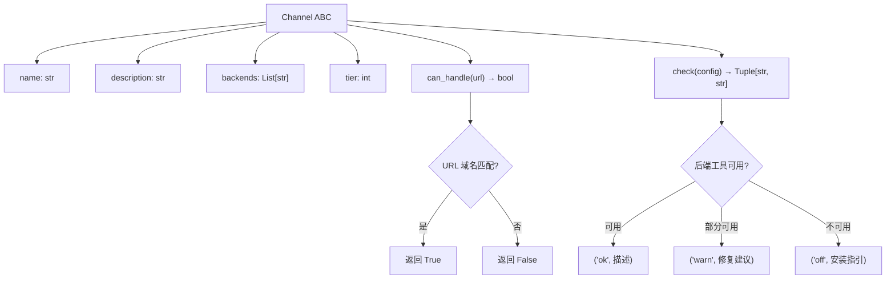
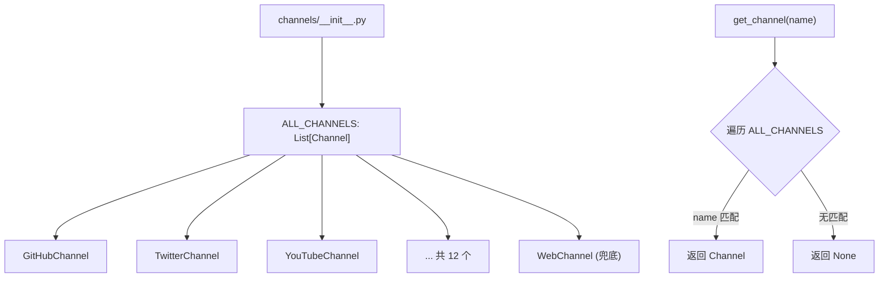
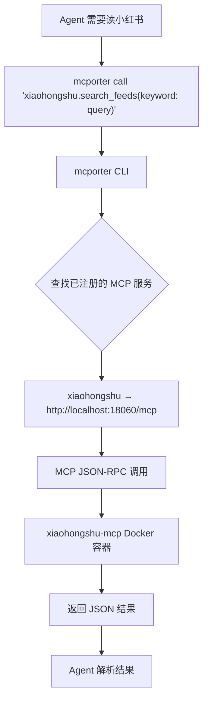

# PD-04.14 Agent Reach — Channel 抽象基类 + mcporter MCP 桥接的可插拔工具系统

> 文档编号：PD-04.14
> 来源：Agent Reach `agent_reach/channels/base.py`, `agent_reach/integrations/mcp_server.py`
> GitHub：https://github.com/Panniantong/Agent-Reach.git
> 问题域：PD-04 工具系统 Tool System Design
> 状态：可复用方案

---

## 第 1 章 问题与动机

### 1.1 核心问题

AI Agent 需要访问互联网上的多种平台（Twitter、YouTube、Reddit、小红书、GitHub 等），但每个平台的接入方式完全不同：有的需要 CLI 工具（yt-dlp、gh CLI），有的需要 Cookie 认证（bird CLI），有的需要 MCP 服务（xiaohongshu-mcp、douyin-mcp-server），有的只需要 HTTP 请求（Jina Reader）。

传统做法是为每个平台写一个包装层（wrapper），Agent 通过统一 API 调用。但这带来两个问题：
1. **包装层成为瓶颈** — 上游工具更新后包装层需要同步更新，维护成本高
2. **能力受限** — 包装层只暴露了上游工具的部分功能，Agent 无法使用完整能力

Agent Reach 提出了一个反直觉的设计：**工具系统不包装工具，只负责安装、检测和知识注入**。Agent 安装完成后直接调用上游工具，不经过任何中间层。

### 1.2 Agent Reach 的解法概述

1. **Channel 抽象基类** — 每个平台是一个 Channel 子类，只负责 URL 路由（`can_handle`）和健康检测（`check`），不负责实际读写（`agent_reach/channels/base.py:18-37`）
2. **静态注册表** — 12 个 Channel 实例在 `__init__.py` 中硬编码注册，通过 `get_channel(name)` 按名查找（`agent_reach/channels/__init__.py:25-46`）
3. **mcporter MCP 桥接** — 小红书、抖音、LinkedIn、Boss直聘等平台通过 mcporter CLI 桥接 MCP 服务，Agent 用 `mcporter call 'server.method(args)'` 调用（`agent_reach/channels/xiaohongshu.py:29-50`）
4. **SKILL.md 知识注入** — 安装时将 SKILL.md 写入 Agent 的 skills 目录，Agent 通过阅读 SKILL.md 获知每个平台的调用命令（`agent_reach/cli.py:236-274`）
5. **三级 Tier 分层** — Channel 按配置复杂度分为 tier 0（零配置）、tier 1（需免费 Key）、tier 2（需额外设置），doctor 按层级展示状态（`agent_reach/doctor.py:36-71`）

### 1.3 设计思想

| 设计原则 | 具体实现 | 理由 | 替代方案 |
|----------|----------|------|----------|
| 脚手架而非框架 | Channel 只做检测，不包装调用 | 避免包装层成为瓶颈，Agent 直接获得上游工具完整能力 | 统一 API 包装（如 LangChain Tool） |
| URL 路由分发 | `can_handle(url)` 按域名匹配平台 | Agent 拿到 URL 后自动识别该用哪个工具 | 手动指定平台名 |
| 后端可热替换 | 每个 Channel 文件独立，换掉文件即换后端 | 上游工具被封或有更好选择时零成本切换 | 插件注册表 + 配置文件 |
| 知识注入代替 API 封装 | SKILL.md 教 Agent 怎么调用上游工具 | Agent 学会后自主调用，不依赖中间层 | Function Calling Schema |
| MCP 统一桥接 | mcporter 将多个 MCP 服务统一为 CLI 调用 | 避免每个 MCP 服务单独管理连接 | 直接连接每个 MCP 服务 |

---

## 第 2 章 源码实现分析

### 2.1 架构概览

Agent Reach 的工具系统分为三层：Channel 抽象层（检测 + 路由）、后端工具层（实际执行）、知识注入层（SKILL.md）。

```
┌─────────────────────────────────────────────────────────┐
│                    AI Agent (Claude Code / Cursor)        │
│                                                           │
│  读取 SKILL.md → 知道每个平台的调用命令                      │
│  直接调用上游工具 → bird search / yt-dlp / mcporter call    │
└───────────┬───────────────────────────────────────────────┘
            │ 安装时注入
┌───────────▼───────────────────────────────────────────────┐
│              Agent Reach (安装器 + 诊断器)                   │
│                                                             │
│  ┌─────────────┐  ┌──────────────┐  ┌──────────────────┐  │
│  │ Channel 注册 │  │ doctor 诊断  │  │ SKILL.md 注入    │  │
│  │ 12 个子类    │  │ check_all()  │  │ _install_skill() │  │
│  └──────┬──────┘  └──────┬───────┘  └──────────────────┘  │
│         │                │                                   │
│  ┌──────▼──────────────▼─────────────────────────────┐     │
│  │              Channel 抽象基类                       │     │
│  │  can_handle(url) → bool    URL 路由               │     │
│  │  check(config) → (status, message)  健康检测       │     │
│  │  name / description / backends / tier  元数据      │     │
│  └────────────────────────────────────────────────────┘     │
└─────────────────────────────────────────────────────────────┘
            │ 检测可用性
┌───────────▼───────────────────────────────────────────────┐
│              后端工具层（Agent 直接调用）                      │
│                                                             │
│  Tier 0 (零配置)     Tier 1 (需 Key)    Tier 2 (需设置)    │
│  ├─ Jina Reader      ├─ bird CLI        ├─ xiaohongshu-mcp │
│  ├─ yt-dlp           ├─ Exa via MCP     ├─ douyin-mcp      │
│  ├─ gh CLI           └─ Reddit API      ├─ linkedin-mcp    │
│  └─ feedparser                          └─ mcp-bosszp      │
│                                                             │
│  ┌──────────────────────────────────────────────────────┐  │
│  │  mcporter (MCP CLI 桥接)                              │  │
│  │  mcporter call 'server.method(args)' → JSON 结果     │  │
│  └──────────────────────────────────────────────────────┘  │
└─────────────────────────────────────────────────────────────┘
```

### 2.2 核心实现

#### 2.2.1 Channel 抽象基类



对应源码 `agent_reach/channels/base.py:18-37`：

```python
class Channel(ABC):
    """Base class for all channels."""

    name: str = ""                    # e.g. "youtube"
    description: str = ""             # e.g. "YouTube 视频和字幕"
    backends: List[str] = []          # e.g. ["yt-dlp"] — what upstream tool is used
    tier: int = 0                     # 0=zero-config, 1=needs free key, 2=needs setup

    @abstractmethod
    def can_handle(self, url: str) -> bool:
        """Check if this channel can handle this URL."""
        ...

    def check(self, config=None) -> Tuple[str, str]:
        """
        Check if this channel's upstream tool is available.
        Returns (status, message) where status is 'ok'/'warn'/'off'/'error'.
        """
        return "ok", f"{'、'.join(self.backends) if self.backends else '内置'}"
```

关键设计点：
- `can_handle` 是抽象方法，每个子类必须实现 URL 匹配逻辑
- `check` 有默认实现（返回 ok），子类可覆盖以添加检测逻辑
- `backends` 记录后端工具名，仅用于展示，不用于调用
- `tier` 分层让 doctor 报告按复杂度分组展示

#### 2.2.2 Channel 注册表与路由



对应源码 `agent_reach/channels/__init__.py:25-46`：

```python
ALL_CHANNELS: List[Channel] = [
    GitHubChannel(),
    TwitterChannel(),
    YouTubeChannel(),
    RedditChannel(),
    BilibiliChannel(),
    XiaoHongShuChannel(),
    DouyinChannel(),
    LinkedInChannel(),
    BossZhipinChannel(),
    RSSChannel(),
    ExaSearchChannel(),
    WebChannel(),       # 兜底 — can_handle 永远返回 True
]

def get_channel(name: str) -> Optional[Channel]:
    """Get a channel by name."""
    for ch in ALL_CHANNELS:
        if ch.name == name:
            return ch
    return None
```

注册顺序有讲究：`WebChannel` 放在最后，因为它的 `can_handle` 永远返回 `True`（`agent_reach/channels/web.py:14`），作为兜底处理任意 URL。

#### 2.2.3 mcporter MCP 桥接模式



对应源码 `agent_reach/channels/xiaohongshu.py:20-50`：

```python
def check(self, config=None):
    if not shutil.which("mcporter"):
        return "off", (
            "需要 mcporter + xiaohongshu-mcp。安装步骤：\n"
            "  1. npm install -g mcporter\n"
            "  2. docker run -d --name xiaohongshu-mcp -p 18060:18060 xpzouying/xiaohongshu-mcp\n"
            "  3. mcporter config add xiaohongshu http://localhost:18060/mcp\n"
        )
    try:
        r = subprocess.run(
            ["mcporter", "list"], capture_output=True, text=True, timeout=10
        )
        if "xiaohongshu" not in r.stdout:
            return "off", (
                "mcporter 已装但小红书 MCP 未配置。运行：\n"
                "  docker run -d --name xiaohongshu-mcp -p 18060:18060 xpzouying/xiaohongshu-mcp\n"
                "  mcporter config add xiaohongshu http://localhost:18060/mcp"
            )
    except Exception:
        return "off", "mcporter 连接异常"
    try:
        r = subprocess.run(
            ["mcporter", "call", "xiaohongshu.check_login_status()"],
            capture_output=True, text=True, timeout=10
        )
        if "已登录" in r.stdout or "logged" in r.stdout.lower():
            return "ok", "完整可用（阅读、搜索、发帖、评论、点赞）"
        return "warn", "MCP 已连接但未登录，需扫码登录"
    except Exception:
        return "warn", "MCP 连接异常，检查 xiaohongshu-mcp 服务是否在运行"
```

mcporter 桥接的核心价值：将多个独立的 MCP 服务（xiaohongshu、douyin、exa、linkedin、bosszhipin）统一为一个 CLI 入口，Agent 只需学会 `mcporter call 'server.method(args)'` 这一种调用模式。

### 2.3 实现细节

#### SKILL.md 知识注入机制

Agent Reach 最独特的设计是**不通过 Function Calling Schema 暴露工具，而是通过 SKILL.md 文档教 Agent 怎么调用上游工具**。

安装时 `_install_skill()` 函数（`agent_reach/cli.py:236-274`）将 SKILL.md 复制到 Agent 的 skills 目录（`~/.openclaw/skills/agent-reach/` 或 `~/.claude/skills/agent-reach/`）。SKILL.md 包含每个平台的完整调用示例：

```
### Twitter/X (bird CLI)
bird search "query" --json -n 10
bird read https://x.com/user/status/123 --json

### YouTube (yt-dlp)
yt-dlp --dump-json "URL"
yt-dlp --write-sub --skip-download "URL"

### 小红书 (mcporter)
mcporter call 'xiaohongshu.search_feeds(keyword: "query")'
```

这种设计让 Agent 获得了上游工具的**完整能力**，而不是被 Function Calling Schema 限制在预定义的参数集合中。

#### MCP Server 暴露（自身作为 MCP 工具）

Agent Reach 自身也可以作为 MCP 服务暴露 doctor 状态（`agent_reach/integrations/mcp_server.py:27-57`）：

```python
def create_server():
    server = Server("agent-reach")
    config = Config()
    eyes = AgentReach(config)

    @server.list_tools()
    async def list_tools():
        return [
            Tool(name="get_status",
                 description="Get Agent Reach status: which channels are installed and active.",
                 inputSchema={"type": "object", "properties": {}}),
        ]

    @server.call_tool()
    async def call_tool(name: str, arguments: dict):
        if name == "get_status":
            result = eyes.doctor_report()
        else:
            result = f"Unknown tool: {name}"
        text = json.dumps(result, ...) if isinstance(result, (dict, list)) else str(result)
        return [TextContent(type="text", text=text)]
```

注意 MCP 依赖是可选的（`HAS_MCP` 标志，`mcp_server.py:18-24`），通过 `pip install agent-reach[mcp]` 安装。

#### 配置系统与凭据安全

Config 类（`agent_reach/config.py:15-102`）实现了双源配置查找：先查 YAML 文件，再查环境变量（大写）。凭据文件权限自动设为 600（`config.py:56-58`），doctor 还会检查权限是否过宽（`doctor.py:77-89`）。


---

## 第 3 章 迁移指南

### 3.1 迁移清单

**阶段 1：Channel 抽象层（1 天）**
- [ ] 定义 Channel 抽象基类（name、description、backends、tier、can_handle、check）
- [ ] 为每个目标平台实现 Channel 子类
- [ ] 实现 Channel 注册表（ALL_CHANNELS 列表 + get_channel 查找）
- [ ] 实现 doctor 诊断（遍历所有 Channel 调用 check）

**阶段 2：后端工具集成（2-3 天）**
- [ ] 选择每个平台的后端工具（CLI / MCP / API）
- [ ] 安装 mcporter 并配置 MCP 服务（如需要）
- [ ] 编写安装脚本（自动检测环境、安装依赖）
- [ ] 实现配置管理（YAML + 环境变量双源查找）

**阶段 3：知识注入（0.5 天）**
- [ ] 编写 SKILL.md，包含每个平台的调用示例
- [ ] 实现 skill 安装逻辑（复制到 Agent skills 目录）

### 3.2 适配代码模板

#### 最小可用的 Channel 抽象基类

```python
"""channel_base.py — 可插拔渠道抽象基类"""
from abc import ABC, abstractmethod
from typing import List, Tuple, Optional


class Channel(ABC):
    """每个渠道代表一个外部平台。"""

    name: str = ""
    description: str = ""
    backends: List[str] = []
    tier: int = 0  # 0=零配置, 1=需免费Key, 2=需额外设置

    @abstractmethod
    def can_handle(self, url: str) -> bool:
        """该 URL 是否属于本渠道？"""
        ...

    def check(self, config=None) -> Tuple[str, str]:
        """检测后端工具是否可用。返回 (status, message)。"""
        return "ok", "内置"


class ChannelRegistry:
    """渠道注册表 — 管理所有已注册渠道。"""

    def __init__(self):
        self._channels: List[Channel] = []

    def register(self, channel: Channel):
        self._channels.append(channel)

    def get(self, name: str) -> Optional[Channel]:
        for ch in self._channels:
            if ch.name == name:
                return ch
        return None

    def route(self, url: str) -> Optional[Channel]:
        """根据 URL 找到匹配的渠道。"""
        for ch in self._channels:
            if ch.can_handle(url):
                return ch
        return None

    def check_all(self, config=None) -> dict:
        """诊断所有渠道状态。"""
        results = {}
        for ch in self._channels:
            status, message = ch.check(config)
            results[ch.name] = {
                "status": status,
                "name": ch.description,
                "message": message,
                "tier": ch.tier,
                "backends": ch.backends,
            }
        return results
```

#### 具体渠道实现示例

```python
"""channels/youtube.py — YouTube 渠道"""
import shutil
from channel_base import Channel


class YouTubeChannel(Channel):
    name = "youtube"
    description = "YouTube 视频和字幕"
    backends = ["yt-dlp"]
    tier = 0

    def can_handle(self, url: str) -> bool:
        from urllib.parse import urlparse
        d = urlparse(url).netloc.lower()
        return "youtube.com" in d or "youtu.be" in d

    def check(self, config=None):
        if shutil.which("yt-dlp"):
            return "ok", "可提取视频信息和字幕"
        return "off", "yt-dlp 未安装。安装：pip install yt-dlp"
```

#### mcporter MCP 渠道模板

```python
"""channels/mcp_channel.py — 基于 mcporter 的 MCP 渠道模板"""
import shutil
import subprocess
from channel_base import Channel


class MCPChannel(Channel):
    """通过 mcporter 桥接 MCP 服务的渠道基类。"""

    mcp_server_name: str = ""       # mcporter 中注册的服务名
    mcp_server_url: str = ""        # MCP 服务地址
    health_check_call: str = ""     # 健康检查的 mcporter call 命令

    def check(self, config=None):
        if not shutil.which("mcporter"):
            return "off", f"需要 mcporter。安装：npm install -g mcporter"
        try:
            r = subprocess.run(
                ["mcporter", "list"],
                capture_output=True, text=True, timeout=10
            )
            if self.mcp_server_name not in r.stdout:
                return "off", (
                    f"mcporter 已装但 {self.mcp_server_name} 未配置。运行：\n"
                    f"  mcporter config add {self.mcp_server_name} {self.mcp_server_url}"
                )
        except Exception:
            return "off", "mcporter 连接异常"

        if self.health_check_call:
            try:
                r = subprocess.run(
                    ["mcporter", "call", self.health_check_call],
                    capture_output=True, text=True, timeout=15
                )
                if r.returncode == 0:
                    return "ok", "完整可用"
                return "warn", "MCP 已连接但调用异常"
            except Exception:
                return "warn", "MCP 连接超时"

        return "ok", f"通过 mcporter 调用 {self.mcp_server_name}"
```

### 3.3 适用场景

| 场景 | 适用度 | 说明 |
|------|--------|------|
| 多平台数据采集 Agent | ⭐⭐⭐ | 核心场景：Agent 需要访问多个互联网平台 |
| 工具后端频繁更换 | ⭐⭐⭐ | Channel 抽象让后端替换零成本 |
| Agent 需要上游工具完整能力 | ⭐⭐⭐ | 不包装 = 不限制，Agent 直接调用原生命令 |
| 需要统一 Function Calling Schema | ⭐ | 不适用：Agent Reach 不提供统一 Schema |
| 需要工具调用结果结构化 | ⭐ | 不适用：结果格式取决于上游工具 |
| 需要工具调用权限控制 | ⭐⭐ | 部分适用：tier 分层提供粗粒度控制 |

---

## 第 4 章 测试用例

```python
"""test_agent_reach_tool_system.py — Agent Reach 工具系统测试"""
import pytest
from unittest.mock import patch, MagicMock
from typing import List, Tuple, Optional


# ── Channel 抽象基类测试 ──

class TestChannelBase:
    """测试 Channel 抽象基类的核心行为。"""

    def test_channel_subclass_must_implement_can_handle(self):
        """子类必须实现 can_handle 方法。"""
        from agent_reach.channels.base import Channel

        with pytest.raises(TypeError):
            class IncompleteChannel(Channel):
                name = "test"
            IncompleteChannel()

    def test_channel_default_check_returns_ok(self):
        """默认 check 方法返回 ok 状态。"""
        from agent_reach.channels.base import Channel

        class MinimalChannel(Channel):
            name = "minimal"
            backends = ["tool-a", "tool-b"]
            def can_handle(self, url): return False

        ch = MinimalChannel()
        status, msg = ch.check()
        assert status == "ok"
        assert "tool-a" in msg and "tool-b" in msg

    def test_channel_default_check_no_backends(self):
        """无后端工具时显示'内置'。"""
        from agent_reach.channels.base import Channel

        class BuiltinChannel(Channel):
            name = "builtin"
            def can_handle(self, url): return True

        ch = BuiltinChannel()
        _, msg = ch.check()
        assert "内置" in msg


# ── Channel 注册表测试 ──

class TestChannelRegistry:
    """测试渠道注册和路由。"""

    def test_all_channels_registered(self):
        """12 个渠道全部注册。"""
        from agent_reach.channels import ALL_CHANNELS
        assert len(ALL_CHANNELS) == 12

    def test_get_channel_by_name(self):
        """按名称查找渠道。"""
        from agent_reach.channels import get_channel
        ch = get_channel("youtube")
        assert ch is not None
        assert ch.name == "youtube"

    def test_get_channel_not_found(self):
        """查找不存在的渠道返回 None。"""
        from agent_reach.channels import get_channel
        assert get_channel("nonexistent") is None

    def test_web_channel_is_last_and_catches_all(self):
        """WebChannel 在最后，作为兜底。"""
        from agent_reach.channels import ALL_CHANNELS
        last = ALL_CHANNELS[-1]
        assert last.name == "web"
        assert last.can_handle("https://any-random-url.com") is True


# ── URL 路由测试 ──

class TestURLRouting:
    """测试 URL 到 Channel 的路由。"""

    @pytest.mark.parametrize("url,expected_channel", [
        ("https://www.youtube.com/watch?v=abc", "youtube"),
        ("https://youtu.be/abc", "youtube"),
        ("https://x.com/user/status/123", "twitter"),
        ("https://twitter.com/user/status/123", "twitter"),
        ("https://github.com/owner/repo", "github"),
        ("https://www.reddit.com/r/python", "reddit"),
        ("https://www.bilibili.com/video/BV123", "bilibili"),
        ("https://www.xiaohongshu.com/explore/abc", "xiaohongshu"),
    ])
    def test_url_routes_to_correct_channel(self, url, expected_channel):
        from agent_reach.channels import ALL_CHANNELS
        for ch in ALL_CHANNELS:
            if ch.can_handle(url):
                assert ch.name == expected_channel
                break


# ── Doctor 诊断测试 ──

class TestDoctor:
    """测试 doctor 诊断功能。"""

    def test_check_all_returns_all_channels(self):
        """check_all 返回所有渠道的状态。"""
        from agent_reach.doctor import check_all
        from agent_reach.config import Config
        results = check_all(Config())
        assert len(results) == 12
        for name, info in results.items():
            assert "status" in info
            assert info["status"] in ("ok", "warn", "off", "error")

    def test_format_report_contains_tier_sections(self):
        """报告按 tier 分组展示。"""
        from agent_reach.doctor import format_report
        report = format_report({
            "web": {"status": "ok", "name": "网页", "message": "ok",
                    "tier": 0, "backends": ["Jina"]},
            "twitter": {"status": "warn", "name": "Twitter", "message": "需配置",
                        "tier": 1, "backends": ["bird"]},
        })
        assert "装好即用" in report


# ── MCP Server 测试 ──

class TestMCPServer:
    """测试 MCP 服务暴露。"""

    @pytest.mark.skipif(
        not _has_mcp(), reason="mcp package not installed"
    )
    def test_create_server_returns_server(self):
        from agent_reach.integrations.mcp_server import create_server
        server = create_server()
        assert server is not None


def _has_mcp():
    try:
        import mcp
        return True
    except ImportError:
        return False
```


---

## 第 5 章 跨域关联

| 关联域 | 关系类型 | 说明 |
|--------|----------|------|
| PD-01 上下文管理 | 协同 | SKILL.md 注入占用 Agent 上下文窗口，12 个平台的调用示例约 250 行，需考虑 token 预算 |
| PD-03 容错与重试 | 依赖 | Channel.check() 的 subprocess 调用有 timeout 保护（10-15s），但无重试机制；mcporter call 失败后 Agent 需自行决定是否重试 |
| PD-05 沙箱隔离 | 协同 | Agent 直接调用 CLI 工具（bird、yt-dlp、mcporter），无沙箱隔离；MCP 服务通过 Docker 容器提供进程级隔离 |
| PD-06 记忆持久化 | 协同 | Config 类（`~/.agent-reach/config.yaml`）持久化凭据和配置，doctor 状态可作为 Agent 记忆的一部分 |
| PD-09 Human-in-the-Loop | 依赖 | Cookie 配置需要人工操作（浏览器登录 → Cookie-Editor 导出 → 发给 Agent），setup 命令是交互式的 |
| PD-11 可观测性 | 协同 | doctor 命令提供渠道级健康检查，watch 命令支持定时监控，但无调用级别的 cost/latency 追踪 |

---

## 第 6 章 来源文件索引

| 文件 | 行范围 | 关键实现 |
|------|--------|----------|
| `agent_reach/channels/base.py` | L18-L37 | Channel 抽象基类定义（name、can_handle、check） |
| `agent_reach/channels/__init__.py` | L25-L46 | 12 个 Channel 静态注册表 + get_channel 查找 |
| `agent_reach/channels/youtube.py` | L8-L23 | Tier 0 渠道实现示例（shutil.which 检测） |
| `agent_reach/channels/twitter.py` | L9-L38 | Tier 1 渠道实现（subprocess 调用 bird whoami 验证） |
| `agent_reach/channels/xiaohongshu.py` | L9-L50 | Tier 2 MCP 渠道实现（mcporter list + call 三级检测） |
| `agent_reach/channels/exa_search.py` | L9-L36 | 搜索型渠道（can_handle 返回 False） |
| `agent_reach/channels/web.py` | L7-L17 | 兜底渠道（can_handle 永远返回 True） |
| `agent_reach/integrations/mcp_server.py` | L27-L57 | Agent Reach 自身作为 MCP 服务暴露 doctor 状态 |
| `agent_reach/doctor.py` | L12-L91 | 诊断引擎（check_all + format_report 按 tier 分组） |
| `agent_reach/config.py` | L15-L102 | 配置管理（YAML + 环境变量双源、凭据权限 600） |
| `agent_reach/cli.py` | L236-L274 | SKILL.md 安装逻辑（复制到 Agent skills 目录） |
| `agent_reach/cli.py` | L424-L492 | mcporter 安装与 MCP 服务配置 |
| `agent_reach/skill/SKILL.md` | L1-L259 | Agent 知识注入文档（12 个平台的完整调用示例） |
| `agent_reach/cookie_extract.py` | L16-L166 | 浏览器 Cookie 自动提取（5 种浏览器 × 3 个平台） |

---

## 第 7 章 横向对比维度

```json comparison_data
{
  "project": "Agent-Reach",
  "dimensions": {
    "工具注册方式": "Channel 子类硬编码列表，12 个实例在 __init__.py 静态注册",
    "工具分组/权限": "三级 Tier 分层（0=零配置/1=需Key/2=需设置），无运行时权限控制",
    "MCP 协议支持": "mcporter CLI 桥接多个 MCP 服务 + 自身可作为 MCP Server 暴露",
    "热更新/缓存": "后端可热替换（换 Channel 文件即可），无运行时热更新",
    "超时保护": "subprocess timeout 10-15s，无重试机制",
    "安全防护": "凭据文件权限 600 + doctor 检查权限过宽 + Cookie 安全提醒",
    "Schema 生成方式": "无 Schema — 通过 SKILL.md 文档注入调用知识替代 Function Calling",
    "工具上下文注入": "SKILL.md 安装到 Agent skills 目录，Agent 启动时自动加载",
    "工具集动态组合": "不支持 — 12 个渠道始终全部注册，通过 tier 分层展示可用性",
    "工具推荐策略": "URL 路由分发 — can_handle(url) 按域名自动匹配目标渠道"
  }
}
```

### 域元数据补充

```json domain_metadata
{
  "solution_summary": "Agent Reach 用 Channel 抽象基类 + mcporter MCP 桥接实现 12 渠道可插拔工具系统，不包装调用而是通过 SKILL.md 向 Agent 注入工具使用知识",
  "description": "工具系统可以不封装调用，而是作为安装器+诊断器+知识注入器存在",
  "sub_problems": [
    "知识注入替代 Schema：如何通过文档教 Agent 调用工具而非定义 Function Calling Schema",
    "URL 自动路由：如何根据 URL 域名自动匹配目标工具渠道",
    "后端工具健康检测：如何分层检测 CLI/MCP/API 等不同类型后端的可用性",
    "凭据安全管理：如何安全存储和检测 Cookie/Token 等敏感凭据的权限"
  ],
  "best_practices": [
    "脚手架优于框架：工具系统不包装调用，让 Agent 直接获得上游工具完整能力",
    "兜底渠道放最后：URL 路由列表末尾放 catch-all 渠道处理未匹配的 URL",
    "MCP 桥接统一入口：用 mcporter 将多个独立 MCP 服务统一为一种 CLI 调用模式",
    "检测信息含修复建议：check 返回的 message 应包含具体的安装/配置命令"
  ]
}
```

