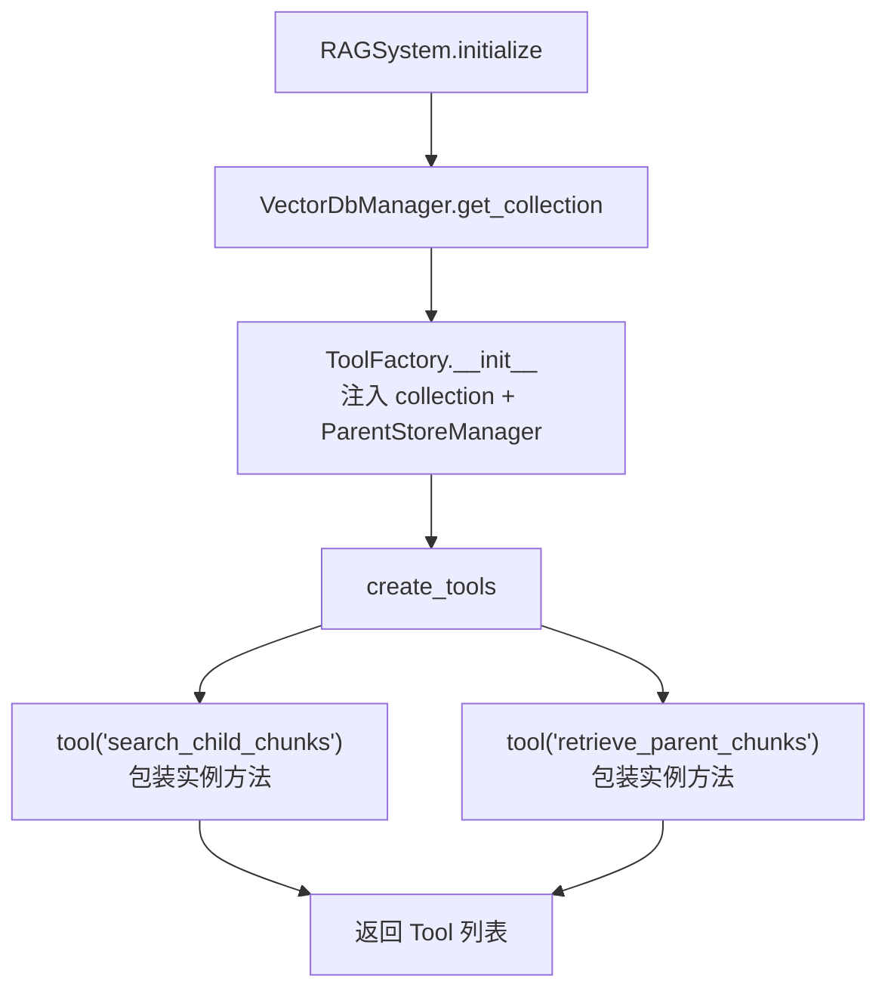
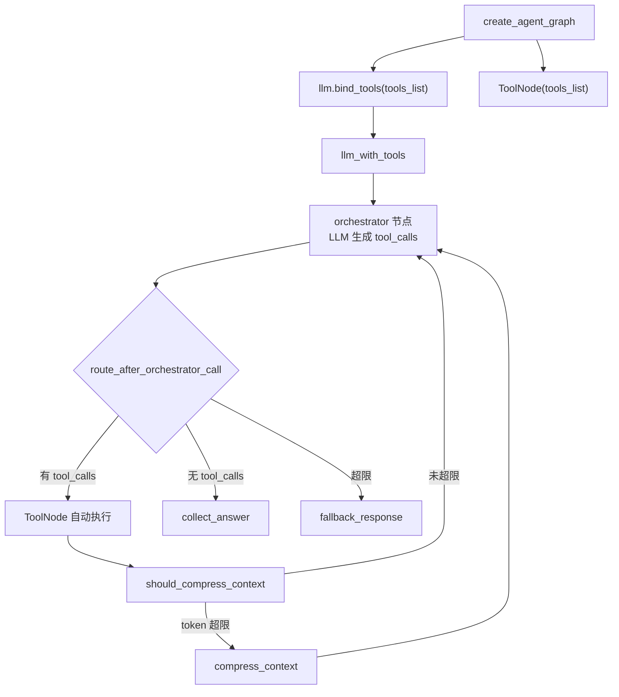

# PD-04.NN AgenticRAGForDummies — ToolFactory 工厂模式与 Parent-Child 双层检索工具

> 文档编号：PD-04.NN
> 来源：AgenticRAGForDummies `project/rag_agent/tools.py`
> GitHub：https://github.com/GiovanniPasq/agentic-rag-for-dummies.git
> 问题域：PD-04 工具系统 Tool System Design
> 状态：可复用方案

---

## 第 1 章 问题与动机

### 1.1 核心问题

在 RAG Agent 系统中，工具系统面临三个关键挑战：

1. **有状态工具的依赖注入**：检索工具需要访问向量数据库连接（Qdrant collection）和父文档存储（ParentStoreManager），这些是运行时才确定的有状态依赖。如果用全局变量传递，会导致测试困难、多实例冲突；如果用 `@tool` 装饰器直接定义顶层函数，则无法优雅地注入这些依赖。

2. **工具间协作约定**：Parent-Child 分层检索架构中，`search_child_chunks` 返回的 `parent_id` 必须被 `retrieve_parent_chunks` 正确消费。两个工具之间存在隐式的数据契约——child chunk 的 metadata 中必须包含 `parent_id` 字段，且该 ID 必须能在 ParentStoreManager 中找到对应的完整文档。

3. **工具调用去重**：Agent 在多轮迭代中可能重复搜索相同 query 或检索相同 parent_id，浪费 token 和计算资源。需要一种机制追踪已执行的操作，避免重复调用。

### 1.2 AgenticRAGForDummies 的解法概述

该项目采用 **ToolFactory 工厂模式** 解决有状态工具的依赖注入问题，核心设计：

1. **工厂类封装依赖**：`ToolFactory` 类在 `__init__` 中接收 `collection`（Qdrant 向量存储）并创建 `ParentStoreManager`，所有工具方法作为实例方法访问这些依赖（`tools.py:5-9`）
2. **`tool()` 装饰器动态包装**：`create_tools()` 方法用 LangChain 的 `tool("name")` 装饰器将实例方法转为 LangChain Tool 对象，保留方法的 docstring 作为 schema 描述（`tools.py:75-80`）
3. **ToolNode 自动执行**：LangGraph 的 `ToolNode` 接收工具列表，自动根据 LLM 的 `tool_calls` 分发执行，无需手动路由（`graph.py:12`）
4. **Prompt 驱动的去重**：通过 `retrieval_keys` 状态集合追踪已执行的 search query 和已检索的 parent_id，压缩后注入 prompt 告知 LLM 不要重复调用（`nodes.py:99-125`）
5. **双计数器硬限制**：`tool_call_count` 和 `iteration_count` 两个累加器提供硬性上限，防止无限工具调用循环（`edges.py:15-19`）

### 1.3 设计思想

| 设计原则 | 具体实现 | 理由 | 替代方案 |
|----------|----------|------|----------|
| 工厂模式注入依赖 | `ToolFactory(collection)` 封装 DB 连接 | 避免全局变量，支持多实例隔离 | 闭包注入、functools.partial |
| Docstring 即 Schema | `_search_child_chunks` 的 docstring 自动生成工具描述 | LangChain `@tool` 从 docstring 提取参数说明 | 手动定义 JSON Schema |
| Prompt 驱动去重 | `retrieval_keys` 集合 + 压缩上下文注入 | 软约束，LLM 自主判断是否需要重复 | 硬编码去重拦截器 |
| 双计数器保护 | `MAX_TOOL_CALLS=8` + `MAX_ITERATIONS=10` | 防止 LLM 陷入无限工具调用循环 | 单一递归深度限制 |
| 结构化错误返回 | `"RETRIEVAL_ERROR: {str(e)}"` 字符串 | LLM 可理解错误并调整策略 | 抛出异常中断流程 |

---

## 第 2 章 源码实现分析

### 2.1 架构概览

AgenticRAGForDummies 的工具系统采用三层架构：工厂层（ToolFactory）、绑定层（llm.bind_tools）、执行层（ToolNode）。

```
┌─────────────────────────────────────────────────────────┐
│                    RAGSystem.initialize()                │
│                    (rag_system.py:21-27)                 │
├─────────────────────────────────────────────────────────┤
│                                                         │
│  ┌──────────────┐    ┌──────────────┐    ┌───────────┐  │
│  │  VectorDB    │    │ ToolFactory  │    │  ChatOllama│  │
│  │  Manager     │───→│ (tools.py)   │    │  (LLM)    │  │
│  │  (Qdrant)    │    │              │    │           │  │
│  └──────────────┘    └──────┬───────┘    └─────┬─────┘  │
│                             │                  │        │
│                    create_tools()        bind_tools()    │
│                             │                  │        │
│                    ┌────────▼────────┐         │        │
│                    │ [search_child,  │─────────▼────┐   │
│                    │  retrieve_parent]│  llm_with_tools│  │
│                    └────────┬────────┘  └──────┬─────┘  │
│                             │                  │        │
│                    ┌────────▼────────┐         │        │
│                    │   ToolNode      │◄────────┘        │
│                    │  (自动分发执行)  │                   │
│                    └─────────────────┘                   │
└─────────────────────────────────────────────────────────┘
```

工具调用的完整生命周期：

```
orchestrator(LLM) → tool_calls → route_after_orchestrator_call
    → "tools" → ToolNode 自动执行 → should_compress_context
    → 判断 token 是否超限 → compress_context 或回到 orchestrator
```

### 2.2 核心实现

#### 2.2.1 ToolFactory 工厂模式



对应源码 `project/rag_agent/tools.py:5-80`：

```python
class ToolFactory:
    
    def __init__(self, collection):
        self.collection = collection
        self.parent_store_manager = ParentStoreManager()
    
    def _search_child_chunks(self, query: str, limit: int) -> str:
        """Search for the top K most relevant child chunks.
        
        Args:
            query: Search query string
            limit: Maximum number of results to return
        """
        try:
            results = self.collection.similarity_search(query, k=limit, score_threshold=0.7)
            if not results:
                return "NO_RELEVANT_CHUNKS"
            return "\n\n".join([
                f"Parent ID: {doc.metadata.get('parent_id', '')}\n"
                f"File Name: {doc.metadata.get('source', '')}\n"
                f"Content: {doc.page_content.strip()}"
                for doc in results
            ])            
        except Exception as e:
            return f"RETRIEVAL_ERROR: {str(e)}"
    
    def create_tools(self) -> List:
        """Create and return the list of tools."""
        search_tool = tool("search_child_chunks")(self._search_child_chunks)
        retrieve_tool = tool("retrieve_parent_chunks")(self._retrieve_parent_chunks)
        return [search_tool, retrieve_tool]
```

关键设计点：
- `tool("search_child_chunks")` 是 LangChain 的函数式装饰器用法，将实例方法包装为 `StructuredTool`，自动从 docstring 的 `Args:` 部分提取参数 schema（`tools.py:77`）
- `self.collection` 是 `QdrantVectorStore` 实例，通过工厂构造函数注入，避免全局状态（`tools.py:8`）
- 错误返回为字符串而非异常，让 LLM 能理解错误并调整策略（`tools.py:31`）

#### 2.2.2 工具绑定与自动执行



对应源码 `project/rag_agent/graph.py:10-32`：

```python
def create_agent_graph(llm, tools_list):
    llm_with_tools = llm.bind_tools(tools_list)
    tool_node = ToolNode(tools_list)

    agent_builder = StateGraph(AgentState)
    agent_builder.add_node("orchestrator", partial(orchestrator, llm_with_tools=llm_with_tools))
    agent_builder.add_node("tools", tool_node)
    agent_builder.add_node("compress_context", partial(compress_context, llm=llm))
    agent_builder.add_node("fallback_response", partial(fallback_response, llm=llm))
    
    agent_builder.add_edge(START, "orchestrator")    
    agent_builder.add_conditional_edges("orchestrator", route_after_orchestrator_call,
        {"tools": "tools", "fallback_response": "fallback_response", "collect_answer": "collect_answer"})
    agent_builder.add_edge("tools", "should_compress_context")
```

关键设计点：
- `llm.bind_tools(tools_list)` 将工具 schema 注入 LLM 的系统提示，LLM 输出包含 `tool_calls` 字段（`graph.py:11`）
- `ToolNode(tools_list)` 是 LangGraph 预构建节点，自动根据 `tool_calls` 中的工具名匹配并执行对应工具（`graph.py:12`）
- `partial(orchestrator, llm_with_tools=llm_with_tools)` 用 functools.partial 将绑定了工具的 LLM 注入节点函数（`graph.py:18`）

### 2.3 实现细节

#### 工具调用去重机制

去重通过 `retrieval_keys` 状态集合实现，在 `should_compress_context` 节点中追踪：

```python
# nodes.py:99-114
def should_compress_context(state: AgentState) -> Command[Literal["compress_context", "orchestrator"]]:
    new_ids: Set[str] = set()
    for msg in reversed(messages):
        if isinstance(msg, AIMessage) and getattr(msg, "tool_calls", None):
            for tc in msg.tool_calls:
                if tc["name"] == "retrieve_parent_chunks":
                    raw = tc["args"].get("parent_id") or tc["args"].get("id") or tc["args"].get("ids") or []
                    if isinstance(raw, str):
                        new_ids.add(f"parent::{raw}")
                elif tc["name"] == "search_child_chunks":
                    query = tc["args"].get("query", "")
                    if query:
                        new_ids.add(f"search::{query}")
            break
    updated_ids = state.get("retrieval_keys", set()) | new_ids
```

去重 key 使用 `parent::{id}` 和 `search::{query}` 前缀区分类型，在上下文压缩时注入 prompt（`nodes.py:153-162`）：

```python
# nodes.py:153-162
block = "\n\n---\n**Already executed (do NOT repeat):**\n"
if parent_ids:
    block += "Parent chunks retrieved:\n" + "\n".join(f"- {p.replace('parent::', '')}" for p in parent_ids) + "\n"
if search_queries:
    block += "Search queries already run:\n" + "\n".join(f"- {q}" for q in search_queries) + "\n"
new_summary += block
```

#### 双计数器硬限制

`AgentState` 中定义了两个累加器（`graph_state.py:29-30`）：

```python
tool_call_count: Annotated[int, operator.add] = 0
iteration_count: Annotated[int, operator.add] = 0
```

路由函数检查上限（`edges.py:15-19`）：

```python
def route_after_orchestrator_call(state: AgentState):
    iteration = state.get("iteration_count", 0)
    tool_count = state.get("tool_call_count", 0)
    if iteration >= MAX_ITERATIONS or tool_count > MAX_TOOL_CALLS:
        return "fallback_response"
```

`MAX_TOOL_CALLS=8`、`MAX_ITERATIONS=10` 在 `config.py:21-22` 中配置。超限后不是直接失败，而是路由到 `fallback_response` 节点，用已收集的上下文生成最佳答案。

#### 工具结果格式化

两个工具都返回结构化字符串，包含 `Parent ID`、`File Name`、`Content` 三个字段（`tools.py:23-27`）：

```
Parent ID: doc1_parent_0
File Name: report.pdf
Content: The quarterly revenue increased by 15%...
```

这种格式让 LLM 能：
1. 从 `search_child_chunks` 结果中提取 `Parent ID` 传给 `retrieve_parent_chunks`
2. 从 `File Name` 构建最终答案的 Sources 引用
3. 从 `Content` 获取实际信息

