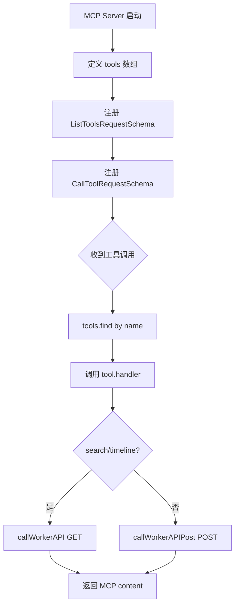
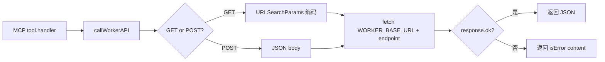
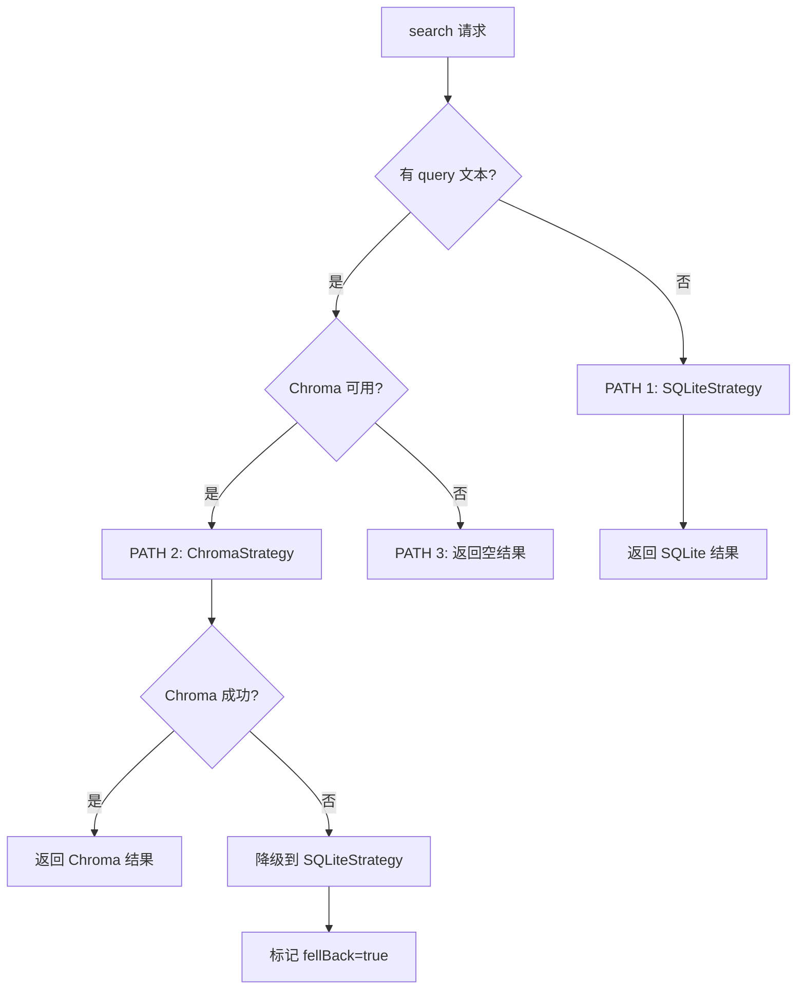

# PD-04.10 claude-mem — MCP 薄包装层 + 3-Layer Workflow 工具系统

> 文档编号：PD-04.10
> 来源：claude-mem `src/servers/mcp-server.ts`, `src/services/worker/SearchManager.ts`
> GitHub：https://github.com/thedotmack/claude-mem.git
> 问题域：PD-04 工具系统 Tool System Design
> 状态：可复用方案

---

## 第 1 章 问题与动机

### 1.1 核心问题

Agent 记忆系统的工具设计面临一个独特矛盾：记忆检索需要丰富的查询能力（语义搜索、时间线浏览、多维过滤），但 MCP 协议要求工具接口尽可能简洁——工具数量过多会稀释 LLM 的选择准确率，而单次返回全量数据又会浪费 token。

claude-mem 的核心挑战是：如何用最少的 MCP 工具暴露最丰富的检索能力，同时控制每次工具调用的 token 消耗？

### 1.2 claude-mem 的解法概述

1. **MCP 薄包装层**：MCP Server 仅定义 5 个工具（含 1 个 workflow 指引伪工具），所有业务逻辑委托给 Worker HTTP API（`src/servers/mcp-server.ts:42-45`）
2. **3-Layer Workflow 模式**：通过 `__IMPORTANT` 伪工具强制 LLM 遵循 search→timeline→get_observations 三步渐进式检索，每步 token 消耗递增（`src/servers/mcp-server.ts:159-191`）
3. **Strategy 模式搜索引擎**：SearchOrchestrator 根据查询条件自动选择 Chroma/SQLite/Hybrid 三种策略，带自动降级（`src/services/worker/search/SearchOrchestrator.ts:81-121`）
4. **双层 API 架构**：MCP 工具 → Worker HTTP API → SearchManager → SearchOrchestrator → Strategy，每层职责清晰分离
5. **结果格式化为 Markdown 表格**：搜索结果以紧凑的 `| ID | Time | T | Title | Read |` 表格返回，每条约 50-100 token，比返回全文节省 10x（`src/services/worker/FormattingService.ts:56-67`）

### 1.3 设计思想

| 设计原则 | 具体实现 | 理由 | 替代方案 |
|----------|----------|------|----------|
| 工具数量极简 | 5 个 MCP 工具（含 1 个伪工具） | LLM 工具选择准确率与工具数量负相关 | 暴露 15+ 细粒度工具（GPT-Researcher 风格） |
| 渐进式信息披露 | 3-Layer: index→context→detail | 避免首次查询就返回全量数据浪费 token | 一次性返回完整结果 |
| 伪工具引导 | `__IMPORTANT` 工具描述 workflow | 利用 LLM 的 tool listing 机制传递使用规范 | 依赖 system prompt 说明 |
| 薄包装层 | MCP Server 仅做协议转换 | 业务逻辑集中在 Worker，MCP 层可独立演进 | MCP Server 内嵌业务逻辑 |
| 策略模式降级 | Chroma 失败自动降级到 SQLite | 向量数据库是可选依赖，核心功能不受影响 | 硬依赖 Chroma，失败即报错 |

---

## 第 2 章 源码实现分析

### 2.1 架构概览

claude-mem 的工具系统采用四层架构，MCP Server 作为最外层的薄包装，所有业务逻辑下沉到 Worker 服务：

```
┌─────────────────────────────────────────────────────────┐
│  MCP Server (mcp-server.ts)                             │
│  5 tools: __IMPORTANT, search, timeline,                │
│           get_observations, save_observation             │
│  职责: MCP 协议处理 + HTTP 转发                          │
├─────────────────────────────────────────────────────────┤
│  Worker HTTP API (SearchRoutes.ts + MemoryRoutes.ts)    │
│  15+ endpoints: /api/search, /api/timeline, ...         │
│  职责: HTTP 路由 + 参数校验 + 错误处理                    │
├─────────────────────────────────────────────────────────┤
│  SearchManager (SearchManager.ts)                       │
│  方法: search(), timeline(), decisions(), changes()...  │
│  职责: 参数归一化 + 结果格式化 + 多类型聚合               │
├─────────────────────────────────────────────────────────┤
│  SearchOrchestrator + Strategies                        │
│  ChromaStrategy / SQLiteStrategy / HybridStrategy       │
│  职责: 策略选择 + 搜索执行 + 自动降级                     │
└─────────────────────────────────────────────────────────┘
```

### 2.2 核心实现

#### 2.2.1 MCP 工具注册：数组式声明 + handler 闭包



对应源码 `src/servers/mcp-server.ts:157-262`：

```typescript
// 工具定义：数组式声明，每个工具包含 name/description/inputSchema/handler
const tools = [
  {
    name: '__IMPORTANT',
    description: `3-LAYER WORKFLOW (ALWAYS FOLLOW):
1. search(query) → Get index with IDs (~50-100 tokens/result)
2. timeline(anchor=ID) → Get context around interesting results
3. get_observations([IDs]) → Fetch full details ONLY for filtered IDs
NEVER fetch full details without filtering first. 10x token savings.`,
    inputSchema: { type: 'object', properties: {} },
    handler: async () => ({ content: [{ type: 'text' as const, text: `...` }] })
  },
  {
    name: 'search',
    description: 'Step 1: Search memory. Returns index with IDs.',
    inputSchema: { type: 'object', properties: {}, additionalProperties: true },
    handler: async (args: any) => {
      const endpoint = TOOL_ENDPOINT_MAP['search'];
      return await callWorkerAPI(endpoint, args);
    }
  },
  // ... timeline, get_observations, save_observation
];

// MCP 协议注册
server.setRequestHandler(ListToolsRequestSchema, async () => ({
  tools: tools.map(tool => ({
    name: tool.name, description: tool.description, inputSchema: tool.inputSchema
  }))
}));

server.setRequestHandler(CallToolRequestSchema, async (request) => {
  const tool = tools.find(t => t.name === request.params.name);
  if (!tool) throw new Error(`Unknown tool: ${request.params.name}`);
  return await tool.handler(request.params.arguments || {});
});
```

关键设计点：
- 工具 schema 使用 `additionalProperties: true`，允许 LLM 传入任意参数，由 Worker 端做归一化（`mcp-server.ts:198-199`）
- `__IMPORTANT` 伪工具利用 MCP 的 `tools/list` 机制，在 LLM 获取工具列表时就传递 workflow 规范
- handler 闭包捕获 `TOOL_ENDPOINT_MAP` 和 `callWorkerAPI`，实现声明式路由

#### 2.2.2 Worker HTTP 转发：薄包装层模式



对应源码 `src/servers/mcp-server.ts:50-90`：

```typescript
const TOOL_ENDPOINT_MAP: Record<string, string> = {
  'search': '/api/search',
  'timeline': '/api/timeline'
};

async function callWorkerAPI(
  endpoint: string,
  params: Record<string, any>
): Promise<{ content: Array<{ type: 'text'; text: string }>; isError?: boolean }> {
  const searchParams = new URLSearchParams();
  for (const [key, value] of Object.entries(params)) {
    if (value !== undefined && value !== null) {
      searchParams.append(key, String(value));
    }
  }
  const url = `${WORKER_BASE_URL}${endpoint}?${searchParams}`;
  const response = await fetch(url);
  if (!response.ok) {
    const errorText = await response.text();
    throw new Error(`Worker API error (${response.status}): ${errorText}`);
  }
  return await response.json();
}
```

MCP Server 从原来的 2,718 行重构到约 375 行（`mcp-server.ts:1-7` 注释），核心就是协议转换 + HTTP 转发。

#### 2.2.3 SearchOrchestrator：策略模式 + 自动降级



对应源码 `src/services/worker/search/SearchOrchestrator.ts:81-121`：

```typescript
private async executeWithFallback(
  options: NormalizedParams
): Promise<StrategySearchResult> {
  // PATH 1: FILTER-ONLY (no query text) - Use SQLite
  if (!options.query) {
    return await this.sqliteStrategy.search(options);
  }
  // PATH 2: CHROMA SEMANTIC SEARCH (query text + Chroma available)
  if (this.chromaStrategy) {
    const result = await this.chromaStrategy.search(options);
    if (result.usedChroma) {
      return result;  // Chroma succeeded (even with 0 results)
    }
    // Chroma failed - fall back to SQLite for filter-only
    const fallbackResult = await this.sqliteStrategy.search({
      ...options, query: undefined
    });
    return { ...fallbackResult, fellBack: true };
  }
  // PATH 3: No Chroma available
  return { results: { observations: [], sessions: [], prompts: [] },
           usedChroma: false, fellBack: false, strategy: 'sqlite' };
}
```

Strategy 接口定义（`src/services/worker/search/strategies/SearchStrategy.ts:16-35`）：

```typescript
export interface SearchStrategy {
  search(options: StrategySearchOptions): Promise<StrategySearchResult>;
  canHandle(options: StrategySearchOptions): boolean;
  readonly name: string;
}

export abstract class BaseSearchStrategy implements SearchStrategy {
  protected emptyResult(strategy: 'chroma' | 'sqlite' | 'hybrid'): StrategySearchResult {
    return {
      results: { observations: [], sessions: [], prompts: [] },
      usedChroma: strategy === 'chroma' || strategy === 'hybrid',
      fellBack: false, strategy
    };
  }
}
```

### 2.3 实现细节

**参数归一化链**：MCP 工具接收的原始参数经过两层归一化：
1. SearchManager.normalizeParams（`SearchManager.ts:71-118`）：URL 友好格式转内部格式（逗号分隔→数组，dateStart/dateEnd→dateRange 对象）
2. SearchOrchestrator.normalizeParams（`SearchOrchestrator.ts:239-282`）：API 一致性映射（type→searchType）

**结果格式化**：FormattingService 将搜索结果压缩为 Markdown 表格（`FormattingService.ts:56-67`），每条结果约 50-100 token：
```
| #42 | 3:30 PM | 🔵 | Implemented retry logic | ~120 |
```

**MCP stdout 保护**：MCP 使用 stdio 传输，stdout 保留给 JSON-RPC。`mcp-server.ts:19-22` 拦截 `console.log` 重定向到 stderr，防止日志破坏协议。

**孤儿进程检测**：`mcp-server.ts:311-332` 通过 ppid 心跳检测父进程是否存活，防止 MCP Server 成为孤儿进程。

**BaseRouteHandler 统一错误处理**：所有 HTTP 路由继承 `BaseRouteHandler`（`BaseRouteHandler.ts:15-86`），提供 wrapHandler 自动 try-catch、参数校验、标准错误响应。


---

## 第 3 章 迁移指南

### 3.1 迁移清单

**阶段 1：MCP 薄包装层**
- [ ] 安装 `@modelcontextprotocol/sdk`
- [ ] 创建 MCP Server，使用 StdioServerTransport
- [ ] 定义工具数组（name/description/inputSchema/handler）
- [ ] 实现 callWorkerAPI 函数，将 MCP 调用转发到内部 HTTP API
- [ ] 拦截 console.log 到 stderr（MCP stdio 保护）
- [ ] 添加 ppid 心跳检测防止孤儿进程

**阶段 2：3-Layer Workflow**
- [ ] 创建 `__IMPORTANT` 伪工具，在 description 中写明 workflow 规范
- [ ] 实现 search 工具：返回紧凑索引（ID + 标题 + 时间）
- [ ] 实现 timeline 工具：围绕锚点返回上下文窗口
- [ ] 实现 get_details 工具：按 ID 批量获取完整内容
- [ ] 实现 FormattingService：将结果压缩为 Markdown 表格

**阶段 3：Strategy 模式搜索引擎**
- [ ] 定义 SearchStrategy 接口（search + canHandle + name）
- [ ] 实现 BaseSearchStrategy 抽象基类
- [ ] 实现具体策略（向量搜索、SQL 过滤、混合搜索）
- [ ] 实现 SearchOrchestrator 的 executeWithFallback 降级链

### 3.2 适配代码模板

#### MCP 薄包装层模板（TypeScript）

```typescript
import { Server } from '@modelcontextprotocol/sdk/server/index.js';
import { StdioServerTransport } from '@modelcontextprotocol/sdk/server/stdio.js';
import { CallToolRequestSchema, ListToolsRequestSchema } from '@modelcontextprotocol/sdk/types.js';

// 1. 定义工具到内部 API 的映射
const WORKER_BASE_URL = `http://localhost:${process.env.WORKER_PORT || 8080}`;

interface ToolDef {
  name: string;
  description: string;
  inputSchema: Record<string, any>;
  handler: (args: any) => Promise<{ content: Array<{ type: 'text'; text: string }>; isError?: boolean }>;
}

// 2. 声明式工具定义
const tools: ToolDef[] = [
  {
    name: '__IMPORTANT',
    description: 'WORKFLOW: 1) search → index  2) detail(id) → full content. Never fetch all.',
    inputSchema: { type: 'object', properties: {} },
    handler: async () => ({
      content: [{ type: 'text' as const, text: 'Use search first, then detail by ID.' }]
    })
  },
  {
    name: 'search',
    description: 'Search items. Returns compact index with IDs.',
    inputSchema: { type: 'object', properties: {}, additionalProperties: true },
    handler: async (args) => {
      const params = new URLSearchParams();
      for (const [k, v] of Object.entries(args)) {
        if (v != null) params.append(k, String(v));
      }
      const res = await fetch(`${WORKER_BASE_URL}/api/search?${params}`);
      return await res.json();
    }
  },
  {
    name: 'get_detail',
    description: 'Fetch full details by IDs. Always filter with search first.',
    inputSchema: {
      type: 'object',
      properties: { ids: { type: 'array', items: { type: 'number' } } },
      required: ['ids']
    },
    handler: async (args) => {
      const res = await fetch(`${WORKER_BASE_URL}/api/detail`, {
        method: 'POST',
        headers: { 'Content-Type': 'application/json' },
        body: JSON.stringify(args)
      });
      return { content: [{ type: 'text' as const, text: JSON.stringify(await res.json(), null, 2) }] };
    }
  }
];

// 3. MCP Server 注册
const server = new Server({ name: 'my-tool', version: '1.0.0' }, { capabilities: { tools: {} } });

server.setRequestHandler(ListToolsRequestSchema, async () => ({
  tools: tools.map(({ name, description, inputSchema }) => ({ name, description, inputSchema }))
}));

server.setRequestHandler(CallToolRequestSchema, async (req) => {
  const tool = tools.find(t => t.name === req.params.name);
  if (!tool) throw new Error(`Unknown tool: ${req.params.name}`);
  try {
    return await tool.handler(req.params.arguments || {});
  } catch (e) {
    return { content: [{ type: 'text' as const, text: `Error: ${e}` }], isError: true };
  }
});

// 4. 启动
const transport = new StdioServerTransport();
await server.connect(transport);
```

#### Strategy 模式搜索引擎模板

```typescript
// 策略接口
interface SearchStrategy {
  search(options: SearchOptions): Promise<SearchResult>;
  canHandle(options: SearchOptions): boolean;
  readonly name: string;
}

// 编排器：策略选择 + 降级
class SearchOrchestrator {
  private strategies: SearchStrategy[];
  private fallback: SearchStrategy;

  constructor(strategies: SearchStrategy[], fallback: SearchStrategy) {
    this.strategies = strategies;
    this.fallback = fallback;
  }

  async search(options: SearchOptions): Promise<SearchResult> {
    // 选择第一个能处理的策略
    const strategy = this.strategies.find(s => s.canHandle(options));
    if (!strategy) return this.fallback.search(options);

    try {
      const result = await strategy.search(options);
      if (result.success) return result;
    } catch (e) {
      console.error(`Strategy ${strategy.name} failed, falling back`);
    }
    // 降级到 fallback
    return { ...await this.fallback.search(options), fellBack: true };
  }
}
```

### 3.3 适用场景

| 场景 | 适用度 | 说明 |
|------|--------|------|
| MCP 工具暴露内部服务 | ⭐⭐⭐ | 薄包装层模式完美适配，MCP 层仅做协议转换 |
| 记忆/知识库检索系统 | ⭐⭐⭐ | 3-Layer Workflow 显著节省 token |
| 多后端搜索引擎 | ⭐⭐⭐ | Strategy 模式 + 自动降级适合向量+SQL 混合场景 |
| 简单 CRUD 工具 | ⭐ | 过度设计，直接在 MCP handler 中实现即可 |
| 实时流式工具 | ⭐⭐ | 需要额外处理 SSE/WebSocket，薄包装层需扩展 |

---

## 第 4 章 测试用例

```python
import pytest
from unittest.mock import AsyncMock, MagicMock, patch
from dataclasses import dataclass
from typing import Optional

# === 模拟 claude-mem 的核心类型 ===

@dataclass
class ToolDef:
    name: str
    description: str
    input_schema: dict
    handler: callable

@dataclass
class SearchResult:
    observations: list
    sessions: list
    prompts: list
    used_chroma: bool = False
    fell_back: bool = False
    strategy: str = "sqlite"

@dataclass
class MCPContent:
    type: str
    text: str

# === 模拟 MCP 薄包装层 ===

class MCPToolRegistry:
    """模拟 claude-mem 的工具注册机制"""
    def __init__(self):
        self.tools: list[ToolDef] = []

    def register(self, tool: ToolDef):
        self.tools.append(tool)

    def list_tools(self):
        return [{"name": t.name, "description": t.description,
                 "inputSchema": t.input_schema} for t in self.tools]

    async def call_tool(self, name: str, args: dict):
        tool = next((t for t in self.tools if t.name == name), None)
        if not tool:
            raise ValueError(f"Unknown tool: {name}")
        return await tool.handler(args)


class SearchOrchestrator:
    """模拟 claude-mem 的策略模式搜索"""
    def __init__(self, chroma_available: bool = True):
        self.chroma_available = chroma_available
        self.chroma_healthy = True

    async def search(self, options: dict) -> SearchResult:
        query = options.get("query")
        if not query:
            return SearchResult(observations=[{"id": 1}], sessions=[], prompts=[],
                                strategy="sqlite")
        if self.chroma_available and self.chroma_healthy:
            return SearchResult(observations=[{"id": 1}], sessions=[], prompts=[],
                                used_chroma=True, strategy="chroma")
        if self.chroma_available and not self.chroma_healthy:
            return SearchResult(observations=[], sessions=[], prompts=[],
                                fell_back=True, strategy="sqlite")
        return SearchResult(observations=[], sessions=[], prompts=[], strategy="sqlite")


# === 测试用例 ===

class TestMCPToolRegistry:
    """测试 MCP 工具注册与调用"""

    def setup_method(self):
        self.registry = MCPToolRegistry()

    def test_register_and_list_tools(self):
        """工具注册后应出现在 list_tools 中"""
        tool = ToolDef(
            name="search", description="Search memory",
            input_schema={"type": "object", "additionalProperties": True},
            handler=AsyncMock(return_value={"content": [{"type": "text", "text": "ok"}]})
        )
        self.registry.register(tool)
        tools = self.registry.list_tools()
        assert len(tools) == 1
        assert tools[0]["name"] == "search"

    def test_important_pseudo_tool_in_listing(self):
        """__IMPORTANT 伪工具应出现在工具列表中"""
        pseudo = ToolDef(
            name="__IMPORTANT",
            description="3-LAYER WORKFLOW: search→timeline→detail",
            input_schema={"type": "object", "properties": {}},
            handler=AsyncMock()
        )
        self.registry.register(pseudo)
        tools = self.registry.list_tools()
        assert any(t["name"] == "__IMPORTANT" for t in tools)
        assert "3-LAYER" in tools[0]["description"]

    @pytest.mark.asyncio
    async def test_call_unknown_tool_raises(self):
        """调用未注册工具应抛出 ValueError"""
        with pytest.raises(ValueError, match="Unknown tool"):
            await self.registry.call_tool("nonexistent", {})

    @pytest.mark.asyncio
    async def test_call_tool_delegates_to_handler(self):
        """工具调用应委托给 handler"""
        handler = AsyncMock(return_value={"content": [{"type": "text", "text": "result"}]})
        tool = ToolDef(name="search", description="", input_schema={}, handler=handler)
        self.registry.register(tool)
        result = await self.registry.call_tool("search", {"query": "test"})
        handler.assert_called_once_with({"query": "test"})
        assert result["content"][0]["text"] == "result"


class TestSearchOrchestrator:
    """测试策略选择与降级"""

    @pytest.mark.asyncio
    async def test_filter_only_uses_sqlite(self):
        """无 query 时应使用 SQLite 策略"""
        orch = SearchOrchestrator(chroma_available=True)
        result = await orch.search({"limit": 10})
        assert result.strategy == "sqlite"
        assert not result.used_chroma

    @pytest.mark.asyncio
    async def test_query_with_chroma_uses_chroma(self):
        """有 query 且 Chroma 可用时应使用 Chroma"""
        orch = SearchOrchestrator(chroma_available=True)
        result = await orch.search({"query": "authentication"})
        assert result.used_chroma
        assert result.strategy == "chroma"

    @pytest.mark.asyncio
    async def test_chroma_failure_falls_back(self):
        """Chroma 失败时应降级到 SQLite"""
        orch = SearchOrchestrator(chroma_available=True)
        orch.chroma_healthy = False
        result = await orch.search({"query": "test"})
        assert result.fell_back
        assert result.strategy == "sqlite"

    @pytest.mark.asyncio
    async def test_no_chroma_returns_empty(self):
        """Chroma 不可用时应返回空结果"""
        orch = SearchOrchestrator(chroma_available=False)
        result = await orch.search({"query": "test"})
        assert not result.used_chroma
        assert len(result.observations) == 0


class TestParameterNormalization:
    """测试参数归一化"""

    def test_comma_separated_to_array(self):
        """逗号分隔字符串应转为数组"""
        raw = "bugfix,feature,refactor"
        result = [s.strip() for s in raw.split(",") if s.strip()]
        assert result == ["bugfix", "feature", "refactor"]

    def test_date_range_flattening(self):
        """dateStart/dateEnd 应合并为 dateRange"""
        params = {"dateStart": "2025-01-01", "dateEnd": "2025-06-01"}
        normalized = {
            "dateRange": {"start": params.pop("dateStart"), "end": params.pop("dateEnd")}
        }
        assert "dateStart" not in normalized
        assert normalized["dateRange"]["start"] == "2025-01-01"

    def test_additional_properties_passthrough(self):
        """additionalProperties=true 允许任意参数透传"""
        schema = {"type": "object", "properties": {}, "additionalProperties": True}
        args = {"query": "test", "custom_filter": "value", "limit": 5}
        # 所有参数都应被接受（不做 schema 校验）
        assert all(k in args for k in ["query", "custom_filter", "limit"])
```


---

## 第 5 章 跨域关联

| 关联域 | 关系类型 | 说明 |
|--------|----------|------|
| PD-01 上下文管理 | 协同 | 3-Layer Workflow 的核心目标就是控制 token 消耗，search 返回索引（~50 token/条）而非全文（~500 token/条），直接服务于上下文窗口管理 |
| PD-03 容错与重试 | 依赖 | SearchOrchestrator 的 Chroma→SQLite 自动降级是容错模式的具体应用，`fellBack` 标记让调用方知道降级发生 |
| PD-06 记忆持久化 | 协同 | save_observation 工具是记忆写入的 MCP 入口，底层通过 SessionStore + ChromaSync 双写 SQLite 和向量数据库 |
| PD-08 搜索与检索 | 依赖 | 工具系统的 search/timeline 工具直接依赖 SearchOrchestrator 的多策略搜索引擎，Strategy 模式是 PD-08 的核心实现 |
| PD-10 中间件管道 | 协同 | BaseRouteHandler.wrapHandler 提供统一的 try-catch 中间件，HTTP middleware 层处理 CORS、日志、静态文件 |
| PD-11 可观测性 | 协同 | 每个搜索策略通过 logger.debug 记录策略选择、结果数量、降级事件，支持调试和性能分析 |

---

## 第 6 章 来源文件索引

| 文件 | 行范围 | 关键实现 |
|------|--------|----------|
| `src/servers/mcp-server.ts` | L1-375 | MCP Server 完整实现：工具定义、协议注册、HTTP 转发、孤儿进程检测 |
| `src/servers/mcp-server.ts` | L157-262 | 5 个工具的声明式定义（含 __IMPORTANT 伪工具） |
| `src/servers/mcp-server.ts` | L42-45 | TOOL_ENDPOINT_MAP：工具名到 HTTP 端点的映射 |
| `src/servers/mcp-server.ts` | L50-90 | callWorkerAPI：MCP→HTTP 转发函数 |
| `src/services/worker/SearchManager.ts` | L35-53 | SearchManager 构造器：初始化 Orchestrator + TimelineBuilder |
| `src/services/worker/SearchManager.ts` | L71-118 | normalizeParams：URL 参数归一化（逗号分隔→数组） |
| `src/services/worker/SearchManager.ts` | L123-367 | search() 工具处理器：三路径搜索（filter-only / Chroma / fallback） |
| `src/services/worker/SearchManager.ts` | L372-645 | timeline() 工具处理器：锚点/查询双模式时间线 |
| `src/services/worker/search/SearchOrchestrator.ts` | L44-66 | 策略初始化：根据 ChromaSync 可用性创建策略实例 |
| `src/services/worker/search/SearchOrchestrator.ts` | L81-121 | executeWithFallback：三路径策略选择 + 自动降级 |
| `src/services/worker/search/strategies/SearchStrategy.ts` | L16-61 | SearchStrategy 接口 + BaseSearchStrategy 抽象基类 |
| `src/services/worker/search/types.ts` | L14-19 | SEARCH_CONSTANTS：90 天时效窗口、默认限制、批量大小 |
| `src/services/worker/FormattingService.ts` | L13-171 | 结果格式化：Markdown 表格、token 估算、时间去重 |
| `src/services/worker/TimelineService.ts` | L25-263 | 时间线构建：buildTimeline + filterByDepth + formatTimeline |
| `src/services/worker/http/BaseRouteHandler.ts` | L15-86 | HTTP 路由基类：wrapHandler、参数校验、错误处理 |
| `src/services/worker/http/routes/SearchRoutes.ts` | L13-370 | 15+ HTTP 端点注册，全部委托给 SearchManager |
| `src/services/worker/http/routes/MemoryRoutes.ts` | L13-93 | save_observation 的 HTTP 实现：SQLite 写入 + ChromaDB 异步同步 |
| `src/services/worker/http/middleware.ts` | L19-107 | Express 中间件：JSON 解析、CORS localhost 限制、请求日志 |
| `src/services/worker/search/index.ts` | L1-29 | 搜索模块公共 API：导出 Orchestrator、Strategies、Filters |

---

## 第 7 章 横向对比维度

> **重要：** 本章用于自动填充 Butcher Wiki 的横向对比表。

```json comparison_data
{
  "project": "claude-mem",
  "dimensions": {
    "工具注册方式": "数组式声明 + handler 闭包，MCP SDK setRequestHandler 注册",
    "工具分组/权限": "无分组，5 个工具平铺；CORS 限制 localhost 访问",
    "MCP 协议支持": "原生 MCP SDK，StdioServerTransport，薄包装层委托 Worker HTTP",
    "热更新/缓存": "无热更新；Chroma 可用性运行时检测，策略动态切换",
    "超时保护": "Worker health check 超时检测；ppid 心跳防孤儿进程",
    "结果摘要": "Markdown 表格索引（~50-100 token/条），3-Layer 渐进披露",
    "生命周期追踪": "StrategySearchResult.usedChroma/fellBack 标记策略路径",
    "参数校验": "additionalProperties=true 宽松 schema + Worker 端归一化校验",
    "安全防护": "CORS localhost-only + requireLocalhost 中间件 + console.log 拦截",
    "伪工具引导": "__IMPORTANT 伪工具在 tools/list 时传递 workflow 规范",
    "双层API架构": "MCP→Worker HTTP→SearchManager→Orchestrator 四层分离"
  }
}
```

### 域元数据补充

```json domain_metadata
{
  "solution_summary": "claude-mem 用 MCP 薄包装层 + __IMPORTANT 伪工具 + 3-Layer Workflow（search→timeline→detail）实现 5 工具极简接口，Strategy 模式搜索引擎支持 Chroma/SQLite/Hybrid 自动降级",
  "description": "MCP 协议下的工具数量极简化与渐进式信息披露策略",
  "sub_problems": [
    "伪工具引导：如何利用 tools/list 机制向 LLM 传递工具使用规范",
    "MCP stdout 保护：stdio 传输下如何防止日志破坏 JSON-RPC 协议",
    "工具结果 token 预算：如何设计分层返回格式控制每次调用的 token 消耗"
  ],
  "best_practices": [
    "MCP Server 应做薄包装层：协议转换 + HTTP 转发，业务逻辑下沉到独立服务",
    "用伪工具（__IMPORTANT）在 tools/list 中传递 workflow 规范比 system prompt 更可靠",
    "搜索结果先返回索引再按需获取详情，可节省 10x token 消耗"
  ]
}
```

