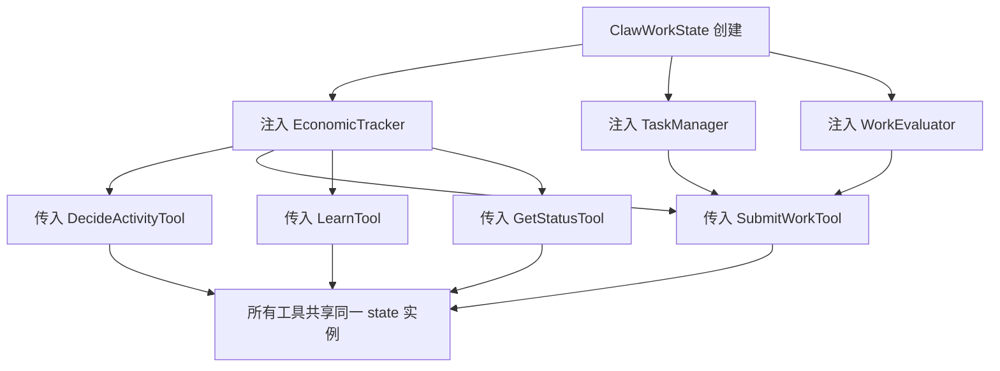
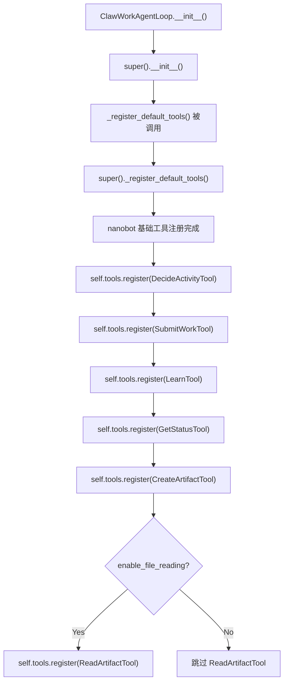
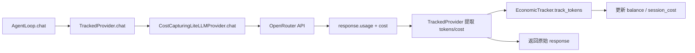

# PD-04.CW ClawWork — 经济工具注册与共享状态驱动

> 文档编号：PD-04.CW
> 来源：ClawWork `clawmode_integration/tools.py` `clawmode_integration/agent_loop.py` `clawmode_integration/artifact_tools.py`
> GitHub：https://github.com/HKUDS/ClawWork.git
> 问题域：PD-04 工具系统 Tool System Design
> 状态：可复用方案

---

## 第 1 章 问题与动机

### 1.1 核心问题

Agent 工具系统面临一个常见挑战：当工具之间需要共享可变状态（如经济余额、当前任务、评估结果）时，如何在保持工具独立性的同时实现状态一致性？

传统做法是使用全局字典（`_global_state`）在工具间传递状态，但这带来三个问题：
1. **类型不安全** — 字典键名拼写错误只能在运行时发现
2. **状态边界模糊** — 任何工具都能读写任何字段，无法约束访问范围
3. **测试困难** — 全局状态导致测试间相互污染

ClawWork 的场景更复杂：它是一个经济模拟系统，Agent 需要通过工具进行"工作"（submit_work）、"学习"（learn）、"决策"（decide_activity）等经济行为，每个工具调用都涉及余额变动、评估打分、成本追踪。工具不仅要执行功能，还要参与经济循环。

### 1.2 ClawWork 的解法概述

ClawWork 通过 nanobot 框架的 `Tool` ABC 基类和 `ToolRegistry` 注册表，构建了一套 6 工具经济系统：

1. **共享状态 dataclass** — `ClawWorkState` 替代全局字典，类型安全地在工具间传递经济追踪器、任务管理器、评估器等共享依赖（`clawmode_integration/tools.py:29-42`）
2. **继承式工具注册** — `ClawWorkAgentLoop._register_default_tools()` 先调用 `super()` 注册 nanobot 基础工具，再追加 6 个经济工具，支持条件加载（`clawmode_integration/agent_loop.py:76-85`）
3. **Property 驱动 Schema** — 每个工具通过 `name`/`description`/`parameters` 三个 `@property` 声明 JSON Schema，LLM 直接消费（`clawmode_integration/tools.py:54-82`）
4. **透明 Provider 包装** — `TrackedProvider` 装饰器模式包装 LLM Provider，在不修改 nanobot 源码的前提下实现每次 `chat()` 调用的自动成本追踪（`clawmode_integration/provider_wrapper.py:37-72`）
5. **工具内参数校验** — 每个工具在 `execute()` 内部做业务级校验（最小长度、枚举值、文件存在性），返回结构化 JSON 错误（`clawmode_integration/tools.py:84-98`）

### 1.3 设计思想

| 设计原则 | 具体实现 | 理由 | 替代方案 |
|----------|----------|------|----------|
| 状态注入替代全局变量 | `ClawWorkState` dataclass 通过构造函数注入每个 Tool | 类型安全 + 可测试 + 状态边界清晰 | 全局字典 `_global_state`（原始方案） |
| 继承式工具扩展 | `super()._register_default_tools()` + 追加注册 | 不修改基类代码，保持 nanobot 独立性 | 猴子补丁 / 配置文件声明 |
| Property 即 Schema | `@property parameters` 返回 JSON Schema dict | 工具定义和实现在同一文件，无需额外 schema 文件 | 外部 YAML/JSON schema 文件 |
| 透明代理追踪 | `TrackedProvider.__getattr__` 转发非 chat 属性 | 零侵入成本追踪，nanobot 无感知 | 修改 nanobot 源码 / 中间件 |
| 条件工具加载 | `if self._lb.enable_file_reading` 控制 ReadArtifactTool | 按配置裁剪工具集，减少 LLM 选择负担 | 全量注册 + 运行时权限检查 |

---

## 第 2 章 源码实现分析

### 2.1 架构概览

ClawWork 的工具系统分为三层：nanobot 基础层（Tool ABC + ToolRegistry）、ClawWork 经济工具层（6 个领域工具）、集成层（AgentLoop + Provider 包装）。

```
┌─────────────────────────────────────────────────────────────┐
│                    ClawWorkAgentLoop                         │
│  ┌──────────────────┐  ┌──────────────────────────────────┐ │
│  │  TrackedProvider  │  │        ToolRegistry               │ │
│  │  (cost tracking)  │  │  ┌────────────┐ ┌─────────────┐ │ │
│  │  ┌──────────────┐ │  │  │ nanobot    │ │ ClawWork    │ │ │
│  │  │ LiteLLMProv  │ │  │  │ base tools │ │ 6 tools     │ │ │
│  │  │ (wrapped)    │ │  │  └────────────┘ └─────────────┘ │ │
│  │  └──────────────┘ │  └──────────────────────────────────┘ │
│  └──────────────────┘                                        │
│                          ┌──────────────────────────────────┐│
│                          │       ClawWorkState (shared)      ││
│                          │  economic_tracker | task_manager   ││
│                          │  evaluator | signature | data_path││
│                          └──────────────────────────────────┘│
└─────────────────────────────────────────────────────────────┘
```

### 2.2 核心实现

#### 2.2.1 共享状态 dataclass



对应源码 `clawmode_integration/tools.py:29-42`：

```python
@dataclass
class ClawWorkState:
    """Mutable state shared across all ClawWork tools within a session."""
    economic_tracker: Any  # clawwork.agent.economic_tracker.EconomicTracker
    task_manager: Any      # clawwork.work.task_manager.TaskManager
    evaluator: Any         # clawwork.work.evaluator.WorkEvaluator
    signature: str = ""
    current_date: str | None = None
    current_task: dict | None = None
    data_path: str = ""
    supports_multimodal: bool = True
    enable_file_reading: bool = True
```

关键设计：`ClawWorkState` 是一个可变 dataclass，所有工具通过构造函数接收同一实例。当 `SubmitWorkTool` 修改 `current_task` 或 `EconomicTracker` 更新余额时，其他工具立即可见。这比全局字典安全，因为字段名在 IDE 中有自动补全和类型检查。

#### 2.2.2 继承式工具注册



对应源码 `clawmode_integration/agent_loop.py:76-85`：

```python
def _register_default_tools(self) -> None:
    """Register all nanobot tools plus ClawWork tools."""
    super()._register_default_tools()
    self.tools.register(DecideActivityTool(self._lb))
    self.tools.register(SubmitWorkTool(self._lb))
    self.tools.register(LearnTool(self._lb))
    self.tools.register(GetStatusTool(self._lb))
    self.tools.register(CreateArtifactTool(self._lb))
    if self._lb.enable_file_reading:
        self.tools.register(ReadArtifactTool(self._lb))
```

注意第 84 行的条件加载：`ReadArtifactTool` 只在 `enable_file_reading=True` 时注册。这是一种轻量级的工具集动态组合——通过配置控制工具可见性，而非运行时权限检查。

#### 2.2.3 Property 驱动的 Tool Schema

每个工具通过三个 `@property` 向 LLM 暴露自己的能力。以 `DecideActivityTool` 为例（`clawmode_integration/tools.py:48-82`）：

```python
class DecideActivityTool(Tool):
    """Choose daily activity: work or learn."""

    @property
    def name(self) -> str:
        return "decide_activity"

    @property
    def description(self) -> str:
        return (
            "Decide your daily activity: work or learn. "
            "Provide your choice and reasoning (at least 50 characters)."
        )

    @property
    def parameters(self) -> dict[str, Any]:
        return {
            "type": "object",
            "properties": {
                "activity": {
                    "type": "string",
                    "enum": ["work", "learn"],
                    "description": "Must be 'work' or 'learn'.",
                },
                "reasoning": {
                    "type": "string",
                    "minLength": 50,
                    "description": "Explanation for your decision (min 50 chars).",
                },
            },
            "required": ["activity", "reasoning"],
        }
```

这种 Property-as-Schema 模式的优势：工具定义和实现在同一个类中，修改参数时不需要同步外部 schema 文件。`parameters` 直接返回 JSON Schema 格式的 dict，nanobot 的 ToolRegistry 将其转换为 LLM function calling 的 tools 参数。

#### 2.2.4 透明 Provider 包装与成本追踪



对应源码 `clawmode_integration/provider_wrapper.py:37-72`：

```python
class TrackedProvider:
    """Transparent wrapper that tracks token costs via EconomicTracker."""

    def __init__(self, provider: LLMProvider, tracker: Any) -> None:
        self._provider = provider
        self._tracker = tracker

    async def chat(self, messages, tools=None, model=None,
                   max_tokens=4096, temperature=0.7) -> LLMResponse:
        response = await self._provider.chat(
            messages=messages, tools=tools, model=model,
            max_tokens=max_tokens, temperature=temperature,
        )
        if response.usage and self._tracker:
            self._tracker.track_tokens(
                response.usage["prompt_tokens"],
                response.usage["completion_tokens"],
                cost=response.usage.get("cost"),
            )
        return response

    def __getattr__(self, name: str) -> Any:
        return getattr(self._provider, name)
```

`__getattr__` 是关键：它让 `TrackedProvider` 对 nanobot 完全透明。nanobot 访问 provider 的任何属性（如 `model_name`、`api_key`）都会被转发到真实 provider，只有 `chat()` 被拦截用于成本追踪。

### 2.3 实现细节

**工具内参数校验模式**：ClawWork 的每个工具在 `execute()` 内部做业务级校验，而非依赖框架层校验。例如 `SubmitWorkTool`（`clawmode_integration/tools.py:154-184`）：

- 第 159-171 行：`artifact_file_paths` 支持 string（JSON 数组字符串）和 list 两种输入，自动归一化
- 第 174-177 行：至少提供 `work_output` 或 `artifact_file_paths` 之一
- 第 180-184 行：纯文本提交时最少 100 字符
- 第 210-216 行：验证所有文件路径实际存在

每个校验失败都返回结构化 JSON 错误（含 `error` 字段），LLM 可以根据错误信息自动修正参数重试。

**类变异技巧**（`clawmode_integration/agent_loop.py:61-63`）：

```python
from nanobot.providers.litellm_provider import LiteLLMProvider
if type(self.provider) is LiteLLMProvider:
    self.provider.__class__ = CostCapturingLiteLLMProvider
```

这是一种运行时类替换：直接修改已有实例的 `__class__` 属性，避免重新创建 provider（因为不知道原始构造参数）。虽然不常见，但在不修改上游代码的约束下是有效的。

**经济闭环**：工具调用 → 成本扣除 → 工作提交 → 评估打分 → 收入入账。`EconomicTracker` 在 `add_work_income()` 中实现 0.6 分阈值（`livebench/agent/economic_tracker.py:380-395`）：评估分数低于 0.6 则不发放报酬，形成质量激励。

---

## 第 3 章 迁移指南

### 3.1 迁移清单

**阶段 1：基础工具框架（必选）**
- [ ] 定义 Tool ABC 基类（或使用已有框架的基类）
- [ ] 实现 ToolRegistry 注册表（name → Tool 映射）
- [ ] 定义共享状态 dataclass（替代全局字典）
- [ ] 实现 Property-as-Schema 模式（name/description/parameters）

**阶段 2：工具注册与组合（必选）**
- [ ] 实现继承式 `_register_default_tools()` 扩展点
- [ ] 添加条件加载逻辑（基于配置控制工具可见性）
- [ ] 实现工具内参数校验（返回结构化 JSON 错误）

**阶段 3：成本追踪集成（可选）**
- [ ] 实现 TrackedProvider 透明包装
- [ ] 添加 per-task 成本记录（start_task / end_task）
- [ ] 实现成本摘要附加到响应

### 3.2 适配代码模板

以下模板可直接复用，实现 ClawWork 风格的工具系统：

```python
"""可复用的工具系统模板 — 基于 ClawWork 的共享状态 + Property Schema 模式"""

from __future__ import annotations
import json
from abc import ABC, abstractmethod
from dataclasses import dataclass, field
from typing import Any


# --- 1. 共享状态 ---
@dataclass
class AgentState:
    """所有工具共享的可变状态。按需添加字段。"""
    session_id: str = ""
    current_task: dict | None = None
    data_path: str = "./data"
    # 添加你的共享依赖：
    # db_client: Any = None
    # cost_tracker: Any = None


# --- 2. Tool ABC ---
class Tool(ABC):
    """工具基类：name + description + parameters + execute"""

    @property
    @abstractmethod
    def name(self) -> str: ...

    @property
    @abstractmethod
    def description(self) -> str: ...

    @property
    def parameters(self) -> dict[str, Any]:
        return {"type": "object", "properties": {}, "required": []}

    @abstractmethod
    async def execute(self, **kwargs: Any) -> str:
        """执行工具，返回 JSON 字符串。"""
        ...


# --- 3. ToolRegistry ---
class ToolRegistry:
    """名称 → Tool 实例的注册表。"""

    def __init__(self) -> None:
        self._tools: dict[str, Tool] = {}

    def register(self, tool: Tool) -> None:
        self._tools[tool.name] = tool

    def get(self, name: str) -> Tool | None:
        return self._tools.get(name)

    @property
    def tool_names(self) -> list[str]:
        return list(self._tools.keys())

    def to_openai_tools(self) -> list[dict]:
        """导出为 OpenAI function calling 格式。"""
        return [
            {
                "type": "function",
                "function": {
                    "name": t.name,
                    "description": t.description,
                    "parameters": t.parameters,
                },
            }
            for t in self._tools.values()
        ]


# --- 4. 示例工具（带状态注入 + 参数校验）---
class MyTool(Tool):
    def __init__(self, state: AgentState) -> None:
        self._state = state

    @property
    def name(self) -> str:
        return "my_tool"

    @property
    def description(self) -> str:
        return "执行某个操作，需要提供 query 参数。"

    @property
    def parameters(self) -> dict[str, Any]:
        return {
            "type": "object",
            "properties": {
                "query": {
                    "type": "string",
                    "description": "查询内容",
                    "minLength": 1,
                },
            },
            "required": ["query"],
        }

    async def execute(self, **kwargs: Any) -> str:
        query = kwargs.get("query", "")
        if not query:
            return json.dumps({"error": "query 不能为空"})
        # 使用共享状态
        return json.dumps({
            "success": True,
            "session": self._state.session_id,
            "result": f"处理了: {query}",
        })


# --- 5. 继承式注册 ---
class BaseAgentLoop:
    def __init__(self) -> None:
        self.tools = ToolRegistry()
        self._register_default_tools()

    def _register_default_tools(self) -> None:
        """子类 override 此方法扩展工具集。"""
        pass


class MyAgentLoop(BaseAgentLoop):
    def __init__(self, state: AgentState, enable_advanced: bool = True) -> None:
        self._state = state
        self._enable_advanced = enable_advanced
        super().__init__()

    def _register_default_tools(self) -> None:
        super()._register_default_tools()
        self.tools.register(MyTool(self._state))
        if self._enable_advanced:
            pass  # self.tools.register(AdvancedTool(self._state))
```

### 3.3 适用场景

| 场景 | 适用度 | 说明 |
|------|--------|------|
| 经济模拟 Agent（工作/学习/交易） | ⭐⭐⭐ | 完美匹配：工具间需要共享经济状态 |
| 多工具 Agent 需要成本追踪 | ⭐⭐⭐ | TrackedProvider 模式可直接复用 |
| 基于已有框架扩展工具集 | ⭐⭐⭐ | 继承式注册不修改上游代码 |
| 工具数量 < 10 的简单 Agent | ⭐⭐ | 模式有效但可能过度设计 |
| 需要热更新工具的生产系统 | ⭐ | ClawWork 不支持运行时动态增删工具 |

---

## 第 4 章 测试用例

```python
"""基于 ClawWork 真实函数签名的测试用例"""

import json
import os
import tempfile
import pytest
from dataclasses import dataclass
from typing import Any
from unittest.mock import MagicMock, AsyncMock


# --- Mock ClawWorkState ---
@dataclass
class MockClawWorkState:
    economic_tracker: Any = None
    task_manager: Any = None
    evaluator: Any = None
    signature: str = "test-agent"
    current_date: str = "2025-01-15"
    current_task: dict = None
    data_path: str = ""
    supports_multimodal: bool = True
    enable_file_reading: bool = True


class TestDecideActivityTool:
    """测试 DecideActivityTool 的参数校验和正常路径。"""

    @pytest.fixture
    def tool(self, tmp_path):
        # 假设 DecideActivityTool 已导入
        from clawmode_integration.tools import DecideActivityTool
        state = MockClawWorkState(data_path=str(tmp_path))
        return DecideActivityTool(state)

    @pytest.mark.asyncio
    async def test_valid_work_decision(self, tool):
        result = json.loads(await tool.execute(
            activity="work",
            reasoning="I need to earn money to cover daily costs and build savings " * 2,
        ))
        assert result["success"] is True
        assert result["activity"] == "work"

    @pytest.mark.asyncio
    async def test_invalid_activity_rejected(self, tool):
        result = json.loads(await tool.execute(
            activity="sleep",
            reasoning="I am tired " * 10,
        ))
        assert "error" in result
        assert "Invalid activity" in result["error"]

    @pytest.mark.asyncio
    async def test_short_reasoning_rejected(self, tool):
        result = json.loads(await tool.execute(
            activity="learn",
            reasoning="too short",
        ))
        assert "error" in result
        assert result["current_length"] < 50


class TestSubmitWorkTool:
    """测试 SubmitWorkTool 的文件验证和评估集成。"""

    @pytest.fixture
    def tool(self, tmp_path):
        from clawmode_integration.tools import SubmitWorkTool
        evaluator = MagicMock()
        evaluator.evaluate_artifact.return_value = (True, 50.0, "Good work", 0.85)
        tracker = MagicMock()
        tracker.add_work_income.return_value = 50.0
        state = MockClawWorkState(
            economic_tracker=tracker,
            evaluator=evaluator,
            data_path=str(tmp_path),
            current_task={"task_id": "test_001", "prompt": "Write analysis"},
            current_date="2025-01-15",
            signature="test-agent",
        )
        return SubmitWorkTool(state)

    @pytest.mark.asyncio
    async def test_submit_with_text_output(self, tool):
        result = json.loads(await tool.execute(
            work_output="A" * 150,  # 超过 100 字符最低要求
        ))
        assert result.get("success") is True or result.get("accepted") is True

    @pytest.mark.asyncio
    async def test_empty_submission_rejected(self, tool):
        result = json.loads(await tool.execute())
        assert "error" in result

    @pytest.mark.asyncio
    async def test_missing_file_rejected(self, tool):
        result = json.loads(await tool.execute(
            artifact_file_paths=["/nonexistent/file.txt"],
        ))
        assert "error" in result
        assert "not found" in result["error"]


class TestToolRegistration:
    """测试继承式工具注册和条件加载。"""

    def test_conditional_tool_loading(self):
        """enable_file_reading=False 时 ReadArtifactTool 不应注册。"""
        # 模拟注册逻辑
        registered = []
        enable_file_reading = False

        registered.append("decide_activity")
        registered.append("submit_work")
        registered.append("learn")
        registered.append("get_status")
        registered.append("create_artifact")
        if enable_file_reading:
            registered.append("read_artifact")

        assert "read_artifact" not in registered
        assert len(registered) == 5

    def test_all_tools_registered_when_enabled(self):
        registered = []
        enable_file_reading = True

        registered.append("decide_activity")
        registered.append("submit_work")
        registered.append("learn")
        registered.append("get_status")
        registered.append("create_artifact")
        if enable_file_reading:
            registered.append("read_artifact")

        assert "read_artifact" in registered
        assert len(registered) == 6


class TestTrackedProvider:
    """测试透明 Provider 包装的成本追踪。"""

    @pytest.mark.asyncio
    async def test_cost_tracking_on_chat(self):
        mock_provider = AsyncMock()
        mock_response = MagicMock()
        mock_response.usage = {
            "prompt_tokens": 100,
            "completion_tokens": 50,
            "cost": 0.001,
        }
        mock_response.content = "Hello"
        mock_provider.chat.return_value = mock_response

        mock_tracker = MagicMock()

        from clawmode_integration.provider_wrapper import TrackedProvider
        tracked = TrackedProvider(mock_provider, mock_tracker)
        result = await tracked.chat(messages=[{"role": "user", "content": "hi"}])

        mock_tracker.track_tokens.assert_called_once_with(100, 50, cost=0.001)
        assert result.content == "Hello"

    def test_attribute_forwarding(self):
        mock_provider = MagicMock()
        mock_provider.model_name = "gpt-4"
        mock_tracker = MagicMock()

        from clawmode_integration.provider_wrapper import TrackedProvider
        tracked = TrackedProvider(mock_provider, mock_tracker)
        assert tracked.model_name == "gpt-4"
```

---

## 第 5 章 跨域关联

| 关联域 | 关系类型 | 说明 |
|--------|----------|------|
| PD-01 上下文管理 | 协同 | `TrackedProvider` 追踪每次 chat 的 token 消耗，为上下文窗口管理提供成本数据。工具返回的 JSON 结果直接进入上下文，`description` 的精确度影响上下文利用效率 |
| PD-02 多 Agent 编排 | 协同 | `ClawWorkAgentLoop` 继承 nanobot 的 `AgentLoop`，工具注册发生在编排层。`/clawwork` 命令通过消息重写实现任务分配，是一种轻量级的单 Agent 内编排 |
| PD-03 容错与重试 | 依赖 | 工具内参数校验返回结构化 JSON 错误（含 `error` 字段），LLM 可据此自动修正参数重试。`SubmitWorkTool` 的文件存在性检查（`tools.py:210-216`）是防御性容错的典型实现 |
| PD-06 记忆持久化 | 协同 | `LearnTool` 将知识写入 `memory/memory.jsonl`（`tools.py:310-312`），`EconomicTracker` 将成本记录写入 `token_costs.jsonl`（`economic_tracker.py:355-356`），两者共同构成 Agent 的持久化记忆 |
| PD-07 质量检查 | 依赖 | `SubmitWorkTool` 调用 `evaluator.evaluate_artifact()` 进行质量评估（`tools.py:220-225`），评估分数 < 0.6 则不发放报酬。工具系统是质量检查的执行入口 |
| PD-09 Human-in-the-Loop | 协同 | `CreateArtifactTool` 生成文件后返回路径提示用户查看，`SubmitWorkTool` 的评估结果包含 feedback 供人类审阅。但 ClawWork 未实现工具执行前的人类确认机制 |
| PD-11 可观测性 | 依赖 | `EconomicTracker` 的 `_save_task_record()` 记录每个任务的 LLM 调用次数、token 消耗、API 成本明细（`economic_tracker.py:288-356`），是工具级可观测性的核心数据源 |

---

## 第 6 章 来源文件索引

| 文件 | 行范围 | 关键实现 |
|------|--------|----------|
| `clawmode_integration/tools.py` | L29-42 | `ClawWorkState` 共享状态 dataclass |
| `clawmode_integration/tools.py` | L48-105 | `DecideActivityTool` — 活动决策工具 |
| `clawmode_integration/tools.py` | L112-245 | `SubmitWorkTool` — 工作提交 + 评估 + 收入 |
| `clawmode_integration/tools.py` | L252-319 | `LearnTool` — 知识学习 + JSONL 持久化 |
| `clawmode_integration/tools.py` | L326-358 | `GetStatusTool` — 经济状态查询 |
| `clawmode_integration/artifact_tools.py` | L26-174 | `CreateArtifactTool` — 多格式文件创建 |
| `clawmode_integration/artifact_tools.py` | L181-329 | `ReadArtifactTool` — 多格式文件读取 + 多模态 |
| `clawmode_integration/agent_loop.py` | L46-67 | `ClawWorkAgentLoop.__init__` — Provider 包装 + 类变异 |
| `clawmode_integration/agent_loop.py` | L76-85 | `_register_default_tools` — 继承式工具注册 |
| `clawmode_integration/agent_loop.py` | L91-135 | `_process_message` — 经济记账包装 |
| `clawmode_integration/agent_loop.py` | L141-248 | `/clawwork` 命令处理 — 任务分类 + 消息重写 |
| `clawmode_integration/provider_wrapper.py` | L18-34 | `CostCapturingLiteLLMProvider` — OpenRouter 成本捕获 |
| `clawmode_integration/provider_wrapper.py` | L37-72 | `TrackedProvider` — 透明成本追踪包装 |
| `clawmode_integration/task_classifier.py` | L39-165 | `TaskClassifier` — LLM 驱动的任务分类 + 工资匹配 |
| `clawmode_integration/config.py` | L27-40 | `ClawWorkConfig` — 插件侧配置 dataclass |
| `clawmode_integration/config.py` | L43-78 | `load_clawwork_config` — 从 nanobot config 提取 |
| `clawmode_integration/cli.py` | L75-130 | `_build_state` — 组装 ClawWorkState 全部依赖 |
| `clawmode_integration/cli.py` | L133-167 | `_make_agent_loop` — 创建完整 AgentLoop |
| `livebench/agent/economic_tracker.py` | L12-83 | `EconomicTracker.__init__` — 经济追踪器初始化 |
| `livebench/agent/economic_tracker.py` | L117-156 | `start_task` / `end_task` — 任务级成本追踪 |
| `livebench/agent/economic_tracker.py` | L158-201 | `track_tokens` — LLM token 成本计算 |
| `livebench/agent/economic_tracker.py` | L358-395 | `add_work_income` — 0.6 阈值收入入账 |

---

## 第 7 章 横向对比维度

```json comparison_data
{
  "project": "ClawWork",
  "dimensions": {
    "工具注册方式": "继承式 _register_default_tools + super() 链式扩展",
    "工具分组/权限": "经济工具 4 个 + 文件工具 2 个，条件加载 ReadArtifact",
    "MCP 协议支持": "通过 nanobot 的 mcp_servers 配置透传，ClawWork 层不直接处理",
    "Schema 生成方式": "Property-as-Schema：@property parameters 返回 JSON Schema dict",
    "参数校验": "工具内 execute() 业务级校验，返回结构化 JSON 错误",
    "工具集动态组合": "enable_file_reading 配置控制 ReadArtifactTool 是否注册",
    "计费集成": "TrackedProvider 透明包装 + EconomicTracker per-task 成本记录",
    "依赖注入": "ClawWorkState dataclass 构造函数注入，替代全局字典",
    "工具上下文注入": "共享 ClawWorkState 实例，工具通过 self._state 访问全局上下文",
    "生命周期追踪": "start_task/end_task 包装每次消息处理，JSONL 持久化",
    "结果摘要": "成本摘要行自动附加到响应尾部（Cost/Balance/Status）",
    "安全防护": "CreateArtifactTool 的 os.path.basename 防路径穿越",
    "工具条件加载": "基于 ClawWorkConfig.enable_file_reading 布尔值控制",
    "类变异技巧": "运行时 __class__ 替换升级 LiteLLMProvider 为成本捕获子类"
  }
}
```

### 域元数据补充

```json domain_metadata
{
  "solution_summary": "ClawWork 通过 ClawWorkState dataclass 注入共享经济状态，6 个 Tool ABC 子类用 Property-as-Schema 声明能力，TrackedProvider 装饰器透明追踪每次 LLM 调用成本",
  "description": "工具系统如何与经济模拟深度集成，实现工具调用即经济行为",
  "sub_problems": [
    "经济闭环集成：工具调用如何同时触发成本扣除和收入入账形成经济循环",
    "Provider 透明包装：如何在不修改上游框架的前提下拦截 LLM 调用追踪成本",
    "运行时类变异：如何通过 __class__ 替换升级已有实例而不重建对象",
    "工具内业务校验：execute 内部如何做多层参数归一化和业务规则校验"
  ],
  "best_practices": [
    "用 dataclass 替代全局字典传递工具间共享状态，获得类型安全和 IDE 支持",
    "工具参数校验失败时返回含 error 字段的 JSON，让 LLM 可自动修正重试",
    "透明 Provider 包装用 __getattr__ 转发非拦截属性，对框架零侵入"
  ]
}
```
