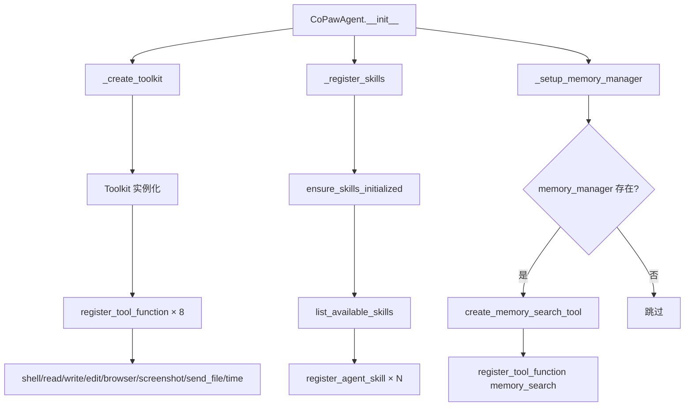
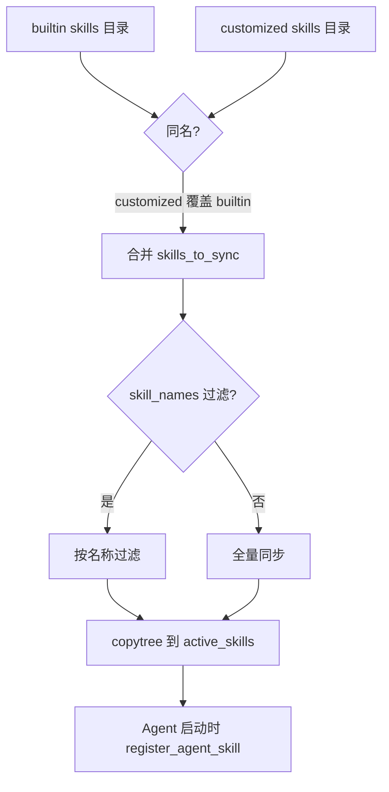
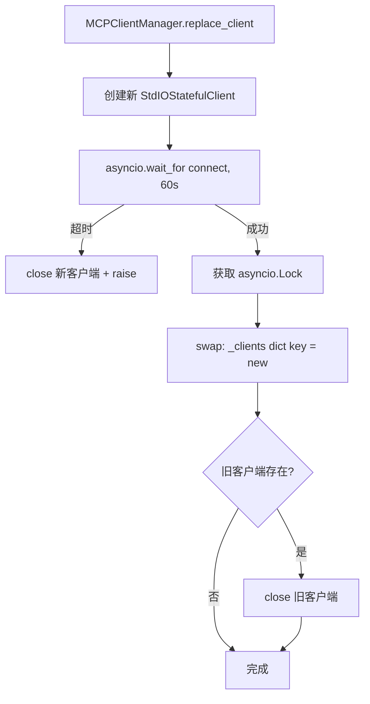

# PD-04.15 CoPaw — 三层技能系统与 MCP 热重载工具架构

> 文档编号：PD-04.15
> 来源：CoPaw `src/copaw/agents/react_agent.py` `src/copaw/agents/skills_manager.py` `src/copaw/app/mcp/manager.py`
> GitHub：https://github.com/agentscope-ai/CoPaw.git
> 问题域：PD-04 工具系统 Tool System Design
> 状态：可复用方案

---

## 第 1 章 问题与动机

### 1.1 核心问题

Agent 工具系统面临三个层次的挑战：

1. **内置工具的注册与管理** — 如何将 shell/file/browser/screenshot 等基础能力以统一接口注册到 Agent 的 Toolkit 中，让 LLM 通过 function calling 调用
2. **声明式技能扩展** — 如何让用户和开发者通过 Markdown 文件（SKILL.md）声明新能力，而不需要写 Python 代码注册工具
3. **外部工具服务集成** — 如何通过 MCP（Model Context Protocol）协议接入外部工具服务器（如 Tavily 搜索），并支持运行时热重载

CoPaw 的工具系统需要同时服务多渠道（iMessage/Discord/DingTalk/Feishu/QQ/Console），每个查询创建独立的 Agent 实例，因此工具注册必须高效且可复用。

### 1.2 CoPaw 的解法概述

CoPaw 构建了一个三层工具架构：

1. **内置工具层** — 通过 AgentScope `Toolkit.register_tool_function()` 注册 8 个核心工具函数（`react_agent.py:142-149`），每个工具返回统一的 `ToolResponse` 对象
2. **声明式技能层** — 通过 `builtin → customized → active` 三级目录同步机制管理 SKILL.md 技能文件（`skills_manager.py:129-204`），用 `Toolkit.register_agent_skill()` 将 Markdown 技能注入 Agent
3. **MCP 外部工具层** — 通过 `MCPClientManager` 管理 StdIO MCP 客户端的生命周期（`manager.py:22-194`），支持运行时热替换和 60 秒连接超时

### 1.3 设计思想

| 设计原则 | 具体实现 | 理由 | 替代方案 |
|----------|----------|------|----------|
| 三层分离 | 内置工具/声明式技能/MCP 外部工具各自独立注册 | 不同扩展性需求用不同机制，降低耦合 | 统一注册接口（但会模糊工具来源） |
| 声明式优先 | SKILL.md + YAML Front Matter 定义技能 | 非开发者也能扩展 Agent 能力 | 纯代码注册（门槛高） |
| 热重载 | MCPClientManager 支持 replace_client 不停机替换 | 多渠道长运行服务不能重启 | 重启进程（影响所有会话） |
| 每查询新实例 | 每次 query_handler 创建新 CoPawAgent | 会话隔离，避免状态污染 | 单例 Agent（状态泄露风险） |
| 闭包注入 | create_memory_search_tool 用闭包绑定 memory_manager | 运行时动态决定是否注册 memory_search 工具 | 全局变量（不可测试） |

---

## 第 2 章 源码实现分析

### 2.1 架构概览

CoPaw 的工具系统由三个核心模块组成，通过 AgentScope 的 `Toolkit` 类统一管理：

```
┌─────────────────────────────────────────────────────────────────┐
│                      CoPawAgent (ReActAgent)                     │
│                      react_agent.py:49                           │
├─────────────────────────────────────────────────────────────────┤
│                         Toolkit                                  │
│  ┌──────────────┐  ┌──────────────────┐  ┌───────────────────┐  │
│  │ 内置工具 (8)  │  │ 声明式技能 (N)    │  │ MCP 客户端 (M)    │  │
│  │ shell/file/  │  │ SKILL.md 文件     │  │ StdIOStateful     │  │
│  │ browser/...  │  │ builtin→active   │  │ Client            │  │
│  │              │  │                  │  │                   │  │
│  │ register_    │  │ register_        │  │ register_         │  │
│  │ tool_function│  │ agent_skill      │  │ mcp_client        │  │
│  └──────────────┘  └──────────────────┘  └───────────────────┘  │
├─────────────────────────────────────────────────────────────────┤
│  memory_search (条件注册，闭包绑定 MemoryManager)                 │
└─────────────────────────────────────────────────────────────────┘
         ↑                    ↑                      ↑
   tools/*.py          skills_manager.py      mcp/manager.py
```

### 2.2 核心实现

#### 2.2.1 内置工具注册



对应源码 `src/copaw/agents/react_agent.py:133-151`：

```python
def _create_toolkit(self) -> Toolkit:
    """Create and populate toolkit with built-in tools."""
    toolkit = Toolkit()

    # Register built-in tools
    toolkit.register_tool_function(execute_shell_command)
    toolkit.register_tool_function(read_file)
    toolkit.register_tool_function(write_file)
    toolkit.register_tool_function(edit_file)
    toolkit.register_tool_function(browser_use)
    toolkit.register_tool_function(desktop_screenshot)
    toolkit.register_tool_function(send_file_to_user)
    toolkit.register_tool_function(get_current_time)

    return toolkit
```

每个工具函数遵循统一签名：接收类型化参数，返回 `ToolResponse`（包含 `TextBlock` 列表）。以 `execute_shell_command`（`tools/shell.py:18-134`）为例，它实现了：
- 异步子进程执行（`asyncio.create_subprocess_shell`）
- 可配置超时（默认 60 秒）+ 优雅终止 → 强制 kill 两阶段
- 结构化返回：成功时只返回 stdout，失败时返回 exit code + stdout + stderr

#### 2.2.2 声明式技能系统



对应源码 `src/copaw/agents/skills_manager.py:129-204`：

```python
def sync_skills_to_working_dir(
    skill_names: list[str] | None = None,
    force: bool = False,
) -> tuple[int, int]:
    builtin_skills = get_builtin_skills_dir()
    customized_skills = get_customized_skills_dir()
    active_skills = get_active_skills_dir()

    active_skills.mkdir(parents=True, exist_ok=True)

    # Collect skills from both sources (customized overwrites builtin)
    skills_to_sync = _collect_skills_from_dir(builtin_skills)
    # Customized skills override builtin with same name
    skills_to_sync.update(_collect_skills_from_dir(customized_skills))

    # Filter by skill_names if specified
    if skill_names is not None:
        skills_to_sync = {
            name: path for name, path in skills_to_sync.items()
            if name in skill_names
        }

    for skill_name, skill_dir in skills_to_sync.items():
        target_dir = active_skills / skill_name
        if target_dir.exists() and not force:
            skipped_count += 1
            continue
        if target_dir.exists():
            shutil.rmtree(target_dir)
        shutil.copytree(skill_dir, target_dir)
        synced_count += 1

    return synced_count, skipped_count
```

技能发现规则（`skills_manager.py:111-126`）：目录下必须包含 `SKILL.md` 文件才被识别为有效技能。SKILL.md 使用 YAML Front Matter 声明 `name` 和 `description`（`skills_manager.py:570-593`），创建时通过 `frontmatter.loads()` 校验。

内置技能包括 11 个：`browser_visible`、`cron`、`dingtalk_channel`、`docx`、`file_reader`、`himalaya`、`news`、`pdf`、`pptx`、`xlsx` 等。

#### 2.2.3 MCP 热重载管理器



对应源码 `src/copaw/app/mcp/manager.py:75-134`：

```python
async def replace_client(
    self,
    key: str,
    client_config: "MCPClientConfig",
    timeout: float = 60.0,
) -> None:
    # 1. Create and connect new client outside lock (may be slow)
    new_client = StdIOStatefulClient(
        name=client_config.name,
        command=client_config.command,
        args=client_config.args,
        env=client_config.env,
    )

    try:
        await asyncio.wait_for(new_client.connect(), timeout=timeout)
    except asyncio.TimeoutError:
        try:
            await new_client.close()
        except Exception:
            pass
        raise

    # 2. Swap and close old client inside lock
    async with self._lock:
        old_client = self._clients.get(key)
        self._clients[key] = new_client

        if old_client is not None:
            try:
                await old_client.close()
            except Exception as e:
                logger.warning(f"Error closing old MCP client '{key}': {e}")
```

关键设计：连接新客户端在锁外执行（耗时操作），交换和关闭旧客户端在锁内执行（最小化锁持有时间）。

### 2.3 实现细节

**闭包工具注入模式**（`tools/memory_search.py:7-69`）：`create_memory_search_tool` 返回一个闭包函数 `memory_search`，将 `memory_manager` 实例绑定到工具函数中。这避免了全局变量，使工具的注册条件化——只有当 `ENABLE_MEMORY_MANAGER` 环境变量不为 `false` 且 memory_manager 实例存在时才注册（`react_agent.py:200-215`）。

**MCP 配置驱动**（`config/config.py:147-176`）：MCP 客户端通过 `config.json` 的 `mcp.clients` 字典配置。默认包含 `tavily_search` 客户端，其 `enabled` 字段根据 `TAVILY_API_KEY` 环境变量自动判断。每个客户端配置包含 `command`、`args`、`env` 三要素，对应 StdIO 传输协议。

**每查询实例化**（`runner/runner.py:99-106`）：`AgentRunner.query_handler` 每次请求都创建新的 `CoPawAgent` 实例，MCP 客户端列表从 `MCPClientManager.get_clients()` 获取（热重载感知），然后通过 `agent.register_mcp_clients()` 异步注册到 Toolkit。


---

## 第 3 章 迁移指南

### 3.1 迁移清单

**阶段 1：内置工具注册（1 天）**
- [ ] 创建 `Toolkit` 或等效的工具注册表类
- [ ] 为每个工具函数定义统一返回类型（类似 `ToolResponse`）
- [ ] 用 `register_tool_function` 逐个注册工具函数
- [ ] 确保每个工具函数有完整的 docstring（AgentScope 从 docstring 生成 JSON Schema）

**阶段 2：声明式技能系统（2 天）**
- [ ] 定义技能目录结构：`builtin/` → `customized/` → `active/`
- [ ] 实现 `SKILL.md` 解析（YAML Front Matter + Markdown 正文）
- [ ] 实现三级目录同步逻辑（customized 覆盖 builtin）
- [ ] 实现 `register_agent_skill` 将 Markdown 注入 Agent 上下文

**阶段 3：MCP 集成（1 天）**
- [ ] 实现 `MCPClientManager`（asyncio.Lock + dict 管理）
- [ ] 实现 `replace_client`（锁外连接 + 锁内交换）
- [ ] 配置 MCP 客户端（command/args/env 三要素）
- [ ] 在 Agent 初始化时调用 `register_mcp_client`

### 3.2 适配代码模板

#### 三层工具注册器

```python
"""可复用的三层工具注册器模板。"""
import asyncio
import shutil
from dataclasses import dataclass, field
from pathlib import Path
from typing import Any, Callable, Dict, List, Optional

import frontmatter


@dataclass
class ToolResponse:
    """统一工具返回类型。"""
    content: str
    success: bool = True
    metadata: Dict[str, Any] = field(default_factory=dict)


@dataclass
class SkillInfo:
    """技能元数据。"""
    name: str
    description: str
    content: str
    source: str  # "builtin" | "customized" | "active"
    path: Path


class ToolRegistry:
    """三层工具注册表：内置工具 + 声明式技能 + MCP 外部工具。"""

    def __init__(self):
        self._tools: Dict[str, Callable] = {}
        self._skills: Dict[str, SkillInfo] = {}
        self._mcp_clients: Dict[str, Any] = {}
        self._lock = asyncio.Lock()

    # ---- 第 1 层：内置工具 ----
    def register_tool(self, func: Callable) -> None:
        """注册内置工具函数。函数名即工具名，docstring 生成 schema。"""
        self._tools[func.__name__] = func

    # ---- 第 2 层：声明式技能 ----
    def sync_skills(
        self,
        builtin_dir: Path,
        customized_dir: Path,
        active_dir: Path,
        force: bool = False,
    ) -> int:
        """三级目录同步：builtin → customized 覆盖 → active。"""
        active_dir.mkdir(parents=True, exist_ok=True)
        skills = {}
        for d in [builtin_dir, customized_dir]:
            if d.exists():
                for skill_dir in d.iterdir():
                    if skill_dir.is_dir() and (skill_dir / "SKILL.md").exists():
                        skills[skill_dir.name] = skill_dir

        synced = 0
        for name, src in skills.items():
            target = active_dir / name
            if target.exists() and not force:
                continue
            if target.exists():
                shutil.rmtree(target)
            shutil.copytree(src, target)
            # 解析 SKILL.md
            md = (target / "SKILL.md").read_text()
            post = frontmatter.loads(md)
            self._skills[name] = SkillInfo(
                name=post.get("name", name),
                description=post.get("description", ""),
                content=md,
                source="active",
                path=target,
            )
            synced += 1
        return synced

    # ---- 第 3 层：MCP 热重载 ----
    async def replace_mcp_client(
        self,
        key: str,
        connect_fn: Callable,
        close_fn: Optional[Callable] = None,
        timeout: float = 60.0,
    ) -> None:
        """热替换 MCP 客户端：锁外连接，锁内交换。"""
        new_client = await asyncio.wait_for(connect_fn(), timeout=timeout)
        async with self._lock:
            old = self._mcp_clients.get(key)
            self._mcp_clients[key] = new_client
        if old and close_fn:
            await close_fn(old)

    def get_all_tool_names(self) -> List[str]:
        """返回所有已注册的工具名（内置 + 技能 + MCP）。"""
        return (
            list(self._tools.keys())
            + list(self._skills.keys())
            + list(self._mcp_clients.keys())
        )
```

#### 闭包工具注入模板

```python
def create_contextual_tool(dependency: Any):
    """用闭包将运行时依赖绑定到工具函数。"""
    async def contextual_search(
        query: str,
        max_results: int = 5,
    ) -> ToolResponse:
        """语义搜索工具（docstring 即 schema）。

        Args:
            query: 搜索查询
            max_results: 最大结果数
        """
        if dependency is None:
            return ToolResponse(content="依赖未初始化", success=False)
        results = await dependency.search(query, max_results)
        return ToolResponse(content=str(results))

    return contextual_search
```

### 3.3 适用场景

| 场景 | 适用度 | 说明 |
|------|--------|------|
| 多渠道 Agent 服务 | ⭐⭐⭐ | 每查询新实例 + MCP 热重载，天然适合长运行多渠道 |
| 需要非开发者扩展能力 | ⭐⭐⭐ | SKILL.md 声明式技能，运营人员也能添加 |
| 单用户 CLI Agent | ⭐⭐ | 三层架构略重，但技能系统仍有价值 |
| 高并发工具调用 | ⭐⭐ | 每查询新实例有开销，但 MCP 客户端共享 |
| 需要工具权限控制 | ⭐ | CoPaw 无细粒度权限，需自行扩展 |

---

## 第 4 章 测试用例

```python
"""CoPaw 工具系统核心功能测试。"""
import asyncio
import shutil
import tempfile
from pathlib import Path
from unittest.mock import AsyncMock, MagicMock, patch

import pytest


# ---- 技能管理器测试 ----

class TestSkillsManager:
    """测试三级目录同步机制。"""

    def setup_method(self):
        self.tmpdir = Path(tempfile.mkdtemp())
        self.builtin = self.tmpdir / "builtin"
        self.customized = self.tmpdir / "customized"
        self.active = self.tmpdir / "active"

    def teardown_method(self):
        shutil.rmtree(self.tmpdir)

    def _create_skill(self, base: Path, name: str, content: str = ""):
        skill_dir = base / name
        skill_dir.mkdir(parents=True)
        md = f"""---
name: {name}
description: "Test skill {name}"
---
{content or f"# {name}"}
"""
        (skill_dir / "SKILL.md").write_text(md)
        return skill_dir

    def test_builtin_sync_to_active(self):
        """内置技能应同步到 active 目录。"""
        self._create_skill(self.builtin, "file_reader")
        # 模拟 sync_skills_to_working_dir 的核心逻辑
        self.active.mkdir(parents=True, exist_ok=True)
        src = self.builtin / "file_reader"
        dst = self.active / "file_reader"
        shutil.copytree(src, dst)
        assert (dst / "SKILL.md").exists()

    def test_customized_overrides_builtin(self):
        """同名技能 customized 应覆盖 builtin。"""
        self._create_skill(self.builtin, "news", "builtin version")
        self._create_skill(self.customized, "news", "customized version")

        # 模拟合并逻辑：customized 覆盖 builtin
        skills = {}
        for d in [self.builtin, self.customized]:
            for sd in d.iterdir():
                if sd.is_dir() and (sd / "SKILL.md").exists():
                    skills[sd.name] = sd

        assert "customized" in (skills["news"] / "SKILL.md").read_text()

    def test_skip_existing_without_force(self):
        """非 force 模式下已存在的技能应跳过。"""
        self._create_skill(self.builtin, "pdf")
        self.active.mkdir(parents=True, exist_ok=True)
        dst = self.active / "pdf"
        dst.mkdir()
        (dst / "SKILL.md").write_text("old content")

        # 不 force 时不覆盖
        assert (dst / "SKILL.md").read_text() == "old content"

    def test_skill_requires_skill_md(self):
        """没有 SKILL.md 的目录不应被识别为技能。"""
        (self.builtin / "not_a_skill").mkdir(parents=True)
        (self.builtin / "not_a_skill" / "README.md").write_text("hello")

        skills = {}
        for sd in self.builtin.iterdir():
            if sd.is_dir() and (sd / "SKILL.md").exists():
                skills[sd.name] = sd

        assert "not_a_skill" not in skills


# ---- MCP 客户端管理器测试 ----

class TestMCPClientManager:
    """测试 MCP 热重载机制。"""

    @pytest.mark.asyncio
    async def test_replace_client_swap(self):
        """replace_client 应先连接新客户端再关闭旧客户端。"""
        manager_dict = {}
        lock = asyncio.Lock()

        old_client = AsyncMock()
        manager_dict["test"] = old_client

        new_client = AsyncMock()
        new_client.connect = AsyncMock()

        # 模拟 replace 逻辑
        await asyncio.wait_for(new_client.connect(), timeout=5.0)
        async with lock:
            old = manager_dict.get("test")
            manager_dict["test"] = new_client
            if old:
                await old.close()

        assert manager_dict["test"] is new_client
        old_client.close.assert_called_once()

    @pytest.mark.asyncio
    async def test_connect_timeout(self):
        """连接超时应清理新客户端并抛出异常。"""
        async def slow_connect():
            await asyncio.sleep(10)

        with pytest.raises(asyncio.TimeoutError):
            await asyncio.wait_for(slow_connect(), timeout=0.1)

    @pytest.mark.asyncio
    async def test_close_all(self):
        """close_all 应关闭所有客户端并清空字典。"""
        clients = {
            "a": AsyncMock(),
            "b": AsyncMock(),
        }
        for client in clients.values():
            await client.close()

        for client in clients.values():
            client.close.assert_called_once()


# ---- 闭包工具注入测试 ----

class TestClosureToolInjection:
    """测试闭包模式的工具注入。"""

    @pytest.mark.asyncio
    async def test_memory_search_with_manager(self):
        """有 memory_manager 时应正常返回搜索结果。"""
        mock_manager = AsyncMock()
        mock_manager.memory_search = AsyncMock(
            return_value=MagicMock(content=[MagicMock(text="found")])
        )

        # 模拟 create_memory_search_tool 的闭包
        async def memory_search(query, max_results=5, min_score=0.1):
            return await mock_manager.memory_search(
                query=query, max_results=max_results, min_score=min_score
            )

        result = await memory_search("test query")
        mock_manager.memory_search.assert_called_once()

    @pytest.mark.asyncio
    async def test_memory_search_without_manager(self):
        """无 memory_manager 时应返回错误信息。"""
        manager = None

        async def memory_search(query, **kwargs):
            if manager is None:
                return {"error": "Memory manager is not enabled."}
            return await manager.memory_search(query=query, **kwargs)

        result = await memory_search("test")
        assert "error" in result
```


---

## 第 5 章 跨域关联

| 关联域 | 关系类型 | 说明 |
|--------|----------|------|
| PD-01 上下文管理 | 协同 | 技能的 SKILL.md 内容注入 system prompt，占用上下文窗口；memory_search 工具的注册受 `MEMORY_COMPACT_RATIO` 影响 |
| PD-03 容错与重试 | 依赖 | MCP 客户端连接有 60 秒超时保护（`manager.py:102`），shell 工具有可配置超时 + 两阶段终止（`shell.py:66-99`） |
| PD-06 记忆持久化 | 协同 | `memory_search` 工具通过闭包绑定 `MemoryManager`，是记忆系统的查询入口；工具注册条件依赖 `ENABLE_MEMORY_MANAGER` 环境变量 |
| PD-09 Human-in-the-Loop | 协同 | `CommandHandler` 处理 `/compact`、`/new` 等系统命令（`react_agent.py:291-295`），在工具调用前拦截用户指令 |
| PD-10 中间件管道 | 协同 | `BootstrapHook` 和 `MemoryCompactionHook` 通过 `register_instance_hook("pre_reasoning")` 注册为推理前钩子（`react_agent.py:217-244`） |
| PD-11 可观测性 | 依赖 | 所有工具通过 `ToolResponse` 统一返回格式，`show_tool_details` 配置控制渠道输出是否展示工具调用细节（`config.py:188`） |

---

## 第 6 章 来源文件索引

| 文件 | 行范围 | 关键实现 |
|------|--------|----------|
| `src/copaw/agents/react_agent.py` | L49-L298 | CoPawAgent 主类：三层工具注册、技能加载、MCP 客户端注册 |
| `src/copaw/agents/react_agent.py` | L133-L151 | `_create_toolkit`：8 个内置工具注册 |
| `src/copaw/agents/react_agent.py` | L153-L176 | `_register_skills`：声明式技能加载 |
| `src/copaw/agents/react_agent.py` | L189-L215 | `_setup_memory_manager`：闭包工具条件注册 |
| `src/copaw/agents/react_agent.py` | L262-L265 | `register_mcp_clients`：MCP 客户端异步注册 |
| `src/copaw/agents/skills_manager.py` | L16-L48 | `SkillInfo` Pydantic 模型定义 |
| `src/copaw/agents/skills_manager.py` | L111-L126 | `_collect_skills_from_dir`：技能发现（SKILL.md 检测） |
| `src/copaw/agents/skills_manager.py` | L129-L204 | `sync_skills_to_working_dir`：三级目录同步核心逻辑 |
| `src/copaw/agents/skills_manager.py` | L251-L308 | `sync_skills_from_active_to_customized`：反向同步（保存用户修改） |
| `src/copaw/agents/skills_manager.py` | L465-L655 | `SkillService`：技能 CRUD 服务（create/enable/disable/delete） |
| `src/copaw/agents/skills_manager.py` | L570-L593 | YAML Front Matter 校验（name + description 必填） |
| `src/copaw/app/mcp/manager.py` | L22-L36 | `MCPClientManager`：asyncio.Lock + dict 管理 |
| `src/copaw/app/mcp/manager.py` | L38-L57 | `init_from_config`：从配置初始化 MCP 客户端 |
| `src/copaw/app/mcp/manager.py` | L75-L134 | `replace_client`：锁外连接 + 锁内交换热重载 |
| `src/copaw/app/mcp/manager.py` | L152-L167 | `close_all`：快照 + 清空 + 逐个关闭 |
| `src/copaw/agents/tools/__init__.py` | L1-L41 | 工具模块导出：14 个工具函数 |
| `src/copaw/agents/tools/shell.py` | L18-L134 | `execute_shell_command`：异步子进程 + 超时 + 两阶段终止 |
| `src/copaw/agents/tools/memory_search.py` | L7-L69 | `create_memory_search_tool`：闭包工具注入模式 |
| `src/copaw/agents/tools/browser_control.py` | L80-L393 | `browser_use`：26 种 action 的统一浏览器工具 |
| `src/copaw/config/config.py` | L147-L176 | `MCPClientConfig` + `MCPConfig`：MCP 配置模型 |
| `src/copaw/app/runner/runner.py` | L90-L106 | `query_handler`：每查询创建 Agent + MCP 客户端注入 |
| `src/copaw/constant.py` | L33-L37 | `ACTIVE_SKILLS_DIR` / `CUSTOMIZED_SKILLS_DIR` 路径定义 |

---

## 第 7 章 横向对比维度

> **重要：** 本章用于自动填充 Butcher Wiki 的横向对比表。

```json comparison_data
{
  "project": "CoPaw",
  "dimensions": {
    "工具注册方式": "AgentScope Toolkit.register_tool_function + register_agent_skill + register_mcp_client 三层注册",
    "工具分组/权限": "无细粒度权限，内置工具全量注册，技能通过 enable/disable 控制",
    "MCP 协议支持": "StdIOStatefulClient，config.json 声明式配置，支持热重载替换",
    "热更新/缓存": "MCPClientManager.replace_client 锁外连接+锁内交换，零停机热替换",
    "超时保护": "MCP 连接 60s 超时，shell 工具可配置超时+两阶段终止（terminate→kill）",
    "Schema 生成方式": "AgentScope 从函数 docstring 自动生成 JSON Schema",
    "工具条件加载": "memory_search 根据 ENABLE_MEMORY_MANAGER 环境变量条件注册",
    "工具上下文注入": "create_memory_search_tool 闭包绑定 memory_manager 实例",
    "MCP格式转换": "SKILL.md YAML Front Matter 声明 name/description，Toolkit 自动转换",
    "工具集动态组合": "builtin→customized→active 三级目录同步，customized 覆盖 builtin 同名技能",
    "声明式技能系统": "SKILL.md + YAML Front Matter 定义技能，非开发者可扩展",
    "每查询实例隔离": "query_handler 每次创建新 CoPawAgent，MCP 客户端共享但 Toolkit 独立"
  }
}
```

### 域元数据补充

```json domain_metadata
{
  "solution_summary": "CoPaw 通过 AgentScope Toolkit 三层注册（内置函数 + SKILL.md 声明式技能 + MCP StdIO 热重载客户端）实现可扩展工具架构",
  "description": "声明式技能文件（SKILL.md）作为非代码工具扩展机制的设计模式",
  "sub_problems": [
    "声明式技能同步：builtin/customized/active 三级目录的覆盖与反向同步策略",
    "闭包工具注入：如何用闭包将运行时依赖绑定到工具函数避免全局变量",
    "每查询 Agent 实例化：多渠道服务中如何平衡工具注册开销与会话隔离",
    "YAML Front Matter 校验：技能创建时如何强制校验元数据完整性"
  ],
  "best_practices": [
    "MCP 热替换应锁外连接锁内交换，最小化锁持有时间",
    "技能发现用约定文件（SKILL.md）而非注册表，降低扩展门槛",
    "条件工具注册应通过环境变量控制，支持运行时开关"
  ]
}
```

