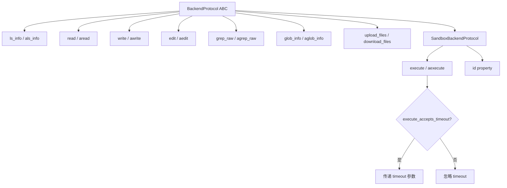
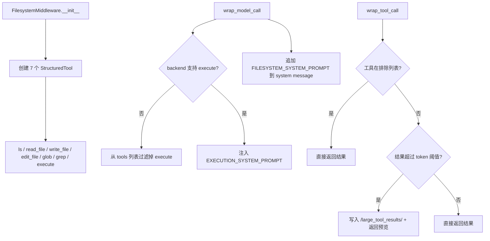
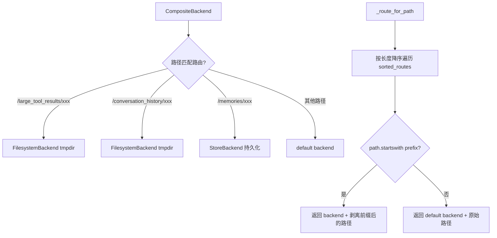

# PD-04.37 DeepAgents — AgentMiddleware 工具注入与可插拔后端工具系统

> 文档编号：PD-04.37
> 来源：DeepAgents `libs/deepagents/deepagents/middleware/filesystem.py`
> GitHub：https://github.com/langchain-ai/deepagents.git
> 问题域：PD-04 工具系统 Tool System Design
> 状态：可复用方案

---

## 第 1 章 问题与动机

### 1.1 核心问题

Agent 工具系统面临三个核心挑战：

1. **后端异构性**：工具需要在本地文件系统、LangGraph 状态存储、远程沙箱（Docker/Modal/Runloop）等不同后端上运行，但 Agent 不应感知后端差异
2. **工具结果膨胀**：文件读取、命令执行等工具可能返回超大结果，直接注入上下文窗口会导致 token 溢出
3. **权限分级**：文件读取是安全的，但文件写入、命令执行需要人工确认，工具系统需要与 HITL 机制无缝集成

DeepAgents 的解法是将工具系统拆分为三层：**BackendProtocol 抽象层**（定义统一文件操作接口）、**FilesystemMiddleware 注入层**（将后端能力包装为 StructuredTool 并注入 Agent）、**CompositeBackend 路由层**（按路径前缀将操作分发到不同后端）。

### 1.2 DeepAgents 的解法概述

1. **BackendProtocol ABC 定义统一接口** — 所有后端实现 `ls_info/read/write/edit/grep_raw/glob_info` 六个文件操作 + 可选的 `execute` 命令执行，每个方法都有同步和异步版本（`backends/protocol.py:167`）
2. **FilesystemMiddleware 自动注入 7 个工具** — 通过 `StructuredTool.from_function` 将后端方法包装为 LLM 可调用的工具，工具描述精确到使用示例（`middleware/filesystem.py:364`）
3. **CompositeBackend 路径前缀路由** — 按最长前缀匹配将文件操作路由到不同后端，如 `/large_tool_results/` 路由到临时目录后端（`backends/composite.py:90`）
4. **大结果自动驱逐** — 工具结果超过 token 阈值时自动写入文件系统，替换为 head+tail 预览 + 文件引用（`middleware/filesystem.py:1086`）
5. **运行时能力检测** — 通过 `isinstance(backend, SandboxBackendProtocol)` 动态决定是否暴露 `execute` 工具，非沙箱后端自动隐藏执行能力（`middleware/filesystem.py:272`）

### 1.3 设计思想

| 设计原则 | 具体实现 | 理由 | 替代方案 |
|----------|----------|------|----------|
| 后端透明 | BackendProtocol ABC + asyncio.to_thread 桥接 | Agent 代码不关心存储位置，同一套工具在本地/远程/状态存储上都能工作 | 每个后端各写一套工具（代码爆炸） |
| 中间件注入 | AgentMiddleware.tools 列表 + wrap_model_call 动态过滤 | 工具集随后端能力自动调整，无需手动配置 | 硬编码工具列表（无法适配不同后端） |
| 路径路由 | CompositeBackend 最长前缀匹配 | 不同路径可用不同存储策略（临时/持久/状态） | 单一后端（无法混合存储策略） |
| 结果驱逐 | token 阈值 + 文件写入 + 预览替换 | 防止大结果撑爆上下文窗口 | 简单截断（丢失信息） |
| 能力检测 | isinstance + lru_cache 签名检查 | 向后兼容旧版后端包 | 强制所有后端实现 execute（破坏兼容性） |

---

## 第 2 章 源码实现分析

### 2.1 架构概览

DeepAgents 工具系统的整体架构是一个三层洋葱模型：

```
┌─────────────────────────────────────────────────────────┐
│                    LLM (Claude/GPT)                      │
│  调用 ls / read_file / write_file / edit_file /          │
│       glob / grep / execute                              │
├─────────────────────────────────────────────────────────┤
│           FilesystemMiddleware (注入层)                    │
│  StructuredTool.from_function 包装                        │
│  wrap_model_call: 动态过滤 execute 工具                    │
│  wrap_tool_call: 大结果驱逐到文件系统                       │
├─────────────────────────────────────────────────────────┤
│           CompositeBackend (路由层)                        │
│  路径前缀匹配 → 分发到对应后端                              │
│  /large_tool_results/ → FilesystemBackend(tmpdir)        │
│  /conversation_history/ → FilesystemBackend(tmpdir)      │
│  其他路径 → default backend                               │
├─────────────────────────────────────────────────────────┤
│           BackendProtocol (抽象层)                         │
│  StateBackend │ FilesystemBackend │ LocalShellBackend     │
│  StoreBackend │ DockerSandbox     │ ModalBackend          │
└─────────────────────────────────────────────────────────┘
```

### 2.2 核心实现

#### 2.2.1 BackendProtocol — 统一文件操作接口



对应源码 `libs/deepagents/deepagents/backends/protocol.py:167-517`：

```python
class BackendProtocol(abc.ABC):
    """Protocol for pluggable memory backends (single, unified)."""

    def ls_info(self, path: str) -> list["FileInfo"]:
        raise NotImplementedError

    async def als_info(self, path: str) -> list["FileInfo"]:
        return await asyncio.to_thread(self.ls_info, path)

    def read(self, file_path: str, offset: int = 0, limit: int = 2000) -> str:
        raise NotImplementedError

    def grep_raw(self, pattern: str, path: str | None = None,
                 glob: str | None = None) -> list["GrepMatch"] | str:
        raise NotImplementedError

    def write(self, file_path: str, content: str) -> WriteResult:
        raise NotImplementedError

    def edit(self, file_path: str, old_string: str, new_string: str,
             replace_all: bool = False) -> EditResult:
        raise NotImplementedError


class SandboxBackendProtocol(BackendProtocol):
    """Extension that adds shell command execution."""

    def execute(self, command: str, *, timeout: int | None = None) -> ExecuteResponse:
        raise NotImplementedError


@lru_cache(maxsize=128)
def execute_accepts_timeout(cls: type[SandboxBackendProtocol]) -> bool:
    """Check whether a backend's execute accepts timeout kwarg."""
    try:
        sig = inspect.signature(cls.execute)
    except (ValueError, TypeError):
        return False
    return "timeout" in sig.parameters
```

关键设计点：
- 每个同步方法都有对应的 `a` 前缀异步版本，默认实现用 `asyncio.to_thread` 桥接（`protocol.py:199`）
- `execute_accepts_timeout` 用 `lru_cache` 缓存签名检查结果，避免重复反射开销（`protocol.py:494`）
- 返回值使用 `@dataclass`（`WriteResult`、`EditResult`、`ExecuteResponse`）而非裸字典，提供类型安全（`protocol.py:115-163`）
- `FileOperationError` 用 `Literal` 类型定义标准化错误码，LLM 可理解并修复（`protocol.py:22-27`）

#### 2.2.2 FilesystemMiddleware — 工具注入与大结果驱逐



对应源码 `libs/deepagents/deepagents/middleware/filesystem.py:364-463`：

```python
class FilesystemMiddleware(AgentMiddleware[FilesystemState, ContextT, ResponseT]):
    state_schema = FilesystemState

    def __init__(self, *, backend: BACKEND_TYPES | None = None,
                 system_prompt: str | None = None,
                 custom_tool_descriptions: dict[str, str] | None = None,
                 tool_token_limit_before_evict: int | None = 20000,
                 max_execute_timeout: int = 3600) -> None:
        self.backend = backend if backend is not None else (StateBackend)
        self._tool_token_limit_before_evict = tool_token_limit_before_evict
        self._max_execute_timeout = max_execute_timeout
        self.tools = [
            self._create_ls_tool(),
            self._create_read_file_tool(),
            self._create_write_file_tool(),
            self._create_edit_file_tool(),
            self._create_glob_tool(),
            self._create_grep_tool(),
            self._create_execute_tool(),
        ]
```

工具创建使用 `StructuredTool.from_function`，参数通过 `Annotated` 类型注解自动生成 JSON Schema（`filesystem.py:512`）：

```python
return StructuredTool.from_function(
    name="ls",
    description=tool_description,
    func=sync_ls,
    coroutine=async_ls,
)
```

大结果驱逐机制（`filesystem.py:1086-1161`）：当工具结果超过 `tool_token_limit_before_evict * 4` 字符时，将完整结果写入 `/large_tool_results/{sanitized_tool_call_id}`，替换为 head+tail 预览。排除列表包含 `ls/glob/grep/read_file/edit_file/write_file`，因为这些工具要么自带截断，要么结果本身很小。

#### 2.2.3 CompositeBackend — 路径前缀路由



对应源码 `libs/deepagents/deepagents/backends/composite.py:61-87`：

```python
def _route_for_path(*, default, sorted_routes, path):
    for route_prefix, backend in sorted_routes:
        prefix_no_slash = route_prefix.rstrip("/")
        if path == prefix_no_slash:
            return backend, "/", route_prefix
        if path.startswith(route_prefix):
            suffix = path[len(route_prefix):]
            backend_path = f"/{suffix}" if suffix else "/"
            return backend, backend_path, route_prefix
    return default, path, None
```

CLI 层的 CompositeBackend 组装（`libs/cli/deepagents_cli/agent.py:560-576`）：

```python
large_results_backend = FilesystemBackend(
    root_dir=tempfile.mkdtemp(prefix="deepagents_large_results_"),
    virtual_mode=True,
)
conversation_history_backend = FilesystemBackend(
    root_dir=tempfile.mkdtemp(prefix="deepagents_conversation_history_"),
    virtual_mode=True,
)
composite_backend = CompositeBackend(
    default=backend,
    routes={
        "/large_tool_results/": large_results_backend,
        "/conversation_history/": conversation_history_backend,
    },
)
```

### 2.3 实现细节

**工具描述精确到使用模式**：每个工具的 description 不是简单的一句话，而是包含完整的使用指南。例如 `READ_FILE_TOOL_DESCRIPTION` 长达 20+ 行，包含分页建议、图片处理说明、批量读取提示（`filesystem.py:138-160`）。

**路径安全校验**：所有工具入口都经过 `validate_path` 校验，防止路径遍历攻击（`..`）、Windows 绝对路径注入（`C:\`），并支持 `allowed_prefixes` 白名单（`backends/utils.py:234-297`）。

**Backend 工厂模式**：`backend` 参数支持传入实例或 `Callable[[ToolRuntime], BackendProtocol]` 工厂函数，延迟到运行时才创建后端实例（`filesystem.py:465-476`）。

**图片多模态返回**：`read_file` 工具检测到图片扩展名时，通过 `download_files` 获取二进制内容，base64 编码后返回 `ToolMessage(content_blocks=[create_image_block(...)])`，支持视觉模型消费（`filesystem.py:538-554`）。

**HITL 权限分级**：CLI 层通过 `_add_interrupt_on` 为 `execute/write_file/edit_file/web_search/fetch_url/task` 六个工具配置中断审批，每个工具有独立的 description 格式化函数（`agent.py:324-385`）。


---

## 第 3 章 迁移指南

### 3.1 迁移清单

**阶段 1：后端抽象层（必须）**

- [ ] 定义 `BackendProtocol` ABC，包含 `read/write/edit/ls_info/grep_raw/glob_info` 六个方法
- [ ] 为每个同步方法提供 `asyncio.to_thread` 默认异步实现
- [ ] 实现至少一个具体后端（如 `FilesystemBackend`）
- [ ] 定义 `WriteResult/EditResult/ExecuteResponse` 返回值 dataclass

**阶段 2：工具注入中间件（核心）**

- [ ] 创建 `FilesystemMiddleware`，在 `__init__` 中用 `StructuredTool.from_function` 包装后端方法
- [ ] 实现 `wrap_model_call` 动态过滤工具（根据后端能力）
- [ ] 实现 `wrap_tool_call` 大结果驱逐机制

**阶段 3：路径路由（可选）**

- [ ] 实现 `CompositeBackend`，支持路径前缀到后端的映射
- [ ] 配置大结果驱逐路径（如 `/large_tool_results/`）

**阶段 4：权限控制（推荐）**

- [ ] 为写操作工具配置 HITL 中断审批
- [ ] 实现工具描述格式化函数，提供审批上下文

### 3.2 适配代码模板

以下是一个最小可运行的后端 + 中间件实现：

```python
"""可复用的 BackendProtocol + 工具注入模板"""
import abc
import asyncio
from dataclasses import dataclass, field
from typing import Any

from langchain_core.tools import StructuredTool


# --- 返回值类型 ---
@dataclass
class WriteResult:
    message: str
    files_update: dict[str, Any] = field(default_factory=dict)

@dataclass
class EditResult:
    message: str
    files_update: dict[str, Any] = field(default_factory=dict)

@dataclass
class ExecuteResponse:
    output: str
    exit_code: int | None = None
    truncated: bool = False


# --- 后端协议 ---
class BackendProtocol(abc.ABC):
    @abc.abstractmethod
    def read(self, file_path: str, offset: int = 0, limit: int = 2000) -> str: ...

    @abc.abstractmethod
    def write(self, file_path: str, content: str) -> WriteResult: ...

    @abc.abstractmethod
    def edit(self, file_path: str, old_string: str,
             new_string: str, replace_all: bool = False) -> EditResult: ...

    async def aread(self, file_path: str, offset: int = 0, limit: int = 2000) -> str:
        return await asyncio.to_thread(self.read, file_path, offset, limit)


# --- 工具注入中间件 ---
TOKEN_LIMIT = 20_000

def create_filesystem_tools(backend: BackendProtocol) -> list[StructuredTool]:
    """将后端方法包装为 LLM 可调用的工具"""

    def read_file(file_path: str, offset: int = 0, limit: int = 2000) -> str:
        """Read file content with line numbers. Use offset/limit for large files."""
        return backend.read(file_path, offset=offset, limit=limit)

    def write_file(file_path: str, content: str) -> str:
        """Create or overwrite a file."""
        result = backend.write(file_path, content)
        return result.message

    def edit_file(file_path: str, old_string: str,
                  new_string: str, replace_all: bool = False) -> str:
        """Replace text in a file. old_string must be unique unless replace_all=True."""
        result = backend.edit(file_path, old_string, new_string, replace_all)
        return result.message

    return [
        StructuredTool.from_function(name="read_file", func=read_file,
                                      description=read_file.__doc__),
        StructuredTool.from_function(name="write_file", func=write_file,
                                      description=write_file.__doc__),
        StructuredTool.from_function(name="edit_file", func=edit_file,
                                      description=edit_file.__doc__),
    ]


def evict_large_result(result: str, backend: BackendProtocol,
                       tool_call_id: str) -> str:
    """超过 token 阈值的结果写入文件，返回预览"""
    if len(result) <= TOKEN_LIMIT * 4:
        return result
    lines = result.splitlines()
    head = "\n".join(lines[:50])
    tail = "\n".join(lines[-20:])
    path = f"/large_tool_results/{tool_call_id}"
    backend.write(path, result)
    return (f"{head}\n\n... [truncated, full result at {path}] ...\n\n{tail}\n"
            f"Use read_file('{path}') to see the full output.")
```

### 3.3 适用场景

| 场景 | 适用度 | 说明 |
|------|--------|------|
| 多后端 Agent（本地+远程沙箱） | ⭐⭐⭐ | CompositeBackend 路由层直接适用 |
| 单后端 Agent（纯本地） | ⭐⭐⭐ | FilesystemMiddleware 直接复用 |
| 需要 HITL 的工具系统 | ⭐⭐⭐ | interrupt_on 配置模式可直接迁移 |
| 非 LangChain 框架 | ⭐⭐ | BackendProtocol 可复用，中间件需适配 |
| 无文件操作的 Agent | ⭐ | 过度设计，直接用简单工具即可 |

---

## 第 4 章 测试用例

```python
"""基于 DeepAgents 真实接口的测试用例"""
import pytest
from dataclasses import dataclass, field
from typing import Any


# --- Mock Backend ---
@dataclass
class MockWriteResult:
    message: str
    files_update: dict[str, Any] = field(default_factory=dict)

@dataclass
class MockEditResult:
    message: str
    files_update: dict[str, Any] = field(default_factory=dict)


class InMemoryBackend:
    """模拟 StateBackend 的内存后端"""
    def __init__(self):
        self.files: dict[str, str] = {}

    def read(self, file_path: str, offset: int = 0, limit: int = 2000) -> str:
        if file_path not in self.files:
            return f"Error: File not found: {file_path}"
        lines = self.files[file_path].splitlines()
        selected = lines[offset:offset + limit]
        return "\n".join(f"{i+offset+1:6d}\t{line}" for i, line in enumerate(selected))

    def write(self, file_path: str, content: str) -> MockWriteResult:
        if file_path in self.files:
            return MockWriteResult(message=f"Error: File already exists: {file_path}")
        self.files[file_path] = content
        return MockWriteResult(message=f"Successfully created {file_path}")

    def edit(self, file_path: str, old_string: str, new_string: str,
             replace_all: bool = False) -> MockEditResult:
        if file_path not in self.files:
            return MockEditResult(message=f"Error: File not found: {file_path}")
        content = self.files[file_path]
        count = content.count(old_string)
        if count == 0:
            return MockEditResult(message=f"Error: String not found: '{old_string}'")
        if count > 1 and not replace_all:
            return MockEditResult(
                message=f"Error: String appears {count} times. Use replace_all=True")
        self.files[file_path] = content.replace(old_string, new_string)
        return MockEditResult(message=f"Successfully edited {file_path}")


class TestBackendProtocol:
    def test_read_existing_file(self):
        backend = InMemoryBackend()
        backend.files["/test.py"] = "line1\nline2\nline3"
        result = backend.read("/test.py")
        assert "line1" in result
        assert "line3" in result

    def test_read_nonexistent_file(self):
        backend = InMemoryBackend()
        result = backend.read("/missing.py")
        assert "Error" in result

    def test_write_new_file(self):
        backend = InMemoryBackend()
        result = backend.write("/new.py", "hello")
        assert "Successfully" in result.message
        assert backend.files["/new.py"] == "hello"

    def test_write_existing_file_fails(self):
        backend = InMemoryBackend()
        backend.files["/exists.py"] = "old"
        result = backend.write("/exists.py", "new")
        assert "Error" in result.message

    def test_edit_unique_string(self):
        backend = InMemoryBackend()
        backend.files["/test.py"] = "foo = 1\nbar = 2"
        result = backend.edit("/test.py", "foo = 1", "foo = 42")
        assert "Successfully" in result.message
        assert "foo = 42" in backend.files["/test.py"]

    def test_edit_ambiguous_string_fails(self):
        backend = InMemoryBackend()
        backend.files["/test.py"] = "x = 1\nx = 1"
        result = backend.edit("/test.py", "x = 1", "x = 2")
        assert "appears 2 times" in result.message

    def test_edit_ambiguous_with_replace_all(self):
        backend = InMemoryBackend()
        backend.files["/test.py"] = "x = 1\nx = 1"
        result = backend.edit("/test.py", "x = 1", "x = 2", replace_all=True)
        assert "Successfully" in result.message
        assert backend.files["/test.py"] == "x = 2\nx = 2"


class TestPathRouting:
    """测试 CompositeBackend 路径路由逻辑"""

    def test_route_to_default(self):
        """无匹配前缀时路由到 default"""
        default = InMemoryBackend()
        routes = {"/special/": InMemoryBackend()}
        # 模拟 _route_for_path
        path = "/normal/file.txt"
        sorted_routes = sorted(routes.items(), key=lambda x: len(x[0]), reverse=True)
        matched = None
        for prefix, backend in sorted_routes:
            if path.startswith(prefix):
                matched = backend
                break
        assert matched is None  # 应该路由到 default

    def test_route_to_specific_backend(self):
        """匹配前缀时路由到对应后端"""
        routes = {"/special/": InMemoryBackend(), "/other/": InMemoryBackend()}
        path = "/special/file.txt"
        sorted_routes = sorted(routes.items(), key=lambda x: len(x[0]), reverse=True)
        matched = None
        for prefix, backend in sorted_routes:
            if path.startswith(prefix):
                matched = backend
                break
        assert matched is routes["/special/"]

    def test_longest_prefix_wins(self):
        """最长前缀优先匹配"""
        short_backend = InMemoryBackend()
        long_backend = InMemoryBackend()
        routes = {"/a/": short_backend, "/a/b/": long_backend}
        path = "/a/b/file.txt"
        sorted_routes = sorted(routes.items(), key=lambda x: len(x[0]), reverse=True)
        matched = None
        for prefix, backend in sorted_routes:
            if path.startswith(prefix):
                matched = backend
                break
        assert matched is long_backend


class TestResultEviction:
    """测试大结果驱逐机制"""

    def test_small_result_not_evicted(self):
        result = "short output"
        assert len(result) <= 20000 * 4  # 不触发驱逐

    def test_large_result_evicted(self):
        result = "x" * (20000 * 4 + 1)
        assert len(result) > 20000 * 4  # 触发驱逐
        # 驱逐后应包含预览 + 文件引用
        lines = result.splitlines()
        head = "\n".join(lines[:50])
        assert len(head) < len(result)
```


---

## 第 5 章 跨域关联

| 关联域 | 关系类型 | 说明 |
|--------|----------|------|
| PD-01 上下文管理 | 协同 | 大结果驱逐机制直接服务于上下文窗口保护，`tool_token_limit_before_evict` 与 SummarizationMiddleware 的 token 预算协同工作 |
| PD-02 多 Agent 编排 | 依赖 | SubAgentMiddleware 为子 Agent 构建独立的 FilesystemMiddleware 实例，子 Agent 继承父 Agent 的后端但拥有独立的工具集 |
| PD-05 沙箱隔离 | 协同 | `SandboxBackendProtocol` 扩展了 `BackendProtocol`，沙箱后端（Docker/Modal）通过实现 `execute` 方法提供隔离执行能力 |
| PD-09 Human-in-the-Loop | 依赖 | `HumanInTheLoopMiddleware` 通过 `interrupt_on` 配置拦截 `write_file/edit_file/execute` 等危险工具调用 |
| PD-10 中间件管道 | 依赖 | FilesystemMiddleware 是 AgentMiddleware 的实现，通过 `tools` 属性注入工具，通过 `wrap_model_call/wrap_tool_call` 钩子实现动态行为 |
| PD-11 可观测性 | 协同 | 工具调用的 `tool_call_id` 用于大结果驱逐文件命名，可追踪到具体的工具调用 |

---

## 第 6 章 来源文件索引

| 文件 | 行范围 | 关键实现 |
|------|--------|----------|
| `libs/deepagents/deepagents/backends/protocol.py` | L22-27 | FileOperationError Literal 错误码定义 |
| `libs/deepagents/deepagents/backends/protocol.py` | L115-163 | WriteResult/EditResult/ExecuteResponse dataclass |
| `libs/deepagents/deepagents/backends/protocol.py` | L167-517 | BackendProtocol ABC + SandboxBackendProtocol |
| `libs/deepagents/deepagents/backends/protocol.py` | L494-506 | execute_accepts_timeout lru_cache 签名检查 |
| `libs/deepagents/deepagents/backends/composite.py` | L61-87 | _route_for_path 最长前缀路由 |
| `libs/deepagents/deepagents/backends/composite.py` | L90-137 | CompositeBackend 类定义与初始化 |
| `libs/deepagents/deepagents/backends/utils.py` | L19-23 | TOOL_RESULT_TOKEN_LIMIT 常量 |
| `libs/deepagents/deepagents/backends/utils.py` | L221-231 | truncate_if_too_long 截断函数 |
| `libs/deepagents/deepagents/backends/utils.py` | L234-297 | validate_path 路径安全校验 |
| `libs/deepagents/deepagents/middleware/filesystem.py` | L138-160 | READ_FILE_TOOL_DESCRIPTION 精确工具描述 |
| `libs/deepagents/deepagents/middleware/filesystem.py` | L272 | isinstance SandboxBackendProtocol 能力检测 |
| `libs/deepagents/deepagents/middleware/filesystem.py` | L364-463 | FilesystemMiddleware 类定义与工具创建 |
| `libs/deepagents/deepagents/middleware/filesystem.py` | L512 | StructuredTool.from_function 工具注册 |
| `libs/deepagents/deepagents/middleware/filesystem.py` | L538-554 | 图片多模态返回处理 |
| `libs/deepagents/deepagents/middleware/filesystem.py` | L1086-1161 | 大结果驱逐机制 |
| `libs/deepagents/deepagents/graph.py` | L85-324 | create_deep_agent 中间件栈组装 |
| `libs/cli/deepagents_cli/agent.py` | L324-385 | _add_interrupt_on HITL 权限配置 |
| `libs/cli/deepagents_cli/agent.py` | L388-597 | create_cli_agent CompositeBackend 组装 |
| `libs/cli/deepagents_cli/tools.py` | L1-全文 | CLI 工具注册（web_search/fetch_url） |

---

## 第 7 章 横向对比维度

> **重要：** 本章用于自动填充 Butcher Wiki 的横向对比表。
> 必须严格按以下 JSON 格式输出，放在 `comparison_data` 代码块中。

```json comparison_data
{
  "project": "DeepAgents",
  "dimensions": {
    "工具注册方式": "StructuredTool.from_function 包装后端方法，Annotated 类型注解自动生成 JSON Schema",
    "工具分组/权限": "interrupt_on 字典配置 6 个危险工具的 HITL 审批",
    "MCP 协议支持": "无原生 MCP，通过 BackendProtocol 抽象实现类似效果",
    "Schema 生成方式": "Annotated 类型注解 + StructuredTool 自动推导",
    "工具集动态组合": "wrap_model_call 运行时检测后端能力动态过滤 execute 工具",
    "结果摘要": "token 阈值驱逐到文件系统，head+tail 预览替换原始结果",
    "依赖注入": "BackendFactory 工厂函数延迟创建后端实例",
    "参数校验": "validate_path 防遍历 + Literal 错误码标准化",
    "安全防护": "路径遍历检测 + Windows 路径拒绝 + allowed_prefixes 白名单",
    "子 Agent 工具隔离": "SubAgent 独立 FilesystemMiddleware 实例，继承后端但隔离工具集",
    "多模态工具返回": "图片文件 base64 编码为 content_blocks 供视觉模型消费",
    "本地远程透明切换": "CompositeBackend 路径路由 + SandboxBackendProtocol 能力检测",
    "超时保护": "execute_accepts_timeout lru_cache 签名检查 + max_execute_timeout 上限",
    "工具上下文注入": "FILESYSTEM_SYSTEM_PROMPT + EXECUTION_SYSTEM_PROMPT 动态追加到 system message",
    "延迟导入隔离": "BackendFactory Callable 延迟到运行时创建后端，避免启动时加载所有依赖"
  }
}
```

### 域元数据补充

```json domain_metadata
{
  "solution_summary": "DeepAgents 通过 BackendProtocol ABC + FilesystemMiddleware 注入 + CompositeBackend 路径路由三层架构实现工具系统，支持本地/远程/状态存储透明切换，大结果自动驱逐到文件系统",
  "description": "工具系统需要在异构后端间透明路由，并控制结果对上下文窗口的冲击",
  "sub_problems": [
    "大结果驱逐：工具返回超大内容时如何自动写入文件并替换为预览",
    "后端能力检测：如何运行时判断后端是否支持 execute 并动态调整工具集",
    "工具描述精确度：如何编写足够详细的工具描述让 LLM 正确使用分页、glob 等参数",
    "跨后端状态同步：CompositeBackend 路由写入后如何同步 default 后端的文件列表状态"
  ],
  "best_practices": [
    "每个同步方法提供 asyncio.to_thread 默认异步版本，避免阻塞事件循环",
    "用 lru_cache 缓存签名检查结果，避免重复反射开销",
    "大结果驱逐时保留 head+tail 预览而非简单截断，保留上下文线索"
  ]
}
```
