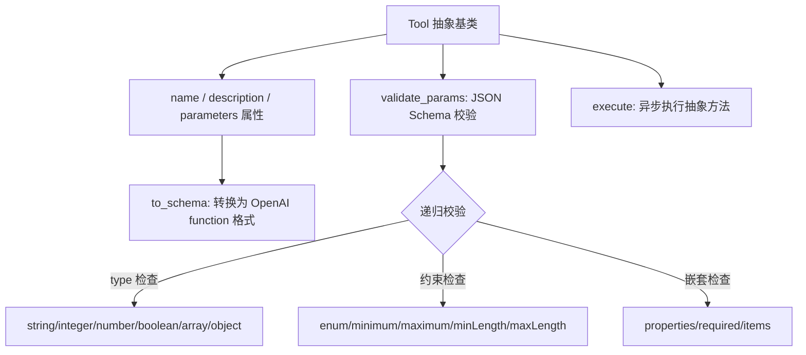
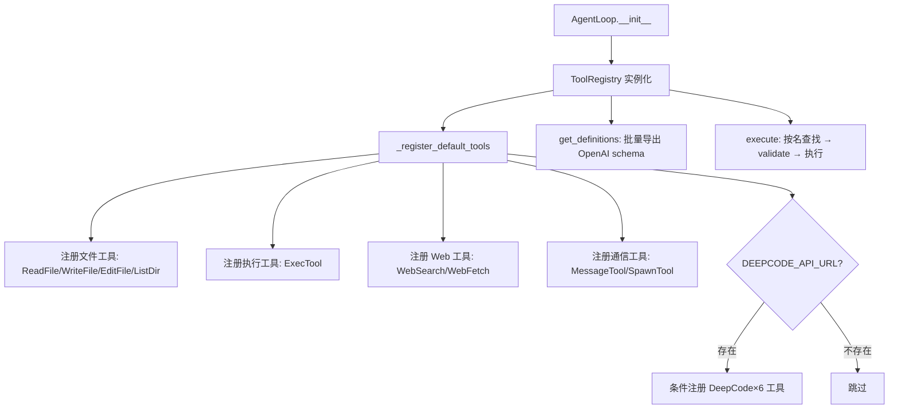
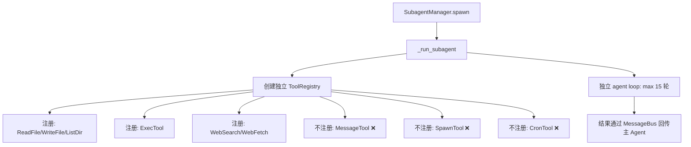

# PD-04.06 DeepCode — 双层 MCP 工具架构：FastMCP Server + nanobot ToolRegistry

> 文档编号：PD-04.06
> 来源：DeepCode `tools/code_implementation_server.py`, `config/mcp_tool_definitions.py`, `nanobot/nanobot/agent/tools/registry.py`
> GitHub：https://github.com/HKUDS/DeepCode.git
> 问题域：PD-04 工具系统 Tool System Design
> 状态：可复用方案

---

## 第 1 章 问题与动机

### 1.1 核心问题

Agent 系统需要同时支持两种截然不同的工具消费场景：

1. **外部 MCP 工具服务**：通过 Model Context Protocol 标准协议暴露工具，供外部 LLM 客户端（如 Claude Desktop、Cursor）调用。这些工具运行在独立进程中，通过 stdio/SSE 通信。
2. **内部 Agent 工具注册**：Agent 自身的 agentic loop 需要一套轻量级的工具注册表，将工具定义转换为 OpenAI function calling 格式，在进程内直接执行。

两种场景对工具的生命周期、通信协议、安全边界要求完全不同。如果用同一套机制硬塞，要么 MCP 工具无法独立部署，要么内部工具背负不必要的 IPC 开销。

### 1.2 DeepCode 的解法概述

DeepCode 采用**双层工具架构**，将两种场景彻底分离：

1. **MCP Server 层**（`tools/code_implementation_server.py:48`）：用 FastMCP 框架注册 10+ 个工具（文件读写、代码执行、搜索），作为独立进程运行，通过 MCP 协议对外服务
2. **nanobot ToolRegistry 层**（`nanobot/nanobot/agent/tools/registry.py:8`）：轻量级字典注册表，工具继承 `Tool` 抽象基类，在 AgentLoop 进程内直接执行
3. **MCPToolDefinitions 配置层**（`config/mcp_tool_definitions.py:18`）：将工具 schema 定义从实现中分离，支持按工具集（code_implementation / code_evaluation）分组管理
4. **条件加载机制**（`nanobot/nanobot/agent/loop.py:119-126`）：DeepCode 专属工具通过环境变量 `DEEPCODE_API_URL` 条件注册，实现按需加载
5. **子 Agent 工具隔离**（`nanobot/nanobot/agent/subagent.py:103-117`）：SubagentManager 为每个子 Agent 创建独立 ToolRegistry，剥离 message/spawn 等危险工具

### 1.3 设计思想

| 设计原则 | 具体实现 | 理由 | 替代方案 |
|----------|----------|------|----------|
| 关注点分离 | MCP Server 独立进程 vs ToolRegistry 进程内 | 外部工具需要标准协议通信，内部工具需要低延迟直调 | 统一用 MCP（内部工具多一层 IPC 开销） |
| Schema 与实现分离 | MCPToolDefinitions 集中管理 schema 定义 | 工具 schema 可独立于实现演进，便于注释掉不需要的工具 | schema 内联在工具实现中（修改需改两处） |
| 最小权限原则 | 子 Agent 独立注册表，无 message/spawn 工具 | 防止子 Agent 直接发消息或无限递归 spawn | 全局共享注册表 + 运行时权限检查 |
| 按需加载 | 环境变量驱动条件注册 | DeepCode API 工具仅在后端可用时注册 | 全量注册 + 运行时报错 |
| 安全纵深防御 | ExecTool deny_patterns + validate_path 路径校验 | 多层防护：正则黑名单 + 路径遍历检测 + workspace 限制 | 单一黑名单 |

---

## 第 2 章 源码实现分析

### 2.1 架构概览

DeepCode 的工具系统分为三个独立层次，各自有明确的职责边界：

```
┌─────────────────────────────────────────────────────────────────┐
│                    DeepCode 双层工具架构                          │
├─────────────────────────────────────────────────────────────────┤
│                                                                 │
│  ┌─────────────────────────────────────────────────────────┐   │
│  │  Layer 1: MCP Server 层（独立进程）                       │   │
│  │  tools/code_implementation_server.py                     │   │
│  │  ┌──────────┐ ┌──────────┐ ┌──────────┐ ┌───────────┐  │   │
│  │  │read_file │ │write_file│ │exec_python│ │search_code│  │   │
│  │  └──────────┘ └──────────┘ └──────────┘ └───────────┘  │   │
│  │  FastMCP("code-implementation-server")                   │   │
│  │  通信: stdio / SSE (MCP 协议)                            │   │
│  └─────────────────────────────────────────────────────────┘   │
│                                                                 │
│  ┌─────────────────────────────────────────────────────────┐   │
│  │  Layer 2: nanobot ToolRegistry 层（进程内）               │   │
│  │  nanobot/nanobot/agent/tools/registry.py                 │   │
│  │  ┌──────────┐ ┌──────────┐ ┌──────────┐ ┌───────────┐  │   │
│  │  │ReadFile  │ │WriteFile │ │ExecTool  │ │WebSearch  │  │   │
│  │  │EditFile  │ │ListDir   │ │SpawnTool │ │WebFetch   │  │   │
│  │  │MessageTool│ │CronTool │ │DeepCode×6│ │           │  │   │
│  │  └──────────┘ └──────────┘ └──────────┘ └───────────┘  │   │
│  │  ToolRegistry._tools: dict[str, Tool]                    │   │
│  │  输出: OpenAI function calling 格式                       │   │
│  └─────────────────────────────────────────────────────────┘   │
│                                                                 │
│  ┌─────────────────────────────────────────────────────────┐   │
│  │  Config 层: MCPToolDefinitions                           │   │
│  │  config/mcp_tool_definitions.py                          │   │
│  │  工具集: code_implementation | code_evaluation            │   │
│  │  职责: schema 定义与分组，与实现解耦                       │   │
│  └─────────────────────────────────────────────────────────┘   │
│                                                                 │
└─────────────────────────────────────────────────────────────────┘
```

### 2.2 核心实现

#### 2.2.1 Tool 抽象基类与参数校验



对应源码 `nanobot/nanobot/agent/tools/base.py:7-104`：

```python
class Tool(ABC):
    _TYPE_MAP = {
        "string": str, "integer": int, "number": (int, float),
        "boolean": bool, "array": list, "object": dict,
    }

    @property
    @abstractmethod
    def name(self) -> str: ...

    @property
    @abstractmethod
    def parameters(self) -> dict[str, Any]: ...

    @abstractmethod
    async def execute(self, **kwargs: Any) -> str: ...

    def validate_params(self, params: dict[str, Any]) -> list[str]:
        """Validate tool parameters against JSON schema. Returns error list."""
        schema = self.parameters or {}
        return self._validate(params, {**schema, "type": "object"}, "")

    def to_schema(self) -> dict[str, Any]:
        """Convert tool to OpenAI function schema format."""
        return {
            "type": "function",
            "function": {
                "name": self.name,
                "description": self.description,
                "parameters": self.parameters,
            },
        }
```

关键设计：`validate_params` 实现了完整的 JSON Schema 递归校验（类型、枚举、范围、必填字段），在 `execute` 前自动调用，避免无效参数传入工具。

#### 2.2.2 ToolRegistry 动态注册与执行



对应源码 `nanobot/nanobot/agent/tools/registry.py:8-73`：

```python
class ToolRegistry:
    def __init__(self):
        self._tools: dict[str, Tool] = {}

    def register(self, tool: Tool) -> None:
        self._tools[tool.name] = tool

    def get_definitions(self) -> list[dict[str, Any]]:
        """Get all tool definitions in OpenAI format."""
        return [tool.to_schema() for tool in self._tools.values()]

    async def execute(self, name: str, params: dict[str, Any]) -> str:
        tool = self._tools.get(name)
        if not tool:
            return f"Error: Tool '{name}' not found"
        try:
            errors = tool.validate_params(params)
            if errors:
                return f"Error: Invalid parameters for tool '{name}': " + "; ".join(errors)
            return await tool.execute(**params)
        except Exception as e:
            return f"Error executing {name}: {str(e)}"
```

核心流程：`register` → `get_definitions`（传给 LLM）→ LLM 返回 tool_call → `execute`（validate + 执行）。错误不抛异常，统一返回 `Error:` 前缀字符串，LLM 可自行重试。

#### 2.2.3 子 Agent 工具隔离



对应源码 `nanobot/nanobot/agent/subagent.py:103-117`：

```python
# Build subagent tools (no message tool, no spawn tool)
tools = ToolRegistry()
allowed_dir = self.workspace if self.restrict_to_workspace else None
tools.register(ReadFileTool(allowed_dir=allowed_dir))
tools.register(WriteFileTool(allowed_dir=allowed_dir))
tools.register(ListDirTool(allowed_dir=allowed_dir))
tools.register(ExecTool(
    working_dir=str(self.workspace),
    timeout=self.exec_config.timeout,
    restrict_to_workspace=self.restrict_to_workspace,
))
tools.register(WebSearchTool(api_key=self.brave_api_key))
tools.register(WebFetchTool())
```

子 Agent 的工具集是主 Agent 的严格子集：无 `MessageTool`（不能直接发消息给用户）、无 `SpawnTool`（不能递归创建子 Agent）、无 `CronTool`（不能创建定时任务）。这通过创建全新的 `ToolRegistry` 实例实现，而非在共享注册表上做运行时过滤。

### 2.3 实现细节

#### MCPToolDefinitions 工具集分组

`config/mcp_tool_definitions_index.py:22-58` 定义了两个工具集：

- **code_implementation**：write_file + search_code_references（当前激活的工具，其余被注释掉）
- **code_evaluation**：analyze_repo_structure / detect_dependencies / assess_code_quality / evaluate_documentation / check_reproduction_readiness / generate_evaluation_summary / detect_empty_files / detect_missing_files / generate_code_revision_report（9 个评估工具）

通过注释/取消注释控制工具集组合，`get_tool_set(name)` 按名称获取特定集合。这种"注释即配置"的方式虽然简单，但在快速迭代阶段非常实用。

#### ExecTool 安全防护

`nanobot/nanobot/agent/tools/shell.py:25-34` 实现了正则黑名单：

```python
self.deny_patterns = deny_patterns or [
    r"\brm\s+-[rf]{1,2}\b",      # rm -r, rm -rf
    r"\b(format|mkfs|diskpart)\b", # disk operations
    r"\bdd\s+if=",                 # dd
    r":\(\)\s*\{.*\};\s*:",       # fork bomb
    r"\b(shutdown|reboot|poweroff)\b",
]
```

同时 `code_implementation_server.py:780-790` 的 MCP 层也有独立的危险命令检查。两层防护互不依赖。

#### 条件工具加载

`nanobot/nanobot/agent/loop.py:119-126`：

```python
deepcode_url = os.environ.get("DEEPCODE_API_URL")
if deepcode_url:
    from nanobot.agent.tools.deepcode import create_all_tools
    for tool in create_all_tools(api_url=deepcode_url):
        self.tools.register(tool)
```

`create_all_tools` 工厂函数（`deepcode.py:477-496`）一次性创建 6 个 DeepCode 工具（paper2code / chat2code / status / list_tasks / cancel / respond），全部通过 HTTP 调用 DeepCode 后端 API。环境变量不存在时完全不加载，不会污染工具列表。

#### 工具上下文动态注入

`nanobot/nanobot/agent/loop.py:183-193` 在处理每条消息时动态更新工具上下文：

```python
message_tool = self.tools.get("message")
if isinstance(message_tool, MessageTool):
    message_tool.set_context(msg.channel, msg.chat_id)

spawn_tool = self.tools.get("spawn")
if isinstance(spawn_tool, SpawnTool):
    spawn_tool.set_context(msg.channel, msg.chat_id)
```

MessageTool 和 SpawnTool 需要知道当前消息来源（channel + chat_id），以便正确路由响应。这通过 `set_context` 方法在每次消息处理前注入，而非在构造时固定。

---

## 第 3 章 迁移指南

### 3.1 迁移清单

**阶段 1：基础工具注册表（1 天）**

- [ ] 创建 `Tool` 抽象基类（name/description/parameters/execute/validate_params/to_schema）
- [ ] 创建 `ToolRegistry` 类（register/unregister/get/execute/get_definitions）
- [ ] 实现 JSON Schema 递归参数校验
- [ ] 实现 OpenAI function calling 格式导出

**阶段 2：具体工具实现（2 天）**

- [ ] 实现文件系统工具（ReadFile/WriteFile/EditFile/ListDir），支持 `allowed_dir` 路径限制
- [ ] 实现 Shell 执行工具，含 deny_patterns 正则黑名单 + 路径遍历检测
- [ ] 实现 Web 工具（WebSearch/WebFetch）
- [ ] 实现通信工具（MessageTool + set_context 动态注入）

**阶段 3：MCP Server 层（可选）**

- [ ] 用 FastMCP 创建独立工具服务进程
- [ ] 将工具 schema 定义抽取到 MCPToolDefinitions 配置类
- [ ] 实现工具集分组（get_tool_set / get_all_tools）

**阶段 4：高级特性**

- [ ] 实现子 Agent 工具隔离（独立 ToolRegistry 实例）
- [ ] 实现条件工具加载（环境变量驱动）
- [ ] 实现工具上下文动态注入（set_context 模式）

### 3.2 适配代码模板

#### 最小可用工具注册表

```python
from abc import ABC, abstractmethod
from typing import Any


class Tool(ABC):
    """工具抽象基类，兼容 OpenAI function calling。"""

    @property
    @abstractmethod
    def name(self) -> str: ...

    @property
    @abstractmethod
    def description(self) -> str: ...

    @property
    @abstractmethod
    def parameters(self) -> dict[str, Any]: ...

    @abstractmethod
    async def execute(self, **kwargs: Any) -> str: ...

    def to_schema(self) -> dict[str, Any]:
        return {
            "type": "function",
            "function": {
                "name": self.name,
                "description": self.description,
                "parameters": self.parameters,
            },
        }


class ToolRegistry:
    """轻量级工具注册表，支持动态注册和 OpenAI 格式导出。"""

    def __init__(self):
        self._tools: dict[str, Tool] = {}

    def register(self, tool: Tool) -> None:
        self._tools[tool.name] = tool

    def unregister(self, name: str) -> None:
        self._tools.pop(name, None)

    def get_definitions(self) -> list[dict[str, Any]]:
        return [t.to_schema() for t in self._tools.values()]

    async def execute(self, name: str, params: dict[str, Any]) -> str:
        tool = self._tools.get(name)
        if not tool:
            return f"Error: Tool '{name}' not found"
        try:
            return await tool.execute(**params)
        except Exception as e:
            return f"Error executing {name}: {e}"


# 使用示例
class ReadFileTool(Tool):
    def __init__(self, allowed_dir=None):
        self._allowed_dir = allowed_dir

    @property
    def name(self) -> str:
        return "read_file"

    @property
    def description(self) -> str:
        return "Read the contents of a file at the given path."

    @property
    def parameters(self) -> dict[str, Any]:
        return {
            "type": "object",
            "properties": {
                "path": {"type": "string", "description": "File path to read"}
            },
            "required": ["path"],
        }

    async def execute(self, path: str, **kwargs) -> str:
        from pathlib import Path
        p = Path(path).expanduser().resolve()
        if self._allowed_dir and not str(p).startswith(str(self._allowed_dir)):
            return f"Error: Path outside allowed directory"
        if not p.exists():
            return f"Error: File not found: {path}"
        return p.read_text(encoding="utf-8")
```

#### 子 Agent 工具隔离模板

```python
def create_subagent_tools(workspace: str, restrict: bool = False) -> ToolRegistry:
    """为子 Agent 创建受限工具集，剥离通信和 spawn 工具。"""
    from pathlib import Path

    tools = ToolRegistry()
    allowed_dir = Path(workspace) if restrict else None

    # 只注册安全的工具子集
    tools.register(ReadFileTool(allowed_dir=allowed_dir))
    tools.register(WriteFileTool(allowed_dir=allowed_dir))
    tools.register(ExecTool(working_dir=workspace, timeout=60))
    # 不注册: MessageTool, SpawnTool, CronTool
    return tools
```

### 3.3 适用场景

| 场景 | 适用度 | 说明 |
|------|--------|------|
| 需要同时支持 MCP 协议和内部 Agent loop | ⭐⭐⭐ | 双层架构的核心价值 |
| 多 Agent 系统需要工具级权限隔离 | ⭐⭐⭐ | 独立 ToolRegistry 实例天然隔离 |
| 工具集需要按场景动态组合 | ⭐⭐⭐ | MCPToolDefinitions 分组 + 条件加载 |
| 单 Agent 系统，工具数量 < 10 | ⭐⭐ | 可以只用 ToolRegistry 层，不需要 MCP Server |
| 需要跨语言工具调用 | ⭐ | MCP Server 层支持，但 DeepCode 未展示此场景 |

---

## 第 4 章 测试用例

```python
import pytest
from typing import Any


# ===== 模拟 Tool 基类 =====
class Tool:
    _TYPE_MAP = {
        "string": str, "integer": int, "number": (int, float),
        "boolean": bool, "array": list, "object": dict,
    }

    @property
    def name(self) -> str:
        raise NotImplementedError

    @property
    def description(self) -> str:
        raise NotImplementedError

    @property
    def parameters(self) -> dict[str, Any]:
        raise NotImplementedError

    async def execute(self, **kwargs) -> str:
        raise NotImplementedError

    def validate_params(self, params: dict[str, Any]) -> list[str]:
        schema = self.parameters or {}
        return self._validate(params, {**schema, "type": "object"}, "")

    def _validate(self, val, schema, path):
        t, label = schema.get("type"), path or "parameter"
        if t in self._TYPE_MAP and not isinstance(val, self._TYPE_MAP[t]):
            return [f"{label} should be {t}"]
        errors = []
        if "enum" in schema and val not in schema["enum"]:
            errors.append(f"{label} must be one of {schema['enum']}")
        if t == "object":
            for k in schema.get("required", []):
                if k not in val:
                    errors.append(f"missing required {path + '.' + k if path else k}")
            for k, v in val.items():
                if k in schema.get("properties", {}):
                    errors.extend(self._validate(v, schema["properties"][k], path + "." + k if path else k))
        return errors

    def to_schema(self) -> dict[str, Any]:
        return {
            "type": "function",
            "function": {"name": self.name, "description": self.description, "parameters": self.parameters},
        }


class ToolRegistry:
    def __init__(self):
        self._tools: dict[str, Tool] = {}

    def register(self, tool: Tool) -> None:
        self._tools[tool.name] = tool

    def unregister(self, name: str) -> None:
        self._tools.pop(name, None)

    def get(self, name: str):
        return self._tools.get(name)

    def get_definitions(self) -> list[dict[str, Any]]:
        return [t.to_schema() for t in self._tools.values()]

    async def execute(self, name: str, params: dict[str, Any]) -> str:
        tool = self._tools.get(name)
        if not tool:
            return f"Error: Tool '{name}' not found"
        try:
            errors = tool.validate_params(params)
            if errors:
                return f"Error: Invalid parameters: " + "; ".join(errors)
            return await tool.execute(**params)
        except Exception as e:
            return f"Error executing {name}: {e}"

    @property
    def tool_names(self) -> list[str]:
        return list(self._tools.keys())

    def __len__(self):
        return len(self._tools)


# ===== 测试用具体工具 =====
class EchoTool(Tool):
    @property
    def name(self): return "echo"
    @property
    def description(self): return "Echo input text"
    @property
    def parameters(self):
        return {
            "type": "object",
            "properties": {"text": {"type": "string", "description": "Text to echo"}},
            "required": ["text"],
        }
    async def execute(self, text: str, **kwargs) -> str:
        return f"Echo: {text}"


class FailTool(Tool):
    @property
    def name(self): return "fail"
    @property
    def description(self): return "Always fails"
    @property
    def parameters(self):
        return {"type": "object", "properties": {}}
    async def execute(self, **kwargs) -> str:
        raise RuntimeError("Intentional failure")


# ===== 测试用例 =====
class TestToolRegistry:
    def test_register_and_get(self):
        registry = ToolRegistry()
        tool = EchoTool()
        registry.register(tool)
        assert registry.get("echo") is tool
        assert len(registry) == 1
        assert "echo" in registry.tool_names

    def test_unregister(self):
        registry = ToolRegistry()
        registry.register(EchoTool())
        registry.unregister("echo")
        assert registry.get("echo") is None
        assert len(registry) == 0

    def test_get_definitions_openai_format(self):
        registry = ToolRegistry()
        registry.register(EchoTool())
        defs = registry.get_definitions()
        assert len(defs) == 1
        assert defs[0]["type"] == "function"
        assert defs[0]["function"]["name"] == "echo"
        assert "text" in defs[0]["function"]["parameters"]["properties"]

    @pytest.mark.asyncio
    async def test_execute_success(self):
        registry = ToolRegistry()
        registry.register(EchoTool())
        result = await registry.execute("echo", {"text": "hello"})
        assert result == "Echo: hello"

    @pytest.mark.asyncio
    async def test_execute_tool_not_found(self):
        registry = ToolRegistry()
        result = await registry.execute("nonexistent", {})
        assert "not found" in result

    @pytest.mark.asyncio
    async def test_execute_catches_exception(self):
        registry = ToolRegistry()
        registry.register(FailTool())
        result = await registry.execute("fail", {})
        assert "Error executing fail" in result

    @pytest.mark.asyncio
    async def test_execute_validates_params(self):
        registry = ToolRegistry()
        registry.register(EchoTool())
        result = await registry.execute("echo", {})  # missing required "text"
        assert "Invalid parameters" in result


class TestToolValidation:
    def test_missing_required_field(self):
        tool = EchoTool()
        errors = tool.validate_params({})
        assert any("missing required" in e for e in errors)

    def test_wrong_type(self):
        tool = EchoTool()
        errors = tool.validate_params({"text": 123})
        assert any("should be string" in e for e in errors)

    def test_valid_params(self):
        tool = EchoTool()
        errors = tool.validate_params({"text": "hello"})
        assert errors == []


class TestSubagentToolIsolation:
    """测试子 Agent 工具隔离：独立注册表不包含危险工具。"""

    def test_subagent_registry_is_independent(self):
        main_registry = ToolRegistry()
        main_registry.register(EchoTool())

        sub_registry = ToolRegistry()
        sub_registry.register(EchoTool())

        # 修改子注册表不影响主注册表
        sub_registry.unregister("echo")
        assert main_registry.get("echo") is not None
        assert sub_registry.get("echo") is None

    def test_subagent_has_no_spawn_tool(self):
        """模拟 DeepCode 的子 Agent 工具隔离策略。"""
        main_registry = ToolRegistry()
        main_registry.register(EchoTool())
        # 主 Agent 有 spawn（此处用 FailTool 模拟）
        spawn = FailTool()
        spawn.__class__ = type("SpawnMock", (FailTool,), {"name": property(lambda s: "spawn")})
        # 注意：上面的 hack 仅用于测试演示

        # 子 Agent 注册表不包含 spawn
        sub_registry = ToolRegistry()
        sub_registry.register(EchoTool())
        assert sub_registry.get("spawn") is None
```

---

## 第 5 章 跨域关联

| 关联域 | 关系类型 | 说明 |
|--------|----------|------|
| PD-02 多 Agent 编排 | 依赖 | SubagentManager 依赖 ToolRegistry 为子 Agent 创建隔离工具集；SpawnTool 是编排的入口 |
| PD-03 容错与重试 | 协同 | ToolRegistry.execute 统一捕获异常返回错误字符串，LLM 可自行重试；ExecTool 有超时保护 |
| PD-05 沙箱隔离 | 协同 | ExecTool 的 deny_patterns + restrict_to_workspace + validate_path 构成工具级沙箱 |
| PD-09 Human-in-the-Loop | 协同 | DeepCodeRespondTool 实现了 User-in-Loop 交互，工作流可暂停等待用户输入 |
| PD-11 可观测性 | 协同 | code_implementation_server 的 log_operation 记录每次工具调用的操作历史 |

---

## 第 6 章 来源文件索引

| 文件 | 行范围 | 关键实现 |
|------|--------|----------|
| `nanobot/nanobot/agent/tools/base.py` | L7-L104 | Tool 抽象基类：name/description/parameters/execute/validate_params/to_schema |
| `nanobot/nanobot/agent/tools/registry.py` | L8-L73 | ToolRegistry：动态注册、OpenAI 格式导出、参数校验 + 执行 |
| `nanobot/nanobot/agent/loop.py` | L71-L126 | AgentLoop：ToolRegistry 实例化 + _register_default_tools + 条件加载 DeepCode 工具 |
| `nanobot/nanobot/agent/loop.py` | L183-L193 | 工具上下文动态注入：MessageTool/SpawnTool/CronTool 的 set_context |
| `nanobot/nanobot/agent/subagent.py` | L103-L117 | 子 Agent 工具隔离：独立 ToolRegistry，无 message/spawn/cron |
| `nanobot/nanobot/agent/tools/shell.py` | L12-L136 | ExecTool：deny_patterns 正则黑名单 + 路径遍历检测 + 输出截断 |
| `nanobot/nanobot/agent/tools/filesystem.py` | L1-L187 | 文件系统工具：ReadFile/WriteFile/EditFile/ListDir + allowed_dir 路径限制 |
| `nanobot/nanobot/agent/tools/spawn.py` | L11-L65 | SpawnTool：set_context 动态注入 + 委托 SubagentManager |
| `nanobot/nanobot/agent/tools/deepcode.py` | L24-L496 | DeepCode 6 工具：paper2code/chat2code/status/list_tasks/cancel/respond |
| `tools/code_implementation_server.py` | L41-L48 | FastMCP Server 实例化 + 工具注册 |
| `tools/code_implementation_server.py` | L92-L100 | validate_path：workspace 路径校验 |
| `tools/code_implementation_server.py` | L766-L790 | execute_bash：危险命令黑名单 |
| `config/mcp_tool_definitions.py` | L18-L376 | MCPToolDefinitions：工具 schema 定义（原始版，code_implementation 工具集） |
| `config/mcp_tool_definitions_index.py` | L18-L621 | MCPToolDefinitions 扩展版：code_implementation + code_evaluation 双工具集 |
| `tools/bocha_search_server.py` | L7-L39 | 独立 MCP Server：Bocha 搜索引擎集成 |

---

## 第 7 章 横向对比维度

```json comparison_data
{
  "project": "DeepCode",
  "dimensions": {
    "工具注册方式": "双层架构：FastMCP @mcp.tool 装饰器 + nanobot Tool ABC 继承注册",
    "工具分组/权限": "MCPToolDefinitions 按工具集分组 + 子 Agent 独立注册表隔离",
    "MCP 协议支持": "核心层 FastMCP Server，支持 stdio/SSE 通信",
    "热更新/缓存": "环境变量条件加载，注释即配置切换工具集",
    "超时保护": "ExecTool 60s + MCP execute_bash 30s 双层超时",
    "结果摘要": "read_code_mem 从 implement_code_summary.md 提取文件摘要",
    "生命周期追踪": "log_operation 记录操作历史 + get_operation_history 查询",
    "参数校验": "Tool.validate_params 递归 JSON Schema 校验",
    "安全防护": "deny_patterns 正则黑名单 + validate_path 路径遍历检测 + workspace 限制"
  }
}
```

### 域元数据补充

```json domain_metadata
{
  "solution_summary": "DeepCode 用 FastMCP Server + nanobot ToolRegistry 双层架构分离外部 MCP 协议工具和内部 Agent 工具，MCPToolDefinitions 实现 schema 与实现解耦，子 Agent 通过独立注册表实现工具级权限隔离",
  "description": "工具系统需要同时支持标准协议对外暴露和进程内高效调用两种模式",
  "sub_problems": [
    "双层工具架构：如何让同一工具同时服务 MCP 协议和内部 Agent loop",
    "工具集动态组合：如何按场景（实现/评估）选择性激活工具子集",
    "工具 schema 与实现分离：如何独立演进工具定义而不修改实现代码"
  ],
  "best_practices": [
    "错误返回字符串而非抛异常：让 LLM 可自行解读错误并重试",
    "子 Agent 用独立注册表实例而非运行时过滤：编译期隔离比运行时检查更安全",
    "条件加载用环境变量驱动：不可用的工具不注册，避免 LLM 选择不可用工具"
  ]
}
```
