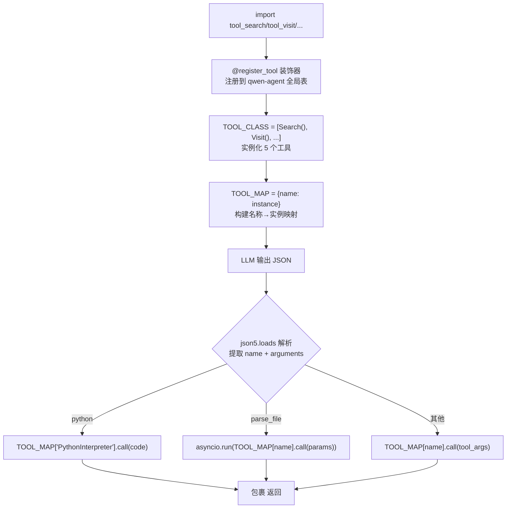
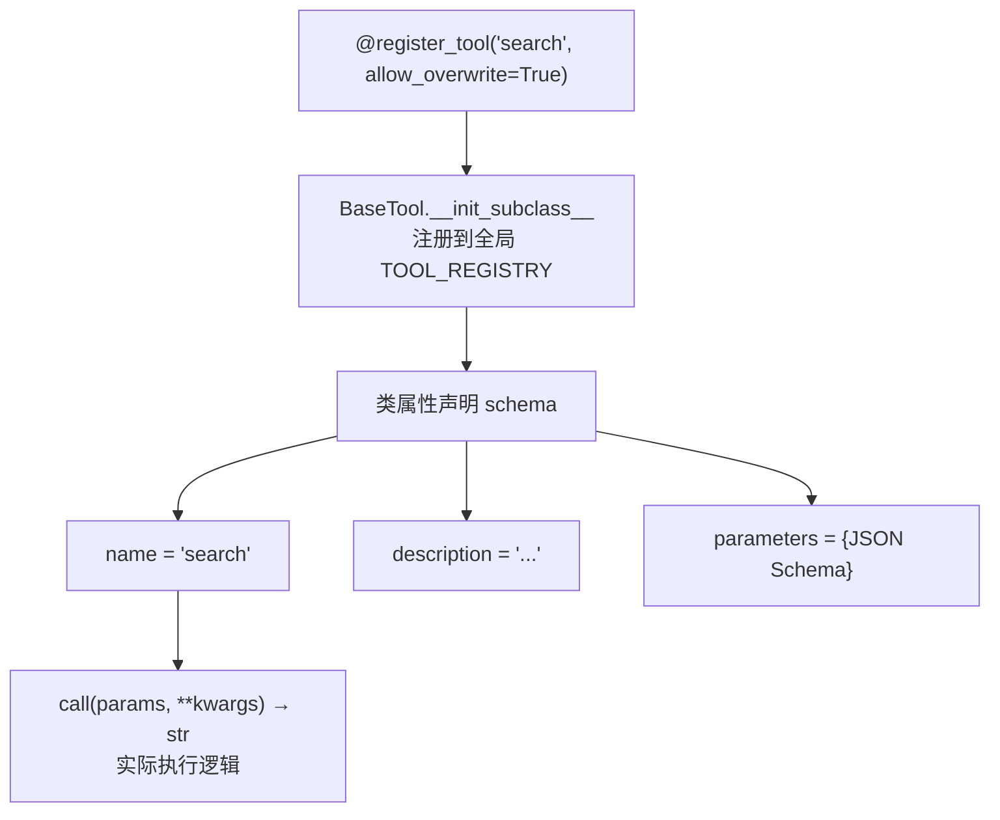
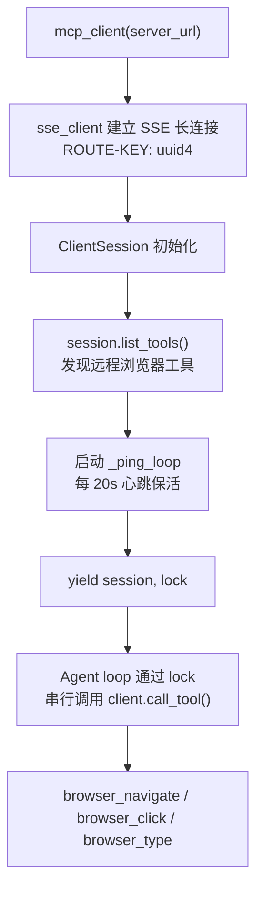

# PD-04.13 DeepResearch — 双体工具系统：qwen-agent 装饰器注册 + MCP 浏览器桥接

> 文档编号：PD-04.13
> 来源：DeepResearch `inference/react_agent.py` `WebAgent/NestBrowse/toolkit/mcp_client.py`
> GitHub：https://github.com/Alibaba-NLP/DeepResearch
> 问题域：PD-04 工具系统 Tool System Design
> 状态：可复用方案

---

## 第 1 章 问题与动机

### 1.1 核心问题

深度研究型 Agent 需要同时具备两类工具能力：

1. **本地工具**：搜索、学术检索、文件解析、代码执行——这些工具直接调用 API 或本地沙箱，延迟低、可控性强
2. **浏览器交互工具**：导航、点击、填写表单——这些工具需要操控真实浏览器实例，涉及异步 I/O、长连接保活、并发锁

两类工具的生命周期、调用模式、错误处理完全不同。如何用统一的 Agent loop 驱动这两套异构工具系统，是 DeepResearch 面临的核心工具系统设计问题。

### 1.2 DeepResearch 的解法概述

DeepResearch 采用"双体架构"——两套独立的工具系统服务于两个不同的 Agent 变体：

1. **Inference Agent（`inference/react_agent.py:31-38`）**：基于 qwen-agent 的 `@register_tool` 装饰器 + `TOOL_MAP` 字典，5 个本地工具通过类实例化后直接映射，`custom_call_tool` 方法按名称分发
2. **NestBrowse Agent（`WebAgent/NestBrowse/infer_async_nestbrowse.py:196-201`）**：4 个工具类各自持有 `tool_schema` 字典，通过 MCP SSE 客户端桥接远程浏览器服务，`call_tool` 函数按名称路由到对应工具实例
3. **工具调用协议统一**：两套系统都使用 `<tool_call>` XML 标签包裹 JSON 的文本协议，LLM 输出解析逻辑一致
4. **结果摘要层**：Visit 工具不直接返回原始网页内容，而是通过独立 LLM 调用提取 evidence + summary 结构化摘要
5. **并发控制**：NestBrowse 使用三级 Semaphore（session/llm/tool）+ asyncio.Lock 实现细粒度并发管理

### 1.3 设计思想

| 设计原则 | 具体实现 | 理由 | 替代方案 |
|----------|----------|------|----------|
| 装饰器即注册 | `@register_tool("search", allow_overwrite=True)` 注册到 qwen-agent 全局表 | 零配置，import 即注册 | YAML 配置文件声明工具 |
| 字典即路由 | `TOOL_MAP = {tool.name: tool for tool in TOOL_CLASS}` | O(1) 查找，代码即文档 | if-elif 链或 match-case |
| Schema 内嵌 Prompt | 工具 schema 直接写入 system prompt 的 `<tools>` 标签 | LLM 无需额外发现步骤 | 动态 list_tools 查询 |
| MCP 桥接浏览器 | SSE 长连接 + 心跳保活 + Lock 串行化 | 浏览器状态有序，避免并发操作冲突 | WebSocket 双向通信 |
| 结果摘要压缩 | Visit 返回前用 LLM 提取 evidence/summary | 控制回注 token，避免上下文爆炸 | 截断原文前 N 字符 |

---

## 第 2 章 源码实现分析

### 2.1 架构概览

DeepResearch 的工具系统分为两个独立子系统，分别服务于不同的 Agent 变体：

```
┌─────────────────────────────────────────────────────────────┐
│                    DeepResearch 工具系统                       │
├──────────────────────────┬──────────────────────────────────┤
│   Inference Agent        │   NestBrowse Agent               │
│   (同步 ReAct loop)      │   (异步 agentic loop)            │
│                          │                                  │
│  ┌──────────────────┐    │  ┌────────────────────────────┐  │
│  │ @register_tool   │    │  │ tool_schema 字典            │  │
│  │ BaseTool 子类     │    │  │ 独立 Python 类              │  │
│  └────────┬─────────┘    │  └──────────┬─────────────────┘  │
│           │              │             │                    │
│  ┌────────▼─────────┐    │  ┌──────────▼─────────────────┐  │
│  │ TOOL_MAP 字典     │    │  │ call_tool() 路由函数        │  │
│  │ {name: instance}  │    │  │ if/elif 名称匹配            │  │
│  └────────┬─────────┘    │  └──────────┬─────────────────┘  │
│           │              │             │                    │
│  ┌────────▼─────────┐    │  ┌──────────▼─────────────────┐  │
│  │ custom_call_tool  │    │  │ MCP SSE Client             │  │
│  │ 同步调用 .call()   │    │  │ 异步 client.call_tool()    │  │
│  └──────────────────┘    │  │ + Lock 串行化               │  │
│                          │  └────────────────────────────┘  │
│  工具: search, visit,    │  工具: search, visit,            │
│  google_scholar,         │  click, fill                     │
│  parse_file,             │  (浏览器操作通过 MCP 代理)        │
│  PythonInterpreter       │                                  │
└──────────────────────────┴──────────────────────────────────┘
```

### 2.2 核心实现

#### 2.2.1 Inference Agent：装饰器注册 + TOOL_MAP 分发



对应源码 `inference/react_agent.py:31-38`（工具注册与映射）：

```python
TOOL_CLASS = [
    FileParser(),
    Scholar(),
    Visit(),
    Search(),
    PythonInterpreter(),
]
TOOL_MAP = {tool.name: tool for tool in TOOL_CLASS}
```

对应源码 `inference/react_agent.py:228-247`（工具分发）：

```python
def custom_call_tool(self, tool_name: str, tool_args: dict, **kwargs):
    if tool_name in TOOL_MAP:
        tool_args["params"] = tool_args
        if "python" in tool_name.lower():
            result = TOOL_MAP['PythonInterpreter'].call(tool_args)
        elif tool_name == "parse_file":
            params = {"files": tool_args["files"]}
            raw_result = asyncio.run(TOOL_MAP[tool_name].call(params, file_root_path="./eval_data/file_corpus"))
            result = raw_result
            if not isinstance(raw_result, str):
                result = str(raw_result)
        else:
            raw_result = TOOL_MAP[tool_name].call(tool_args, **kwargs)
            result = raw_result
        return result
    else:
        return f"Error: Tool {tool_name} not found"
```

关键设计点：
- `parse_file` 是异步工具，在同步 Agent loop 中通过 `asyncio.run()` 桥接（`react_agent.py:236`）
- PythonInterpreter 有特殊的 `<code>` 标签解析路径（`react_agent.py:162-167`）
- 工具不存在时返回错误字符串而非抛异常，保证 Agent loop 不中断

#### 2.2.2 qwen-agent @register_tool 装饰器模式



对应源码 `inference/tool_search.py:18-34`（Search 工具注册）：

```python
@register_tool("search", allow_overwrite=True)
class Search(BaseTool):
    name = "search"
    description = "Performs batched web searches: supply an array 'query'; ..."
    parameters = {
        "type": "object",
        "properties": {
            "query": {
                "type": "array",
                "items": {"type": "string"},
                "description": "Array of query strings."
            },
        },
        "required": ["query"],
    }
```

每个工具遵循相同模式：类属性 `name`/`description`/`parameters` 声明 schema，`call()` 方法实现逻辑。`allow_overwrite=True` 允许同名工具在不同模块中重复注册（WebWeaver 和 Inference 都有 Search）。

#### 2.2.3 NestBrowse Agent：MCP SSE 客户端 + 浏览器工具桥接



对应源码 `WebAgent/NestBrowse/toolkit/mcp_client.py:13-49`（MCP 客户端）：

```python
@asynccontextmanager
async def mcp_client(server_url: str):
    async with sse_client(url=server_url, headers={
            "ROUTE-KEY": str(uuid.uuid4())
        }) as streams:
        async with ClientSession(*streams) as session:
            lock = asyncio.Lock()
            initialize = await session.initialize()
            response = await session.list_tools()
            tools = response.tools

            async def _ping_loop(ping_interval_seconds: int):
                try:
                    while True:
                        await anyio.sleep(ping_interval_seconds)
                        try:
                            async with lock:
                                await session.list_tools()
                        except Exception as e:
                            break
                except anyio.get_cancelled_exc_class():
                    pass

            session._task_group.start_soon(_ping_loop, 20)
            yield session, lock
```

关键设计点：
- `ROUTE-KEY` 头用于 MCP Server 端的会话路由（`mcp_client.py:18`）
- 心跳通过 `list_tools()` 实现，复用已有 RPC 方法而非专门的 ping（`mcp_client.py:38`）
- `asyncio.Lock()` 确保同一 session 的浏览器操作串行化（`mcp_client.py:21`）

#### 2.2.4 NestBrowse 工具 Schema 与 MCP 调用桥接

对应源码 `WebAgent/NestBrowse/toolkit/browser.py:16-75`（Visit 工具桥接 MCP）：

```python
class Visit:
    tool_schema = {
        "type": "function",
        "function": {
            "name": "visit",
            "description": "Visit the webpage and return a summary of its content.",
            "parameters": { ... }
        }
    }

    async def call(self, params, **kwargs):
        client = kwargs.get('client')
        lock = kwargs.get("lock")
        async with lock:
            response = await client.call_tool('browser_navigate', {'url': url})
        raw_response_text = response.content[0].text
        # ... 调用 process_response 做 LLM 摘要
```

NestBrowse 的工具类不继承 BaseTool，而是独立的 Python 类，通过 `tool_schema` 字典声明 schema。调用时通过 `kwargs` 注入 MCP client 和 lock，实现了工具定义与 MCP 传输的解耦。

### 2.3 实现细节

#### 并发控制：三级 Semaphore 架构

`infer_async_nestbrowse.py:178-182` 定义了三级信号量：

```python
sem = {
    'session': asyncio.Semaphore(MAX_WORKERS),  # 并发会话数
    'llm': asyncio.Semaphore(MAX_WORKERS),       # 并发 LLM 调用数
    'tool': asyncio.Semaphore(MAX_WORKERS),       # 并发工具调用数
}
```

每个维度独立限流：session 控制 MCP 连接数，llm 控制推理并发，tool 控制工具执行并发。

#### XML 标签工具调用协议

两套 Agent 都使用相同的文本协议（`inference/prompt.py:30-33`）：

```
<tool_call>
{"name": <function-name>, "arguments": <args-json-object>}
</tool_call>
```

LLM 输出中检测 `<tool_call>` 标签，用字符串 split 提取 JSON，再用 `json5.loads` 容错解析。这比 OpenAI function calling 格式更灵活，兼容任意 LLM 后端。

#### 工具结果摘要层

Visit 工具不直接返回原始网页，而是通过独立 LLM 调用提取结构化摘要（`inference/tool_visit.py:179-247`）：
- 先用 Jina Reader 获取网页 Markdown
- 用 tiktoken 截断到 95K tokens
- 调用摘要 LLM 提取 `{rational, evidence, summary}` JSON
- 摘要失败时渐进截断重试（70% → 70% → 25000 字符）


---

## 第 3 章 迁移指南

### 3.1 迁移清单

**阶段 1：基础工具注册（1 天）**
- [ ] 定义 BaseTool 抽象基类（name/description/parameters/call）
- [ ] 实现 `@register_tool` 装饰器或等效注册机制
- [ ] 构建 TOOL_MAP 字典映射
- [ ] 实现 `custom_call_tool` 分发函数

**阶段 2：XML 工具调用协议（0.5 天）**
- [ ] 在 system prompt 中嵌入 `<tools>` schema
- [ ] 实现 `<tool_call>` 标签解析（json5 容错）
- [ ] 实现 `<tool_response>` 结果包裹

**阶段 3：MCP 浏览器桥接（1 天）**
- [ ] 集成 `mcp` Python SDK
- [ ] 实现 SSE 客户端 + 心跳保活
- [ ] 实现 asyncio.Lock 串行化
- [ ] 封装 Visit/Click/Fill 工具类

**阶段 4：结果摘要层（0.5 天）**
- [ ] 实现 LLM 摘要提取（evidence/summary 格式）
- [ ] 实现渐进截断重试策略

### 3.2 适配代码模板

#### 最小化工具注册与分发系统

```python
"""可直接复用的工具注册与分发框架，灵感来自 DeepResearch 的 TOOL_MAP 模式"""
import json5
from abc import ABC, abstractmethod
from typing import Any, Dict, Optional, Union


class BaseTool(ABC):
    """工具基类：声明 schema + 实现 call"""
    name: str = ""
    description: str = ""
    parameters: dict = {}

    @abstractmethod
    def call(self, params: Union[str, dict], **kwargs) -> str:
        """执行工具逻辑，返回字符串结果"""
        ...

    @property
    def schema(self) -> dict:
        return {
            "type": "function",
            "function": {
                "name": self.name,
                "description": self.description,
                "parameters": self.parameters,
            }
        }


# 全局工具注册表
_TOOL_REGISTRY: Dict[str, BaseTool] = {}


def register_tool(name: str, allow_overwrite: bool = False):
    """装饰器：注册工具到全局表"""
    def decorator(cls):
        if name in _TOOL_REGISTRY and not allow_overwrite:
            raise ValueError(f"Tool '{name}' already registered")
        _TOOL_REGISTRY[name] = cls()
        return cls
    return decorator


def get_tool_map() -> Dict[str, BaseTool]:
    return dict(_TOOL_REGISTRY)


def call_tool(tool_name: str, tool_args: dict, **kwargs) -> str:
    """按名称分发工具调用"""
    tool_map = get_tool_map()
    if tool_name not in tool_map:
        return f"Error: Tool '{tool_name}' not found. Available: {list(tool_map.keys())}"
    try:
        return tool_map[tool_name].call(tool_args, **kwargs)
    except Exception as e:
        return f"Error executing '{tool_name}': {str(e)}"


def build_tools_prompt(tool_map: Dict[str, BaseTool]) -> str:
    """生成嵌入 system prompt 的 <tools> 块"""
    schemas = [json5.dumps(t.schema) for t in tool_map.values()]
    return "<tools>\n" + "\n".join(schemas) + "\n</tools>"


def parse_tool_call(content: str) -> Optional[Dict[str, Any]]:
    """从 LLM 输出中解析 <tool_call> 标签"""
    if "<tool_call>" not in content or "</tool_call>" not in content:
        return None
    raw = content.split("<tool_call>")[-1].split("</tool_call>")[0].strip()
    try:
        parsed = json5.loads(raw)
        return {"name": parsed.get("name", ""), "arguments": parsed.get("arguments", {})}
    except Exception:
        return None
```

#### MCP 浏览器客户端模板

```python
"""MCP SSE 客户端模板，基于 DeepResearch NestBrowse 的心跳保活模式"""
import asyncio
import uuid
from contextlib import asynccontextmanager
from mcp import ClientSession
from mcp.client.sse import sse_client
import anyio


@asynccontextmanager
async def create_mcp_browser_client(server_url: str, ping_interval: int = 20):
    """创建带心跳保活的 MCP 浏览器客户端"""
    async with sse_client(url=server_url, headers={"ROUTE-KEY": str(uuid.uuid4())}) as streams:
        async with ClientSession(*streams) as session:
            lock = asyncio.Lock()
            await session.initialize()
            tools = (await session.list_tools()).tools
            print(f"Connected to MCP server with tools: {[t.name for t in tools]}")

            async def _ping_loop():
                try:
                    while True:
                        await anyio.sleep(ping_interval)
                        async with lock:
                            await session.list_tools()
                except (anyio.get_cancelled_exc_class(), Exception):
                    pass

            session._task_group.start_soon(_ping_loop)
            yield session, lock
```

### 3.3 适用场景

| 场景 | 适用度 | 说明 |
|------|--------|------|
| 研究型 Agent（搜索+阅读+代码） | ⭐⭐⭐ | 完美匹配，5 工具组合覆盖研究全流程 |
| 浏览器自动化 Agent | ⭐⭐⭐ | MCP 桥接模式可直接复用 |
| 工具数量 < 10 的轻量 Agent | ⭐⭐⭐ | TOOL_MAP 模式简洁高效 |
| 工具数量 > 50 的大型系统 | ⭐ | 缺乏分组/权限/动态发现机制 |
| 需要热更新工具的 SaaS 平台 | ⭐ | 静态注册，无运行时增删能力 |

---

## 第 4 章 测试用例

```python
"""基于 DeepResearch 真实函数签名的测试用例"""
import pytest
import json
import asyncio
from unittest.mock import AsyncMock, MagicMock, patch


class TestToolMapRegistration:
    """测试 TOOL_MAP 字典注册模式"""

    def test_tool_map_contains_all_tools(self):
        """验证所有工具都注册到 TOOL_MAP"""
        expected_tools = {"parse_file", "google_scholar", "visit", "search", "PythonInterpreter"}
        # 模拟 DeepResearch 的注册方式
        class FakeTool:
            def __init__(self, name):
                self.name = name
        tool_class = [FakeTool(n) for n in expected_tools]
        tool_map = {tool.name: tool for tool in tool_class}
        assert set(tool_map.keys()) == expected_tools

    def test_tool_map_lookup_o1(self):
        """验证 O(1) 查找"""
        tool_map = {"search": MagicMock(), "visit": MagicMock()}
        assert "search" in tool_map
        assert "nonexistent" not in tool_map

    def test_custom_call_tool_unknown_tool(self):
        """验证未知工具返回错误字符串而非抛异常"""
        tool_map = {}
        tool_name = "unknown_tool"
        if tool_name in tool_map:
            result = tool_map[tool_name].call({})
        else:
            result = f"Error: Tool {tool_name} not found"
        assert "not found" in result


class TestXMLToolCallParsing:
    """测试 XML 标签工具调用解析"""

    def test_parse_valid_tool_call(self):
        content = '<think>reasoning</think>\n<tool_call>\n{"name": "search", "arguments": {"query": ["test"]}}\n</tool_call>'
        tool_call_str = content.split('<tool_call>')[1].split('</tool_call>')[0]
        parsed = json.loads(tool_call_str)
        assert parsed["name"] == "search"
        assert parsed["arguments"]["query"] == ["test"]

    def test_parse_python_special_path(self):
        """验证 PythonInterpreter 的 <code> 标签特殊解析"""
        content = '<tool_call>\n{"name": "PythonInterpreter", "arguments": {}}\n<code>\nprint("hello")\n</code>\n</tool_call>'
        tool_call_str = content.split('<tool_call>')[1].split('</tool_call>')[0]
        assert "python" in tool_call_str.lower()
        code = content.split('<code>')[1].split('</code>')[0].strip()
        assert code == 'print("hello")'

    def test_truncate_tool_response_tag(self):
        """验证 <tool_response> 截断逻辑"""
        content = "some reasoning<tool_response>leaked content"
        if '<tool_response>' in content:
            pos = content.find('<tool_response>')
            content = content[:pos]
        assert '<tool_response>' not in content


class TestMCPClientHeartbeat:
    """测试 MCP SSE 客户端心跳保活"""

    @pytest.mark.asyncio
    async def test_ping_loop_calls_list_tools(self):
        """验证心跳通过 list_tools 实现"""
        mock_session = AsyncMock()
        mock_session.list_tools.return_value = MagicMock(tools=[])
        lock = asyncio.Lock()

        async with lock:
            await mock_session.list_tools()
        mock_session.list_tools.assert_called_once()

    @pytest.mark.asyncio
    async def test_lock_serializes_browser_ops(self):
        """验证 Lock 串行化浏览器操作"""
        lock = asyncio.Lock()
        call_order = []

        async def op(name, delay):
            async with lock:
                call_order.append(f"{name}_start")
                await asyncio.sleep(delay)
                call_order.append(f"{name}_end")

        await asyncio.gather(op("a", 0.1), op("b", 0.05))
        # Lock 保证 a 完成后 b 才开始
        assert call_order == ["a_start", "a_end", "b_start", "b_end"]


class TestToolResultSummary:
    """测试工具结果摘要层"""

    def test_truncate_to_tokens(self):
        """验证 token 截断逻辑"""
        import tiktoken
        encoding = tiktoken.get_encoding("cl100k_base")
        text = "hello world " * 100000
        tokens = encoding.encode(text)
        max_tokens = 1000
        truncated = encoding.decode(tokens[:max_tokens])
        assert len(encoding.encode(truncated)) <= max_tokens

    def test_summary_json_extraction(self):
        """验证从 LLM 输出中提取 JSON 的容错逻辑"""
        raw = 'Some text ```json\n{"rational": "r", "evidence": "e", "summary": "s"}\n```'
        raw = raw.replace("```json", "").replace("```", "").strip()
        parsed = json.loads(raw)
        assert "evidence" in parsed
        assert "summary" in parsed
```


---

## 第 5 章 跨域关联

| 关联域 | 关系类型 | 说明 |
|--------|----------|------|
| PD-01 上下文管理 | 依赖 | Visit 工具的结果摘要层直接服务于上下文压缩——95K token 截断 + LLM 摘要提取避免原始网页撑爆上下文窗口（`tool_visit.py:197`） |
| PD-03 容错与重试 | 协同 | 每个工具内部都有独立重试逻辑：Search 5 次重试（`tool_search.py:63`）、Visit 8 次 Jina 重试（`tool_visit.py:170`）、PythonInterpreter 8 次沙箱端点轮询（`tool_python.py:76`）、LLM 调用指数退避重试（`react_agent.py:70-106`） |
| PD-05 沙箱隔离 | 依赖 | PythonInterpreter 通过 sandbox_fusion 远程沙箱执行代码，多端点随机负载均衡（`tool_python.py:79`） |
| PD-08 搜索与检索 | 协同 | Search 和 Scholar 工具是搜索检索域的具体实现，支持批量查询和中文自动检测路由（`tool_search.py:39-40`） |
| PD-11 可观测性 | 弱关联 | 当前工具系统缺乏结构化追踪，仅有 print 日志；NestBrowse 的 `call_tool` 记录了工具名和参数（`infer_async_nestbrowse.py:89-90`）但未集成到正式追踪系统 |
| PD-12 推理增强 | 协同 | Agent loop 的 `<think>` 标签推理与 `<tool_call>` 工具调用交替进行，工具结果直接影响下一轮推理方向 |

---

## 第 6 章 来源文件索引

| 文件 | 行范围 | 关键实现 |
|------|--------|----------|
| `inference/react_agent.py` | L31-L38 | TOOL_CLASS 实例化 + TOOL_MAP 字典构建 |
| `inference/react_agent.py` | L120-L226 | MultiTurnReactAgent._run() 主循环 |
| `inference/react_agent.py` | L228-L247 | custom_call_tool() 工具分发 |
| `inference/tool_search.py` | L18-L131 | Search 工具：@register_tool + Serper API |
| `inference/tool_visit.py` | L39-L255 | Visit 工具：Jina Reader + LLM 摘要 |
| `inference/tool_scholar.py` | L12-L110 | Scholar 工具：Google Scholar via Serper |
| `inference/tool_python.py` | L28-L151 | PythonInterpreter：sandbox_fusion 远程执行 |
| `inference/tool_file.py` | L99-L142 | FileParser：多格式文件解析 |
| `inference/prompt.py` | L1-L51 | SYSTEM_PROMPT：工具 schema 嵌入 |
| `WebAgent/NestBrowse/toolkit/mcp_client.py` | L13-L49 | MCP SSE 客户端 + 心跳保活 |
| `WebAgent/NestBrowse/toolkit/browser.py` | L16-L192 | Visit/Click/Fill 浏览器工具类 |
| `WebAgent/NestBrowse/infer_async_nestbrowse.py` | L19-L32 | call_tool() 路由函数 |
| `WebAgent/NestBrowse/infer_async_nestbrowse.py` | L35-L113 | agentic_loop() 异步 Agent 主循环 |
| `WebAgent/NestBrowse/infer_async_nestbrowse.py` | L178-L201 | 三级 Semaphore + 工具实例化 |
| `WebAgent/NestBrowse/toolkit/tool_explore.py` | L7-L47 | process_response() 增量摘要 |
| `WebAgent/NestBrowse/utils.py` | L9-L63 | call_llm() 异步 LLM 调用 + 双模式路由 |

---

## 第 7 章 横向对比维度

> **重要：** 本章用于自动填充 Butcher Wiki 的横向对比表。

```json comparison_data
{
  "project": "DeepResearch",
  "dimensions": {
    "工具注册方式": "@register_tool 装饰器 + TOOL_MAP 字典映射，import 即注册",
    "工具分组/权限": "无分组/权限机制，所有工具对 Agent 全量可见",
    "MCP 协议支持": "NestBrowse 通过 SSE 长连接集成 MCP 浏览器工具",
    "热更新/缓存": "静态注册，无运行时热更新能力",
    "超时保护": "多层超时：LLM 600s、Visit 900s、Python 50s、总体 150min",
    "Schema 生成方式": "类属性声明 + system prompt 内嵌 <tools> 标签",
    "结果摘要": "Visit 用独立 LLM 提取 evidence/summary，渐进截断重试",
    "工具推荐策略": "无动态推荐，全量工具写入 system prompt",
    "双层API架构": "Inference 同步 + NestBrowse 异步，两套独立工具系统",
    "工具上下文注入": "NestBrowse 通过 kwargs 注入 MCP client/lock/tokenizer",
    "MCP格式转换": "browser.py 工具类将 Agent 参数转为 MCP call_tool 参数",
    "工具条件加载": "按 Agent 变体选择工具集：Inference 5 工具 / NestBrowse 4 工具",
    "延迟导入隔离": "无延迟导入，所有工具模块在 react_agent.py 顶部 import *"
  }
}
```

### 域元数据补充

```json domain_metadata
{
  "solution_summary": "DeepResearch 用 qwen-agent @register_tool 装饰器 + TOOL_MAP 字典构建本地工具注册分发，NestBrowse 通过 MCP SSE 客户端桥接远程浏览器工具，两套系统共享 XML 标签工具调用协议",
  "description": "异构工具系统的统一调用协议设计与浏览器工具的 MCP 桥接模式",
  "sub_problems": [
    "心跳保活：MCP SSE 长连接如何通过周期性 RPC 调用防止服务端超时断开",
    "工具结果摘要分片：大网页内容如何分片送入摘要 LLM 并增量合并结果",
    "异构工具系统统一协议：同步本地工具和异步远程工具如何共享同一套 XML 调用协议",
    "沙箱端点负载均衡：多个沙箱执行端点如何通过随机选择实现简单负载均衡",
    "批量查询合并：搜索工具如何支持单次调用传入多个 query 减少 Agent 轮次"
  ],
  "best_practices": [
    "心跳复用已有 RPC：用 list_tools 做心跳而非专门 ping，减少协议复杂度",
    "工具调用用 XML 标签而非 function calling：兼容任意 LLM 后端，不依赖特定 API 格式",
    "异步工具在同步 loop 中用 asyncio.run 桥接：简单但需注意事件循环嵌套问题"
  ]
}
```

