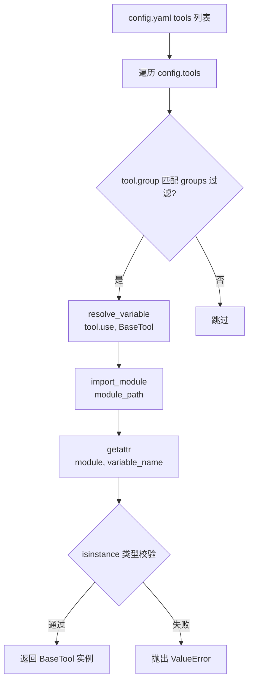
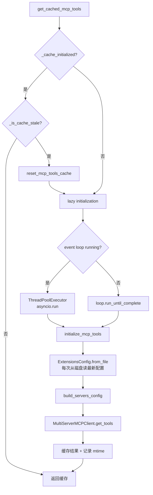

# PD-04.02 DeerFlow — 反射式四层工具组合系统

> 文档编号：PD-04.02
> 来源：DeerFlow `backend/src/tools/tools.py` `backend/src/reflection/resolvers.py` `backend/src/mcp/cache.py`
> GitHub：https://github.com/bytedance/deer-flow
> 问题域：PD-04 工具系统 Tool System Design
> 状态：可复用方案

---

## 第 1 章 问题与动机

### 1.1 核心问题

Agent 工具系统面临一个根本矛盾：**工具来源多样性** vs **统一调用接口**。一个成熟的 Agent 需要同时使用：
- 配置文件声明的社区工具（搜索、抓取等）
- 代码硬编码的内置工具（澄清、文件展示等）
- MCP 协议接入的外部服务工具
- 子 Agent 委托工具

这四类工具的注册方式、生命周期、权限模型完全不同，但 LLM 只认一个统一的 `tools` 列表。如何在保持 LLM 接口简洁的同时，支持四种异构工具源的动态组合？

### 1.2 DeerFlow 的解法概述

DeerFlow 设计了一个**四层工具组合架构**，核心入口是 `get_available_tools()` 函数（`backend/src/tools/tools.py:22-84`），它将四种来源的工具合并为一个扁平列表：

1. **Config 层**：通过 `config.yaml` 声明工具，用 `resolve_variable()` 反射加载（`backend/src/reflection/resolvers.py:7-46`）
2. **Builtin 层**：硬编码的内置工具列表，按运行时条件动态增减（`backend/src/tools/tools.py:11-18`）
3. **MCP 层**：通过 `extensions_config.json` 声明 MCP 服务器，懒加载 + mtime 缓存失效（`backend/src/mcp/cache.py:56-126`）
4. **Subagent 层**：`task_tool` 仅在 `subagent_enabled=True` 时注入，子 Agent 内部递归调用时自动排除（`backend/src/tools/tools.py:70-72`）

最终合并：`loaded_tools + builtin_tools + mcp_tools`（`backend/src/tools/tools.py:84`）

### 1.3 设计思想

| 设计原则 | 具体实现 | 理由 | 替代方案 |
|----------|----------|------|----------|
| 声明式优先 | config.yaml 定义工具名、分组、模块路径 | 非开发者也能增删工具，无需改代码 | 代码硬编码（不灵活） |
| 反射加载 | `resolve_variable("module:var", BaseTool)` 带类型校验 | 延迟导入 + 类型安全，避免启动时加载所有依赖 | 工厂注册表（需手动注册） |
| 分层组合 | 四层独立管理，最终合并为扁平列表 | 每层有独立的生命周期和缓存策略 | 统一注册表（耦合度高） |
| 条件注入 | vision 工具按模型能力注入，subagent 工具按层级注入 | 避免给 LLM 无法使用的工具 | 全量注入 + 运行时报错 |
| mtime 缓存 | MCP 工具用文件修改时间判断缓存是否过期 | 支持 Gateway API 热更新配置 | TTL 缓存（不精确）或无缓存（性能差） |

---

## 第 2 章 源码实现分析

### 2.1 架构概览

DeerFlow 的工具系统由三个核心模块组成，通过 `get_available_tools()` 统一输出：

```
┌─────────────────────────────────────────────────────────┐
│                  get_available_tools()                    │
│                 backend/src/tools/tools.py                │
├─────────────┬──────────────┬─────────────┬──────────────┤
│  Config 层   │  Builtin 层   │   MCP 层    │ Subagent 层  │
│             │              │             │              │
│ config.yaml │ BUILTIN_TOOLS│ extensions  │ task_tool    │
│ + resolve   │ + view_image │ _config.json│ (条件注入)    │
│ _variable() │ (条件注入)    │ + mtime缓存 │              │
└──────┬──────┴──────┬───────┴──────┬──────┴──────┬───────┘
       │             │              │              │
       ▼             ▼              ▼              ▼
  loaded_tools  builtin_tools   mcp_tools    subagent_tools
       │             │              │              │
       └─────────────┴──────────────┴──────────────┘
                          │
                          ▼
                  list[BaseTool]  →  LLM
```

### 2.2 核心实现

#### 2.2.1 反射式工具加载（Config 层）



对应源码 `backend/src/reflection/resolvers.py:7-46`：

```python
def resolve_variable[T](
    variable_path: str,
    expected_type: type[T] | tuple[type, ...] | None = None,
) -> T:
    """Resolve a variable from a path.
    Args:
        variable_path: "parent_package.module_name:variable_name"
        expected_type: Optional type for isinstance validation.
    """
    try:
        module_path, variable_name = variable_path.rsplit(":", 1)
    except ValueError as err:
        raise ImportError(
            f"{variable_path} doesn't look like a variable path"
        ) from err

    module = import_module(module_path)
    variable = getattr(module, variable_name)

    # Type validation
    if expected_type is not None:
        if not isinstance(variable, expected_type):
            raise ValueError(
                f"{variable_path} is not an instance of {expected_type.__name__}"
            )
    return variable
```

调用方式（`backend/src/tools/tools.py:43`）：

```python
loaded_tools = [
    resolve_variable(tool.use, BaseTool)
    for tool in config.tools
    if groups is None or tool.group in groups
]
```

config.yaml 中的工具声明（`config.example.yaml:94-135`）：

```yaml
tool_groups:
  - name: web
  - name: file:read
  - name: file:write
  - name: bash

tools:
  - name: web_search
    group: web
    use: src.community.tavily.tools:web_search_tool
  - name: web_fetch
    group: web
    use: src.community.jina_ai.tools:web_fetch_tool
    timeout: 10
  - name: bash
    group: bash
    use: src.sandbox.tools:bash_tool
```

关键设计：`use` 字段采用 `module:variable` 格式，`resolve_variable` 在运行时通过 `importlib.import_module` 动态加载，实现了**声明式注册 + 延迟导入**。`ToolConfig` 使用 Pydantic `ConfigDict(extra="allow")`（`backend/src/config/tool_config.py:20`），允许工具携带任意额外配置（如 `timeout`、`max_results`）。

#### 2.2.2 MCP 工具懒加载与 mtime 缓存



对应源码 `backend/src/mcp/cache.py:82-126`：

```python
def get_cached_mcp_tools() -> list[BaseTool]:
    global _cache_initialized

    # Check if cache is stale due to config file changes
    if _is_cache_stale():
        logger.info("MCP cache is stale, resetting for re-initialization...")
        reset_mcp_tools_cache()

    if not _cache_initialized:
        logger.info("MCP tools not initialized, performing lazy initialization...")
        try:
            loop = asyncio.get_event_loop()
            if loop.is_running():
                # LangGraph Studio 场景：在新线程中运行 async 初始化
                import concurrent.futures
                with concurrent.futures.ThreadPoolExecutor() as executor:
                    future = executor.submit(asyncio.run, initialize_mcp_tools())
                    future.result()
            else:
                loop.run_until_complete(initialize_mcp_tools())
        except RuntimeError:
            asyncio.run(initialize_mcp_tools())
        except Exception as e:
            logger.error(f"Failed to lazy-initialize MCP tools: {e}")
            return []

    return _mcp_tools_cache or []
```

mtime 缓存失效检测（`backend/src/mcp/cache.py:31-53`）：

```python
def _is_cache_stale() -> bool:
    global _config_mtime
    if not _cache_initialized:
        return False
    current_mtime = _get_config_mtime()
    if _config_mtime is None or current_mtime is None:
        return False
    if current_mtime > _config_mtime:
        logger.info(f"MCP config file has been modified "
                     f"(mtime: {_config_mtime} -> {current_mtime}), cache is stale")
        return True
    return False
```

关键设计：MCP 工具使用 `os.path.getmtime()` 追踪配置文件修改时间。当 Gateway API（独立进程）修改了 `extensions_config.json` 后，下次 `get_cached_mcp_tools()` 调用会检测到 mtime 变化并自动重新加载。这实现了**跨进程热更新**而无需重启服务。

### 2.3 实现细节

#### 条件注入机制

`get_available_tools()` 通过参数控制工具集的动态组合（`backend/src/tools/tools.py:22-84`）：

- `groups` 参数：过滤 Config 层工具的分组（如只给 Researcher 提供 `web` 组工具）
- `include_mcp`：是否包含 MCP 工具（默认 True）
- `model_name`：决定是否注入 `view_image_tool`（仅 `supports_vision=True` 的模型）
- `subagent_enabled`：控制 `task_tool` 注入，子 Agent 调用时传 `False` 防止递归嵌套

#### 子 Agent 工具隔离

`task_tool`（`backend/src/tools/builtins/task_tool.py:99-102`）在创建子 Agent 时显式排除自身：

```python
# Subagents should not have subagent tools enabled (prevent recursive nesting)
tools = get_available_tools(model_name=parent_model, subagent_enabled=False)
```

#### 悬挂工具调用修复

`DanglingToolCallMiddleware`（`backend/src/agents/middlewares/dangling_tool_call_middleware.py:22-74`）在模型调用前扫描消息历史，为缺少 `ToolMessage` 响应的工具调用注入占位错误消息，防止 LLM 因消息格式不完整而报错。

#### MCP 多传输协议支持

`build_server_params()`（`backend/src/mcp/client.py:11-42`）支持三种 MCP 传输类型：
- `stdio`：本地进程通信（需要 `command` + `args`）
- `sse`：Server-Sent Events（需要 `url`）
- `http`：HTTP 请求（需要 `url` + 可选 `headers`）

---

## 第 3 章 迁移指南

### 3.1 迁移清单

**阶段 1：基础反射加载器**
- [ ] 实现 `resolve_variable(path, expected_type)` 函数
- [ ] 定义 `ToolConfig` Pydantic 模型（name, group, use）
- [ ] 创建 config.yaml 工具声明区域
- [ ] 实现 `get_available_tools()` 入口函数

**阶段 2：工具分组与条件注入**
- [ ] 定义 `ToolGroupConfig`，支持 `groups` 参数过滤
- [ ] 实现内置工具列表 + 条件注入逻辑（如 vision 工具按模型能力注入）
- [ ] 实现 subagent 工具隔离（防递归嵌套）

**阶段 3：MCP 集成**
- [ ] 实现 `McpServerConfig` 模型（支持 stdio/sse/http 三种传输）
- [ ] 实现 `extensions_config.json` 加载 + 环境变量解析
- [ ] 实现 MCP 工具缓存 + mtime 失效检测
- [ ] 处理 async/sync 上下文切换（ThreadPoolExecutor 方案）

**阶段 4：健壮性**
- [ ] 实现 `DanglingToolCallMiddleware` 修复悬挂工具调用
- [ ] 添加 MCP 加载失败的优雅降级（ImportError → 警告 + 空列表）
- [ ] 添加配置热重载支持（`reload_app_config()`）

### 3.2 适配代码模板

#### 反射加载器（可直接复用）

```python
"""反射式工具加载器 — 从 DeerFlow resolve_variable 迁移"""
from importlib import import_module
from typing import TypeVar

T = TypeVar("T")


def resolve_variable(
    variable_path: str,
    expected_type: type[T] | tuple[type, ...] | None = None,
) -> T:
    """从 'module.path:variable_name' 格式的路径加载变量。

    Args:
        variable_path: 如 "myapp.tools.search:web_search_tool"
        expected_type: 可选的类型校验（isinstance 检查）

    Raises:
        ImportError: 模块或变量不存在
        ValueError: 类型校验失败
    """
    try:
        module_path, variable_name = variable_path.rsplit(":", 1)
    except ValueError as err:
        raise ImportError(
            f"{variable_path} 格式错误，应为 'module.path:variable_name'"
        ) from err

    module = import_module(module_path)

    try:
        variable = getattr(module, variable_name)
    except AttributeError as err:
        raise ImportError(
            f"模块 {module_path} 中不存在 {variable_name}"
        ) from err

    if expected_type is not None and not isinstance(variable, expected_type):
        type_name = (
            expected_type.__name__
            if isinstance(expected_type, type)
            else " | ".join(t.__name__ for t in expected_type)
        )
        raise ValueError(
            f"{variable_path} 不是 {type_name} 的实例，实际类型: {type(variable).__name__}"
        )

    return variable
```

#### MCP 缓存管理器（可直接复用）

```python
"""MCP 工具缓存 — 从 DeerFlow mcp/cache.py 迁移"""
import asyncio
import os
import logging
from pathlib import Path
from typing import Any

logger = logging.getLogger(__name__)


class McpToolCache:
    """带 mtime 缓存失效的 MCP 工具缓存。"""

    def __init__(self, config_path: Path):
        self._config_path = config_path
        self._tools: list[Any] | None = None
        self._initialized = False
        self._config_mtime: float | None = None
        self._lock = asyncio.Lock()

    def _is_stale(self) -> bool:
        if not self._initialized or self._config_mtime is None:
            return False
        if not self._config_path.exists():
            return False
        current_mtime = os.path.getmtime(self._config_path)
        return current_mtime > self._config_mtime

    async def get_tools(self, loader) -> list[Any]:
        """获取缓存的工具列表，过期时自动重载。

        Args:
            loader: async callable，返回 list[Tool]
        """
        if self._is_stale():
            logger.info("MCP 配置已变更，重置缓存")
            self.reset()

        if not self._initialized:
            async with self._lock:
                if not self._initialized:  # double-check
                    self._tools = await loader()
                    self._initialized = True
                    if self._config_path.exists():
                        self._config_mtime = os.path.getmtime(self._config_path)

        return self._tools or []

    def reset(self):
        self._tools = None
        self._initialized = False
        self._config_mtime = None
```

### 3.3 适用场景

| 场景 | 适用度 | 说明 |
|------|--------|------|
| 多工具源 Agent（config + MCP + builtin） | ⭐⭐⭐ | 核心场景，四层组合架构直接适用 |
| 需要运行时热更新工具的 SaaS 平台 | ⭐⭐⭐ | mtime 缓存失效 + 跨进程配置同步 |
| 子 Agent 需要工具隔离的多层编排 | ⭐⭐⭐ | subagent_enabled 参数 + 递归防护 |
| 单一工具源的简单 Agent | ⭐ | 过度设计，直接硬编码即可 |
| 需要细粒度工具权限（per-user） | ⭐⭐ | groups 提供粗粒度分组，细粒度需扩展 |

---

## 第 4 章 测试用例

```python
"""DeerFlow 四层工具组合系统测试用例"""
import asyncio
import os
import tempfile
from pathlib import Path
from unittest.mock import MagicMock, patch

import pytest


# ============================================================
# 测试 resolve_variable 反射加载
# ============================================================

class TestResolveVariable:
    """测试反射式工具加载器"""

    def test_resolve_valid_variable(self):
        """正常路径：加载标准库变量"""
        from importlib import import_module
        # resolve_variable 等价逻辑
        module = import_module("os.path")
        result = getattr(module, "join")
        assert callable(result)

    def test_resolve_with_type_check_pass(self):
        """类型校验通过"""
        from importlib import import_module
        module = import_module("os.path")
        result = getattr(module, "sep")
        assert isinstance(result, str)

    def test_resolve_invalid_format(self):
        """格式错误：缺少冒号分隔符"""
        with pytest.raises(ImportError, match="doesn't look like"):
            # 模拟 resolve_variable 的格式校验
            path = "no_colon_here"
            path.rsplit(":", 1)  # 不会抛错，但只有一个元素
            module_path, _ = path.rsplit(":", 1)  # ValueError

    def test_resolve_nonexistent_module(self):
        """模块不存在"""
        from importlib import import_module
        with pytest.raises(ModuleNotFoundError):
            import_module("nonexistent.module.path")

    def test_resolve_nonexistent_attribute(self):
        """变量不存在"""
        from importlib import import_module
        module = import_module("os.path")
        with pytest.raises(AttributeError):
            getattr(module, "nonexistent_variable_xyz")


# ============================================================
# 测试 MCP 缓存 mtime 失效
# ============================================================

class TestMcpCache:
    """测试 MCP 工具缓存与 mtime 失效"""

    def test_cache_stale_detection(self):
        """配置文件修改后缓存应标记为过期"""
        with tempfile.NamedTemporaryFile(suffix=".json", delete=False) as f:
            f.write(b'{"mcpServers": {}}')
            config_path = Path(f.name)

        try:
            initial_mtime = os.path.getmtime(config_path)

            # 模拟缓存已初始化
            cached_mtime = initial_mtime

            # 修改文件
            config_path.write_text('{"mcpServers": {"new": {}}}')
            current_mtime = os.path.getmtime(config_path)

            # mtime 应该变化
            assert current_mtime >= cached_mtime
        finally:
            config_path.unlink()

    def test_lazy_initialization(self):
        """未初始化时应触发懒加载"""
        cache_initialized = False
        tools_cache = None

        # 模拟 get_cached_mcp_tools 的懒加载逻辑
        if not cache_initialized:
            tools_cache = []  # 模拟加载
            cache_initialized = True

        assert cache_initialized is True
        assert tools_cache == []

    def test_cache_reset(self):
        """重置缓存后应重新初始化"""
        cache_initialized = True
        tools_cache = [MagicMock()]
        config_mtime = 12345.0

        # 模拟 reset
        tools_cache = None
        cache_initialized = False
        config_mtime = None

        assert cache_initialized is False
        assert tools_cache is None
        assert config_mtime is None


# ============================================================
# 测试工具组合逻辑
# ============================================================

class TestToolComposition:
    """测试四层工具组合"""

    def test_group_filtering(self):
        """groups 参数应正确过滤工具"""
        tools = [
            {"name": "web_search", "group": "web"},
            {"name": "bash", "group": "bash"},
            {"name": "read_file", "group": "file:read"},
        ]
        groups = ["web"]
        filtered = [t for t in tools if t["group"] in groups]
        assert len(filtered) == 1
        assert filtered[0]["name"] == "web_search"

    def test_subagent_tool_exclusion(self):
        """subagent_enabled=False 时不应包含 task_tool"""
        builtin_tools = ["present_file", "ask_clarification"]
        subagent_tools = ["task"]

        # subagent_enabled=False
        result = builtin_tools.copy()
        assert "task" not in result

        # subagent_enabled=True
        result = builtin_tools.copy()
        result.extend(subagent_tools)
        assert "task" in result

    def test_vision_tool_conditional_injection(self):
        """仅 supports_vision=True 的模型才注入 view_image_tool"""
        class MockModelConfig:
            def __init__(self, supports_vision: bool):
                self.supports_vision = supports_vision

        builtin = ["present_file", "ask_clarification"]

        # 支持 vision
        model = MockModelConfig(supports_vision=True)
        if model.supports_vision:
            builtin.append("view_image")
        assert "view_image" in builtin

        # 不支持 vision
        builtin2 = ["present_file", "ask_clarification"]
        model2 = MockModelConfig(supports_vision=False)
        if model2.supports_vision:
            builtin2.append("view_image")
        assert "view_image" not in builtin2
```
