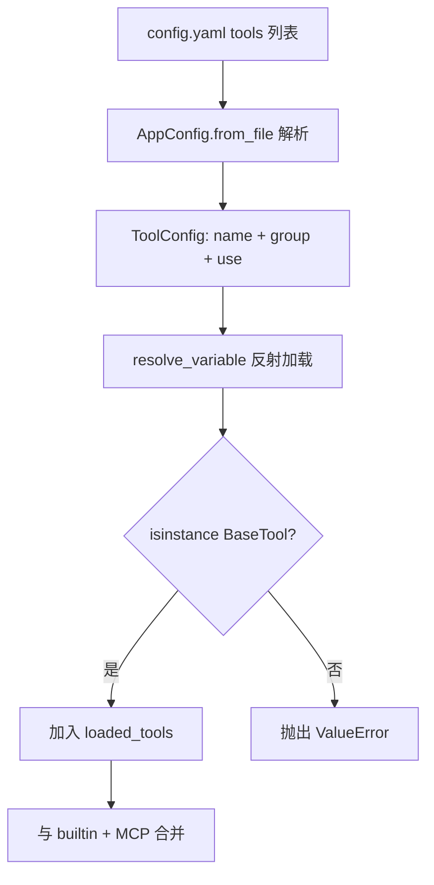
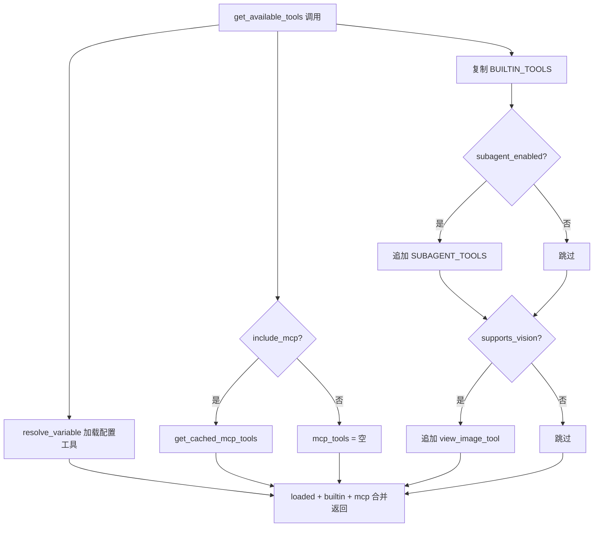
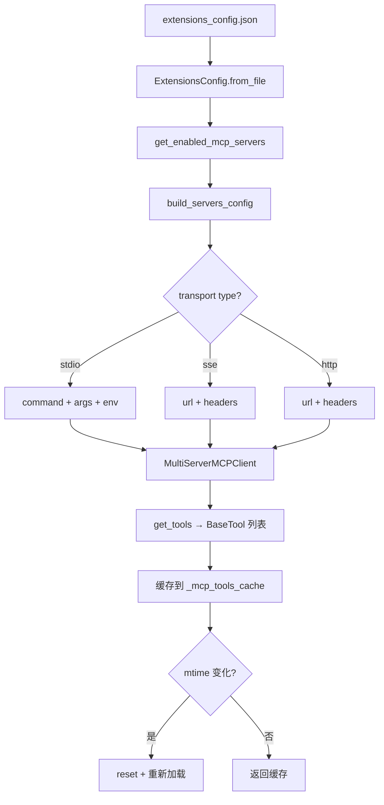

# PD-04.DF DeerFlow — 配置驱动工具系统与 MCP 动态组合

> 文档编号：PD-04.DF
> 来源：DeerFlow `backend/src/tools/tools.py` `backend/src/mcp/` `backend/src/config/tool_config.py`
> GitHub：https://github.com/bytedance/deer-flow.git
> 问题域：PD-04 工具系统 Tool System Design
> 状态：可复用方案

---

## 第 1 章 问题与动机

### 1.1 核心问题

Agent 工具系统面临三个层次的挑战：

1. **工具注册的灵活性**：硬编码工具列表无法适应不同部署场景，需要配置驱动的动态加载
2. **内外工具统一**：内置工具（sandbox bash/read/write）与外部 MCP 工具需要对 Agent 透明，统一暴露为 LangChain BaseTool
3. **子 Agent 工具隔离**：SubAgent 不应拥有父 Agent 的全部工具（如 task 工具会导致递归嵌套），需要 allowlist/denylist 过滤

DeerFlow 2.0 的工具系统设计核心是"配置驱动 + 反射加载 + MCP 缓存 + 子 Agent 隔离"四层架构。

### 1.2 DeerFlow 的解法概述

1. **YAML 配置 + `resolve_variable` 反射加载**：工具定义在 `config.yaml` 中，通过 `module:variable` 路径反射加载 BaseTool 实例（`backend/src/reflection/resolvers.py:7-46`）
2. **三类工具分层**：配置工具（YAML 定义）+ 内置工具（BUILTIN_TOOLS 硬编码）+ MCP 工具（extensions_config.json 定义），在 `get_available_tools()` 中合并（`backend/src/tools/tools.py:22-84`）
3. **MCP 三传输支持**：stdio/sse/http 三种传输协议，通过 `build_server_params()` 统一适配（`backend/src/mcp/client.py:11-42`）
4. **mtime 缓存失效**：MCP 工具缓存通过文件修改时间检测配置变更，跨进程同步（`backend/src/mcp/cache.py:31-53`）
5. **SubAgent 工具过滤**：通过 `_filter_tools()` 的 allowlist/denylist 机制实现子 Agent 工具隔离（`backend/src/subagents/executor.py:77-104`）

### 1.3 设计思想

| 设计原则 | 具体实现 | 理由 | 替代方案 |
|----------|----------|------|----------|
| 配置驱动 | YAML `tools[].use` 字段指定 `module:variable` 路径 | 部署时切换工具集无需改代码 | 硬编码工具列表 |
| 反射加载 | `resolve_variable()` 动态 import + getattr + 类型校验 | 解耦工具定义与实现，支持第三方工具 | 工厂模式注册表 |
| 延迟导入 | MCP 依赖通过 try/except ImportError 保护 | langchain-mcp-adapters 是可选依赖 | 强制安装所有依赖 |
| 缓存 + mtime | 全局单例缓存 + 文件修改时间检测 | Gateway API 跨进程修改配置后自动刷新 | 定时轮询 / WebSocket 通知 |
| 子 Agent 隔离 | denylist 默认排除 task 工具 | 防止 SubAgent 递归创建子代理 | 完全独立的工具注册表 |
| 条件工具加载 | `supports_vision` 判断是否加载 view_image_tool | 非视觉模型不暴露无用工具 | 始终加载所有工具 |

---

## 第 2 章 源码实现分析

### 2.1 架构概览

DeerFlow 的工具系统由四个层次组成：

```
┌─────────────────────────────────────────────────────────┐
│                    Lead Agent / SubAgent                  │
│              get_available_tools() 统一入口               │
├──────────┬──────────────────┬───────────────────────────┤
│ 配置工具  │    内置工具       │       MCP 工具            │
│ (YAML)   │  (BUILTIN_TOOLS) │  (extensions_config.json) │
│          │  (SUBAGENT_TOOLS)│                           │
├──────────┼──────────────────┼───────────────────────────┤
│resolve_  │ @tool decorator  │ MultiServerMCPClient      │
│variable()│ + ToolRuntime    │ + mtime cache             │
├──────────┴──────────────────┴───────────────────────────┤
│              SubAgent: _filter_tools()                   │
│           allowlist / denylist 工具过滤                   │
└─────────────────────────────────────────────────────────┘
```

### 2.2 核心实现

#### 2.2.1 配置驱动的工具注册



对应源码 `backend/src/config/tool_config.py:1-21` + `backend/src/reflection/resolvers.py:7-46`：

```python
# tool_config.py — 工具配置模型
class ToolConfig(BaseModel):
    name: str = Field(..., description="Unique name for the tool")
    group: str = Field(..., description="Group name for the tool")
    use: str = Field(
        ...,
        description="Variable name of the tool provider"
                    "(e.g. src.sandbox.tools:bash_tool)",
    )

# resolvers.py — 反射加载核心
def resolve_variable[T](
    variable_path: str,
    expected_type: type[T] | tuple[type, ...] | None = None,
) -> T:
    module_path, variable_name = variable_path.rsplit(":", 1)
    module = import_module(module_path)
    variable = getattr(module, variable_name)
    if expected_type is not None:
        if not isinstance(variable, expected_type):
            raise ValueError(...)
    return variable
```

`resolve_variable` 的关键设计：用 `module:variable` 冒号分隔符（而非点号），避免与 Python 包路径混淆。类型校验确保加载的对象确实是 BaseTool 实例。

#### 2.2.2 三类工具合并与条件加载



对应源码 `backend/src/tools/tools.py:22-84`：

```python
BUILTIN_TOOLS = [present_file_tool, ask_clarification_tool]
SUBAGENT_TOOLS = [task_tool]

def get_available_tools(
    groups: list[str] | None = None,
    include_mcp: bool = True,
    model_name: str | None = None,
    subagent_enabled: bool = False,
) -> list[BaseTool]:
    config = get_app_config()
    loaded_tools = [
        resolve_variable(tool.use, BaseTool)
        for tool in config.tools
        if groups is None or tool.group in groups
    ]
    # MCP 工具：延迟导入 + 缓存
    mcp_tools = []
    if include_mcp:
        try:
            from src.mcp.cache import get_cached_mcp_tools
            extensions_config = ExtensionsConfig.from_file()
            if extensions_config.get_enabled_mcp_servers():
                mcp_tools = get_cached_mcp_tools()
        except ImportError:
            logger.warning("MCP module not available.")
    # 条件加载
    builtin_tools = BUILTIN_TOOLS.copy()
    if subagent_enabled:
        builtin_tools.extend(SUBAGENT_TOOLS)
    model_config = config.get_model_config(model_name)
    if model_config and model_config.supports_vision:
        builtin_tools.append(view_image_tool)
    return loaded_tools + builtin_tools + mcp_tools
```

关键细节：
- `groups` 参数支持按组过滤工具（如只加载 sandbox 组）
- MCP 部分用 `ExtensionsConfig.from_file()` 而非缓存单例，确保跨进程配置同步
- `BUILTIN_TOOLS.copy()` 避免修改全局列表

#### 2.2.3 MCP 三传输适配与 mtime 缓存



对应源码 `backend/src/mcp/client.py:11-42`：

```python
def build_server_params(server_name: str, config: McpServerConfig) -> dict[str, Any]:
    transport_type = config.type or "stdio"
    params: dict[str, Any] = {"transport": transport_type}
    if transport_type == "stdio":
        if not config.command:
            raise ValueError(f"MCP server '{server_name}' with stdio transport requires 'command'")
        params["command"] = config.command
        params["args"] = config.args
        if config.env:
            params["env"] = config.env
    elif transport_type in ("sse", "http"):
        if not config.url:
            raise ValueError(f"MCP server '{server_name}' with {transport_type} transport requires 'url'")
        params["url"] = config.url
        if config.headers:
            params["headers"] = config.headers
    else:
        raise ValueError(f"Unsupported transport type: {transport_type}")
    return params
```

mtime 缓存机制（`backend/src/mcp/cache.py:31-53`）：

```python
def _is_cache_stale() -> bool:
    global _config_mtime
    if not _cache_initialized:
        return False
    current_mtime = _get_config_mtime()
    if _config_mtime is None or current_mtime is None:
        return False
    if current_mtime > _config_mtime:
        return True
    return False
```

### 2.3 实现细节

**环境变量解析**：`ExtensionsConfig.resolve_env_variables()` 递归遍历配置树，将 `$VAR_NAME` 替换为 `os.getenv()` 值（`backend/src/config/extensions_config.py:118-142`）。这使得 MCP 配置中的 API Token 可以安全引用环境变量。

**异步/同步桥接**：`get_cached_mcp_tools()` 需要在同步上下文中调用异步的 `initialize_mcp_tools()`。它检测当前事件循环状态，如果循环已运行（如 LangGraph Studio），则通过 `ThreadPoolExecutor` 在新线程中执行 `asyncio.run()`（`backend/src/mcp/cache.py:96-126`）。

**SubAgent 工具隔离**：`SubagentConfig` 默认 `disallowed_tools=["task"]`，bash 和 general-purpose 子代理额外排除 `ask_clarification` 和 `present_files`（`backend/src/subagents/builtins/bash_agent.py:43`）。`_filter_tools()` 先应用 allowlist 再应用 denylist，denylist 优先级更高。

**Skill 系统集成**：Skills 通过 `SKILL.md` 文件定义，`load_skills()` 扫描 `public/` 和 `custom/` 两个目录，`ExtensionsConfig.is_skill_enabled()` 控制启用状态，public/custom 类别默认启用（`backend/src/skills/loader.py:21-97`）。

---

## 第 3 章 迁移指南

### 3.1 迁移清单

**阶段 1：配置驱动工具注册（1 天）**
- [ ] 定义 `ToolConfig` Pydantic 模型（name + group + use 字段）
- [ ] 实现 `resolve_variable()` 反射加载器（module:variable 格式）
- [ ] 创建 `config.yaml` 工具配置节
- [ ] 实现 `get_available_tools()` 统一入口

**阶段 2：MCP 集成（2 天）**
- [ ] 定义 `McpServerConfig` 模型（支持 stdio/sse/http）
- [ ] 实现 `build_server_params()` 传输适配
- [ ] 集成 `langchain-mcp-adapters` 的 `MultiServerMCPClient`
- [ ] 实现 mtime 缓存失效机制
- [ ] 处理异步/同步桥接（ThreadPoolExecutor 方案）

**阶段 3：子 Agent 工具隔离（0.5 天）**
- [ ] 实现 `_filter_tools()` allowlist/denylist 过滤
- [ ] 配置 SubagentConfig 默认 denylist
- [ ] 验证递归嵌套防护

### 3.2 适配代码模板

#### 最小可用的配置驱动工具系统

```python
"""可直接复用的配置驱动工具注册系统"""
from importlib import import_module
from typing import TypeVar, Any
from pydantic import BaseModel, Field
import yaml

T = TypeVar("T")


# --- 1. 反射加载器 ---
def resolve_variable(variable_path: str, expected_type: type | None = None) -> Any:
    """从 'module.path:variable_name' 路径加载 Python 对象"""
    module_path, variable_name = variable_path.rsplit(":", 1)
    module = import_module(module_path)
    variable = getattr(module, variable_name)
    if expected_type and not isinstance(variable, expected_type):
        raise ValueError(f"{variable_path} is not {expected_type.__name__}")
    return variable


# --- 2. 配置模型 ---
class ToolConfig(BaseModel):
    name: str
    group: str = "default"
    use: str = Field(description="module.path:variable_name")


class McpServerConfig(BaseModel):
    enabled: bool = True
    type: str = "stdio"  # stdio | sse | http
    command: str | None = None
    args: list[str] = Field(default_factory=list)
    url: str | None = None
    env: dict[str, str] = Field(default_factory=dict)
    headers: dict[str, str] = Field(default_factory=dict)


# --- 3. 工具加载入口 ---
def get_available_tools(
    tool_configs: list[ToolConfig],
    builtin_tools: list = None,
    mcp_tools: list = None,
    groups: list[str] | None = None,
    denylist: list[str] | None = None,
) -> list:
    """统一工具加载入口"""
    # 配置工具：反射加载
    loaded = []
    for tc in tool_configs:
        if groups and tc.group not in groups:
            continue
        loaded.append(resolve_variable(tc.use))

    # 合并三类工具
    all_tools = loaded + (builtin_tools or []) + (mcp_tools or [])

    # denylist 过滤
    if denylist:
        deny_set = set(denylist)
        all_tools = [t for t in all_tools if getattr(t, 'name', '') not in deny_set]

    return all_tools
```

#### MCP mtime 缓存模板

```python
"""MCP 工具缓存，支持文件修改时间自动失效"""
import os
import asyncio
from pathlib import Path

_cache: list | None = None
_mtime: float | None = None

def _get_config_mtime(config_path: Path) -> float | None:
    return os.path.getmtime(config_path) if config_path.exists() else None

def get_mcp_tools_cached(config_path: Path, loader_fn) -> list:
    """带 mtime 失效的 MCP 工具缓存"""
    global _cache, _mtime
    current_mtime = _get_config_mtime(config_path)
    if _cache is not None and current_mtime == _mtime:
        return _cache
    # 重新加载
    _cache = asyncio.run(loader_fn(config_path))
    _mtime = current_mtime
    return _cache
```

### 3.3 适用场景

| 场景 | 适用度 | 说明 |
|------|--------|------|
| 多部署环境工具切换 | ⭐⭐⭐ | YAML 配置驱动，不同环境不同 config.yaml |
| 需要 MCP 扩展的 Agent | ⭐⭐⭐ | 三传输支持 + 缓存，开箱即用 |
| 父子 Agent 架构 | ⭐⭐⭐ | denylist 防递归，allowlist 精细控制 |
| 单一固定工具集 | ⭐ | 过度设计，直接硬编码更简单 |
| 需要热更新工具的场景 | ⭐⭐ | mtime 检测有延迟，不适合实时热更新 |

---

## 第 4 章 测试用例

```python
import pytest
from unittest.mock import patch, MagicMock
from importlib import import_module


# --- 测试 resolve_variable ---
class TestResolveVariable:
    def test_resolve_existing_variable(self):
        """测试正常路径：加载 os.path 模块的 sep 变量"""
        from src.reflection.resolvers import resolve_variable
        result = resolve_variable("os.path:sep")
        assert isinstance(result, str)

    def test_resolve_with_type_check(self):
        """测试类型校验：期望 str 但得到非 str 应抛异常"""
        from src.reflection.resolvers import resolve_variable
        with pytest.raises(ValueError, match="not an instance of"):
            resolve_variable("os.path:sep", expected_type=int)

    def test_resolve_invalid_path(self):
        """测试无效路径格式"""
        from src.reflection.resolvers import resolve_variable
        with pytest.raises(ImportError, match="doesn't look like a variable path"):
            resolve_variable("no_colon_here")

    def test_resolve_nonexistent_module(self):
        """测试不存在的模块"""
        from src.reflection.resolvers import resolve_variable
        with pytest.raises(ImportError, match="Could not import module"):
            resolve_variable("nonexistent.module:var")


# --- 测试 MCP 配置构建 ---
class TestBuildServerParams:
    def test_stdio_transport(self):
        """测试 stdio 传输参数构建"""
        from src.mcp.client import build_server_params
        from src.config.extensions_config import McpServerConfig
        config = McpServerConfig(type="stdio", command="npx", args=["-y", "server"])
        params = build_server_params("test", config)
        assert params["transport"] == "stdio"
        assert params["command"] == "npx"
        assert params["args"] == ["-y", "server"]

    def test_sse_transport(self):
        """测试 SSE 传输参数构建"""
        from src.mcp.client import build_server_params
        from src.config.extensions_config import McpServerConfig
        config = McpServerConfig(type="sse", url="https://api.example.com/mcp")
        params = build_server_params("test", config)
        assert params["transport"] == "sse"
        assert params["url"] == "https://api.example.com/mcp"

    def test_stdio_without_command_raises(self):
        """测试 stdio 缺少 command 应抛异常"""
        from src.mcp.client import build_server_params
        from src.config.extensions_config import McpServerConfig
        config = McpServerConfig(type="stdio", command=None)
        with pytest.raises(ValueError, match="requires 'command'"):
            build_server_params("test", config)

    def test_unsupported_transport_raises(self):
        """测试不支持的传输类型"""
        from src.mcp.client import build_server_params
        from src.config.extensions_config import McpServerConfig
        config = McpServerConfig(type="grpc")
        with pytest.raises(ValueError, match="unsupported transport"):
            build_server_params("test", config)


# --- 测试工具过滤 ---
class TestFilterTools:
    def _make_tool(self, name: str):
        tool = MagicMock()
        tool.name = name
        return tool

    def test_denylist_filters_tools(self):
        """测试 denylist 过滤"""
        from src.subagents.executor import _filter_tools
        tools = [self._make_tool("bash"), self._make_tool("task"), self._make_tool("read")]
        filtered = _filter_tools(tools, allowed=None, disallowed=["task"])
        assert [t.name for t in filtered] == ["bash", "read"]

    def test_allowlist_filters_tools(self):
        """测试 allowlist 过滤"""
        from src.subagents.executor import _filter_tools
        tools = [self._make_tool("bash"), self._make_tool("task"), self._make_tool("read")]
        filtered = _filter_tools(tools, allowed=["bash", "read"], disallowed=None)
        assert [t.name for t in filtered] == ["bash", "read"]

    def test_denylist_overrides_allowlist(self):
        """测试 denylist 优先于 allowlist"""
        from src.subagents.executor import _filter_tools
        tools = [self._make_tool("bash"), self._make_tool("task")]
        filtered = _filter_tools(tools, allowed=["bash", "task"], disallowed=["task"])
        assert [t.name for t in filtered] == ["bash"]


# --- 测试 mtime 缓存 ---
class TestMtimeCache:
    def test_cache_stale_detection(self):
        """测试配置文件修改后缓存失效"""
        from src.mcp.cache import _is_cache_stale, _config_mtime
        import src.mcp.cache as cache_module
        cache_module._cache_initialized = True
        cache_module._config_mtime = 1000.0
        with patch.object(cache_module, '_get_config_mtime', return_value=2000.0):
            assert cache_module._is_cache_stale() is True

    def test_cache_fresh(self):
        """测试配置未修改时缓存有效"""
        import src.mcp.cache as cache_module
        cache_module._cache_initialized = True
        cache_module._config_mtime = 1000.0
        with patch.object(cache_module, '_get_config_mtime', return_value=1000.0):
            assert cache_module._is_cache_stale() is False
```

---

## 第 5 章 跨域关联

| 关联域 | 关系类型 | 说明 |
|--------|----------|------|
| PD-01 上下文管理 | 协同 | 工具数量影响 system prompt 长度；`supports_vision` 条件加载减少无用工具描述占用 token |
| PD-02 多 Agent 编排 | 依赖 | SubAgent 工具隔离（denylist）是编排安全的基础；task_tool 本身是编排的入口 |
| PD-03 容错与重试 | 协同 | MCP 工具加载失败时返回空列表而非抛异常（优雅降级）；`try/except ImportError` 保护可选依赖 |
| PD-05 沙箱隔离 | 依赖 | sandbox 工具（bash/ls/read_file/write_file）通过 `ensure_sandbox_initialized()` 懒初始化沙箱 |
| PD-09 Human-in-the-Loop | 协同 | `ask_clarification_tool` 是内置工具之一，通过 `return_direct=True` 中断执行流 |
| PD-10 中间件管道 | 协同 | ClarificationMiddleware 拦截 ask_clarification 工具调用；SubagentLimitMiddleware 限制并发子代理数 |
| PD-11 可观测性 | 协同 | task_tool 通过 `get_stream_writer()` 发送 task_started/running/completed 事件，支持实时追踪 |

---

## 第 6 章 来源文件索引

| 文件 | 行范围 | 关键实现 |
|------|--------|----------|
| `backend/src/tools/tools.py` | L1-84 | 工具统一入口 `get_available_tools()`，三类工具合并 |
| `backend/src/config/tool_config.py` | L1-21 | ToolConfig / ToolGroupConfig 配置模型 |
| `backend/src/reflection/resolvers.py` | L7-46 | `resolve_variable()` 反射加载器 |
| `backend/src/mcp/client.py` | L11-68 | MCP 三传输适配 `build_server_params()` / `build_servers_config()` |
| `backend/src/mcp/tools.py` | L13-49 | `get_mcp_tools()` MCP 工具加载 |
| `backend/src/mcp/cache.py` | L1-138 | mtime 缓存 + 异步/同步桥接 |
| `backend/src/config/extensions_config.py` | L11-226 | McpServerConfig / ExtensionsConfig 模型 + 环境变量解析 |
| `backend/src/config/app_config.py` | L21-207 | AppConfig 主配置 + YAML 加载 |
| `backend/src/tools/builtins/task_tool.py` | L21-184 | SubAgent 委托工具 + 轮询状态机 |
| `backend/src/tools/builtins/clarification_tool.py` | L6-55 | 澄清工具（return_direct 中断） |
| `backend/src/tools/builtins/present_file_tool.py` | L11-39 | 文件呈现工具（Command 状态更新） |
| `backend/src/tools/builtins/view_image_tool.py` | L15-94 | 视觉工具（条件加载，base64 编码） |
| `backend/src/sandbox/tools.py` | L232-404 | 沙箱工具集（bash/ls/read_file/write_file/str_replace） |
| `backend/src/subagents/executor.py` | L77-184 | `_filter_tools()` allowlist/denylist + SubagentExecutor |
| `backend/src/subagents/config.py` | L1-28 | SubagentConfig 数据类（denylist 默认值） |
| `backend/src/skills/loader.py` | L21-97 | Skill 加载器（public/custom 双目录扫描） |
| `extensions_config.example.json` | L1-54 | MCP 配置示例（stdio/sse/http 三种传输） |

---

## 第 7 章 横向对比维度

> **重要：** 本章用于自动填充 Butcher Wiki 的横向对比表。

```json comparison_data
{
  "project": "DeerFlow",
  "dimensions": {
    "工具注册方式": "YAML config.yaml + resolve_variable 反射加载 module:variable",
    "工具分组/权限": "group 字段分组 + subagent denylist 隔离",
    "MCP 协议支持": "stdio/sse/http 三传输，langchain-mcp-adapters",
    "热更新/缓存": "mtime 文件修改时间检测，跨进程自动刷新",
    "工具集动态组合": "groups 过滤 + include_mcp 开关 + subagent_enabled 条件",
    "子 Agent 工具隔离": "allowlist/denylist 双过滤，默认排除 task 防递归",
    "工具条件加载": "supports_vision 判断加载 view_image_tool",
    "Schema 生成方式": "@tool decorator + parse_docstring=True 自动提取",
    "依赖注入": "ToolRuntime[ContextT, ThreadState] 注入沙箱/线程状态",
    "工具上下文注入": "runtime.state 传递 sandbox/thread_data/thread_id",
    "延迟导入隔离": "try/except ImportError 保护 MCP 可选依赖"
  }
}
```

### 域元数据补充

```json domain_metadata
{
  "solution_summary": "DeerFlow 用 YAML 配置 + resolve_variable 反射加载工具，MCP 三传输（stdio/sse/http）通过 mtime 缓存跨进程同步，SubAgent 通过 allowlist/denylist 实现工具隔离",
  "description": "配置文件驱动的工具注册与 MCP 多传输协议统一适配",
  "sub_problems": [
    "异步 MCP 初始化在同步上下文中的事件循环桥接",
    "跨进程配置同步：Gateway API 修改配置后 LangGraph Server 如何感知",
    "条件工具加载：如何根据模型能力（vision）动态决定工具集",
    "SubAgent 递归嵌套防护：如何防止子代理创建子代理的无限递归"
  ],
  "best_practices": [
    "用 module:variable 冒号分隔符避免与 Python 包路径混淆",
    "MCP 依赖用 try/except ImportError 保护，保持核心功能不依赖可选包",
    "BUILTIN_TOOLS.copy() 避免修改全局列表导致状态污染",
    "SubAgent 默认 denylist 包含 task 工具，防止递归嵌套"
  ]
}
```
