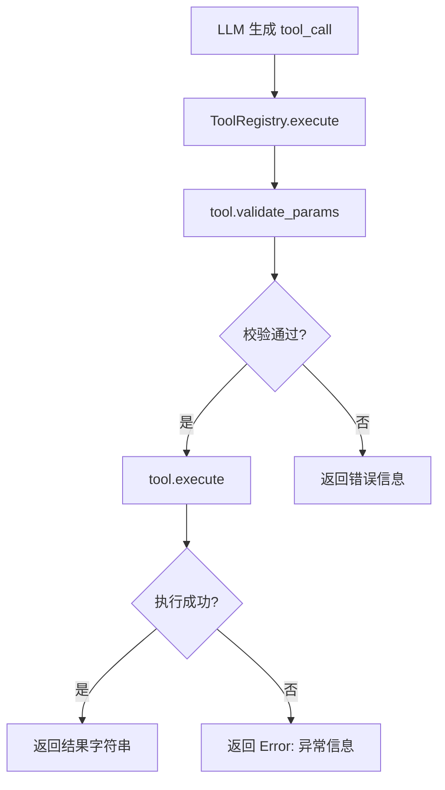
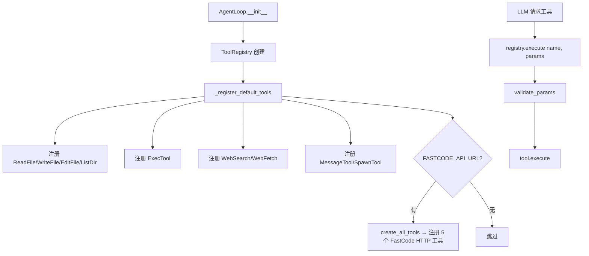
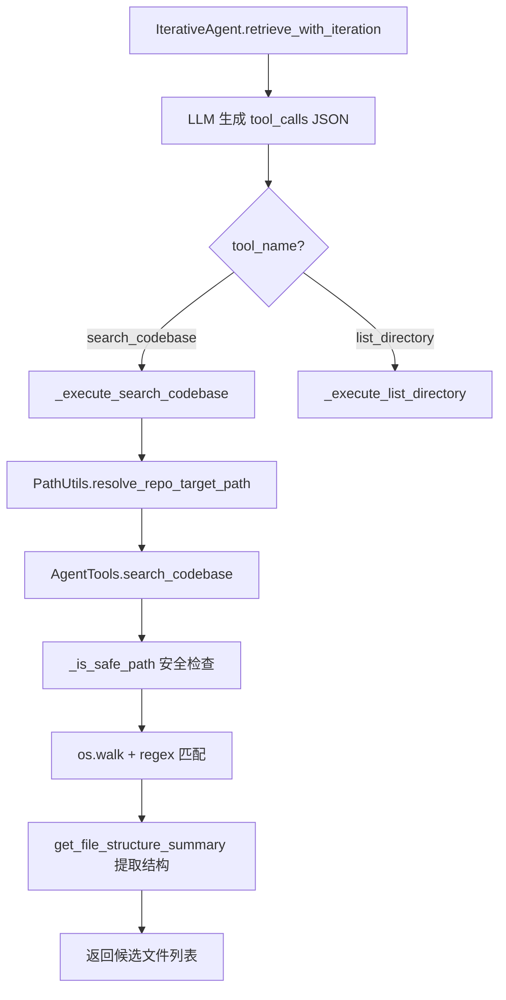

# PD-04.13 FastCode — 双层工具体系与 MCP 沙箱化代码探索

> 文档编号：PD-04.13
> 来源：FastCode `nanobot/nanobot/agent/tools/`, `fastcode/agent_tools.py`, `mcp_server.py`
> GitHub：https://github.com/HKUDS/FastCode.git
> 问题域：PD-04 工具系统 Tool System Design
> 状态：可复用方案

---

## 第 1 章 问题与动机

### 1.1 核心问题

Agent 工具系统面临一个根本矛盾：**内部 Agent loop 需要细粒度、可组合的工具原语**（读文件、搜索代码、列目录），而**外部消费者（IDE、CLI、其他 Agent）需要粗粒度、自包含的高层能力**（"帮我理解这个仓库"）。单层工具架构要么让 LLM 面对过多低级工具导致选择困难，要么让外部集成者无法获得原子操作能力。

FastCode 的独特之处在于它同时运行两套工具体系：
- **Nanobot 层**：通用 Agent 框架的 Tool 抽象基类 + ToolRegistry 动态注册，提供 read_file、exec、web_search 等原子工具
- **FastCode 层**：面向代码理解的沙箱化探索工具（AgentTools），以及通过 MCP Server 暴露的高层 code_qa 接口

这种双层设计让同一个代码理解引擎既能作为 Nanobot Agent 的内部工具被调用，又能通过 MCP 协议被 Claude Code、Cursor 等外部 IDE 直接消费。

### 1.2 FastCode 的解法概述

1. **ABC + JSON Schema 参数校验**：`Tool` 抽象基类强制每个工具声明 `name`、`description`、`parameters`（JSON Schema），`validate_params()` 在 execute 前自动递归校验参数类型和约束（`base.py:55-91`）
2. **ToolRegistry 动态注册/执行**：字典式注册表支持 register/unregister/get/execute，execute 内置参数校验 + 异常捕获，返回字符串结果（`registry.py:8-73`）
3. **子 Agent 工具隔离**：SubagentManager 为每个子 Agent 创建独立 ToolRegistry，只注册文件/Shell/Web 工具，不注册 message/spawn 工具，实现权限隔离（`subagent.py:99-111`）
4. **AgentTools 沙箱化代码探索**：repo_root 安全边界 + PathUtils 路径解析，所有操作限制在仓库目录内，提供 list_directory、search_codebase、get_file_structure_summary、read_file_content 四个只读工具（`agent_tools.py:15-543`）
5. **MCP Server 高层封装**：FastMCP 装饰器暴露 code_qa、list_sessions 等 6 个工具，lazy-init FastCode 引擎，stdout 保护（日志写文件不写 stdout）（`mcp_server.py:38-430`）

### 1.3 设计思想

| 设计原则 | 具体实现 | 理由 | 替代方案 |
|----------|----------|------|----------|
| 接口与实现分离 | Tool ABC 定义 name/description/parameters/execute 四个抽象属性/方法 | 新工具只需继承 Tool 即可接入，无需修改注册表 | 装饰器注册（DeerFlow）、字典配置（MetaGPT） |
| 参数校验前置 | validate_params() 在 execute 前递归校验 JSON Schema | 防止 LLM 生成的错误参数传入工具导致运行时异常 | 运行时 try-except（多数项目）、Pydantic 模型（OpenManus） |
| 安全边界硬编码 | AgentTools 的 repo_root + is_safe_path 路径遍历防护 | 代码探索工具必须限制在仓库内，防止读取系统文件 | Docker 容器隔离（MiroThinker）、chroot |
| 工具集按角色裁剪 | 主 Agent 10+ 工具，子 Agent 6 工具（无 message/spawn/cron） | 子 Agent 不应能发消息或再 spawn，防止递归失控 | 统一工具集 + 权限标记（AgentOrchestrator） |
| MCP stdout 保护 | logging 只写文件，不写 stdout | stdio 传输下 stdout 是 JSON-RPC 通道，日志会破坏协议 | stderr 重定向（Claude Code）、环境变量控制 |

---

## 第 2 章 源码实现分析

### 2.1 架构概览

FastCode 的工具系统分为三个层次，从底层到顶层：

```
┌─────────────────────────────────────────────────────────────┐
│                    MCP Server (mcp_server.py)                │
│  @mcp.tool() code_qa / list_sessions / list_indexed_repos   │
│  ┌─────────────────────────────────────────────────────────┐ │
│  │              FastCode Engine (lazy singleton)            │ │
│  │  ┌───────────────────────────────────────────────────┐  │ │
│  │  │  IterativeAgent + AgentTools (沙箱化代码探索)      │  │ │
│  │  │  list_directory / search_codebase / get_file_info  │  │ │
│  │  └───────────────────────────────────────────────────┘  │ │
│  └─────────────────────────────────────────────────────────┘ │
└─────────────────────────────────────────────────────────────┘

┌─────────────────────────────────────────────────────────────┐
│              Nanobot AgentLoop (loop.py)                      │
│  ToolRegistry ← register(ReadFileTool, ExecTool, ...)       │
│  ┌──────────┐ ┌──────────┐ ┌──────────┐ ┌──────────┐       │
│  │read_file │ │write_file│ │  exec    │ │web_search│ ...    │
│  └──────────┘ └──────────┘ └──────────┘ └──────────┘       │
│  ┌──────────────────────────────────────────────────┐       │
│  │ FastCode HTTP Tools (条件加载, 需 FASTCODE_API_URL)│       │
│  │ fastcode_load_repo / fastcode_query / ...         │       │
│  └──────────────────────────────────────────────────┘       │
│                                                              │
│  SubagentManager → 独立 ToolRegistry (无 message/spawn)      │
└─────────────────────────────────────────────────────────────┘

┌─────────────────────────────────────────────────────────────┐
│                    Tool ABC (base.py)                         │
│  name / description / parameters / execute / validate_params │
│  to_schema() → OpenAI function calling format                │
└─────────────────────────────────────────────────────────────┘
```

### 2.2 核心实现

#### 2.2.1 Tool 抽象基类与 JSON Schema 参数校验



对应源码 `nanobot/nanobot/agent/tools/base.py:7-102`：

```python
class Tool(ABC):
    _TYPE_MAP = {
        "string": str, "integer": int, "number": (int, float),
        "boolean": bool, "array": list, "object": dict,
    }

    @property
    @abstractmethod
    def name(self) -> str: ...
    @property
    @abstractmethod
    def description(self) -> str: ...
    @property
    @abstractmethod
    def parameters(self) -> dict[str, Any]: ...
    @abstractmethod
    async def execute(self, **kwargs: Any) -> str: ...

    def validate_params(self, params: dict[str, Any]) -> list[str]:
        schema = self.parameters or {}
        return self._validate(params, {**schema, "type": "object"}, "")

    def _validate(self, val, schema, path) -> list[str]:
        t, label = schema.get("type"), path or "parameter"
        if t in self._TYPE_MAP and not isinstance(val, self._TYPE_MAP[t]):
            return [f"{label} should be {t}"]
        errors = []
        if "enum" in schema and val not in schema["enum"]:
            errors.append(f"{label} must be one of {schema['enum']}")
        # ... 递归校验 minimum/maximum/minLength/maxLength/required/items
        return errors

    def to_schema(self) -> dict[str, Any]:
        return {"type": "function", "function": {
            "name": self.name, "description": self.description,
            "parameters": self.parameters,
        }}
```

关键设计：`_TYPE_MAP` 将 JSON Schema 类型映射到 Python 类型，`_validate` 递归处理嵌套 object 和 array，支持 enum、minimum/maximum、minLength/maxLength 等约束。校验结果是错误列表而非抛异常，便于聚合多个错误一次性返回给 LLM。

#### 2.2.2 ToolRegistry 动态注册与安全执行



对应源码 `nanobot/nanobot/agent/tools/registry.py:8-73`：

```python
class ToolRegistry:
    def __init__(self):
        self._tools: dict[str, Tool] = {}

    def register(self, tool: Tool) -> None:
        self._tools[tool.name] = tool

    def get_definitions(self) -> list[dict[str, Any]]:
        return [tool.to_schema() for tool in self._tools.values()]

    async def execute(self, name: str, params: dict[str, Any]) -> str:
        tool = self._tools.get(name)
        if not tool:
            return f"Error: Tool '{name}' not found"
        try:
            errors = tool.validate_params(params)
            if errors:
                return f"Error: Invalid parameters for tool '{name}': " + "; ".join(errors)
            return await tool.execute(**params)
        except Exception as e:
            return f"Error executing {name}: {str(e)}"
```

关键设计：execute 方法的三层防护——工具存在性检查 → 参数校验 → 异常捕获。所有错误都返回字符串而非抛异常，确保 Agent loop 不会因单个工具失败而中断。

#### 2.2.3 子 Agent 工具隔离

对应源码 `nanobot/nanobot/agent/subagent.py:99-111`：

```python
# SubagentManager._run_subagent 中
tools = ToolRegistry()  # 独立注册表！
allowed_dir = self.workspace if self.restrict_to_workspace else None
tools.register(ReadFileTool(allowed_dir=allowed_dir))
tools.register(WriteFileTool(allowed_dir=allowed_dir))
tools.register(ListDirTool(allowed_dir=allowed_dir))
tools.register(ExecTool(
    working_dir=str(self.workspace),
    timeout=self.exec_config.timeout,
    restrict_to_workspace=self.restrict_to_workspace,
))
tools.register(WebSearchTool(api_key=self.brave_api_key))
tools.register(WebFetchTool())
# 注意：没有 MessageTool、SpawnTool、CronTool
```

主 Agent 与子 Agent 的工具集对比：

| 工具 | 主 Agent | 子 Agent | 原因 |
|------|----------|----------|------|
| read_file / write_file / list_dir | ✅ | ✅ | 基础文件操作 |
| edit_file | ✅ | ❌ | 子 Agent 只做读写，不做精确编辑 |
| exec | ✅ | ✅ | 需要执行命令 |
| web_search / web_fetch | ✅ | ✅ | 需要搜索信息 |
| message | ✅ | ❌ | 子 Agent 不能直接发消息给用户 |
| spawn | ✅ | ❌ | 防止子 Agent 递归 spawn |
| cron | ✅ | ❌ | 子 Agent 不能创建定时任务 |
| fastcode_* | ✅（条件） | ❌ | 子 Agent 不需要代码理解能力 |

### 2.3 实现细节

#### AgentTools 沙箱化代码探索

AgentTools 是 FastCode 的核心创新——一套专为 LLM 驱动的代码探索设计的只读工具集。



对应源码 `fastcode/agent_tools.py:108-354`，search_codebase 的安全设计：

```python
def search_codebase(self, search_term: str, file_pattern: str = "*",
                   root_path: str = ".", max_results: int = 30,
                   case_sensitive: bool = False, use_regex: bool = False):
    # 1. 安全检查：路径必须在 repo_root 内
    if not self._is_safe_path(root_path):
        return {"success": False, "error": "Access denied: path outside repository root"}

    # 2. 智能路径解析（处理 repo_root 与 path 的重叠）
    search_root = self._resolve_path(root_path)

    # 3. 预编译搜索模式（支持 | 分隔的多关键词 OR 搜索）
    if '|' in search_term:
        terms = [re.escape(t.strip()) for t in search_term.split('|')]
        pattern_str = '|'.join(terms)
    content_pattern = re.compile(pattern_str, flags)

    # 4. 遍历文件，跳过 __pycache__/node_modules/.git 等
    for root, dirs, files in os.walk(search_root):
        dirs[:] = [d for d in dirs if d not in ['__pycache__', 'node_modules', '.git', ...]]
        # 5. 每文件最多 20 个匹配，总结果最多 max_results
        # 6. 无结果时自动重试递归模式（src/*.py → src/**/*.py）
```

#### MCP Server stdout 保护与 Lazy Init

对应源码 `mcp_server.py:40-67`：

```python
# stdout 保护：日志只写文件
logging.basicConfig(
    level=logging.INFO,
    handlers=[logging.FileHandler(os.path.join(log_dir, "mcp_server.log"))],
)

# Lazy init：避免启动时加载重量级依赖
_fastcode_instance = None

def _get_fastcode():
    global _fastcode_instance
    if _fastcode_instance is None:
        from fastcode import FastCode  # 延迟导入
        _fastcode_instance = FastCode()
    return _fastcode_instance
```

#### 工具上下文动态注入

对应源码 `nanobot/nanobot/agent/loop.py:347-357`，多渠道场景下动态设置工具的路由信息：

```python
# 每次处理消息时更新工具上下文
message_tool = self.tools.get("message")
if isinstance(message_tool, MessageTool):
    message_tool.set_context(msg.channel, msg.chat_id)

spawn_tool = self.tools.get("spawn")
if isinstance(spawn_tool, SpawnTool):
    spawn_tool.set_context(msg.channel, msg.chat_id)
```

#### 长时工具执行反馈

对应源码 `nanobot/nanobot/agent/loop.py:153-323`，FastCode 工具可能运行数分钟（大仓库索引），AgentLoop 实现了周期性状态反馈：

```python
async def _execute_tool_with_feedback(self, msg, tool_call,
    initial_delay=20.0, interval=40.0, max_updates=8, max_timeout=1200.0):
    task = asyncio.create_task(_run_tool())
    # 先等 20 秒，快速完成则不发通知
    try:
        return await asyncio.wait_for(asyncio.shield(task), timeout=initial_delay)
    except asyncio.TimeoutError:
        pass
    # 每 40 秒发一次状态更新，最多 8 次
    while not task.done() and updates_sent < max_updates:
        await self.bus.publish_outbound(OutboundMessage(...))
        # 最终超时 1200 秒（20 分钟）
```


---

## 第 3 章 迁移指南

### 3.1 迁移清单

**阶段 1：Tool ABC + ToolRegistry（1 天）**
- [ ] 复制 `base.py` 的 Tool ABC 和 `_validate` 递归校验逻辑
- [ ] 复制 `registry.py` 的 ToolRegistry（register/execute/get_definitions）
- [ ] 实现第一个具体工具（如 ReadFileTool），验证 to_schema() 输出符合 OpenAI function calling 格式

**阶段 2：安全沙箱化工具（2 天）**
- [ ] 实现 PathUtils 的 resolve_path（处理路径重叠）和 is_safe_path（安全边界检查）
- [ ] 实现 AgentTools 的 search_codebase（含自动递归重试、OR 搜索、结果截断）
- [ ] 添加 ExecTool 的命令黑名单（deny_patterns）和路径遍历检测

**阶段 3：子 Agent 工具隔离（0.5 天）**
- [ ] 为子 Agent 创建独立 ToolRegistry，只注册安全工具子集
- [ ] 确保子 Agent 无法 spawn 新子 Agent 或直接发消息

**阶段 4：MCP Server 暴露（1 天）**
- [ ] 用 FastMCP 装饰器包装高层能力为 MCP 工具
- [ ] 配置 stdout 保护（日志写文件）
- [ ] 实现 lazy init 避免启动时加载重量级依赖

### 3.2 适配代码模板

#### 最小可运行的 Tool + Registry 系统

```python
"""可直接运行的 Tool + ToolRegistry 最小实现"""
from abc import ABC, abstractmethod
from typing import Any
import asyncio


class Tool(ABC):
    """工具抽象基类，强制声明 schema"""

    _TYPE_MAP = {
        "string": str, "integer": int, "number": (int, float),
        "boolean": bool, "array": list, "object": dict,
    }

    @property
    @abstractmethod
    def name(self) -> str: ...

    @property
    @abstractmethod
    def description(self) -> str: ...

    @property
    @abstractmethod
    def parameters(self) -> dict[str, Any]: ...

    @abstractmethod
    async def execute(self, **kwargs: Any) -> str: ...

    def validate_params(self, params: dict[str, Any]) -> list[str]:
        schema = self.parameters or {}
        return self._validate(params, {**schema, "type": "object"}, "")

    def _validate(self, val: Any, schema: dict[str, Any], path: str) -> list[str]:
        t = schema.get("type")
        label = path or "parameter"
        if t in self._TYPE_MAP and not isinstance(val, self._TYPE_MAP[t]):
            return [f"{label} should be {t}"]
        errors = []
        if t == "object":
            props = schema.get("properties", {})
            for k in schema.get("required", []):
                if k not in val:
                    errors.append(f"missing required {path + '.' + k if path else k}")
            for k, v in val.items():
                if k in props:
                    errors.extend(self._validate(v, props[k], f"{path}.{k}" if path else k))
        if t == "array" and "items" in schema:
            for i, item in enumerate(val):
                errors.extend(self._validate(item, schema["items"], f"{path}[{i}]"))
        return errors

    def to_schema(self) -> dict[str, Any]:
        return {
            "type": "function",
            "function": {
                "name": self.name,
                "description": self.description,
                "parameters": self.parameters,
            },
        }


class ToolRegistry:
    """动态工具注册表，内置参数校验和异常捕获"""

    def __init__(self):
        self._tools: dict[str, Tool] = {}

    def register(self, tool: Tool) -> None:
        self._tools[tool.name] = tool

    def unregister(self, name: str) -> None:
        self._tools.pop(name, None)

    def get(self, name: str) -> Tool | None:
        return self._tools.get(name)

    def get_definitions(self) -> list[dict[str, Any]]:
        """输出 OpenAI function calling 格式的工具列表"""
        return [tool.to_schema() for tool in self._tools.values()]

    async def execute(self, name: str, params: dict[str, Any]) -> str:
        tool = self._tools.get(name)
        if not tool:
            return f"Error: Tool '{name}' not found"
        try:
            errors = tool.validate_params(params)
            if errors:
                return f"Error: Invalid parameters: {'; '.join(errors)}"
            return await tool.execute(**params)
        except Exception as e:
            return f"Error executing {name}: {e}"


# --- 示例：沙箱化文件读取工具 ---
import os
from pathlib import Path


class SafeReadFileTool(Tool):
    """带路径安全检查的文件读取工具"""

    def __init__(self, allowed_dir: Path):
        self._allowed_dir = allowed_dir.resolve()

    @property
    def name(self) -> str:
        return "read_file"

    @property
    def description(self) -> str:
        return "Read file contents. Path must be within the workspace."

    @property
    def parameters(self) -> dict[str, Any]:
        return {
            "type": "object",
            "properties": {
                "path": {"type": "string", "description": "File path to read"},
            },
            "required": ["path"],
        }

    async def execute(self, path: str, **kwargs) -> str:
        resolved = Path(path).expanduser().resolve()
        if not str(resolved).startswith(str(self._allowed_dir)):
            return "Error: Access denied - path outside workspace"
        if not resolved.is_file():
            return f"Error: File not found: {path}"
        return resolved.read_text(encoding="utf-8")


# --- 使用示例 ---
async def main():
    registry = ToolRegistry()
    registry.register(SafeReadFileTool(Path(".")))

    # 模拟 LLM 调用
    result = await registry.execute("read_file", {"path": "README.md"})
    print(result)

    # 参数校验失败
    result = await registry.execute("read_file", {"path": 123})
    print(result)  # Error: Invalid parameters: path should be string

    # 输出 OpenAI 格式 schema
    import json
    print(json.dumps(registry.get_definitions(), indent=2))


if __name__ == "__main__":
    asyncio.run(main())
```

### 3.3 适用场景

| 场景 | 适用度 | 说明 |
|------|--------|------|
| 多渠道 Agent（Slack/飞书/CLI） | ⭐⭐⭐ | 工具上下文注入（set_context）天然支持多渠道路由 |
| 代码理解/RAG Agent | ⭐⭐⭐ | AgentTools 的沙箱化搜索 + MCP 暴露是最佳实践 |
| 需要子 Agent 的复杂任务 | ⭐⭐⭐ | 独立 ToolRegistry 实现工具级权限隔离 |
| 单一工具的简单 Agent | ⭐ | 过度设计，直接用函数即可 |
| 需要工具热更新的场景 | ⭐⭐ | 支持 register/unregister，但无文件监听自动重载 |

---

## 第 4 章 测试用例

```python
"""基于 FastCode 真实函数签名的测试用例"""
import pytest
from typing import Any
from unittest.mock import AsyncMock, patch


# ---- Tool ABC 测试 ----

class DummyTool:
    """模拟 Tool ABC 的 validate_params 行为"""

    _TYPE_MAP = {
        "string": str, "integer": int, "number": (int, float),
        "boolean": bool, "array": list, "object": dict,
    }

    def __init__(self, parameters: dict):
        self._parameters = parameters

    @property
    def parameters(self):
        return self._parameters

    def validate_params(self, params):
        schema = self.parameters or {}
        return self._validate(params, {**schema, "type": "object"}, "")

    def _validate(self, val, schema, path):
        t = schema.get("type")
        label = path or "parameter"
        if t in self._TYPE_MAP and not isinstance(val, self._TYPE_MAP[t]):
            return [f"{label} should be {t}"]
        errors = []
        if "enum" in schema and val not in schema["enum"]:
            errors.append(f"{label} must be one of {schema['enum']}")
        if t == "object":
            for k in schema.get("required", []):
                if k not in val:
                    errors.append(f"missing required {path + '.' + k if path else k}")
            for k, v in val.items():
                if k in schema.get("properties", {}):
                    errors.extend(self._validate(v, schema["properties"][k], f"{path}.{k}" if path else k))
        return errors


class TestToolValidation:
    def test_valid_params(self):
        tool = DummyTool({
            "properties": {"path": {"type": "string"}},
            "required": ["path"],
        })
        assert tool.validate_params({"path": "/tmp/test.py"}) == []

    def test_missing_required(self):
        tool = DummyTool({
            "properties": {"path": {"type": "string"}},
            "required": ["path"],
        })
        errors = tool.validate_params({})
        assert any("missing required" in e for e in errors)

    def test_wrong_type(self):
        tool = DummyTool({
            "properties": {"path": {"type": "string"}},
            "required": ["path"],
        })
        errors = tool.validate_params({"path": 123})
        assert any("should be string" in e for e in errors)

    def test_enum_validation(self):
        tool = DummyTool({
            "properties": {"action": {"type": "string", "enum": ["new", "list", "delete"]}},
            "required": ["action"],
        })
        assert tool.validate_params({"action": "new"}) == []
        errors = tool.validate_params({"action": "invalid"})
        assert any("must be one of" in e for e in errors)


# ---- ToolRegistry 测试 ----

class TestToolRegistry:
    @pytest.fixture
    def registry(self):
        from collections import namedtuple
        # 模拟最小 ToolRegistry
        class MinimalRegistry:
            def __init__(self):
                self._tools = {}
            def register(self, tool):
                self._tools[tool.name] = tool
            def get(self, name):
                return self._tools.get(name)
            def has(self, name):
                return name in self._tools
            async def execute(self, name, params):
                tool = self._tools.get(name)
                if not tool:
                    return f"Error: Tool '{name}' not found"
                return await tool.execute(**params)
        return MinimalRegistry()

    def test_register_and_get(self, registry):
        class FakeTool:
            name = "test_tool"
            async def execute(self, **kwargs): return "ok"
        tool = FakeTool()
        registry.register(tool)
        assert registry.has("test_tool")
        assert registry.get("test_tool") is tool

    def test_execute_missing_tool(self, registry):
        import asyncio
        result = asyncio.get_event_loop().run_until_complete(
            registry.execute("nonexistent", {})
        )
        assert "not found" in result


# ---- AgentTools 安全边界测试 ----

class TestAgentToolsSecurity:
    def test_path_traversal_blocked(self, tmp_path):
        """模拟 AgentTools._is_safe_path 的路径遍历防护"""
        repo_root = str(tmp_path / "repo")
        import os
        os.makedirs(repo_root, exist_ok=True)

        # 安全路径
        safe = os.path.abspath(os.path.join(repo_root, "src/main.py"))
        assert safe.startswith(repo_root)

        # 路径遍历攻击
        unsafe = os.path.abspath(os.path.join(repo_root, "../../etc/passwd"))
        assert not unsafe.startswith(repo_root)

    def test_search_codebase_max_results(self, tmp_path):
        """验证 search_codebase 的结果截断"""
        repo = tmp_path / "repo"
        repo.mkdir()
        for i in range(50):
            (repo / f"file_{i}.py").write_text(f"target_keyword = {i}")

        # 模拟 max_results=30 的截断行为
        results = []
        for f in sorted(repo.glob("*.py")):
            if len(results) >= 30:
                break
            results.append(str(f))
        assert len(results) == 30


# ---- ExecTool 安全防护测试 ----

class TestExecToolSafety:
    def test_deny_patterns(self):
        """验证 ExecTool 的命令黑名单"""
        import re
        deny_patterns = [
            r"\brm\s+-[rf]{1,2}\b",
            r"\b(shutdown|reboot|poweroff)\b",
            r":\(\)\s*\{.*\};\s*:",  # fork bomb
        ]
        dangerous_commands = [
            "rm -rf /",
            "shutdown now",
            ":(){ :|:& };:",
        ]
        for cmd in dangerous_commands:
            blocked = any(re.search(p, cmd.lower()) for p in deny_patterns)
            assert blocked, f"Command should be blocked: {cmd}"

        safe_commands = ["ls -la", "cat file.txt", "python script.py"]
        for cmd in safe_commands:
            blocked = any(re.search(p, cmd.lower()) for p in deny_patterns)
            assert not blocked, f"Command should not be blocked: {cmd}"
```


---

## 第 5 章 跨域关联

| 关联域 | 关系类型 | 说明 |
|--------|----------|------|
| PD-02 多 Agent 编排 | 依赖 | SubagentManager 通过独立 ToolRegistry 实现子 Agent 工具隔离，工具系统是编排的基础设施 |
| PD-03 容错与重试 | 协同 | ToolRegistry.execute 的三层防护（存在性→校验→异常捕获）是工具级容错；_execute_tool_with_feedback 的超时保护（1200s）和周期性反馈是长时工具的容错策略 |
| PD-05 沙箱隔离 | 协同 | AgentTools 的 repo_root 安全边界 + ExecTool 的命令黑名单 + restrict_to_workspace 路径限制，共同构成工具层面的沙箱隔离 |
| PD-08 搜索与检索 | 依赖 | AgentTools.search_codebase 是 IterativeAgent 的核心检索工具，MCP code_qa 封装了完整的 RAG 检索管线 |
| PD-09 Human-in-the-Loop | 协同 | MessageTool 和 SpawnTool 的 set_context 机制支持多渠道消息路由，_execute_tool_with_feedback 在长时执行中向用户发送进度更新 |
| PD-11 可观测性 | 协同 | AgentLoop 中 logger.info 记录每次工具调用的名称和参数（截断到 200 字符），IterativeAgent 维护 tool_call_history 追踪全部工具调用记录 |

---

## 第 6 章 来源文件索引

| 文件 | 行范围 | 关键实现 |
|------|--------|----------|
| `nanobot/nanobot/agent/tools/base.py` | L7-L102 | Tool ABC 定义 + _validate 递归 JSON Schema 校验 + to_schema OpenAI 格式输出 |
| `nanobot/nanobot/agent/tools/registry.py` | L8-L73 | ToolRegistry 动态注册/执行，execute 内置三层防护 |
| `nanobot/nanobot/agent/loop.py` | L26-L117 | AgentLoop 初始化 + _register_default_tools 工具注册流程 |
| `nanobot/nanobot/agent/loop.py` | L153-L323 | _execute_tool_with_feedback 长时工具周期性反馈 |
| `nanobot/nanobot/agent/loop.py` | L347-L357 | 工具上下文动态注入（set_context） |
| `nanobot/nanobot/agent/loop.py` | L369-L421 | Agent loop 核心：LLM 调用 → 工具执行 → 结果注入 |
| `nanobot/nanobot/agent/tools/filesystem.py` | L1-L212 | ReadFile/WriteFile/EditFile/ListDir 四个文件工具 |
| `nanobot/nanobot/agent/tools/shell.py` | L1-L142 | ExecTool 命令执行 + deny_patterns 安全防护 |
| `nanobot/nanobot/agent/tools/spawn.py` | L1-L66 | SpawnTool 子 Agent 派生 + set_context 上下文注入 |
| `nanobot/nanobot/agent/tools/fastcode.py` | L1-L484 | 5 个 FastCode HTTP 工具 + create_all_tools 批量创建 |
| `nanobot/nanobot/agent/subagent.py` | L20-L245 | SubagentManager 独立 ToolRegistry + 工具隔离 |
| `fastcode/agent_tools.py` | L15-L543 | AgentTools 沙箱化代码探索（list_directory/search_codebase/get_file_structure_summary/read_file_content） |
| `fastcode/path_utils.py` | L145-L520 | PathUtils 智能路径解析 + 安全边界检查 + 路径重叠处理 |
| `fastcode/iterative_agent.py` | L20-L84 | IterativeAgent 初始化 AgentTools + tool_call_history |
| `fastcode/iterative_agent.py` | L530-L581 | LLM prompt 中的 tool_calls JSON 格式定义 |
| `fastcode/iterative_agent.py` | L2843-L2939 | _execute_search_codebase 多仓库路径解析与搜索执行 |
| `mcp_server.py` | L38-L67 | MCP Server stdout 保护 + lazy init FastCode 引擎 |
| `mcp_server.py` | L198-L277 | code_qa MCP 工具：多仓库索引 + 查询 + 源引用格式化 |

---

## 第 7 章 横向对比维度

```json comparison_data
{
  "project": "FastCode",
  "dimensions": {
    "工具注册方式": "Tool ABC 抽象基类 + ToolRegistry 字典式动态注册，支持 register/unregister",
    "工具分组/权限": "子 Agent 独立 ToolRegistry，裁剪掉 message/spawn/cron 工具",
    "MCP 协议支持": "FastMCP 装饰器暴露 6 个高层工具，支持 stdio/SSE 双传输",
    "参数校验": "Tool._validate 递归 JSON Schema 校验，支持嵌套 object/array/enum",
    "安全防护": "repo_root 路径边界 + ExecTool deny_patterns 命令黑名单 + 路径遍历检测",
    "超时保护": "ExecTool 60s 超时 + _execute_tool_with_feedback 1200s 最大超时 + 周期性状态反馈",
    "生命周期追踪": "IterativeAgent.tool_call_history 记录每轮工具调用 + 去重过滤",
    "Schema 生成方式": "Tool.to_schema() 手动声明 JSON Schema properties",
    "双层API架构": "Nanobot 原子工具（read_file/exec）+ FastCode HTTP 工具（code_qa）双层",
    "结果摘要": "search_codebase 每文件最多 20 匹配 + 总结果 max_results 截断",
    "工具上下文注入": "set_context(channel, chat_id) 动态设置多渠道路由信息",
    "工具集动态组合": "FASTCODE_API_URL 环境变量条件加载 FastCode 工具集",
    "长时工具反馈": "asyncio.shield + 周期性 OutboundMessage 状态更新（20s 首次，40s 间隔）"
  }
}
```

### 域元数据补充

```json domain_metadata
{
  "solution_summary": "FastCode 用 Tool ABC + ToolRegistry 双层架构，Nanobot 提供原子工具（文件/Shell/Web），AgentTools 提供沙箱化代码探索（repo_root 安全边界），MCP Server 暴露高层 code_qa 接口，子 Agent 通过独立注册表实现工具隔离",
  "description": "工具系统需要同时服务内部 Agent loop 的细粒度需求和外部 MCP 消费者的粗粒度需求",
  "sub_problems": [
    "长时工具反馈：索引大仓库等耗时操作如何向用户发送周期性进度更新",
    "工具条件加载：如何根据环境变量动态决定是否注册某类工具集",
    "搜索自动重试：文件模式无结果时如何自动升级为递归模式重试"
  ],
  "best_practices": [
    "工具执行返回字符串而非抛异常：确保 Agent loop 不因单个工具失败而中断",
    "子 Agent 工具集要严格裁剪：禁止 message/spawn 防止递归失控和越权通信",
    "MCP stdio 模式下日志必须写文件：stdout 是 JSON-RPC 通道，任何非协议输出都会破坏通信"
  ]
}
```

