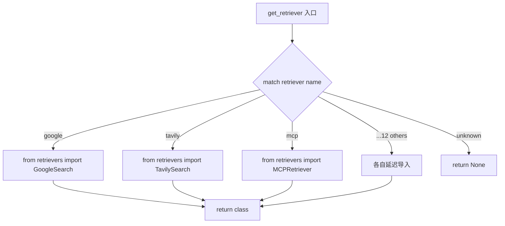
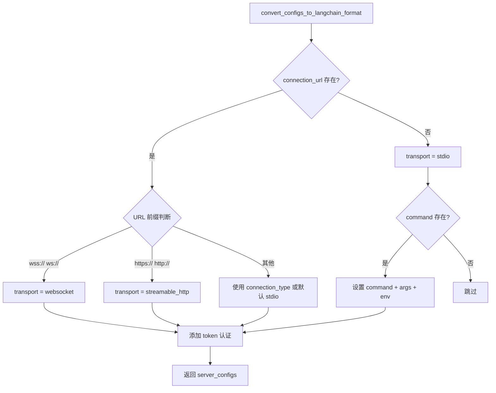
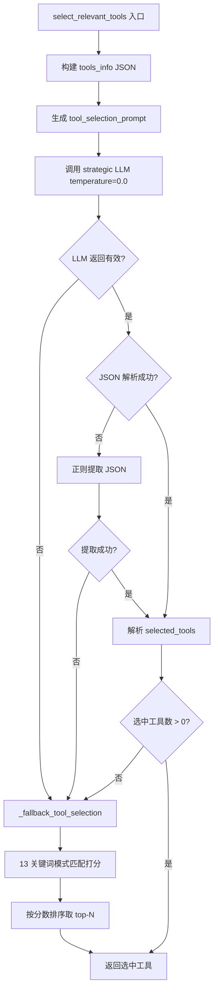

# PD-04.14 GPT-Researcher — MCP 协议集成与 LLM 智能工具选择

> 文档编号：PD-04.14
> 来源：GPT-Researcher `gpt_researcher/mcp/`, `gpt_researcher/retrievers/`
> GitHub：https://github.com/assafelovic/gpt-researcher.git
> 问题域：PD-04 工具系统 Tool System Design
> 状态：可复用方案

---

## 第 1 章 问题与动机（≥ 30 行）

### 1.1 核心问题

Agent 系统需要调用外部工具完成任务，但面临三个层次的挑战：

1. **工具接入异构性**：不同搜索引擎（Tavily、Google、Bing、Arxiv 等）各有独立 API，每接入一个新引擎就要写一套适配代码。MCP 协议提供了标准化接口，但如何将 MCP 工具与已有的原生工具体系统一管理？
2. **工具选择效率**：当 MCP Server 暴露大量工具时（可能数十个），全部传给 LLM 会稀释选择准确率、浪费 token。如何从大工具集中精准选出与当前查询最相关的 2-3 个工具？
3. **多传输协议适配**：MCP 支持 stdio、WebSocket、HTTP 三种传输方式，如何根据配置自动检测并适配正确的传输协议？

### 1.2 GPT-Researcher 的解法概述

GPT-Researcher 采用"Retriever 统一抽象 + MCP 四模块拆分 + LLM 智能选择"的三层架构：

1. **Retriever 工厂模式**：`get_retriever()` 用 match-case 分发 15 种搜索引擎（含 MCP），所有引擎实现统一的 `search()` 接口（`actions/retriever.py:8-96`）
2. **MCP 四模块拆分**：将 MCP 集成拆为 Client（连接管理）、Selector（工具选择）、Skill（研究执行）、Streamer（进度推送）四个独立类（`mcp/*.py`）
3. **LLM 驱动工具选择**：用 strategic LLM（temperature=0.0）分析工具描述，输出 JSON 格式的选择结果含 relevance_score，失败时降级为关键词模式匹配（`mcp/tool_selector.py:35-127`）
4. **URL 自动传输检测**：根据 `connection_url` 前缀自动判断 ws/http/stdio 传输类型，无需用户显式指定（`mcp/client.py:57-74`）
5. **三阶段研究流水线**：获取全部工具 → LLM 选择 2-3 个 → bind_tools 执行研究，每阶段通过 Streamer 实时推送进度（`retrievers/mcp/retriever.py:136-167`）

### 1.3 设计思想

| 设计原则 | 具体实现 | 理由 | 替代方案 |
|----------|----------|------|----------|
| Retriever 统一接口 | 15 种引擎都实现 `search(max_results)` → `List[{title,href,body}]` | MCP 工具与原生搜索引擎对 Agent 透明，无需区分来源 | 为 MCP 单独建一套调用路径 |
| LLM 选择 + 关键词降级 | 先用 strategic LLM 打分选择，JSON 解析失败则用 13 个研究关键词模式匹配 | LLM 理解语义但不可靠，关键词匹配可靠但不智能，两者互补 | 只用关键词匹配 / 只用 LLM |
| 四模块职责分离 | Client/Selector/Skill/Streamer 各管一件事 | 单一职责，可独立测试和替换 | 全部塞进 MCPRetriever 一个类 |
| 延迟导入隔离 | `try: import ... except ImportError: HAS_MCP_ADAPTERS = False` | MCP 是可选依赖，未安装时不影响核心功能 | 强制依赖 langchain-mcp-adapters |
| 异步锁单例 | `asyncio.Lock()` 保护 `get_or_create_client()` | 多并发请求共享同一 MCP 连接，避免重复创建 | 每次请求新建连接 |

---

## 第 2 章 源码实现分析（≥ 60 行，核心章节）

### 2.1 架构概览

GPT-Researcher 的工具系统分为两层：上层是 Retriever 工厂（统一 15 种搜索引擎），下层是 MCP 子系统（四模块协作）。

```
┌─────────────────────────────────────────────────────────────┐
│                    GPTResearcher Agent                       │
│  agent.py:168 → mcp_configs → _process_mcp_configs()        │
│  agent.py:172 → get_retrievers(headers, cfg)                │
└──────────────────────┬──────────────────────────────────────┘
                       │
         ┌─────────────▼─────────────┐
         │   Retriever Factory       │
         │   actions/retriever.py    │
         │   match-case × 15 引擎    │
         │   ┌─────┬─────┬────────┐  │
         │   │Tavily│Google│ ... ×12│  │
         │   └─────┴─────┴────────┘  │
         │   ┌────────────────────┐  │
         │   │   MCPRetriever     │  │
         │   │   (统一 search())   │  │
         │   └────────┬───────────┘  │
         └────────────┼──────────────┘
                      │
    ┌─────────────────▼─────────────────────┐
    │         MCP 四模块子系统               │
    │  ┌──────────┐  ┌──────────────┐       │
    │  │  Client   │  │  Selector    │       │
    │  │ Manager   │  │ (LLM 选择)   │       │
    │  │ 连接管理   │  │ + 关键词降级  │       │
    │  └─────┬────┘  └──────┬───────┘       │
    │        │               │               │
    │  ┌─────▼────┐  ┌──────▼───────┐       │
    │  │ Research  │  │  Streamer    │       │
    │  │  Skill    │  │ (WebSocket)  │       │
    │  │ bind_tools│  │  进度推送     │       │
    │  └──────────┘  └──────────────┘       │
    └───────────────────────────────────────┘
```

### 2.2 核心实现

#### 2.2.1 Retriever 工厂：延迟导入 + match-case 分发



对应源码 `gpt_researcher/actions/retriever.py:8-96`：

```python
def get_retriever(retriever: str):
    match retriever:
        case "google":
            from gpt_researcher.retrievers import GoogleSearch
            return GoogleSearch
        case "tavily":
            from gpt_researcher.retrievers import TavilySearch
            return TavilySearch
        # ... 10 more cases ...
        case "mcp":
            from gpt_researcher.retrievers import MCPRetriever
            return MCPRetriever
        case _:
            return None
```

关键设计：每个 case 内部用延迟 `from ... import`，避免启动时加载全部 15 个引擎的依赖。未安装某引擎的 SDK 不会导致整个系统崩溃。

#### 2.2.2 MCP 连接管理：URL 自动传输检测



对应源码 `gpt_researcher/mcp/client.py:40-98`：

```python
def convert_configs_to_langchain_format(self) -> Dict[str, Dict[str, Any]]:
    server_configs = {}
    for i, config in enumerate(self.mcp_configs):
        server_name = config.get("name", f"mcp_server_{i+1}")
        server_config = {}
        
        connection_url = config.get("connection_url")
        if connection_url:
            if connection_url.startswith(("wss://", "ws://")):
                server_config["transport"] = "websocket"
                server_config["url"] = connection_url
            elif connection_url.startswith(("https://", "http://")):
                server_config["transport"] = "streamable_http"
                server_config["url"] = connection_url
            else:
                connection_type = config.get("connection_type", "stdio")
                server_config["transport"] = connection_type
        else:
            connection_type = config.get("connection_type", "stdio")
            server_config["transport"] = connection_type
        
        if server_config.get("transport") == "stdio":
            if config.get("command"):
                server_config["command"] = config["command"]
                server_args = config.get("args", [])
                if isinstance(server_args, str):
                    server_args = server_args.split()
                server_config["args"] = server_args
        
        if config.get("connection_token"):
            server_config["token"] = config["connection_token"]
        server_configs[server_name] = server_config
    return server_configs
```

#### 2.2.3 LLM 智能工具选择 + 关键词降级



对应源码 `gpt_researcher/mcp/tool_selector.py:35-127`：

```python
async def select_relevant_tools(self, query: str, all_tools: List, max_tools: int = 3) -> List:
    if len(all_tools) < max_tools:
        max_tools = len(all_tools)
    
    tools_info = []
    for i, tool in enumerate(all_tools):
        tool_info = {"index": i, "name": tool.name, "description": tool.description or "No description available"}
        tools_info.append(tool_info)
    
    prompt = PromptFamily.generate_mcp_tool_selection_prompt(query, tools_info, max_tools)
    
    try:
        response = await self._call_llm_for_tool_selection(prompt)
        if not response:
            return self._fallback_tool_selection(all_tools, max_tools)
        
        try:
            selection_result = json.loads(response)
        except json.JSONDecodeError:
            json_match = re.search(r"\{.*\}", response, re.DOTALL)
            if json_match:
                selection_result = json.loads(json_match.group(0))
            else:
                return self._fallback_tool_selection(all_tools, max_tools)
        
        selected_tools = []
        for tool_selection in selection_result.get("selected_tools", []):
            tool_index = tool_selection.get("index")
            if tool_index is not None and 0 <= tool_index < len(all_tools):
                selected_tools.append(all_tools[tool_index])
        
        if len(selected_tools) == 0:
            return self._fallback_tool_selection(all_tools, max_tools)
        return selected_tools
    except Exception:
        return self._fallback_tool_selection(all_tools, max_tools)
```

降级策略的关键词列表（`tool_selector.py:175-178`）：

```python
research_patterns = [
    'search', 'get', 'read', 'fetch', 'find', 'list', 'query',
    'lookup', 'retrieve', 'browse', 'view', 'show', 'describe'
]
# 工具名匹配 +3 分，描述匹配 +1 分
```

### 2.3 实现细节

#### MCP 配置自动注入

Agent 初始化时，`_process_mcp_configs()` 会智能判断是否自动将 MCP 加入 retriever 列表（`agent.py:279-306`）：

- 如果用户通过 `RETRIEVER` 环境变量显式指定了搜索引擎，尊重用户选择，不自动添加 MCP
- 如果 config 中已有 retrievers 但不含 mcp，自动追加
- 如果没有任何 retriever 配置，默认使用 mcp

#### 三阶段研究流水线

MCPRetriever 的 `search_async()` 方法（`retrievers/mcp/retriever.py:116-193`）实现三阶段流水线：

1. **Stage 1**：`client_manager.get_all_tools()` 获取所有 MCP 工具（带缓存）
2. **Stage 2**：`tool_selector.select_relevant_tools(query, all_tools, max_tools=3)` LLM 选择
3. **Stage 3**：`mcp_researcher.conduct_research_with_tools(query, selected_tools)` 执行研究

每个阶段通过 `streamer.stream_stage_start()` 推送进度到 WebSocket。

#### 工具结果多格式归一化

`MCPResearchSkill._process_tool_result()` 处理四种返回格式（`mcp/research.py:158-271`）：

1. **MCP 标准格式**：`{structured_content: {results: [...]}}` → 提取 title/href/body
2. **MCP content 格式**：`{content: [{type: "text", text: "..."}]}` → 拼接文本
3. **列表格式**：`[{title, content/body}]` → 逐项转换
4. **字典/其他格式**：直接 stringify 为 body

所有格式最终归一化为 `{title, href, body}` 标准结构。

---

## 第 3 章 迁移指南（≥ 40 行）

### 3.1 迁移清单

**阶段 1：Retriever 工厂（1 天）**
- [ ] 定义统一的 `search(query, max_results) -> List[{title, href, body}]` 接口
- [ ] 实现 match-case 工厂函数，每个 case 内延迟导入
- [ ] 实现 `get_retrievers()` 多源选择逻辑（headers > config > default）

**阶段 2：MCP 四模块（2 天）**
- [ ] 实现 `MCPClientManager`：配置转换 + asyncio.Lock 单例 + 资源清理
- [ ] 实现 `MCPToolSelector`：LLM 选择 + JSON 解析 + 关键词降级
- [ ] 实现 `MCPResearchSkill`：bind_tools + 工具执行 + 结果归一化
- [ ] 实现 `MCPStreamer`：WebSocket 进度推送（可选）

**阶段 3：Agent 集成（0.5 天）**
- [ ] Agent 初始化时处理 `mcp_configs` 参数
- [ ] 实现 `mcp_strategy` 三级策略（fast/deep/disabled）
- [ ] 自动将 MCP 加入 retriever 列表（尊重用户显式配置）

### 3.2 适配代码模板

#### 最小可用的 LLM 工具选择器

```python
import json
import re
from typing import List, Dict, Any

class ToolSelector:
    """LLM 驱动的工具选择器，带关键词降级。"""
    
    RESEARCH_PATTERNS = [
        'search', 'get', 'read', 'fetch', 'find',
        'list', 'query', 'lookup', 'retrieve'
    ]
    
    def __init__(self, llm_call_fn):
        """
        Args:
            llm_call_fn: async (prompt: str) -> str 的 LLM 调用函数
        """
        self.llm_call = llm_call_fn
    
    async def select(self, query: str, tools: List[Dict], max_tools: int = 3) -> List[int]:
        """返回选中工具的索引列表。"""
        if len(tools) <= max_tools:
            return list(range(len(tools)))
        
        # 构建 prompt
        prompt = self._build_prompt(query, tools, max_tools)
        
        try:
            response = await self.llm_call(prompt)
            indices = self._parse_response(response, len(tools))
            if indices:
                return indices[:max_tools]
        except Exception:
            pass
        
        # 降级：关键词匹配
        return self._fallback(tools, max_tools)
    
    def _build_prompt(self, query: str, tools: List[Dict], max_tools: int) -> str:
        return f"""Select {max_tools} most relevant tools for: "{query}"

Tools: {json.dumps(tools, indent=2)}

Return JSON: {{"selected": [{{"index": 0, "score": 9}}]}}"""
    
    def _parse_response(self, response: str, total: int) -> List[int]:
        try:
            data = json.loads(response)
        except json.JSONDecodeError:
            match = re.search(r"\{.*\}", response, re.DOTALL)
            if not match:
                return []
            data = json.loads(match.group(0))
        
        indices = []
        for item in data.get("selected", []):
            idx = item.get("index")
            if idx is not None and 0 <= idx < total:
                indices.append(idx)
        return indices
    
    def _fallback(self, tools: List[Dict], max_tools: int) -> List[int]:
        scored = []
        for i, tool in enumerate(tools):
            name = tool.get("name", "").lower()
            desc = tool.get("description", "").lower()
            score = sum(3 for p in self.RESEARCH_PATTERNS if p in name)
            score += sum(1 for p in self.RESEARCH_PATTERNS if p in desc)
            if score > 0:
                scored.append((i, score))
        scored.sort(key=lambda x: x[1], reverse=True)
        return [i for i, _ in scored[:max_tools]]
```

#### MCP 配置自动检测模板

```python
def auto_detect_transport(config: dict) -> dict:
    """根据 URL 前缀自动检测 MCP 传输协议。"""
    url = config.get("connection_url", "")
    if url.startswith(("wss://", "ws://")):
        return {"transport": "websocket", "url": url}
    elif url.startswith(("https://", "http://")):
        return {"transport": "streamable_http", "url": url}
    else:
        result = {"transport": "stdio"}
        if config.get("command"):
            result["command"] = config["command"]
            args = config.get("args", [])
            result["args"] = args.split() if isinstance(args, str) else args
        return result
```

### 3.3 适用场景

| 场景 | 适用度 | 说明 |
|------|--------|------|
| 多搜索引擎聚合 Agent | ⭐⭐⭐ | 15 种引擎统一接口，按需切换 |
| MCP 工具集成 | ⭐⭐⭐ | 三传输协议自动检测，四模块清晰分工 |
| 大工具集精选 | ⭐⭐⭐ | LLM 选择 + 关键词降级，适合 10+ 工具场景 |
| 实时进度反馈 | ⭐⭐ | WebSocket Streamer 适合有前端的场景 |
| 纯 MCP 无原生工具 | ⭐⭐ | 需要 langchain-mcp-adapters 依赖 |
| 低延迟场景 | ⭐ | LLM 工具选择增加一次 LLM 调用开销 |

---

## 第 4 章 测试用例（≥ 20 行）

```python
import pytest
import json
from unittest.mock import AsyncMock, MagicMock, patch

class TestMCPClientManager:
    """测试 MCP 客户端管理器的配置转换和生命周期。"""
    
    def test_auto_detect_websocket(self):
        """URL 以 wss:// 开头应自动检测为 websocket 传输。"""
        from gpt_researcher.mcp.client import MCPClientManager
        manager = MCPClientManager([{
            "name": "ws_server",
            "connection_url": "wss://example.com/mcp"
        }])
        configs = manager.convert_configs_to_langchain_format()
        assert configs["ws_server"]["transport"] == "websocket"
        assert configs["ws_server"]["url"] == "wss://example.com/mcp"
    
    def test_auto_detect_http(self):
        """URL 以 https:// 开头应自动检测为 streamable_http 传输。"""
        from gpt_researcher.mcp.client import MCPClientManager
        manager = MCPClientManager([{
            "name": "http_server",
            "connection_url": "https://api.example.com/mcp"
        }])
        configs = manager.convert_configs_to_langchain_format()
        assert configs["http_server"]["transport"] == "streamable_http"
    
    def test_stdio_with_command(self):
        """无 URL 时应默认 stdio，并正确设置 command/args。"""
        from gpt_researcher.mcp.client import MCPClientManager
        manager = MCPClientManager([{
            "name": "local",
            "command": "python",
            "args": ["-m", "my_server"]
        }])
        configs = manager.convert_configs_to_langchain_format()
        assert configs["local"]["transport"] == "stdio"
        assert configs["local"]["command"] == "python"
        assert configs["local"]["args"] == ["-m", "my_server"]
    
    def test_string_args_split(self):
        """字符串格式的 args 应自动 split 为列表。"""
        from gpt_researcher.mcp.client import MCPClientManager
        manager = MCPClientManager([{
            "command": "node",
            "args": "server.js --port 3000"
        }])
        configs = manager.convert_configs_to_langchain_format()
        assert configs["mcp_server_1"]["args"] == ["server.js", "--port", "3000"]
    
    def test_auth_token(self):
        """connection_token 应映射为 token 字段。"""
        from gpt_researcher.mcp.client import MCPClientManager
        manager = MCPClientManager([{
            "name": "auth_server",
            "connection_url": "https://api.example.com",
            "connection_token": "secret123"
        }])
        configs = manager.convert_configs_to_langchain_format()
        assert configs["auth_server"]["token"] == "secret123"


class TestMCPToolSelector:
    """测试 LLM 工具选择与降级逻辑。"""
    
    def test_fallback_keyword_scoring(self):
        """降级模式应按关键词匹配打分排序。"""
        from gpt_researcher.mcp.tool_selector import MCPToolSelector
        selector = MCPToolSelector(cfg=None)
        
        tools = [
            MagicMock(name="delete_file", description="Delete a file"),
            MagicMock(name="search_web", description="Search the web for information"),
            MagicMock(name="list_repos", description="List GitHub repositories"),
            MagicMock(name="create_issue", description="Create a new issue"),
        ]
        # 手动设置 name 属性（MagicMock 的 name 是特殊属性）
        tools[0].name = "delete_file"
        tools[1].name = "search_web"
        tools[2].name = "list_repos"
        tools[3].name = "create_issue"
        tools[0].description = "Delete a file"
        tools[1].description = "Search the web for information"
        tools[2].description = "List GitHub repositories"
        tools[3].description = "Create a new issue"
        
        result = selector._fallback_tool_selection(tools, max_tools=2)
        names = [t.name for t in result]
        # search_web 和 list_repos 应排在前面（含 search/list 关键词）
        assert "search_web" in names
        assert "list_repos" in names
    
    @pytest.mark.asyncio
    async def test_llm_selection_with_valid_json(self):
        """LLM 返回有效 JSON 时应正确解析工具索引。"""
        from gpt_researcher.mcp.tool_selector import MCPToolSelector
        
        cfg = MagicMock()
        cfg.strategic_llm_model = "gpt-4"
        cfg.strategic_llm_provider = "openai"
        cfg.llm_kwargs = {}
        
        selector = MCPToolSelector(cfg=cfg, researcher=None)
        
        llm_response = json.dumps({
            "selected_tools": [
                {"index": 1, "name": "search", "relevance_score": 9, "reason": "Best match"},
                {"index": 0, "name": "fetch", "relevance_score": 7, "reason": "Good match"}
            ],
            "selection_reasoning": "Selected search-related tools"
        })
        
        tools = [MagicMock(), MagicMock(), MagicMock()]
        for i, t in enumerate(tools):
            t.name = f"tool_{i}"
            t.description = f"Tool {i} description"
        
        with patch.object(selector, '_call_llm_for_tool_selection', return_value=llm_response):
            result = await selector.select_relevant_tools("test query", tools, max_tools=2)
        
        assert len(result) == 2
        assert result[0] == tools[1]  # index 1
        assert result[1] == tools[0]  # index 0


class TestResultNormalization:
    """测试工具结果多格式归一化。"""
    
    def test_mcp_structured_content(self):
        """MCP structured_content 格式应正确提取。"""
        from gpt_researcher.mcp.research import MCPResearchSkill
        skill = MCPResearchSkill(cfg=None)
        
        result = {
            "structured_content": {
                "results": [
                    {"title": "Page 1", "href": "https://example.com", "body": "Content 1"},
                    {"title": "Page 2", "url": "https://example.com/2", "content": "Content 2"}
                ]
            }
        }
        formatted = skill._process_tool_result("test_tool", result)
        assert len(formatted) == 2
        assert formatted[0]["title"] == "Page 1"
        assert formatted[1]["href"] == "https://example.com/2"
    
    def test_mcp_content_text_parts(self):
        """MCP content [{type: text, text: ...}] 格式应拼接为 body。"""
        from gpt_researcher.mcp.research import MCPResearchSkill
        skill = MCPResearchSkill(cfg=None)
        
        result = {
            "content": [
                {"type": "text", "text": "Part 1"},
                {"type": "text", "text": "Part 2"}
            ]
        }
        formatted = skill._process_tool_result("test_tool", result)
        assert len(formatted) == 1
        assert "Part 1" in formatted[0]["body"]
        assert "Part 2" in formatted[0]["body"]
    
    def test_plain_string_result(self):
        """纯字符串结果应包装为标准格式。"""
        from gpt_researcher.mcp.research import MCPResearchSkill
        skill = MCPResearchSkill(cfg=None)
        
        formatted = skill._process_tool_result("test_tool", "raw text output")
        assert len(formatted) == 1
        assert formatted[0]["body"] == "raw text output"
        assert formatted[0]["href"] == "mcp://test_tool"
```

---

## 第 5 章 跨域关联

| 关联域 | 关系类型 | 说明 |
|--------|----------|------|
| PD-01 上下文管理 | 协同 | 工具选择 prompt 和工具结果都消耗 context window，max_tools=3 的限制本质是 token 预算控制 |
| PD-03 容错与重试 | 依赖 | LLM 工具选择失败时降级为关键词匹配，工具执行失败时 continue 跳过，search() 返回空列表而非抛异常 |
| PD-06 记忆持久化 | 协同 | `_all_tools_cache` 缓存工具列表避免重复 MCP 调用，但仅为实例级缓存，不跨会话持久化 |
| PD-08 搜索与检索 | 强依赖 | MCPRetriever 本身就是一种搜索引擎，与 Tavily/Google 等并列在 Retriever 工厂中 |
| PD-11 可观测性 | 协同 | MCPStreamer 通过 WebSocket 推送三阶段进度，`add_costs` 回调追踪 LLM 工具选择的成本 |

---

## 第 6 章 来源文件索引

| 文件 | 行范围 | 关键实现 |
|------|--------|----------|
| `gpt_researcher/mcp/client.py` | L19-L174 | MCPClientManager：配置转换、URL 自动传输检测、asyncio.Lock 单例、资源清理 |
| `gpt_researcher/mcp/tool_selector.py` | L14-L204 | MCPToolSelector：LLM 智能选择、JSON 解析（含正则提取）、13 关键词降级 |
| `gpt_researcher/mcp/research.py` | L13-L271 | MCPResearchSkill：bind_tools 执行、四格式结果归一化 |
| `gpt_researcher/mcp/streaming.py` | L13-L102 | MCPStreamer：WebSocket 进度推送、同步/异步双模式 |
| `gpt_researcher/retrievers/__init__.py` | L1-L33 | 15 种 Retriever 导出（含 MCPRetriever） |
| `gpt_researcher/retrievers/mcp/retriever.py` | L27-L324 | MCPRetriever：三阶段流水线、工具缓存、异步/同步桥接 |
| `gpt_researcher/actions/retriever.py` | L8-L147 | Retriever 工厂：match-case 分发、延迟导入、多源选择优先级 |
| `gpt_researcher/agent.py` | L78-L306 | Agent 集成：mcp_configs 处理、mcp_strategy 三级策略、自动注入 |
| `gpt_researcher/prompts.py` | L40-L118 | MCP 专用 prompt：工具选择 prompt、研究执行 prompt |

---

## 第 7 章 横向对比维度

> **重要：** 本章用于自动填充 Butcher Wiki 的横向对比表。

```json comparison_data
{
  "project": "GPT-Researcher",
  "dimensions": {
    "工具注册方式": "match-case 工厂 + 延迟导入，15 种引擎各自独立模块",
    "MCP 协议支持": "langchain-mcp-adapters 桥接，stdio/ws/http 三传输自动检测",
    "工具推荐策略": "strategic LLM 打分选择 + 13 关键词模式匹配降级",
    "工具分组/权限": "无显式分组，通过 mcp_strategy(fast/deep/disabled) 控制执行深度",
    "热更新/缓存": "实例级 _all_tools_cache，不跨会话持久化",
    "超时保护": "search() 同步桥接 300s 超时，cleanup 5s 超时",
    "数据供应商路由": "get_retrievers() 四级优先级：headers > config.retrievers > config.retriever > Tavily 默认",
    "供应商降级策略": "LLM 选择失败降级关键词匹配，工具执行失败 continue 跳过",
    "结果摘要": "四格式归一化为 {title,href,body}，含 LLM 自身分析作为额外结果",
    "生命周期追踪": "MCPStreamer 三阶段 WebSocket 推送 + add_costs 成本回调",
    "工具条件加载": "try/except ImportError 可选依赖，HAS_MCP_ADAPTERS 标志位",
    "工具上下文注入": "MCPRetriever 从 researcher 实例提取 mcp_configs 和 cfg",
    "双层API架构": "MCPRetriever 统一 search() 接口，内部四模块分工协作"
  }
}
```

### 域元数据补充

```json domain_metadata
{
  "solution_summary": "GPT-Researcher 用 match-case 工厂统一 15 种搜索引擎，MCP 集成拆为 Client/Selector/Skill/Streamer 四模块，通过 strategic LLM 从大工具集中智能选择 2-3 个最相关工具并降级为关键词匹配",
  "description": "大工具集场景下的智能精选与多格式结果归一化",
  "sub_problems": [
    "MCP 多传输自动检测：如何根据 URL 前缀自动判断 stdio/ws/http 传输协议",
    "LLM 工具选择 JSON 容错：LLM 返回非标准 JSON 时如何用正则提取有效内容",
    "异步/同步桥接：同步 search() 接口如何安全包装异步 MCP 调用避免事件循环冲突",
    "MCP 策略分级：如何通过 fast/deep/disabled 三级策略控制 MCP 执行深度与成本"
  ],
  "best_practices": [
    "工具选择应有降级路径：LLM 选择不可靠时用关键词匹配兜底",
    "MCP 模块应职责分离：连接管理、工具选择、执行、流式输出各自独立",
    "工具结果归一化：无论 MCP 返回什么格式都转为统一的 {title,href,body} 结构"
  ]
}
```
