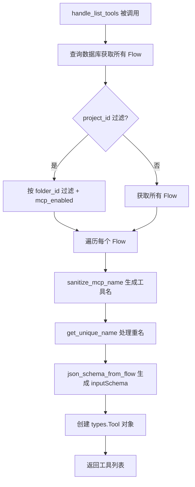
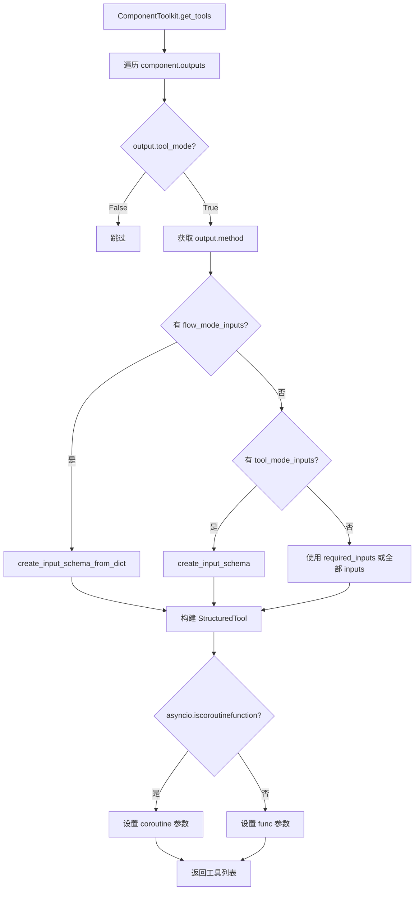
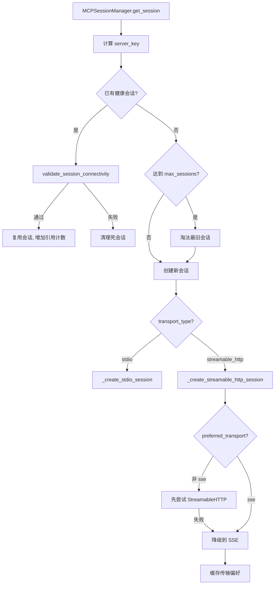

# PD-04.XX Langflow — Flow-as-Tool 与 MCP 双层工具体系

> 文档编号：PD-04.XX
> 来源：Langflow `src/backend/base/langflow/agentic/mcp/server.py`, `src/lfx/src/lfx/base/tools/component_tool.py`, `src/backend/base/langflow/api/v1/mcp_utils.py`
> GitHub：https://github.com/langflow-ai/langflow.git
> 问题域：PD-04 工具系统 Tool System Design
> 状态：可复用方案

---

## 第 1 章 问题与动机

### 1.1 核心问题

Langflow 是一个可视化 LLM 应用构建平台，用户通过拖拽组件构建 Flow（工作流）。核心挑战在于：

1. **Flow 即工具**：用户构建的每个 Flow 都应该能被外部 Agent 或 MCP 客户端作为工具调用，但 Flow 的输入输出是动态的、用户定义的
2. **组件即工具**：Flow 内部的每个组件（Component）也需要能被 Agent 作为 LangChain StructuredTool 调用
3. **外部 MCP 集成**：Flow 内部需要能连接外部 MCP Server，将远程工具引入本地 Agent 的工具集
4. **双向暴露**：Langflow 既是 MCP Server（将 Flow 暴露为工具），又是 MCP Client（消费外部 MCP 工具）

### 1.2 Langflow 的解法概述

1. **FastMCP Server 层**（`agentic/mcp/server.py:43`）：用 FastMCP 装饰器将模板搜索、组件查询、Flow 可视化等内部能力暴露为 MCP 工具
2. **Flow-as-Tool MCP 层**（`api/v1/mcp_utils.py:322-392`）：将用户创建的每个 Flow 自动注册为 MCP Tool，通过 `json_schema_from_flow()` 动态生成 inputSchema
3. **ComponentToolkit 转换层**（`lfx/base/tools/component_tool.py:141-273`）：将任意 Component 的 output 方法自动包装为 LangChain StructuredTool
4. **MCP Client 双传输层**（`lfx/base/mcp/util.py:487-1539`）：MCPSessionManager 管理 Stdio/StreamableHTTP/SSE 三种传输的会话池，支持自动降级
5. **MCP Composer 进程管理**（`lfx/services/mcp_composer/service.py:69-1474`）：为每个项目启动独立的 mcp-composer 子进程，处理 OAuth 认证代理

### 1.3 设计思想

| 设计原则 | 具体实现 | 理由 | 替代方案 |
|----------|----------|------|----------|
| Flow 即 Tool | `json_schema_from_flow()` 从 Flow 的 input 节点动态生成 JSON Schema | 用户无需手动定义工具接口，Flow 本身就是接口 | 手动编写 OpenAPI spec |
| 组件输出即工具方法 | `ComponentToolkit.get_tools()` 遍历 `tool_mode=True` 的 output | 复用组件已有的类型系统和校验逻辑 | 为每个组件单独写 Tool wrapper |
| 双传输自动降级 | StreamableHTTP → SSE 自动 fallback + 传输偏好缓存 | 兼容不同版本的 MCP Server | 强制要求特定传输协议 |
| 会话池化复用 | MCPSessionManager 按 server_key 复用会话，引用计数管理生命周期 | 避免每次工具调用都创建新的子进程/连接 | 每次调用创建新连接 |
| 进程级隔离 | MCPComposerService 为每个项目启动独立子进程 | OAuth 凭据隔离，项目间互不影响 | 共享单一代理进程 |

---

## 第 2 章 源码实现分析

### 2.1 架构概览

```
┌─────────────────────────────────────────────────────────────────┐
│                    Langflow Tool System                         │
├─────────────────────────────────────────────────────────────────┤
│                                                                 │
│  ┌──────────────────┐    ┌──────────────────────────────────┐  │
│  │  MCP Server 层    │    │  MCP Client 层                   │  │
│  │                  │    │                                  │  │
│  │  FastMCP Server  │    │  MCPStdioClient                  │  │
│  │  (agentic tools) │    │  MCPStreamableHttpClient          │  │
│  │                  │    │  MCPSessionManager (会话池)       │  │
│  │  Flow-as-Tool    │    │  MCPComposerService (OAuth代理)   │  │
│  │  (mcp_utils.py)  │    │                                  │  │
│  └──────────────────┘    └──────────────────────────────────┘  │
│           │                          │                          │
│           ▼                          ▼                          │
│  ┌──────────────────────────────────────────────────────────┐  │
│  │              ComponentToolkit 转换层                       │  │
│  │  Component.outputs → StructuredTool (LangChain)          │  │
│  │  create_input_schema() → Pydantic Model → JSON Schema    │  │
│  └──────────────────────────────────────────────────────────┘  │
│           │                          │                          │
│           ▼                          ▼                          │
│  ┌──────────────────┐    ┌──────────────────────────────────┐  │
│  │  SSE Transport   │    │  Streamable HTTP Transport       │  │
│  │  (双向流)         │    │  (Session Manager 生命周期)       │  │
│  └──────────────────┘    └──────────────────────────────────┘  │
└─────────────────────────────────────────────────────────────────┘
```

### 2.2 核心实现

#### 2.2.1 Flow-as-Tool：将用户 Flow 自动注册为 MCP 工具



对应源码 `src/backend/base/langflow/api/v1/mcp_utils.py:322-392`：

```python
async def handle_list_tools(project_id=None, *, mcp_enabled_only=False):
    tools = []
    async with session_scope() as session:
        if project_id:
            flows_query = select(Flow).where(
                Flow.folder_id == project_id, Flow.is_component == False
            )
            if mcp_enabled_only:
                flows_query = flows_query.where(Flow.mcp_enabled == True)
        else:
            flows_query = select(Flow)

        flows = (await session.exec(flows_query)).all()
        existing_names = set()
        for flow in flows:
            if flow.user_id is None:
                continue
            base_name = sanitize_mcp_name(flow.name)
            name = get_unique_name(base_name, MAX_MCP_TOOL_NAME_LENGTH, existing_names)
            tool = types.Tool(
                name=name,
                description=flow.description or f"Tool generated from flow: {name}",
                inputSchema=json_schema_from_flow(flow),
            )
            tools.append(tool)
            existing_names.add(name)
    return tools
```

`json_schema_from_flow`（`src/backend/base/langflow/helpers/flow.py:440-480`）从 Flow 的 Graph 中提取 input 节点，遍历其 template 字段，将 Python 类型映射为 JSON Schema 类型（str→string, int→integer, float→number, bool→boolean）。

#### 2.2.2 ComponentToolkit：组件到 StructuredTool 的自动转换



对应源码 `src/lfx/src/lfx/base/tools/component_tool.py:164-254`：

```python
def get_tools(self, tool_name=None, tool_description=None,
              callbacks=None, flow_mode_inputs=None) -> list[BaseTool]:
    tools = []
    for output in self.component.outputs:
        if self._should_skip_output(output):
            continue
        output_method = getattr(self.component, output.method)
        # 根据不同来源构建 args_schema
        tool_mode_inputs = [i for i in self.component.inputs
                           if getattr(i, "tool_mode", False)]
        if flow_mode_inputs:
            args_schema = create_input_schema_from_dict(
                inputs=flow_mode_inputs, param_key="flow_tweak_data")
        elif tool_mode_inputs:
            args_schema = create_input_schema(tool_mode_inputs)
        # ... 构建 StructuredTool
        if asyncio.iscoroutinefunction(output_method):
            tools.append(StructuredTool(
                name=formatted_name,
                description=build_description(self.component),
                coroutine=_build_output_async_function(
                    self.component, output_method, event_manager),
                args_schema=args_schema,
                handle_tool_error=True,
            ))
    return tools
```

关键设计：`_patch_send_message_decorator`（`component_tool.py:58-82`）在工具执行期间将组件的 `send_message` 替换为 noop，防止作为工具调用时向 UI 发送消息。

#### 2.2.3 MCP 双传输 Session 管理



对应源码 `src/lfx/src/lfx/base/mcp/util.py:621-703`：

```python
async def get_session(self, context_id, connection_params, transport_type):
    server_key = self._get_server_key(connection_params, transport_type)
    # 尝试复用已有健康会话
    for session_id, session_info in list(sessions.items()):
        if not task.done() and await self._validate_session_connectivity(session):
            self._context_to_session[context_id] = (server_key, session_id)
            self._session_refcount[(server_key, session_id)] += 1
            return session
    # 达到上限则淘汰最旧
    if len(sessions) >= get_max_sessions_per_server():
        oldest = min(sessions.keys(), key=lambda x: sessions[x]["last_used"])
        await self._cleanup_session_by_id(server_key, oldest)
    # 创建新会话，缓存传输偏好
    session, task, actual_transport = await self._create_streamable_http_session(
        session_id, connection_params, preferred_transport)
    self._transport_preference[server_key] = actual_transport
```

### 2.3 实现细节

**Schema 生成的 Token 优化**（`lfx/io/schema.py:21`）：当 Dropdown 选项超过 `MAX_OPTIONS_FOR_TOOL_ENUM = 50` 时，不生成 Literal 枚举类型，改用 string + default，避免大量选项浪费 LLM token。

**工具名称安全化**（`lfx/base/mcp/util.py:189-257`）：`sanitize_mcp_name()` 移除 emoji、Unicode 变音符号、特殊字符，确保工具名符合 MCP 协议的 `^[a-zA-Z0-9_-]+$` 要求。

**camelCase 到 snake_case 自动转换**（`lfx/base/mcp/util.py:269-288`）：`_convert_camel_case_to_snake_case()` 在工具调用时自动修正 LLM 常见的参数名格式差异。

**进度通知**（`mcp_utils.py:235-258`）：工具执行期间通过 `send_progress_notification` 向 MCP 客户端发送 0.0→0.9 的渐进式进度更新，每秒递增 0.1。

**双传输 SSE + Streamable HTTP**（`api/v1/mcp.py:85-293`）：MCP Server 同时暴露 SSE（`/mcp/sse`）和 Streamable HTTP（`/mcp/streamable`）两种传输端点，`ResponseNoOp` 类解决 FastAPI 与 ASGI 双重响应冲突。

**MCP Composer 端口冲突处理**（`mcp_composer/service.py:101-149`）：`_is_port_available()` 同时检查 IPv4 和 IPv6，`_ensure_port_available()` 区分"被其他项目占用"（拒绝）和"被自身占用"（kill 后重试）两种情况。


---

## 第 3 章 迁移指南

### 3.1 迁移清单

**阶段 1：Flow-as-Tool 基础**
- [ ] 定义 Flow 数据模型（含 input 节点、output 节点、graph 结构）
- [ ] 实现 `json_schema_from_flow()` 从 Flow 的 input 节点动态生成 JSON Schema
- [ ] 实现 `sanitize_mcp_name()` 工具名安全化
- [ ] 实现 `handle_list_tools()` 将 Flow 列表转为 MCP Tool 列表
- [ ] 实现 `handle_call_tool()` 接收 MCP 调用并执行 Flow

**阶段 2：Component-to-Tool 转换**
- [ ] 定义 `tool_mode` 标记，让组件的 output 可选择性暴露为工具
- [ ] 实现 `create_input_schema()` 从组件 inputs 生成 Pydantic Model
- [ ] 实现 `ComponentToolkit.get_tools()` 自动包装为 LangChain StructuredTool
- [ ] 处理异步/同步方法的统一包装

**阶段 3：MCP Client 会话管理**
- [ ] 实现 MCPSessionManager 会话池（server_key 复用 + 引用计数）
- [ ] 实现 StreamableHTTP → SSE 自动降级 + 传输偏好缓存
- [ ] 实现空闲会话定期清理 + 连接健康检查
- [ ] 实现工具调用重试（连接错误重建会话，超时错误直接重试）

### 3.2 适配代码模板

**Flow-as-Tool 注册器**：

```python
from pydantic import BaseModel, Field, create_model
from typing import Any
import re
import unicodedata

def sanitize_tool_name(name: str, max_length: int = 46) -> str:
    """将任意字符串转为 MCP 兼容的工具名。"""
    # 移除 emoji 和变音符号
    name = unicodedata.normalize("NFD", name)
    name = "".join(c for c in name if unicodedata.category(c) != "Mn")
    name = re.sub(r"[^\w\s-]", "", name)
    name = re.sub(r"[-\s]+", "_", name).strip("_").lower()
    if name and name[0].isdigit():
        name = f"_{name}"
    return name[:max_length].rstrip("_") or "unnamed"

def json_schema_from_workflow(workflow: dict) -> dict:
    """从工作流定义动态生成 JSON Schema。"""
    TYPE_MAP = {"str": "string", "int": "integer", "float": "number", "bool": "boolean"}
    properties, required = {}, []
    for node in workflow.get("input_nodes", []):
        for field_name, field_def in node.get("fields", {}).items():
            if not field_def.get("visible", True):
                continue
            json_type = TYPE_MAP.get(field_def.get("type", "str"), "string")
            properties[field_name] = {
                "type": json_type,
                "description": field_def.get("description", f"Input: {field_name}"),
            }
            if field_def.get("required", False):
                required.append(field_name)
    return {"type": "object", "properties": properties, "required": required}

def create_input_schema(inputs: list[dict]) -> type[BaseModel]:
    """从输入定义列表动态创建 Pydantic Model。"""
    TYPE_MAP = {"string": str, "integer": int, "number": float, "boolean": bool}
    fields = {}
    for inp in inputs:
        py_type = TYPE_MAP.get(inp.get("type", "string"), str)
        field_kwargs = {"title": inp["name"].replace("_", " ").title(),
                       "description": inp.get("description", "")}
        if not inp.get("required", True):
            field_kwargs["default"] = inp.get("default")
        fields[inp["name"]] = (py_type, Field(**field_kwargs))
    model = create_model("InputSchema", **fields)
    model.model_rebuild()
    return model
```

**MCP 会话池管理器**：

```python
import asyncio
from dataclasses import dataclass, field

@dataclass
class SessionInfo:
    session: Any
    task: asyncio.Task
    transport: str
    last_used: float = 0.0

class SessionPool:
    """按 server_key 复用 MCP 会话，支持引用计数和空闲清理。"""
    def __init__(self, max_per_server: int = 5, idle_timeout: int = 300):
        self._sessions: dict[str, dict[str, SessionInfo]] = {}
        self._refcount: dict[tuple[str, str], int] = {}
        self._transport_pref: dict[str, str] = {}
        self.max_per_server = max_per_server
        self.idle_timeout = idle_timeout

    async def get_or_create(self, server_key: str, factory) -> Any:
        """获取或创建会话，factory 是 async callable 返回 (session, task, transport)。"""
        if server_key in self._sessions:
            for sid, info in list(self._sessions[server_key].items()):
                if not info.task.done():
                    info.last_used = asyncio.get_event_loop().time()
                    return info.session
        # 创建新会话
        preferred = self._transport_pref.get(server_key)
        session, task, transport = await factory(preferred_transport=preferred)
        self._transport_pref[server_key] = transport
        sid = f"{server_key}_{len(self._sessions.get(server_key, {}))}"
        self._sessions.setdefault(server_key, {})[sid] = SessionInfo(
            session=session, task=task, transport=transport,
            last_used=asyncio.get_event_loop().time())
        return session
```

### 3.3 适用场景

| 场景 | 适用度 | 说明 |
|------|--------|------|
| 可视化工作流平台 | ⭐⭐⭐ | Flow-as-Tool 模式天然适合拖拽式构建的工作流 |
| 多 MCP Server 聚合 | ⭐⭐⭐ | MCPSessionManager 的会话池和传输降级非常成熟 |
| Agent 框架集成 | ⭐⭐⭐ | ComponentToolkit 到 LangChain StructuredTool 的转换可直接复用 |
| 单一 MCP Server 场景 | ⭐⭐ | 会话池管理有些过度，但传输降级仍有价值 |
| 非 Python 技术栈 | ⭐ | 深度依赖 Pydantic/LangChain，迁移成本高 |

---

## 第 4 章 测试用例

```python
import pytest
import asyncio
import re
from unittest.mock import AsyncMock, MagicMock, patch
from pydantic import BaseModel

# ---- 工具名安全化测试 ----

class TestSanitizeMcpName:
    def test_normal_name(self):
        from lfx.base.mcp.util import sanitize_mcp_name
        assert sanitize_mcp_name("My Flow Name") == "my_flow_name"

    def test_emoji_removal(self):
        from lfx.base.mcp.util import sanitize_mcp_name
        result = sanitize_mcp_name("🚀 Rocket Flow 🎯")
        assert "🚀" not in result
        assert "rocket" in result

    def test_number_prefix(self):
        from lfx.base.mcp.util import sanitize_mcp_name
        result = sanitize_mcp_name("123flow")
        assert result.startswith("_")

    def test_max_length(self):
        from lfx.base.mcp.util import sanitize_mcp_name
        long_name = "a" * 100
        result = sanitize_mcp_name(long_name, max_length=46)
        assert len(result) <= 46

    def test_empty_string(self):
        from lfx.base.mcp.util import sanitize_mcp_name
        assert sanitize_mcp_name("") == ""
        assert sanitize_mcp_name("   ") == ""

# ---- camelCase 转换测试 ----

class TestCamelToSnakeConversion:
    def test_camel_to_snake(self):
        from lfx.base.mcp.util import _convert_camel_case_to_snake_case

        class Schema(BaseModel):
            user_name: str
            max_count: int = 10

        result = _convert_camel_case_to_snake_case(
            {"userName": "test", "maxCount": 5}, Schema)
        assert result == {"user_name": "test", "max_count": 5}

    def test_already_snake_case(self):
        from lfx.base.mcp.util import _convert_camel_case_to_snake_case

        class Schema(BaseModel):
            user_name: str

        result = _convert_camel_case_to_snake_case({"user_name": "test"}, Schema)
        assert result == {"user_name": "test"}

# ---- Schema 生成测试 ----

class TestCreateInputSchema:
    def test_basic_schema(self):
        from lfx.io.schema import create_input_schema
        from lfx.inputs.inputs import MessageTextInput, IntInput

        inputs = [
            MessageTextInput(name="query", display_name="Query", info="Search query"),
            IntInput(name="limit", display_name="Limit", info="Max results", required=False, value=10),
        ]
        schema = create_input_schema(inputs)
        assert "query" in schema.model_fields
        assert "limit" in schema.model_fields
        assert not schema.model_fields["limit"].is_required()

    def test_large_dropdown_skips_enum(self):
        from lfx.io.schema import create_input_schema, MAX_OPTIONS_FOR_TOOL_ENUM
        from lfx.inputs.inputs import DropdownInput

        options = [f"option_{i}" for i in range(MAX_OPTIONS_FOR_TOOL_ENUM + 10)]
        inputs = [DropdownInput(name="choice", display_name="Choice", options=options)]
        schema = create_input_schema(inputs)
        # 超过阈值时不应生成 Literal 枚举
        field_type = schema.model_fields["choice"].annotation
        assert field_type is str

# ---- MCPSessionManager 测试 ----

class TestMCPSessionManager:
    @pytest.mark.asyncio
    async def test_session_reuse(self):
        from lfx.base.mcp.util import MCPSessionManager
        manager = MCPSessionManager()
        mock_session = AsyncMock()
        mock_session.list_tools = AsyncMock(return_value=MagicMock(tools=[]))
        # 模拟创建会话后复用
        # ... 具体实现依赖 MCP SDK mock

    @pytest.mark.asyncio
    async def test_transport_fallback_caching(self):
        """验证传输偏好缓存：首次 StreamableHTTP 失败后缓存 SSE 偏好。"""
        from lfx.base.mcp.util import MCPSessionManager
        manager = MCPSessionManager()
        # 首次连接后 _transport_preference 应被设置
        assert isinstance(manager._transport_preference, dict)

# ---- 工具调用重试测试 ----

class TestToolCallRetry:
    @pytest.mark.asyncio
    async def test_retry_on_closed_resource(self):
        """连接断开时应重建会话并重试。"""
        from lfx.base.mcp.util import MCPStdioClient
        client = MCPStdioClient()
        client._connected = True
        client._connection_params = MagicMock()
        client._session_context = "test_ctx"
        # 第一次调用抛出 ClosedResourceError，第二次成功
        # ... 具体实现依赖 MCP SDK mock
```


---

## 第 5 章 跨域关联

| 关联域 | 关系类型 | 说明 |
|--------|----------|------|
| PD-01 上下文管理 | 协同 | `MAX_OPTIONS_FOR_TOOL_ENUM=50` 限制 Schema 中枚举选项数量，直接控制工具描述的 token 消耗 |
| PD-02 多 Agent 编排 | 依赖 | ComponentToolkit 生成的 StructuredTool 被 Agent 编排层消费，Flow-as-Tool 让 Flow 成为 Agent 可调用的子任务 |
| PD-03 容错与重试 | 协同 | MCPStdioClient.run_tool 内置 2 次重试，区分连接错误（重建会话）和超时错误（直接重试），MCPSessionManager 有空闲会话定期清理 |
| PD-05 沙箱隔离 | 协同 | MCPComposerService 为每个项目启动独立子进程，实现 OAuth 凭据和运行时的进程级隔离 |
| PD-06 记忆持久化 | 依赖 | MCP 会话通过 `_shared_component_cache` 在组件间共享 MCPSessionManager 实例，避免重复创建 |
| PD-09 Human-in-the-Loop | 协同 | `_patch_send_message_decorator` 在工具模式下静默 UI 消息，但 Flow 执行仍可通过 MCP progress notification 反馈进度 |
| PD-11 可观测性 | 协同 | 工具调用全程有结构化日志（`logger.adebug/ainfo/aerror`），包含 session_id、server_key、attempt 等上下文 |

---

## 第 6 章 来源文件索引

| 文件 | 行范围 | 关键实现 |
|------|--------|----------|
| `src/backend/base/langflow/agentic/mcp/server.py` | L1-L200 | FastMCP Server 定义，暴露 search_templates/get_component 等内部工具 |
| `src/backend/base/langflow/api/v1/mcp.py` | L85-L293 | MCP SSE + Streamable HTTP 双传输端点，ResponseNoOp 解决双重响应 |
| `src/backend/base/langflow/api/v1/mcp_utils.py` | L322-L392 | handle_list_tools：Flow 到 MCP Tool 的转换核心 |
| `src/backend/base/langflow/api/v1/mcp_utils.py` | L235-L258 | handle_call_tool：工具执行 + 进度通知 |
| `src/backend/base/langflow/helpers/flow.py` | L440-L480 | json_schema_from_flow：从 Flow Graph 动态生成 JSON Schema |
| `src/lfx/src/lfx/base/tools/component_tool.py` | L141-L273 | ComponentToolkit.get_tools：组件 output 到 StructuredTool 转换 |
| `src/lfx/src/lfx/base/tools/component_tool.py` | L58-L82 | _patch_send_message_decorator：工具模式下静默 UI 消息 |
| `src/lfx/src/lfx/io/schema.py` | L212-L256 | create_input_schema：从 InputTypes 生成 Pydantic Model |
| `src/lfx/src/lfx/io/schema.py` | L50-L129 | flatten_schema：嵌套 JSON Schema 扁平化 |
| `src/lfx/src/lfx/base/mcp/util.py` | L487-L703 | MCPSessionManager：会话池、引用计数、传输偏好缓存 |
| `src/lfx/src/lfx/base/mcp/util.py` | L759-L916 | _create_streamable_http_session：StreamableHTTP→SSE 自动降级 |
| `src/lfx/src/lfx/base/mcp/util.py` | L1049-L1260 | MCPStdioClient：Stdio 传输客户端 + 重试逻辑 |
| `src/lfx/src/lfx/base/mcp/util.py` | L1542-L1740 | update_tools：从 MCP Server 获取工具列表并转为 StructuredTool |
| `src/lfx/src/lfx/base/mcp/util.py` | L189-L257 | sanitize_mcp_name：工具名 emoji/Unicode 清理 |
| `src/lfx/src/lfx/base/mcp/util.py` | L269-L288 | _convert_camel_case_to_snake_case：LLM 参数名自动修正 |
| `src/lfx/src/lfx/components/models_and_agents/mcp_component.py` | L51-L150 | MCPToolsComponent：MCP 工具 UI 组件，支持缓存和 SSL 配置 |
| `src/lfx/src/lfx/base/tools/flow_tool.py` | L1-L100 | FlowTool：Flow 作为 LangChain Tool 的包装器 |

---

## 第 7 章 横向对比维度

> **重要：** 本章用于自动填充 Butcher Wiki 的横向对比表。

```json comparison_data
{
  "project": "Langflow",
  "dimensions": {
    "工具注册方式": "三层自动注册：FastMCP 装饰器 + Flow-as-Tool 数据库扫描 + ComponentToolkit 反射",
    "工具分组/权限": "project_id 过滤 + mcp_enabled 标记控制 Flow 暴露",
    "MCP 协议支持": "双角色：FastMCP Server 暴露 Flow + MCP Client 消费外部工具",
    "热更新/缓存": "MCPSessionManager 会话池复用 + 传输偏好缓存",
    "超时保护": "30s 连接超时 + 30s 工具执行超时 + 2 次重试",
    "Schema 生成方式": "json_schema_from_flow 从 Graph input 节点动态生成",
    "参数校验": "Pydantic model_validate + camelCase 自动转 snake_case",
    "安全防护": "RFC 7230 Header 校验 + emoji/Unicode 工具名清理 + SSL 可配置",
    "生命周期追踪": "引用计数 + 空闲超时清理 + 周期性健康检查",
    "MCP格式转换": "MCPStructuredTool 子类重写 run/arun 自动转换参数格式",
    "双层API架构": "SSE + Streamable HTTP 双传输端点并存",
    "工具上下文注入": "component_cache 共享 MCPSessionManager 跨组件复用",
    "工具集动态组合": "tool_mode 标记 + flow_mode_inputs 按场景选择性暴露",
    "延迟导入隔离": "MCP SDK 在 _create_stdio_session 内部延迟 import",
    "Flow-as-Tool 动态 Schema": "从 Flow Graph 的 input 节点自动提取字段生成 JSON Schema",
    "进程级 MCP 隔离": "MCPComposerService 为每个项目启动独立 mcp-composer 子进程"
  }
}
```

### 域元数据补充

```json domain_metadata
{
  "solution_summary": "Langflow 通过三层自动注册（FastMCP 装饰器 + Flow-as-Tool 数据库扫描 + ComponentToolkit 反射）实现 Flow/组件到 MCP Tool 的零配置暴露，MCPSessionManager 会话池支持 StreamableHTTP→SSE 自动降级",
  "description": "可视化工作流平台中 Flow 与组件的双向工具化",
  "sub_problems": [
    "Flow-as-Tool 动态 Schema：如何从可视化工作流的 input 节点自动生成工具的 JSON Schema",
    "MCP 双角色共存：同一系统既作为 MCP Server 暴露工具又作为 MCP Client 消费外部工具",
    "组件 output 选择性暴露：如何通过 tool_mode 标记控制哪些组件方法可被 Agent 调用",
    "MCP 传输偏好缓存：首次连接确定可用传输后缓存偏好避免后续重试",
    "工具模式 UI 消息静默：组件作为工具调用时如何抑制向 UI 发送的消息",
    "MCP 进程级 OAuth 隔离：如何为每个项目启动独立代理进程隔离 OAuth 凭据"
  ],
  "best_practices": [
    "大枚举选项降级为 string：Dropdown 超过 50 个选项时不生成 Literal 类型避免 token 浪费",
    "工具名需要 Unicode 安全化：emoji、变音符号、特殊字符都需要清理为 ASCII 兼容格式",
    "MCP 会话应按 server_key 复用而非按 context_id 创建：避免每次调用都启动新子进程",
    "camelCase 参数自动修正：LLM 常将 snake_case 参数写成 camelCase，工具层应自动转换"
  ]
}
```

