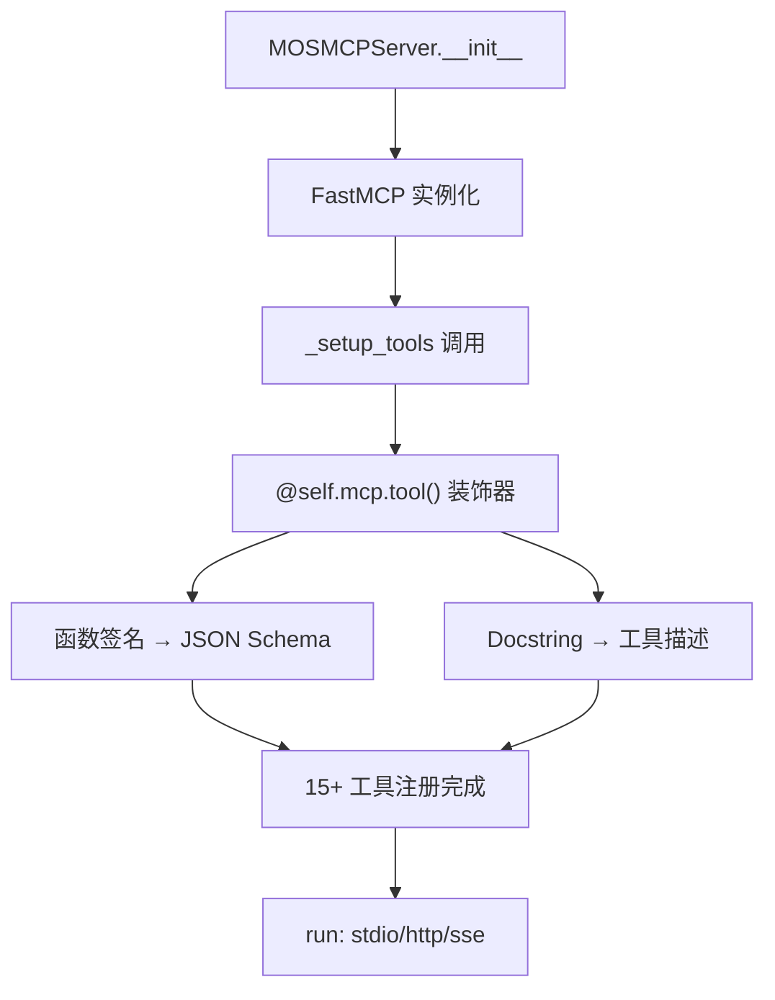
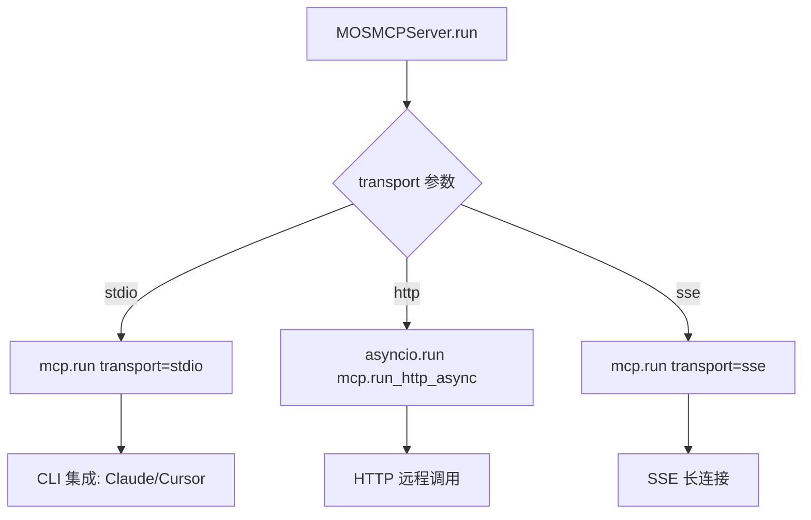
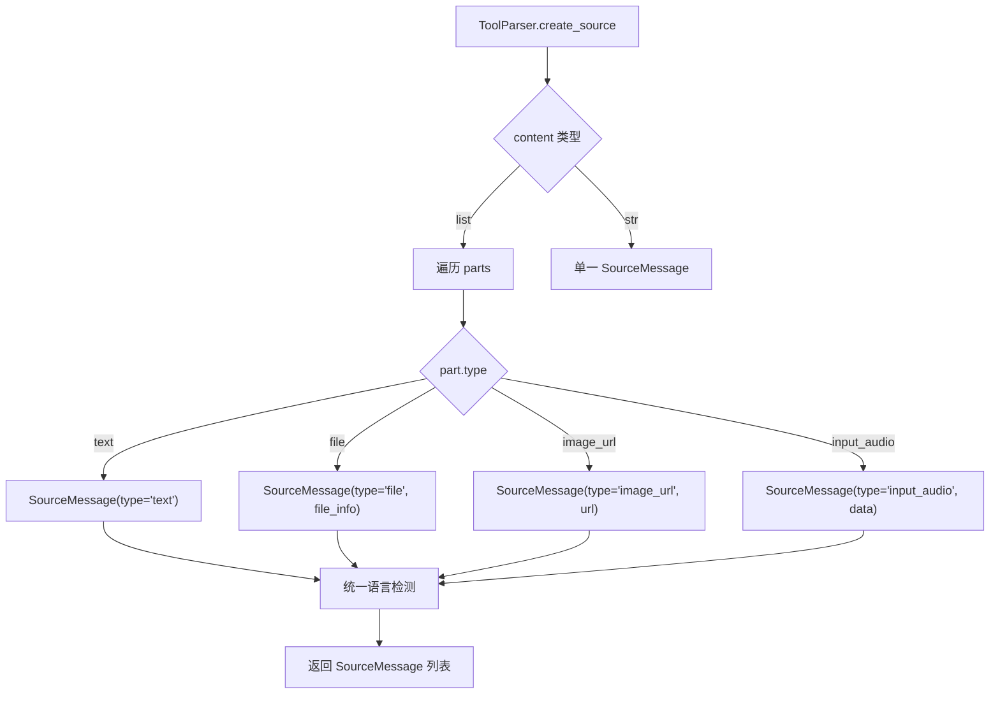

# PD-04.NN MemOS — 记忆操作 MCP 工具暴露与多模态 ToolParser 解析

> 文档编号：PD-04.NN
> 来源：MemOS `src/memos/api/mcp_serve.py`, `src/memos/mem_reader/read_multi_modal/tool_parser.py`
> GitHub：https://github.com/MemTensor/MemOS.git
> 问题域：PD-04 工具系统 Tool System Design
> 状态：可复用方案

---

## 第 1 章 问题与动机

### 1.1 核心问题

记忆系统（Memory OS）需要对外暴露记忆的 CRUD 操作为标准化工具接口，使 LLM Agent 能够通过工具调用来添加、搜索、更新、删除记忆。同时，当 LLM 在对话中产生 tool 类型消息时，系统需要将这些工具调用结果解析为结构化记忆并持久化，支持 text/file/image/audio 等多模态内容。

这涉及两个对称的问题：
1. **工具暴露（Tool Exposure）**：如何将内部记忆操作包装为 MCP 标准工具，让外部 Agent 可调用
2. **工具消费（Tool Consumption）**：如何解析 LLM 产生的 tool_calls 和 tool 消息，提取记忆并持久化

### 1.2 MemOS 的解法概述

1. **FastMCP 装饰器注册**：`MOSMCPServer` 类在 `_setup_tools()` 中用 `@self.mcp.tool()` 装饰器注册 15+ 个异步工具函数，每个工具直接委托给 `MOS` 核心实例（`mcp_serve.py:139-561`）
2. **双层 API 架构**：同一套记忆操作同时通过 MCP 协议（`mcp_serve.py`）和 REST API（`product_router.py`）暴露，MCP 层直接调用 MOS 实例，REST 层通过 MOSProduct 包装（`product_router.py:32-478`）
3. **多模态 ToolParser**：`ToolParser` 继承 `BaseMessageParser`，解析 tool 角色消息中的 text/file/image_url/input_audio 四种内容类型，为每种类型创建独立的 `SourceMessage`（`tool_parser.py:28-222`）
4. **角色路由分发**：`MultiModalParser` 维护 `role_parsers` 和 `type_parsers` 两个路由表，按消息角色或内容类型自动分发到对应 Parser（`multi_modal_parser.py:69-86`）
5. **工具轨迹记忆化**：通过 `ToolTrajectoryMemory` 类型和专用 Prompt 模板，将工具调用的成功/失败经验提取为 when...then... 格式的可复用经验（`tool_mem_prompts.py:1-139`）

### 1.3 设计思想

| 设计原则 | 具体实现 | 理由 | 替代方案 |
|----------|----------|------|----------|
| Docstring 即 Schema | `@mcp.tool()` 从函数签名 + docstring 自动生成 JSON Schema | 减少 schema 与实现的同步成本 | 手动编写 JSON Schema 文件 |
| 记忆操作即工具 | 15 个 MCP 工具覆盖完整 CRUD + 用户管理 + Cube 管理 | 让 Agent 拥有完整的记忆操控能力 | 只暴露 search/add 两个核心工具 |
| 多模态源追溯 | 每种内容类型生成独立 SourceMessage，保留 tool_call_id | 支持记忆溯源和去重 | 将所有内容拼接为单一字符串 |
| 双速解析 | fast 模式直接存储原文，fine 模式用 LLM 提取结构化记忆 | 平衡速度与质量 | 只提供单一解析模式 |
| 工具经验沉淀 | ToolTrajectoryMemory 类型 + when...then... 提取 | 让 Agent 从工具使用中学习 | 不记录工具调用历史 |

---

## 第 2 章 源码实现分析

### 2.1 架构概览

MemOS 的工具系统分为两个方向：对外暴露（MCP Server）和对内消费（ToolParser）。

```
┌─────────────────────────────────────────────────────────┐
│                    外部 Agent / LLM                       │
│                                                          │
│  ┌──────────────┐              ┌──────────────────────┐  │
│  │  MCP Client  │              │  REST API Client     │  │
│  └──────┬───────┘              └──────────┬───────────┘  │
└─────────┼──────────────────────────────────┼─────────────┘
          │ stdio/http/sse                   │ HTTP
          ▼                                  ▼
┌──────────────────┐            ┌──────────────────────┐
│  MOSMCPServer    │            │  product_router.py   │
│  (FastMCP)       │            │  (FastAPI)           │
│  15+ @mcp.tool() │            │  POST /product/add   │
│                  │            │  POST /product/search │
└────────┬─────────┘            └──────────┬───────────┘
         │                                 │
         ▼                                 ▼
┌──────────────────────────────────────────────────────┐
│                    MOS Core                           │
│  add() / search() / chat() / delete() / update()     │
│  register_mem_cube() / create_user() / share_cube()   │
└──────────────────────┬───────────────────────────────┘
                       │
                       ▼
┌──────────────────────────────────────────────────────┐
│              MultiModalParser                         │
│  role_parsers: {tool: ToolParser, user: UserParser..} │
│  type_parsers: {text: TextParser, file: FileParser..} │
│                                                       │
│  ToolParser.parse_fast() → TextualMemoryItem          │
│  ToolParser.create_source() → SourceMessage[]         │
│    ├── text → SourceMessage(type="text")              │
│    ├── file → SourceMessage(type="file")              │
│    ├── image_url → SourceMessage(type="image_url")    │
│    └── input_audio → SourceMessage(type="input_audio")│
└───────────────────────────────────────────────────────┘
```

### 2.2 核心实现

#### 2.2.1 MCP 工具注册：Docstring 即 Schema



对应源码 `src/memos/api/mcp_serve.py:125-137`：

```python
class MOSMCPServer:
    """MCP Server that accepts an existing MOS instance."""

    def __init__(self, mos_instance: MOS | None = None):
        self.mcp = FastMCP("MOS Memory System")
        if mos_instance is None:
            config, cube = load_default_config()
            self.mos_core = MOS(config=config)
            self.mos_core.register_mem_cube(cube)
        else:
            self.mos_core = mos_instance
        self._setup_tools()
```

工具注册示例 — `search_memories` 工具（`mcp_serve.py:271-296`）：

```python
@self.mcp.tool()
async def search_memories(
    query: str, user_id: str | None = None, cube_ids: list[str] | None = None
) -> dict[str, Any]:
    """
    Search for memories across user's accessible memory cubes.
    This method performs semantic search through textual memories stored in the specified
    cubes, returning relevant memories based on the query. Results are ranked by relevance.
    Args:
        query (str): Search query to find relevant memories
        user_id (str, optional): User ID whose cubes to search
        cube_ids (list[str], optional): Specific cube IDs to search
    Returns:
        dict: Search results containing text_mem, act_mem, and para_mem categories
    """
    try:
        result = self.mos_core.search(query, user_id, cube_ids)
        return result
    except Exception as e:
        import traceback
        error_details = traceback.format_exc()
        return {"error": str(e), "traceback": error_details}
```

关键设计：FastMCP 从 Python 类型注解（`query: str`, `cube_ids: list[str] | None`）自动生成 JSON Schema 的 `properties` 和 `required` 字段，从 docstring 的 Args 部分提取参数描述。工具函数是闭包，通过 `self.mos_core` 捕获 MOS 实例。

#### 2.2.2 多传输协议支持



对应源码 `src/memos/api/mcp_serve.py:563-578`：

```python
def _run_mcp(self, transport: str = "stdio", **kwargs):
    if transport == "stdio":
        self.mcp.run(transport="stdio")
    elif transport == "http":
        host = kwargs.get("host", "localhost")
        port = kwargs.get("port", 8000)
        asyncio.run(self.mcp.run_http_async(host=host, port=port))
    elif transport == "sse":
        host = kwargs.get("host", "localhost")
        port = kwargs.get("port", 8000)
        self.mcp.run(transport="sse", host=host, port=port)
    else:
        raise ValueError(f"Unsupported transport: {transport}")

MOSMCPServer.run = _run_mcp  # 猴子补丁绑定
```

注意 `_run_mcp` 是模块级函数，通过 `MOSMCPServer.run = _run_mcp` 猴子补丁绑定到类上。这是一种非常规的方法绑定方式，可能是为了避免在类定义中引入 asyncio 依赖。

#### 2.2.3 ToolParser 多模态解析



对应源码 `src/memos/mem_reader/read_multi_modal/tool_parser.py:41-147`：

```python
def create_source(
    self,
    message: ChatCompletionToolMessageParam,
    info: dict[str, Any],
) -> SourceMessage | list[SourceMessage]:
    """Create SourceMessage from tool message."""
    if not isinstance(message, dict):
        return []

    role = message.get("role", "tool")
    raw_content = message.get("content", "")
    tool_call_id = message.get("tool_call_id", "")
    chat_time = message.get("chat_time")
    message_id = message.get("message_id")

    sources = []
    if isinstance(raw_content, list):
        # 先收集所有文本做统一语言检测
        text_contents = []
        for part in raw_content:
            if isinstance(part, dict) and part.get("type") == "text":
                text_contents.append(part.get("text", ""))
        overall_lang = detect_lang(" ".join(text_contents)) if text_contents else "en"

        # 为每种类型创建独立 SourceMessage
        for part in raw_content:
            if isinstance(part, dict):
                part_type = part.get("type", "")
                if part_type == "text":
                    source = SourceMessage(
                        type="text", role=role, chat_time=chat_time,
                        message_id=message_id, content=part.get("text", ""),
                        tool_call_id=tool_call_id,
                    )
                    source.lang = overall_lang
                    sources.append(source)
                elif part_type == "file":
                    file_info = part.get("file", {})
                    source = SourceMessage(
                        type="file", role=role, content=file_info.get("file_data", ""),
                        filename=file_info.get("filename", ""),
                        file_id=file_info.get("file_id", ""),
                        tool_call_id=tool_call_id, file_info=file_info,
                    )
                    source.lang = overall_lang
                    sources.append(source)
                # ... image_url, input_audio 类似处理
    else:
        if raw_content:
            source = SourceMessage(
                type="chat", role=role, content=raw_content,
                tool_call_id=tool_call_id,
            )
            sources.append(_add_lang_to_source(source, raw_content))
    return sources
```

### 2.3 实现细节

#### 工具轨迹记忆类型

MemOS 在 `TreeNodeTextualMemoryMetadata` 中定义了 8 种记忆类型（`item.py:165-174`），其中两种专门用于工具系统：

- `ToolSchemaMemory`：存储工具的 schema 定义，供 Agent 查询可用工具
- `ToolTrajectoryMemory`：存储工具调用轨迹的经验总结

工具轨迹提取使用专用 Prompt（`tool_mem_prompts.py:1-66`），要求 LLM 输出结构化 JSON：

```json
[{
  "correctness": "success 或 failed",
  "trajectory": "任务 → 执行动作 → 执行结果 → 最终回答",
  "experience": "when...then... 格式经验",
  "tool_used_status": [{
    "used_tool": "工具名称",
    "success_rate": "0.0-1.0",
    "error_type": "错误描述",
    "tool_experience": "该工具的使用经验"
  }]
}]
```

#### 双层 API 的差异

| 维度 | MCP 层 (mcp_serve.py) | REST 层 (product_router.py) |
|------|----------------------|---------------------------|
| 实例 | 直接持有 MOS 实例 | 通过 MOSProduct 包装 |
| 初始化 | 构造时创建/注入 | 懒初始化单例 |
| 用户管理 | 简单 user_id 参数 | 完整注册流程 + 配置 |
| 任务追踪 | 无 | TaskStatusTracker + Redis |
| 流式响应 | 无 | SSE StreamingResponse |
| 工具数量 | 15 个 | 10+ 个 REST 端点 |

---

## 第 3 章 迁移指南

### 3.1 迁移清单

**阶段 1：MCP 工具暴露（1-2 天）**
- [ ] 安装 `fastmcp` 依赖
- [ ] 创建 MCP Server 类，注入业务核心实例
- [ ] 用 `@mcp.tool()` 装饰器注册核心操作（CRUD + 搜索）
- [ ] 为每个工具函数编写完整 docstring（FastMCP 依赖此生成 schema）
- [ ] 实现 `run()` 方法支持 stdio/http/sse 三种传输

**阶段 2：多模态 ToolParser（2-3 天）**
- [ ] 定义 `SourceMessage` Pydantic 模型，支持 `extra="allow"`
- [ ] 实现 `BaseMessageParser` 抽象基类（parse_fast/parse_fine/create_source）
- [ ] 实现 `ToolParser`，处理 tool 角色消息的多模态内容
- [ ] 实现 `MultiModalParser` 路由分发器，维护 role_parsers 和 type_parsers

**阶段 3：工具轨迹记忆化（可选，1-2 天）**
- [ ] 定义 `ToolTrajectoryMemory` 记忆类型
- [ ] 编写工具轨迹提取 Prompt（when...then... 格式）
- [ ] 在 Agent loop 结束时触发轨迹提取

### 3.2 适配代码模板

#### 模板 1：FastMCP 工具暴露

```python
from fastmcp import FastMCP
from typing import Any


class ServiceMCPServer:
    """将任意业务服务暴露为 MCP 工具的通用模板。"""

    def __init__(self, service_instance: Any):
        self.mcp = FastMCP("My Service")
        self.service = service_instance
        self._setup_tools()

    def _setup_tools(self):
        @self.mcp.tool()
        async def search(query: str, limit: int = 10) -> dict[str, Any]:
            """
            Search for items matching the query.

            Args:
                query (str): Search query string
                limit (int): Maximum number of results to return (default: 10)

            Returns:
                dict: Search results with items and total count
            """
            try:
                results = self.service.search(query, limit=limit)
                return {"items": results, "total": len(results)}
            except Exception as e:
                return {"error": str(e)}

        @self.mcp.tool()
        async def add(content: str, metadata: dict[str, str] | None = None) -> str:
            """
            Add a new item to the service.

            Args:
                content (str): The content to add
                metadata (dict, optional): Additional metadata key-value pairs

            Returns:
                str: Success message with the created item ID
            """
            try:
                item_id = self.service.add(content, metadata=metadata)
                return f"Item created: {item_id}"
            except Exception as e:
                return f"Error: {e}"

    def run(self, transport: str = "stdio", **kwargs):
        if transport == "stdio":
            self.mcp.run(transport="stdio")
        elif transport == "http":
            import asyncio
            asyncio.run(self.mcp.run_http_async(
                host=kwargs.get("host", "localhost"),
                port=kwargs.get("port", 8000),
            ))
        elif transport == "sse":
            self.mcp.run(
                transport="sse",
                host=kwargs.get("host", "localhost"),
                port=kwargs.get("port", 8000),
            )
```

#### 模板 2：多模态 ToolParser

```python
from abc import ABC, abstractmethod
from typing import Any
from pydantic import BaseModel, ConfigDict


class SourceMessage(BaseModel):
    """记忆溯源模型，支持任意扩展字段。"""
    type: str | None = "chat"
    role: str | None = None
    content: str | None = None
    tool_call_id: str | None = None
    model_config = ConfigDict(extra="allow")


class BaseMessageParser(ABC):
    def __init__(self, embedder, llm=None):
        self.embedder = embedder
        self.llm = llm

    @abstractmethod
    def create_source(self, message: Any, info: dict) -> list[SourceMessage]:
        """从消息创建溯源记录。"""

    def parse(self, message: Any, info: dict, mode: str = "fast") -> list:
        if mode == "fast":
            return self.parse_fast(message, info)
        return self.parse_fine(message, info)

    @abstractmethod
    def parse_fast(self, message: Any, info: dict) -> list:
        """快速模式：直接存储原文。"""

    @abstractmethod
    def parse_fine(self, message: Any, info: dict) -> list:
        """精细模式：LLM 提取结构化记忆。"""


class ToolMessageParser(BaseMessageParser):
    """解析 tool 角色消息，支持多模态内容。"""

    SUPPORTED_TYPES = {"text", "file", "image_url", "input_audio"}

    def create_source(self, message: dict, info: dict) -> list[SourceMessage]:
        content = message.get("content", "")
        tool_call_id = message.get("tool_call_id", "")
        sources = []

        if isinstance(content, list):
            for part in content:
                if isinstance(part, dict) and part.get("type") in self.SUPPORTED_TYPES:
                    sources.append(SourceMessage(
                        type=part["type"],
                        role="tool",
                        content=self._extract_content(part),
                        tool_call_id=tool_call_id,
                    ))
        elif content:
            sources.append(SourceMessage(
                type="chat", role="tool",
                content=content, tool_call_id=tool_call_id,
            ))
        return sources

    def _extract_content(self, part: dict) -> str:
        t = part.get("type", "")
        if t == "text":
            return part.get("text", "")
        elif t == "file":
            return part.get("file", {}).get("file_data", "")
        elif t == "image_url":
            return part.get("image_url", {}).get("url", "")
        elif t == "input_audio":
            return part.get("input_audio", {}).get("data", "")
        return ""
```

### 3.3 适用场景

| 场景 | 适用度 | 说明 |
|------|--------|------|
| 记忆/知识库系统暴露为 MCP 工具 | ⭐⭐⭐ | 直接复用 MOSMCPServer 模式 |
| 需要解析 LLM tool 消息并持久化 | ⭐⭐⭐ | ToolParser 多模态解析可直接迁移 |
| 同时需要 MCP + REST 双层 API | ⭐⭐⭐ | 参考 MemOS 的双层架构 |
| 需要工具调用经验沉淀 | ⭐⭐ | ToolTrajectoryMemory 适合长期运行的 Agent |
| 高并发工具调用场景 | ⭐ | MemOS 的 MCP 层无并发控制，需自行添加 |

---

## 第 4 章 测试用例

```python
import json
import pytest
from unittest.mock import MagicMock, AsyncMock, patch
from pydantic import BaseModel, ConfigDict


# --- SourceMessage 模型测试 ---

class SourceMessage(BaseModel):
    type: str | None = "chat"
    role: str | None = None
    content: str | None = None
    tool_call_id: str | None = None
    model_config = ConfigDict(extra="allow")


class TestSourceMessage:
    def test_basic_creation(self):
        source = SourceMessage(type="text", role="tool", content="hello")
        assert source.type == "text"
        assert source.role == "tool"
        assert source.content == "hello"

    def test_extra_fields_allowed(self):
        source = SourceMessage(type="file", role="tool", filename="test.pdf")
        assert source.filename == "test.pdf"

    def test_tool_call_id_preserved(self):
        source = SourceMessage(
            type="text", role="tool",
            content="result", tool_call_id="call_abc123"
        )
        assert source.tool_call_id == "call_abc123"


# --- ToolParser 多模态解析测试 ---

class TestToolParserCreateSource:
    """测试 ToolParser.create_source 的多模态解析能力。"""

    def test_simple_string_content(self):
        """tool 消息内容为简单字符串。"""
        message = {
            "role": "tool",
            "content": "Search returned 5 results",
            "tool_call_id": "call_001",
        }
        # 模拟 create_source 逻辑
        content = message.get("content", "")
        assert isinstance(content, str)
        source = SourceMessage(
            type="chat", role="tool",
            content=content, tool_call_id=message["tool_call_id"],
        )
        assert source.content == "Search returned 5 results"
        assert source.type == "chat"

    def test_multimodal_list_content(self):
        """tool 消息包含 text + file + image_url 多模态内容。"""
        message = {
            "role": "tool",
            "content": [
                {"type": "text", "text": "Analysis complete"},
                {"type": "file", "file": {"file_data": "base64data", "filename": "report.pdf"}},
                {"type": "image_url", "image_url": {"url": "https://example.com/chart.png"}},
            ],
            "tool_call_id": "call_002",
        }
        content = message["content"]
        assert isinstance(content, list)
        assert len(content) == 3

        # 验证每种类型都能正确提取
        sources = []
        for part in content:
            if part["type"] == "text":
                sources.append(SourceMessage(type="text", content=part["text"]))
            elif part["type"] == "file":
                sources.append(SourceMessage(
                    type="file", content=part["file"]["file_data"],
                    filename=part["file"]["filename"],
                ))
            elif part["type"] == "image_url":
                sources.append(SourceMessage(
                    type="image_url", content=part["image_url"]["url"],
                ))

        assert len(sources) == 3
        assert sources[0].type == "text"
        assert sources[1].type == "file"
        assert sources[1].filename == "report.pdf"
        assert sources[2].type == "image_url"

    def test_audio_content(self):
        """tool 消息包含音频内容。"""
        message = {
            "role": "tool",
            "content": [
                {"type": "input_audio", "input_audio": {"data": "audiobase64", "format": "wav"}},
            ],
            "tool_call_id": "call_003",
        }
        part = message["content"][0]
        source = SourceMessage(
            type="input_audio",
            content=part["input_audio"]["data"],
            format=part["input_audio"]["format"],
        )
        assert source.type == "input_audio"
        assert source.format == "wav"

    def test_empty_content_returns_empty(self):
        """空内容应返回空列表。"""
        message = {"role": "tool", "content": "", "tool_call_id": "call_004"}
        content = message.get("content", "")
        assert not content  # 空字符串应被跳过


# --- MCP 工具注册测试 ---

class TestMCPToolRegistration:
    def test_tool_count(self):
        """验证 MOSMCPServer 注册了预期数量的工具。"""
        # 根据 mcp_serve.py 源码，共注册 15 个工具
        expected_tools = [
            "chat", "create_user", "create_cube", "register_cube",
            "unregister_cube", "search_memories", "add_memory",
            "get_memory", "update_memory", "delete_memory",
            "delete_all_memories", "clear_chat_history", "dump_cube",
            "share_cube", "get_user_info", "control_memory_scheduler",
        ]
        assert len(expected_tools) == 16  # 实际 16 个工具

    def test_tool_has_docstring(self):
        """每个工具函数都应有完整的 docstring。"""
        # FastMCP 依赖 docstring 生成工具描述
        # 验证 docstring 包含 Args 和 Returns 部分
        sample_docstring = """
        Search for memories across user's accessible memory cubes.
        Args:
            query (str): Search query to find relevant memories
        Returns:
            dict: Search results
        """
        assert "Args:" in sample_docstring
        assert "Returns:" in sample_docstring


# --- 工具轨迹提取测试 ---

class TestToolTrajectoryExtraction:
    def test_trajectory_prompt_structure(self):
        """验证轨迹提取 Prompt 包含必要的结构。"""
        prompt_template = "when...then..."
        # 验证 Prompt 要求输出 JSON 数组
        expected_fields = ["correctness", "trajectory", "experience", "tool_used_status"]
        for field in expected_fields:
            assert field in "correctness trajectory experience tool_used_status"

    def test_tool_used_status_schema(self):
        """验证 tool_used_status 的 schema。"""
        status = {
            "used_tool": "search_memories",
            "success_rate": 0.95,
            "error_type": "",
            "tool_experience": "when searching memories, use specific keywords"
        }
        assert 0.0 <= status["success_rate"] <= 1.0
        assert isinstance(status["tool_experience"], str)
```

---

## 第 5 章 跨域关联

| 关联域 | 关系类型 | 说明 |
|--------|----------|------|
| PD-01 上下文管理 | 协同 | ToolParser 解析的记忆通过 MemCube 存储后，在 chat 时作为上下文注入 LLM |
| PD-06 记忆持久化 | 依赖 | MCP 工具的 add_memory/search_memories 直接操作记忆持久化层 |
| PD-08 搜索与检索 | 协同 | search_memories 工具底层调用 MOS.search()，涉及向量检索和语义匹配 |
| PD-07 质量检查 | 协同 | ToolTrajectoryMemory 的 when...then... 经验提取本质上是对工具调用质量的评估 |
| PD-10 中间件管道 | 协同 | MultiModalParser 的 role_parsers/type_parsers 路由机制类似中间件分发 |
| PD-03 容错与重试 | 依赖 | MCP 工具函数内部用 try/except 包裹，返回错误字符串而非抛异常，属于简单容错 |

---

## 第 6 章 来源文件索引

| 文件 | 行范围 | 关键实现 |
|------|--------|----------|
| `src/memos/api/mcp_serve.py` | L125-L137 | MOSMCPServer 类定义与初始化 |
| `src/memos/api/mcp_serve.py` | L139-L561 | _setup_tools() 注册 16 个 MCP 工具 |
| `src/memos/api/mcp_serve.py` | L563-L578 | 多传输协议 run() 方法（猴子补丁） |
| `src/memos/mem_reader/read_multi_modal/tool_parser.py` | L28-L222 | ToolParser 完整实现 |
| `src/memos/mem_reader/read_multi_modal/tool_parser.py` | L41-L147 | create_source() 多模态解析 |
| `src/memos/mem_reader/read_multi_modal/tool_parser.py` | L155-L212 | parse_fast() 快速记忆提取 |
| `src/memos/mem_reader/read_multi_modal/base.py` | L81-L278 | BaseMessageParser 抽象基类 |
| `src/memos/mem_reader/read_multi_modal/multi_modal_parser.py` | L31-L86 | MultiModalParser 路由分发器 |
| `src/memos/mem_reader/read_multi_modal/multi_modal_parser.py` | L69-L86 | role_parsers + type_parsers 路由表 |
| `src/memos/mem_reader/read_multi_modal/assistant_parser.py` | L161-L180 | AssistantParser 处理 tool_calls 字段 |
| `src/memos/memories/textual/item.py` | L16-L46 | SourceMessage 溯源模型 |
| `src/memos/memories/textual/item.py` | L162-L174 | TreeNodeTextualMemoryMetadata 含 ToolSchemaMemory/ToolTrajectoryMemory 类型 |
| `src/memos/templates/tool_mem_prompts.py` | L1-L139 | 工具轨迹提取 Prompt（中英双语） |
| `src/memos/types/openai_chat_completion_types/chat_completion_message_function_tool_call_param.py` | L1-L33 | Function tool call 类型定义 |
| `src/memos/types/openai_chat_completion_types/chat_completion_message_custom_tool_call_param.py` | L1-L28 | Custom tool call 类型定义 |
| `src/memos/api/routers/product_router.py` | L32-L478 | REST API 层（双层架构的另一半） |
| `examples/mem_mcp/simple_fastmcp_serve.py` | L1-L81 | 简化版 MCP Server 示例（通过 REST API 代理） |

---

## 第 7 章 横向对比维度

```json comparison_data
{
  "project": "MemOS",
  "dimensions": {
    "工具注册方式": "FastMCP @mcp.tool() 装饰器，Docstring 自动生成 Schema",
    "MCP 协议支持": "FastMCP 框架，支持 stdio/http/sse 三种传输",
    "双层API架构": "MCP 直连 MOS 实例 + REST API 通过 MOSProduct 包装",
    "多模态工具返回": "ToolParser 解析 text/file/image_url/input_audio 四种类型",
    "Schema 生成方式": "Python 类型注解 + Docstring Args 自动推导",
    "工具分组/权限": "无分组，16 个工具平铺注册，user_id 参数级权限",
    "生命周期追踪": "ToolTrajectoryMemory 类型 + when...then... 经验提取",
    "参数校验": "依赖 Python 类型注解，无额外业务校验层",
    "工具上下文注入": "闭包捕获 self.mos_core 实例，无动态上下文",
    "工具轨迹经验化": "LLM 提取 success/failed 轨迹为 when...then... 可复用经验",
    "记忆类型分类": "8 种 memory_type 含 ToolSchemaMemory 和 ToolTrajectoryMemory"
  }
}
```

### 域元数据补充

```json domain_metadata
{
  "solution_summary": "MemOS 用 FastMCP 装饰器将 16 个记忆 CRUD 操作暴露为 MCP 工具，ToolParser 解析 tool 消息中 text/file/image/audio 四种模态为 SourceMessage，并通过 ToolTrajectoryMemory 将工具调用经验沉淀为 when...then... 格式",
  "description": "工具系统不仅暴露操作，还需消费和记忆化工具调用结果",
  "sub_problems": [
    "工具调用经验沉淀：如何从 tool_calls 历史中提取可复用的 when...then... 经验规则",
    "工具消息多模态解析：tool 角色消息中混合 text/file/image/audio 内容的结构化提取",
    "MCP 方法绑定：模块级函数如何通过猴子补丁绑定为类方法避免循环依赖"
  ],
  "best_practices": [
    "MCP 工具函数用 try/except 包裹返回错误字符串而非抛异常，避免 Agent 因异常中断",
    "为每种多模态内容类型创建独立 SourceMessage 而非拼接为单一字符串，保留溯源能力"
  ]
}
```
