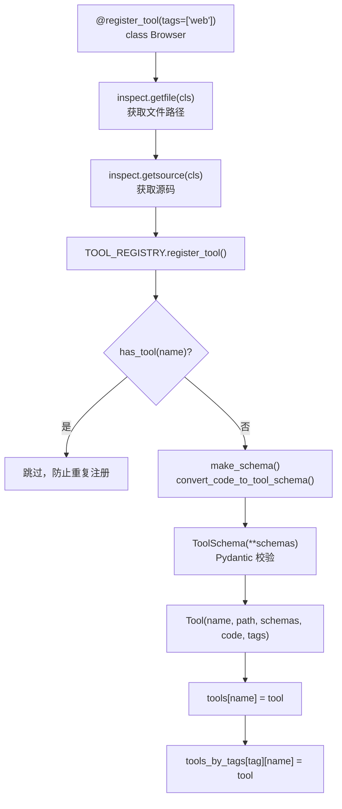
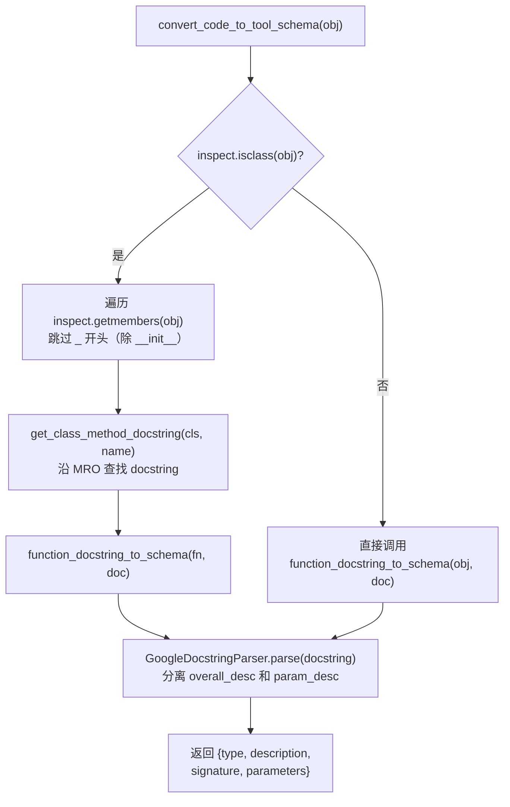
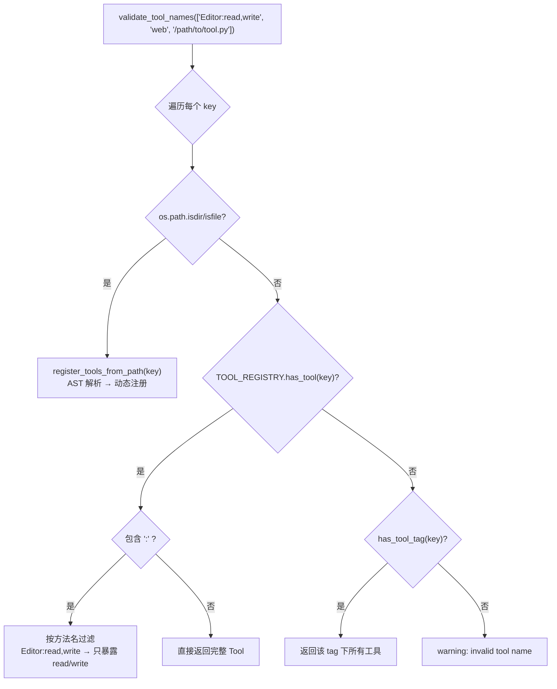
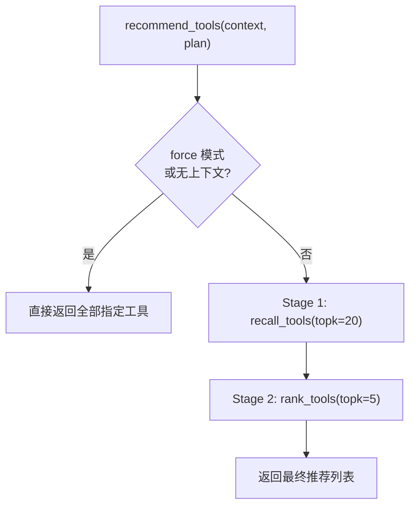

# PD-04.06 MetaGPT — 装饰器驱动工具注册与两阶段推荐系统

> 文档编号：PD-04.06
> 来源：MetaGPT `metagpt/tools/tool_registry.py`, `metagpt/tools/tool_recommend.py`, `metagpt/tools/tool_convert.py`
> GitHub：https://github.com/FoundationAgents/MetaGPT.git
> 问题域：PD-04 工具系统 Tool System Design
> 状态：可复用方案

---

## 第 1 章 问题与动机（≥ 30 行）

### 1.1 核心问题

Agent 系统需要一个工具管理层来解决三个核心问题：

1. **工具注册**：如何让开发者以最低成本将 Python 类/函数注册为 Agent 可调用的工具？传统方式需要手写 JSON Schema，维护成本高且容易与代码不同步。
2. **工具发现与推荐**：当工具数量达到数十个时，LLM 的选择准确率会下降。如何从大量工具中为当前任务精准推荐最相关的子集？
3. **工具执行调度**：LLM 输出的工具调用指令如何安全地映射到实际的 Python 函数执行？

MetaGPT 面对的场景尤其复杂——它同时支持数据分析（DataInterpreter）和通用 Agent（RoleZero）两种角色，前者需要按任务类型匹配工具（数据预处理、特征工程），后者需要从全量工具中动态推荐。

### 1.2 MetaGPT 的解法概述

MetaGPT 构建了一套 **装饰器驱动 + 两阶段推荐** 的工具系统：

1. **`@register_tool` 装饰器**：一行代码完成注册，自动从 docstring 提取 schema（`tool_registry.py:94-118`）
2. **全局单例 `TOOL_REGISTRY`**：支持按 name/tag/path 三种方式查找工具（`tool_registry.py:27-91`）
3. **两阶段推荐**：Recall（BM25/类型匹配）→ Rank（LLM 精排），控制注入 prompt 的工具数量（`tool_recommend.py:54-170`）
4. **Docstring-as-Schema**：Google 风格 docstring 自动转换为工具描述，无需手写 JSON Schema（`tool_convert.py:9-28`）
5. **执行映射表**：`tool_execution_map` 将 `"ClassName.method"` 字符串映射到实际 callable（`role_zero.py:119-171`）

### 1.3 设计思想

| 设计原则 | 具体实现 | 理由 | 替代方案 |
|----------|----------|------|----------|
| 零配置注册 | `@register_tool` 装饰器自动提取源码和 docstring | 消除手写 schema 的维护负担 | 手写 YAML/JSON schema 文件 |
| Docstring 即契约 | Google-style docstring → schema 自动转换 | 代码和文档天然同步 | OpenAPI spec 独立维护 |
| 两阶段推荐 | BM25 召回 → LLM 精排 | 大工具集下控制 prompt token 消耗 | 全量注入 / 纯向量检索 |
| 三路查找 | name / tag / file path 统一入口 | 适配不同使用场景（精确/分类/动态） | 仅按名称查找 |
| 导入即注册 | `libs/__init__.py` 导入触发装饰器 | 无需显式注册步骤 | 启动时扫描目录 |

---

## 第 2 章 源码实现分析（≥ 60 行，核心章节）

### 2.1 架构概览

MetaGPT 工具系统由四层组成：注册层、存储层、推荐层、执行层。

```
┌─────────────────────────────────────────────────────────────┐
│                      执行层 (RoleZero)                       │
│  tool_execution_map: {"Editor.write": editor.write, ...}    │
│  _run_commands() → inspect.iscoroutinefunction → dispatch   │
├─────────────────────────────────────────────────────────────┤
│                    推荐层 (ToolRecommender)                   │
│  ┌──────────────┐    ┌──────────────┐    ┌──────────────┐   │
│  │ TypeMatch    │    │ BM25Okapi    │    │ Embedding    │   │
│  │ (tag精确匹配) │    │ (文本相似度)  │    │ (向量,未实现) │   │
│  └──────┬───────┘    └──────┬───────┘    └──────────────┘   │
│         └────────┬──────────┘                                │
│              Recall → LLM Rank → Top-K                       │
├─────────────────────────────────────────────────────────────┤
│                    存储层 (ToolRegistry)                      │
│  tools: {name: Tool}    tools_by_tags: {tag: {name: Tool}}  │
├─────────────────────────────────────────────────────────────┤
│                    注册层 (Decorators + AST)                  │
│  @register_tool ──→ inspect.getdoc() ──→ schema             │
│  register_tools_from_path() ──→ AST parse ──→ schema        │
└─────────────────────────────────────────────────────────────┘
```

### 2.2 核心实现

#### 2.2.1 装饰器注册流程



对应源码 `metagpt/tools/tool_registry.py:94-118`：

```python
def register_tool(tags: list[str] = None, schema_path: str = "", **kwargs):
    """register a tool to registry"""
    def decorator(cls):
        # Get the file path where the function / class is defined and the source code
        file_path = inspect.getfile(cls)
        if "metagpt" in file_path:
            file_path = "metagpt" + file_path.split("metagpt")[-1]
        source_code = ""
        with contextlib.suppress(OSError):
            source_code = inspect.getsource(cls)

        TOOL_REGISTRY.register_tool(
            tool_name=cls.__name__,
            tool_path=file_path,
            schema_path=schema_path,
            tool_code=source_code,
            tags=tags,
            tool_source_object=cls,
            **kwargs,
        )
        return cls
    return decorator
```

注册方法 `metagpt/tools/tool_registry.py:31-69`：

```python
def register_tool(self, tool_name: str, tool_path: str, schemas: dict = None,
                  schema_path: str = "", tool_code: str = "", tags: list[str] = None,
                  tool_source_object=None, include_functions: list[str] = None, verbose: bool = False):
    if self.has_tool(tool_name):
        return  # 幂等：已注册则跳过

    schema_path = schema_path or TOOL_SCHEMA_PATH / f"{tool_name}.yml"
    if not schemas:
        schemas = make_schema(tool_source_object, include_functions, schema_path)
    if not schemas:
        return

    schemas["tool_path"] = tool_path
    try:
        ToolSchema(**schemas)  # Pydantic 校验（软校验，失败不阻断）
    except Exception:
        pass

    tags = tags or []
    tool = Tool(name=tool_name, path=tool_path, schemas=schemas, code=tool_code, tags=tags)
    self.tools[tool_name] = tool
    for tag in tags:
        self.tools_by_tags[tag].update({tool_name: tool})
```

#### 2.2.2 Docstring → Schema 转换



对应源码 `metagpt/tools/tool_convert.py:41-65`：

```python
def function_docstring_to_schema(fn_obj, docstring="") -> dict:
    signature = inspect.signature(fn_obj)
    docstring = remove_spaces(docstring)
    overall_desc, param_desc = PARSER.parse(docstring)
    function_type = "function" if not inspect.iscoroutinefunction(fn_obj) else "async_function"
    return {
        "type": function_type,
        "description": overall_desc,
        "signature": str(signature),
        "parameters": param_desc,
    }
```

关键设计：schema 不使用 JSON Schema 标准格式，而是保留 docstring 的自然语言描述 + Python 签名字符串。这对 LLM 更友好——LLM 理解自然语言描述比理解 JSON Schema 的 `{"type": "object", "properties": {...}}` 更准确。

#### 2.2.3 三路工具查找

`validate_tool_names()` (`tool_registry.py:131-163`) 实现了统一的三路查找：



#### 2.2.4 两阶段工具推荐



BM25 召回实现 (`tool_recommend.py:195-228`)：

```python
class BM25ToolRecommender(ToolRecommender):
    def _init_corpus(self):
        corpus = [f"{tool.name} {tool.tags}: {tool.schemas['description']}"
                  for tool in self.tools.values()]
        tokenized_corpus = [self._tokenize(doc) for doc in corpus]
        self.bm25 = BM25Okapi(tokenized_corpus)

    async def recall_tools(self, context="", plan=None, topk=20) -> list[Tool]:
        query = plan.current_task.instruction if plan else context
        query_tokens = self._tokenize(query)
        doc_scores = self.bm25.get_scores(query_tokens)
        top_indexes = np.argsort(doc_scores)[::-1][:topk]
        return [list(self.tools.values())[index] for index in top_indexes]
```

LLM 精排 (`tool_recommend.py:129-170`)：

```python
async def rank_tools(self, recalled_tools, context="", plan=None, topk=5):
    current_task = plan.current_task.instruction if plan else context
    available_tools = {tool.name: tool.schemas["description"] for tool in recalled_tools}
    prompt = TOOL_RECOMMENDATION_PROMPT.format(
        current_task=current_task, available_tools=available_tools, topk=topk)
    rsp = await LLM().aask(prompt, stream=False)
    # JSON 解析 + 修复（容错处理）
    try:
        ranked_tools = json.loads(repair_llm_raw_output(...))
    except json.JSONDecodeError:
        ranked_tools = await LLM().aask(msg=JSON_REPAIR_PROMPT.format(json_data=rsp))
    # dict 容错：LLM 可能返回 dict 而非 list
    if isinstance(ranked_tools, dict):
        ranked_tools = list(ranked_tools.values())[0]
    return list(valid_tools.values())[:topk]
```

### 2.3 实现细节

**导入即注册机制**：`metagpt/tools/__init__.py:9` 通过 `from metagpt.tools import libs` 触发 `libs/__init__.py` 中所有工具模块的导入，每个模块顶层的 `@register_tool` 装饰器在导入时自动执行注册。这是一种 side-effect 驱动的注册模式。

**方法级过滤**：`include_functions` 参数控制类工具只暴露指定方法。例如 `@register_tool(include_functions=["read", "write"])` 让 Editor 类只暴露 read 和 write 方法的 schema，避免内部方法污染工具列表。

**AST 双路径**：运行时注册用 `inspect` 反射（需要对象已加载），动态文件注册用 `ast.parse`（只需源码文本）。`CodeVisitor` 遍历 AST 提取类/函数定义，同时保留源码片段（`schemas["code"]`）供 LLM 参考。

**执行映射表** (`role_zero.py:119-171`)：RoleZero 在初始化时构建 `tool_execution_map`，将 `"Browser.click"` 等字符串映射到 `self.browser.click` 等实际方法。`_run_commands()` 遍历 LLM 输出的命令列表，通过 `inspect.iscoroutinefunction()` 判断同步/异步后调度执行。

---

## 第 3 章 迁移指南（≥ 40 行）

### 3.1 迁移清单

**阶段 1：工具注册基础设施**
- [ ] 实现 `Tool` 数据模型（name, path, schemas, code, tags）
- [ ] 实现 `ToolRegistry` 单例（tools dict + tools_by_tags 二级索引）
- [ ] 实现 `@register_tool` 装饰器（inspect 提取 + 自动注册）
- [ ] 实现 docstring → schema 转换（GoogleDocstringParser）

**阶段 2：工具发现与推荐**
- [ ] 实现 `validate_tool_names()` 三路查找（name/tag/path）
- [ ] 实现 `ToolRecommender` 基类（recall → rank 两阶段）
- [ ] 实现 `BM25ToolRecommender`（BM25Okapi 召回）
- [ ] 实现 LLM rank 精排（含 JSON 修复容错）

**阶段 3：工具执行调度**
- [ ] 构建 `tool_execution_map`（字符串 → callable 映射）
- [ ] 实现 `_run_commands()` 调度器（sync/async 自适应）
- [ ] 添加 special_tool_commands 和 exclusive_tool_commands 机制

### 3.2 适配代码模板

#### 最小可用工具注册系统

```python
"""minimal_tool_registry.py — 可直接运行的工具注册系统"""
from __future__ import annotations
import inspect
import re
from collections import defaultdict
from dataclasses import dataclass, field
from typing import Callable, Optional


@dataclass
class Tool:
    name: str
    path: str
    schemas: dict = field(default_factory=dict)
    code: str = ""
    tags: list[str] = field(default_factory=list)


class ToolRegistry:
    """全局工具注册表，单例模式"""
    def __init__(self):
        self.tools: dict[str, Tool] = {}
        self.tools_by_tags: dict[str, dict[str, Tool]] = defaultdict(dict)

    def register(self, tool_name: str, tool_path: str, schemas: dict,
                 code: str = "", tags: list[str] = None):
        if tool_name in self.tools:
            return  # 幂等
        tags = tags or []
        tool = Tool(name=tool_name, path=tool_path, schemas=schemas, code=code, tags=tags)
        self.tools[tool_name] = tool
        for tag in tags:
            self.tools_by_tags[tag][tool_name] = tool

    def get(self, name: str) -> Optional[Tool]:
        return self.tools.get(name)

    def get_by_tag(self, tag: str) -> dict[str, Tool]:
        return self.tools_by_tags.get(tag, {})

    def all_tools(self) -> dict[str, Tool]:
        return self.tools


REGISTRY = ToolRegistry()


def parse_google_docstring(docstring: str) -> tuple[str, str]:
    """解析 Google 风格 docstring，返回 (描述, 参数描述)"""
    if not docstring:
        return "", ""
    docstring = re.sub(r"\s+", " ", docstring).strip()
    if "Args:" in docstring:
        desc, params = docstring.split("Args:", 1)
        return desc.strip(), "Args:" + params
    return docstring, ""


def make_schema(obj, include: list[str] = None) -> dict:
    """从 Python 对象自动生成工具 schema"""
    docstring = inspect.getdoc(obj)
    if inspect.isclass(obj):
        desc, _ = parse_google_docstring(docstring)
        methods = {}
        for name, method in inspect.getmembers(obj, inspect.isfunction):
            if name.startswith("_") and name != "__init__":
                continue
            if include and name not in include:
                continue
            method_doc = inspect.getdoc(method) or ""
            overall, params = parse_google_docstring(method_doc)
            fn_type = "async_function" if inspect.iscoroutinefunction(method) else "function"
            methods[name] = {
                "type": fn_type,
                "description": overall,
                "signature": str(inspect.signature(method)),
                "parameters": params,
            }
        return {"type": "class", "description": desc, "methods": methods}
    elif inspect.isfunction(obj):
        overall, params = parse_google_docstring(docstring)
        fn_type = "async_function" if inspect.iscoroutinefunction(obj) else "function"
        return {
            "type": fn_type,
            "description": overall,
            "signature": str(inspect.signature(obj)),
            "parameters": params,
        }
    return {}


def register_tool(tags: list[str] = None, include_functions: list[str] = None, **kwargs):
    """装饰器：自动注册工具到全局注册表"""
    def decorator(cls):
        file_path = inspect.getfile(cls)
        schemas = make_schema(cls, include=include_functions)
        schemas["tool_path"] = file_path
        REGISTRY.register(
            tool_name=cls.__name__,
            tool_path=file_path,
            schemas=schemas,
            tags=tags or [],
        )
        return cls
    return decorator


# ---- 使用示例 ----
@register_tool(tags=["search"], include_functions=["search", "search_by_url"])
class WebSearcher:
    """A tool for searching the web using various search engines.

    Args:
        engine: The search engine to use (google, bing, duckduckgo).
    """
    def __init__(self, engine: str = "google"):
        self.engine = engine

    def search(self, query: str, num_results: int = 10) -> list[dict]:
        """Search the web for the given query.

        Args:
            query: The search query string.
            num_results: Maximum number of results to return.

        Returns:
            A list of search result dictionaries.
        """
        return [{"title": f"Result for {query}", "url": "https://example.com"}]

    def search_by_url(self, url: str) -> str:
        """Fetch and extract text content from a URL.

        Args:
            url: The URL to fetch content from.

        Returns:
            The extracted text content.
        """
        return f"Content from {url}"


if __name__ == "__main__":
    tool = REGISTRY.get("WebSearcher")
    print(f"Tool: {tool.name}")
    print(f"Tags: {tool.tags}")
    print(f"Methods: {list(tool.schemas.get('methods', {}).keys())}")
    print(f"Description: {tool.schemas['description']}")
```

### 3.3 适用场景

| 场景 | 适用度 | 说明 |
|------|--------|------|
| 工具数量 10-50 个的 Agent 系统 | ⭐⭐⭐ | BM25 召回 + LLM 精排效果最佳 |
| Python 生态的工具封装 | ⭐⭐⭐ | 装饰器 + docstring 方案天然适配 |
| 数据分析 Agent（按任务类型选工具） | ⭐⭐⭐ | TypeMatchToolRecommender 精确匹配 |
| 工具数量 < 5 的简单 Agent | ⭐ | 过度设计，直接全量注入即可 |
| 非 Python 工具（CLI/API） | ⭐⭐ | 需要手写 schema，装饰器优势消失 |
| 需要 MCP 协议兼容 | ⭐ | MetaGPT 不支持 MCP，需额外适配层 |

---

## 第 4 章 测试用例（≥ 20 行）

```python
"""test_tool_system.py — 基于 MetaGPT 工具系统真实接口的测试"""
import pytest
from unittest.mock import AsyncMock, patch


# ---- 测试工具注册 ----

class TestToolRegistry:
    def test_register_and_retrieve(self):
        """测试基本注册和查询"""
        from minimal_tool_registry import REGISTRY, Tool
        tool = REGISTRY.get("WebSearcher")
        assert tool is not None
        assert tool.name == "WebSearcher"
        assert "search" in tool.tags

    def test_idempotent_registration(self):
        """测试重复注册幂等性（对应 tool_registry.py:43-44）"""
        from minimal_tool_registry import REGISTRY, register_tool
        initial_count = len(REGISTRY.tools)

        @register_tool(tags=["test"])
        class WebSearcher:  # 同名再注册
            """duplicate"""
            pass

        assert len(REGISTRY.tools) == initial_count  # 数量不变

    def test_tag_based_lookup(self):
        """测试按 tag 查找（对应 tool_registry.py:77-78）"""
        from minimal_tool_registry import REGISTRY
        tools = REGISTRY.get_by_tag("search")
        assert "WebSearcher" in tools

    def test_include_functions_filter(self):
        """测试方法过滤（对应 tool_registry.py:40）"""
        from minimal_tool_registry import REGISTRY
        tool = REGISTRY.get("WebSearcher")
        methods = tool.schemas.get("methods", {})
        assert "search" in methods
        assert "search_by_url" in methods
        assert "__init__" not in methods  # 未在 include 中


# ---- 测试 Schema 生成 ----

class TestSchemaGeneration:
    def test_function_schema(self):
        """测试函数级 schema 生成（对应 tool_convert.py:41-65）"""
        from minimal_tool_registry import make_schema

        def greet(name: str, greeting: str = "Hello") -> str:
            """Greet a person by name.

            Args:
                name: The person's name.
                greeting: The greeting prefix.

            Returns:
                A greeting string.
            """
            return f"{greeting}, {name}!"

        schema = make_schema(greet)
        assert schema["type"] == "function"
        assert "Greet a person" in schema["description"]
        assert "name: str" in schema["signature"]

    def test_class_schema_with_methods(self):
        """测试类级 schema 生成（对应 tool_convert.py:14-23）"""
        from minimal_tool_registry import make_schema

        class Calculator:
            """A simple calculator tool."""
            def add(self, a: int, b: int) -> int:
                """Add two numbers.

                Args:
                    a: First number.
                    b: Second number.
                """
                return a + b

        schema = make_schema(Calculator)
        assert schema["type"] == "class"
        assert "add" in schema["methods"]

    def test_async_function_detection(self):
        """测试异步函数类型检测（对应 tool_convert.py:63）"""
        from minimal_tool_registry import make_schema

        async def fetch_data(url: str) -> dict:
            """Fetch data from URL.

            Args:
                url: The target URL.
            """
            return {}

        schema = make_schema(fetch_data)
        assert schema["type"] == "async_function"


# ---- 测试工具推荐 ----

class TestToolRecommendation:
    def test_bm25_recall_ranking(self):
        """测试 BM25 召回排序（对应 tool_recommend.py:208-228）"""
        from rank_bm25 import BM25Okapi
        import numpy as np

        corpus = [
            "WebSearcher search web: Search the web for information",
            "Calculator math: Perform mathematical calculations",
            "Editor file: Read and write files",
        ]
        tokenized = [doc.split() for doc in corpus]
        bm25 = BM25Okapi(tokenized)

        scores = bm25.get_scores("search web query".split())
        top_idx = np.argsort(scores)[::-1][0]
        assert top_idx == 0  # WebSearcher 应排第一

    @pytest.mark.asyncio
    async def test_force_mode_returns_all(self):
        """测试 force 模式直接返回全部工具（对应 tool_recommend.py:96-99）"""
        from minimal_tool_registry import REGISTRY, Tool

        class MockRecommender:
            def __init__(self, tools, force=True):
                self.tools = tools
                self.force = force

            async def recommend_tools(self, context="", plan=None):
                if self.force or (not context and not plan):
                    return list(self.tools.values())
                return []

        recommender = MockRecommender(tools=REGISTRY.tools, force=True)
        result = await recommender.recommend_tools(context="anything")
        assert len(result) == len(REGISTRY.tools)
```

---

## 第 5 章 跨域关联

| 关联域 | 关系类型 | 说明 |
|--------|----------|------|
| PD-01 上下文管理 | 协同 | 两阶段推荐的核心目的是控制注入 prompt 的工具数量，直接影响上下文窗口消耗。BM25 召回 20 → LLM 精排 5，大幅减少 token 占用 |
| PD-02 多 Agent 编排 | 依赖 | RoleZero 的 `tool_execution_map` 是编排层调用工具层的桥梁。DataInterpreter 和 RoleZero 使用不同的推荐策略（TypeMatch vs BM25） |
| PD-03 容错与重试 | 协同 | LLM 精排阶段的 JSON 修复机制（`repair_llm_raw_output` + `JSON_REPAIR_PROMPT`）是工具推荐的容错保障。`_run_commands()` 中 try/except 捕获执行异常 |
| PD-06 记忆持久化 | 协同 | 工具的 `code` 字段保存完整源码，可作为 LLM 的长期参考。RoleZero 的 `RoleZeroLongTermMemory` 可持久化工具调用历史 |
| PD-08 搜索与检索 | 协同 | BM25ToolRecommender 本质上是一个工具级搜索引擎，与 PD-08 的搜索架构共享 BM25 检索思路 |
| PD-11 可观测性 | 协同 | `register_tool` 的 `verbose` 参数支持注册日志，`_run_commands()` 输出执行结果日志，为可观测性提供数据源 |

---

## 第 6 章 来源文件索引

| 文件 | 行范围 | 关键实现 |
|------|--------|----------|
| `metagpt/tools/tool_registry.py` | L27-91 | ToolRegistry 类定义：tools dict + tools_by_tags 二级索引 |
| `metagpt/tools/tool_registry.py` | L94-118 | `@register_tool` 装饰器：inspect 提取 + 自动注册 |
| `metagpt/tools/tool_registry.py` | L131-163 | `validate_tool_names()`：三路查找（name/tag/path） |
| `metagpt/tools/tool_registry.py` | L166-194 | `register_tools_from_file/path()`：AST 动态注册 |
| `metagpt/tools/tool_convert.py` | L9-28 | `convert_code_to_tool_schema()`：运行时 inspect 转换 |
| `metagpt/tools/tool_convert.py` | L31-38 | `convert_code_to_tool_schema_ast()`：AST 解析转换 |
| `metagpt/tools/tool_convert.py` | L41-65 | `function_docstring_to_schema()`：docstring → schema |
| `metagpt/tools/tool_convert.py` | L78-139 | `CodeVisitor`：AST 访问器，提取类/函数 schema |
| `metagpt/tools/tool_recommend.py` | L54-109 | `ToolRecommender` 基类：两阶段推荐框架 |
| `metagpt/tools/tool_recommend.py` | L129-170 | `rank_tools()`：LLM 精排 + JSON 修复容错 |
| `metagpt/tools/tool_recommend.py` | L195-228 | `BM25ToolRecommender`：BM25Okapi 召回实现 |
| `metagpt/tools/tool_recommend.py` | L173-192 | `TypeMatchToolRecommender`：按 tag 精确匹配召回 |
| `metagpt/tools/tool_data_type.py` | L1-13 | `Tool` 和 `ToolSchema` 数据模型 |
| `metagpt/tools/__init__.py` | L9-10 | 导入即注册触发点 |
| `metagpt/tools/libs/__init__.py` | L7-19 | 工具模块批量导入（触发装饰器注册） |
| `metagpt/roles/di/role_zero.py` | L54-55 | RoleZero 自身也通过 `@register_tool` 注册 |
| `metagpt/roles/di/role_zero.py` | L119-171 | `tool_execution_map` 构建：字符串 → callable 映射 |
| `metagpt/roles/di/role_zero.py` | L385-415 | `_run_commands()`：工具执行调度器 |
| `metagpt/roles/di/data_interpreter.py` | L49-59 | DataInterpreter 初始化 BM25ToolRecommender |
| `metagpt/roles/di/data_interpreter.py` | L115-121 | 工具推荐注入 prompt 的调用点 |
| `metagpt/utils/parse_docstring.py` | L26-43 | `GoogleDocstringParser`：docstring 解析器 |
| `metagpt/schema.py` | L488-495 | Plan 类通过 `@register_tool` 注册为工具 |
| `metagpt/tools/libs/editor.py` | L84-101 | Editor 工具注册示例（include_functions 过滤） |
| `metagpt/tools/libs/browser.py` | L32-46 | Browser 工具注册示例（tags + include_functions） |

---

## 第 7 章 横向对比维度

```json comparison_data
{
  "project": "MetaGPT",
  "dimensions": {
    "工具注册方式": "@register_tool 装饰器 + inspect 自动提取 docstring/源码生成 schema",
    "工具分组/权限": "tags 分组 + include_functions 方法级过滤 + 'Class:method' 语法",
    "MCP 协议支持": "不支持 MCP，使用自定义 schema 格式（description+signature+parameters）",
    "热更新/缓存": "register_tools_from_path() 支持运行时从文件路径动态注册，AST 解析无需导入",
    "超时保护": "无内置超时，_run_commands() 遇异常 break 停止后续命令",
    "结果摘要": "工具输出直接拼接为字符串，无分层摘要机制",
    "生命周期追踪": "无显式状态机，_run_commands() 顺序执行并拼接输出",
    "参数校验": "ToolSchema Pydantic 软校验（失败不阻断），无运行时参数类型检查",
    "安全防护": "exclusive_tool_commands 限制同类命令只执行首个，special_tool_commands 特殊处理",
    "工具推荐策略": "两阶段：BM25/TypeMatch 召回 20 → LLM 精排 Top-5",
    "Schema 生成方式": "双路径：运行时 inspect 反射 + AST 静态解析，docstring 即 schema"
  }
}
```

### 域元数据补充

```json domain_metadata
{
  "solution_summary": "MetaGPT 用 @register_tool 装饰器 + Google docstring 自动生成 schema，BM25 召回 + LLM 精排两阶段推荐，tool_execution_map 字符串映射调度执行",
  "description": "工具推荐是大工具集场景下的关键子问题，需要召回+精排两阶段控制注入量",
  "sub_problems": [
    "工具推荐：大工具集下如何为当前任务精准推荐最相关的工具子集",
    "Docstring 即 Schema：如何从代码注释自动生成 LLM 可理解的工具描述",
    "AST 动态注册：如何在不导入模块的情况下从源码文件注册工具",
    "方法级暴露控制：类工具如何只暴露指定方法而隐藏内部实现"
  ],
  "best_practices": [
    "用自然语言 schema 而非 JSON Schema：LLM 理解 docstring 比理解 JSON Schema 更准确",
    "两阶段推荐控制 token：先 BM25 粗筛再 LLM 精排，避免全量工具撑爆上下文",
    "装饰器注册保持代码与 schema 同步：修改代码时 schema 自动更新，无需手动维护",
    "exclusive_tool_commands 防止重复操作：同类编辑命令只保留首个，避免 LLM 重复调用"
  ]
}
```
