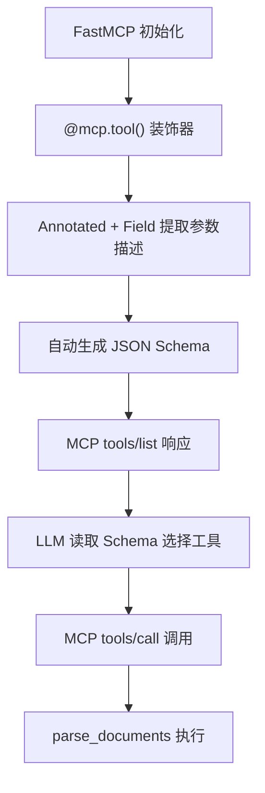
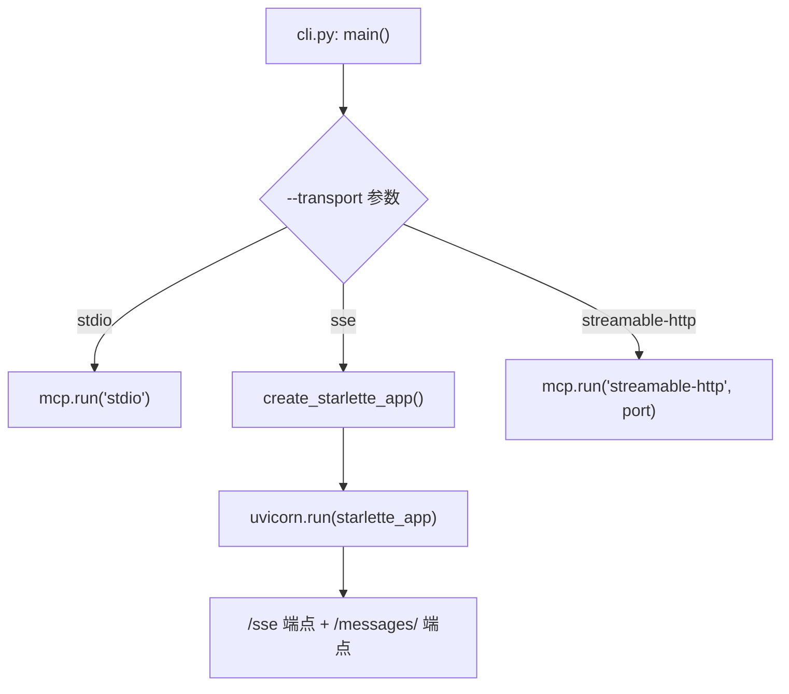

# PD-04.MinerU MinerU — FastMCP 文档解析工具服务器

> 文档编号：PD-04.MinerU
> 来源：MinerU `projects/mcp/src/mineru/server.py`
> GitHub：https://github.com/opendatalab/MinerU.git
> 问题域：PD-04 工具系统 Tool System Design
> 状态：可复用方案

---

## 第 1 章 问题与动机

### 1.1 核心问题

文档解析（PDF/Word/PPT/图片 → Markdown）是 AI Agent 工作流中的高频需求。Agent 需要一种标准化方式调用文档解析能力，而不是直接集成复杂的 OCR/解析引擎。核心挑战：

1. **协议标准化**：如何让不同 AI 客户端（Claude、Cursor、自定义 Agent）统一调用文档解析能力？
2. **传输模式适配**：不同部署场景需要不同传输协议（本地 stdio、远程 SSE、HTTP），如何用一套代码支持？
3. **本地/远程透明切换**：隐私敏感场景需要本地解析，普通场景用云 API，如何对 Agent 透明？
4. **批量处理与结果自动读取**：Agent 提交多文件后，如何自动轮询、下载、解压、读取结果？

### 1.2 MinerU 的解法概述

MinerU 通过独立的 `projects/mcp` 子项目实现了一个精简的 FastMCP 工具服务器：

1. **FastMCP 装饰器注册**：用 `@mcp.tool()` 装饰器将 Python 异步函数直接暴露为 MCP 工具，零 schema 手写（`server.py:707`）
2. **三传输模式统一入口**：CLI 通过 `--transport` 参数切换 stdio/SSE/streamable-http，SSE 模式手动构建 Starlette 应用（`server.py:39-70`）
3. **USE_LOCAL_API 环境变量路由**：单一 `parse_documents` 工具内部根据环境变量自动选择本地 API 或远程 API 处理路径（`server.py:780-781`）
4. **批量轮询 + 自动内容读取**：`process_file_to_markdown` 实现了提交→轮询→下载 ZIP→解压→读取 Markdown 的完整流水线（`api.py:443-729`）
5. **Pydantic Field + Annotated 参数描述**：工具参数通过 `Annotated[type, Field(description=...)]` 提供精确的 LLM 可读描述（`server.py:709-731`）

### 1.3 设计思想

| 设计原则 | 具体实现 | 理由 | 替代方案 |
|----------|----------|------|----------|
| 极简工具集 | 仅暴露 2 个 MCP 工具 | 减少 LLM 选择困难，parse_documents 一个入口覆盖所有场景 | 按格式拆分多个工具（parse_pdf, parse_docx...） |
| Docstring 即 Schema | `@mcp.tool()` + `Annotated[..., Field()]` 自动生成 JSON Schema | 避免手写 schema 与实现不同步 | 手写 JSON Schema 文件 |
| 环境变量驱动路由 | `USE_LOCAL_API` 控制本地/远程切换 | 部署时配置，代码不改 | 工具参数传入 mode |
| 单例客户端 | `singleton_func` 装饰器确保 MinerUClient 全局唯一 | 避免重复初始化和连接 | 每次调用新建客户端 |
| 结果自动消费 | 转换完成后自动读取 Markdown 内容返回 | Agent 不需要二次调用读取文件 | 只返回文件路径让 Agent 自己读 |

---

## 第 2 章 源码实现分析

### 2.1 架构概览

MinerU MCP 子项目的整体架构：

```
┌─────────────────────────────────────────────────────┐
│                   MCP Client                         │
│         (Claude / Cursor / FastMCP Client)           │
└──────────────────────┬──────────────────────────────┘
                       │ MCP Protocol (stdio/SSE/HTTP)
┌──────────────────────▼──────────────────────────────┐
│              FastMCP Server (server.py)               │
│  ┌──────────────────┐  ┌─────────────────────────┐  │
│  │ parse_documents   │  │ get_ocr_languages       │  │
│  │ @mcp.tool()       │  │ @mcp.tool()             │  │
│  └────────┬─────────┘  └─────────────────────────┘  │
│           │                                          │
│  ┌────────▼─────────────────────────────────────┐   │
│  │  USE_LOCAL_API ?                              │   │
│  │  ├─ true  → _parse_file_local() → Local API  │   │
│  │  └─ false → convert_file_url/path()           │   │
│  │             → MinerUClient (api.py)           │   │
│  │             → Remote MinerU API               │   │
│  └──────────────────────────────────────────────┘   │
│                                                      │
│  ┌──────────────────────────────────────────────┐   │
│  │  config.py: 环境变量 + 日志 + 目录管理        │   │
│  └──────────────────────────────────────────────┘   │
│  ┌──────────────────────────────────────────────┐   │
│  │  cli.py: argparse → run_server(mode, port)    │   │
│  └──────────────────────────────────────────────┘   │
└─────────────────────────────────────────────────────┘
```

### 2.2 核心实现

#### 2.2.1 FastMCP 工具注册与参数 Schema 自动生成



对应源码 `projects/mcp/src/mineru/server.py:22-33, 707-732`：

```python
# FastMCP 实例化，instructions 字段向 LLM 描述服务器能力
mcp = FastMCP(
    name="MinerU File to Markdown Conversion",
    instructions="""
    一个将文档转化工具，可以将文档转化成Markdown、Json等格式，支持多种文件格式，包括
    PDF、Word、PPT以及图片格式（JPG、PNG、JPEG）。

    系统工具:
    parse_documents: 解析文档（支持本地文件和URL，自动读取内容）
    get_ocr_languages: 获取OCR支持的语言列表
    """,
)

@mcp.tool()
async def parse_documents(
    file_sources: Annotated[
        str,
        Field(
            description="""文件路径或URL，支持以下格式:
            - 单个路径或URL: "/path/to/file.pdf" 或 "https://example.com/document.pdf"
            - 多个路径或URL(逗号分隔): "/path/to/file1.pdf, /path/to/file2.pdf"
            - 混合路径和URL: "/path/to/file.pdf, https://example.com/document.pdf"
            (支持pdf、ppt、pptx、doc、docx以及图片格式jpg、jpeg、png)"""
        ),
    ],
    enable_ocr: Annotated[bool, Field(description="启用OCR识别,默认False")] = False,
    language: Annotated[str, Field(description='文档语言，默认"ch"中文')] = "ch",
    page_ranges: Annotated[str | None, Field(description='指定页码范围')] = None,
) -> Dict[str, Any]:
```

关键设计：`Annotated[type, Field(description=...)]` 让 FastMCP 自动从类型注解和 Field 描述生成 JSON Schema，LLM 通过 `tools/list` 获取这些描述来决定如何调用。

#### 2.2.2 三传输模式统一入口



对应源码 `projects/mcp/src/mineru/server.py:39-70, 73-111`：

```python
def create_starlette_app(mcp_server, *, debug: bool = False) -> Starlette:
    """创建用于SSE传输的Starlette应用。"""
    sse = SseServerTransport("/messages/")

    async def handle_sse(request: Request) -> None:
        async with sse.connect_sse(
            request.scope, request.receive, request._send,
        ) as (read_stream, write_stream):
            await mcp_server.run(
                read_stream, write_stream,
                mcp_server.create_initialization_options(),
            )

    return Starlette(
        debug=debug,
        routes=[
            Route("/sse", endpoint=handle_sse),
            Mount("/messages/", app=sse.handle_post_message),
        ],
    )

def run_server(mode=None, port=8001, host="127.0.0.1"):
    mcp_server = mcp._mcp_server
    if mode == "sse":
        starlette_app = create_starlette_app(mcp_server, debug=True)
        uvicorn.run(starlette_app, host=host, port=port)
    elif mode == "streamable-http":
        mcp.run(mode, port=port)
    else:
        mcp.run(mode or "stdio")
```

SSE 模式需要手动构建 Starlette 应用（因为 FastMCP 的 SSE 支持需要底层 `mcp.server.sse.SseServerTransport`），而 stdio 和 streamable-http 直接委托给 FastMCP 的 `run()` 方法。

### 2.3 实现细节

#### 本地/远程 API 透明路由

`parse_documents` 工具内部根据 `config.USE_LOCAL_API` 环境变量分流（`server.py:780-833`）：

- **本地模式**：过滤掉 URL，只处理本地文件路径，通过 `_parse_file_local()` 调用本地部署的 MinerU 引擎（`server.py:999-1061`），使用 `aiohttp.FormData` 上传文件二进制数据
- **远程模式**：将 URL 和本地文件分别路由到 `convert_file_url()` 和 `convert_file_path()`，通过 `MinerUClient` 调用 MinerU 云 API

#### 批量处理流水线

`MinerUClient.process_file_to_markdown()`（`api.py:443-729`）实现了完整的异步批量处理：

1. **提交任务**：调用 `submit_file_task` 或 `submit_file_url_task` 获取 `batch_id`
2. **轮询状态**：最多 180 次，每次间隔 10 秒，检查 `extract_result` 中每个文件的 `state`
3. **进度反馈**：running 状态时提取 `extract_progress.extracted_pages/total_pages` 输出百分比
4. **下载解压**：done 状态时下载 `full_zip_url`，解压到 `output_path/batch_id/` 子目录
5. **内容读取**：自动查找解压目录中的 `.md` 文件并读取内容

#### 单例模式与资源清理

`MinerUClient` 使用函数装饰器实现单例（`api.py:15-23`），`server.py` 中的 `get_client()` 懒初始化全局实例（`server.py:129-134`），`cleanup_resources()` 在服务退出时清理（`server.py:114-126`）。


---

## 第 3 章 迁移指南

### 3.1 迁移清单

**阶段 1：基础 FastMCP 工具服务器**
- [ ] 安装 `fastmcp>=2.5.2`
- [ ] 创建 FastMCP 实例，配置 `name` 和 `instructions`
- [ ] 用 `@mcp.tool()` + `Annotated[..., Field()]` 注册工具函数
- [ ] 实现 `run_server()` 支持 stdio 模式

**阶段 2：多传输模式**
- [ ] 添加 SSE 模式：引入 `SseServerTransport` + Starlette 应用
- [ ] 添加 streamable-http 模式：委托 `mcp.run("streamable-http")`
- [ ] CLI 入口通过 `--transport` 参数切换模式

**阶段 3：业务逻辑集成**
- [ ] 实现 API 客户端（单例模式）
- [ ] 环境变量驱动的本地/远程路由
- [ ] 批量处理 + 轮询 + 结果自动读取

### 3.2 适配代码模板

以下是一个可直接运行的 FastMCP 工具服务器骨架，从 MinerU 的模式中提取：

```python
"""基于 MinerU 模式的 FastMCP 工具服务器模板。"""

import os
import argparse
from typing import Annotated, Any, Dict

import uvicorn
from fastmcp import FastMCP
from mcp.server.sse import SseServerTransport
from pydantic import Field
from starlette.applications import Starlette
from starlette.requests import Request
from starlette.routing import Mount, Route

# 1. 创建 FastMCP 实例
mcp = FastMCP(
    name="My Tool Service",
    instructions="描述你的服务能力，帮助 LLM 理解何时调用",
)

# 2. 用装饰器注册工具 — Annotated + Field 自动生成 Schema
@mcp.tool()
async def my_tool(
    input_data: Annotated[str, Field(description="输入数据的描述")],
    option: Annotated[bool, Field(description="可选参数")] = False,
) -> Dict[str, Any]:
    """工具的详细描述，LLM 会读取这段 docstring。"""
    # 业务逻辑
    result = {"status": "success", "data": f"processed: {input_data}"}
    return result

# 3. SSE 传输模式支持
def create_starlette_app(mcp_server, *, debug: bool = False) -> Starlette:
    sse = SseServerTransport("/messages/")

    async def handle_sse(request: Request) -> None:
        async with sse.connect_sse(
            request.scope, request.receive, request._send,
        ) as (read_stream, write_stream):
            await mcp_server.run(
                read_stream, write_stream,
                mcp_server.create_initialization_options(),
            )

    return Starlette(
        debug=debug,
        routes=[
            Route("/sse", endpoint=handle_sse),
            Mount("/messages/", app=sse.handle_post_message),
        ],
    )

# 4. 统一入口
def run_server(mode="stdio", port=8001, host="127.0.0.1"):
    mcp_server = mcp._mcp_server
    if mode == "sse":
        app = create_starlette_app(mcp_server, debug=True)
        uvicorn.run(app, host=host, port=port)
    elif mode == "streamable-http":
        mcp.run(mode, port=port)
    else:
        mcp.run("stdio")

if __name__ == "__main__":
    parser = argparse.ArgumentParser()
    parser.add_argument("--transport", default="stdio", choices=["stdio", "sse", "streamable-http"])
    parser.add_argument("--port", type=int, default=8001)
    parser.add_argument("--host", default="127.0.0.1")
    args = parser.parse_args()
    run_server(mode=args.transport, port=args.port, host=args.host)
```

### 3.3 适用场景

| 场景 | 适用度 | 说明 |
|------|--------|------|
| 将已有 Python 服务暴露为 MCP 工具 | ⭐⭐⭐ | FastMCP 装饰器模式最适合包装已有异步函数 |
| 需要同时支持 stdio + HTTP 部署 | ⭐⭐⭐ | 三传输模式统一入口直接可用 |
| 工具数量 ≤ 5 的专用服务 | ⭐⭐⭐ | MinerU 的极简工具集模式非常适合 |
| 需要本地/云端透明切换 | ⭐⭐⭐ | 环境变量路由模式可直接复用 |
| 大规模工具注册（50+ 工具） | ⭐ | 缺少工具分组、权限控制、动态加载机制 |
| 需要工具间状态共享 | ⭐⭐ | 全局单例客户端可用，但缺少正式的上下文注入 |

---

## 第 4 章 测试用例

```python
"""基于 MinerU MCP 真实函数签名的测试用例。"""

import pytest
from unittest.mock import AsyncMock, patch, MagicMock
from pathlib import Path


class TestParseListInput:
    """测试 server.parse_list_input 多格式输入解析。"""

    def test_single_path(self):
        from mineru.server import parse_list_input
        result = parse_list_input("/path/to/file.pdf")
        assert result == ["/path/to/file.pdf"]

    def test_comma_separated(self):
        from mineru.server import parse_list_input
        result = parse_list_input("/a.pdf, /b.pdf, /c.pdf")
        assert len(result) == 3
        assert result[0] == "/a.pdf"

    def test_quoted_items(self):
        from mineru.server import parse_list_input
        result = parse_list_input('"file with spaces.pdf"')
        assert result == ["file with spaces.pdf"]

    def test_empty_input(self):
        from mineru.server import parse_list_input
        assert parse_list_input("") == []
        assert parse_list_input(None) == []


class TestParseDocumentsRouting:
    """测试 parse_documents 的本地/远程路由逻辑。"""

    @pytest.mark.asyncio
    async def test_url_detection(self):
        """URL 应被识别并路由到 convert_file_url。"""
        sources = ["https://example.com/doc.pdf", "/local/file.pdf"]
        url_paths = [s for s in sources if s.lower().startswith(("http://", "https://"))]
        file_paths = [s for s in sources if not s.lower().startswith(("http://", "https://"))]
        assert url_paths == ["https://example.com/doc.pdf"]
        assert file_paths == ["/local/file.pdf"]

    @pytest.mark.asyncio
    async def test_deduplication(self):
        """重复路径应被去重。"""
        sources = ["/a.pdf", "/b.pdf", "/a.pdf"]
        unique = list(dict.fromkeys(sources))
        assert unique == ["/a.pdf", "/b.pdf"]


class TestMinerUClientSingleton:
    """测试 MinerUClient 单例行为。"""

    def test_singleton_returns_same_instance(self):
        from mineru.api import singleton_func

        @singleton_func
        class MockClient:
            def __init__(self, value):
                self.value = value

        a = MockClient("first")
        b = MockClient("second")
        assert a is b
        assert a.value == "first"  # 第二次调用不会重新初始化


class TestConfigValidation:
    """测试配置验证。"""

    def test_validate_api_config_structure(self):
        from mineru.config import validate_api_config
        result = validate_api_config()
        assert "api_base" in result
        assert "api_key_set" in result
        assert "output_dir" in result
        assert isinstance(result["api_key_set"], bool)

    def test_ensure_output_dir_creates_directory(self, tmp_path):
        from mineru.config import ensure_output_dir
        test_dir = tmp_path / "test_output"
        result = ensure_output_dir(str(test_dir))
        assert result.exists()
        assert result.is_dir()
```


---

## 第 5 章 跨域关联

| 关联域 | 关系类型 | 说明 |
|--------|----------|------|
| PD-01 上下文管理 | 协同 | parse_documents 返回完整 Markdown 内容，大文档可能超出 LLM 上下文窗口，需要配合上下文压缩策略 |
| PD-03 容错与重试 | 依赖 | process_file_to_markdown 内置 180 次轮询重试（10s 间隔），超时后支持部分成功返回，但缺少指数退避 |
| PD-06 记忆持久化 | 协同 | 转换结果保存到本地文件系统（output_dir），可作为 Agent 记忆的持久化数据源 |
| PD-08 搜索与检索 | 协同 | 文档解析输出的 Markdown 可作为 RAG 检索的输入源，MinerU 本身不做检索 |
| PD-11 可观测性 | 依赖 | 使用 Python logging 模块记录 API 请求/响应/进度，但缺少结构化追踪（无 trace_id、无 token 计数） |

---

## 第 6 章 来源文件索引

| 文件 | 行范围 | 关键实现 |
|------|--------|----------|
| `projects/mcp/src/mineru/server.py` | L22-L33 | FastMCP 实例化 + instructions |
| `projects/mcp/src/mineru/server.py` | L39-L70 | SSE 传输 Starlette 应用构建 |
| `projects/mcp/src/mineru/server.py` | L73-L111 | run_server 三模式统一入口 |
| `projects/mcp/src/mineru/server.py` | L114-L134 | 单例客户端 + 资源清理 |
| `projects/mcp/src/mineru/server.py` | L149-L178 | parse_list_input 多格式输入解析 |
| `projects/mcp/src/mineru/server.py` | L707-L980 | parse_documents MCP 工具（核心） |
| `projects/mcp/src/mineru/server.py` | L983-L996 | get_ocr_languages MCP 工具 |
| `projects/mcp/src/mineru/server.py` | L999-L1061 | _parse_file_local 本地 API 调用 |
| `projects/mcp/src/mineru/api.py` | L15-L23 | singleton_func 单例装饰器 |
| `projects/mcp/src/mineru/api.py` | L27-L91 | MinerUClient 类 + _request 方法 |
| `projects/mcp/src/mineru/api.py` | L93-L219 | submit_file_url_task 批量 URL 提交 |
| `projects/mcp/src/mineru/api.py` | L221-L425 | submit_file_task 批量文件上传 |
| `projects/mcp/src/mineru/api.py` | L443-L729 | process_file_to_markdown 完整流水线 |
| `projects/mcp/src/mineru/config.py` | L1-L92 | 环境变量配置 + 日志 + 目录管理 |
| `projects/mcp/src/mineru/cli.py` | L1-L73 | CLI 入口 + argparse 参数解析 |
| `projects/mcp/src/mineru/language.py` | L1-L107 | OCR 语言列表（90+ 语言） |
| `projects/mcp/pyproject.toml` | L1-L40 | 依赖声明 + CLI 入口点配置 |

---

## 第 7 章 横向对比维度

```json comparison_data
{
  "project": "MinerU",
  "dimensions": {
    "工具注册方式": "@mcp.tool() 装饰器 + Annotated[type, Field()] 自动 Schema",
    "工具分组/权限": "无分组无权限，仅 2 个工具全量暴露",
    "MCP 协议支持": "FastMCP 原生支持 stdio/SSE/streamable-http 三模式",
    "热更新/缓存": "无热更新，工具在启动时静态注册",
    "超时保护": "轮询 180 次×10s 上限，无单次调用超时",
    "参数校验": "Pydantic Field + 类型注解自动校验",
    "Schema 生成方式": "Docstring 即 Schema，FastMCP 从类型注解自动生成",
    "双层API架构": "parse_documents 统一入口，内部分流到本地/远程 API",
    "结果摘要": "自动下载 ZIP 解压并读取 Markdown 全文返回",
    "依赖注入": "全局单例 MinerUClient，singleton_func 装饰器",
    "工具条件加载": "无条件加载，所有工具始终注册",
    "延迟导入隔离": "无延迟导入，启动时加载所有依赖",
    "长时工具反馈": "轮询时输出 extracted_pages/total_pages 百分比进度",
    "本地远程透明切换": "USE_LOCAL_API 环境变量驱动，Agent 无感知"
  }
}
```

### 域元数据补充

```json domain_metadata
{
  "solution_summary": "MinerU 用 FastMCP 装饰器将 2 个文档解析函数暴露为 MCP 工具，通过 USE_LOCAL_API 环境变量实现本地/远程 API 透明路由，支持 stdio/SSE/HTTP 三传输模式",
  "description": "文档解析类工具如何通过 MCP 协议标准化暴露给 AI Agent",
  "sub_problems": [
    "本地/远程 API 透明路由：同一工具如何根据部署环境自动切换后端实现",
    "批量任务轮询与进度反馈：长时异步任务如何轮询状态并向 Agent 报告进度百分比",
    "转换结果自动消费：工具如何在返回前自动下载、解压、读取结果而非只返回路径"
  ],
  "best_practices": [
    "极简工具集：专用 MCP Server 工具数量控制在 2-5 个，用统一入口覆盖多场景",
    "instructions 字段要写清楚：FastMCP 的 instructions 是 LLM 理解服务器能力的第一入口",
    "SSE 模式需手动构建 Starlette 应用：FastMCP 的 SSE 支持需要底层 SseServerTransport 配合"
  ]
}
```

