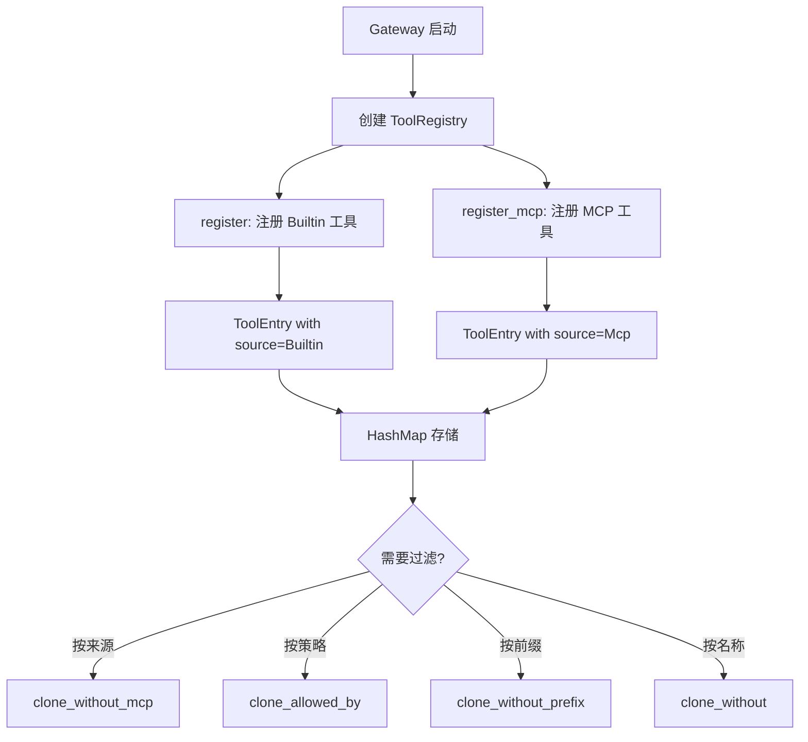
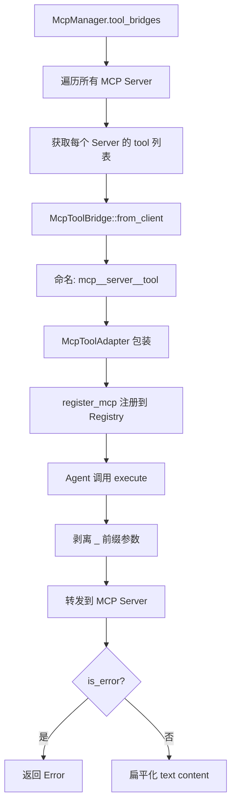
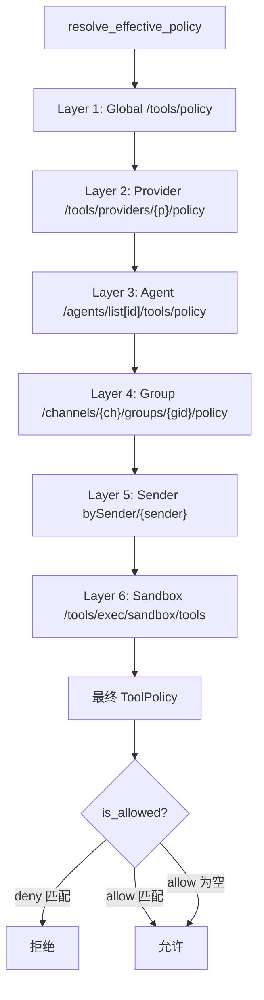

# PD-04.XX Moltis — ToolRegistry 双来源注册与 Glob 策略过滤

> 文档编号：PD-04.XX
> 来源：Moltis `crates/agents/src/tool_registry.rs` `crates/tools/src/policy.rs` `crates/mcp/src/tool_bridge.rs`
> GitHub：https://github.com/moltis-org/moltis.git
> 问题域：PD-04 工具系统 Tool System Design
> 状态：可复用方案

---

## 第 1 章 问题与动机

### 1.1 核心问题

Agent 系统需要一个统一的工具注册中心，同时管理两类来源截然不同的工具：

1. **内置工具（Builtin）**：编译时已知，随二进制分发，如 `exec`、`browser`、`web_fetch`
2. **MCP 工具**：运行时从外部 MCP Server 动态发现，数量和种类不可预知

两类工具的生命周期完全不同——内置工具在进程启动时一次性注册，MCP 工具随 Server 连接/断开动态增减。此外，不同场景（沙箱模式、群组聊天、特定 Agent）需要不同的工具子集，需要一套灵活的访问控制机制。

Moltis 面临的具体挑战：
- 多渠道（Telegram/Discord/Web）共享同一 ToolRegistry，但不同渠道/群组/用户需要不同权限
- MCP Server 可能随时上下线，工具列表需要热同步
- 子 Agent（SpawnAgent）需要父 Agent 工具集的过滤副本，不能访问所有工具

### 1.2 Moltis 的解法概述

1. **ToolSource 枚举追踪来源**：每个工具携带 `Builtin` 或 `Mcp { server }` 元数据，支持按来源批量操作（`crates/agents/src/tool_registry.rs:17-23`）
2. **Arc 共享 + 过滤克隆**：工具存储为 `Arc<dyn AgentTool>`，克隆 registry 只复制指针不复制实现，提供 4 种过滤克隆方法（`tool_registry.rs:120-184`）
3. **McpToolBridge 适配器模式**：MCP 工具通过 `mcp__<server>__<tool>` 前缀命名，桥接 MCP 协议到 AgentTool trait（`crates/mcp/src/tool_bridge.rs:14-44`）
4. **6 层策略合并**：ToolPolicy 支持 glob 模式的 allow/deny 列表，6 层配置从全局到沙箱逐层合并，deny 始终累积（`crates/tools/src/policy.rs:97-185`）
5. **预定义 Profile 快速启用**：`minimal`/`coding`/`full` 三档预设，零配置即可使用（`policy.rs:27-43`）

### 1.3 设计思想

| 设计原则 | 具体实现 | 理由 | 替代方案 |
|----------|----------|------|----------|
| 来源可追踪 | `ToolSource` 枚举标记每个工具的来源 | 支持按来源批量卸载/过滤，MCP 断连时精确清理 | 用名称前缀判断（不可靠） |
| 零拷贝共享 | `Arc<dyn AgentTool>` 存储，克隆只复制指针 | 子 Agent 需要父工具集的过滤副本，避免深拷贝开销 | 全局单例 + 运行时过滤（锁竞争） |
| Deny 优先 | deny 列表始终累积，deny 匹配优先于 allow | 安全默认：任何层级的禁止都不可被下层覆盖 | allow 优先（安全风险） |
| 适配器解耦 | McpToolBridge → McpToolAdapter 双层适配 | 避免 mcp crate 和 agents crate 循环依赖 | 统一 trait（引入循环依赖） |
| 内部元数据剥离 | execute 时自动移除 `_` 前缀参数 | Agent runner 注入的路由信息不应传给 MCP Server | 在 runner 层剥离（职责不清） |

---

## 第 2 章 源码实现分析

### 2.1 架构概览

```
┌─────────────────────────────────────────────────────────────────┐
│                        Gateway Server                           │
│  ┌──────────────┐  ┌──────────────┐  ┌───────────────────────┐  │
│  │ ExecTool     │  │ BrowserTool  │  │ CalcTool / WebFetch   │  │
│  │ (Builtin)    │  │ (Builtin)    │  │ (Builtin)             │  │
│  └──────┬───────┘  └──────┬───────┘  └───────────┬───────────┘  │
│         │                 │                       │              │
│         ▼                 ▼                       ▼              │
│  ┌──────────────────────────────────────────────────────────┐   │
│  │              ToolRegistry (HashMap<String, ToolEntry>)    │   │
│  │  ┌─────────────────────────────────────────────────────┐  │   │
│  │  │ ToolEntry { tool: Arc<dyn AgentTool>, source }      │  │   │
│  │  └─────────────────────────────────────────────────────┘  │   │
│  └──────────────────────────┬───────────────────────────────┘   │
│                             │                                    │
│         ┌───────────────────┼───────────────────┐               │
│         ▼                   ▼                   ▼               │
│  clone_without_mcp()  clone_allowed_by()  clone_without()       │
│         │                   │                   │               │
│         ▼                   ▼                   ▼               │
│  ┌─────────────┐  ┌──────────────┐  ┌──────────────────┐       │
│  │ Sub-Agent   │  │ Policy-      │  │ Prefix-filtered  │       │
│  │ Registry    │  │ filtered     │  │ Registry         │       │
│  └─────────────┘  └──────────────┘  └──────────────────┘       │
│                                                                  │
│  ┌──────────────────────────────────────────────────────────┐   │
│  │ McpManager → McpToolBridge → McpToolAdapter → register   │   │
│  └──────────────────────────────────────────────────────────┘   │
└─────────────────────────────────────────────────────────────────┘
```

### 2.2 核心实现

#### 2.2.1 ToolRegistry：双来源注册与过滤克隆



对应源码 `crates/agents/src/tool_registry.rs:35-59`：

```rust
pub struct ToolRegistry {
    tools: HashMap<String, ToolEntry>,
}

impl ToolRegistry {
    pub fn register(&mut self, tool: Box<dyn AgentTool>) {
        let name = tool.name().to_string();
        self.tools.insert(name, ToolEntry {
            tool: Arc::from(tool),
            source: ToolSource::Builtin,
        });
    }

    pub fn register_mcp(&mut self, tool: Box<dyn AgentTool>, server: String) {
        let name = tool.name().to_string();
        self.tools.insert(name, ToolEntry {
            tool: Arc::from(tool),
            source: ToolSource::Mcp { server },
        });
    }
}
```

`clone_allowed_by` 是策略过滤的核心方法（`tool_registry.rs:168-184`）：

```rust
pub fn clone_allowed_by<F>(&self, mut predicate: F) -> ToolRegistry
where
    F: FnMut(&str) -> bool,
{
    let tools = self.tools.iter()
        .filter(|(name, _)| predicate(name))
        .map(|(name, entry)| (name.clone(), ToolEntry {
            tool: Arc::clone(&entry.tool),
            source: entry.source.clone(),
        }))
        .collect();
    ToolRegistry { tools }
}
```

#### 2.2.2 McpToolBridge：MCP 协议桥接



对应源码 `crates/mcp/src/tool_bridge.rs:94-141`：

```rust
async fn execute(&self, params: serde_json::Value) -> Result<serde_json::Value> {
    // 剥离 Agent runner 注入的内部元数据
    let params = match params {
        serde_json::Value::Object(mut map) => {
            map.retain(|k, _| !k.starts_with('_'));
            serde_json::Value::Object(map)
        },
        other => other,
    };

    let client = self.client.read().await;
    let result = client.call_tool(&self.original_name, params).await?;

    if result.is_error {
        let text = result.content.iter()
            .filter_map(|c| match c {
                ToolContent::Text { text } => Some(text.as_str()),
                _ => None,
            })
            .collect::<Vec<_>>().join("\n");
        return Err(Error::message(format!("MCP tool error: {text}")));
    }

    // 单文本尝试 JSON 解析，多文本包装为 content 数组
    let texts: Vec<&str> = result.content.iter()
        .filter_map(|c| match c {
            ToolContent::Text { text } => Some(text.as_str()),
            _ => None,
        }).collect();

    if texts.len() == 1 {
        if let Ok(val) = serde_json::from_str(texts[0]) {
            return Ok(val);
        }
        Ok(serde_json::Value::String(texts[0].to_string()))
    } else {
        Ok(serde_json::json!({ "content": texts }))
    }
}
```

#### 2.2.3 ToolPolicy：6 层 Glob 策略合并



对应源码 `crates/tools/src/policy.rs:56-94`：

```rust
impl ToolPolicy {
    pub fn is_allowed(&self, tool_name: &str) -> bool {
        // Deny 优先检查
        for pattern in &self.deny {
            if pattern_matches(pattern, tool_name) {
                return false;
            }
        }
        // allow 为空 = 允许所有未被 deny 的
        if self.allow.is_empty() {
            return true;
        }
        // 否则必须匹配 allow 模式
        for pattern in &self.allow {
            if pattern_matches(pattern, tool_name) {
                return true;
            }
        }
        false
    }

    pub fn merge_with(&self, other: &ToolPolicy) -> ToolPolicy {
        ToolPolicy {
            allow: if other.allow.is_empty() {
                self.allow.clone()
            } else {
                other.allow.clone()  // 高优先级层的 allow 替换低层
            },
            deny: {
                let mut combined = self.deny.clone();
                combined.extend(other.deny.iter().cloned());  // deny 始终累积
                combined
            },
        }
    }
}
```

### 2.3 实现细节

**MCP 工具同步机制**（`crates/gateway/src/mcp_service.rs:48-69`）：

sync_mcp_tools 采用"全量替换"策略——先 `unregister_mcp()` 清除所有旧 MCP 工具，再重新注册当前活跃的 bridges。这避免了增量同步的复杂性（需要 diff 新旧工具列表），代价是每次同步都重建所有 MCP 工具条目。由于工具存储为 Arc，重建成本仅为指针复制。

**MCP 命名约定**：`mcp__<server>__<tool>` 使用双下划线分隔，确保 `splitn(3, "__")` 可以无歧义地拆分出 server 和 tool 名称（`tool_bridge.rs:34`）。

**内部元数据剥离**：Agent runner 在调用工具时注入 `_session_key`、`_accept_language`、`_conn_id` 等路由信息。对内置工具这些字段有用（如 ExecTool 用 `_session_key` 路由到正确的沙箱），但 MCP Server 不认识这些字段且可能因严格校验而报错。McpToolBridge 在 execute 时自动移除所有 `_` 前缀参数（`tool_bridge.rs:98-104`）。

**工具注册顺序**（`crates/gateway/src/server.rs:3015-3166`）：Gateway 启动时按以下顺序注册约 20 个内置工具：exec → calc → process → sandbox_packages → cron → send_image → web_search → web_fetch → browser → caldav → memory(3) → session_state → speak → transcribe → skill(3) → branch_session → location → map → spawn_agent。SpawnAgent 最后注册，因为它需要一份已有工具集的过滤副本。


---

## 第 3 章 迁移指南

### 3.1 迁移清单

**阶段 1：核心 Registry（1 个文件）**
- [ ] 定义 `AgentTool` trait（name/description/parameters_schema/execute）
- [ ] 实现 `ToolSource` 枚举（Builtin / Mcp）
- [ ] 实现 `ToolRegistry`（HashMap + register/get/list_schemas）
- [ ] 添加过滤克隆方法（clone_without_prefix / clone_allowed_by）

**阶段 2：策略系统（1 个文件）**
- [ ] 实现 `ToolPolicy`（allow/deny glob 列表 + is_allowed + merge_with）
- [ ] 实现 `pattern_matches`（支持 `*` 和前缀通配）
- [ ] 添加预定义 profile（minimal/coding/full）
- [ ] 实现多层策略合并（按需选择层数）

**阶段 3：MCP 桥接（2 个文件）**
- [ ] 实现 `McpToolBridge`（前缀命名 + 元数据剥离 + 结果扁平化）
- [ ] 实现 `McpToolAdapter`（桥接 McpAgentTool → AgentTool）
- [ ] 实现 `sync_mcp_tools`（全量替换同步）

### 3.2 适配代码模板

#### 最小可用 ToolRegistry（Rust）

```rust
use std::{collections::HashMap, sync::Arc};
use async_trait::async_trait;
use serde_json::Value;

#[async_trait]
pub trait AgentTool: Send + Sync {
    fn name(&self) -> &str;
    fn description(&self) -> &str;
    fn parameters_schema(&self) -> Value;
    async fn execute(&self, params: Value) -> anyhow::Result<Value>;
}

#[derive(Debug, Clone, PartialEq, Eq)]
pub enum ToolSource {
    Builtin,
    Mcp { server: String },
}

struct ToolEntry {
    tool: Arc<dyn AgentTool>,
    source: ToolSource,
}

pub struct ToolRegistry {
    tools: HashMap<String, ToolEntry>,
}

impl ToolRegistry {
    pub fn new() -> Self {
        Self { tools: HashMap::new() }
    }

    pub fn register(&mut self, tool: Box<dyn AgentTool>) {
        let name = tool.name().to_string();
        self.tools.insert(name, ToolEntry {
            tool: Arc::from(tool),
            source: ToolSource::Builtin,
        });
    }

    pub fn register_mcp(&mut self, tool: Box<dyn AgentTool>, server: String) {
        let name = tool.name().to_string();
        self.tools.insert(name, ToolEntry {
            tool: Arc::from(tool),
            source: ToolSource::Mcp { server },
        });
    }

    pub fn get(&self, name: &str) -> Option<Arc<dyn AgentTool>> {
        self.tools.get(name).map(|e| Arc::clone(&e.tool))
    }

    pub fn unregister_mcp(&mut self) -> usize {
        let before = self.tools.len();
        self.tools.retain(|_, e| !matches!(e.source, ToolSource::Mcp { .. }));
        before - self.tools.len()
    }

    pub fn clone_allowed_by<F>(&self, mut pred: F) -> Self
    where F: FnMut(&str) -> bool {
        let tools = self.tools.iter()
            .filter(|(name, _)| pred(name))
            .map(|(name, entry)| (name.clone(), ToolEntry {
                tool: Arc::clone(&entry.tool),
                source: entry.source.clone(),
            }))
            .collect();
        Self { tools }
    }

    pub fn list_schemas(&self) -> Vec<Value> {
        self.tools.values().map(|e| {
            serde_json::json!({
                "name": e.tool.name(),
                "description": e.tool.description(),
                "parameters": e.tool.parameters_schema(),
                "source": match &e.source {
                    ToolSource::Builtin => "builtin",
                    ToolSource::Mcp { .. } => "mcp",
                }
            })
        }).collect()
    }
}
```

#### 最小可用 ToolPolicy（Rust）

```rust
use serde::{Deserialize, Serialize};

#[derive(Debug, Clone, Default, Serialize, Deserialize)]
pub struct ToolPolicy {
    #[serde(default)]
    pub allow: Vec<String>,
    #[serde(default)]
    pub deny: Vec<String>,
}

fn pattern_matches(pattern: &str, name: &str) -> bool {
    if pattern == "*" { return true; }
    if let Some(prefix) = pattern.strip_suffix('*') {
        return name.starts_with(prefix);
    }
    pattern == name
}

impl ToolPolicy {
    pub fn is_allowed(&self, tool_name: &str) -> bool {
        for p in &self.deny {
            if pattern_matches(p, tool_name) { return false; }
        }
        if self.allow.is_empty() { return true; }
        self.allow.iter().any(|p| pattern_matches(p, tool_name))
    }

    pub fn merge_with(&self, other: &ToolPolicy) -> ToolPolicy {
        ToolPolicy {
            allow: if other.allow.is_empty() { self.allow.clone() } else { other.allow.clone() },
            deny: {
                let mut d = self.deny.clone();
                d.extend(other.deny.iter().cloned());
                d
            },
        }
    }
}
```

### 3.3 适用场景

| 场景 | 适用度 | 说明 |
|------|--------|------|
| 多渠道 Agent 平台 | ⭐⭐⭐ | 6 层策略完美匹配多渠道/多用户权限需求 |
| MCP 集成的 Agent 框架 | ⭐⭐⭐ | McpToolBridge 模式可直接复用 |
| 单 Agent CLI 工具 | ⭐⭐ | Registry 有用，但 6 层策略过度设计 |
| 纯 MCP Server 开发 | ⭐ | 不需要 Registry，直接实现 MCP 协议即可 |
| 需要热更新工具的系统 | ⭐⭐⭐ | unregister_mcp + sync 模式天然支持 |

---

## 第 4 章 测试用例

```rust
#[cfg(test)]
mod tests {
    use super::*;

    struct MockTool { name: String }

    #[async_trait]
    impl AgentTool for MockTool {
        fn name(&self) -> &str { &self.name }
        fn description(&self) -> &str { "mock" }
        fn parameters_schema(&self) -> Value { serde_json::json!({}) }
        async fn execute(&self, _: Value) -> anyhow::Result<Value> {
            Ok(serde_json::json!({"ok": true}))
        }
    }

    // ── ToolRegistry 测试 ──

    #[test]
    fn test_register_and_get() {
        let mut reg = ToolRegistry::new();
        reg.register(Box::new(MockTool { name: "exec".into() }));
        assert!(reg.get("exec").is_some());
        assert!(reg.get("missing").is_none());
    }

    #[test]
    fn test_unregister_mcp_preserves_builtin() {
        let mut reg = ToolRegistry::new();
        reg.register(Box::new(MockTool { name: "exec".into() }));
        reg.register_mcp(Box::new(MockTool { name: "mcp__fs__read".into() }), "fs".into());
        assert_eq!(reg.unregister_mcp(), 1);
        assert!(reg.get("exec").is_some());
        assert!(reg.get("mcp__fs__read").is_none());
    }

    #[test]
    fn test_clone_allowed_by_filters_correctly() {
        let mut reg = ToolRegistry::new();
        reg.register(Box::new(MockTool { name: "exec".into() }));
        reg.register(Box::new(MockTool { name: "browser".into() }));
        reg.register(Box::new(MockTool { name: "dangerous".into() }));

        let policy = ToolPolicy {
            allow: vec!["*".into()],
            deny: vec!["dangerous".into()],
        };
        let filtered = reg.clone_allowed_by(|name| policy.is_allowed(name));
        assert!(filtered.get("exec").is_some());
        assert!(filtered.get("browser").is_some());
        assert!(filtered.get("dangerous").is_none());
    }

    #[test]
    fn test_list_schemas_includes_source_metadata() {
        let mut reg = ToolRegistry::new();
        reg.register(Box::new(MockTool { name: "exec".into() }));
        reg.register_mcp(Box::new(MockTool { name: "mcp__gh__search".into() }), "gh".into());
        let schemas = reg.list_schemas();
        assert_eq!(schemas.len(), 2);
        let builtin = schemas.iter().find(|s| s["name"] == "exec").unwrap();
        assert_eq!(builtin["source"], "builtin");
    }

    // ── ToolPolicy 测试 ──

    #[test]
    fn test_deny_wins_over_allow() {
        let policy = ToolPolicy {
            allow: vec!["*".into()],
            deny: vec!["exec".into()],
        };
        assert!(!policy.is_allowed("exec"));
        assert!(policy.is_allowed("browser"));
    }

    #[test]
    fn test_prefix_glob_matching() {
        let policy = ToolPolicy {
            allow: vec!["mcp__*".into()],
            deny: vec![],
        };
        assert!(policy.is_allowed("mcp__fs__read"));
        assert!(!policy.is_allowed("exec"));
    }

    #[test]
    fn test_empty_allow_permits_all() {
        let policy = ToolPolicy { allow: vec![], deny: vec![] };
        assert!(policy.is_allowed("anything"));
    }

    #[test]
    fn test_merge_deny_accumulates() {
        let base = ToolPolicy {
            allow: vec!["*".into()],
            deny: vec!["dangerous".into()],
        };
        let overlay = ToolPolicy {
            allow: vec![],
            deny: vec!["exec".into()],
        };
        let merged = base.merge_with(&overlay);
        assert!(!merged.is_allowed("dangerous"));
        assert!(!merged.is_allowed("exec"));
        assert!(merged.is_allowed("browser"));
    }

    #[test]
    fn test_merge_allow_replaced_by_higher_layer() {
        let base = ToolPolicy {
            allow: vec!["exec".into()],
            deny: vec![],
        };
        let overlay = ToolPolicy {
            allow: vec!["browser".into()],
            deny: vec![],
        };
        let merged = base.merge_with(&overlay);
        assert!(!merged.is_allowed("exec"));  // base allow 被替换
        assert!(merged.is_allowed("browser"));
    }
}
```


---

## 第 5 章 跨域关联

| 关联域 | 关系类型 | 说明 |
|--------|----------|------|
| PD-02 多 Agent 编排 | 协同 | SpawnAgent 通过 `clone_without_mcp()` 获取父工具集的过滤副本，实现子 Agent 工具隔离 |
| PD-03 容错与重试 | 协同 | ExecTool 内置超时保护（默认 30s，上限 1800s）和沙箱恢复重试（MAX_SANDBOX_RECOVERY_RETRIES=1） |
| PD-05 沙箱隔离 | 依赖 | ExecTool 通过 SandboxRouter 路由到正确的沙箱实例，ToolPolicy 的 Layer 6 专门处理沙箱工具限制 |
| PD-06 记忆持久化 | 协同 | MemorySearchTool/MemoryGetTool/MemorySaveTool 作为 Builtin 工具注册到 Registry |
| PD-09 Human-in-the-Loop | 依赖 | ExecTool 集成 ApprovalManager，危险命令需要用户确认后才执行 |
| PD-11 可观测性 | 协同 | ExecTool 支持 metrics feature flag，追踪 executions_in_flight gauge 和执行耗时 histogram |

---

## 第 6 章 来源文件索引

| 文件 | 行范围 | 关键实现 |
|------|--------|----------|
| `crates/agents/src/tool_registry.rs` | L1-L377 | AgentTool trait、ToolSource 枚举、ToolRegistry 完整实现（register/get/clone_*） |
| `crates/tools/src/policy.rs` | L1-L303 | ToolPolicy 结构体、glob 匹配、6 层策略合并、预定义 profile |
| `crates/mcp/src/tool_bridge.rs` | L1-L278 | McpToolBridge（前缀命名、元数据剥离、结果扁平化）、McpAgentTool trait |
| `crates/gateway/src/mcp_service.rs` | L1-L69 | McpToolAdapter 适配器、sync_mcp_tools 全量替换同步 |
| `crates/gateway/src/mcp_service.rs` | L191-L224 | LiveMcpService（MCP Server CRUD + 自动工具同步） |
| `crates/chat/src/lib.rs` | L1281-L1314 | effective_tool_policy + apply_runtime_tool_filters（策略执行点） |
| `crates/gateway/src/server.rs` | L3015-L3166 | 约 20 个内置工具的注册顺序 |
| `crates/tools/src/exec.rs` | L162-L267 | ExecTool 结构体、Builder 模式、AgentTool 实现（含 JSON Schema） |
| `crates/mcp/src/types.rs` | L117-L160 | McpToolDef、ToolContent 枚举、ToolsCallResult |
| `crates/mcp/src/manager.rs` | L1-L66 | McpManager 结构体、McpManagerInner 状态管理 |

---

## 第 7 章 横向对比维度

```json comparison_data
{
  "project": "Moltis",
  "dimensions": {
    "工具注册方式": "HashMap<String, ToolEntry> 双入口注册（register/register_mcp），ToolSource 枚举追踪来源",
    "工具分组/权限": "6 层 Glob 策略合并（Global→Provider→Agent→Group→Sender→Sandbox），deny 始终累积",
    "MCP 协议支持": "McpToolBridge 适配器 + mcp__server__tool 前缀命名 + 内部元数据自动剥离",
    "热更新/缓存": "sync_mcp_tools 全量替换策略，unregister_mcp 后重新注册所有活跃 bridges",
    "超时保护": "ExecTool 内置 30s 默认超时，上限 1800s，tokio::time::timeout 实现",
    "参数校验": "JSON Schema 定义参数（parameters_schema 方法），execute 内手动校验必填字段",
    "安全防护": "ApprovalManager 危险命令确认 + SandboxRouter 沙箱路由 + deny-wins 策略",
    "工具集动态组合": "4 种过滤克隆方法（by_prefix/by_mcp/by_name/by_predicate），Arc 共享零拷贝",
    "子 Agent 工具隔离": "clone_without_mcp/clone_without 为子 Agent 创建独立过滤注册表",
    "Schema 生成方式": "手写 serde_json::json! 宏内联定义，list_schemas 附加 source 元数据",
    "工具上下文注入": "Agent runner 注入 _session_key/_conn_id 等路由信息，MCP 桥接时自动剥离"
  }
}
```

### 域元数据补充

```json domain_metadata
{
  "solution_summary": "Moltis 用 ToolSource 枚举追踪 Builtin/MCP 双来源、Arc 零拷贝过滤克隆、6 层 Glob deny-wins 策略合并实现多渠道工具权限控制",
  "description": "多渠道共享注册表下如何通过分层策略实现细粒度工具访问控制",
  "sub_problems": [
    "MCP 工具全量替换同步：如何在 Server 上下线时高效重建工具列表而非增量 diff",
    "跨 crate 循环依赖规避：工具 trait 定义在 agents crate 但 MCP 桥接在 mcp crate 时如何解耦",
    "内部元数据透传与剥离：Agent runner 注入的路由信息如何对内置工具可见但对 MCP Server 不可见"
  ],
  "best_practices": [
    "deny 始终累积不可覆盖：任何层级的禁止都不应被更高优先级的 allow 推翻",
    "工具来源用枚举而非前缀判断：ToolSource 比字符串前缀更可靠，支持类型安全的批量操作",
    "MCP 工具命名用双下划线分隔：mcp__server__tool 格式确保 splitn 无歧义拆分"
  ]
}
```

