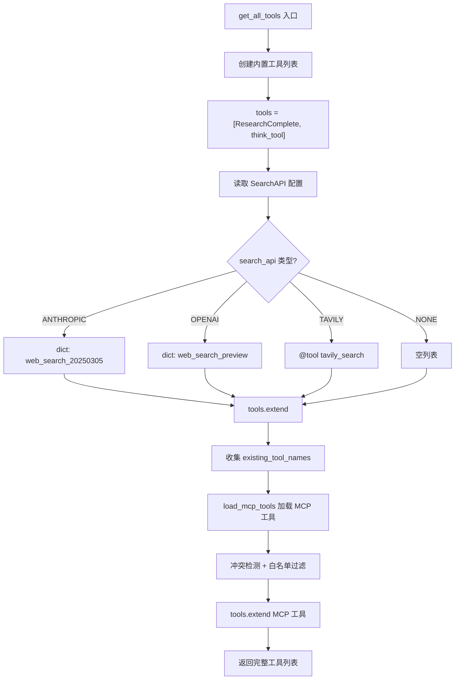
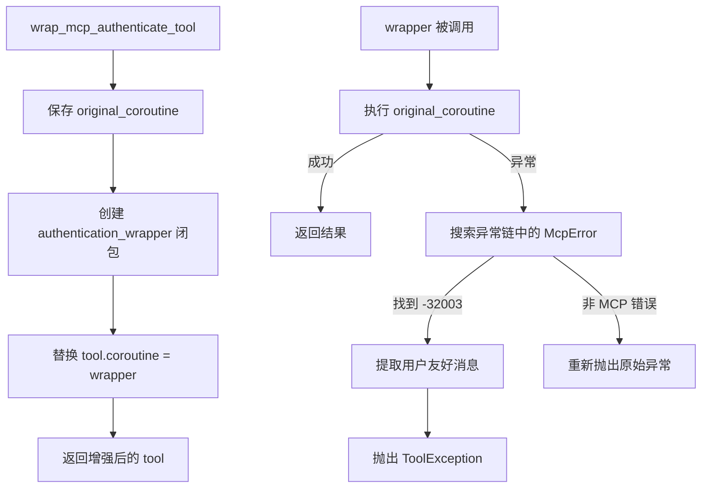
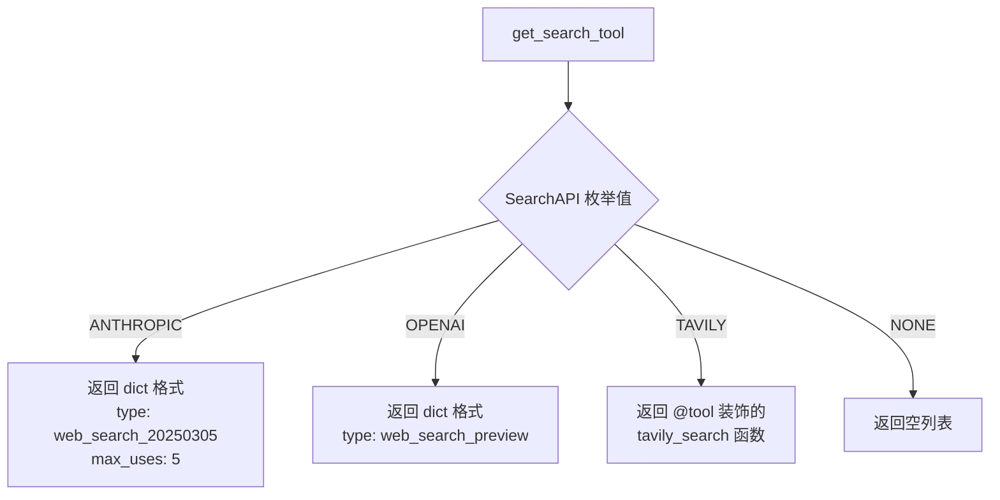

# PD-04.07 Open Deep Research — 动态工具组装与 MCP 认证包裹

> 文档编号：PD-04.07
> 来源：Open Deep Research `src/open_deep_research/utils.py`, `configuration.py`, `deep_researcher.py`
> GitHub：https://github.com/langchain-ai/open_deep_research.git
> 问题域：PD-04 工具系统 Tool System Design
> 状态：可复用方案

---

## 第 1 章 问题与动机

### 1.1 核心问题

深度研究 Agent 需要在运行时根据用户配置动态组装工具集：搜索工具可能来自 Tavily、OpenAI 原生搜索或 Anthropic 原生搜索；MCP 工具来自远程服务器且需要 OAuth 认证；内置工具（think_tool、ResearchComplete）始终存在。这些异构工具必须统一注册到 LangChain 的 `bind_tools` 接口，同时防止工具名冲突、处理认证失败、控制并发执行。

核心挑战：
- **多供应商搜索切换**：同一个 Agent 需要透明切换 Tavily（第三方 API）、OpenAI（原生 web_search_preview）、Anthropic（原生 web_search_20250305）三种完全不同格式的搜索工具
- **MCP 认证生命周期**：MCP 工具需要 OAuth token exchange，token 有过期时间，需要自动刷新和安全存储
- **工具名冲突检测**：MCP 服务器可能返回与内置工具同名的工具，必须检测并跳过

### 1.2 Open Deep Research 的解法概述

1. **三层工具组装**：`get_all_tools()` 函数按固定顺序组装——先内置工具（ResearchComplete + think_tool），再搜索工具（按 SearchAPI 枚举路由），最后 MCP 工具（`utils.py:569-597`）
2. **Pydantic-as-Tool 模式**：`ConductResearch` 和 `ResearchComplete` 是纯 Pydantic BaseModel，通过 `tool()` 装饰器转为 LangChain 工具，实现 schema 与实现分离（`state.py:15-22`）
3. **MCP 认证包裹器**：`wrap_mcp_authenticate_tool()` 用闭包替换工具的 `coroutine` 属性，注入认证错误处理和 MCP 错误码解析（`utils.py:385-447`）
4. **工具名冲突检测**：加载 MCP 工具时维护 `existing_tool_names` 集合，冲突工具发出 warning 并跳过（`utils.py:509-513`）
5. **搜索结果摘要管道**：Tavily 搜索工具内嵌 LLM 摘要步骤，对原始网页内容并行摘要后再返回给 Agent（`utils.py:43-136`）

### 1.3 设计思想

| 设计原则 | 具体实现 | 理由 | 替代方案 |
|----------|----------|------|----------|
| 配置驱动工具选择 | SearchAPI 枚举 + MCPConfig Pydantic 模型 | 用户通过 UI 选择搜索供应商，无需改代码 | 硬编码工具列表 |
| 异构工具统一接口 | 原生搜索用 dict 格式，Tavily 用 @tool 装饰器，MCP 用 StructuredTool | LangChain bind_tools 同时接受 dict 和 BaseTool | 自定义统一抽象层 |
| 闭包包裹而非继承 | wrap_mcp_authenticate_tool 替换 coroutine 属性 | 不修改 MCP 适配器源码，零侵入增强 | 继承 StructuredTool 子类 |
| 工具结果内嵌摘要 | tavily_search 内部调用 summarization_model | 减少返回给 Agent 的 token 量 | Agent 自行摘要 |
| 伪工具信号 | ResearchComplete 是空 BaseModel，无实际逻辑 | 让 LLM 通过 tool_call 表达"完成"语义 | 特殊 stop token |

---

## 第 2 章 源码实现分析

### 2.1 架构概览

Open Deep Research 的工具系统分为三个层次：工具定义层、工具组装层、工具执行层。

```
┌─────────────────────────────────────────────────────────┐
│                    工具组装层 (get_all_tools)             │
│  ┌──────────┐  ┌──────────────┐  ┌───────────────────┐  │
│  │ 内置工具  │  │  搜索工具     │  │    MCP 工具        │  │
│  │ think_tool│  │ get_search_  │  │  load_mcp_tools   │  │
│  │ Research  │  │ tool()       │  │  + auth wrapper   │  │
│  │ Complete  │  │              │  │                   │  │
│  └──────────┘  └──────────────┘  └───────────────────┘  │
│       ↑              ↑                    ↑              │
│   Pydantic      SearchAPI 枚举      MCPConfig +         │
│   BaseModel     路由分发            OAuth token          │
└─────────────────────────────────────────────────────────┘
         │
         ▼
┌─────────────────────────────────────────────────────────┐
│              工具执行层 (researcher_tools)                │
│  asyncio.gather(*tool_execution_tasks)                  │
│  → ToolMessage[] → 回注 researcher_messages             │
└─────────────────────────────────────────────────────────┘
```

### 2.2 核心实现

#### 2.2.1 三层工具组装：get_all_tools



对应源码 `src/open_deep_research/utils.py:569-597`：

```python
async def get_all_tools(config: RunnableConfig):
    # 第一层：内置工具（始终存在）
    tools = [tool(ResearchComplete), think_tool]
    
    # 第二层：搜索工具（配置驱动）
    configurable = Configuration.from_runnable_config(config)
    search_api = SearchAPI(get_config_value(configurable.search_api))
    search_tools = await get_search_tool(search_api)
    tools.extend(search_tools)
    
    # 收集已有工具名，用于冲突检测
    existing_tool_names = {
        tool.name if hasattr(tool, "name") else tool.get("name", "web_search") 
        for tool in tools
    }
    
    # 第三层：MCP 工具（可选，需认证）
    mcp_tools = await load_mcp_tools(config, existing_tool_names)
    tools.extend(mcp_tools)
    
    return tools
```

关键设计点：`existing_tool_names` 的收集兼容了两种工具格式——`BaseTool` 对象（有 `.name` 属性）和原生搜索的 `dict` 格式（用 `.get("name")` 取值）。

#### 2.2.2 MCP 认证包裹器



对应源码 `src/open_deep_research/utils.py:385-447`：

```python
def wrap_mcp_authenticate_tool(tool: StructuredTool) -> StructuredTool:
    original_coroutine = tool.coroutine
    
    async def authentication_wrapper(**kwargs):
        def _find_mcp_error_in_exception_chain(exc: BaseException) -> McpError | None:
            if isinstance(exc, McpError):
                return exc
            # 递归搜索 ExceptionGroup（Python 3.11+）
            if hasattr(exc, 'exceptions'):
                for sub_exception in exc.exceptions:
                    if found_error := _find_mcp_error_in_exception_chain(sub_exception):
                        return found_error
            return None
        
        try:
            return await original_coroutine(**kwargs)
        except BaseException as original_error:
            mcp_error = _find_mcp_error_in_exception_chain(original_error)
            if not mcp_error:
                raise original_error
            
            error_details = mcp_error.error
            error_code = getattr(error_details, "code", None)
            error_data = getattr(error_details, "data", None) or {}
            
            # -32003: 需要用户交互（认证/授权）
            if error_code == -32003:
                message_payload = error_data.get("message", {})
                error_message = "Required interaction"
                if isinstance(message_payload, dict):
                    error_message = message_payload.get("text") or error_message
                if url := error_data.get("url"):
                    error_message = f"{error_message} {url}"
                raise ToolException(error_message) from original_error
            
            raise original_error
    
    tool.coroutine = authentication_wrapper
    return tool
```

核心技巧：通过替换 `tool.coroutine` 属性实现零侵入包裹，不需要继承或修改 `langchain-mcp-adapters` 的源码。`_find_mcp_error_in_exception_chain` 递归搜索异常链，兼容 Python 3.11+ 的 `ExceptionGroup`。

#### 2.2.3 搜索供应商路由



对应源码 `src/open_deep_research/utils.py:531-567`：

```python
async def get_search_tool(search_api: SearchAPI):
    if search_api == SearchAPI.ANTHROPIC:
        return [{"type": "web_search_20250305", "name": "web_search", "max_uses": 5}]
    elif search_api == SearchAPI.OPENAI:
        return [{"type": "web_search_preview"}]
    elif search_api == SearchAPI.TAVILY:
        search_tool = tavily_search
        search_tool.metadata = {**(search_tool.metadata or {}), "type": "search", "name": "web_search"}
        return [search_tool]
    elif search_api == SearchAPI.NONE:
        return []
    return []
```

关键设计：Anthropic 和 OpenAI 的原生搜索以 `dict` 格式传递（LangChain 的 `bind_tools` 直接透传给 API），而 Tavily 是标准的 `@tool` 装饰器函数。这种混合格式让系统能利用各供应商的原生能力。

### 2.3 实现细节

#### MCP Token 生命周期管理

MCP 认证采用 OAuth token exchange 模式，完整流程：

1. **Token 获取**：`fetch_tokens()` 先检查 LangGraph Store 中的缓存 token（`utils.py:352-383`）
2. **过期检测**：`get_tokens()` 比较 `created_at + expires_in` 与当前时间，过期则删除（`utils.py:293-329`）
3. **Token 交换**：`get_mcp_access_token()` 用 Supabase token 向 MCP 服务器的 `/oauth/token` 端点交换 MCP token（`utils.py:250-291`）
4. **Token 存储**：`set_tokens()` 将 token 存入 LangGraph Store，按 `(user_id, "tokens")` 键索引（`utils.py:331-350`）

#### 工具并行执行

研究员节点的工具执行采用 `asyncio.gather` 并行模式（`deep_researcher.py:473-479`）：

```python
tool_execution_tasks = [
    execute_tool_safely(tools_by_name[tool_call["name"]], tool_call["args"], config) 
    for tool_call in tool_calls
]
observations = await asyncio.gather(*tool_execution_tasks)
```

`execute_tool_safely` 包裹了 try/except，确保单个工具失败不会中断整个并行执行（`deep_researcher.py:427-432`）。

#### 原生搜索检测

系统需要检测 Anthropic/OpenAI 的原生搜索是否被调用（因为原生搜索不走 tool_calls 机制）：
- `anthropic_websearch_called()`：检查 `response.response_metadata.usage.server_tool_use.web_search_requests > 0`（`utils.py:607-637`）
- `openai_websearch_called()`：检查 `response.additional_kwargs.tool_outputs` 中是否有 `type == "web_search_call"`（`utils.py:639-658`）

#### Tavily 搜索内嵌摘要

`tavily_search` 工具不是简单返回搜索结果，而是内嵌了完整的摘要管道（`utils.py:43-136`）：
1. 批量搜索：`asyncio.gather(*search_tasks)` 并行执行多个查询
2. URL 去重：`unique_results` 字典按 URL 去重
3. 并行摘要：每个结果用 `summarization_model` 摘要，60 秒超时保护
4. 格式化输出：`<summary>` + `<key_excerpts>` 结构化标签


---

## 第 3 章 迁移指南

### 3.1 迁移清单

**阶段 1：基础工具组装（1-2 天）**
- [ ] 定义搜索供应商枚举（SearchAPI）
- [ ] 实现 `get_search_tool()` 路由函数
- [ ] 实现 `get_all_tools()` 三层组装逻辑
- [ ] 添加工具名冲突检测

**阶段 2：MCP 集成（2-3 天）**
- [ ] 安装 `langchain-mcp-adapters` 依赖
- [ ] 实现 MCPConfig Pydantic 模型
- [ ] 实现 `load_mcp_tools()` 加载逻辑
- [ ] 实现 `wrap_mcp_authenticate_tool()` 认证包裹器
- [ ] 实现 OAuth token exchange 流程

**阶段 3：搜索结果摘要（1 天）**
- [ ] 实现 `summarize_webpage()` 摘要函数
- [ ] 添加超时保护（asyncio.wait_for）
- [ ] 实现 URL 去重逻辑

### 3.2 适配代码模板

以下是一个可直接复用的动态工具组装器，从 Open Deep Research 的模式中提取：

```python
"""动态工具组装器 — 从 Open Deep Research 迁移的可复用模板"""

import asyncio
import warnings
from enum import Enum
from typing import Any, Optional

from langchain_core.runnables import RunnableConfig
from langchain_core.tools import BaseTool, StructuredTool, ToolException, tool
from langchain_mcp_adapters.client import MultiServerMCPClient
from pydantic import BaseModel, Field


# === 第一层：搜索供应商枚举 ===

class SearchProvider(Enum):
    TAVILY = "tavily"
    OPENAI = "openai"
    ANTHROPIC = "anthropic"
    NONE = "none"


# === 第二层：MCP 配置 ===

class MCPConfig(BaseModel):
    url: Optional[str] = None
    tools: Optional[list[str]] = None
    auth_required: bool = False


# === 第三层：工具组装器 ===

class ToolAssembler:
    """配置驱动的动态工具组装器。
    
    用法：
        assembler = ToolAssembler(
            builtin_tools=[think_tool, finish_tool],
            search_provider=SearchProvider.TAVILY,
            mcp_config=MCPConfig(url="https://mcp.example.com/mcp", tools=["tool1"])
        )
        tools = await assembler.assemble(config)
    """
    
    def __init__(
        self,
        builtin_tools: list[BaseTool],
        search_provider: SearchProvider = SearchProvider.NONE,
        mcp_config: Optional[MCPConfig] = None,
    ):
        self.builtin_tools = builtin_tools
        self.search_provider = search_provider
        self.mcp_config = mcp_config
    
    async def assemble(self, config: RunnableConfig) -> list:
        """三层组装：内置 → 搜索 → MCP"""
        tools = list(self.builtin_tools)
        
        # 搜索工具
        search_tools = self._get_search_tools()
        tools.extend(search_tools)
        
        # 收集已有名称
        existing_names = {
            t.name if hasattr(t, "name") else t.get("name", "")
            for t in tools
        }
        
        # MCP 工具
        if self.mcp_config and self.mcp_config.url:
            mcp_tools = await self._load_mcp_tools(existing_names)
            tools.extend(mcp_tools)
        
        return tools
    
    def _get_search_tools(self) -> list:
        if self.search_provider == SearchProvider.ANTHROPIC:
            return [{"type": "web_search_20250305", "name": "web_search", "max_uses": 5}]
        elif self.search_provider == SearchProvider.OPENAI:
            return [{"type": "web_search_preview"}]
        elif self.search_provider == SearchProvider.TAVILY:
            # 替换为你的 Tavily 搜索工具
            return []  # TODO: 注入 tavily_search 工具
        return []
    
    async def _load_mcp_tools(self, existing_names: set[str]) -> list[BaseTool]:
        try:
            server_config = {
                "server_1": {
                    "url": self.mcp_config.url,
                    "transport": "streamable_http"
                }
            }
            client = MultiServerMCPClient(server_config)
            mcp_tools = await client.get_tools()
        except Exception:
            return []
        
        filtered = []
        for t in mcp_tools:
            if t.name in existing_names:
                warnings.warn(f"MCP tool '{t.name}' conflicts — skipping")
                continue
            if self.mcp_config.tools and t.name not in set(self.mcp_config.tools):
                continue
            filtered.append(wrap_mcp_tool(t))
        return filtered


def wrap_mcp_tool(tool: StructuredTool) -> StructuredTool:
    """零侵入 MCP 工具包裹器：注入错误处理。"""
    original = tool.coroutine
    
    async def wrapper(**kwargs):
        try:
            return await original(**kwargs)
        except BaseException as e:
            # 递归搜索 MCP 错误
            from mcp import McpError
            current = e
            while current:
                if isinstance(current, McpError):
                    code = getattr(current.error, "code", None)
                    if code == -32003:
                        data = getattr(current.error, "data", None) or {}
                        msg = data.get("message", {})
                        text = msg.get("text", "Interaction required") if isinstance(msg, dict) else str(msg)
                        raise ToolException(text) from e
                    break
                current = getattr(current, '__cause__', None) or getattr(current, '__context__', None)
            raise
    
    tool.coroutine = wrapper
    return tool
```

### 3.3 适用场景

| 场景 | 适用度 | 说明 |
|------|--------|------|
| 多搜索供应商切换 | ⭐⭐⭐ | SearchAPI 枚举 + 路由函数模式直接可用 |
| MCP 工具集成 | ⭐⭐⭐ | wrap_mcp_authenticate_tool 模式通用性强 |
| 工具名冲突防护 | ⭐⭐⭐ | existing_tool_names 集合检测简单有效 |
| 搜索结果摘要 | ⭐⭐ | 内嵌摘要增加延迟，适合深度研究不适合实时对话 |
| 大规模工具集管理 | ⭐ | 无工具推荐/分组机制，工具数量多时 LLM 选择准确率下降 |

---

## 第 4 章 测试用例

```python
"""测试 Open Deep Research 工具系统的核心功能"""

import asyncio
import pytest
from unittest.mock import AsyncMock, MagicMock, patch
from langchain_core.tools import StructuredTool, ToolException
from pydantic import BaseModel


# === 测试 get_all_tools 三层组装 ===

class TestGetAllTools:
    """测试工具组装逻辑"""
    
    @pytest.mark.asyncio
    async def test_builtin_tools_always_present(self):
        """内置工具（ResearchComplete + think_tool）始终存在"""
        from open_deep_research.utils import get_all_tools
        config = {"configurable": {"search_api": "none"}}
        tools = await get_all_tools(config)
        tool_names = {t.name if hasattr(t, "name") else t.get("name") for t in tools}
        assert "ResearchComplete" in tool_names
        assert "think_tool" in tool_names
    
    @pytest.mark.asyncio
    async def test_tavily_search_added_when_configured(self):
        """配置 Tavily 时搜索工具被添加"""
        from open_deep_research.utils import get_all_tools
        config = {"configurable": {"search_api": "tavily"}}
        with patch("open_deep_research.utils.load_mcp_tools", return_value=[]):
            tools = await get_all_tools(config)
        has_search = any(
            (hasattr(t, "metadata") and t.metadata and t.metadata.get("type") == "search")
            for t in tools
        )
        assert has_search
    
    @pytest.mark.asyncio
    async def test_anthropic_native_search_format(self):
        """Anthropic 原生搜索返回 dict 格式"""
        from open_deep_research.utils import get_search_tool
        from open_deep_research.configuration import SearchAPI
        tools = await get_search_tool(SearchAPI.ANTHROPIC)
        assert len(tools) == 1
        assert tools[0]["type"] == "web_search_20250305"
        assert tools[0]["max_uses"] == 5


# === 测试 MCP 工具名冲突检测 ===

class TestMCPToolConflict:
    """测试工具名冲突检测"""
    
    @pytest.mark.asyncio
    async def test_conflicting_tool_skipped(self):
        """同名 MCP 工具被跳过"""
        from open_deep_research.utils import load_mcp_tools
        
        mock_tool = MagicMock(spec=StructuredTool)
        mock_tool.name = "think_tool"  # 与内置工具同名
        
        with patch("open_deep_research.utils.MultiServerMCPClient") as mock_client:
            mock_client.return_value.get_tools = AsyncMock(return_value=[mock_tool])
            config = {"configurable": {"mcp_config": {"url": "http://test/mcp", "tools": ["think_tool"]}}}
            tools = await load_mcp_tools(config, existing_tool_names={"think_tool"})
        
        assert len(tools) == 0  # 冲突工具被跳过


# === 测试 MCP 认证包裹器 ===

class TestWrapMCPAuthenticateTool:
    """测试 MCP 认证错误处理"""
    
    @pytest.mark.asyncio
    async def test_normal_execution_passes_through(self):
        """正常执行直接透传"""
        from open_deep_research.utils import wrap_mcp_authenticate_tool
        
        mock_tool = MagicMock(spec=StructuredTool)
        mock_tool.coroutine = AsyncMock(return_value="result")
        
        wrapped = wrap_mcp_authenticate_tool(mock_tool)
        result = await wrapped.coroutine(query="test")
        assert result == "result"
    
    @pytest.mark.asyncio
    async def test_mcp_auth_error_converted_to_tool_exception(self):
        """MCP -32003 错误转为 ToolException"""
        from open_deep_research.utils import wrap_mcp_authenticate_tool
        from mcp import McpError
        
        error_details = MagicMock()
        error_details.code = -32003
        error_details.data = {"message": {"text": "Please authenticate"}, "url": "https://auth.example.com"}
        
        mock_tool = MagicMock(spec=StructuredTool)
        mock_tool.coroutine = AsyncMock(side_effect=McpError(error_details))
        
        wrapped = wrap_mcp_authenticate_tool(mock_tool)
        with pytest.raises(ToolException, match="Please authenticate"):
            await wrapped.coroutine(query="test")
    
    @pytest.mark.asyncio
    async def test_non_mcp_error_reraised(self):
        """非 MCP 错误原样重新抛出"""
        from open_deep_research.utils import wrap_mcp_authenticate_tool
        
        mock_tool = MagicMock(spec=StructuredTool)
        mock_tool.coroutine = AsyncMock(side_effect=ValueError("unrelated error"))
        
        wrapped = wrap_mcp_authenticate_tool(mock_tool)
        with pytest.raises(ValueError, match="unrelated error"):
            await wrapped.coroutine(query="test")


# === 测试搜索结果摘要超时 ===

class TestSummarizeWebpage:
    """测试网页摘要的超时保护"""
    
    @pytest.mark.asyncio
    async def test_timeout_returns_original_content(self):
        """摘要超时时返回原始内容"""
        from open_deep_research.utils import summarize_webpage
        
        slow_model = AsyncMock()
        slow_model.ainvoke = AsyncMock(side_effect=asyncio.TimeoutError())
        
        result = await summarize_webpage(slow_model, "original content here")
        assert result == "original content here"
```


---

## 第 5 章 跨域关联

| 关联域 | 关系类型 | 说明 |
|--------|----------|------|
| PD-01 上下文管理 | 协同 | tavily_search 内嵌摘要管道压缩搜索结果 token 量；compress_research 节点进一步压缩研究发现；token 超限时 `remove_up_to_last_ai_message` 截断消息历史 |
| PD-02 多 Agent 编排 | 依赖 | 工具集在 supervisor 和 researcher 两层分别组装——supervisor 用 [ConductResearch, ResearchComplete, think_tool]，researcher 用 get_all_tools() 动态加载搜索+MCP 工具 |
| PD-03 容错与重试 | 协同 | `execute_tool_safely` 包裹单个工具执行防止并行失败扩散；`wrap_mcp_authenticate_tool` 处理 MCP 认证错误；摘要超时 60 秒后降级返回原始内容 |
| PD-06 记忆持久化 | 协同 | MCP token 通过 LangGraph Store 持久化，按 `(user_id, "tokens")` 键存储，支持跨会话复用和过期自动清理 |
| PD-08 搜索与检索 | 依赖 | 搜索工具是工具系统的核心消费者——Tavily 搜索内嵌去重+摘要管道，Anthropic/OpenAI 原生搜索通过 dict 格式透传 |
| PD-09 Human-in-the-Loop | 协同 | MCP 错误码 -32003 表示"需要用户交互"，包裹器将其转为 ToolException 让 Agent 向用户请求认证 |
| PD-11 可观测性 | 协同 | 工具调用通过 LangSmith tags（`langsmith:nostream`）标记，搜索工具 metadata 中标注 `type: "search"` 用于分类追踪 |

---

## 第 6 章 来源文件索引

| 文件 | 行范围 | 关键实现 |
|------|--------|----------|
| `src/open_deep_research/utils.py` | L43-L136 | tavily_search 工具：批量搜索 + URL 去重 + 并行摘要 |
| `src/open_deep_research/utils.py` | L219-L244 | think_tool 反思工具定义 |
| `src/open_deep_research/utils.py` | L250-L383 | MCP OAuth token 生命周期管理（获取/存储/刷新/过期检测） |
| `src/open_deep_research/utils.py` | L385-L447 | wrap_mcp_authenticate_tool 认证包裹器 |
| `src/open_deep_research/utils.py` | L449-L524 | load_mcp_tools MCP 工具加载 + 冲突检测 + 白名单过滤 |
| `src/open_deep_research/utils.py` | L531-L567 | get_search_tool 搜索供应商路由 |
| `src/open_deep_research/utils.py` | L569-L597 | get_all_tools 三层工具组装入口 |
| `src/open_deep_research/utils.py` | L607-L658 | 原生搜索检测（Anthropic/OpenAI） |
| `src/open_deep_research/configuration.py` | L11-L17 | SearchAPI 枚举定义 |
| `src/open_deep_research/configuration.py` | L19-L36 | MCPConfig Pydantic 模型 |
| `src/open_deep_research/configuration.py` | L38-L252 | Configuration 主配置类（含 UI 元数据） |
| `src/open_deep_research/state.py` | L15-L22 | ConductResearch / ResearchComplete Pydantic 工具模型 |
| `src/open_deep_research/deep_researcher.py` | L178-L223 | supervisor 节点：bind_tools [ConductResearch, ResearchComplete, think_tool] |
| `src/open_deep_research/deep_researcher.py` | L365-L424 | researcher 节点：get_all_tools 动态加载 + bind_tools |
| `src/open_deep_research/deep_researcher.py` | L427-L432 | execute_tool_safely 安全执行包裹 |
| `src/open_deep_research/deep_researcher.py` | L435-L509 | researcher_tools 节点：asyncio.gather 并行执行 + 迭代控制 |
| `src/legacy/multi_agent.py` | L26-L49 | 旧版 get_search_tool（Tavily/DuckDuckGo） |
| `src/legacy/multi_agent.py` | L130-L157 | 旧版 _load_mcp_tools（无认证包裹） |
| `src/legacy/multi_agent.py` | L161-L185 | 旧版 get_supervisor_tools / get_research_tools 分角色工具组装 |
| `src/legacy/configuration.py` | L20-L29 | 旧版 SearchAPI 枚举（含 Perplexity/Exa/Arxiv/PubMed 等更多供应商） |
| `src/legacy/configuration.py` | L70-L103 | MultiAgentConfiguration（含 mcp_server_config/mcp_tools_to_include） |

---

## 第 7 章 横向对比维度

> **重要：** 本章用于自动填充 Butcher Wiki 的横向对比表。

```json comparison_data
{
  "project": "OpenDeepResearch",
  "dimensions": {
    "工具注册方式": "三层组装：Pydantic-as-Tool + @tool 装饰器 + MCP StructuredTool",
    "工具分组/权限": "supervisor 和 researcher 分别组装不同工具集",
    "MCP 协议支持": "langchain-mcp-adapters + OAuth token exchange + 认证包裹器",
    "工具集动态组合": "get_all_tools 按 SearchAPI 枚举 + MCPConfig 动态组装",
    "工具条件加载": "SearchAPI.NONE 跳过搜索，MCPConfig 为空跳过 MCP",
    "数据供应商路由": "SearchAPI 枚举路由 Tavily/OpenAI/Anthropic 三种搜索供应商",
    "供应商降级策略": "MCP 连接失败返回空列表，摘要超时返回原始内容",
    "结果摘要": "tavily_search 内嵌 LLM 摘要管道，60 秒超时保护",
    "伪工具引导": "ResearchComplete 空 BaseModel 作为完成信号",
    "凭据安全管理": "LangGraph Store 存储 MCP token，自动过期清理",
    "批量查询合并": "tavily_search 接受 List[str] queries 单次调用多查询",
    "超时保护": "摘要 60 秒 asyncio.wait_for + 工具执行 execute_tool_safely",
    "安全防护": "工具名冲突检测 + MCP 白名单过滤 + 并发上限控制"
  }
}
```

### 域元数据补充

```json domain_metadata
{
  "solution_summary": "Open Deep Research 用 get_all_tools 三层组装（内置+搜索枚举路由+MCP 认证包裹）实现配置驱动的动态工具集，支持 Tavily/OpenAI/Anthropic 原生搜索透明切换",
  "description": "工具系统需要处理异构格式统一（dict 原生搜索 vs BaseTool vs MCP StructuredTool）",
  "sub_problems": [
    "MCP OAuth token 自动刷新：如何在 token 过期时透明地重新交换而不中断工具调用",
    "原生搜索检测：如何判断 LLM 供应商的原生搜索是否被调用（不走 tool_calls 机制）",
    "搜索结果内嵌摘要：工具内部如何集成 LLM 摘要步骤压缩返回 token 量"
  ],
  "best_practices": [
    "闭包替换 coroutine 属性实现零侵入工具增强，不需要继承或修改上游库",
    "MCP 工具加载时维护 existing_tool_names 集合防止名称冲突",
    "搜索工具内嵌摘要管道时必须加超时保护，防止单个网页摘要阻塞整个搜索"
  ]
}
```

