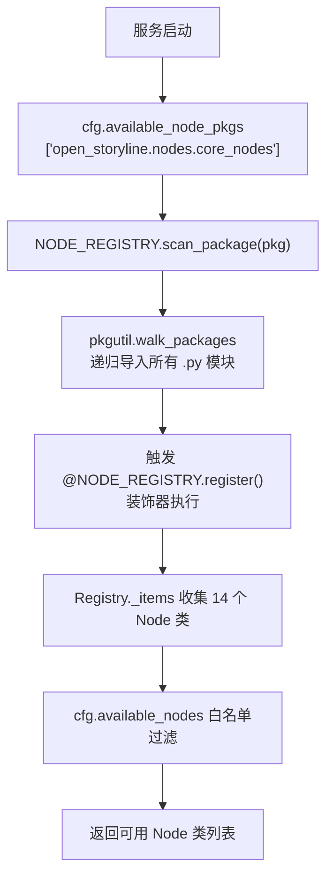
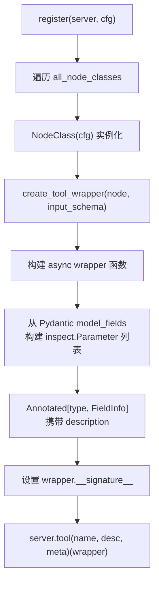

# PD-04.XX OpenStoryline — NODE_REGISTRY 装饰器注册与 FastMCP 工具桥接

> 文档编号：PD-04.XX
> 来源：OpenStoryline `src/open_storyline/utils/register.py`, `src/open_storyline/mcp/register_tools.py`
> GitHub：https://github.com/FireRedTeam/FireRed-OpenStoryline.git
> 问题域：PD-04 工具系统 Tool System Design
> 状态：可复用方案

---

## 第 1 章 问题与动机

### 1.1 核心问题

视频创作 Agent 需要编排 14 个视频处理节点（加载媒体、镜头分割、理解画面、生成文案、配音、BGM 选择、渲染等），每个节点有独立的输入 Schema、前置依赖和执行优先级。核心挑战：

1. **节点发现与注册**：如何让新增节点自动被系统发现，无需手动修改注册表
2. **Node → MCP Tool 桥接**：节点是 Python 类（含 `process()` 异步方法），但 MCP 协议要求的是带 JSON Schema 参数的函数——如何自动转换
3. **配置驱动的工具集**：不同部署场景需要不同的节点子集，如何通过 TOML 配置控制
4. **会话状态注入**：每个工具调用需要 session_id、artifact_id、LLM 客户端等运行时上下文，如何透明注入

### 1.2 OpenStoryline 的解法概述

1. **装饰器 + 全局注册表**：`NODE_REGISTRY.register()` 装饰器自动将 Node 类注册到全局 `Registry` 实例（`register.py:73`）
2. **包扫描触发注册**：`scan_package()` 通过 `pkgutil.walk_packages` 递归导入包内所有模块，触发装饰器执行（`register.py:53-69`）
3. **工厂函数桥接**：`create_tool_wrapper()` 将 BaseNode 实例转为 FastMCP 兼容的 async 函数，动态构建 `inspect.Signature`（`register_tools.py:21-89`）
4. **TOML 配置过滤**：`available_node_pkgs` 控制扫描哪些包，`available_nodes` 控制注册哪些节点（`config.toml:58-66`）
5. **NodeState 上下文注入**：每次工具调用时从 MCP Context 提取 session_id，构造 `NodeState` 传入节点（`register_tools.py:28-54`）

### 1.3 设计思想

| 设计原则 | 具体实现 | 理由 | 替代方案 |
|----------|----------|------|----------|
| 装饰器即注册 | `@NODE_REGISTRY.register()` 类装饰器 | 节点定义与注册同处一文件，零遗漏 | 集中式注册表文件（需手动维护） |
| 包扫描自动发现 | `pkgutil.walk_packages` 递归导入 | 新增节点只需放入指定包，无需改配置 | `importlib.resources` 或手动 import |
| 签名动态构建 | `inspect.Parameter` + `Annotated` 携带 Field 描述 | FastMCP 从签名自动生成 JSON Schema | 手写 JSON Schema dict |
| 配置驱动工具集 | TOML `available_nodes` 白名单 | 不同部署场景灵活裁剪工具集 | 环境变量或代码分支 |
| 模板方法执行 | `BaseNode.__call__` 统一 load→parse→process→pack 流程 | 所有节点共享 I/O 序列化逻辑 | 每个节点自行处理 I/O |

---

## 第 2 章 源码实现分析

### 2.1 架构概览

```
┌─────────────────────────────────────────────────────────────────┐
│                        FastMCP Server                           │
│  server.py:38-43  FastMCP(name, lifespan=session_lifespan)     │
├─────────────────────────────────────────────────────────────────┤
│                     register_tools.register()                   │
│  ┌──────────────┐    ┌──────────────────┐    ┌──────────────┐  │
│  │ scan_package │───→│  NODE_REGISTRY   │───→│ create_tool_  │  │
│  │ (pkgutil)    │    │  ._items{14个}   │    │ wrapper()     │  │
│  └──────────────┘    └──────────────────┘    └──────┬───────┘  │
│                                                      │          │
│  ┌──────────────────────────────────────────────────┐│          │
│  │  server.tool(name, description, meta)(wrapper)   ││          │
│  └──────────────────────────────────────────────────┘│          │
├──────────────────────────────────────────────────────┤          │
│                    特殊工具（手动注册）                 │          │
│  read_node_history  |  write_skills                  │          │
└─────────────────────────────────────────────────────────────────┘
                              │
                              ▼
┌─────────────────────────────────────────────────────────────────┐
│                      BaseNode.__call__()                        │
│  load_inputs_from_client → _parse_input → process/default      │
│  → _combine_tool_outputs → pack_outputs_to_client              │
│  → {artifact_id, summary, tool_excute_result, isError}         │
└─────────────────────────────────────────────────────────────────┘
```

### 2.2 核心实现

#### 2.2.1 Registry 装饰器与包扫描



对应源码 `src/open_storyline/utils/register.py:7-73`：

```python
class Registry:
    def __init__(self):
        self._items = {}

    def register(self, name: Optional[str] = None, override: bool = False):
        def decorator(cls):
            reg_name = name or f"{cls.__name__}"
            if reg_name in self._items:
                if override:
                    print(f"[Registry] {reg_name} already registered, override=True -> replacing")
                else:
                    raise KeyError(f"[Registry] {reg_name} already registered, override=False")
            self._items[reg_name] = cls
            return cls
        return decorator

    def scan_package(self, package_name: str):
        package = importlib.import_module(package_name)
        if not hasattr(package, "__path__"):
            return
        for finder, modname, ispkg in pkgutil.walk_packages(
            package.__path__, package.__name__ + "."
        ):
            importlib.import_module(modname)

NODE_REGISTRY = Registry()
```

关键设计：`register()` 默认用 `cls.__name__` 作为注册名，与 TOML 中 `available_nodes` 的类名一一对应。`override=False` 防止同名节点意外覆盖。

#### 2.2.2 Node → MCP Tool 工厂函数



对应源码 `src/open_storyline/mcp/register_tools.py:21-113`：

```python
def create_tool_wrapper(node: BaseNode, input_schema: type[BaseModel]):
    meta = node.meta if hasattr(node, 'meta') else None

    async def wrapper(mcp_ctx: Context, **kwargs) -> dict:
        request = mcp_ctx.request_context.request
        session_id = headers.get('X-Storyline-Session-Id')
        # 会话清理
        session_manager = mcp_ctx.request_context.lifespan_context
        if hasattr(session_manager, 'cleanup_expired_sessions'):
            session_manager.cleanup_expired_sessions(session_id)
        # 构造 NodeState
        node_state = NodeState(
            session_id=session_id,
            artifact_id=params['artifact_id'],
            lang=params.get('lang', 'zh'),
            node_summary=NodeSummary(),
            llm=make_llm(mcp_ctx),
            mcp_ctx=mcp_ctx,
        )
        result = await node(node_state, **params)
        return result

    # 动态签名构建
    new_params = [inspect.Parameter('mcp_ctx', inspect.Parameter.POSITIONAL_OR_KEYWORD, annotation=Context)]
    if input_schema:
        for field_name, field_info in input_schema.model_fields.items():
            annotation = Annotated[field_info.annotation, field_info]
            new_params.append(inspect.Parameter(
                field_name, inspect.Parameter.KEYWORD_ONLY,
                default=field_info.default if field_info.default is not ... else inspect.Parameter.empty,
                annotation=annotation
            ))
    wrapper.__name__ = meta.name
    wrapper.__doc__ = meta.description
    wrapper.__signature__ = inspect.Signature(new_params)
    return wrapper, meta

def register(server: FastMCP, cfg: Settings) -> None:
    for pkg in cfg.local_mcp_server.available_node_pkgs:
        NODE_REGISTRY.scan_package(pkg)
    all_node_classes = [NODE_REGISTRY.get(name=n) for n in cfg.local_mcp_server.available_nodes]
    for NodeClass in all_node_classes:
        node_instance = NodeClass(cfg)
        tool_func, meta = create_tool_wrapper(node_instance, node_instance.input_schema)
        server.tool(name=NodeClass.meta.name, description=NodeClass.meta.description, meta=asdict(meta))(tool_func)
```

核心技巧：用 `Annotated[field_info.annotation, field_info]` 将 Pydantic FieldInfo 嵌入类型注解，FastMCP 会自动从中提取 `description` 生成 JSON Schema。

### 2.3 实现细节

#### BaseNode 模板方法与 I/O 序列化

`BaseNode.__call__()` 实现了统一的 5 步执行流程（`base_node.py:206-245`）：

1. `load_inputs_from_client()` — 递归遍历参数，将 base64 编码的媒体文件解压到服务端缓存目录
2. `_parse_input()` — 子类可覆盖的参数预处理钩子
3. `process()` / `default_process()` — 根据 `mode` 参数选择主处理或默认处理（跳过节点时用 default）
4. `_combine_tool_outputs()` — 子类可覆盖的输出后处理钩子
5. `pack_outputs_to_client()` — 将服务端文件重新压缩为 base64 返回客户端

异常处理：`developer_mode=True` 时返回完整 traceback，否则返回 NodeSummary 摘要。

#### NodeMeta 工作流元数据

每个节点通过 `NodeMeta` 声明工作流拓扑（`base_node.py:20-50`）：

- `require_prior_kind`：主处理所需的前置节点类型
- `default_require_prior_kind`：默认处理所需的前置节点类型（更少）
- `next_available_node`：下游可达节点列表
- `priority`：同类型节点的优先级排序

`NodeManager`（`node_manager.py:11-169`）消费这些元数据，构建 kind→node_ids 索引和反向依赖图，支持运行时检查节点是否可执行（`check_excutable()`）。

#### MCP Sampling 协议复用 LLM

节点通过 `node_state.llm.complete()` 调用 LLM，底层走 MCP Sampling 协议（`sampling_requester.py:46-116`）：

```python
# MCPSampler 通过 MCP session 发起 LLM 调用
result = await self._mcp_ctx.session.create_message(
    messages=messages, max_tokens=max_tokens,
    system_prompt=system_prompt, temperature=temperature,
    metadata=merged_metadata,
)
```

多模态支持：`SamplingLLMClient.complete()` 将 `media` 路径列表透传到 `metadata["media"]`（`sampling_requester.py:149`），由 MCP Host 端负责 base64 编码。

#### 分层日志系统

`NodeSummary`（`node_summary.py:19-236`）提供 5 级日志：

- `add_error()` / `add_warning()` — 错误和警告，面向 LLM
- `info_for_llm()` — 详细信息，面向 LLM 决策
- `info_for_user()` — 简要信息，面向终端用户
- `debug_for_dev()` — 调试信息，面向开发者

`get_summary()` 按配置的 `summary_levels` 聚合日志，附带 `preview_urls` 和 `artifact_id`，作为工具返回值的一部分。


---

## 第 3 章 迁移指南

### 3.1 迁移清单

**阶段 1：基础注册表（1 个文件）**
- [ ] 复制 `Registry` 类，创建全局 `TOOL_REGISTRY` 实例
- [ ] 为你的工具基类添加 `@TOOL_REGISTRY.register()` 装饰器

**阶段 2：工具基类（1 个文件）**
- [ ] 定义 `BaseTool` 抽象类，含 `meta`（ToolMeta）和 `input_schema`（Pydantic BaseModel）
- [ ] 实现 `__call__` 模板方法：validate → process → format_output

**阶段 3：MCP 桥接（1 个文件）**
- [ ] 实现 `create_tool_wrapper()` 工厂函数
- [ ] 用 `inspect.Parameter` + `Annotated` 动态构建函数签名
- [ ] 调用 `server.tool()` 注册

**阶段 4：配置驱动（TOML/YAML）**
- [ ] 添加 `available_tool_pkgs` 和 `available_tools` 配置项
- [ ] 在启动时调用 `TOOL_REGISTRY.scan_package()` + 白名单过滤

### 3.2 适配代码模板

```python
"""可直接复用的 Registry + MCP 桥接模板"""
import pkgutil
import importlib
import inspect
from typing import Optional, Annotated
from abc import ABC, abstractmethod
from dataclasses import dataclass, asdict
from pydantic import BaseModel, Field
from mcp.server.fastmcp import FastMCP, Context


# ---- 1. 通用注册表 ----
class Registry:
    def __init__(self):
        self._items = {}

    def register(self, name: Optional[str] = None, override: bool = False):
        def decorator(cls):
            reg_name = name or cls.__name__
            if reg_name in self._items and not override:
                raise KeyError(f"{reg_name} already registered")
            self._items[reg_name] = cls
            return cls
        return decorator

    def get(self, name: str, default=None):
        return self._items.get(name, default)

    def list_all(self):
        return list(self._items.keys())

    def scan_package(self, package_name: str):
        package = importlib.import_module(package_name)
        if not hasattr(package, "__path__"):
            return
        for _, modname, _ in pkgutil.walk_packages(
            package.__path__, package.__name__ + "."
        ):
            importlib.import_module(modname)

TOOL_REGISTRY = Registry()


# ---- 2. 工具基类 ----
@dataclass
class ToolMeta:
    name: str
    description: str
    tool_id: str
    category: str = "general"

class BaseTool(ABC):
    meta: ToolMeta
    input_schema: type[BaseModel] | None = None

    @abstractmethod
    async def process(self, context: dict, inputs: dict) -> dict:
        ...

    async def __call__(self, context: dict, **params) -> dict:
        try:
            result = await self.process(context, params)
            return {"result": result, "is_error": False}
        except Exception as e:
            return {"error": str(e), "is_error": True}


# ---- 3. MCP 桥接工厂 ----
def create_mcp_wrapper(tool: BaseTool, input_schema: type[BaseModel] | None):
    async def wrapper(mcp_ctx: Context, **kwargs) -> dict:
        context = {"mcp_ctx": mcp_ctx}  # 注入你需要的运行时上下文
        return await tool(context, **kwargs)

    # 动态签名
    params = [inspect.Parameter("mcp_ctx", inspect.Parameter.POSITIONAL_OR_KEYWORD, annotation=Context)]
    annotations = {"mcp_ctx": Context}
    if input_schema:
        for fname, finfo in input_schema.model_fields.items():
            ann = Annotated[finfo.annotation, finfo]
            params.append(inspect.Parameter(
                fname, inspect.Parameter.KEYWORD_ONLY,
                default=finfo.default if finfo.default is not ... else inspect.Parameter.empty,
                annotation=ann,
            ))
            annotations[fname] = ann

    wrapper.__name__ = tool.meta.name
    wrapper.__doc__ = tool.meta.description
    wrapper.__signature__ = inspect.Signature(params)
    wrapper.__annotations__ = annotations
    return wrapper


# ---- 4. 注册入口 ----
def register_all_tools(server: FastMCP, packages: list[str], whitelist: list[str]):
    for pkg in packages:
        TOOL_REGISTRY.scan_package(pkg)
    for tool_name in whitelist:
        ToolClass = TOOL_REGISTRY.get(tool_name)
        if ToolClass is None:
            continue
        tool = ToolClass()
        wrapper = create_mcp_wrapper(tool, tool.input_schema)
        server.tool(name=tool.meta.name, description=tool.meta.description)(wrapper)
```

### 3.3 适用场景

| 场景 | 适用度 | 说明 |
|------|--------|------|
| 多步骤处理管道（视频/文档/数据） | ⭐⭐⭐ | 每个步骤是独立 Node，天然适配 |
| 插件式工具扩展 | ⭐⭐⭐ | 第三方只需 `@REGISTRY.register()` + 放入指定包 |
| 单一工具的 MCP 暴露 | ⭐⭐ | 工厂函数仍有用，但注册表略显多余 |
| 需要热重载工具的场景 | ⭐ | `scan_package` 是启动时一次性的，不支持运行时热加载 |

---

## 第 4 章 测试用例

```python
import pytest
from unittest.mock import AsyncMock, MagicMock, patch
from dataclasses import dataclass
from typing import Optional
from pydantic import BaseModel, Field


# ---- 测试 Registry ----
class TestRegistry:
    def setup_method(self):
        from open_storyline.utils.register import Registry
        self.registry = Registry()

    def test_register_and_get(self):
        @self.registry.register()
        class MyTool:
            pass
        assert self.registry.get("MyTool") is MyTool
        assert "MyTool" in self.registry.list()

    def test_register_custom_name(self):
        @self.registry.register(name="custom_tool")
        class AnotherTool:
            pass
        assert self.registry.get("custom_tool") is AnotherTool
        assert self.registry.get("AnotherTool") is None

    def test_duplicate_register_raises(self):
        @self.registry.register()
        class DupTool:
            pass
        with pytest.raises(KeyError, match="already registered"):
            @self.registry.register()
            class DupTool:
                pass

    def test_override_register(self):
        @self.registry.register()
        class OverTool:
            version = 1
        @self.registry.register(override=True)
        class OverTool:
            version = 2
        assert self.registry.get("OverTool").version == 2

    def test_scan_package(self):
        """scan_package 应递归导入包内所有模块"""
        self.registry.scan_package("open_storyline.nodes.core_nodes")
        assert len(self.registry) >= 14  # 至少 14 个核心节点


# ---- 测试 create_tool_wrapper 签名构建 ----
class TestToolWrapper:
    def test_wrapper_signature_matches_schema(self):
        """wrapper 的签名应包含 input_schema 的所有字段"""
        import inspect
        from open_storyline.mcp.register_tools import create_tool_wrapper
        from open_storyline.nodes.core_nodes.base_node import BaseNode, NodeMeta

        class MockInput(BaseModel):
            query: str = Field(description="搜索关键词")
            limit: int = Field(default=10, description="返回数量")

        class MockNode(BaseNode):
            meta = NodeMeta(name="mock", description="mock tool", node_id="mock", node_kind="mock")
            input_schema = MockInput
            async def process(self, node_state, inputs): return {}
            async def default_process(self, node_state, inputs): return {}

        node = MockNode.__new__(MockNode)
        node.meta = MockNode.meta
        wrapper, meta = create_tool_wrapper(node, MockInput)

        sig = inspect.signature(wrapper)
        param_names = list(sig.parameters.keys())
        assert "mcp_ctx" in param_names
        assert "query" in param_names
        assert "limit" in param_names
        assert sig.parameters["limit"].default == 10

    def test_wrapper_name_and_doc(self):
        """wrapper 的 __name__ 和 __doc__ 应来自 NodeMeta"""
        from open_storyline.mcp.register_tools import create_tool_wrapper
        from open_storyline.nodes.core_nodes.base_node import BaseNode, NodeMeta

        class MockNode(BaseNode):
            meta = NodeMeta(name="test_tool", description="A test tool", node_id="t", node_kind="t")
            input_schema = None
            async def process(self, ns, i): return {}
            async def default_process(self, ns, i): return {}

        node = MockNode.__new__(MockNode)
        node.meta = MockNode.meta
        wrapper, _ = create_tool_wrapper(node, None)
        assert wrapper.__name__ == "test_tool"
        assert wrapper.__doc__ == "A test tool"


# ---- 测试 BaseNode.__call__ 异常处理 ----
class TestBaseNodeCall:
    @pytest.mark.asyncio
    async def test_process_error_returns_isError(self):
        """process 抛异常时应返回 isError=True"""
        from open_storyline.nodes.core_nodes.base_node import BaseNode, NodeMeta
        from open_storyline.nodes.node_state import NodeState

        class FailNode(BaseNode):
            meta = NodeMeta(name="fail", description="", node_id="fail", node_kind="fail")
            input_schema = None
            async def process(self, ns, i): raise RuntimeError("boom")
            async def default_process(self, ns, i): return {}

        node = FailNode.__new__(FailNode)
        node.meta = FailNode.meta
        node.server_cfg = MagicMock()
        node.server_cfg.developer.developer_mode = False
        node.server_cache_dir = "/tmp"

        mock_state = MagicMock(spec=NodeState)
        mock_state.session_id = "s1"
        mock_state.artifact_id = "a1"
        mock_state.node_summary = MagicMock()
        mock_state.node_summary.get_summary.return_value = {"INFO_USER": "error"}

        result = await node(mock_state, mode="auto")
        assert result["isError"] is True
```


---

## 第 5 章 跨域关联

| 关联域 | 关系类型 | 说明 |
|--------|----------|------|
| PD-01 上下文管理 | 协同 | `NodeSummary` 分层日志控制返回给 LLM 的信息量，`info_for_llm` vs `info_for_user` 是上下文预算管理的一种形式 |
| PD-02 多 Agent 编排 | 依赖 | `NodeMeta.require_prior_kind` + `next_available_node` 定义了节点间的 DAG 拓扑，`NodeManager` 负责依赖检查和执行顺序编排 |
| PD-03 容错与重试 | 协同 | `BaseNode.__call__` 的 try/except 包裹 + `developer_mode` 分级错误返回；`default_process` 提供节点跳过时的降级路径 |
| PD-06 记忆持久化 | 依赖 | `ArtifactStore` 持久化每个节点的执行结果，`read_node_history` 工具允许 Agent 查询历史 artifact |
| PD-10 中间件管道 | 协同 | `BaseNode.__call__` 的 load→parse→process→combine→pack 五步流程本质是一个微型管道，`_parse_input` 和 `_combine_tool_outputs` 是可覆盖的钩子 |
| PD-11 可观测性 | 协同 | `NodeSummary` 的 5 级日志 + artifact 追踪提供了工具级可观测性，`get_summary()` 聚合后随工具结果返回 |

---

## 第 6 章 来源文件索引

| 文件 | 行范围 | 关键实现 |
|------|--------|----------|
| `src/open_storyline/utils/register.py` | L7-L73 | Registry 类 + NODE_REGISTRY 全局实例 |
| `src/open_storyline/mcp/register_tools.py` | L21-L89 | create_tool_wrapper 工厂函数 |
| `src/open_storyline/mcp/register_tools.py` | L92-L113 | register() 主注册流程 |
| `src/open_storyline/mcp/register_tools.py` | L117-L191 | read_node_history + write_skills 特殊工具 |
| `src/open_storyline/mcp/server.py` | L15-L55 | FastMCP 服务创建 + session lifespan |
| `src/open_storyline/nodes/core_nodes/base_node.py` | L19-L50 | NodeMeta 数据类 |
| `src/open_storyline/nodes/core_nodes/base_node.py` | L54-L245 | BaseNode 抽象基类 + __call__ 模板方法 |
| `src/open_storyline/nodes/node_state.py` | L9-L17 | NodeState 执行上下文 |
| `src/open_storyline/nodes/node_summary.py` | L19-L236 | NodeSummary 5 级分层日志 |
| `src/open_storyline/nodes/node_manager.py` | L11-L169 | NodeManager 依赖图 + 可执行性检查 |
| `src/open_storyline/mcp/sampling_requester.py` | L46-L164 | MCPSampler + SamplingLLMClient |
| `src/open_storyline/nodes/core_nodes/load_media.py` | L110-L165 | LoadMediaNode 具体节点示例 |
| `src/open_storyline/nodes/core_nodes/generate_script.py` | L11-L143 | GenerateScriptNode 含 LLM 调用 |
| `src/open_storyline/config.py` | L113-L131 | MCPConfig（available_node_pkgs/available_nodes） |
| `config.toml` | L46-L66 | MCP Server 配置 + 节点白名单 |

---

## 第 7 章 横向对比维度

```json comparison_data
{
  "project": "OpenStoryline",
  "dimensions": {
    "工具注册方式": "装饰器 @NODE_REGISTRY.register() + pkgutil 包扫描自动发现",
    "Schema 生成方式": "Pydantic BaseModel → Annotated[type, FieldInfo] → inspect.Signature 动态构建",
    "MCP 协议支持": "FastMCP streamable-http 传输，server.tool() 注册，MCP Sampling 协议复用 LLM",
    "工具分组/权限": "TOML available_nodes 白名单过滤，无运行时权限控制",
    "工具上下文注入": "create_tool_wrapper 从 HTTP Header 提取 session_id 构造 NodeState",
    "参数校验": "Pydantic BaseModel input_schema + _validate_schema 方法",
    "生命周期追踪": "NodeSummary 5 级日志 + ArtifactStore 持久化执行结果",
    "工具优雅降级": "default_process 提供节点跳过时的降级路径，mode!=auto 触发",
    "工具条件加载": "TOML available_node_pkgs 控制扫描包，available_nodes 控制注册节点",
    "工具内业务校验": "BaseNode.load_inputs_from_client 递归处理 base64/dict/list 多类型参数",
    "依赖注入": "make_llm(mcp_ctx) 工厂函数注入 LLM 客户端到 NodeState",
    "工作流拓扑声明": "NodeMeta.require_prior_kind + next_available_node 声明式 DAG 依赖"
  }
}
```

### 域元数据补充

```json domain_metadata
{
  "solution_summary": "OpenStoryline 用 @NODE_REGISTRY.register() 装饰器 + pkgutil 包扫描自动发现 14 个视频处理 Node，通过 create_tool_wrapper 工厂函数将 Pydantic Schema 动态转为 FastMCP 函数签名",
  "description": "视频处理管道中节点到 MCP 工具的自动桥接与配置驱动裁剪",
  "sub_problems": [
    "节点拓扑声明：如何用 require_prior_kind + next_available_node 声明工作流 DAG 依赖",
    "MCP Sampling 协议复用：工具节点如何通过 MCP session.create_message 调用 LLM 而非直接调 API",
    "多模态媒体透传：工具如何将视频帧路径通过 metadata 透传给 MCP Host 处理 base64 编码",
    "工具返回分层摘要：如何用 info_for_llm/info_for_user 分离 LLM 和用户看到的工具执行摘要"
  ],
  "best_practices": [
    "用 Annotated[type, FieldInfo] 携带参数描述让 FastMCP 自动生成 JSON Schema，避免手写",
    "BaseNode.__call__ 模板方法统一 I/O 序列化，子类只需实现 process() 业务逻辑",
    "TOML 白名单 available_nodes 比代码分支更灵活地控制不同部署的工具集"
  ]
}
```

