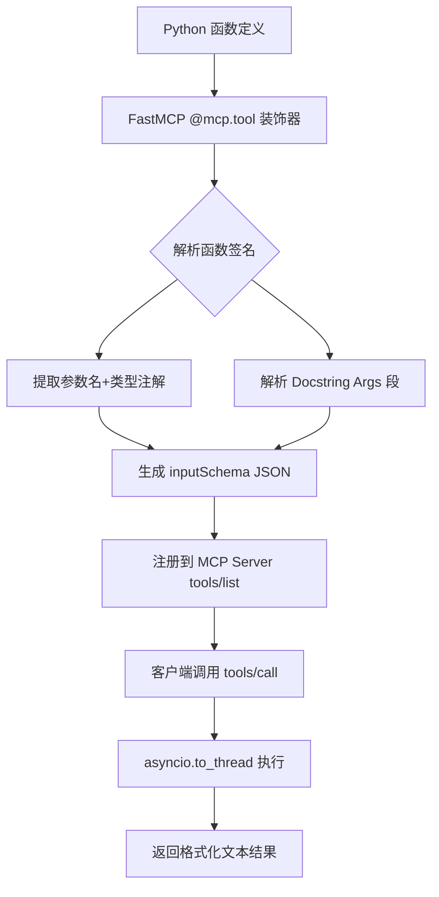
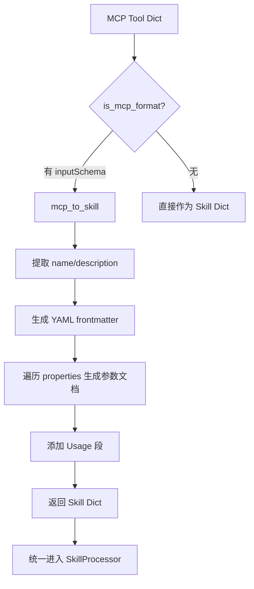
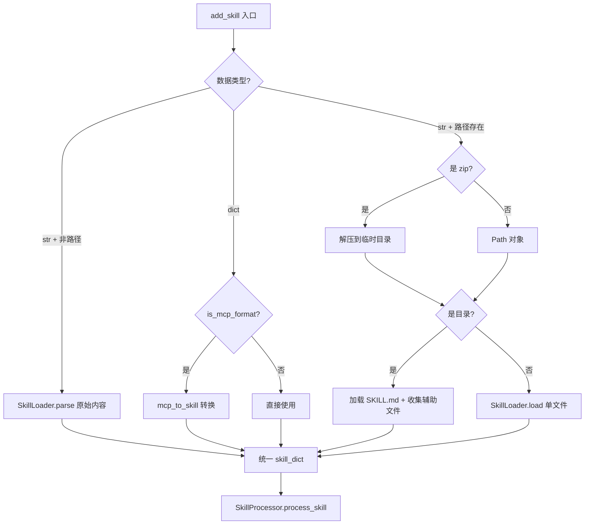

# PD-04.OV OpenViking — MCP RAG 工具暴露与 Skill 格式转换

> 文档编号：PD-04.OV
> 来源：OpenViking `openviking/core/mcp_converter.py`, `openviking/core/skill_loader.py`, `examples/mcp-query/server.py`
> GitHub：https://github.com/volcengine/OpenViking.git
> 问题域：PD-04 工具系统 Tool System Design
> 状态：可复用方案

---

## 第 1 章 问题与动机

### 1.1 核心问题

Agent 工具系统面临一个根本矛盾：**工具定义格式碎片化**。MCP 协议用 `inputSchema` JSON Schema 描述工具，Claude Code 用 SKILL.md（YAML frontmatter + Markdown body）描述技能，LangChain/OpenAI 用 Function Calling JSON 描述函数。一个 RAG 引擎想同时服务这三种消费者，就需要一套格式转换与统一注册机制。

OpenViking 作为火山引擎的开源 RAG 引擎，核心能力是向量检索 + LLM 生成。它面临的具体问题是：
- 如何将 RAG 能力（query/search/add_resource）暴露为标准 MCP 工具，让 Claude Desktop 等 MCP 客户端直接调用？
- 如何将外部 MCP 工具定义自动转换为内部 Skill 格式，统一存储和检索？
- 如何让 Agent 通过语义搜索发现可用技能，而非硬编码工具列表？

### 1.2 OpenViking 的解法概述

1. **FastMCP 装饰器注册**：用 `@mcp.tool()` 装饰器将 Python 函数直接暴露为 MCP 工具，Docstring 即 Schema（`examples/mcp-query/server.py:64-72`）
2. **MCP→Skill 格式转换器**：`mcp_to_skill()` 将 MCP 的 `inputSchema` JSON 转为 YAML frontmatter + Markdown 的 SKILL.md 格式（`openviking/core/mcp_converter.py:8-55`）
3. **四格式统一入口**：`SkillProcessor._parse_skill()` 接受目录/文件/字符串/字典四种输入，自动检测 MCP 格式并转换（`openviking/utils/skill_processor.py:116-158`）
4. **viking:// URI 命名空间**：所有技能存储在 `viking://agent/skills/{name}` 下，通过向量索引实现语义发现（`openviking/utils/skill_processor.py:66`）
5. **ToolPart 生命周期追踪**：`pending→running→completed→error` 四态追踪工具执行状态（`openviking/message/part.py:34-47`）

### 1.3 设计思想

| 设计原则 | 具体实现 | 理由 | 替代方案 |
|----------|----------|------|----------|
| Docstring 即 Schema | FastMCP 从函数签名+docstring 自动生成 inputSchema | 零冗余，代码即文档 | 手写 JSON Schema（易过时） |
| 格式自动检测 | `is_mcp_format()` 检查 `inputSchema` 字段判断格式 | 调用方无需指定格式 | 显式 format 参数（增加认知负担） |
| URI 统一寻址 | `viking://agent/skills/{name}` 命名空间 | 技能与资源/记忆共用同一寻址体系 | 独立 skill_id 表（需额外映射） |
| 向量语义发现 | 技能 description 向量化后可被 `find()` 语义搜索 | Agent 不需要知道精确工具名 | 关键词匹配（召回率低） |
| 异步线程桥接 | `asyncio.to_thread()` 包装同步 RAG 调用 | 不阻塞 MCP 事件循环 | 全异步改造（改动量大） |

---

## 第 2 章 源码实现分析

### 2.1 架构概览

OpenViking 的工具系统分为三层：MCP 暴露层、格式转换层、统一存储层。

```
┌─────────────────────────────────────────────────────────────┐
│                    MCP 客户端（Claude Desktop / CLI）          │
└──────────────────────────┬──────────────────────────────────┘
                           │ MCP Protocol (HTTP/stdio)
┌──────────────────────────▼──────────────────────────────────┐
│  MCP 暴露层                                                  │
│  ┌──────────────┐  ┌──────────────┐  ┌──────────────────┐   │
│  │ query()      │  │ search()     │  │ add_resource()   │   │
│  │ RAG 全流程    │  │ 语义检索      │  │ 文档入库          │   │
│  └──────┬───────┘  └──────┬───────┘  └────────┬─────────┘   │
│         │ asyncio.to_thread()                  │             │
│  ┌──────▼──────────────────▼──────────────────▼─────────┐   │
│  │              Recipe (RAG Pipeline)                     │   │
│  │  search() → context → call_llm() → answer            │   │
│  └───────────────────────┬───────────────────────────────┘   │
└──────────────────────────┼──────────────────────────────────┘
                           │
┌──────────────────────────▼──────────────────────────────────┐
│  格式转换层                                                  │
│  ┌─────────────────┐    ┌─────────────────────────────┐     │
│  │ mcp_converter   │    │ skill_loader                │     │
│  │ MCP→Skill 转换   │◄──│ SKILL.md 解析/序列化         │     │
│  └─────────────────┘    └─────────────────────────────┘     │
└──────────────────────────┬──────────────────────────────────┘
                           │
┌──────────────────────────▼──────────────────────────────────┐
│  统一存储层                                                  │
│  ┌──────────────────┐  ┌──────────────────────────────┐     │
│  │ VikingFS         │  │ VikingDB (向量索引)           │     │
│  │ viking://agent/  │  │ 语义搜索 + 嵌入              │     │
│  │   skills/{name}  │  │                              │     │
│  └──────────────────┘  └──────────────────────────────┘     │
└─────────────────────────────────────────────────────────────┘
```

### 2.2 核心实现

#### 2.2.1 MCP 工具注册：Docstring 即 Schema



对应源码 `examples/mcp-query/server.py:49-119`：

```python
def create_server(host: str = "127.0.0.1", port: int = 2033) -> FastMCP:
    mcp = FastMCP(
        name="openviking-mcp",
        instructions=(
            "OpenViking MCP Server provides RAG capabilities. "
            "Use 'query' for full RAG answers, 'search' for semantic search only, "
            "and 'add_resource' to ingest new documents."
        ),
        host=host, port=port,
        stateless_http=True, json_response=True,
    )

    @mcp.tool()
    async def query(
        question: str,
        top_k: int = 5,
        temperature: float = 0.7,
        max_tokens: int = 2048,
        score_threshold: float = 0.2,
        system_prompt: str = "",
    ) -> str:
        """Ask a question and get an answer using RAG.
        Args:
            question: The question to ask.
            top_k: Number of search results to use as context (1-20, default: 5).
            ...
        """
        def _query_sync():
            recipe = _get_recipe()
            return recipe.query(user_query=question, search_top_k=top_k, ...)
        result = await asyncio.to_thread(_query_sync)
        # 格式化：answer + sources + timings
        output = result["answer"]
        if result["context"]:
            output += "\n\n---\nSources:\n"
            for i, ctx in enumerate(result["context"], 1):
                output += f"  {i}. {filename} (relevance: {ctx['score']:.4f})\n"
        return output
```

关键设计点：
- `stateless_http=True`：无状态 HTTP 传输，适合横向扩展（`server.py:60`）
- `json_response=True`：强制 JSON 响应格式（`server.py:61`）
- `asyncio.to_thread()`：同步 Recipe 调用包装为异步，避免阻塞 MCP 事件循环（`server.py:99`）
- 结果格式化包含 sources 和 timings，LLM 可直接引用来源（`server.py:101-117`）

#### 2.2.2 MCP→Skill 格式转换



对应源码 `openviking/core/mcp_converter.py:8-55`：

```python
def mcp_to_skill(mcp_config: Dict[str, Any]) -> Dict[str, Any]:
    """Convert MCP tool definition to Skill format with YAML frontmatter."""
    name = mcp_config.get("name", "unnamed-tool").replace("_", "-")
    description = mcp_config.get("description", "")
    input_schema = mcp_config.get("inputSchema", {})

    # Build YAML frontmatter
    frontmatter_parts = ["---\n", f"name: {name}\n", f"description: {description}\n", "---\n\n"]

    # Build markdown body with parameters
    body_parts = [f"# {name}\n\n"]
    if input_schema and input_schema.get("properties"):
        body_parts.append("\n## Parameters\n\n")
        properties = input_schema.get("properties", {})
        required = input_schema.get("required", [])
        for param_name, param_info in properties.items():
            param_type = param_info.get("type", "any")
            param_desc = param_info.get("description", "")
            is_required = param_name in required
            required_str = " (required)" if is_required else " (optional)"
            body_parts.append(f"- **{param_name}** ({param_type}){required_str}: {param_desc}\n")

    content = "".join(frontmatter_parts) + "".join(body_parts)
    return {"name": name, "description": description, "content": content}
```

名称归一化：`replace("_", "-")` 将 MCP 的下划线命名转为 Skill 的连字符命名（`mcp_converter.py:10`）。

#### 2.2.3 四格式统一解析



对应源码 `openviking/utils/skill_processor.py:116-158`：

```python
def _parse_skill(self, data: Any) -> tuple[Dict[str, Any], List[Path], Optional[Path]]:
    auxiliary_files = []
    base_path = None

    if isinstance(data, str):
        path_obj = Path(data)
        if path_obj.exists():
            if zipfile.is_zipfile(path_obj):
                temp_dir = Path(tempfile.mkdtemp())
                with zipfile.ZipFile(path_obj, "r") as zipf:
                    zipf.extractall(temp_dir)
                data = temp_dir
            else:
                data = path_obj

    if isinstance(data, Path):
        if data.is_dir():
            skill_file = data / "SKILL.md"
            if not skill_file.exists():
                raise ValueError(f"SKILL.md not found in {data}")
            skill_dict = SkillLoader.load(str(skill_file))
            base_path = data
            for item in data.rglob("*"):
                if item.is_file() and item.name != "SKILL.md":
                    auxiliary_files.append(item)
        else:
            skill_dict = SkillLoader.load(str(data))
    elif isinstance(data, str):
        skill_dict = SkillLoader.parse(data)
    elif isinstance(data, dict):
        if is_mcp_format(data):
            skill_dict = mcp_to_skill(data)
        else:
            skill_dict = data
    else:
        raise ValueError(f"Unsupported data type: {type(data)}")

    return skill_dict, auxiliary_files, base_path
```

### 2.3 实现细节

**ToolPart 生命周期追踪**（`openviking/message/part.py:34-47`）：

每次工具调用在 Session 中创建一个 ToolPart，包含：
- `tool_uri`：`viking://session/{id}/tools/{tool_id}` — 会话级工具实例
- `skill_uri`：`viking://agent/skills/{skill_name}` — 全局技能定义
- `tool_status`：`pending → running → completed → error` 四态

**向量语义发现**（`openviking/utils/skill_processor.py:82-107`）：

技能注册时，description 被向量化并写入 VikingDB：
```python
context.set_vectorize(Vectorize(text=context.abstract))
# ...
embedding_msg = EmbeddingMsgConverter.from_context(context)
await self.vikingdb.enqueue_embedding_msg(embedding_msg)
```

Agent 通过 `client.find(query="search functionality")` 语义搜索匹配技能，无需知道精确名称。

**双传输协议支持**（`examples/mcp-query/server.py:276-307`）：

MCP Server 同时支持 `streamable-http`（默认，适合远程调用）和 `stdio`（适合 Claude Desktop 本地集成），通过 `--transport` 参数切换。环境变量 `OV_CONFIG`/`OV_DATA`/`OV_PORT` 提供零参数启动能力。

**AGFS MCP Server 对比**（`third_party/agfs/agfs-mcp/src/agfs_mcp/server.py`）：

项目内还有第二个 MCP Server——AGFS MCP，暴露 16 个文件系统操作工具（ls/cat/write/mkdir/rm/stat/mv/grep/mount/unmount/health/cp/upload/download/notify/mounts）。与 OpenViking MCP 的区别：
- OpenViking MCP 用 FastMCP + 装饰器（高层 API），AGFS MCP 用 `mcp.server.Server` + `list_tools/call_tool` handler（低层 API）
- OpenViking MCP 3 个工具（RAG 聚焦），AGFS MCP 16 个工具（文件系统全覆盖）
- AGFS MCP 额外提供 `list_prompts` 注入架构介绍文档，作为 LLM 的上下文引导

---

## 第 3 章 迁移指南

### 3.1 迁移清单

**阶段 1：MCP 工具暴露（1 天）**
- [ ] 安装 `mcp[cli]` 和 `fastmcp` 依赖
- [ ] 为核心业务函数添加 `@mcp.tool()` 装饰器
- [ ] 用 `asyncio.to_thread()` 包装同步调用
- [ ] 配置双传输（HTTP + stdio）
- [ ] 添加 `openviking://status` 类似的 MCP Resource 用于健康检查

**阶段 2：Skill 格式转换（0.5 天）**
- [ ] 实现 `mcp_to_skill()` 转换函数
- [ ] 实现 `is_mcp_format()` 格式检测
- [ ] 定义 SKILL.md 的 YAML frontmatter 规范（name/description/allowed-tools/tags）

**阶段 3：统一注册与发现（1 天）**
- [ ] 实现 `SkillProcessor` 四格式解析入口
- [ ] 接入向量数据库实现语义发现
- [ ] 定义 URI 命名空间（如 `your-app://skills/{name}`）

### 3.2 适配代码模板

#### 模板 1：FastMCP 快速暴露业务函数

```python
"""将任意业务函数暴露为 MCP 工具的最小模板"""
import asyncio
from mcp.server.fastmcp import FastMCP

mcp = FastMCP(
    name="my-service-mcp",
    instructions="My service description for LLM context.",
    host="127.0.0.1",
    port=8080,
    stateless_http=True,
    json_response=True,
)

# 你的同步业务函数
def _business_logic(query: str, limit: int = 10) -> dict:
    """实际业务逻辑（同步）"""
    return {"results": [], "count": 0}

@mcp.tool()
async def my_tool(
    query: str,
    limit: int = 10,
) -> str:
    """Search my service for relevant data.

    Args:
        query: The search query.
        limit: Maximum results to return (1-100, default: 10).
    """
    result = await asyncio.to_thread(_business_logic, query, limit)
    # 格式化为 LLM 可读文本
    return f"Found {result['count']} results:\n" + "\n".join(
        f"  {i+1}. {r}" for i, r in enumerate(result["results"])
    )

if __name__ == "__main__":
    mcp.run(transport="streamable-http")
```

#### 模板 2：MCP→Skill 格式转换器

```python
"""MCP 工具定义到 SKILL.md 格式的转换器"""
import re
from typing import Any, Dict, Optional, Tuple
import yaml

def mcp_to_skill(mcp_config: Dict[str, Any]) -> Dict[str, Any]:
    """将 MCP inputSchema 转为 SKILL.md 格式"""
    name = mcp_config.get("name", "unnamed").replace("_", "-")
    desc = mcp_config.get("description", "")
    schema = mcp_config.get("inputSchema", {})

    # YAML frontmatter
    fm = f"---\nname: {name}\ndescription: {desc}\n---\n\n"

    # Markdown body
    body = f"# {name}\n\n{desc}\n"
    props = schema.get("properties", {})
    required = schema.get("required", [])
    if props:
        body += "\n## Parameters\n\n"
        for pname, pinfo in props.items():
            ptype = pinfo.get("type", "any")
            pdesc = pinfo.get("description", "")
            req = " (required)" if pname in required else " (optional)"
            body += f"- **{pname}** ({ptype}){req}: {pdesc}\n"

    return {"name": name, "description": desc, "content": fm + body}

def is_mcp_format(data: dict) -> bool:
    return isinstance(data, dict) and "inputSchema" in data
```

### 3.3 适用场景

| 场景 | 适用度 | 说明 |
|------|--------|------|
| RAG 引擎暴露为 MCP 工具 | ⭐⭐⭐ | 直接复用 FastMCP + asyncio.to_thread 模式 |
| 多格式工具统一注册 | ⭐⭐⭐ | 四格式解析 + 自动检测适合工具市场场景 |
| Agent 语义发现工具 | ⭐⭐⭐ | 向量索引 + find() 适合大工具集场景 |
| 高并发工具调用 | ⭐⭐ | stateless_http 支持横向扩展，但无内置限流 |
| 工具权限控制 | ⭐ | 当前无细粒度权限，需自行扩展 |

---

## 第 4 章 测试用例

基于 `tests/client/test_skill_management.py` 的真实测试模式：

```python
import pytest
from pathlib import Path
from openviking.core.mcp_converter import mcp_to_skill, is_mcp_format
from openviking.core.skill_loader import SkillLoader


class TestMCPConverter:
    """MCP→Skill 格式转换测试"""

    def test_mcp_to_skill_basic(self):
        """正常路径：标准 MCP 工具转换"""
        mcp_tool = {
            "name": "search_docs",
            "description": "Search documentation",
            "inputSchema": {
                "type": "object",
                "properties": {
                    "query": {"type": "string", "description": "Search query"},
                    "limit": {"type": "integer", "description": "Max results"},
                },
                "required": ["query"],
            },
        }
        result = mcp_to_skill(mcp_tool)
        assert result["name"] == "search-docs"  # 下划线→连字符
        assert "## Parameters" in result["content"]
        assert "(required)" in result["content"]
        assert "(optional)" in result["content"]

    def test_mcp_to_skill_no_params(self):
        """边界：无参数的 MCP 工具"""
        mcp_tool = {
            "name": "health_check",
            "description": "Check health",
            "inputSchema": {"type": "object", "properties": {}},
        }
        result = mcp_to_skill(mcp_tool)
        assert result["name"] == "health-check"
        assert "## Parameters" not in result["content"]

    def test_is_mcp_format_positive(self):
        assert is_mcp_format({"name": "t", "inputSchema": {}}) is True

    def test_is_mcp_format_negative(self):
        assert is_mcp_format({"name": "t", "description": "d"}) is False
        assert is_mcp_format("not a dict") is False


class TestSkillLoader:
    """SKILL.md 解析测试"""

    def test_load_valid_skill(self, tmp_path):
        """正常路径：标准 SKILL.md 解析"""
        skill_file = tmp_path / "SKILL.md"
        skill_file.write_text(
            "---\nname: test-skill\ndescription: A test\ntags:\n  - test\n---\n\n# Content\nBody here."
        )
        result = SkillLoader.load(str(skill_file))
        assert result["name"] == "test-skill"
        assert result["description"] == "A test"
        assert result["tags"] == ["test"]
        assert "Body here" in result["content"]

    def test_load_missing_name(self, tmp_path):
        """降级：缺少 name 字段应报错"""
        skill_file = tmp_path / "SKILL.md"
        skill_file.write_text("---\ndescription: no name\n---\n\nBody")
        with pytest.raises(ValueError, match="must have 'name'"):
            SkillLoader.load(str(skill_file))

    def test_load_no_frontmatter(self, tmp_path):
        """降级：无 frontmatter 应报错"""
        skill_file = tmp_path / "SKILL.md"
        skill_file.write_text("# Just markdown\nNo frontmatter here.")
        with pytest.raises(ValueError, match="must have YAML frontmatter"):
            SkillLoader.load(str(skill_file))

    def test_roundtrip(self):
        """往返：parse → to_skill_md → parse 应保持一致"""
        original = "---\nname: rt-skill\ndescription: Roundtrip test\n---\n\n# Content"
        parsed = SkillLoader.parse(original)
        regenerated = SkillLoader.to_skill_md(parsed)
        reparsed = SkillLoader.parse(regenerated)
        assert reparsed["name"] == parsed["name"]
        assert reparsed["description"] == parsed["description"]


class TestSkillProcessorParsing:
    """四格式统一解析测试"""

    def test_parse_mcp_dict(self):
        """MCP dict 自动检测并转换"""
        from openviking.utils.skill_processor import SkillProcessor
        processor = SkillProcessor(vikingdb=None)
        mcp_data = {
            "name": "mcp_tool",
            "description": "MCP tool",
            "inputSchema": {"type": "object", "properties": {"q": {"type": "string"}}},
        }
        skill_dict, aux_files, base_path = processor._parse_skill(mcp_data)
        assert skill_dict["name"] == "mcp-tool"
        assert len(aux_files) == 0

    def test_parse_skill_dict(self):
        """普通 dict 直接透传"""
        from openviking.utils.skill_processor import SkillProcessor
        processor = SkillProcessor(vikingdb=None)
        data = {"name": "plain", "description": "Plain skill"}
        skill_dict, _, _ = processor._parse_skill(data)
        assert skill_dict["name"] == "plain"
```

---

## 第 5 章 跨域关联

| 关联域 | 关系类型 | 说明 |
|--------|----------|------|
| PD-01 上下文管理 | 协同 | MCP 工具返回结果需要格式化控制 token 消耗，query 工具的 `max_tokens` 参数直接影响上下文窗口 |
| PD-06 记忆持久化 | 依赖 | Skill 存储在 VikingFS + VikingDB 中，技能注册本质上是一种记忆持久化操作 |
| PD-08 搜索与检索 | 依赖 | query/search 工具的核心是 RAG 检索管线，工具系统是检索能力的 MCP 封装层 |
| PD-11 可观测性 | 协同 | ToolPart 的 `tool_status` 四态追踪提供工具级可观测性，timings 数据支持性能分析 |
| PD-03 容错与重试 | 互补 | 当前 MCP Server 无内置重试机制，Recipe 的 search/call_llm 失败直接抛异常，需要 PD-03 方案补充 |

---

## 第 6 章 来源文件索引

| 文件 | 行范围 | 关键实现 |
|------|--------|----------|
| `examples/mcp-query/server.py` | L49-L119 | FastMCP 创建 + 3 个 RAG 工具注册（query/search/add_resource） |
| `examples/mcp-query/server.py` | L227-L307 | 双传输配置（HTTP/stdio）+ 环境变量支持 |
| `openviking/core/mcp_converter.py` | L8-L55 | MCP→Skill 格式转换核心逻辑 |
| `openviking/core/mcp_converter.py` | L58-L61 | `is_mcp_format()` 格式检测 |
| `openviking/core/skill_loader.py` | L12-L72 | SkillLoader 类：SKILL.md 解析/序列化/往返 |
| `openviking/utils/skill_processor.py` | L27-L114 | SkillProcessor：五步处理流水线（parse→overview→write→aux→index） |
| `openviking/utils/skill_processor.py` | L116-L158 | `_parse_skill()`：四格式统一解析入口 |
| `openviking/message/part.py` | L34-L47 | ToolPart 数据类：工具调用生命周期追踪 |
| `openviking/core/context.py` | L24-L37 | ContextType 枚举（SKILL/MEMORY/RESOURCE）+ ContextLevel（L0/L1/L2） |
| `examples/common/recipe.py` | L17-L248 | Recipe 类：RAG 管线（search→context→call_llm→answer） |
| `examples/skills/searching-context/SKILL.md` | 全文 | 搜索技能示例：Markdown 即工具文档 |
| `examples/skills/adding-memory/SKILL.md` | 全文 | 记忆添加技能示例 |
| `third_party/agfs/agfs-mcp/src/agfs_mcp/server.py` | L16-L733 | AGFS MCP Server：16 个文件系统工具 + Prompt 注入 |
| `tests/client/test_skill_management.py` | L11-L140 | 技能管理测试：文件/字符串/MCP/目录四种输入 |

---

## 第 7 章 横向对比维度

> **重要：** 本章用于自动填充 Butcher Wiki 的横向对比表。

```json comparison_data
{
  "project": "OpenViking",
  "dimensions": {
    "工具注册方式": "FastMCP @mcp.tool() 装饰器，Docstring 即 Schema",
    "MCP 协议支持": "双传输（streamable-http + stdio），stateless_http 模式",
    "Schema 生成方式": "函数签名+Docstring 自动生成 inputSchema",
    "工具分组/权限": "无细粒度权限，按 MCP Server 粒度隔离",
    "热更新/缓存": "Skill 向量索引支持动态 add_skill，无热重载",
    "超时保护": "add_resource 有 300s wait_processed 超时",
    "生命周期追踪": "ToolPart 四态（pending/running/completed/error）",
    "参数校验": "SkillLoader 校验 name/description 必填",
    "工具推荐策略": "向量语义搜索 find() 匹配最相关技能",
    "双层API架构": "OpenViking MCP（FastMCP 高层）+ AGFS MCP（Server 低层）",
    "结果摘要": "query 工具返回 answer+sources+timings 格式化文本",
    "数据供应商路由": "Recipe 统一 RAG 管线，search 支持 target_uri 范围限定",
    "工具集动态组合": "Skill 按 tags 分类，支持语义搜索筛选",
    "MCP格式转换": "mcp_to_skill() 自动将 inputSchema 转为 SKILL.md",
    "四格式统一入口": "目录/文件/字符串/字典四种输入自动检测解析",
    "伪工具引导": "AGFS MCP 用 list_prompts 注入架构文档引导 LLM"
  }
}
```

### 域元数据补充

```json domain_metadata
{
  "solution_summary": "OpenViking 用 FastMCP 装饰器将 RAG 管线暴露为 3 个 MCP 工具，mcp_to_skill() 自动将 MCP inputSchema 转为 SKILL.md 格式，四格式统一入口 + 向量语义发现实现工具注册与检索",
  "description": "工具格式转换与跨协议统一注册是多 Agent 生态互操作的关键",
  "sub_problems": [
    "MCP 格式到 Skill 格式的自动转换：如何将 inputSchema JSON 转为 Markdown 文档格式",
    "四格式统一解析：如何让 add_skill 接口同时接受目录/文件/字符串/字典输入",
    "向量语义工具发现：如何通过 description 向量化让 Agent 语义搜索匹配工具",
    "同步业务到异步 MCP 桥接：如何用 asyncio.to_thread 包装同步 RAG 调用",
    "MCP Prompt 注入引导：如何通过 list_prompts 向 LLM 注入工具使用上下文"
  ],
  "best_practices": [
    "用 stateless_http 模式部署 MCP Server 支持横向扩展",
    "工具返回结果应包含来源引用和耗时数据便于 LLM 引用和用户验证",
    "MCP 工具名用连字符命名（kebab-case）保持跨平台一致性",
    "技能注册时同步向量化 description 实现零延迟语义发现"
  ]
}
```
