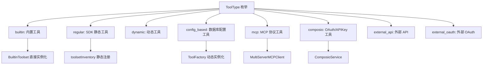
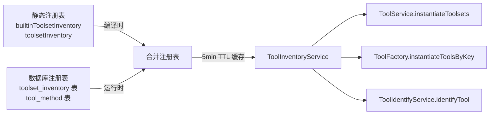
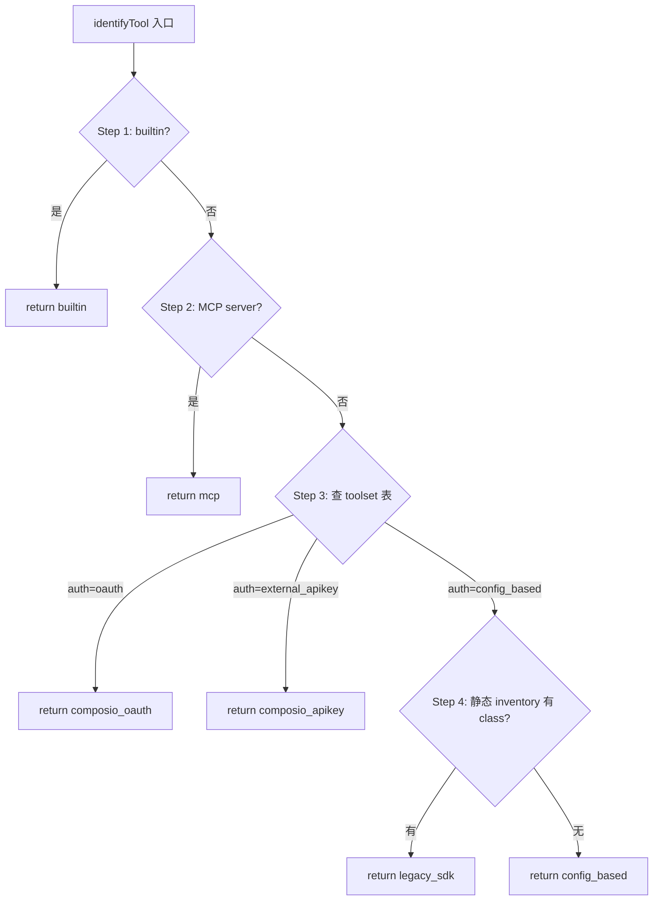

# PD-04.15 Refly — 六类工具注册与动态工厂体系

> 文档编号：PD-04.15
> 来源：Refly `packages/agent-tools/src/base.ts`, `apps/api/src/modules/tool/`
> GitHub：https://github.com/refly-ai/refly.git
> 问题域：PD-04 工具系统 Tool System Design
> 状态：可复用方案

---

## 第 1 章 问题与动机

### 1.1 核心问题

Agent 工具系统面临一个根本矛盾：**工具来源的多样性 vs 统一调用接口的需求**。

在实际产品中，工具可能来自：
- 内置硬编码（如文件读写、代码执行）
- 第三方 SDK（如 Jina、Notion、Perplexity）
- 数据库配置驱动（如 Fish Audio、HeyGen 等 HTTP API）
- OAuth 授权的 SaaS 服务（如 Google Sheets、Gmail、Twitter）
- MCP 协议服务器（用户自定义）
- Composio API Key 工具（第三方聚合平台）

每种来源的认证方式、Schema 定义方式、执行路径、计费模型都不同。如果为每种来源写独立的集成代码，系统会迅速膨胀且难以维护。

### 1.2 Refly 的解法概述

Refly 设计了一套**六类工具统一注册体系**，核心思路是：

1. **类型枚举分流** — `ToolType` 定义 `builtin | regular | dynamic | composio | mcp | config_based | external_api | external_oauth` 八种类型标签（`base.ts:9-17`），`ToolIdentifyService` 按优先级路由到对应执行器
2. **双层注册表** — 静态 `builtinToolsetInventory` + `toolsetInventory`（`inventory.ts:43-153`）管理编译时已知的工具，`ToolInventoryService` 从数据库加载运行时动态工具（`inventory.service.ts:73-167`），两层合并
3. **工厂模式实例化** — `ToolFactory` 将数据库配置转换为 LangChain `DynamicStructuredTool`（`factory.service.ts:72-116`），带 10 分钟 TTL 缓存
4. **统一执行入口** — `ToolExecutionService.executeTool()` 是所有 PTC（Programmatic Tool Calling）的单一入口（`tool-execution.service.ts:81-228`），内部按类型分发
5. **NestJS 依赖注入** — 整个工具模块通过 `ToolModule`（`tool.module.ts:34-78`）组织，服务间通过构造函数注入解耦

### 1.3 设计思想

| 设计原则 | 具体实现 | 理由 | 替代方案 |
|----------|----------|------|----------|
| 类型驱动路由 | `ToolIdentifyService` 4 步分类法 | 不同来源的工具认证/执行路径完全不同，必须先识别再路由 | 统一接口抹平差异（但会丢失类型特有的优化） |
| 静态+动态双层注册 | 编译时 inventory + 运行时 DB inventory | 内置工具需要类型安全，第三方工具需要热更新 | 全部数据库驱动（启动慢、类型不安全） |
| 工厂+缓存 | `ToolFactory` + `SingleFlightCache` 10min TTL | 数据库配置转 LangChain 工具有开销，缓存避免重复实例化 | 每次请求重新实例化（性能差） |
| Toolset 分组 | `AgentBaseToolset` 将相关工具聚合为一组 | 同一服务的多个工具共享认证和配置 | 扁平注册每个工具（配置重复） |
| 计费集成 | 工具执行后自动扣费 `creditService.syncToolCreditUsage` | SaaS 产品需要按工具调用计费 | 外部计费系统（延迟高、一致性差） |

---

## 第 2 章 源码实现分析

### 2.1 架构概览

Refly 的工具系统分为三层：**定义层**（agent-tools 包）、**管理层**（API tool 模块）、**执行层**（PTC 服务链）。

```
┌─────────────────────────────────────────────────────────────────┐
│                    packages/agent-tools                          │
│  ┌──────────────┐  ┌──────────────────┐  ┌──────────────────┐  │
│  │ AgentBaseTool │  │ AgentBaseToolset │  │    inventory     │  │
│  │  (基类定义)   │  │  (工具集分组)     │  │ (静态注册表)     │  │
│  └──────┬───────┘  └────────┬─────────┘  └────────┬─────────┘  │
│         │                   │                      │            │
│  builtin/  jina/  notion/  perplexity/  github/  ...           │
└─────────┼───────────────────┼──────────────────────┼────────────┘
          │                   │                      │
          ▼                   ▼                      ▼
┌─────────────────────────────────────────────────────────────────┐
│                    apps/api/modules/tool                         │
│  ┌────────────────┐  ┌──────────────────┐  ┌────────────────┐  │
│  │  ToolService   │  │ ToolInventory    │  │  ToolFactory   │  │
│  │ (编排入口)     │  │ Service (DB层)   │  │ (动态实例化)   │  │
│  └───────┬────────┘  └────────┬─────────┘  └───────┬────────┘  │
│          │                    │                     │           │
│  ┌───────┴────────────────────┴─────────────────────┴────────┐  │
│  │                    PTC 服务链                               │  │
│  │  ToolIdentifyService → ToolExecutionService                │  │
│  │  ToolDefinitionService → PtcSdkService                     │  │
│  └────────────────────────────────────────────────────────────┘  │
│          │              │              │              │          │
│  ┌───────┴──┐  ┌───────┴──┐  ┌───────┴──┐  ┌───────┴──────┐  │
│  │ Composio │  │   MCP    │  │ Scalebox │  │  Handlers    │  │
│  │ Module   │  │  Server  │  │ Sandbox  │  │  Module      │  │
│  └──────────┘  └──────────┘  └──────────┘  └──────────────┘  │
└─────────────────────────────────────────────────────────────────┘
```

### 2.2 核心实现

#### 2.2.1 六类工具类型定义



对应源码 `packages/agent-tools/src/base.ts:9-17`：

```typescript
export type ToolType =
  | 'builtin'
  | 'regular'
  | 'dynamic'
  | 'composio'
  | 'mcp'
  | 'config_based'
  | 'external_api'
  | 'external_oauth';
```

`AgentBaseTool` 继承 LangChain 的 `StructuredTool`，添加 `toolsetKey` 和 `toolType` 两个关键属性（`base.ts:68-88`）：

```typescript
export abstract class AgentBaseTool<TParams = unknown> extends StructuredTool {
  abstract toolsetKey: string;
  toolType: ToolType = 'regular';
  constructor(_params?: TParams) {
    super();
  }
}
```

#### 2.2.2 双层注册表与合并策略



对应源码 `apps/api/src/modules/tool/inventory/inventory.service.ts:73-167`：

```typescript
async loadFromDatabase(): Promise<Map<string, ToolsetInventoryItem>> {
  const inventory = new Map<string, ToolsetInventoryItem>();

  // 第一层：加载静态注册表
  for (const [key, item] of Object.entries(staticToolsetInventory)) {
    inventory.set(key, { class: item.class, definition: item.definition });
  }

  // 第二层：从数据库加载并覆盖
  const inventoryItems = await this.prisma.toolsetInventory.findMany({
    where: { enabled: true, deletedAt: null },
  });
  const toolMethods = await this.prisma.toolMethod.findMany({
    where: { inventoryKey: { in: inventoryItems.map(i => i.key) }, enabled: true },
  });

  // 按 inventoryKey 分组 methods
  const methodsByKey = new Map<string, typeof toolMethods>();
  for (const method of toolMethods) {
    const existing = methodsByKey.get(method.inventoryKey) || [];
    existing.push(method);
    methodsByKey.set(method.inventoryKey, existing);
  }

  for (const item of inventoryItems) {
    const methods = methodsByKey.get(item.key) || [];
    // 数据库条目覆盖静态条目，但保留静态条目的 class
    const existingClass = inventory.get(item.key)?.class;
    inventory.set(item.key, { class: existingClass || undefined, definition });
  }
  return inventory;
}
```

#### 2.2.3 工具类型识别与路由



对应源码 `apps/api/src/modules/tool/ptc/tool-identify.service.ts:66-100`：

```typescript
async identifyTool(user: User, toolsetKey: string): Promise<ToolIdentification> {
  // Step 1: 检查内置工具
  if (builtinToolsetInventory[toolsetKey]) {
    return { type: 'builtin', toolsetKey };
  }
  // Step 2: 检查 MCP 服务器
  const mcpServer = await this.prisma.mcpServer.findFirst({
    where: { uid: user.uid, name: toolsetKey, enabled: true, deletedAt: null },
  });
  if (mcpServer) return { type: 'mcp', toolsetKey };
  // Step 3: 查询 toolset 实例表
  const toolset = await this.prisma.toolset.findFirst({
    where: { key: toolsetKey, enabled: true, deletedAt: null, uninstalled: false,
             OR: [{ uid: user.uid }, { isGlobal: true }] },
  });
  // ... 按 authType 分流到 composio_oauth / composio_apikey / config_based / legacy_sdk
}
```

### 2.3 实现细节

#### 工具实例化分流（ToolService.instantiateToolsets）

`ToolService.instantiateToolsets()`（`tool.service.ts:1073-1135`）是 Agent 调用工具的总入口。它将工具分为 5 条并行实例化路径：

1. **Builtin** → `instantiateBuiltinToolsets()` 直接 new BuiltinToolset
2. **Copilot** → `instantiateCopilotToolsets()` 手动构造 workflow 工具
3. **Regular/Static** → 从 `toolsetInventory` 取 class，new 实例化
4. **Config-based** → `ToolFactory.instantiateToolsByKey()` 从 DB 配置生成
5. **MCP** → `MultiServerMCPClient` 连接 MCP 服务器获取工具
6. **OAuth** → `ComposioService.instantiateToolsets()` 通过 Composio SDK

返回值按 `InstantiatedTools` 接口分类（`tool.service.ts:60-71`）：
- `builtIn`: builtin + copilot 工具（PTC 模式可用）
- `nonBuiltIn`: regular + MCP + OAuth 工具（SDK 工具）
- `all`: 全部工具

#### 动态工具工厂缓存策略

`ToolFactory` 使用 `SingleFlightCache` 实现每个 inventoryKey 独立的 10 分钟 TTL 缓存（`factory.service.ts:72-116`）。缓存 key 是 inventoryKey，value 是 `DynamicStructuredTool[]`。支持按 key 清除缓存或全量清除。

#### 工具执行计费集成

Regular 工具执行后，如果是全局工具集（`isGlobal: true`）且执行成功，自动通过 `creditService.syncToolCreditUsage()` 扣费（`tool.service.ts:1337-1353`）。计费数据包含 uid、价格、工具调用元数据、resultId 和 version。


---

## 第 3 章 迁移指南

### 3.1 迁移清单

**阶段 1：基础工具框架（必选）**

- [ ] 定义 `ToolType` 枚举，覆盖你需要支持的工具来源类型
- [ ] 实现 `BaseTool` 抽象基类，继承 LangChain `StructuredTool`，添加 `toolsetKey` 和 `toolType`
- [ ] 实现 `BaseToolset` 抽象基类，支持工具分组和懒实例化
- [ ] 创建静态注册表 `Record<string, { class, definition }>`

**阶段 2：动态工具支持（推荐）**

- [ ] 设计 `toolset_inventory` + `tool_method` 数据库表
- [ ] 实现 `InventoryService`，合并静态注册表和数据库注册表
- [ ] 实现 `ToolFactory`，将数据库配置转换为可执行工具实例
- [ ] 添加 `SingleFlightCache` 缓存层（推荐 5-10 分钟 TTL）

**阶段 3：多来源集成（按需）**

- [ ] MCP 协议集成：使用 `MultiServerMCPClient` 连接用户自定义 MCP 服务器
- [ ] OAuth 工具集成：对接 Composio 或自建 OAuth 代理
- [ ] 工具类型识别服务：按优先级路由到对应执行器

### 3.2 适配代码模板

以下是一个简化版的双层注册表 + 工厂模式实现：

```typescript
// === 1. 工具基类 ===
import { StructuredTool } from '@langchain/core/tools';

type ToolType = 'builtin' | 'regular' | 'config_based' | 'mcp' | 'oauth';

abstract class BaseTool<TParams = unknown> extends StructuredTool {
  abstract toolsetKey: string;
  toolType: ToolType = 'regular';
}

abstract class BaseToolset<TParams = unknown> {
  abstract toolsetKey: string;
  abstract tools: readonly (new (p?: TParams) => BaseTool<TParams>)[];
  protected instances: BaseTool<TParams>[] = [];

  initializeTools(params?: TParams): BaseTool<TParams>[] {
    this.instances = this.tools.map((Ctor) => new Ctor(params));
    return this.instances;
  }

  getToolInstance(name: string): BaseTool<TParams> {
    if (!this.instances.length) this.initializeTools();
    const tool = this.instances.find((t) => t.name === name);
    if (!tool) throw new Error(`Tool ${name} not found`);
    return tool;
  }
}

// === 2. 静态注册表 ===
const builtinInventory: Record<string, { class: any; definition: any }> = {};
const thirdPartyInventory: Record<string, { class: any; definition: any }> = {};

// === 3. 动态工厂（数据库驱动） ===
import { DynamicStructuredTool } from '@langchain/core/tools';

class ToolFactory {
  private cache = new Map<string, { tools: DynamicStructuredTool[]; expiry: number }>();
  private TTL = 10 * 60 * 1000; // 10 minutes

  async instantiateByKey(inventoryKey: string): Promise<DynamicStructuredTool[]> {
    const cached = this.cache.get(inventoryKey);
    if (cached && cached.expiry > Date.now()) return cached.tools;

    const config = await this.loadConfigFromDB(inventoryKey);
    const tools = config.methods.map((method) =>
      new DynamicStructuredTool({
        name: `${inventoryKey}_${method.name}`,
        description: method.description,
        schema: method.schema,
        func: async (input) => this.executeHttpTool(method, input),
      })
    );

    this.cache.set(inventoryKey, { tools, expiry: Date.now() + this.TTL });
    return tools;
  }

  private async loadConfigFromDB(key: string) { /* DB query */ }
  private async executeHttpTool(method: any, input: any) { /* HTTP call */ }
}

// === 4. 类型识别路由 ===
class ToolIdentifier {
  async identify(toolsetKey: string): Promise<ToolType> {
    if (builtinInventory[toolsetKey]) return 'builtin';
    // Check MCP servers in DB
    // Check toolset table for auth type
    // Check static inventory for class existence
    if (thirdPartyInventory[toolsetKey]?.class) return 'regular';
    return 'config_based';
  }
}
```

### 3.3 适用场景

| 场景 | 适用度 | 说明 |
|------|--------|------|
| SaaS 产品需要支持多种第三方工具 | ⭐⭐⭐ | Refly 的六类分流设计正是为此场景优化 |
| 需要用户自定义 MCP/OAuth 工具 | ⭐⭐⭐ | 数据库驱动 + 动态工厂天然支持运行时扩展 |
| 单一 Agent 框架，工具来源固定 | ⭐⭐ | 静态注册表足够，动态工厂可能过度设计 |
| CLI 工具，无数据库 | ⭐ | 双层注册表的数据库层不适用，只需静态注册 |
| 需要按工具调用计费 | ⭐⭐⭐ | 计费集成在执行路径中，可直接复用 |

---

## 第 4 章 测试用例

```typescript
import { describe, it, expect, vi, beforeEach } from 'vitest';

// === 测试 AgentBaseToolset 懒实例化 ===
class MockTool extends BaseTool {
  toolsetKey = 'mock';
  name = 'mock_tool';
  description = 'A mock tool';
  schema = {} as any;
  async _call() { return 'ok'; }
}

class MockToolset extends BaseToolset {
  toolsetKey = 'mock';
  tools = [MockTool] as const;
}

describe('AgentBaseToolset', () => {
  it('should lazily initialize tools on first getToolInstance call', () => {
    const toolset = new MockToolset();
    // instances should be empty before first access
    expect(toolset['instances']).toHaveLength(0);
    const tool = toolset.getToolInstance('mock_tool');
    expect(tool).toBeInstanceOf(MockTool);
    expect(tool.toolsetKey).toBe('mock');
  });

  it('should throw when tool name not found', () => {
    const toolset = new MockToolset();
    expect(() => toolset.getToolInstance('nonexistent')).toThrow('Tool nonexistent not found');
  });
});

// === 测试 ToolIdentifyService 路由逻辑 ===
describe('ToolIdentifyService', () => {
  it('should identify builtin tools first', async () => {
    const identifier = new ToolIdentifier();
    // Assuming 'builtin_web_search' is in builtinInventory
    builtinInventory['builtin_web_search'] = { class: MockToolset, definition: {} };
    const type = await identifier.identify('builtin_web_search');
    expect(type).toBe('builtin');
  });

  it('should fall back to config_based when no class in static inventory', async () => {
    const type = await identifier.identify('fish_audio');
    expect(type).toBe('config_based');
  });
});

// === 测试 ToolFactory 缓存行为 ===
describe('ToolFactory', () => {
  it('should cache tools with TTL', async () => {
    const factory = new ToolFactory();
    const tools1 = await factory.instantiateByKey('heygen');
    const tools2 = await factory.instantiateByKey('heygen');
    // Should return same reference (cached)
    expect(tools1).toBe(tools2);
  });

  it('should refresh cache after TTL expires', async () => {
    const factory = new ToolFactory();
    factory['TTL'] = 0; // Expire immediately
    const tools1 = await factory.instantiateByKey('heygen');
    const tools2 = await factory.instantiateByKey('heygen');
    // Should be different instances after cache expiry
    expect(tools1).not.toBe(tools2);
  });
});

// === 测试 InstantiatedTools 分类 ===
describe('ToolService.instantiateToolsets', () => {
  it('should categorize tools into builtIn and nonBuiltIn', () => {
    const result: InstantiatedTools = {
      all: [builtinTool, regularTool, mcpTool],
      builtIn: [builtinTool],
      nonBuiltIn: [regularTool, mcpTool],
      builtInToolsets: [{ id: 'builtin', type: 'regular', builtin: true }],
      nonBuiltInToolsets: [{ id: 'jina', type: 'regular' }],
    };
    expect(result.builtIn).toHaveLength(1);
    expect(result.nonBuiltIn).toHaveLength(2);
    expect(result.all).toHaveLength(3);
  });
});
```


---

## 第 5 章 跨域关联

| 关联域 | 关系类型 | 说明 |
|--------|----------|------|
| PD-01 上下文管理 | 协同 | 工具结果需要注入 LLM 上下文，`ToolCallResult.summary` 字段控制 token 消耗 |
| PD-02 多 Agent 编排 | 依赖 | `instantiateToolsets()` 返回的 `InstantiatedTools` 直接注入 SkillEngine 的 configurable，编排层决定哪些工具可用 |
| PD-03 容错与重试 | 协同 | `AdapterFactory` 默认配置 maxRetries=3、retryDelay=1000ms；`ToolFactory` 缓存失效时优雅降级返回空数组 |
| PD-06 记忆持久化 | 协同 | `tool_call_result` 表持久化每次工具调用的输入输出，可用于经验回放 |
| PD-09 Human-in-the-Loop | 协同 | OAuth 工具需要用户授权跳转（`ComposioService.authApp()` 返回 redirect URL），是典型的 HITL 场景 |
| PD-11 可观测性 | 依赖 | `ToolExecutionService` 为每次调用生成唯一 callId（`{callType}:{uuid}`），持久化执行状态（executing→success/failed），支持 PTC 调用链追踪 |

---

## 第 6 章 来源文件索引

| 文件 | 行范围 | 关键实现 |
|------|--------|----------|
| `packages/agent-tools/src/base.ts` | L1-L218 | `ToolType` 枚举、`AgentBaseTool` 基类、`AgentBaseToolset` 基类、`BaseToolParams` 接口 |
| `packages/agent-tools/src/inventory.ts` | L1-L154 | `builtinToolsetInventory` 内置注册表、`toolsetInventory` 第三方静态注册表 |
| `apps/api/src/modules/tool/tool.module.ts` | L1-L78 | NestJS 模块定义，组织所有工具相关服务和子模块 |
| `apps/api/src/modules/tool/tool.service.ts` | L60-L71 | `InstantiatedTools` 接口定义（工具分类结构） |
| `apps/api/src/modules/tool/tool.service.ts` | L1073-L1135 | `instantiateToolsets()` 五路并行实例化入口 |
| `apps/api/src/modules/tool/tool.service.ts` | L1140-L1168 | `instantiateBuiltinToolsets()` 内置工具实例化 |
| `apps/api/src/modules/tool/tool.service.ts` | L1251-L1392 | `instantiateRegularToolsets()` 静态+动态+API Key 工具实例化 |
| `apps/api/src/modules/tool/tool.service.ts` | L1427-L1490 | `instantiateMcpServers()` MCP 工具实例化 |
| `apps/api/src/modules/tool/inventory/inventory.service.ts` | L32-L167 | `ToolInventoryService` 双层注册表合并逻辑 |
| `apps/api/src/modules/tool/dynamic-tooling/factory.service.ts` | L38-L116 | `ToolFactory` 动态工具工厂 + 10min TTL 缓存 |
| `apps/api/src/modules/tool/ptc/tool-identify.service.ts` | L19-L100 | `ToolExecutionType` 枚举、`identifyTool()` 4 步分类路由 |
| `apps/api/src/modules/tool/ptc/tool-execution.service.ts` | L39-L228 | `PtcToolExecuteContext`、`executeTool()` 统一执行入口 |
| `apps/api/src/modules/tool/ptc/tool-definition.service.ts` | L1-L432 | `ToolDefinitionService` 工具 Schema 导出（支持 Composio/config-based/legacy SDK） |
| `apps/api/src/modules/tool/composio/composio.service.ts` | L1-L150 | `ComposioService` OAuth 授权和工具执行 |
| `apps/api/src/modules/mcp-server/mcp-server.service.ts` | L1-L150 | `McpServerService` MCP 服务器配置管理（含加密） |

---

## 第 7 章 横向对比维度

```json comparison_data
{
  "project": "Refly",
  "dimensions": {
    "工具注册方式": "六类 ToolType 枚举 + 双层注册表（静态 inventory + DB toolset_inventory）",
    "工具分组/权限": "AgentBaseToolset 按 toolsetKey 分组，builtIn/nonBuiltIn 二分类，OAuth 需用户授权",
    "MCP 协议支持": "MultiServerMCPClient 连接用户自定义 MCP 服务器，配置存 DB 并加密敏感字段",
    "热更新/缓存": "ToolFactory 10min TTL + ToolInventoryService 5min TTL，SingleFlightCache 防并发穿透",
    "超时保护": "AdapterFactory 默认 30s 超时 + maxRetries=3 + retryDelay=1000ms",
    "生命周期追踪": "ToolExecutionService 生成 callId（callType:uuid），持久化 executing→success/failed 状态",
    "参数校验": "LangChain StructuredTool 的 Zod schema 自动校验，ToolDefinitionService 用 zodToJsonSchema 导出",
    "安全防护": "EncryptionService 加密 authData/headers/env，OAuth 凭据不明文存储",
    "Schema 生成方式": "三路导出：Composio API 获取、DB config 解析、SDK Zod schema 转 JSON Schema",
    "依赖注入": "NestJS Module/Injectable 全链路 DI，ToolModule 统一组织 15+ 服务",
    "工具集动态组合": "instantiateToolsets 按 GenericToolset[] 选择性激活，支持 selectedTools 过滤",
    "工具上下文注入": "BaseToolParams 注入 reflyService/engine/isGlobalToolset，Regular 工具额外注入 context",
    "凭据安全管理": "EncryptionService 对称加密 + DB 存储，运行时解密注入工具实例",
    "工具推荐策略": "shouldExposeToolset 过滤 deprecated/internal/未配置 OAuth 工具，mentionList 只展示可用工具",
    "双层API架构": "Agent loop 用 instantiateToolsets，PTC 用 executeTool API，同一工具两种调用路径",
    "结果摘要": "ToolCallResult.summary 字段提供人类可读摘要，与 data 字段分离",
    "计费集成": "全局工具集执行后自动扣费，支持 per-tool 和 tier-based 两种计费模型"
  }
}
```

### 域元数据补充

```json domain_metadata
{
  "solution_summary": "Refly 用六类 ToolType 枚举 + 双层注册表（静态 inventory + DB toolset_inventory）+ ToolFactory 动态工厂实现 builtin/SDK/config-based/MCP/OAuth/Composio 六种工具来源的统一注册与执行",
  "description": "多来源工具的统一注册、类型路由与动态实例化是工具系统的核心挑战",
  "sub_problems": [
    "工具类型识别路由：多来源工具如何按优先级分类并路由到对应执行器",
    "静态与动态注册表合并：编译时已知工具和运行时数据库工具如何统一管理",
    "工具执行计费：SaaS 场景下如何在工具执行路径中集成按调用计费",
    "工具 Schema 多路导出：如何为 Composio/DB 配置/SDK 三种来源统一导出工具定义",
    "PTC 与 Agent loop 双入口：同一工具如何同时服务沙箱 API 调用和 Agent 内部调用"
  ],
  "best_practices": [
    "用 SingleFlightCache 防止并发缓存穿透，避免多请求同时重建工具实例",
    "OAuth 工具在 Composio 未配置时自动隐藏，避免用户看到不可用工具",
    "工具集按 toolsetKey 分组共享认证配置，避免每个工具重复配置凭据",
    "数据库注册表覆盖静态注册表但保留 class 引用，实现热更新不丢失类型安全"
  ]
}
```

