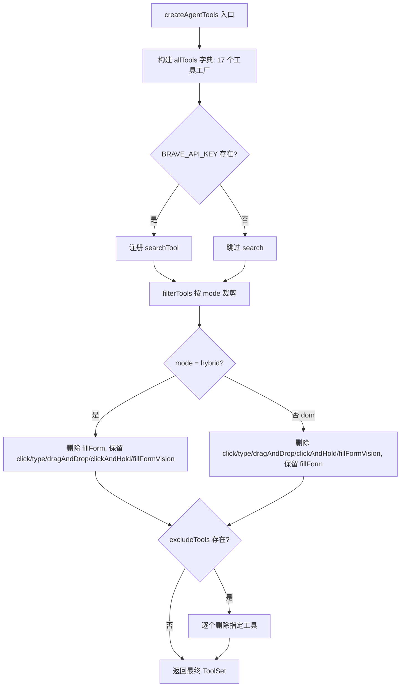
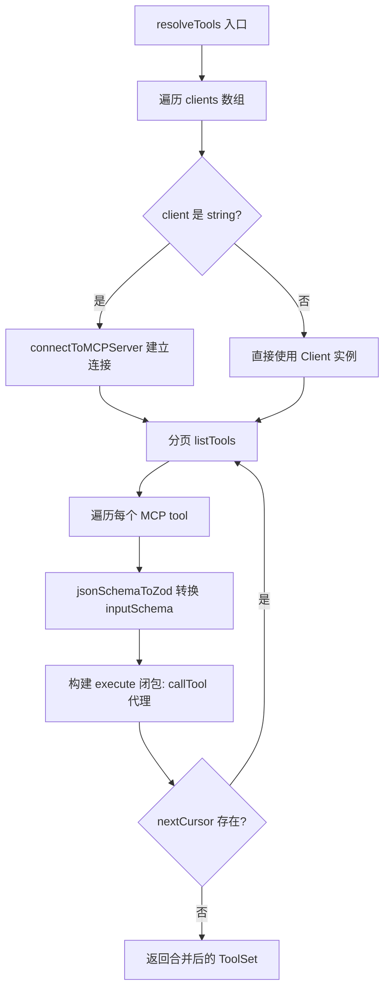

# PD-04.XX Stagehand — 双模式浏览器工具系统与 MCP 动态集成

> 文档编号：PD-04.XX
> 来源：Stagehand `packages/core/lib/v3/agent/tools/index.ts`
> GitHub：https://github.com/browserbase/stagehand.git
> 问题域：PD-04 工具系统 Tool System Design
> 状态：可复用方案

---

## 第 1 章 问题与动机

### 1.1 核心问题

浏览器自动化 Agent 面临一个根本性的工具选择困境：DOM 语义操作（通过 accessibility tree 定位元素）和视觉坐标操作（通过截图坐标点击）各有优劣。DOM 模式在结构化页面上精准可靠，但对动态渲染、Canvas、iframe 等场景力不从心；坐标模式依赖视觉模型的 grounding 能力，适合复杂 UI 但精度受模型能力限制。

同时，浏览器 Agent 需要与外部工具生态集成——MCP（Model Context Protocol）协议提供了标准化的工具发现和调用接口，但 MCP 工具使用 JSON Schema 定义参数，而 Vercel AI SDK 要求 Zod schema，两者之间需要自动转换桥梁。

### 1.2 Stagehand 的解法概述

1. **双模式工具集（dom/hybrid）**：通过 `AgentToolMode` 在同一工具注册表中维护两套工具集，`filterTools` 函数根据模式自动裁剪互斥工具（`packages/core/lib/v3/agent/tools/index.ts:59-85`）
2. **工厂函数 + V3 依赖注入**：每个工具是一个工厂函数，接收 `V3` 实例（浏览器上下文）作为依赖，返回 AI SDK `tool()` 对象（`packages/core/lib/v3/agent/tools/act.ts:7-67`）
3. **环境变量条件加载**：`search` 工具仅在 `BRAVE_API_KEY` 存在时注册，实现零配置渐进解锁（`packages/core/lib/v3/agent/tools/index.ts:113-116`）
4. **MCP 分页发现 + JSON→Zod 自动转换**：通过 `resolveTools` 分页遍历 MCP Server 的 `tools/list`，将 JSON Schema 自动转为 Zod schema（`packages/core/lib/v3/mcp/utils.ts:6-45`）
5. **双传输 MCP 连接**：支持 stdio 和 StreamableHTTP 两种 MCP 传输协议，通过配置对象类型自动判断（`packages/core/lib/v3/mcp/connection.ts:24-78`）

### 1.3 设计思想

| 设计原则 | 具体实现 | 理由 | 替代方案 |
|----------|----------|------|----------|
| 模式互斥裁剪 | `filterTools` 按 mode 删除冲突工具 | 避免 LLM 在语义相似工具间困惑（如 click vs act） | 全量暴露 + prompt 引导（工具多时 LLM 选择准确率下降） |
| 依赖注入而非全局状态 | 工厂函数接收 V3 实例 | 支持多浏览器上下文并行、便于测试 mock | 单例模式（无法并行多 session） |
| Schema 自动桥接 | `jsonSchemaToZod` 递归转换 | MCP 生态用 JSON Schema，AI SDK 用 Zod，手动维护不可扩展 | 手动为每个 MCP 工具写 Zod（不可维护） |
| 条件注册 | `process.env.BRAVE_API_KEY` 守卫 | 零配置即可用核心工具，API Key 可选增强 | 注册后运行时报错（用户体验差） |
| `toModelOutput` 多模态返回 | click/scroll/wait 工具返回截图 + JSON | hybrid 模式下 LLM 需要视觉反馈确认操作结果 | 纯文本返回（视觉模型无法验证操作效果） |

---

## 第 2 章 源码实现分析

### 2.1 架构概览

Stagehand 的工具系统分为三层：工具定义层（每个 `.ts` 文件一个工具工厂）、工具组装层（`createAgentTools` + `filterTools`）、工具消费层（`V3AgentHandler` 合并内置工具与 MCP 工具后传入 AI SDK）。

```
┌─────────────────────────────────────────────────────────┐
│                   V3AgentHandler                         │
│  prepareAgent() → allTools = {...tools, ...mcpTools}    │
│  llmClient.generateText({ tools: allTools })            │
└──────────┬──────────────────────────┬───────────────────┘
           │                          │
    ┌──────▼──────┐           ┌───────▼────────┐
    │ createAgent │           │  resolveTools   │
    │   Tools()   │           │  (MCP 发现)     │
    │             │           │                 │
    │ 17 内置工具  │           │ JSON→Zod 转换   │
    │ mode 过滤   │           │ 分页遍历        │
    │ exclude 排除│           │ 代理执行        │
    └──────┬──────┘           └───────┬────────┘
           │                          │
    ┌──────▼──────┐           ┌───────▼────────┐
    │ 工具工厂函数 │           │ connectToMCP   │
    │ actTool()   │           │   Server()     │
    │ clickTool() │           │ stdio/HTTP     │
    │ ...         │           │ ping 健康检查   │
    └─────────────┘           └────────────────┘
```

### 2.2 核心实现

#### 2.2.1 双模式工具注册与过滤



对应源码 `packages/core/lib/v3/agent/tools/index.ts:59-119`：

```typescript
function filterTools(
  tools: ToolSet,
  mode: AgentToolMode,
  excludeTools?: string[],
): ToolSet {
  const filtered: ToolSet = { ...tools };

  // Mode-based filtering
  if (mode === "hybrid") {
    delete filtered.fillForm;
  } else {
    // DOM mode (default)
    delete filtered.click;
    delete filtered.type;
    delete filtered.dragAndDrop;
    delete filtered.clickAndHold;
    delete filtered.fillFormVision;
  }

  if (excludeTools) {
    for (const toolName of excludeTools) {
      delete filtered[toolName];
    }
  }
  return filtered;
}

export function createAgentTools(v3: V3, options?: V3AgentToolOptions) {
  const mode = options?.mode ?? "dom";
  const allTools: ToolSet = {
    act: actTool(v3, executionModel, variables),
    ariaTree: ariaTreeTool(v3),
    click: clickTool(v3, provider),
    // ... 共 16 个工具
    scroll: mode === "hybrid" ? scrollVisionTool(v3, provider) : scrollTool(v3),
  };

  if (process.env.BRAVE_API_KEY) {
    allTools.search = searchTool(v3);
  }
  return filterTools(allTools, mode, excludeTools);
}
```

关键设计点：`scroll` 工具根据 mode 选择不同实现（`scrollTool` vs `scrollVisionTool`），这不是简单的过滤而是**同名工具的实现替换**（`index.ts:107`）。

#### 2.2.2 MCP 工具动态发现与 Schema 转换



对应源码 `packages/core/lib/v3/mcp/utils.ts:6-45`：

```typescript
export const resolveTools = async (
  clients: (Client | string)[],
  userTools: ToolSet,
): Promise<ToolSet> => {
  const tools: ToolSet = { ...userTools };

  for (const client of clients) {
    let clientInstance: Client;
    if (typeof client === "string") {
      clientInstance = await connectToMCPServer(client);
    } else {
      clientInstance = client;
    }

    let nextCursor: string | undefined = undefined;
    do {
      const clientTools = await clientInstance.listTools({ cursor: nextCursor });
      for (const tool of clientTools.tools) {
        tools[tool.name] = {
          description: tool.description,
          inputSchema: jsonSchemaToZod(tool.inputSchema as JsonSchema),
          execute: async (input) => {
            const result = await clientInstance.callTool({
              name: tool.name,
              arguments: input,
            });
            return result;
          },
        };
      }
      nextCursor = clientTools.nextCursor;
    } while (nextCursor);
  }
  return tools;
};
```

注意 `execute` 闭包捕获了 `clientInstance` 和 `tool.name`，实现了**延迟调用代理**——工具注册时不执行，LLM 选择时才通过 MCP 协议远程调用。

#### 2.2.3 双传输 MCP 连接与健康检查

对应源码 `packages/core/lib/v3/mcp/connection.ts:24-78`：

```typescript
export const connectToMCPServer = async (
  serverConfig: string | URL | StdioServerConfig | ConnectToMCPServerOptions,
): Promise<Client> => {
  try {
    let transport;
    // 根据配置类型自动选择传输协议
    if (typeof serverConfig === "object" && "command" in serverConfig) {
      transport = new StdioClientTransport(serverConfig);
    } else {
      // URL-based → StreamableHTTP
      transport = new StreamableHTTPClientTransport(new URL(serverUrl), requestOptions);
    }

    const client = new Client({ name: "Stagehand", version: "1.0.0", ...clientOptions });
    await client.connect(transport);

    // 连接后立即 ping 验证健康
    try {
      await client.ping();
    } catch (pingError) {
      await client.close();
      throw new MCPConnectionError(serverConfig.toString(), pingError);
    }
    return client;
  } catch (error) {
    throw new MCPConnectionError(serverConfig.toString(), error);
  }
};
```

### 2.3 实现细节

**toModelOutput 多模态返回**：hybrid 模式下的 click、scroll、wait 工具通过 `toModelOutput` 钩子返回截图 + JSON 混合内容，让视觉模型能验证操作效果（`packages/core/lib/v3/agent/tools/click.ts:89-122`）。

**Variables 注入**：`actTool` 和 `typeTool` 接收 `variables` 参数，动态修改工具描述以包含可用变量名，Agent 通过 `%variableName%` 语法引用（`packages/core/lib/v3/agent/tools/act.ts:12-15`）。

**Replay 录制**：每个工具执行后调用 `v3.recordAgentReplayStep()` 记录操作步骤，支持确定性回放（`packages/core/lib/v3/agent/tools/goto.ts:26`）。

**工具合并策略**：`V3AgentHandler.prepareAgent()` 中 `allTools = { ...tools, ...this.mcpTools }`，MCP 工具可覆盖同名内置工具（`packages/core/lib/v3/handlers/v3AgentHandler.ts:122`）。

**jsonSchemaToZod 双版本**：项目中存在两个 `jsonSchemaToZod` 实现——`lib/utils.ts:766-843` 是完整版（支持 required/description/format/min/max），`mcp/utils.ts` 导入的是 `lib/utils.ts` 的版本；`extract.ts:14-46` 有一个简化版用于 extract 工具内部的用户自定义 schema 转换。

---

## 第 3 章 迁移指南

### 3.1 迁移清单

**阶段 1：工具注册框架（1-2 天）**
- [ ] 定义工具工厂函数签名：`(context: AppContext, options?: ToolOptions) => Tool`
- [ ] 实现 `filterTools(tools, mode, excludeList)` 模式过滤器
- [ ] 建立工具注册表入口 `createTools(context, options)`

**阶段 2：MCP 集成（1-2 天）**
- [ ] 安装 `@modelcontextprotocol/sdk`
- [ ] 实现 `connectToMCPServer` 支持 stdio + HTTP 双传输
- [ ] 实现 `resolveTools` 分页发现 + JSON→Zod 转换
- [ ] 在工具注册表中合并 MCP 工具

**阶段 3：模式切换与条件加载（0.5 天）**
- [ ] 定义工具模式枚举（如 dom/hybrid 或自定义模式）
- [ ] 实现环境变量守卫的条件注册
- [ ] 实现 `excludeTools` 运行时排除

### 3.2 适配代码模板

以下是一个可直接复用的工具系统框架（TypeScript + Vercel AI SDK）：

```typescript
import { tool, ToolSet } from "ai";
import { z, ZodTypeAny } from "zod";
import { Client } from "@modelcontextprotocol/sdk/client/index.js";

// ---- 1. 工具模式定义 ----
type ToolMode = "basic" | "advanced";

interface ToolFactoryOptions {
  context: AppContext;  // 你的应用上下文（类似 Stagehand 的 V3）
  mode?: ToolMode;
  excludeTools?: string[];
}

// ---- 2. 工具工厂函数模式 ----
const searchTool = (ctx: AppContext) =>
  tool({
    description: "Search the knowledge base",
    inputSchema: z.object({
      query: z.string().describe("Search query"),
    }),
    execute: async ({ query }) => {
      const results = await ctx.search(query);
      return { success: true, results };
    },
  });

// ---- 3. 模式过滤 ----
function filterTools(
  tools: ToolSet,
  mode: ToolMode,
  excludeTools?: string[],
): ToolSet {
  const filtered = { ...tools };
  if (mode === "basic") {
    delete filtered.advancedAnalysis;
    delete filtered.codeExecution;
  }
  for (const name of excludeTools ?? []) {
    delete filtered[name];
  }
  return filtered;
}

// ---- 4. MCP 工具发现（复用 Stagehand 的 jsonSchemaToZod） ----
function jsonSchemaToZod(schema: Record<string, unknown>): ZodTypeAny {
  switch (schema.type) {
    case "object": {
      const shape: Record<string, ZodTypeAny> = {};
      const props = schema.properties as Record<string, Record<string, unknown>> ?? {};
      for (const [key, value] of Object.entries(props)) {
        shape[key] = jsonSchemaToZod(value);
      }
      return z.object(shape);
    }
    case "string": return z.string();
    case "number": case "integer": return z.number();
    case "boolean": return z.boolean();
    case "array": return z.array(schema.items ? jsonSchemaToZod(schema.items as Record<string, unknown>) : z.any());
    default: return z.any();
  }
}

async function resolveMCPTools(clients: (Client | string)[]): Promise<ToolSet> {
  const tools: ToolSet = {};
  for (const client of clients) {
    const instance = typeof client === "string"
      ? await connectToMCPServer(client)
      : client;
    let cursor: string | undefined;
    do {
      const result = await instance.listTools({ cursor });
      for (const t of result.tools) {
        tools[t.name] = {
          description: t.description,
          inputSchema: jsonSchemaToZod(t.inputSchema as Record<string, unknown>),
          execute: async (input) => instance.callTool({ name: t.name, arguments: input }),
        };
      }
      cursor = result.nextCursor;
    } while (cursor);
  }
  return tools;
}

// ---- 5. 组装入口 ----
export async function createAllTools(
  options: ToolFactoryOptions,
  mcpClients?: (Client | string)[],
): Promise<ToolSet> {
  const builtinTools = filterTools(
    { search: searchTool(options.context), /* ...其他工具 */ },
    options.mode ?? "basic",
    options.excludeTools,
  );
  const mcpTools = mcpClients ? await resolveMCPTools(mcpClients) : {};
  return { ...builtinTools, ...mcpTools };
}
```

### 3.3 适用场景

| 场景 | 适用度 | 说明 |
|------|--------|------|
| 浏览器自动化 Agent | ⭐⭐⭐ | 直接复用 dom/hybrid 双模式设计 |
| 多工具 Agent（10+ 工具） | ⭐⭐⭐ | mode 过滤 + excludeTools 控制工具数量 |
| MCP 生态集成 | ⭐⭐⭐ | resolveTools + jsonSchemaToZod 可直接移植 |
| 单一模式 Agent（<5 工具） | ⭐ | 过度设计，直接注册即可 |
| 需要工具权限控制 | ⭐⭐ | Stagehand 无权限层，需自行扩展 |

---

## 第 4 章 测试用例

```typescript
import { describe, it, expect, vi } from "vitest";

// ---- 测试 filterTools ----
describe("filterTools", () => {
  const mockTools = {
    act: { description: "act", inputSchema: {}, execute: vi.fn() },
    click: { description: "click", inputSchema: {}, execute: vi.fn() },
    type: { description: "type", inputSchema: {}, execute: vi.fn() },
    fillForm: { description: "fillForm", inputSchema: {}, execute: vi.fn() },
    dragAndDrop: { description: "drag", inputSchema: {}, execute: vi.fn() },
    clickAndHold: { description: "hold", inputSchema: {}, execute: vi.fn() },
    fillFormVision: { description: "vision", inputSchema: {}, execute: vi.fn() },
    goto: { description: "goto", inputSchema: {}, execute: vi.fn() },
  } as any;

  it("dom mode removes coordinate-based tools", () => {
    const result = filterTools(mockTools, "dom");
    expect(result).not.toHaveProperty("click");
    expect(result).not.toHaveProperty("type");
    expect(result).not.toHaveProperty("dragAndDrop");
    expect(result).not.toHaveProperty("clickAndHold");
    expect(result).not.toHaveProperty("fillFormVision");
    expect(result).toHaveProperty("act");
    expect(result).toHaveProperty("fillForm");
    expect(result).toHaveProperty("goto");
  });

  it("hybrid mode removes DOM form tool", () => {
    const result = filterTools(mockTools, "hybrid");
    expect(result).not.toHaveProperty("fillForm");
    expect(result).toHaveProperty("click");
    expect(result).toHaveProperty("type");
    expect(result).toHaveProperty("dragAndDrop");
  });

  it("excludeTools removes additional tools", () => {
    const result = filterTools(mockTools, "dom", ["goto", "act"]);
    expect(result).not.toHaveProperty("goto");
    expect(result).not.toHaveProperty("act");
    expect(result).toHaveProperty("fillForm");
  });
});

// ---- 测试 jsonSchemaToZod ----
describe("jsonSchemaToZod", () => {
  it("converts object schema with nested properties", () => {
    const schema = {
      type: "object",
      properties: {
        name: { type: "string" },
        age: { type: "number" },
        tags: { type: "array", items: { type: "string" } },
      },
    };
    const zodSchema = jsonSchemaToZod(schema);
    const result = zodSchema.safeParse({ name: "test", age: 25, tags: ["a"] });
    expect(result.success).toBe(true);
  });

  it("handles string format url", () => {
    const schema = { type: "string", format: "url" };
    const zodSchema = jsonSchemaToZod(schema);
    expect(zodSchema.safeParse("https://example.com").success).toBe(true);
    expect(zodSchema.safeParse("not-a-url").success).toBe(false);
  });

  it("falls back to z.any() for unknown types", () => {
    const schema = { type: "custom_type" };
    const zodSchema = jsonSchemaToZod(schema);
    expect(zodSchema.safeParse("anything").success).toBe(true);
    expect(zodSchema.safeParse(42).success).toBe(true);
  });
});

// ---- 测试 MCP 连接降级 ----
describe("connectToMCPServer", () => {
  it("throws MCPConnectionError on ping failure", async () => {
    const mockTransport = { connect: vi.fn(), close: vi.fn() };
    // 模拟 ping 失败场景
    await expect(
      connectToMCPServer("http://unreachable:9999")
    ).rejects.toThrow(MCPConnectionError);
  });

  it("selects stdio transport for command config", async () => {
    // StdioServerConfig 有 command 属性
    const config = { command: "node", args: ["server.js"] };
    // 验证传输类型选择逻辑
    expect(typeof config === "object" && "command" in config).toBe(true);
  });
});

// ---- 测试条件注册 ----
describe("conditional tool registration", () => {
  it("search tool only registered with BRAVE_API_KEY", () => {
    const originalKey = process.env.BRAVE_API_KEY;
    delete process.env.BRAVE_API_KEY;
    const tools = createAgentTools(mockV3, { mode: "dom" });
    expect(tools).not.toHaveProperty("search");

    process.env.BRAVE_API_KEY = "test-key";
    const toolsWithSearch = createAgentTools(mockV3, { mode: "dom" });
    expect(toolsWithSearch).toHaveProperty("search");
    process.env.BRAVE_API_KEY = originalKey;
  });
});
```


---

## 第 5 章 跨域关联

| 关联域 | 关系类型 | 说明 |
|--------|----------|------|
| PD-01 上下文管理 | 协同 | `toModelOutput` 控制工具返回内容大小（截图 vs JSON），直接影响上下文 token 消耗 |
| PD-02 多 Agent 编排 | 协同 | `V3AgentHandler` 的 `prepareStep` 回调允许在 Agent loop 每步动态调整工具集 |
| PD-03 容错与重试 | 依赖 | MCP 连接的 `ping` 健康检查 + `MCPConnectionError` 异常体系是容错基础 |
| PD-09 Human-in-the-Loop | 协同 | `SafetyConfirmationHandler` 回调在 CUA 模式下拦截危险操作等待用户确认 |
| PD-11 可观测性 | 协同 | 每个工具执行时通过 `v3.logger()` 记录结构化日志，`recordAgentReplayStep()` 支持回放 |

---

## 第 6 章 来源文件索引

| 文件 | 行范围 | 关键实现 |
|------|--------|----------|
| `packages/core/lib/v3/agent/tools/index.ts` | L1-176 | 工具注册表、filterTools、createAgentTools、类型定义 |
| `packages/core/lib/v3/mcp/utils.ts` | L1-45 | resolveTools MCP 工具发现与 Schema 转换 |
| `packages/core/lib/v3/mcp/connection.ts` | L1-78 | connectToMCPServer 双传输连接与健康检查 |
| `packages/core/lib/v3/agent/tools/act.ts` | L1-67 | act 工具工厂：语义操作 + variables 注入 |
| `packages/core/lib/v3/agent/tools/click.ts` | L1-123 | click 工具：坐标操作 + toModelOutput 截图返回 |
| `packages/core/lib/v3/agent/tools/extract.ts` | L1-104 | extract 工具：内置 jsonSchemaToZod + 动态 schema |
| `packages/core/lib/v3/agent/tools/search.ts` | L1-116 | search 工具：Brave API 条件注册 |
| `packages/core/lib/v3/agent/tools/think.ts` | L1-27 | think 工具：无副作用推理工具 |
| `packages/core/lib/v3/agent/tools/scroll.ts` | L1-185 | scroll 双实现：scrollTool (dom) / scrollVisionTool (hybrid) |
| `packages/core/lib/v3/agent/tools/wait.ts` | L1-62 | wait 工具：mode 感知的截图返回 |
| `packages/core/lib/v3/handlers/v3AgentHandler.ts` | L1-655 | Agent 主循环：工具合并、prepareStep、stepHandler |
| `packages/core/lib/v3/types/public/agent.ts` | L1-751 | AgentToolMode、AgentConfig、ToolSet 类型定义 |
| `packages/core/lib/utils.ts` | L766-843 | jsonSchemaToZod 完整版（支持 required/format/min/max） |

---

## 第 7 章 横向对比维度

```json comparison_data
{
  "project": "Stagehand",
  "dimensions": {
    "工具注册方式": "工厂函数 + AI SDK tool() 包装，每个工具独立文件",
    "工具分组/权限": "双模式 filterTools（dom/hybrid）+ excludeTools 运行时排除",
    "MCP 协议支持": "完整支持：分页 listTools + callTool 代理 + stdio/HTTP 双传输",
    "热更新/缓存": "无热更新，MCP 工具在 Agent 初始化时一次性发现",
    "超时保护": "MCP 连接 ping 健康检查，无工具级超时",
    "生命周期追踪": "recordAgentReplayStep 录制每步操作，支持确定性回放",
    "参数校验": "Zod schema 编译时校验 + jsonSchemaToZod 运行时转换",
    "Schema 生成方式": "手写 Zod（内置工具）+ JSON Schema→Zod 自动转换（MCP 工具）",
    "工具集动态组合": "mode 过滤 + env 条件注册 + excludeTools 三层组合",
    "双层API架构": "内置工具直接调用 V3 方法，MCP 工具通过 callTool 代理",
    "结果摘要": "toModelOutput 钩子：hybrid 模式返回截图+JSON，dom 模式返回纯 JSON",
    "依赖注入": "V3 实例通过工厂函数参数注入，支持多 session 并行",
    "工具上下文注入": "provider 参数注入坐标归一化逻辑，variables 注入动态描述",
    "安全防护": "SafetyConfirmationHandler 回调拦截 CUA 模式危险操作"
  }
}
```

### 域元数据补充

```json domain_metadata
{
  "solution_summary": "Stagehand 用 dom/hybrid 双模式 filterTools 裁剪 17 种浏览器工具，通过 MCP SDK 分页发现外部工具并自动 JSON Schema→Zod 转换，toModelOutput 实现多模态工具返回",
  "description": "浏览器自动化场景下工具模式互斥裁剪与多模态结果返回的工程实践",
  "sub_problems": [
    "同名工具实现替换：如何根据模式为同一工具名选择不同实现（如 scroll 的 dom/hybrid 版本）",
    "多模态工具返回：工具结果如何同时包含结构化数据和视觉截图供视觉模型消费",
    "MCP 分页遍历：大量外部工具时如何通过 cursor 分页完整发现所有工具",
    "工具描述动态生成：如何根据运行时变量（variables）动态修改工具的 inputSchema 描述"
  ],
  "best_practices": [
    "模式互斥工具要在注册层裁剪而非 prompt 层引导，减少 LLM 选择负担",
    "MCP 连接建立后立即 ping 验证，fail-fast 避免运行时才发现连接不可用",
    "无副作用的 think 工具让 Agent 有显式推理空间，提升复杂任务规划质量"
  ]
}
```
