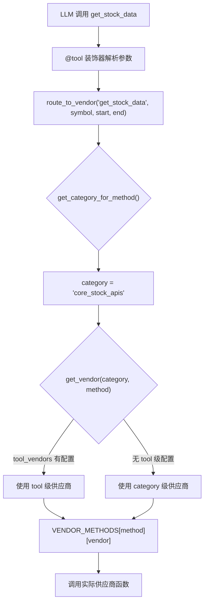
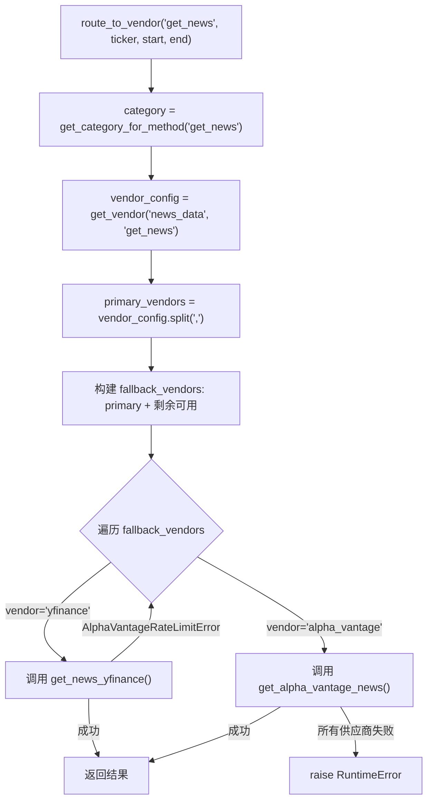

# PD-04.10 TradingAgents — 数据供应商路由工具系统

> 文档编号：PD-04.10
> 来源：TradingAgents `tradingagents/dataflows/interface.py`
> GitHub：https://github.com/TauricResearch/TradingAgents.git
> 问题域：PD-04 工具系统 Tool System Design
> 状态：可复用方案

---

## 第 1 章 问题与动机

### 1.1 核心问题

金融数据 Agent 系统面临一个独特的工具设计挑战：**同一类数据（如股价、新闻、财报）可以从多个数据供应商获取**（Yahoo Finance、Alpha Vantage 等），但 LLM Agent 不应该关心数据来自哪个供应商。Agent 只需要调用 `get_stock_data`，底层系统负责路由到正确的供应商实现。

这带来三个子问题：
1. **供应商透明性**：工具的 LLM-facing schema 必须与供应商实现解耦，Agent 看到的是统一接口
2. **多级配置覆盖**：需要支持 category 级默认配置和 tool 级精细覆盖
3. **故障自动降级**：主供应商限流时，自动 fallback 到备选供应商，无需 Agent 感知

### 1.2 TradingAgents 的解法概述

TradingAgents 设计了一套三层工具架构：

1. **工具定义层**：用 LangChain `@tool` 装饰器定义 9 个金融数据工具，每个工具内部调用 `route_to_vendor()` 而非直接调用供应商 API（`tradingagents/agents/utils/core_stock_tools.py:6-22`）
2. **供应商路由层**：`interface.py` 实现 `VENDOR_METHODS` 映射表 + `route_to_vendor()` 路由函数，支持 category/tool 两级配置覆盖和自动 fallback 链（`tradingagents/dataflows/interface.py:69-162`）
3. **Agent 绑定层**：每个 Analyst Agent 持有独立的工具子集，通过 `llm.bind_tools()` 绑定 + `ToolNode` 图节点执行（`tradingagents/graph/trading_graph.py:150-184`）

### 1.3 设计思想

| 设计原则 | 具体实现 | 理由 | 替代方案 |
|----------|----------|------|----------|
| 供应商透明 | `@tool` 函数体只调 `route_to_vendor(method_name, *args)` | Agent 无需知道数据来源，降低 prompt 复杂度 | 每个供应商一个工具（工具数爆炸） |
| 两级配置 | `data_vendors`(category) + `tool_vendors`(tool) 优先级覆盖 | 大多数场景只需设 category，特殊工具可单独覆盖 | 只支持全局配置（不够灵活） |
| 自动降级 | `route_to_vendor` 构建 fallback 链，仅 RateLimit 触发降级 | 限流是金融 API 最常见故障，其他错误应暴露给调用方 | 所有异常都降级（掩盖真实错误） |
| 按角色隔离工具 | 4 类 Analyst 各持不同工具子集 | 减少 LLM 选择空间，提高工具选择准确率 | 所有 Agent 共享全部工具 |
| Docstring 即 Schema | `@tool` + `Annotated` 类型注解自动生成 JSON Schema | 零额外维护成本，描述与实现同源 | 手写 JSON Schema（易过时） |

---

## 第 2 章 源码实现分析

### 2.1 架构概览

TradingAgents 的工具系统分为三层，数据从供应商 API 流经路由层，最终被 Agent 消费：

```
┌─────────────────────────────────────────────────────────────────┐
│                        Agent 绑定层                              │
│  ┌──────────────┐ ┌──────────────┐ ┌────────────┐ ┌───────────┐ │
│  │Market Analyst│ │News Analyst  │ │Social      │ │Fundamental│ │
│  │bind_tools:   │ │bind_tools:   │ │bind_tools: │ │bind_tools:│ │
│  │ stock_data   │ │ news         │ │ news       │ │ fundament │ │
│  │ indicators   │ │ global_news  │ │            │ │ balance   │ │
│  │              │ │ insider_txn  │ │            │ │ cashflow  │ │
│  └──────┬───────┘ └──────┬───────┘ └─────┬──────┘ └─────┬─────┘ │
│         │                │               │              │       │
├─────────┼────────────────┼───────────────┼──────────────┼───────┤
│         └────────────────┴───────┬───────┴──────────────┘       │
│                                  ▼                              │
│                     route_to_vendor(method, *args)               │
│                     ┌─────────────────────────┐                 │
│                     │  1. get_category(method) │                 │
│                     │  2. get_vendor(cat, tool)│                 │
│                     │  3. build fallback chain │                 │
│                     │  4. try → catch RateLimit│                 │
│                     └────────────┬────────────┘                 │
│                        供应商路由层                               │
├──────────────────────────────────┼──────────────────────────────┤
│                                  ▼                              │
│              VENDOR_METHODS[method][vendor]                      │
│         ┌──────────────┐    ┌──────────────────┐                │
│         │  yfinance    │    │  alpha_vantage    │                │
│         │  (9 methods) │    │  (9 methods)      │                │
│         └──────────────┘    └──────────────────┘                │
│                        供应商实现层                               │
└─────────────────────────────────────────────────────────────────┘
```

### 2.2 核心实现

#### 2.2.1 工具定义：@tool + route_to_vendor 代理模式



对应源码 `tradingagents/agents/utils/core_stock_tools.py:1-22`：

```python
from langchain_core.tools import tool
from typing import Annotated
from tradingagents.dataflows.interface import route_to_vendor

@tool
def get_stock_data(
    symbol: Annotated[str, "ticker symbol of the company"],
    start_date: Annotated[str, "Start date in yyyy-mm-dd format"],
    end_date: Annotated[str, "End date in yyyy-mm-dd format"],
) -> str:
    """
    Retrieve stock price data (OHLCV) for a given ticker symbol.
    Uses the configured core_stock_apis vendor.
    """
    return route_to_vendor("get_stock_data", symbol, start_date, end_date)
```

每个工具函数都是一个"薄代理"——函数体只有一行 `route_to_vendor` 调用。工具的 docstring 和 `Annotated` 类型注解由 LangChain 自动转换为 LLM 可理解的 JSON Schema。

#### 2.2.2 供应商路由：VENDOR_METHODS + fallback 链



对应源码 `tradingagents/dataflows/interface.py:134-162`：

```python
def route_to_vendor(method: str, *args, **kwargs):
    """Route method calls to appropriate vendor implementation with fallback support."""
    category = get_category_for_method(method)
    vendor_config = get_vendor(category, method)
    primary_vendors = [v.strip() for v in vendor_config.split(',')]

    if method not in VENDOR_METHODS:
        raise ValueError(f"Method '{method}' not supported")

    # Build fallback chain: primary vendors first, then remaining available vendors
    all_available_vendors = list(VENDOR_METHODS[method].keys())
    fallback_vendors = primary_vendors.copy()
    for vendor in all_available_vendors:
        if vendor not in fallback_vendors:
            fallback_vendors.append(vendor)

    for vendor in fallback_vendors:
        if vendor not in VENDOR_METHODS[method]:
            continue
        vendor_impl = VENDOR_METHODS[method][vendor]
        impl_func = vendor_impl[0] if isinstance(vendor_impl, list) else vendor_impl
        try:
            return impl_func(*args, **kwargs)
        except AlphaVantageRateLimitError:
            continue  # Only rate limits trigger fallback

    raise RuntimeError(f"No available vendor for '{method}'")
```

关键设计点：
- **仅 RateLimit 触发降级**（`interface.py:159-160`）：其他异常（如参数错误、网络超时）直接抛出，不会静默降级到错误的供应商
- **动态 fallback 链**（`interface.py:144-148`）：先放配置的主供应商，再追加所有其他可用供应商，确保即使配置了不存在的供应商也不会崩溃

### 2.3 实现细节

#### 工具分类注册表

`TOOLS_CATEGORIES`（`interface.py:31-61`）是一个静态字典，将 9 个工具分为 4 个类别。这个注册表有两个用途：
1. `get_category_for_method()` 反查工具所属类别
2. 为未来的工具发现/列举提供元数据（description 字段）

#### 两级配置覆盖

`get_vendor()` 函数（`interface.py:119-132`）实现了 tool > category 的优先级：

```python
def get_vendor(category: str, method: str = None) -> str:
    config = get_config()
    # Check tool-level configuration first
    if method:
        tool_vendors = config.get("tool_vendors", {})
        if method in tool_vendors:
            return tool_vendors[method]
    # Fall back to category-level configuration
    return config.get("data_vendors", {}).get(category, "default")
```

默认配置（`default_config.py:24-33`）中所有 category 默认使用 `yfinance`，`tool_vendors` 为空字典。用户可以通过 `TradingAgentsGraph(config={...})` 传入自定义配置。

#### Agent 工具隔离

每个 Analyst 类型只绑定与其职责相关的工具子集（`trading_graph.py:150-184`）：

| Analyst | 绑定工具 | ToolNode |
|---------|----------|----------|
| Market | get_stock_data, get_indicators | market |
| Social | get_news | social |
| News | get_news, get_global_news, get_insider_transactions | news |
| Fundamentals | get_fundamentals, get_balance_sheet, get_cashflow, get_income_statement | fundamentals |

工具绑定发生在两个层面：
1. `llm.bind_tools(tools)` — 让 LLM 知道可以调用哪些工具（`fundamentals_analyst.py:49`）
2. `ToolNode([tools])` — 在 LangGraph 图中实际执行工具调用（`trading_graph.py:175-183`）

#### 工具调用循环

图的条件边（`conditional_logic.py:14-44`）检查 LLM 输出是否包含 `tool_calls`：有则路由到 `tools_{type}` 节点执行，无则进入 `Msg Clear` 节点清理消息后流转到下一个 Analyst。

---

## 第 3 章 迁移指南

### 3.1 迁移清单

**阶段 1：工具定义层（1 天）**
- [ ] 定义工具函数，使用 `@tool` + `Annotated` 类型注解
- [ ] 每个工具函数体只调用 `route_to_provider(method_name, *args)`
- [ ] 编写清晰的 docstring（LLM 依赖它选择工具）

**阶段 2：供应商路由层（2 天）**
- [ ] 创建 `PROVIDER_METHODS` 映射表：`{method_name: {provider: impl_func}}`
- [ ] 创建 `TOOLS_CATEGORIES` 分类表
- [ ] 实现 `route_to_provider()` 函数，含 fallback 链
- [ ] 实现两级配置：category 默认 + tool 覆盖
- [ ] 定义哪些异常触发降级（如 RateLimitError），哪些直接抛出

**阶段 3：Agent 绑定层（1 天）**
- [ ] 按 Agent 角色划分工具子集
- [ ] 创建 `ToolNode` 实例（如使用 LangGraph）
- [ ] 在 Agent prompt 中注入 `tool_names`

### 3.2 适配代码模板

以下是一个可直接复用的供应商路由系统模板，适用于任何需要多数据源切换的 Agent 系统：

```python
"""provider_router.py — 可插拔数据供应商路由系统"""
from typing import Dict, Callable, Any, List, Optional

class ProviderRouter:
    """多供应商路由器，支持分类配置 + 工具级覆盖 + 自动降级。"""

    def __init__(self, config: Optional[Dict] = None):
        self._methods: Dict[str, Dict[str, Callable]] = {}
        self._categories: Dict[str, List[str]] = {}
        self._config = config or {}
        self._fallback_exceptions: tuple = (Exception,)

    def set_fallback_exceptions(self, *exc_types):
        """设置触发降级的异常类型（其他异常直接抛出）。"""
        self._fallback_exceptions = exc_types

    def register(self, method: str, category: str, provider: str, impl: Callable):
        """注册一个供应商实现。"""
        self._methods.setdefault(method, {})[provider] = impl
        self._categories.setdefault(category, [])
        if method not in self._categories[category]:
            self._categories[category].append(method)

    def get_category(self, method: str) -> str:
        for cat, methods in self._categories.items():
            if method in methods:
                return cat
        raise ValueError(f"Method '{method}' not in any category")

    def get_provider(self, category: str, method: str = None) -> str:
        # Tool-level override
        tool_providers = self._config.get("tool_providers", {})
        if method and method in tool_providers:
            return tool_providers[method]
        # Category-level default
        return self._config.get("data_providers", {}).get(category, "default")

    def route(self, method: str, *args, **kwargs) -> Any:
        """路由到合适的供应商，支持自动降级。"""
        if method not in self._methods:
            raise ValueError(f"Method '{method}' not registered")

        category = self.get_category(method)
        provider_config = self.get_provider(category, method)
        primary = [v.strip() for v in provider_config.split(',')]

        # Build fallback chain
        all_providers = list(self._methods[method].keys())
        chain = primary + [p for p in all_providers if p not in primary]

        for provider in chain:
            if provider not in self._methods[method]:
                continue
            try:
                return self._methods[method][provider](*args, **kwargs)
            except self._fallback_exceptions:
                continue

        raise RuntimeError(f"All providers failed for '{method}'")


# 使用示例
router = ProviderRouter(config={
    "data_providers": {"stock": "yfinance", "news": "newsapi"},
    "tool_providers": {"get_breaking_news": "twitter"},
})
router.set_fallback_exceptions(RateLimitError, TimeoutError)
router.register("get_price", "stock", "yfinance", yfinance_get_price)
router.register("get_price", "stock", "alpha_vantage", av_get_price)

# 在 @tool 函数中使用
@tool
def get_price(symbol: Annotated[str, "ticker"], date: Annotated[str, "yyyy-mm-dd"]) -> str:
    """Get stock price for a symbol."""
    return router.route("get_price", symbol, date)
```

### 3.3 适用场景

| 场景 | 适用度 | 说明 |
|------|--------|------|
| 多数据源金融 Agent | ⭐⭐⭐ | 完美匹配：股价/新闻/财报等数据有多个供应商 |
| 多搜索引擎 Agent | ⭐⭐⭐ | Google/Bing/DuckDuckGo 等搜索源可用同一模式路由 |
| 多 LLM Provider Agent | ⭐⭐ | 可复用路由+降级逻辑，但 LLM 调用的异步特性需额外处理 |
| 单数据源系统 | ⭐ | 过度设计，直接调用即可 |
| 需要聚合多源结果的场景 | ⭐ | 本方案是 fallback 模式（选一个），不是 fan-out 模式（全部调用再合并） |

---

## 第 4 章 测试用例

```python
"""test_vendor_routing.py — 基于 TradingAgents 工具系统的测试用例"""
import pytest
from unittest.mock import patch, MagicMock

# 模拟 TradingAgents 的路由系统结构
class RateLimitError(Exception):
    pass

class ProviderRouter:
    """简化版路由器，用于测试"""
    def __init__(self, methods, categories, config):
        self._methods = methods
        self._categories = categories
        self._config = config

    def get_category(self, method):
        for cat, info in self._categories.items():
            if method in info["tools"]:
                return cat
        raise ValueError(f"Method '{method}' not found")

    def get_provider(self, category, method=None):
        if method:
            tool_providers = self._config.get("tool_providers", {})
            if method in tool_providers:
                return tool_providers[method]
        return self._config.get("data_providers", {}).get(category, "default")

    def route(self, method, *args, **kwargs):
        category = self.get_category(method)
        provider_config = self.get_provider(category, method)
        primary = [v.strip() for v in provider_config.split(',')]
        all_providers = list(self._methods[method].keys())
        chain = primary + [p for p in all_providers if p not in primary]
        for provider in chain:
            if provider not in self._methods[method]:
                continue
            try:
                return self._methods[method][provider](*args, **kwargs)
            except RateLimitError:
                continue
        raise RuntimeError(f"All providers failed for '{method}'")


@pytest.fixture
def router():
    yf_stock = MagicMock(return_value="yfinance_data")
    av_stock = MagicMock(return_value="alpha_vantage_data")
    return ProviderRouter(
        methods={"get_stock": {"yfinance": yf_stock, "alpha_vantage": av_stock}},
        categories={"core_stock": {"tools": ["get_stock"]}},
        config={"data_providers": {"core_stock": "yfinance"}, "tool_providers": {}},
    )


class TestNormalRouting:
    def test_routes_to_configured_provider(self, router):
        result = router.route("get_stock", "AAPL", "2024-01-01", "2024-01-31")
        assert result == "yfinance_data"
        router._methods["get_stock"]["yfinance"].assert_called_once()

    def test_tool_level_override(self, router):
        router._config["tool_providers"]["get_stock"] = "alpha_vantage"
        result = router.route("get_stock", "AAPL", "2024-01-01", "2024-01-31")
        assert result == "alpha_vantage_data"

    def test_unknown_method_raises(self, router):
        with pytest.raises(ValueError, match="not found"):
            router.route("get_unknown", "AAPL")


class TestFallbackBehavior:
    def test_fallback_on_rate_limit(self, router):
        router._methods["get_stock"]["yfinance"].side_effect = RateLimitError()
        result = router.route("get_stock", "AAPL", "2024-01-01", "2024-01-31")
        assert result == "alpha_vantage_data"

    def test_non_rate_limit_error_propagates(self, router):
        router._methods["get_stock"]["yfinance"].side_effect = ConnectionError("timeout")
        with pytest.raises(ConnectionError):
            router.route("get_stock", "AAPL", "2024-01-01", "2024-01-31")

    def test_all_providers_fail_raises_runtime(self, router):
        router._methods["get_stock"]["yfinance"].side_effect = RateLimitError()
        router._methods["get_stock"]["alpha_vantage"].side_effect = RateLimitError()
        with pytest.raises(RuntimeError, match="All providers failed"):
            router.route("get_stock", "AAPL", "2024-01-01", "2024-01-31")


class TestCategoryResolution:
    def test_method_to_category_mapping(self, router):
        assert router.get_category("get_stock") == "core_stock"

    def test_unknown_method_raises_value_error(self, router):
        with pytest.raises(ValueError):
            router.get_category("nonexistent")
```

---

## 第 5 章 跨域关联

| 关联域 | 关系类型 | 说明 |
|--------|----------|------|
| PD-01 上下文管理 | 协同 | `create_msg_delete()` 在工具调用循环结束后清理消息历史，防止多轮工具调用撑爆上下文窗口（`agent_utils.py:22-35`） |
| PD-02 多 Agent 编排 | 依赖 | 工具系统的按角色隔离设计直接服务于 LangGraph 的多 Analyst 并行编排，每个 Analyst 节点有独立的 ToolNode |
| PD-03 容错与重试 | 协同 | `route_to_vendor` 的 fallback 链本质上是工具层的容错机制，仅对 `AlphaVantageRateLimitError` 触发降级 |
| PD-06 记忆持久化 | 协同 | `FinancialSituationMemory` 存储历史交易决策，Analyst 工具产出的报告最终被记忆系统消费 |
| PD-11 可观测性 | 潜在 | 当前实现缺少工具调用的耗时/成本追踪，`callbacks` 参数已预留但未在工具层集成 |

---

## 第 6 章 来源文件索引

| 文件 | 行范围 | 关键实现 |
|------|--------|----------|
| `tradingagents/dataflows/interface.py` | L1-162 | 供应商路由核心：TOOLS_CATEGORIES、VENDOR_METHODS、route_to_vendor() |
| `tradingagents/dataflows/config.py` | L1-31 | 全局配置管理：get_config()、set_config()、initialize_config() |
| `tradingagents/default_config.py` | L1-34 | 默认配置：data_vendors（category 级）、tool_vendors（tool 级） |
| `tradingagents/agents/utils/core_stock_tools.py` | L1-22 | @tool 定义：get_stock_data |
| `tradingagents/agents/utils/technical_indicators_tools.py` | L1-23 | @tool 定义：get_indicators |
| `tradingagents/agents/utils/fundamental_data_tools.py` | L1-77 | @tool 定义：get_fundamentals、get_balance_sheet、get_cashflow、get_income_statement |
| `tradingagents/agents/utils/news_data_tools.py` | L1-53 | @tool 定义：get_news、get_global_news、get_insider_transactions |
| `tradingagents/agents/utils/agent_utils.py` | L1-35 | 工具聚合导入 + create_msg_delete() |
| `tradingagents/agents/analysts/market_analyst.py` | L1-85 | Market Analyst：bind_tools + tool_names 注入 |
| `tradingagents/agents/analysts/fundamentals_analyst.py` | L1-63 | Fundamentals Analyst：bind_tools + tool_names 注入 |
| `tradingagents/graph/trading_graph.py` | L150-184 | _create_tool_nodes()：按 Analyst 类型创建 ToolNode |
| `tradingagents/graph/setup.py` | L40-202 | setup_graph()：图构建 + 条件边 + 工具节点注册 |
| `tradingagents/graph/conditional_logic.py` | L14-44 | should_continue_*()：检查 tool_calls 决定是否继续工具循环 |
| `tradingagents/dataflows/y_finance.py` | L1-47 | yfinance 供应商实现：get_YFin_data_online() |

---

## 第 7 章 横向对比维度

```json comparison_data
{
  "project": "TradingAgents",
  "dimensions": {
    "工具注册方式": "LangChain @tool 装饰器 + Annotated 类型注解自动生成 Schema",
    "工具分组/权限": "4 类 Analyst 各持独立工具子集，通过 bind_tools 隔离",
    "MCP 协议支持": "无，纯 LangChain ToolNode 体系",
    "热更新/缓存": "无热更新，data_cache_dir 缓存供应商数据",
    "超时保护": "无显式超时，依赖供应商 SDK 自身超时",
    "Schema 生成方式": "Docstring 即 Schema：@tool + Annotated 自动转 JSON Schema",
    "工具集动态组合": "selected_analysts 参数控制激活哪些 Analyst 及其工具子集",
    "依赖注入": "config dict 通过 set_config() 注入，工具运行时读取 get_config()",
    "工具上下文注入": "route_to_vendor 根据 config 动态选择供应商实现",
    "数据供应商路由": "VENDOR_METHODS 映射表 + category/tool 两级配置覆盖",
    "供应商降级策略": "仅 RateLimitError 触发 fallback，其他异常直接抛出"
  }
}
```

### 域元数据补充

```json domain_metadata
{
  "solution_summary": "TradingAgents 用 VENDOR_METHODS 映射表 + route_to_vendor 路由函数实现多数据供应商透明切换，支持 category/tool 两级配置覆盖和 RateLimit 自动降级链",
  "description": "多数据源场景下工具层如何实现供应商透明路由与自动降级",
  "sub_problems": [
    "数据供应商路由：同一工具如何透明切换底层数据源而不影响 Agent 调用",
    "多级配置覆盖：如何支持 category 默认配置和 tool 级精细覆盖的优先级体系",
    "选择性降级：如何区分可降级异常（限流）和不可降级异常（参数错误）"
  ],
  "best_practices": [
    "工具函数体应为薄代理：只做路由调用，不含业务逻辑",
    "降级应区分异常类型：仅限流/超时等瞬态故障触发降级，逻辑错误应直接抛出",
    "按 Agent 角色隔离工具子集：减少 LLM 选择空间比增加工具描述更有效"
  ]
}
```
