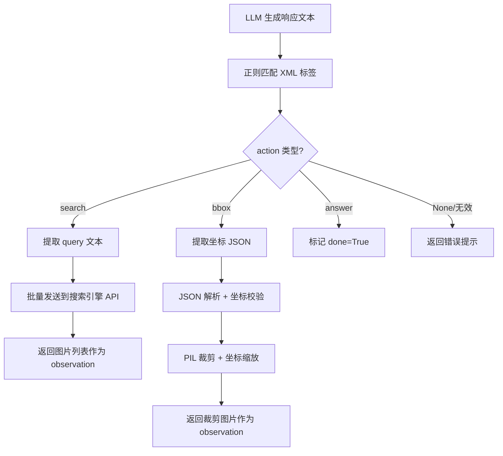
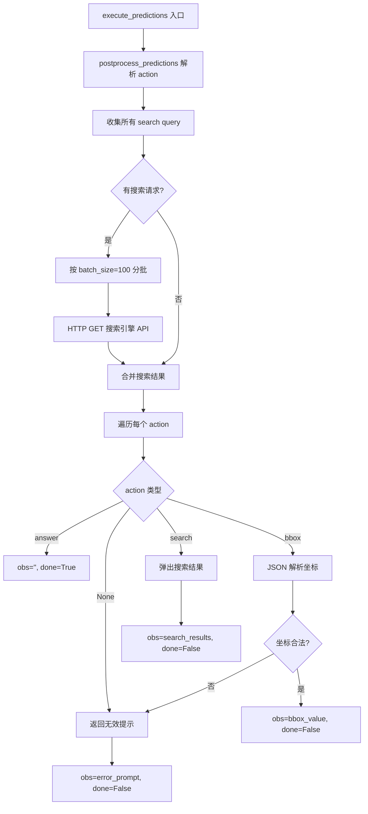

# PD-04.VRAG VRAG — XML 标签工具调用与视觉搜索交互系统

> 文档编号：PD-04.VRAG
> 来源：VRAG `VRAG-RL/vrag_agent/generation.py`, `demo/vrag_agent.py`
> GitHub：https://github.com/Alibaba-NLP/VRAG.git
> 问题域：PD-04 工具系统 Tool System Design
> 状态：可复用方案

---

## 第 1 章 问题与动机

### 1.1 核心问题

视觉 RAG（Retrieval-Augmented Generation）Agent 需要在推理过程中动态调用外部工具——搜索引擎检索图片、裁剪图片区域、给出最终答案。传统 Function Calling 依赖 LLM 供应商的 tool_calls JSON 格式，但在 RL 训练场景下，模型需要通过自然语言生成工具调用指令，而非依赖外部 JSON schema。

核心挑战：
- **RL 训练兼容**：工具调用必须是模型可生成的文本序列，而非外挂的 JSON 结构
- **多模态交互**：工具返回的不是文本而是图片，需要将图片编码后注入对话上下文
- **多轮循环**：Agent 需要在 think → action → observe 循环中反复调用工具直到找到答案
- **批量训练效率**：RL 训练时需要对整个 batch 并行执行工具调用，而非逐条处理

### 1.2 VRAG 的解法概述

VRAG 采用了一套极简但高效的 XML 标签工具系统：

1. **XML 标签即工具协议**：`<search>query</search>`、`<bbox>[x1,y1,x2,y2]</bbox>`、`<answer>result</answer>` 三种标签定义了全部工具接口（`demo/vrag_agent.py:105`）
2. **正则解析替代 JSON Schema**：用 `r'<(search|answer|bbox)>(.*?)</\1>'` 一行正则完成所有工具调用的解析（`VRAG-RL/vrag_agent/generation.py:654`）
3. **Prompt 即工具注册**：工具的定义、参数格式、使用示例全部内嵌在系统 prompt 中（`demo/vrag_agent.py:11`）
4. **环境步进式执行**：`execute_predictions` 方法将工具调用视为环境交互的 step，返回 observation 和 done 信号（`VRAG-RL/vrag_agent/generation.py:574`）
5. **批量查询合并**：搜索工具支持批量 query 一次性发送到搜索引擎 API，减少网络往返（`VRAG-RL/vrag_agent/generation.py:594-601`）

### 1.3 设计思想

| 设计原则 | 具体实现 | 理由 | 替代方案 |
|----------|----------|------|----------|
| 文本即协议 | XML 标签作为工具调用格式 | RL 训练需要模型直接生成工具调用文本，不能依赖外部 JSON 解析 | OpenAI Function Calling JSON |
| Prompt 即注册 | 工具定义写在 system prompt 中 | 无需维护独立的工具注册表，模型通过 prompt 学习工具用法 | ToolRegistry + Schema 注册 |
| 环境交互范式 | execute_predictions 返回 (obs, done) | 与 RL 环境接口一致，便于 reward 计算和轨迹收集 | 回调函数 / 事件驱动 |
| 去重防循环 | repeated_nums 控制同一图片最多检索次数 | 防止 Agent 反复检索同一张图片陷入死循环 | 全局去重集合 |
| 强制终止 | max_steps 倒计时 + 强制 answer 提示 | 保证每条轨迹有限长度，RL 训练可控 | 无限循环 + 外部超时 |

---

## 第 2 章 源码实现分析

### 2.1 架构概览

VRAG 的工具系统分为两层：推理层（demo）和训练层（VRAG-RL），共享同一套 XML 标签协议。

```
┌─────────────────────────────────────────────────────────┐
│                    VRAG 工具系统架构                       │
├─────────────────────────────────────────────────────────┤
│                                                         │
│  ┌──────────┐    XML 标签     ┌──────────────────┐      │
│  │  VLM     │───────────────→│  正则解析器       │      │
│  │ (Qwen2.5)│  <search>      │  postprocess_     │      │
│  │          │  <bbox>        │  predictions()   │      │
│  │          │  <answer>      └────────┬─────────┘      │
│  └────▲─────┘                         │                 │
│       │                    ┌──────────┼──────────┐      │
│       │                    ▼          ▼          ▼      │
│       │              ┌─────────┐ ┌────────┐ ┌────────┐  │
│       │              │ search  │ │  bbox  │ │ answer │  │
│       │              │ (HTTP)  │ │ (PIL)  │ │ (终止) │  │
│       │              └────┬────┘ └───┬────┘ └───┬────┘  │
│       │                   │          │          │       │
│       │              ┌────▼────┐ ┌───▼────┐     │       │
│       │              │ 搜索引擎 │ │ 图片裁剪│     │       │
│       │              │  API    │ │ 处理器  │     │       │
│       │              └────┬────┘ └───┬────┘     │       │
│       │                   │          │          │       │
│       └───────────────────┴──────────┘          │       │
│         observation (图片 base64)          done=True     │
└─────────────────────────────────────────────────────────┘
```

### 2.2 核心实现

#### 2.2.1 XML 标签解析与工具分发



对应源码 `VRAG-RL/vrag_agent/generation.py:639-668`：

```python
def postprocess_predictions(self, predictions: List[Any]) -> Tuple[List[int], List[bool]]:
    actions = []
    contents = []
    for prediction in predictions:
        if isinstance(prediction, str):
            pattern = r'<(search|answer|bbox)>(.*?)</\1>'
            match = re.search(pattern, prediction, re.DOTALL)
            if match:
                content = match.group(2).strip()
                action = match.group(1)
            else:
                content = ''
                action = None
        else:
            raise ValueError(f"Invalid prediction type: {type(prediction)}")
        actions.append(action)
        contents.append(content)
    return actions, contents
```

#### 2.2.2 环境步进式工具执行



对应源码 `VRAG-RL/vrag_agent/generation.py:574-637`：

```python
def execute_predictions(self, predictions: List[str], pad_token: str, 
                        active_mask=None, do_search=True) -> List[str]:
    cur_actions, contents = self.postprocess_predictions(predictions)
    next_obs, dones = [], []
    
    search_queries = [content for action, content in zip(cur_actions, contents) 
                      if action == 'search']
    if do_search:
        if len(search_queries) > 0:
            batch_size = 100
            search_results = []
            for i in range(0, len(search_queries), batch_size):
                batch_queries = search_queries[i:i + batch_size]
                response = requests.get(self.config.search_url, 
                                       params={"queries": batch_queries})
                search_results.extend(response.json())

    for i, (action, active) in enumerate(zip(cur_actions, active_mask)):
        if not active:
            next_obs.append('')
            dones.append(1)
        elif action == 'answer':
            next_obs.append('')
            dones.append(1)
        elif action == 'search':
            next_obs.append(search_results.pop(0))
            dones.append(0)
        elif action == 'bbox':
            try:
                bbox_value = json.loads(bbox_list.pop(0))
                if len(bbox_value) == 4 and all(v >= 0 for v in bbox_value):
                    next_obs.append(bbox_value)
                else:
                    raise ValueError("Invalid bbox value")
            except:
                next_obs.append('...invalid action prompt...')
            dones.append(0)
    return next_obs, dones
```

### 2.3 实现细节

#### Demo 层的生成器模式

`demo/vrag_agent.py` 中的 `VRAG.run()` 方法使用 Python generator（yield）实现流式交互，每个工具调用步骤都 yield 中间结果给前端展示：

- `yield 'think', thought, raw` — 推理过程
- `yield 'search', content, raw` — 搜索请求
- `yield 'search_image', image, raw` — 搜索返回的图片
- `yield 'crop_image', cropped, bbox_image` — 裁剪结果

这种设计让 Streamlit 前端（`demo/app.py`）可以实时展示 Agent 的思考和工具调用过程。

#### 图片去重机制

`demo/vrag_agent.py:128-132` 实现了简单但有效的图片去重：

```python
while len(search_results) > 0:
    image_path = search_results.pop(0)
    if self.image_path.count(image_path) >= self.repeated_nums:
        continue
    else:
        self.image_path.append(image_path)
        break
```

`repeated_nums=1` 意味着每张图片最多被检索一次，防止 Agent 陷入重复检索循环。

#### 坐标缩放与 Padding

`demo/vrag_agent.py:148-152` 中 bbox 裁剪需要处理输入图片（已缩放）和原始图片之间的坐标映射：

```python
crop_region_bbox = (bbox[0] * raw_w / input_w, bbox[1] * raw_h / input_h,
                    bbox[2] * raw_w / input_w, bbox[3] * raw_h / input_h)
pad_size = 56
crop_region_bbox = [max(crop_region_bbox[0]-pad_size, 0), ...]
```

56 像素的 padding 确保裁剪区域不会过于紧凑，给 VLM 更多上下文信息。

#### RL 训练层的 Format Reward

`VRAG-RL/verl/utils/reward_score/vrag.py:67-73` 定义了格式奖励函数，强制模型学会正确使用工具标签：

```python
def compute_format_reward_only(predict_str, ground_truth, extra_info):
    answer_pattern = re.compile(r'<answer>.*</answer>', re.DOTALL)
    search_pattern = re.compile(r'<search>.*</search>', re.DOTALL)
    answer_match = re.search(answer_pattern, predict_str)
    search_match = re.search(search_pattern, predict_str)
    return 1.0 if answer_match and search_match else 0.0
```

只有同时包含 `<search>` 和 `<answer>` 标签的输出才能获得格式奖励，这驱动模型学会"先搜索再回答"的工具使用模式。

---

## 第 3 章 迁移指南

### 3.1 迁移清单

**阶段 1：定义 XML 工具协议**
- [ ] 确定工具集：列出 Agent 需要的所有工具（如 search、calculate、code_exec）
- [ ] 为每个工具定义 XML 标签格式：`<tool_name>参数</tool_name>`
- [ ] 编写系统 prompt，包含工具说明、参数格式、使用示例

**阶段 2：实现解析与分发**
- [ ] 编写正则解析器，从 LLM 输出中提取工具调用
- [ ] 实现 execute_predictions 方法，按 action 类型分发到对应处理器
- [ ] 添加无效 action 的错误处理和重试提示

**阶段 3：实现工具后端**
- [ ] 搜索工具：对接搜索引擎 API（支持批量查询）
- [ ] 其他工具：实现各工具的具体逻辑
- [ ] 添加去重机制防止循环调用

**阶段 4：集成 Agent 循环**
- [ ] 实现 think → action → observe 主循环
- [ ] 添加 max_steps 强制终止机制
- [ ] 如需 RL 训练，添加 format reward 函数

### 3.2 适配代码模板

以下是一个可直接复用的 XML 标签工具系统模板：

```python
import re
import json
import requests
from typing import List, Tuple, Optional, Dict, Any
from dataclasses import dataclass

@dataclass
class ToolResult:
    observation: str
    done: bool
    tool_name: Optional[str] = None

class XMLToolSystem:
    """基于 XML 标签的工具调用系统，参考 VRAG 实现。"""
    
    SYSTEM_PROMPT = '''You are a helpful assistant with access to tools.
After reasoning in <think>...</think>, you can:
- Search: <search>your query</search>
- Calculate: <calc>expression</calc>  
- Answer: <answer>final answer</answer>
Question: {question}'''
    
    # 动态构建正则：从注册的工具名生成
    def __init__(self, tools: Dict[str, Any], max_steps: int = 10):
        self.tools = tools  # {"search": search_fn, "calc": calc_fn, ...}
        self.max_steps = max_steps
        tool_names = '|'.join(tools.keys()) + '|answer'
        self.pattern = re.compile(rf'<({tool_names})>(.*?)</\1>', re.DOTALL)
    
    def parse_action(self, text: str) -> Tuple[Optional[str], str]:
        """从 LLM 输出中解析工具调用。"""
        match = self.pattern.search(text)
        if match:
            return match.group(1), match.group(2).strip()
        return None, ''
    
    def execute(self, action: str, content: str) -> ToolResult:
        """执行工具调用，返回 observation。"""
        if action == 'answer':
            return ToolResult(observation='', done=True, tool_name='answer')
        if action in self.tools:
            try:
                obs = self.tools[action](content)
                return ToolResult(observation=str(obs), done=False, tool_name=action)
            except Exception as e:
                return ToolResult(
                    observation=f'Tool {action} failed: {e}. Please try again.',
                    done=False, tool_name=action
                )
        return ToolResult(
            observation='Invalid action. Available tools: ' + ', '.join(self.tools.keys()),
            done=False
        )
    
    def batch_execute(self, predictions: List[str]) -> List[ToolResult]:
        """批量执行工具调用（参考 VRAG execute_predictions）。"""
        results = []
        # 先收集同类工具调用，批量执行
        batch_queries = {}
        for pred in predictions:
            action, content = self.parse_action(pred)
            if action and action in self.tools and hasattr(self.tools[action], 'batch'):
                batch_queries.setdefault(action, []).append(content)
        
        # 批量执行
        batch_results = {}
        for action, queries in batch_queries.items():
            batch_results[action] = self.tools[action].batch(queries)
        
        # 逐条分发结果
        for pred in predictions:
            action, content = self.parse_action(pred)
            if action in batch_results and batch_results[action]:
                obs = batch_results[action].pop(0)
                results.append(ToolResult(observation=str(obs), done=False, tool_name=action))
            else:
                results.append(self.execute(action, content))
        return results
```

### 3.3 适用场景

| 场景 | 适用度 | 说明 |
|------|--------|------|
| RL 训练的 Agent 工具调用 | ⭐⭐⭐ | 核心场景，XML 标签可被模型直接生成和学习 |
| 多模态视觉 RAG | ⭐⭐⭐ | 搜索返回图片 + bbox 裁剪的完整链路 |
| 轻量级 Agent 原型 | ⭐⭐⭐ | 无需复杂的工具注册框架，prompt + 正则即可 |
| 需要 MCP 协议兼容 | ⭐ | 不支持 MCP，需要额外适配层 |
| 大规模工具集（>10 个工具） | ⭐ | 正则模式和 prompt 会变得冗长，建议用 Schema 注册 |
| 需要工具权限控制 | ⭐ | 无内置权限机制，所有工具对模型等价可见 |

---

## 第 4 章 测试用例

```python
import re
import json
import pytest
from typing import List, Tuple, Optional, Any
from unittest.mock import patch, MagicMock

# ===== 被测函数（从 VRAG 提取的核心逻辑） =====

def postprocess_predictions(predictions: List[str]) -> Tuple[List[str], List[str]]:
    """从 LLM 输出中解析 XML 标签工具调用。"""
    actions, contents = [], []
    for prediction in predictions:
        pattern = r'<(search|answer|bbox)>(.*?)</\1>'
        match = re.search(pattern, prediction, re.DOTALL)
        if match:
            contents.append(match.group(2).strip())
            actions.append(match.group(1))
        else:
            contents.append('')
            actions.append(None)
    return actions, contents


def compute_format_reward(predict_str: str) -> float:
    """检查输出是否同时包含 search 和 answer 标签。"""
    answer_match = re.search(r'<answer>.*</answer>', predict_str, re.DOTALL)
    search_match = re.search(r'<search>.*</search>', predict_str, re.DOTALL)
    return 1.0 if answer_match and search_match else 0.0


class TestPostprocessPredictions:
    """测试 XML 标签解析（对应 generation.py:639-668）"""
    
    def test_search_action(self):
        actions, contents = postprocess_predictions(
            ['<think>need info</think><search>what is VRAG</search>']
        )
        assert actions == ['search']
        assert contents == ['what is VRAG']
    
    def test_answer_action(self):
        actions, contents = postprocess_predictions(
            ['<think>I know</think><answer>Beijing</answer>']
        )
        assert actions == ['answer']
        assert contents == ['Beijing']
    
    def test_bbox_action(self):
        actions, contents = postprocess_predictions(
            ['<think>zoom in</think><bbox>[100, 200, 300, 400]</bbox>']
        )
        assert actions == ['bbox']
        assert contents == ['[100, 200, 300, 400]']
        assert json.loads(contents[0]) == [100, 200, 300, 400]
    
    def test_invalid_action(self):
        actions, contents = postprocess_predictions(
            ['<think>confused</think>I dont know what to do']
        )
        assert actions == [None]
        assert contents == ['']
    
    def test_batch_mixed_actions(self):
        actions, contents = postprocess_predictions([
            '<think>a</think><search>query1</search>',
            '<think>b</think><answer>42</answer>',
            '<think>c</think><bbox>[0,0,100,100]</bbox>',
            'no tags here',
        ])
        assert actions == ['search', 'answer', 'bbox', None]
    
    def test_multiline_content(self):
        actions, contents = postprocess_predictions(
            ['<search>multi\nline\nquery</search>']
        )
        assert actions == ['search']
        assert 'multi' in contents[0] and 'line' in contents[0]


class TestFormatReward:
    """测试格式奖励函数（对应 vrag.py:67-73）"""
    
    def test_valid_format(self):
        text = '<search>query</search><think>ok</think><answer>result</answer>'
        assert compute_format_reward(text) == 1.0
    
    def test_missing_search(self):
        text = '<think>ok</think><answer>result</answer>'
        assert compute_format_reward(text) == 0.0
    
    def test_missing_answer(self):
        text = '<search>query</search><think>ok</think>'
        assert compute_format_reward(text) == 0.0
    
    def test_empty_string(self):
        assert compute_format_reward('') == 0.0


class TestBboxValidation:
    """测试 bbox 坐标校验（对应 generation.py:622-629）"""
    
    def test_valid_bbox(self):
        bbox_str = '[100, 200, 300, 400]'
        bbox = json.loads(bbox_str)
        assert len(bbox) == 4 and all(v >= 0 for v in bbox)
    
    def test_negative_coords(self):
        bbox_str = '[-10, 200, 300, 400]'
        bbox = json.loads(bbox_str)
        assert not (len(bbox) == 4 and all(v >= 0 for v in bbox))
    
    def test_wrong_length(self):
        bbox_str = '[100, 200, 300]'
        bbox = json.loads(bbox_str)
        assert len(bbox) != 4
    
    def test_invalid_json(self):
        with pytest.raises(json.JSONDecodeError):
            json.loads('not a json')
```

---

## 第 5 章 跨域关联

| 关联域 | 关系类型 | 说明 |
|--------|----------|------|
| PD-01 上下文管理 | 依赖 | 每轮工具调用返回的图片会编码为 base64 注入对话上下文，`_update_rolling_state` 负责拼接并截断到 `max_prompt_length`（`generation.py:216-243`） |
| PD-02 多 Agent 编排 | 协同 | `run_llm_loop` 中的 `active_mask` 机制实现了批量样本的并行工具执行，类似多 Agent 并行编排（`generation.py:379-449`） |
| PD-03 容错与重试 | 依赖 | 无效 action（解析失败、bbox 坐标非法）会返回错误提示让 Agent 重试，而非直接终止（`generation.py:628-633`） |
| PD-07 质量检查 | 协同 | `compute_format_reward` 和 `compute_score`（ANLS 指标）共同构成 RL 训练的奖励信号，驱动模型学会正确使用工具（`vrag.py:48-59`） |
| PD-08 搜索与检索 | 依赖 | search 工具的后端是独立的搜索引擎服务（ColQwen2/FAISS/GVE），通过 HTTP API 解耦（`search_engine_api.py:34`） |
| PD-12 推理增强 | 协同 | `<think>` 标签强制模型在每次工具调用前进行推理，是 Chain-of-Thought 的结构化实现（`demo/vrag_agent.py:99-101`） |

---

## 第 6 章 来源文件索引

| 文件 | 行范围 | 关键实现 |
|------|--------|----------|
| `demo/vrag_agent.py` | L1-186 | VRAG 推理层完整实现：XML 解析、搜索调用、bbox 裁剪、generator 模式 |
| `demo/vrag_agent.py` | L11 | 系统 prompt：工具定义与使用说明 |
| `demo/vrag_agent.py` | L105 | 核心正则：`r'<(search\|answer\|bbox)>(.*?)</\1>'` |
| `demo/vrag_agent.py` | L124-168 | 三种 action 的执行逻辑（search/bbox/answer） |
| `VRAG-RL/vrag_agent/generation.py` | L55-572 | LLMGenerationManager：RL 训练层的工具系统 |
| `VRAG-RL/vrag_agent/generation.py` | L574-637 | `execute_predictions`：批量工具执行与环境步进 |
| `VRAG-RL/vrag_agent/generation.py` | L639-668 | `postprocess_predictions`：XML 标签解析 |
| `VRAG-RL/vrag_agent/generation.py` | L99-106 | `extract_tags`：多标签提取与重组 |
| `VRAG-RL/verl/utils/reward_score/vrag.py` | L16-73 | 格式奖励 + ANLS 评分函数 |
| `search_engine/search_engine.py` | L23-86 | ColQwen2 搜索引擎：向量检索 + 批量搜索 |
| `search_engine/search_engine_faiss.py` | L10-289 | FAISS 搜索引擎：GVE/bge-m3 多模型支持 |
| `search_engine/search_engine_api.py` | L1-49 | FastAPI 搜索服务：HTTP GET /search 端点 |
| `search_engine/vl_embedding.py` | L23-228 | 多模态嵌入模型：ColQwen2/ColPali/OpenBMB 适配 |
| `demo/app.py` | L133-173 | Streamlit 前端：实时展示工具调用过程 |

---

## 第 7 章 横向对比维度

> **重要：** 本章用于自动填充 Butcher Wiki 的横向对比表。

```json comparison_data
{
  "project": "VRAG",
  "dimensions": {
    "工具注册方式": "Prompt 内嵌 XML 标签定义，无独立注册表",
    "工具分组/权限": "无分组无权限，三工具等价暴露给模型",
    "MCP 协议支持": "不支持，使用自定义 XML 标签协议",
    "Schema 生成方式": "无 Schema，正则 r'<(search|answer|bbox)>' 硬编码",
    "批量查询合并": "search 工具按 batch_size=100 合并 HTTP 请求",
    "参数校验": "bbox 做 JSON 解析 + 长度/非负校验，search 无校验",
    "工具内业务校验": "bbox 坐标非负检查 + 图片去重 repeated_nums",
    "结果摘要": "无摘要，搜索结果直接作为图片注入上下文",
    "工具集动态组合": "固定三工具集，不支持动态增减",
    "超时保护": "max_steps 倒计时强制终止 + 强制 answer 提示",
    "生命周期追踪": "active_mask 追踪每条轨迹的 done 状态",
    "安全防护": "无沙箱，bbox 仅做坐标范围校验",
    "RL训练集成": "format_reward 驱动模型学习正确工具标签格式",
    "多模态工具返回": "搜索返回图片 base64 编码注入 VLM 上下文"
  }
}
```

### 域元数据补充

```json domain_metadata
{
  "solution_summary": "VRAG 用 XML 标签（search/bbox/answer）+ 正则解析实现 RL 训练兼容的工具调用，execute_predictions 将工具执行建模为环境 step 返回 (obs, done)",
  "description": "RL 训练场景下工具调用需要文本化协议，使模型可直接生成工具指令",
  "sub_problems": [
    "RL 训练兼容的工具协议：如何让工具调用成为模型可生成的文本序列而非外挂 JSON",
    "多模态工具返回注入：图片类工具结果如何编码后注入 VLM 对话上下文",
    "批量样本并行工具执行：RL 训练 batch 中多条轨迹如何并行执行工具调用",
    "格式奖励驱动工具学习：如何通过 reward shaping 让模型学会正确的工具调用格式",
    "图片检索去重：如何防止 Agent 反复检索同一张图片陷入死循环"
  ],
  "best_practices": [
    "RL 场景用 XML 标签替代 JSON Schema：模型可直接生成和学习文本化工具调用",
    "format reward 强制工具使用模式：奖励函数要求同时包含 search 和 answer 标签",
    "批量合并同类工具调用：收集 batch 中所有 search query 一次性发送减少网络往返",
    "无效 action 返回重试提示而非终止：给模型自我纠正的机会"
  ]
}
```
