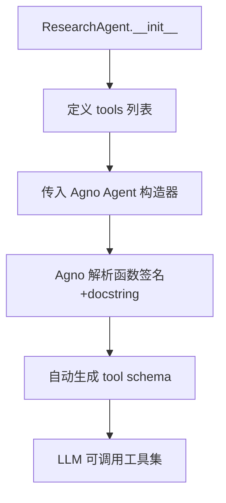
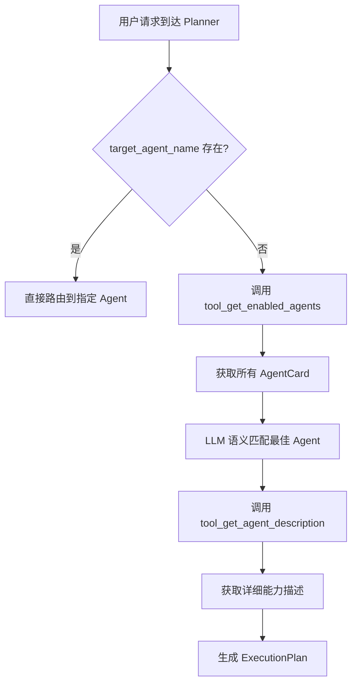

# PD-04.NN ValueCell — Agno 框架双层工具系统与 AgentCard 能力声明

> 文档编号：PD-04.NN
> 来源：ValueCell `python/valuecell/agents/research_agent/core.py`, `python/valuecell/core/plan/planner.py`
> GitHub：https://github.com/ValueCell-ai/valuecell.git
> 问题域：PD-04 工具系统 Tool System Design
> 状态：可复用方案

---

## 第 1 章 问题与动机

### 1.1 核心问题

在多 Agent 金融分析系统中，工具系统面临三个层次的挑战：

1. **工具注册与组合**：不同 Agent（ResearchAgent、NewsAgent、GridAgent）需要不同的工具集，如何让每个 Agent 只看到自己需要的工具？
2. **Planner 的工具发现**：中央规划器（Planner）需要知道所有 Agent 的能力才能做出路由决策，但它不应该直接调用业务工具——它需要的是"元工具"来查询 Agent 能力。
3. **能力声明与运行时解耦**：Agent 的能力描述（skills、tags、examples）需要独立于代码存在，支持配置化管理和动态发现。

ValueCell 的解法是构建一个**双层工具架构**：底层是 Agno 框架的函数式工具注册（Agent 直接使用），上层是 AgentCard JSON 配置 + Planner 元工具（用于能力发现和路由）。

### 1.2 ValueCell 的解法概述

1. **函数即工具**：基于 Agno 框架，Python 函数直接作为工具注册到 Agent，函数签名 + docstring 自动生成 LLM 可理解的 schema（`core.py:33-41`）
2. **AgentCard JSON 配置**：每个 Agent 有独立的 JSON 配置文件声明 skills/tags/examples，与代码实现解耦（`configs/agent_cards/investment_research_agent.json`）
3. **Planner 元工具**：Planner 通过 `tool_get_enabled_agents` 和 `tool_get_agent_description` 两个方法级工具查询 Agent 能力，实现能力感知路由（`planner.py:104-109`）
4. **A2A 协议集成**：AgentCard 遵循 A2A（Agent-to-Agent）协议标准，支持本地和远程 Agent 统一发现（`connect.py:9`）
5. **环境感知工具配置**：工具内部通过环境变量动态切换底层 Provider（如 web_search 根据 `WEB_SEARCH_PROVIDER` 切换 Google/Perplexity）（`sources.py:262-263`）

### 1.3 设计思想

| 设计原则 | 具体实现 | 理由 | 替代方案 |
|----------|----------|------|----------|
| Docstring 即 Schema | 函数 docstring 自动转为 LLM tool schema | 零额外定义成本，保持代码即文档 | 手动定义 JSON Schema / Pydantic 模型 |
| 能力声明与实现分离 | AgentCard JSON 独立于 Agent 代码 | 非开发者可编辑能力描述，支持热更新 | 代码内硬编码能力描述 |
| 元工具模式 | Planner 用方法级工具查询 Agent 能力 | Planner 不需要知道业务工具细节 | Planner 硬编码所有 Agent 能力 |
| 环境感知 Provider 切换 | web_search 内部按环境变量选择 Google/Perplexity | 同一工具接口，不同底层实现 | 注册多个工具让 LLM 选择 |
| 懒加载初始化 | Agent 类通过 `module:Class` spec 延迟导入 | 避免启动时 API key 缺失导致全局失败 | 启动时全量初始化 |

---

## 第 2 章 源码实现分析

### 2.1 架构概览

ValueCell 的工具系统分为两层：Agent 层的业务工具和 Planner 层的元工具。

```
┌─────────────────────────────────────────────────────────┐
│                    Planner Layer                         │
│  ┌─────────────────────┐  ┌──────────────────────────┐  │
│  │ tool_get_enabled_   │  │ tool_get_agent_          │  │
│  │ agents()            │  │ description(name)        │  │
│  └────────┬────────────┘  └────────────┬─────────────┘  │
│           │                            │                 │
│           ▼                            ▼                 │
│  ┌─────────────────────────────────────────────────┐    │
│  │         RemoteConnections                        │    │
│  │  ┌──────────┐ ┌──────────┐ ┌──────────────────┐ │    │
│  │  │AgentCard │ │AgentCard │ │   AgentCard      │ │    │
│  │  │Research  │ │News      │ │   Grid           │ │    │
│  │  └──────────┘ └──────────┘ └──────────────────┘ │    │
│  └─────────────────────────────────────────────────┘    │
└─────────────────────────────────────────────────────────┘
                         │
                         ▼
┌─────────────────────────────────────────────────────────┐
│                    Agent Layer                            │
│  ┌─────────────────┐  ┌──────────────┐  ┌────────────┐  │
│  │ ResearchAgent   │  │  NewsAgent   │  │ GridAgent  │  │
│  │ 7 tools:        │  │  3 tools:    │  │ 0 tools   │  │
│  │ - SEC filings   │  │  - web_search│  │ (pipeline) │  │
│  │ - A-share       │  │  - breaking  │  │            │  │
│  │ - web_search    │  │  - financial │  │            │  │
│  │ - crypto ×3     │  │              │  │            │  │
│  └─────────────────┘  └──────────────┘  └────────────┘  │
└─────────────────────────────────────────────────────────┘
```

### 2.2 核心实现

#### 2.2.1 Agent 层：函数式工具注册



对应源码 `python/valuecell/agents/research_agent/core.py:30-60`：

```python
class ResearchAgent(BaseAgent):
    def __init__(self, **kwargs):
        super().__init__(**kwargs)
        tools = [
            fetch_periodic_sec_filings,
            fetch_event_sec_filings,
            fetch_ashare_filings,
            web_search,
            search_crypto_projects,
            search_crypto_vcs,
            search_crypto_people,
        ]
        # Lazily obtain knowledge; disable search if unavailable
        knowledge = get_knowledge()
        self.knowledge_research_agent = Agent(
            model=model_utils_mod.get_model_for_agent("research_agent"),
            instructions=[KNOWLEDGE_AGENT_INSTRUCTION],
            expected_output=KNOWLEDGE_AGENT_EXPECTED_OUTPUT,
            tools=tools,
            knowledge=knowledge,
            db=InMemoryDb(),
            search_knowledge=knowledge is not None,
            add_datetime_to_context=True,
            add_history_to_context=True,
            num_history_runs=3,
            read_chat_history=True,
            enable_session_summaries=True,
            debug_mode=agent_debug_mode_enabled(),
        )
```

每个工具函数通过 docstring 声明参数语义，Agno 框架自动提取为 LLM tool schema。例如 `sources.py:129-155` 的 `fetch_periodic_sec_filings`：

```python
async def fetch_periodic_sec_filings(
    cik_or_ticker: str,
    forms: List[str] | str = "10-Q",
    year: Optional[int | List[int]] = None,
    quarter: Optional[int | List[int]] = None,
    limit: int = 10,
):
    """Fetch periodic SEC filings (10-K/10-Q) and ingest into knowledge.
    ...
    Args:
        cik_or_ticker: CIK or ticker symbol (no quotes or backticks).
        forms: "10-K", "10-Q" or a list of these. Defaults to "10-Q".
        year: Single year or list of years to include (by filing_date).
        quarter: Single quarter (1-4) or list of quarters (by filing_date).
        limit: When year is omitted, number of latest filings to return.
    Returns:
        List[SECFilingResult]
    """
```

#### 2.2.2 Planner 层：元工具与能力发现



对应源码 `python/valuecell/core/plan/planner.py:92-131`：

```python
class ExecutionPlanner:
    def _get_or_init_agent(self) -> Optional[Agent]:
        if self.agent is not None:
            return self.agent
        try:
            model = model_utils_mod.get_model_for_agent("super_agent")
            self.agent = Agent(
                model=model,
                tools=[
                    self.tool_get_agent_description,
                    self.tool_get_enabled_agents,
                ],
                debug_mode=agent_debug_mode_enabled(),
                instructions=[PLANNER_INSTRUCTION],
                markdown=False,
                output_schema=PlannerResponse,
                expected_output=PLANNER_EXPECTED_OUTPUT,
                use_json_mode=model_utils_mod.model_should_use_json_mode(model),
                db=InMemoryDb(),
                add_datetime_to_context=True,
                add_history_to_context=True,
                num_history_runs=5,
                read_chat_history=True,
                enable_session_summaries=True,
            )
            return self.agent
        except Exception as exc:
            logger.exception("Failed to initialize planner agent: %s", exc)
            self.agent = None
            return None
```

Planner 的两个元工具实现（`planner.py:357-386`）：

```python
def tool_get_agent_description(self, agent_name: str) -> str:
    """Get the capabilities description of a specified agent by name."""
    if card := self.agent_connections.get_agent_card(agent_name):
        if isinstance(card, AgentCard):
            return agentcard_to_prompt(card)
        if isinstance(card, dict):
            return str(card)
        return agentcard_to_prompt(card)
    return "The requested agent could not be found or is not available."

def tool_get_enabled_agents(self) -> str:
    map_agent_name_to_card = self.agent_connections.get_planable_agent_cards()
    parts = []
    for agent_name, card in map_agent_name_to_card.items():
        parts.append(f"<{agent_name}>")
        parts.append(agentcard_to_prompt(card))
        parts.append((f"</{agent_name}>\n"))
    return "\n".join(parts)
```

### 2.3 实现细节

#### AgentCard JSON 配置与 A2A 协议

AgentCard 遵循 A2A 协议标准（`a2a.types.AgentCard`），通过 JSON 文件声明 Agent 能力。`connect.py:226-283` 的 `_load_remote_contexts` 方法扫描 `configs/agent_cards/` 目录加载所有 Agent 配置：

```python
def _load_remote_contexts(self, agent_card_dir: str = None) -> None:
    for json_file in agent_card_dir.glob("*.json"):
        agent_card_dict = json.load(f)
        agent_name = agent_card_dict.get("name")
        if not agent_card_dict.get("enabled", True):
            continue
        metadata = dict(raw_metadata) if isinstance(raw_metadata, dict) else {}
        class_spec = metadata.get(AGENT_METADATA_CLASS_KEY)
        local_agent_card = parse_local_agent_card_dict(agent_card_dict)
        self._contexts[agent_name] = AgentContext(
            name=agent_name,
            url=local_agent_card.url,
            local_agent_card=local_agent_card,
            metadata=metadata or None,
            agent_class_spec=class_spec,
        )
```

每个 AgentCard JSON 包含 `metadata.local_agent_class` 字段（如 `"valuecell.agents.research_agent.core:ResearchAgent"`），通过 `module:Class` 格式实现延迟类解析（`connect.py:80-110`）。

#### 工具调用生命周期追踪

工具调用通过 `StreamResponseEvent` 枚举追踪完整生命周期（`types.py:64-72`）：

```python
class StreamResponseEvent(str, Enum):
    MESSAGE_CHUNK = "message_chunk"
    TOOL_CALL_STARTED = "tool_call_started"
    TOOL_CALL_COMPLETED = "tool_call_completed"
    REASONING_STARTED = "reasoning_started"
    REASONING = "reasoning"
    REASONING_COMPLETED = "reasoning_completed"
```

`ToolCallPayload`（`types.py:116-127`）携带 `tool_call_id`、`tool_name`、`tool_result` 三元组，在 `responses.py:37-78` 的工厂方法中构造。

#### 环境感知 Provider 路由

`web_search` 工具内部根据环境变量动态选择搜索 Provider（`sources.py:245-299`）：

```python
async def web_search(query: str) -> str:
    if os.getenv("WEB_SEARCH_PROVIDER", "google").lower() == "google" \
       and os.getenv("GOOGLE_API_KEY"):
        return await _web_search_google(query)
    # Fallback: Perplexity Sonar via OpenRouter
    model = create_model_with_provider(
        provider="openrouter", model_id="perplexity/sonar", max_tokens=None,
    )
    response = await Agent(model=model).arun(query)
    return response.content
```

#### AgentCard 到 Prompt 的转换

`agentcard_to_prompt`（`planner.py:389-429`）将结构化 AgentCard 转为 LLM 可读的 Markdown 格式，包含 skills 的 name、description、examples、tags：

```python
def agentcard_to_prompt(card: AgentCard):
    prompt = f"# Agent: {card.name}\n\n"
    prompt += f"**Description:** {card.description}\n\n"
    if card.skills:
        prompt += "## Available Skills\n\n"
        for i, skill in enumerate(card.skills, 1):
            prompt += f"### {i}. {skill.name} (`{skill.id}`)\n\n"
            prompt += f"**Description:** {skill.description}\n\n"
            if skill.examples:
                prompt += "**Examples:**\n"
                for example in skill.examples:
                    prompt += f"- {example}\n"
            if skill.tags:
                tags_str = ", ".join([f"`{tag}`" for tag in skill.tags])
                prompt += f"**Tags:** {tags_str}\n\n"
    return prompt.strip()
```

---

## 第 3 章 迁移指南

### 3.1 迁移清单

**阶段 1：函数式工具注册（1 天）**
- [ ] 选择 Agno 或类似框架（LangChain Tools、OpenAI function calling）
- [ ] 将业务逻辑封装为独立 async 函数，docstring 遵循 Google 风格
- [ ] 每个 Agent 在 `__init__` 中组装自己的 tools 列表
- [ ] 确保函数参数有类型注解和默认值

**阶段 2：AgentCard 配置化（0.5 天）**
- [ ] 为每个 Agent 创建 JSON 配置文件，声明 skills/tags/examples
- [ ] 实现 AgentCard 加载器，扫描配置目录
- [ ] 支持 `enabled` 字段控制 Agent 可用性

**阶段 3：Planner 元工具（1 天）**
- [ ] 实现 `tool_get_enabled_agents` 返回所有可用 Agent 的能力摘要
- [ ] 实现 `tool_get_agent_description` 返回单个 Agent 的详细能力
- [ ] 编写 AgentCard → Prompt 的转换函数
- [ ] 在 Planner 的 LLM Agent 中注册这两个元工具

**阶段 4：工具调用生命周期（0.5 天）**
- [ ] 定义 TOOL_CALL_STARTED / TOOL_CALL_COMPLETED 事件
- [ ] 在 Agent stream 循环中捕获 Agno 的 ToolCallStarted/ToolCallCompleted 事件
- [ ] 通过 SSE 推送到前端

### 3.2 适配代码模板

#### 函数式工具注册模板

```python
from typing import List, Optional
from agno.agent import Agent

# Step 1: 定义工具函数（docstring 自动转为 schema）
async def search_documents(
    query: str,
    doc_type: str = "all",
    limit: int = 10,
) -> str:
    """Search documents in the knowledge base.

    Args:
        query: Search query string.
        doc_type: Document type filter. Options: "all", "pdf", "markdown".
        limit: Maximum number of results to return. Defaults to 10.

    Returns:
        JSON string with matching documents.
    """
    # 实际搜索逻辑
    results = await _do_search(query, doc_type, limit)
    return json.dumps(results)


# Step 2: Agent 注册工具
class MyAgent:
    def __init__(self):
        self.agent = Agent(
            model=get_model("my_agent"),
            tools=[search_documents, another_tool],
            instructions=["You are a helpful assistant."],
        )
```

#### Planner 元工具模板

```python
import json
from pathlib import Path
from dataclasses import dataclass
from typing import Dict, Optional

@dataclass
class AgentCapabilityCard:
    name: str
    description: str
    skills: list
    enabled: bool = True

class PlannerToolkit:
    def __init__(self, card_dir: str = "configs/agent_cards"):
        self.cards: Dict[str, AgentCapabilityCard] = {}
        self._load_cards(card_dir)

    def _load_cards(self, card_dir: str):
        for json_file in Path(card_dir).glob("*.json"):
            data = json.loads(json_file.read_text())
            if data.get("enabled", True):
                self.cards[data["name"]] = AgentCapabilityCard(**data)

    def tool_get_enabled_agents(self) -> str:
        """List all enabled agents and their capabilities."""
        parts = []
        for name, card in self.cards.items():
            parts.append(f"<{name}>\n{card.description}\nSkills: {card.skills}\n</{name}>")
        return "\n".join(parts)

    def tool_get_agent_description(self, agent_name: str) -> str:
        """Get detailed description of a specific agent."""
        card = self.cards.get(agent_name)
        if not card:
            return f"Agent '{agent_name}' not found."
        return f"# {card.name}\n{card.description}\nSkills: {json.dumps(card.skills, indent=2)}"
```

### 3.3 适用场景

| 场景 | 适用度 | 说明 |
|------|--------|------|
| 多 Agent 系统需要中央路由 | ⭐⭐⭐ | Planner 元工具模式非常适合 Agent 数量 > 3 的系统 |
| 单 Agent + 多工具 | ⭐⭐⭐ | 函数式注册简单直接，docstring 即 schema |
| 需要非开发者编辑 Agent 能力 | ⭐⭐⭐ | AgentCard JSON 配置可由产品经理维护 |
| 工具需要动态 Provider 切换 | ⭐⭐ | 环境变量驱动的 Provider 路由适合 2-3 个 Provider |
| 需要 MCP 协议支持 | ⭐ | ValueCell 未实现 MCP，需额外适配 |
| 工具数量 > 20 | ⭐⭐ | 需要额外的工具推荐机制，ValueCell 未涉及 |

---

## 第 4 章 测试用例

```python
import json
import pytest
from unittest.mock import AsyncMock, MagicMock, patch
from typing import List


class TestToolRegistration:
    """测试工具注册机制"""

    def test_research_agent_registers_7_tools(self):
        """ResearchAgent 应注册 7 个工具函数"""
        with patch("valuecell.utils.model.get_model_for_agent") as mock_model:
            mock_model.return_value = MagicMock()
            with patch("valuecell.agents.research_agent.knowledge.get_knowledge", return_value=None):
                from valuecell.agents.research_agent.core import ResearchAgent
                agent = ResearchAgent()
                # Agno Agent 的 tools 属性
                registered_tools = agent.knowledge_research_agent.tools
                assert len(registered_tools) == 7

    def test_news_agent_registers_3_tools(self):
        """NewsAgent 应注册 3 个工具函数"""
        with patch("valuecell.adapters.models.create_model_for_agent") as mock_model:
            mock_model.return_value = MagicMock()
            from valuecell.agents.news_agent.core import NewsAgent
            agent = NewsAgent()
            registered_tools = agent.knowledge_news_agent.tools
            assert len(registered_tools) == 3


class TestPlannerMetaTools:
    """测试 Planner 元工具"""

    def test_tool_get_enabled_agents_returns_xml_format(self):
        """tool_get_enabled_agents 应返回 XML 标签包裹的 Agent 描述"""
        mock_connections = MagicMock()
        mock_card = MagicMock()
        mock_card.name = "TestAgent"
        mock_card.description = "A test agent"
        mock_card.skills = []
        mock_connections.get_planable_agent_cards.return_value = {"TestAgent": mock_card}

        from valuecell.core.plan.planner import ExecutionPlanner
        planner = ExecutionPlanner(agent_connections=mock_connections)
        result = planner.tool_get_enabled_agents()
        assert "<TestAgent>" in result
        assert "</TestAgent>" in result

    def test_tool_get_agent_description_not_found(self):
        """查询不存在的 Agent 应返回友好提示"""
        mock_connections = MagicMock()
        mock_connections.get_agent_card.return_value = None

        from valuecell.core.plan.planner import ExecutionPlanner
        planner = ExecutionPlanner(agent_connections=mock_connections)
        result = planner.tool_get_agent_description("NonExistentAgent")
        assert "not available" in result or "not found" in result.lower()


class TestAgentCardLoading:
    """测试 AgentCard 加载"""

    def test_parse_agent_card_with_skills(self):
        """AgentCard 应正确解析 skills 列表"""
        from valuecell.core.agent.card import parse_local_agent_card_dict
        card_dict = {
            "name": "TestAgent",
            "url": "http://localhost:10000/",
            "description": "Test agent",
            "skills": [
                {"id": "skill1", "name": "Skill One", "description": "Does something"}
            ],
            "enabled": True,
            "metadata": {"local_agent_class": "test.module:TestClass"},
        }
        card = parse_local_agent_card_dict(card_dict)
        assert card is not None
        assert card.name == "TestAgent"
        assert len(card.skills) == 1
        assert card.skills[0].id == "skill1"

    def test_disabled_agent_card_skipped(self):
        """enabled=false 的 AgentCard 应被跳过"""
        from valuecell.core.agent.connect import RemoteConnections
        conn = RemoteConnections()
        # 模拟加载包含 disabled agent 的目录
        # 验证 _contexts 中不包含 disabled agent


class TestWebSearchProviderRouting:
    """测试 web_search 的 Provider 路由"""

    @pytest.mark.asyncio
    async def test_google_provider_when_configured(self):
        """设置 GOOGLE_API_KEY 时应使用 Google Provider"""
        with patch.dict("os.environ", {
            "WEB_SEARCH_PROVIDER": "google",
            "GOOGLE_API_KEY": "test-key",
        }):
            with patch("valuecell.agents.research_agent.sources._web_search_google") as mock_google:
                mock_google.return_value = "Google result"
                from valuecell.agents.research_agent.sources import web_search
                result = await web_search("test query")
                mock_google.assert_called_once_with("test query")

    @pytest.mark.asyncio
    async def test_perplexity_fallback_without_google_key(self):
        """未设置 GOOGLE_API_KEY 时应 fallback 到 Perplexity"""
        with patch.dict("os.environ", {"WEB_SEARCH_PROVIDER": "google"}, clear=False):
            with patch.dict("os.environ", {}, clear=False):
                # 移除 GOOGLE_API_KEY
                import os
                os.environ.pop("GOOGLE_API_KEY", None)
                with patch("valuecell.utils.model.create_model_with_provider") as mock_create:
                    mock_agent = MagicMock()
                    mock_agent.arun = AsyncMock(return_value=MagicMock(content="Perplexity result"))
                    with patch("agno.agent.Agent", return_value=mock_agent):
                        from valuecell.agents.research_agent.sources import web_search
                        result = await web_search("test query")
                        mock_create.assert_called_once()


class TestToolCallLifecycle:
    """测试工具调用生命周期事件"""

    def test_tool_call_started_event(self):
        """TOOL_CALL_STARTED 事件应包含 tool_call_id 和 tool_name"""
        from valuecell.core.agent.responses import streaming
        response = streaming.tool_call_started("call-123", "web_search")
        assert response.event.value == "tool_call_started"
        assert response.metadata["tool_call_id"] == "call-123"
        assert response.metadata["tool_name"] == "web_search"

    def test_tool_call_completed_event(self):
        """TOOL_CALL_COMPLETED 事件应包含 tool_result"""
        from valuecell.core.agent.responses import streaming
        response = streaming.tool_call_completed("result data", "call-123", "web_search")
        assert response.event.value == "tool_call_completed"
        assert response.metadata["tool_result"] == "result data"
```

---

## 第 5 章 跨域关联

| 关联域 | 关系类型 | 说明 |
|--------|----------|------|
| PD-02 多 Agent 编排 | 依赖 | Planner 元工具是编排的基础——先发现 Agent 能力，再路由任务。`ExecutionPlanner` 通过 `tool_get_enabled_agents` 实现能力感知路由 |
| PD-01 上下文管理 | 协同 | Planner Agent 配置了 `num_history_runs=5` 和 `enable_session_summaries=True`，工具调用历史作为上下文的一部分被管理 |
| PD-06 记忆持久化 | 协同 | ResearchAgent 的工具（如 `fetch_periodic_sec_filings`）将结果写入 knowledge base（`insert_md_file_to_knowledge`），工具输出即记忆输入 |
| PD-08 搜索与检索 | 依赖 | `web_search` 和 `search_crypto_*` 工具本质上是搜索工具，工具系统是搜索能力的载体 |
| PD-09 Human-in-the-Loop | 协同 | Planner 通过 `UserInputRequest` + `asyncio.Event` 实现工具执行中的人工确认流程（`planner.py:37-72`） |
| PD-11 可观测性 | 协同 | `ToolCallPayload` 携带 `tool_call_id` 实现工具调用的全链路追踪，STARTED/COMPLETED 事件对支持前端实时展示 |
| PD-03 容错与重试 | 协同 | Planner 的懒初始化（`_get_or_init_agent`）在 API key 缺失时返回 None 而非崩溃，`web_search` 的 Provider fallback 也是容错设计 |

---

## 第 6 章 来源文件索引

| 文件 | 行范围 | 关键实现 |
|------|--------|----------|
| `python/valuecell/agents/research_agent/core.py` | L30-60 | ResearchAgent 工具注册，7 个工具函数列表 |
| `python/valuecell/core/plan/planner.py` | L92-131 | ExecutionPlanner 初始化，元工具注册 |
| `python/valuecell/core/plan/planner.py` | L357-386 | `tool_get_enabled_agents` 和 `tool_get_agent_description` 实现 |
| `python/valuecell/core/plan/planner.py` | L389-429 | `agentcard_to_prompt` AgentCard 转 LLM Prompt |
| `python/valuecell/agents/research_agent/sources.py` | L129-179 | `fetch_periodic_sec_filings` 工具函数（docstring 即 schema） |
| `python/valuecell/agents/research_agent/sources.py` | L245-299 | `web_search` 环境感知 Provider 路由 |
| `python/valuecell/core/agent/connect.py` | L203-283 | `RemoteConnections` AgentCard 加载与 Agent 发现 |
| `python/valuecell/core/agent/connect.py` | L80-110 | `_resolve_local_agent_class_sync` 延迟类解析 |
| `python/valuecell/core/agent/card.py` | L12-46 | `parse_local_agent_card_dict` AgentCard 解析 |
| `python/valuecell/core/agent/responses.py` | L37-78 | 工具调用生命周期事件工厂方法 |
| `python/valuecell/core/types.py` | L64-72 | `StreamResponseEvent` 枚举定义 |
| `python/valuecell/core/types.py` | L116-127 | `ToolCallPayload` 数据模型 |
| `python/valuecell/core/plan/models.py` | L69-87 | `PlannerResponse` 规划输出 schema |
| `python/valuecell/core/plan/prompts.py` | L10-75 | `PLANNER_INSTRUCTION` 元工具使用指引 |
| `python/valuecell/agents/news_agent/core.py` | L17-37 | NewsAgent 工具注册（3 个工具） |
| `python/configs/agent_cards/investment_research_agent.json` | 全文 | ResearchAgent AgentCard 配置 |
| `python/configs/agent_cards/news_agent.json` | 全文 | NewsAgent AgentCard 配置 |

---

## 第 7 章 横向对比维度

```json comparison_data
{
  "project": "ValueCell",
  "dimensions": {
    "工具注册方式": "Agno 框架函数式注册，docstring 自动生成 schema",
    "工具分组/权限": "每个 Agent 独立 tools 列表，无跨 Agent 共享",
    "MCP 协议支持": "未实现，使用 A2A 协议 AgentCard 替代",
    "Schema 生成方式": "Docstring 即 Schema，Agno 自动解析函数签名",
    "工具推荐策略": "Planner 元工具 + LLM 语义匹配选择 Agent",
    "双层API架构": "Agent 层业务工具 + Planner 层元工具双层分离",
    "生命周期追踪": "STARTED/COMPLETED 事件对 + ToolCallPayload 三元组",
    "数据供应商路由": "web_search 内部按环境变量切换 Google/Perplexity",
    "供应商降级策略": "Google 不可用时自动 fallback 到 Perplexity OpenRouter",
    "工具集动态组合": "每个 Agent 构造时静态组装，GridAgent 用 pipeline 替代工具",
    "工具上下文注入": "AgentCard JSON 声明 skills/tags/examples 注入 Planner 上下文",
    "伪工具引导": "Planner prompt 中 <tools> 标签描述元工具使用规范"
  }
}
```

### 域元数据补充

```json domain_metadata
{
  "solution_summary": "ValueCell 基于 Agno 框架构建双层工具系统：Agent 层用函数式注册（docstring 即 schema），Planner 层用 tool_get_enabled_agents/tool_get_agent_description 元工具查询 A2A AgentCard 实现能力感知路由",
  "description": "工具系统需要区分业务工具和元工具，支持 Planner 级别的能力发现与路由",
  "sub_problems": [
    "元工具设计：Planner 如何通过工具调用而非硬编码发现 Agent 能力",
    "AgentCard 到 Prompt 转换：结构化能力声明如何转为 LLM 可理解的文本",
    "A2A 协议集成：如何用标准化 Agent 协议替代自定义能力声明格式",
    "Agent 类延迟解析：module:Class spec 如何在线程池中异步解析避免阻塞事件循环"
  ],
  "best_practices": [
    "元工具与业务工具分层：Planner 只注册能力查询工具，不直接调用业务工具",
    "AgentCard 配置独立于代码：非开发者可编辑 JSON 调整 Agent 能力描述",
    "工具函数用 async 定义：支持 I/O 密集型操作（网络请求、文件读写）不阻塞",
    "Agent 初始化懒加载：API key 缺失时返回 None 而非抛异常，保证系统部分可用"
  ]
}
```
