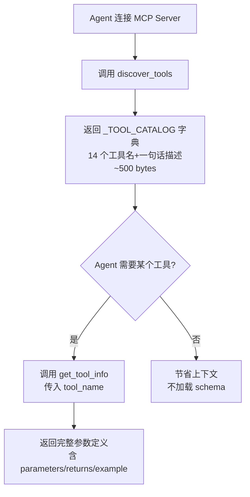
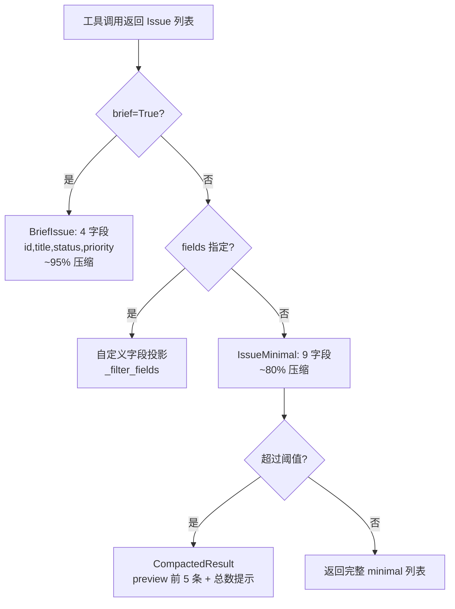
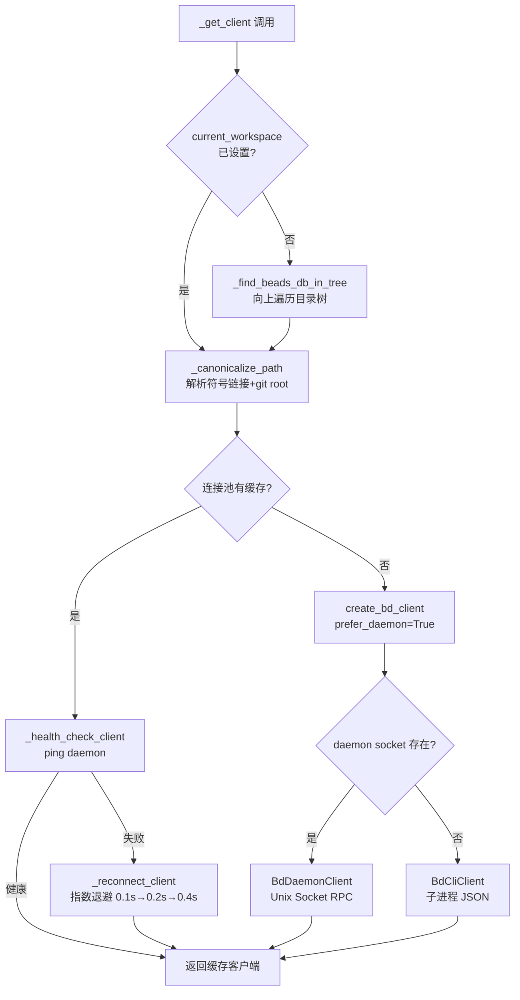

# PD-04.beads Beads — FastMCP 两阶段懒加载与 Chemistry 工具编排

> 文档编号：PD-04.beads
> 来源：Beads `integrations/beads-mcp/src/beads_mcp/server.py`
> GitHub：https://github.com/steveyegge/beads.git
> 问题域：PD-04 工具系统 Tool System Design
> 状态：可复用方案

---

## 第 1 章 问题与动机

### 1.1 核心问题

MCP（Model Context Protocol）工具系统面临一个根本矛盾：**工具数量增长与上下文窗口有限之间的冲突**。当 MCP Server 注册 15+ 工具时，每个工具的完整 JSON Schema（参数名、类型、描述、示例）会消耗 10-50k tokens，在 Agent 首次连接时就占满大量上下文窗口。

Beads 项目同时面临第二个挑战：**工具返回结果的 token 膨胀**。一个 `list` 操作返回 50 个 Issue 的完整 JSON，每个 Issue 含 description、design、acceptance_criteria 等长文本字段，轻松超过 20k tokens。

第三个挑战来自 **工具编排的复杂性**：Agent 需要执行多步骤工作流（创建 epic → 拆分子任务 → 设置依赖 → 分配执行），但 MCP 协议本身不提供工作流模板能力。

### 1.2 Beads 的解法概述

1. **两阶段懒加载**（`discover_tools` → `get_tool_info`）：Agent 首次只获取工具名+一句话描述（~500 bytes），需要时再按需加载单个工具的完整 schema（`server.py:312-552`）
2. **三级返回格式压缩**（Full → Minimal → Brief）：通过 `IssueMinimal`（~80% 压缩）和 `BriefIssue`（~95% 压缩）模型，加上 `CompactedResult` 自动截断大结果集（`models.py:30-101`）
3. **Chemistry 工具编排**（Proto → Mol/Wisp）：通过 `bd formula list` / `bd mol spawn` 实现可复用工作流模板，支持 solid/liquid/vapor 三相生命周期（`MOLECULES.md`）
4. **双层客户端架构**（CLI + Daemon）：`BdClientBase` 抽象基类统一接口，`BdCliClient` 走子进程 JSON 输出，`BdDaemonClient` 走 Unix Socket RPC，运行时自动选择（`bd_client.py:98-165`）
5. **连接池 + 健康检查**：`_connection_pool` 按 workspace 缓存客户端，`_health_check_client` 检测 daemon 存活，失败时指数退避重连（`tools.py:41-282`）

### 1.3 设计思想

| 设计原则 | 具体实现 | 理由 | 替代方案 |
|----------|----------|------|----------|
| 懒加载优先 | discover_tools 只返回名称目录 | 初始 schema 从 50k→500 bytes，节省 99% 上下文 | 全量注册（传统 MCP 做法，浪费上下文） |
| 渐进式详情 | brief → minimal → full 三级模型 | 列表场景不需要完整 Issue，按需获取 | 统一返回完整模型（简单但浪费 token） |
| 自动压缩 | CompactedResult 超阈值自动截断 | 防止大结果集溢出上下文窗口 | 硬限制 limit（用户体验差） |
| 双传输透明 | BdClientBase ABC + 工厂函数 | CLI 兜底保证可用，Daemon 提供性能 | 只支持 CLI（延迟高）或只支持 Daemon（部署复杂） |
| 工作流模板化 | Chemistry Proto/Mol/Wisp 三相 | 复用工作流结构，区分持久/临时场景 | 硬编码工作流（不可复用） |
| 上下文工程 | with_workspace 装饰器 + ContextVar | 多项目隔离，每个请求独立 workspace | 全局单例（不支持多项目） |

---

## 第 2 章 源码实现分析

### 2.1 架构概览

Beads 工具系统采用三层架构：MCP Server 层（FastMCP 注册 + 上下文工程）→ 工具逻辑层（业务函数 + 连接池）→ 客户端层（CLI/Daemon 双传输）。

```
┌─────────────────────────────────────────────────────────┐
│                    MCP Server 层                         │
│  FastMCP("Beads")                                       │
│  ┌──────────────┐  ┌──────────────┐  ┌──────────────┐  │
│  │discover_tools│  │get_tool_info │  │  ready/list   │  │
│  │  (目录)      │  │  (按需详情)  │  │  (压缩返回)  │  │
│  └──────┬───────┘  └──────┬───────┘  └──────┬───────┘  │
│         │                 │                  │          │
│  ┌──────┴─────────────────┴──────────────────┴───────┐  │
│  │  @with_workspace + @require_context 装饰器链      │  │
│  └──────────────────────┬────────────────────────────┘  │
├─────────────────────────┼───────────────────────────────┤
│                    工具逻辑层                            │
│  ┌──────────────────────┴────────────────────────────┐  │
│  │  _get_client() → 连接池 → 健康检查 → 版本校验    │  │
│  │  current_workspace: ContextVar (请求级隔离)       │  │
│  └──────────────────────┬────────────────────────────┘  │
├─────────────────────────┼───────────────────────────────┤
│                    客户端层                              │
│  ┌──────────┐    ┌──────┴──────┐    ┌──────────────┐   │
│  │BdClientBase│←──│create_bd_   │──→│BdCliClient   │   │
│  │  (ABC)    │   │client()     │   │(子进程+JSON) │   │
│  └──────────┘    │(工厂函数)   │   └──────────────┘   │
│                  └─────────────┘    ┌──────────────┐   │
│                                     │BdDaemonClient│   │
│                                     │(Unix Socket) │   │
│                                     └──────────────┘   │
└─────────────────────────────────────────────────────────┘
```

### 2.2 核心实现

#### 2.2.1 两阶段懒加载



对应源码 `server.py:312-552`：

```python
# 轻量级工具目录 — 只有名称和一句话描述
_TOOL_CATALOG = {
    "ready": "Find tasks ready to work on (no blockers)",
    "list": "List issues with filters (status, priority, type)",
    "show": "Show full details for a specific issue",
    "create": "Create a new issue (bug, feature, task, epic)",
    "claim": "Atomically claim an issue for work (assignee + in_progress)",
    # ... 共 14 个工具
    "discover_tools": "List available tools (names only)",
    "get_tool_info": "Get detailed info for a specific tool",
}

@mcp.tool(name="discover_tools")
async def discover_tools() -> dict[str, Any]:
    """Context savings: ~500 bytes vs ~10-50k for full schemas."""
    return {
        "tools": _TOOL_CATALOG,
        "count": len(_TOOL_CATALOG),
        "hint": "Use get_tool_info('tool_name') for full parameters and usage"
    }

@mcp.tool(name="get_tool_info")
async def get_tool_info(tool_name: str) -> dict[str, Any]:
    tool_details = {
        "ready": {
            "name": "ready",
            "description": "Find tasks with no blockers, ready to work on",
            "parameters": {
                "limit": "int (1-100, default 10) - Max issues to return",
                "priority": "int (0-4, optional) - Filter by priority",
                # ... 完整参数定义
            },
            "returns": "List of ready issues (minimal format)",
            "example": "ready(limit=5, priority=1, unassigned=True)"
        },
        # ... 每个工具的完整详情
    }
    if tool_name not in tool_details:
        return {"error": f"Unknown tool: {tool_name}", "available_tools": list(tool_details.keys())}
    return tool_details[tool_name]
```

#### 2.2.2 三级返回格式压缩



对应源码 `models.py:30-101` 和 `server.py:700-930`：

```python
class IssueMinimal(BaseModel):
    """~80% smaller than full Issue."""
    id: str
    title: str
    status: IssueStatus
    priority: int = Field(ge=0, le=4)
    issue_type: IssueType
    assignee: str | None = None
    labels: list[str] = Field(default_factory=list)
    dependency_count: int = 0
    dependent_count: int = 0

class BriefIssue(BaseModel):
    """~95% smaller than full Issue."""
    id: str
    title: str
    status: IssueStatus
    priority: int = Field(ge=0, le=4)

class CompactedResult(BaseModel):
    """Prevents context overflow for large issue lists."""
    compacted: bool = True
    total_count: int
    preview: list[IssueMinimal]
    preview_count: int
    hint: str = "Use show(issue_id) for full issue details"

class OperationResult(BaseModel):
    """~97% smaller than returning full Issue for write ops."""
    id: str
    action: OperationAction  # created|updated|claimed|closed|reopened
    message: str | None = None
```

#### 2.2.3 连接池与健康检查



对应源码 `tools.py:285-361`：

```python
async def _get_client() -> BdClientBase:
    workspace = current_workspace.get() or os.environ.get("BEADS_WORKING_DIR")
    if not workspace:
        workspace = _find_beads_db_in_tree()  # 自动发现
    canonical = _canonicalize_path(workspace)

    async with _pool_lock:
        if canonical in _connection_pool:
            client = _connection_pool[canonical]
            if not await _health_check_client(client):
                del _connection_pool[canonical]
                client = await _reconnect_client(canonical)  # 指数退避
                _connection_pool[canonical] = client
        else:
            client = create_bd_client(prefer_daemon=use_daemon, working_dir=canonical)
            _register_client_for_cleanup(client)
            _connection_pool[canonical] = client

    if canonical not in _version_checked:
        if hasattr(client, '_check_version'):
            await client._check_version()  # 最低版本 0.9.0
        _version_checked.add(canonical)
    return client
```

### 2.3 实现细节

**MCP stdout 保护**：所有日志输出到 `sys.stderr`（`server.py:68`），防止破坏 stdio 传输的 JSON-RPC 协议。CLI 客户端的 `_run_command` 也将调试信息打印到 stderr（`bd_client.py:315-317`）。

**stdin 隔离**：每个子进程调用都设置 `stdin=asyncio.subprocess.DEVNULL`（`bd_client.py:321`），防止 MCP Server 的 stdin（用于 JSON-RPC）被子进程继承。

**workspace 重定向**：支持 `.beads/redirect` 文件实现跨目录共享数据库（`tools.py:68-114`），polecat/crew 子目录可以指向中央 `.beads` 目录。

**写操作保护**：`@require_context` 装饰器在 `BEADS_REQUIRE_CONTEXT=1` 时强制要求先设置 workspace，防止多仓库场景下误操作（`server.py:216-237`）。

**环境变量可配置压缩**：`BEADS_MCP_COMPACTION_THRESHOLD`（默认 20）和 `BEADS_MCP_PREVIEW_COUNT`（默认 5）控制自动压缩行为（`server.py:89-116`）。

**Claude Plugin Hook 系统**：`plugin.json` 注册 `SessionStart` 和 `PreCompact` 两个 hook，自动执行 `bd prime` 注入工作流上下文（`plugin.json:19-41`），确保 Agent 在会话开始和上下文压缩后都能恢复 beads 工作流记忆。


---

## 第 3 章 迁移指南

### 3.1 迁移清单

**阶段 1：两阶段懒加载（1-2 天）**
- [ ] 创建 `_TOOL_CATALOG` 字典，为每个工具写一句话描述
- [ ] 实现 `discover_tools` MCP 工具，返回目录
- [ ] 实现 `get_tool_info` MCP 工具，返回按需详情
- [ ] 在 MCP Server instructions 中引导 Agent 先调用 discover_tools

**阶段 2：返回格式压缩（1-2 天）**
- [ ] 定义 Minimal/Brief/Compacted Pydantic 模型
- [ ] 为列表类工具添加 `brief`/`fields`/`max_description_length` 参数
- [ ] 实现 CompactedResult 自动截断逻辑
- [ ] 为写操作添加 OperationResult 精简返回

**阶段 3：双层客户端（可选，2-3 天）**
- [ ] 定义 `ClientBase` ABC 抽象接口
- [ ] 实现 CLI 客户端（子进程 + JSON 解析）
- [ ] 实现 Daemon 客户端（Unix Socket RPC）
- [ ] 实现连接池 + 健康检查 + 指数退避重连

### 3.2 适配代码模板

以下是可直接复用的两阶段懒加载模板：

```python
"""两阶段懒加载 MCP 工具发现模板 — 可直接复用"""
from fastmcp import FastMCP
from typing import Any

mcp = FastMCP(
    name="MyService",
    instructions="Use discover_tools() first, then get_tool_info() for details.",
)

# 阶段 1：轻量目录（只有名称和一句话描述）
_TOOL_CATALOG: dict[str, str] = {
    "search": "Search items by keyword",
    "create": "Create a new item",
    "update": "Update an existing item",
    "delete": "Delete an item",
}

# 阶段 2：按需详情（完整参数定义）
_TOOL_DETAILS: dict[str, dict[str, Any]] = {
    "search": {
        "name": "search",
        "description": "Search items by keyword with filters",
        "parameters": {
            "query": "str (required) - Search keyword",
            "limit": "int (1-100, default 20) - Max results",
            "sort": "str (optional) - relevance|date|priority",
        },
        "returns": "List of matching items",
        "example": "search(query='auth bug', limit=10)",
    },
    # ... 其他工具详情
}

@mcp.tool(name="discover_tools")
async def discover_tools() -> dict[str, Any]:
    return {"tools": _TOOL_CATALOG, "count": len(_TOOL_CATALOG)}

@mcp.tool(name="get_tool_info")
async def get_tool_info(tool_name: str) -> dict[str, Any]:
    if tool_name not in _TOOL_DETAILS:
        return {"error": f"Unknown: {tool_name}", "available": list(_TOOL_DETAILS)}
    return _TOOL_DETAILS[tool_name]
```

以下是返回格式压缩模板：

```python
"""三级返回格式压缩模板 — 可直接复用"""
from pydantic import BaseModel, Field
from typing import Any

class ItemMinimal(BaseModel):
    """列表视图用，~80% 压缩"""
    id: str
    title: str
    status: str
    priority: int

class ItemBrief(BaseModel):
    """扫描视图用，~95% 压缩"""
    id: str
    title: str

class CompactedResult(BaseModel):
    """大结果集自动截断"""
    compacted: bool = True
    total_count: int
    preview: list[ItemMinimal]
    hint: str = "Use show(id) for full details"

COMPACTION_THRESHOLD = int(os.environ.get("MCP_COMPACTION_THRESHOLD", "20"))
PREVIEW_COUNT = int(os.environ.get("MCP_PREVIEW_COUNT", "5"))

def compact_results(items: list[ItemMinimal]) -> list[ItemMinimal] | CompactedResult:
    if len(items) > COMPACTION_THRESHOLD:
        return CompactedResult(
            total_count=len(items),
            preview=items[:PREVIEW_COUNT],
            hint=f"Showing {PREVIEW_COUNT}/{len(items)}. Use show(id) for details.",
        )
    return items
```

### 3.3 适用场景

| 场景 | 适用度 | 说明 |
|------|--------|------|
| MCP Server 工具数 > 10 | ⭐⭐⭐ | 懒加载收益显著，初始上下文从 50k→500 bytes |
| 列表类 API 返回大量数据 | ⭐⭐⭐ | 三级压缩 + CompactedResult 防止上下文溢出 |
| 多项目/多 workspace 场景 | ⭐⭐⭐ | 连接池 + ContextVar 实现请求级隔离 |
| 需要可复用工作流模板 | ⭐⭐ | Chemistry Proto/Mol/Wisp 适合重复性工作流 |
| 单工具简单 MCP Server | ⭐ | 过度设计，直接注册即可 |

---

## 第 4 章 测试用例

```python
"""基于 beads 真实函数签名的测试用例"""
import pytest
from unittest.mock import AsyncMock, patch, MagicMock
from pydantic import BaseModel, Field
from typing import Any


# ===== 模型定义（从 beads models.py 提取） =====
class IssueMinimal(BaseModel):
    id: str
    title: str
    status: str
    priority: int = Field(ge=0, le=4)
    issue_type: str = "task"
    assignee: str | None = None
    labels: list[str] = Field(default_factory=list)
    dependency_count: int = 0
    dependent_count: int = 0

class BriefIssue(BaseModel):
    id: str
    title: str
    status: str
    priority: int = Field(ge=0, le=4)

class CompactedResult(BaseModel):
    compacted: bool = True
    total_count: int
    preview: list[IssueMinimal]
    preview_count: int
    hint: str = "Use show(issue_id) for full details"

class OperationResult(BaseModel):
    id: str
    action: str
    message: str | None = None


# ===== 两阶段懒加载测试 =====
class TestDiscoverTools:
    def test_catalog_returns_all_tools(self):
        """discover_tools 应返回完整工具目录"""
        catalog = {
            "ready": "Find tasks ready to work on",
            "list": "List issues with filters",
            "show": "Show full details for a specific issue",
        }
        result = {"tools": catalog, "count": len(catalog)}
        assert result["count"] == 3
        assert "ready" in result["tools"]

    def test_catalog_is_lightweight(self):
        """目录总大小应远小于完整 schema"""
        import json
        catalog = {"ready": "Find tasks", "list": "List issues"}
        payload = json.dumps({"tools": catalog, "count": 2})
        assert len(payload) < 200  # 远小于完整 schema 的 10k+

    def test_get_tool_info_unknown_tool(self):
        """未知工具应返回错误和可用列表"""
        tool_details = {"ready": {"name": "ready"}}
        tool_name = "nonexistent"
        if tool_name not in tool_details:
            result = {"error": f"Unknown tool: {tool_name}", "available_tools": list(tool_details.keys())}
        assert "error" in result
        assert "ready" in result["available_tools"]


# ===== 三级返回格式压缩测试 =====
class TestCompaction:
    def _make_issues(self, count: int) -> list[IssueMinimal]:
        return [
            IssueMinimal(id=f"bd-{i}", title=f"Issue {i}", status="open", priority=2)
            for i in range(count)
        ]

    def test_below_threshold_returns_list(self):
        """低于阈值时返回完整列表"""
        issues = self._make_issues(5)
        threshold = 20
        assert len(issues) <= threshold

    def test_above_threshold_returns_compacted(self):
        """超过阈值时返回 CompactedResult"""
        issues = self._make_issues(30)
        threshold, preview_count = 20, 5
        if len(issues) > threshold:
            result = CompactedResult(
                total_count=len(issues),
                preview=issues[:preview_count],
                preview_count=preview_count,
            )
        assert result.compacted is True
        assert result.total_count == 30
        assert len(result.preview) == 5

    def test_brief_issue_minimal_fields(self):
        """BriefIssue 只包含 4 个字段"""
        brief = BriefIssue(id="bd-1", title="Test", status="open", priority=1)
        assert set(brief.model_fields.keys()) == {"id", "title", "status", "priority"}

    def test_operation_result_for_writes(self):
        """写操作返回 OperationResult 而非完整 Issue"""
        result = OperationResult(id="bd-42", action="created")
        assert result.action == "created"
        assert result.message is None


# ===== 连接池与健康检查测试 =====
class TestConnectionPool:
    def test_canonicalize_path_resolves_symlinks(self):
        """路径规范化应解析符号链接"""
        import os
        path = "/tmp/test-beads"
        canonical = os.path.realpath(path)
        assert os.path.isabs(canonical)

    def test_health_check_non_daemon_always_healthy(self):
        """非 daemon 客户端健康检查始终返回 True"""
        class FakeCLIClient:
            pass  # 没有 ping 方法
        client = FakeCLIClient()
        assert not hasattr(client, 'ping')  # CLI 客户端无 ping

    def test_exponential_backoff_delays(self):
        """指数退避延迟应为 0.1s, 0.2s, 0.4s"""
        delays = [0.1 * (2 ** attempt) for attempt in range(3)]
        assert delays == [0.1, 0.2, 0.4]
```


---

## 第 5 章 跨域关联

| 关联域 | 关系类型 | 说明 |
|--------|----------|------|
| PD-01 上下文管理 | 强协同 | 两阶段懒加载和三级压缩的核心目标就是减少上下文消耗；CompactedResult 是上下文窗口保护的直接实现 |
| PD-02 多 Agent 编排 | 协同 | Chemistry Proto/Mol/Wisp 系统本质是工具级的工作流编排；task-agent.md 定义了自主 Agent 的 claim→execute→close 循环 |
| PD-03 容错与重试 | 依赖 | 连接池健康检查 + 指数退避重连（0.1s→0.2s→0.4s）是工具层的容错实现；BdDaemonClient.claim 失败时自动降级到 CLI 客户端 |
| PD-06 记忆持久化 | 强协同 | beads 本身就是持久化记忆系统（Dolt 数据库）；`bd prime` hook 在 SessionStart 和 PreCompact 时注入工作流上下文，确保 Agent 记忆跨会话存活 |
| PD-09 Human-in-the-Loop | 协同 | `@require_context` 装饰器在写操作前强制设置 workspace，是一种隐式的人机确认；ASYNC_GATES.md 提供显式的人工审批门控 |
| PD-10 中间件管道 | 协同 | `@with_workspace` 和 `@require_context` 装饰器链构成了请求级中间件管道，实现 workspace 注入 → 权限检查 → 业务执行的分层处理 |
| PD-11 可观测性 | 协同 | 所有日志输出到 stderr 保护 stdio 协议；`_run_command` 记录每次 bd 命令的数据库路由和工作目录信息 |

---

## 第 6 章 来源文件索引

| 文件 | 行范围 | 关键实现 |
|------|--------|----------|
| `integrations/beads-mcp/src/beads_mcp/server.py` | L1-L12 | 模块文档：Context Engineering 优化说明 |
| `integrations/beads-mcp/src/beads_mcp/server.py` | L89-L116 | 压缩设置：环境变量可配置阈值 |
| `integrations/beads-mcp/src/beads_mcp/server.py` | L118-L130 | FastMCP 实例创建 + instructions 引导 |
| `integrations/beads-mcp/src/beads_mcp/server.py` | L182-L213 | with_workspace 装饰器：请求级 workspace 路由 |
| `integrations/beads-mcp/src/beads_mcp/server.py` | L216-L237 | require_context 装饰器：写操作保护 |
| `integrations/beads-mcp/src/beads_mcp/server.py` | L312-L329 | _TOOL_CATALOG：轻量工具目录 |
| `integrations/beads-mcp/src/beads_mcp/server.py` | L332-L552 | discover_tools + get_tool_info：两阶段懒加载 |
| `integrations/beads-mcp/src/beads_mcp/server.py` | L700-L850 | ready_work：三级压缩返回实现 |
| `integrations/beads-mcp/src/beads_mcp/models.py` | L30-L101 | IssueMinimal/BriefIssue/CompactedResult/OperationResult 模型 |
| `integrations/beads-mcp/src/beads_mcp/tools.py` | L38-L43 | ContextVar + 连接池定义 |
| `integrations/beads-mcp/src/beads_mcp/tools.py` | L117-L167 | _find_beads_db_in_tree：目录树向上遍历发现数据库 |
| `integrations/beads-mcp/src/beads_mcp/tools.py` | L224-L282 | 健康检查 + 指数退避重连 |
| `integrations/beads-mcp/src/beads_mcp/tools.py` | L285-L361 | _get_client：连接池核心逻辑 |
| `integrations/beads-mcp/src/beads_mcp/bd_client.py` | L98-L165 | BdClientBase ABC：16 个抽象方法 |
| `integrations/beads-mcp/src/beads_mcp/bd_client.py` | L214-L337 | BdCliClient：子进程 JSON 输出解析 |
| `integrations/beads-mcp/src/beads_mcp/bd_client.py` | L864-L951 | create_bd_client 工厂：daemon 优先 + CLI 兜底 |
| `integrations/beads-mcp/src/beads_mcp/bd_daemon_client.py` | L47-L196 | BdDaemonClient：Unix Socket RPC |
| `claude-plugin/.claude-plugin/plugin.json` | L19-L41 | SessionStart/PreCompact hook：自动注入 bd prime |
| `claude-plugin/skills/beads/SKILL.md` | L1-L101 | Skill 定义：bd vs TodoWrite 决策矩阵 |
| `claude-plugin/skills/beads/resources/MOLECULES.md` | L1-L358 | Chemistry 系统：Proto/Mol/Wisp 三相工作流 |
| `claude-plugin/agents/task-agent.md` | L1-L61 | 自主 Agent 工作流：ready→claim→execute→close |

---

## 第 7 章 横向对比维度

```json comparison_data
{
  "project": "beads",
  "dimensions": {
    "工具注册方式": "FastMCP @mcp.tool 装饰器 + _TOOL_CATALOG 静态字典双层注册",
    "工具分组/权限": "@require_context 装饰器区分读/写操作权限",
    "MCP 协议支持": "FastMCP 框架原生 stdio 传输，完整 MCP 1.0 实现",
    "热更新/缓存": "连接池 _connection_pool + lru_cache 路径规范化",
    "超时保护": "asyncio.wait_for 5s git 检测超时 + 30s daemon socket 超时",
    "Schema 生成方式": "手写 _TOOL_DETAILS 字典，非自动生成",
    "工具推荐策略": "discover_tools 返回全量目录，由 LLM 自行选择",
    "双层API架构": "BdClientBase ABC + CLI/Daemon 双实现，工厂函数自动选择",
    "结果摘要": "三级压缩 Full→Minimal→Brief + CompactedResult 自动截断",
    "工具上下文注入": "ContextVar + with_workspace 装饰器实现请求级 workspace 路由",
    "工具集动态组合": "Chemistry Proto/Mol/Wisp 三相模板系统支持工作流动态编排",
    "MCP格式转换": "Claude Plugin skills/commands/agents 三类扩展点与 MCP 工具并行",
    "后端工具健康检测": "ping + 指数退避重连（0.1s→0.2s→0.4s，最多 3 次）",
    "伪工具引导": "MCP instructions + bd prime hook 双重引导 Agent 使用规范",
    "工具条件加载": "BEADS_USE_DAEMON 环境变量控制 daemon/CLI 客户端选择",
    "两阶段懒加载": "discover_tools→get_tool_info 将初始 schema 从 50k 压缩到 500 bytes"
  }
}
```

### 域元数据补充

```json domain_metadata
{
  "solution_summary": "Beads 用 FastMCP discover_tools/get_tool_info 两阶段懒加载将初始 schema 从 50k 压缩到 500 bytes，配合 IssueMinimal/BriefIssue/CompactedResult 三级返回压缩和 Chemistry Proto/Mol/Wisp 工作流模板系统",
  "description": "工具系统的上下文工程优化：如何在保持功能完整的前提下最小化工具 schema 和返回结果的 token 消耗",
  "sub_problems": [
    "两阶段懒加载：如何将工具发现与 schema 加载解耦，按需获取工具详情",
    "返回格式分级压缩：如何为同一数据提供 Full/Minimal/Brief 多级视图控制 token 消耗",
    "写操作精简返回：如何用 OperationResult 替代完整对象减少写操作的返回 token",
    "自动压缩阈值：大结果集如何自动截断并提供 preview + hint 引导",
    "Chemistry 工作流模板：如何用 Proto/Mol/Wisp 三相系统实现可复用的工具编排模板",
    "Plugin Hook 上下文注入：如何在 SessionStart/PreCompact 时自动注入工具使用规范"
  ],
  "best_practices": [
    "MCP Server instructions 中引导 Agent 先调用 discover_tools 再按需获取详情",
    "为列表类工具提供 brief/fields/max_description_length 三种粒度控制参数",
    "写操作默认返回 OperationResult 而非完整对象，brief=False 时才返回全量",
    "连接池按 workspace 隔离，健康检查失败时指数退避重连而非立即报错",
    "所有日志输出到 stderr 保护 stdio 传输的 JSON-RPC 协议完整性",
    "子进程调用设置 stdin=DEVNULL 防止 MCP stdin 被继承"
  ]
}
```

