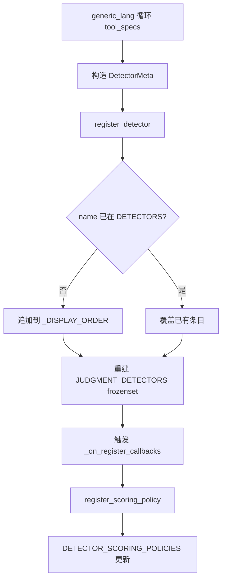
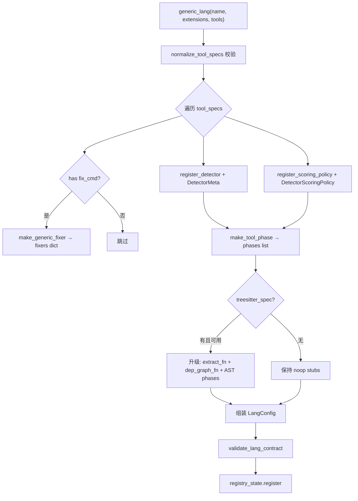

# PD-04.NN desloppify — DetectorMeta 注册表与 generic_lang 工厂式工具系统

> 文档编号：PD-04.NN
> 来源：desloppify `desloppify/core/registry.py`, `desloppify/languages/_framework/generic.py`
> GitHub：https://github.com/peteromallet/desloppify.git
> 问题域：PD-04 工具系统 Tool System Design
> 状态：可复用方案

---

## 第 1 章 问题与动机

### 1.1 核心问题

静态代码分析工具需要支持大量编程语言（28+），每种语言有不同的 linter（ESLint、golangci-lint、cargo clippy、luacheck 等），输出格式各异（GNU、JSON、RuboCop JSON、Cargo JSON Lines 等）。如何设计一个工具系统，让新增语言支持只需声明式配置而非编写大量胶水代码？

核心挑战：
- **格式碎片化**：每个 linter 的输出格式不同，需要统一解析
- **能力层次差异**：有些语言有 tree-sitter 支持（深度分析），有些只有 CLI linter（浅层分析）
- **注册一致性**：每个工具既要注册为检测器（detector），又要注册评分策略（scoring policy），还可能有自动修复器（fixer）
- **优雅降级**：工具未安装或超时时不能崩溃，需要记录覆盖率降级信息

### 1.2 desloppify 的解法概述

1. **DetectorMeta 注册表**（`core/registry.py:46-57`）：frozen dataclass 定义检测器元数据，`register_detector()` 支持运行时动态注册，回调机制通知下游
2. **generic_lang() 工厂函数**（`languages/_framework/generic.py:124-285`）：接收 tool specs 列表，自动完成检测器注册 + 评分策略注册 + 解析器绑定 + 修复器生成 + 阶段组装的全流程
3. **ToolSpec 类型契约**（`languages/_framework/generic_parts/tool_spec.py:8-16`）：TypedDict 定义工具规格，`normalize_tool_specs()` 做严格校验
4. **6 格式解析器目录**（`languages/_framework/generic_parts/parsers.py:163-170`）：gnu/golangci/json/rubocop/cargo/eslint 六种格式的统一解析
5. **三层插件发现**（`languages/_framework/discovery.py:47-108`）：内置 plugin_*.py → 包目录 → 用户 .desloppify/plugins/ 三级加载

### 1.3 设计思想

| 设计原则 | 具体实现 | 理由 | 替代方案 |
|----------|----------|------|----------|
| 声明式注册 | tool spec dict → generic_lang() 一行注册 | 新增语言只需 5-10 行代码 | 每语言手写 LangConfig 子类（Go 的做法，~100 行） |
| 双注册联动 | register_detector + register_scoring_policy 在同一循环 | 保证检测器和评分策略 1:1 对应 | 分散注册，容易遗漏 |
| 格式即协议 | `fmt` 字段选择解析器，PARSERS dict 做路由 | 新增格式只需加一个解析函数 | 每个工具自带解析逻辑 |
| 渐进增强 | tree-sitter 可选，有则升级 depth | 无 tree-sitter 也能工作 | 强制要求 tree-sitter |
| 契约校验 | validate_lang_contract() 在注册时立即校验 | 坏插件 fail-fast，不会在扫描时才崩 | 延迟校验 |

---

## 第 2 章 源码实现分析

### 2.1 架构概览

```
┌─────────────────────────────────────────────────────────────────┐
│                    Language Plugin System                        │
├─────────────────────────────────────────────────────────────────┤
│                                                                  │
│  ┌──────────────┐    ┌──────────────────┐    ┌───────────────┐  │
│  │ plugin_*.py  │    │ lang/<name>/     │    │ .desloppify/  │  │
│  │ (单文件插件)  │    │ __init__.py      │    │ plugins/*.py  │  │
│  │ e.g. rust    │    │ (包插件 e.g. go) │    │ (用户插件)     │  │
│  └──────┬───────┘    └────────┬─────────┘    └──────┬────────┘  │
│         │                     │                      │           │
│         ▼                     ▼                      ▼           │
│  ┌──────────────────────────────────────────────────────────┐   │
│  │              discovery.load_all()                         │   │
│  │  plugin_*.py → 包目录 → 用户插件 三级扫描                  │   │
│  └──────────────────────────┬───────────────────────────────┘   │
│                              │                                   │
│         ┌────────────────────┼────────────────────┐              │
│         ▼                    ▼                    ▼              │
│  ┌─────────────┐   ┌────────────────┐   ┌──────────────────┐   │
│  │generic_lang()│   │ @register_lang │   │register_generic_ │   │
│  │ (工厂路径)   │   │ (装饰器路径)   │   │  lang() (直接)   │   │
│  └──────┬──────┘   └───────┬────────┘   └────────┬─────────┘   │
│         │                   │                      │             │
│         ▼                   ▼                      ▼             │
│  ┌──────────────────────────────────────────────────────────┐   │
│  │              registry_state._registry                     │   │
│  │              { "rust": LangConfig, "go": LangConfig, … } │   │
│  └──────────────────────────────────────────────────────────┘   │
│                              │                                   │
│         ┌────────────────────┼────────────────────┐              │
│         ▼                    ▼                    ▼              │
│  ┌─────────────┐   ┌────────────────┐   ┌──────────────────┐   │
│  │ DETECTORS   │   │ DETECTOR_      │   │ LangConfig       │   │
│  │ (registry)  │   │ SCORING_       │   │ .phases[]        │   │
│  │ DetectorMeta│   │ POLICIES       │   │ .fixers{}        │   │
│  └─────────────┘   └────────────────┘   └──────────────────┘   │
└─────────────────────────────────────────────────────────────────┘
```

### 2.2 核心实现

#### 2.2.1 DetectorMeta 注册表



对应源码 `desloppify/core/registry.py:46-57` + `desloppify/core/registry.py:337-347`：

```python
@dataclass(frozen=True)
class DetectorMeta:
    name: str
    display: str          # 终端显示名
    dimension: str        # 评分维度名
    action_type: str      # "auto_fix" | "refactor" | "reorganize" | "manual_fix"
    guidance: str         # 叙事性修复指导
    fixers: tuple[str, ...] = ()
    tool: str = ""        # "move" 或空
    structural: bool = False
    needs_judgment: bool = False  # 是否需要 LLM 设计判断

def register_detector(meta: DetectorMeta) -> None:
    """Register a detector at runtime (used by generic plugins)."""
    global JUDGMENT_DETECTORS
    DETECTORS[meta.name] = meta
    if meta.name not in _DISPLAY_ORDER:
        _DISPLAY_ORDER.append(meta.name)
    JUDGMENT_DETECTORS = frozenset(
        name for name, m in DETECTORS.items() if m.needs_judgment
    )
    for cb in _on_register_callbacks:
        cb()
```

关键设计：`frozen=True` 保证元数据不可变；`_on_register_callbacks` 允许下游模块监听注册事件（观察者模式）。

#### 2.2.2 generic_lang() 工厂函数



对应源码 `desloppify/languages/_framework/generic.py:124-285`：

```python
def generic_lang(
    name: str,
    extensions: list[str],
    tools: list[dict[str, Any]],
    *,
    exclude: list[str] | None = None,
    depth: str = "shallow",
    detect_markers: list[str] | None = None,
    default_src: str = ".",
    treesitter_spec=None,
    zone_rules: list[ZoneRule] | None = None,
    test_coverage_module: object | None = None,
) -> LangConfig:
    tool_specs = normalize_tool_specs(tools, supported_formats=set(_PARSERS))

    fixers: dict[str, FixerConfig] = {}
    for tool in tool_specs:
        has_fixer = tool.get("fix_cmd") is not None
        fixer_name = tool["id"].replace("_", "-") if has_fixer else ""
        register_detector(DetectorMeta(
            name=tool["id"],
            display=tool["label"],
            dimension="Code quality",
            action_type="auto_fix" if has_fixer else "manual_fix",
            guidance=f"review and fix {tool['label']} findings",
            fixers=(fixer_name,) if has_fixer else (),
        ))
        register_scoring_policy(DetectorScoringPolicy(
            detector=tool["id"],
            dimension="Code quality",
            tier=tool["tier"],
            file_based=True,
        ))
        if has_fixer:
            fixers[fixer_name] = make_generic_fixer(tool)
    # ... 组装 phases, 构建 LangConfig, 注册
```

### 2.3 实现细节

#### ToolSpec 类型契约与严格校验

`desloppify/languages/_framework/generic_parts/tool_spec.py:8-73` 定义了 TypedDict 契约：

```python
class ToolSpec(TypedDict):
    label: str       # 人类可读名称 e.g. "cargo clippy"
    cmd: str         # Shell 命令 e.g. "cargo clippy --message-format=json 2>&1"
    fmt: str         # 解析格式 e.g. "cargo" | "gnu" | "json" | "eslint" | ...
    id: str          # 检测器 ID e.g. "clippy_warning"
    tier: int        # 严重度层级 1-4
    fix_cmd: str | None  # 自动修复命令（可选）
```

`normalize_tool_specs()` 对每个字段做类型检查、空值检查、范围检查（tier 1-4）、格式白名单校验。

#### 六格式解析器目录

`desloppify/languages/_framework/generic_parts/parsers.py:163-170`：

```python
PARSERS: dict[str, Callable[[str, Path], list[dict]]] = {
    "gnu": parse_gnu,        # file:line: message
    "golangci": parse_golangci,  # {"Issues": [...]}
    "json": parse_json,      # [{file, line, message}]
    "rubocop": parse_rubocop,    # {"files": [{path, offenses}]}
    "cargo": parse_cargo,    # JSON Lines with reason=compiler-message
    "eslint": parse_eslint,  # [{filePath, messages}]
}
```

每个解析器统一输出 `list[dict]`，每个 dict 包含 `file`、`line`、`message` 三个字段。

#### 工具执行与优雅降级

`desloppify/languages/_framework/generic_parts/tool_runner.py:52-149` 的 `run_tool_result()` 返回结构化的 `ToolRunResult`：

- `status="ok"` — 正常解析
- `status="empty"` — 工具运行成功但无输出
- `status="error"` + `error_kind` — 区分 `tool_not_found`、`tool_timeout`（120s）、`parser_error`、`tool_failed_no_output` 等

当工具失败时，`_record_tool_failure_coverage()` 将降级信息写入 `lang.detector_coverage` 和 `lang.coverage_warnings`，不中断扫描流程。

#### 三层插件发现

`desloppify/languages/_framework/discovery.py:47-108` 的 `load_all()` 按顺序扫描：

1. `plugin_*.py` 单文件插件（如 `plugin_rust.py`）
2. 包目录（如 `languages/go/__init__.py`）
3. 用户自定义 `.desloppify/plugins/*.py`

失败的插件记录到 `registry_state._load_errors`，不阻塞其他插件加载。


---

## 第 3 章 迁移指南

### 3.1 迁移清单

**阶段 1：核心注册表（1 个文件）**
- [ ] 定义 `ToolMeta` dataclass（对应 DetectorMeta）
- [ ] 实现 `register_tool()` 函数 + 全局 `TOOLS` dict
- [ ] 添加回调机制 `on_tool_registered()`

**阶段 2：工具规格契约（1 个文件）**
- [ ] 定义 `ToolSpec` TypedDict
- [ ] 实现 `normalize_tool_specs()` 校验函数
- [ ] 定义解析器接口 `Callable[[str, Path], list[dict]]`

**阶段 3：解析器目录（1 个文件）**
- [ ] 实现所需格式的解析器（至少 gnu + json）
- [ ] 构建 `PARSERS` 路由 dict

**阶段 4：工厂函数（1 个文件）**
- [ ] 实现 `register_tool_plugin(name, tools, ...)` 工厂函数
- [ ] 在工厂内完成注册 + 解析器绑定 + 修复器生成

**阶段 5：插件发现（1 个文件）**
- [ ] 实现 `load_all()` 三级扫描
- [ ] 添加错误隔离和降级记录

### 3.2 适配代码模板

```python
"""Minimal tool registry system inspired by desloppify."""
from __future__ import annotations

import subprocess
import shlex
import re
import json
from dataclasses import dataclass, field
from pathlib import Path
from typing import Any, Callable, TypedDict, Literal

# ── 1. Tool metadata registry ──

@dataclass(frozen=True)
class ToolMeta:
    name: str
    display: str
    category: str  # e.g. "lint", "security", "format"
    has_fixer: bool = False

TOOLS: dict[str, ToolMeta] = {}
_callbacks: list[Callable[[], None]] = []

def register_tool(meta: ToolMeta) -> None:
    TOOLS[meta.name] = meta
    for cb in _callbacks:
        cb()

def on_tool_registered(cb: Callable[[], None]) -> None:
    _callbacks.append(cb)

# ── 2. Tool spec contract ──

class ToolSpec(TypedDict):
    label: str
    cmd: str
    fmt: str       # "gnu" | "json"
    id: str
    tier: int      # 1-4
    fix_cmd: str | None

def normalize_specs(raw: list[dict], formats: set[str]) -> list[ToolSpec]:
    result = []
    for i, r in enumerate(raw):
        for key in ("label", "cmd", "fmt", "id"):
            if not str(r.get(key, "")).strip():
                raise ValueError(f"tools[{i}].{key} required")
        if r["fmt"] not in formats:
            raise ValueError(f"tools[{i}].fmt unsupported: {r['fmt']}")
        result.append(ToolSpec(
            label=r["label"], cmd=r["cmd"], fmt=r["fmt"],
            id=r["id"], tier=r.get("tier", 2),
            fix_cmd=r.get("fix_cmd"),
        ))
    return result

# ── 3. Parser catalog ──

def parse_gnu(output: str, path: Path) -> list[dict]:
    entries = []
    for line in output.splitlines():
        m = re.match(r"^(.+?):(\d+)(?::\d+)?:\s*(.+)$", line)
        if m:
            entries.append({"file": m[1], "line": int(m[2]), "message": m[3]})
    return entries

def parse_json_flat(output: str, path: Path) -> list[dict]:
    data = json.loads(output)
    return [
        {"file": str(i.get("file","")), "line": i.get("line",0), "message": str(i.get("message",""))}
        for i in (data if isinstance(data, list) else [])
        if i.get("file") and i.get("message")
    ]

PARSERS = {"gnu": parse_gnu, "json": parse_json_flat}

# ── 4. Tool runner with graceful degradation ──

@dataclass(frozen=True)
class RunResult:
    entries: list[dict]
    status: Literal["ok", "empty", "error"]
    error_kind: str | None = None

def run_tool(cmd: str, cwd: Path, parser: Callable) -> RunResult:
    try:
        r = subprocess.run(
            shlex.split(cmd), cwd=str(cwd),
            capture_output=True, text=True, timeout=120,
        )
    except FileNotFoundError:
        return RunResult([], "error", "not_found")
    except subprocess.TimeoutExpired:
        return RunResult([], "error", "timeout")
    output = (r.stdout or "") + (r.stderr or "")
    if not output.strip():
        return RunResult([], "empty")
    try:
        parsed = parser(output, cwd)
    except (json.JSONDecodeError, ValueError):
        return RunResult([], "error", "parse_error")
    return RunResult(parsed, "ok" if parsed else "empty")

# ── 5. Factory function ──

def register_plugin(name: str, tools: list[dict]) -> dict:
    specs = normalize_specs(tools, set(PARSERS))
    commands = {}
    for t in specs:
        register_tool(ToolMeta(
            name=t["id"], display=t["label"],
            category="lint", has_fixer=t["fix_cmd"] is not None,
        ))
        parser = PARSERS[t["fmt"]]
        commands[t["id"]] = lambda path, c=t["cmd"], p=parser: run_tool(c, path, p)
    return commands

# ── Usage: 5 lines to add a language ──
# register_plugin("rust", [
#     {"label": "cargo clippy", "cmd": "cargo clippy --message-format=json 2>&1",
#      "fmt": "json", "id": "clippy", "tier": 2, "fix_cmd": "cargo clippy --fix"},
# ])
```

### 3.3 适用场景

| 场景 | 适用度 | 说明 |
|------|--------|------|
| 多语言 linter 聚合平台 | ⭐⭐⭐ | 核心场景，generic_lang 模式直接适用 |
| CI/CD 质量门禁 | ⭐⭐⭐ | 统一解析 + 评分策略可直接复用 |
| IDE 插件后端 | ⭐⭐ | 需要适配增量扫描，工厂模式仍适用 |
| Agent 工具系统 | ⭐⭐ | 注册表 + 工厂模式可迁移，但需加 LLM schema 层 |
| 单语言项目 | ⭐ | 过度设计，直接调用 linter 即可 |

---

## 第 4 章 测试用例

```python
"""Tests for the tool registry and generic_lang factory pattern."""
import json
import subprocess
from dataclasses import dataclass
from pathlib import Path
from unittest.mock import MagicMock, patch

import pytest


# ── Test ToolSpec normalization ──

class TestNormalizeToolSpecs:
    def test_valid_spec_passes(self):
        from desloppify.languages._framework.generic_parts.tool_spec import normalize_tool_specs
        specs = normalize_tool_specs(
            [{"label": "test", "cmd": "echo ok", "fmt": "gnu", "id": "test_lint", "tier": 2}],
            supported_formats={"gnu", "json"},
        )
        assert len(specs) == 1
        assert specs[0]["id"] == "test_lint"
        assert specs[0]["fix_cmd"] is None

    def test_missing_label_raises(self):
        from desloppify.languages._framework.generic_parts.tool_spec import normalize_tool_specs
        with pytest.raises(ValueError, match="label"):
            normalize_tool_specs(
                [{"cmd": "x", "fmt": "gnu", "id": "x", "tier": 1}],
                supported_formats={"gnu"},
            )

    def test_unsupported_format_raises(self):
        from desloppify.languages._framework.generic_parts.tool_spec import normalize_tool_specs
        with pytest.raises(ValueError, match="unsupported"):
            normalize_tool_specs(
                [{"label": "x", "cmd": "x", "fmt": "yaml", "id": "x", "tier": 1}],
                supported_formats={"gnu"},
            )

    def test_tier_out_of_range_raises(self):
        from desloppify.languages._framework.generic_parts.tool_spec import normalize_tool_specs
        with pytest.raises(ValueError, match="tier"):
            normalize_tool_specs(
                [{"label": "x", "cmd": "x", "fmt": "gnu", "id": "x", "tier": 5}],
                supported_formats={"gnu"},
            )


# ── Test DetectorMeta registration ──

class TestDetectorRegistry:
    def test_register_adds_to_detectors(self):
        from desloppify.core.registry import DetectorMeta, DETECTORS, register_detector
        meta = DetectorMeta(
            name="test_detector_xyz",
            display="Test XYZ",
            dimension="Code quality",
            action_type="manual_fix",
            guidance="fix it",
        )
        register_detector(meta)
        assert "test_detector_xyz" in DETECTORS
        assert DETECTORS["test_detector_xyz"].display == "Test XYZ"

    def test_callback_fires_on_register(self):
        from desloppify.core.registry import DetectorMeta, register_detector, on_detector_registered
        called = []
        on_detector_registered(lambda: called.append(True))
        register_detector(DetectorMeta(
            name="test_cb_detector",
            display="CB",
            dimension="Code quality",
            action_type="manual_fix",
            guidance="",
        ))
        assert len(called) >= 1


# ── Test tool runner degradation ──

class TestToolRunner:
    def test_tool_not_found_returns_error(self):
        from desloppify.languages._framework.generic_parts.tool_runner import run_tool_result
        result = run_tool_result(
            "nonexistent_tool_xyz_123",
            Path("/tmp"),
            lambda o, p: [],
        )
        assert result.status == "error"
        assert result.error_kind == "tool_not_found"

    def test_timeout_returns_error(self):
        from desloppify.languages._framework.generic_parts.tool_runner import run_tool_result
        def slow_runner(*args, **kwargs):
            raise subprocess.TimeoutExpired("cmd", 120)
        result = run_tool_result(
            "sleep 999",
            Path("/tmp"),
            lambda o, p: [],
            run_subprocess=slow_runner,
        )
        assert result.status == "error"
        assert result.error_kind == "tool_timeout"

    def test_successful_parse(self):
        from desloppify.languages._framework.generic_parts.tool_runner import run_tool_result
        def mock_runner(*args, **kwargs):
            return subprocess.CompletedProcess(args="", returncode=0, stdout="f.py:10: bad\n", stderr="")
        from desloppify.languages._framework.generic_parts.parsers import parse_gnu
        result = run_tool_result("echo", Path("/tmp"), parse_gnu, run_subprocess=mock_runner)
        assert result.status == "ok"
        assert len(result.entries) == 1
        assert result.entries[0]["line"] == 10


# ── Test parser catalog ──

class TestParsers:
    def test_parse_gnu_basic(self):
        from desloppify.languages._framework.generic_parts.parsers import parse_gnu
        entries = parse_gnu("src/main.py:42: unused import\n", Path("/tmp"))
        assert entries == [{"file": "src/main.py", "line": 42, "message": "unused import"}]

    def test_parse_eslint_json(self):
        from desloppify.languages._framework.generic_parts.parsers import parse_eslint
        data = json.dumps([{"filePath": "a.js", "messages": [{"line": 1, "message": "no-var"}]}])
        entries = parse_eslint(data, Path("/tmp"))
        assert len(entries) == 1
        assert entries[0]["message"] == "no-var"

    def test_parse_cargo_json_lines(self):
        from desloppify.languages._framework.generic_parts.parsers import parse_cargo
        line = json.dumps({
            "reason": "compiler-message",
            "message": {"rendered": "warning: unused\nmore", "spans": [{"file_name": "src/lib.rs", "line_start": 5}]}
        })
        entries = parse_cargo(line, Path("/tmp"))
        assert len(entries) == 1
        assert entries[0]["file"] == "src/lib.rs"
```


---

## 第 5 章 跨域关联

| 关联域 | 关系类型 | 说明 |
|--------|----------|------|
| PD-03 容错与重试 | 协同 | `ToolRunResult` 的 `error_kind` 分类（tool_not_found/tool_timeout/parser_error）直接服务于优雅降级，`_record_tool_failure_coverage()` 将失败信息结构化记录而非抛异常 |
| PD-07 质量检查 | 依赖 | DetectorScoringPolicy 的 tier/dimension 字段驱动评分系统，每个工具注册时同步注册评分策略，质量检查依赖工具系统的注册完整性 |
| PD-10 中间件管道 | 协同 | `LangConfig.phases` 是有序的 `DetectorPhase` 列表，generic_lang() 按 tool phases → structural → AST → security → subjective 顺序组装，本质是管道模式 |
| PD-11 可观测性 | 协同 | `DetectorCoverageRecord` 和 `coverage_warnings` 提供工具级覆盖率元数据，可用于扫描报告中展示哪些检测器因工具缺失而降级 |

---

## 第 6 章 来源文件索引

| 文件 | 行范围 | 关键实现 |
|------|--------|----------|
| `desloppify/core/registry.py` | L46-L57 | DetectorMeta frozen dataclass 定义 |
| `desloppify/core/registry.py` | L337-L347 | register_detector() 运行时注册 + 回调 |
| `desloppify/core/registry.py` | L329-L334 | on_detector_registered() 观察者回调 |
| `desloppify/core/registry.py` | L382-L395 | detector_tools() 元数据导出 |
| `desloppify/languages/_framework/generic.py` | L124-L285 | generic_lang() 工厂函数全流程 |
| `desloppify/languages/_framework/generic.py` | L159-L179 | 双注册循环：detector + scoring policy |
| `desloppify/languages/_framework/generic_parts/tool_spec.py` | L8-L73 | ToolSpec TypedDict + normalize_tool_specs() |
| `desloppify/languages/_framework/generic_parts/parsers.py` | L46-L170 | 六格式解析器 + PARSERS 路由 dict |
| `desloppify/languages/_framework/generic_parts/tool_runner.py` | L22-L149 | ToolRunResult + run_tool_result() 执行与降级 |
| `desloppify/languages/_framework/generic_parts/tool_factories.py` | L60-L96 | make_tool_phase() 阶段工厂 |
| `desloppify/languages/_framework/generic_parts/tool_factories.py` | L113-L158 | make_generic_fixer() 修复器工厂 |
| `desloppify/languages/_framework/discovery.py` | L47-L108 | load_all() 三级插件发现 |
| `desloppify/languages/_framework/registry_state.py` | L26-L93 | 全局注册表状态管理 |
| `desloppify/languages/_framework/contract_validation.py` | L113-L132 | validate_lang_contract() 契约校验 |
| `desloppify/languages/__init__.py` | L30-L54 | register_lang 装饰器 + register_generic_lang |
| `desloppify/languages/_framework/base/types.py` | L27-L37 | DetectorPhase dataclass |
| `desloppify/languages/_framework/base/types.py` | L98-L108 | FixerConfig dataclass |
| `desloppify/languages/_framework/base/types.py` | L130-L349 | LangConfig 完整定义 |
| `desloppify/languages/rust/__init__.py` | L1-L31 | Rust 插件：generic_lang 5 行声明式注册 |
| `desloppify/languages/lua/__init__.py` | L1-L21 | Lua 插件：最简 generic_lang 调用 |
| `desloppify/languages/go/__init__.py` | L50-L102 | Go 插件：@register_lang 装饰器全量配置 |
| `desloppify/scoring.py` | L1-L82 | 评分系统 facade，导出 register_scoring_policy |

---

## 第 7 章 横向对比维度

> **重要：** 本章用于自动填充 Butcher Wiki 的横向对比表。

```json comparison_data
{
  "project": "desloppify",
  "dimensions": {
    "工具注册方式": "DetectorMeta frozen dataclass + register_detector() 运行时注册，支持观察者回调",
    "Schema 生成方式": "ToolSpec TypedDict 契约 + normalize_tool_specs() 严格校验（类型/范围/白名单）",
    "工具分组/权限": "dimension 字段分组 + action_type 四级分类（auto_fix/refactor/reorganize/manual_fix）",
    "工具优雅降级": "ToolRunResult 五级状态 + error_kind 分类 + coverage_warnings 结构化降级记录",
    "工具条件加载": "三层插件发现：plugin_*.py → 包目录 → .desloppify/plugins/，失败隔离不阻塞",
    "工具集动态组合": "generic_lang() 按 treesitter 可用性动态组装 phases（浅层→标准→完整）",
    "参数校验": "normalize_tool_specs 对 label/cmd/fmt/id/tier/fix_cmd 逐字段校验 + validate_lang_contract 注册时契约校验",
    "处理器链模式": "LangConfig.phases 有序 DetectorPhase 列表：tool → structural → AST → security → subjective",
    "延迟导入隔离": "treesitter 相关模块全部延迟导入，is_available() 检测后才加载 _extractors/_imports",
    "两阶段懒加载": "discovery.load_all() 按需触发 + registry_state.was_load_attempted() 防重复加载",
    "工具内业务校验": "make_generic_fixer 修复后重新 detect 计算 fixed_count，验证修复效果"
  }
}
```

### 域元数据补充

```json domain_metadata
{
  "solution_summary": "desloppify 用 DetectorMeta frozen dataclass 注册表 + generic_lang() 工厂函数，实现 28 种语言的声明式工具注册，5 行代码即可新增语言支持",
  "description": "声明式工厂模式如何将多语言工具注册从百行代码压缩到个位数行",
  "sub_problems": [
    "工厂函数双注册联动：如何在一个循环中同步完成检测器注册和评分策略注册保证 1:1 对应",
    "多格式解析器路由：如何用 fmt 字段路由到 gnu/json/eslint/cargo 等不同输出格式的解析器",
    "插件契约校验：注册时如何立即校验 LangConfig 的 phases/detect_commands/fixers 等字段完整性",
    "覆盖率降级记录：工具执行失败时如何结构化记录降级原因供扫描报告消费"
  ],
  "best_practices": [
    "frozen dataclass 保证工具元数据注册后不可变，避免运行时篡改",
    "工厂函数内双注册（detector + scoring）保证一致性，不要分散注册",
    "插件发现失败应隔离记录而非中断加载，保证其他插件正常工作"
  ]
}
```

