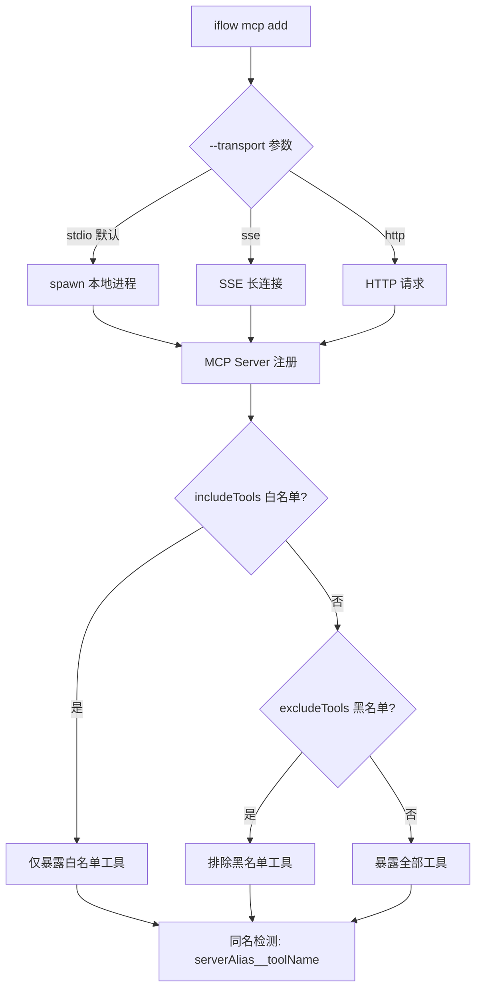
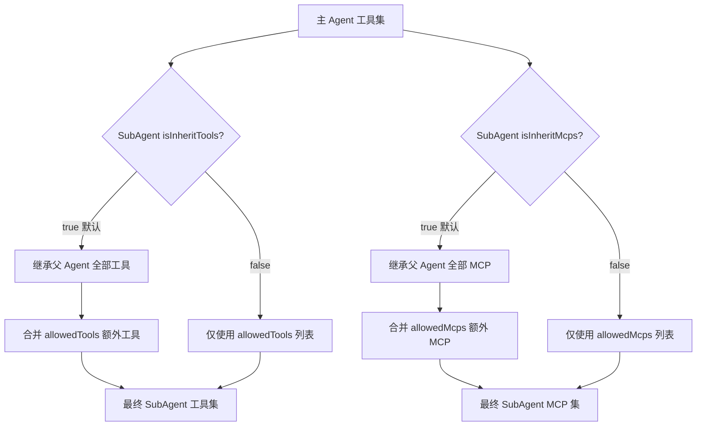

# PD-04.NN iflow-cli — TOML 自定义命令 + MCP 三传输 + 处理器链工具系统

> 文档编号：PD-04.NN
> 来源：iflow-cli `docs_en/examples/mcp.md`, `docs_en/examples/subcommand.md`, `docs_en/configuration/settings.md`, `docs_en/examples/hooks.md`
> GitHub：https://github.com/iflow-ai/iflow-cli.git
> 问题域：PD-04 工具系统 Tool System Design
> 状态：可复用方案

---

## 第 1 章 问题与动机（≥ 30 行）

### 1.1 核心问题

AI CLI 工具面临的工具系统设计挑战：

1. **工具来源多样性**：内置工具（Read/Write/Shell/Grep）、MCP 外部工具、用户自定义命令、社区市场命令需要统一管理
2. **MCP 传输协议碎片化**：stdio 本地进程、SSE 实时流、HTTP 远程服务三种传输方式需要统一接入
3. **工具权限精细控制**：不同 Agent（主 Agent vs SubAgent）需要不同的工具集，同一 MCP Server 内的工具也需要白黑名单过滤
4. **自定义命令的低门槛扩展**：非开发者用户也需要能创建自定义工具/命令，不能要求写代码
5. **工具调用的生命周期管理**：工具执行前后需要 Hook 拦截点，支持安全审计、自动格式化、日志记录等横切关注点

### 1.2 iflow-cli 的解法概述

iflow-cli 构建了一个四层工具系统，从内到外依次为：

1. **内置核心工具层**（`coreTools`）：ReadFileTool、GlobTool、ShellTool 等，通过 `coreTools` 配置白名单 + `excludeTools` 黑名单实现精细控制，支持命令级粒度限制如 `ShellTool(ls -l)` — `docs_en/configuration/settings.md:281-289`
2. **MCP 外部工具层**：支持 stdio/SSE/HTTP 三种传输协议，每个 Server 独立配置 `includeTools`/`excludeTools` 白黑名单，同名工具自动加 `serverAlias__toolName` 前缀避免冲突 — `docs_en/examples/mcp.md:143-180`
3. **TOML/Markdown 自定义命令层**（SubCommand）：用户通过 TOML 或 Markdown 文件定义 slash 命令，支持 `{{args}}` 参数注入和 `!{shell}` Shell 命令嵌入，经 ShellProcessor → ArgumentProcessor 处理器链处理 — `docs_en/examples/subcommand.md:380-456`
4. **SubAgent 工具隔离层**：每个 SubAgent 通过 `allowedTools`/`allowedMcps` + `isInheritTools`/`isInheritMcps` 继承机制实现工具级权限控制 — `docs_en/examples/subagent.md:329-367`

### 1.3 设计思想

| 设计原则 | 具体实现 | 理由 | 替代方案 |
|----------|----------|------|----------|
| 声明式工具定义 | TOML/Markdown 文件即命令，无需写代码 | 降低自定义命令门槛，非开发者也能创建 | Function Calling Schema JSON（门槛高） |
| 处理器链模式 | ShellProcessor → ShorthandArgumentProcessor → DefaultArgumentProcessor | 关注点分离，每个处理器只做一件事 | 单一模板引擎（灵活性差） |
| 白黑名单双重过滤 | coreTools 白名单 + excludeTools 黑名单，黑名单优先 | 安全优先，黑名单永远生效 | 仅白名单（不够灵活） |
| 传输协议透明 | `iflow mcp add --transport sse/http/stdio` 统一 CLI 接口 | 用户无需理解协议细节 | 手动编辑 JSON 配置（易出错） |
| 工具继承机制 | SubAgent 默认继承父 Agent 工具，可选择关闭 | 减少重复配置，同时保留隔离能力 | 每个 Agent 独立配置（冗余） |
| 9 类 Hook 生命周期 | PreToolUse/PostToolUse/SessionStart/Stop 等 9 种 Hook | 覆盖工具调用全生命周期 | 仅 pre/post 两个钩子（不够细） |

---

## 第 2 章 源码实现分析（≥ 60 行，核心章节）

### 2.1 架构概览

iflow-cli 的工具系统是一个四层架构，从底层到顶层：

```
┌─────────────────────────────────────────────────────────────┐
│                    SubAgent 工具隔离层                        │
│  allowedTools + allowedMcps + isInheritTools/isInheritMcps  │
├─────────────────────────────────────────────────────────────┤
│              TOML/Markdown 自定义命令层                       │
│  ShellProcessor → ShorthandArgProcessor → DefaultArgProcessor│
├─────────────────────────────────────────────────────────────┤
│                  MCP 外部工具层                               │
│  stdio | SSE | HTTP  ×  includeTools/excludeTools 过滤       │
│  同名冲突: serverAlias__toolName 自动前缀                     │
├─────────────────────────────────────────────────────────────┤
│                  内置核心工具层                               │
│  coreTools 白名单 + excludeTools 黑名单                      │
│  命令级粒度: ShellTool(ls -l)                                │
├─────────────────────────────────────────────────────────────┤
│              配置层级: System > Project > User > Default      │
│  settings.json + 环境变量 IFLOW_* + CLI 参数                 │
└─────────────────────────────────────────────────────────────┘
```

### 2.2 核心实现

#### 2.2.1 MCP 三传输协议统一接入



对应配置 `docs_en/configuration/settings.md:323-360`：

```json
{
  "mcpServers": {
    "myPythonServer": {
      "command": "python",
      "args": ["mcp_server.py", "--port", "8080"],
      "cwd": "./mcp_tools/python",
      "timeout": 5000,
      "includeTools": ["safe_tool", "file_reader"]
    },
    "myNodeServer": {
      "command": "node",
      "args": ["mcp_server.js"],
      "cwd": "./mcp_tools/node",
      "excludeTools": ["dangerous_tool", "file_deleter"]
    },
    "myDockerServer": {
      "command": "docker",
      "args": ["run", "-i", "--rm", "-e", "API_KEY", "ghcr.io/foo/bar"],
      "env": { "API_KEY": "$MY_API_TOKEN" }
    }
  }
}
```

关键设计点：
- **黑名单优先**：`excludeTools` 优先于 `includeTools`，即使工具同时出现在两个列表中也会被排除 — `docs_en/configuration/settings.md:155`
- **同名冲突解决**：多个 MCP Server 暴露同名工具时，自动加 `serverAlias__actualToolName` 前缀 — `docs_en/examples/mcp.md:144`
- **环境变量引用**：`env` 字段支持 `$VAR_NAME` 语法引用宿主环境变量 — `docs_en/configuration/settings.md:219`
- **信任模式**：`trust: true` 跳过该 Server 所有工具的确认提示 — `docs_en/configuration/settings.md:153`

#### 2.2.2 TOML/Markdown 处理器链

```mermaid
graph TD
    A[用户输入 /my-command args] --> B[加载 .toml/.md 文件]
    B --> C{包含 !{...} ?}
    C -->|是| D[ShellProcessor: 执行 Shell 并替换输出]
    C -->|否| E{包含 双大括号args ?}
    D --> E
    E -->|是| F[ShorthandArgumentProcessor: 替换参数占位符]
    E -->|否| G[DefaultArgumentProcessor: 追加用户输入到 prompt 末尾]
    F --> H[最终 prompt 发送给 LLM]
    G --> H
```

对应 TOML 配置 `docs_en/examples/subcommand.md:380-456`：

```toml
# .iflow/commands/project-status.toml
description = "Comprehensive project status analysis"

prompt = """
Comprehensive project status report:

## Repository Status
Git branch: !{git branch --show-current}
Uncommitted changes: !{git status --porcelain | wc -l}
Recent commits: !{git log --oneline -5}

## Code Quality
TypeScript files: !{find . -name "*.ts" -o -name "*.tsx" | wc -l}
Test files: !{find . -name "*.test.*" -o -name "*.spec.*" | wc -l}

Please analyze project health and provide improvement suggestions.
"""
```

处理器链的三个阶段：

| 处理器 | 触发条件 | 功能 | 安全机制 |
|--------|----------|------|----------|
| ShellProcessor | prompt 包含 `!{...}` | 执行 Shell 命令并将输出替换到 prompt 中 | 命令白名单 + 用户确认 |
| ShorthandArgumentProcessor | prompt 包含 `{{args}}` | 将用户输入替换到指定位置 | 无（纯文本替换） |
| DefaultArgumentProcessor | 默认（无占位符时） | 将用户输入追加到 prompt 末尾 | 无 |

配置验证使用 Zod schema — `docs_en/examples/subcommand.md:597-606`：

```typescript
const TomlCommandDefSchema = z.object({
  prompt: z.string({
    required_error: "The 'prompt' field is required.",
    invalid_type_error: "The 'prompt' field must be a string.",
  }),
  description: z.string().optional(),
});
```

#### 2.2.3 SubAgent 工具继承与隔离



对应配置 `docs_en/examples/subagent.md:329-367`：

```markdown
---
agentType: "security-auditor"
systemPrompt: "You are a security audit expert..."
whenToUse: "Use when performing security audits"
allowedTools: ["Read", "Grep", "Bash"]
allowedMcps: ["security-scanner", "vulnerability-db"]
isInheritTools: false
isInheritMcps: false
---
```

### 2.3 实现细节

#### 2.3.1 内置工具的命令级粒度控制

`coreTools` 不仅支持工具级白名单，还支持命令级粒度限制 — `docs_en/configuration/settings.md:281-283`：

```json
{
  "coreTools": ["ReadFileTool", "GlobTool", "ShellTool(ls -l)"]
}
```

`ShellTool(ls -l)` 表示只允许执行 `ls -l` 命令。但文档明确警告：`excludeTools` 中的命令级限制基于简单字符串匹配，**不是安全机制**，可被绕过 — `docs_en/configuration/settings.md:289`。

#### 2.3.2 工具输出摘要与 Token 预算

`summarizeToolOutput` 配置允许对工具输出进行 AI 摘要压缩 — `docs_en/configuration/settings.md:417-428`：

```json
{
  "summarizeToolOutput": {
    "run_shell_command": {
      "tokenBudget": 2000
    }
  }
}
```

当前仅支持 `run_shell_command` 工具，通过 `tokenBudget` 控制摘要后的 token 消耗上限。

#### 2.3.3 九类 Hook 生命周期

iflow-cli 提供 9 种 Hook 类型覆盖工具调用全生命周期 — `docs_en/examples/hooks.md:22-273`：

| Hook 类型 | 触发时机 | 支持 matcher | 可阻断 |
|-----------|----------|-------------|--------|
| PreToolUse | 工具执行前 | ✅ 工具名匹配 | ✅ 非零退出码阻断 |
| PostToolUse | 工具执行后 | ✅ 工具名匹配 | ❌ |
| SetUpEnvironment | 会话启动时 | ❌ | ❌ |
| Stop | 主会话结束 | ❌ | ❌ |
| SubagentStop | 子代理结束 | ❌ | ❌ |
| SessionStart | 会话开始 | ✅ 来源匹配 | ❌ |
| SessionEnd | 会话正常结束 | ❌ | ❌ |
| UserPromptSubmit | 用户提交前 | ✅ 内容匹配 | ✅ 非零退出码阻断 |
| Notification | 通知发送时 | ✅ 消息匹配 | ❌（退出码 2 特殊处理） |

Hook matcher 支持精确匹配、正则表达式、MCP 工具匹配（`mcp__.*`）等模式 — `docs_en/examples/hooks.md:411-441`。


---

## 第 3 章 迁移指南（≥ 40 行）

### 3.1 迁移清单

#### 阶段 1：内置工具白黑名单（1-2 天）

- [ ] 定义核心工具枚举（ReadFile, WriteFile, Shell, Glob, Grep 等）
- [ ] 实现 `coreTools` 白名单过滤：只暴露列表中的工具
- [ ] 实现 `excludeTools` 黑名单过滤：黑名单优先于白名单
- [ ] 支持命令级粒度：`ShellTool(ls -l)` 格式解析

#### 阶段 2：MCP 三传输接入（2-3 天）

- [ ] 实现 stdio 传输：spawn 子进程 + JSON-RPC over stdin/stdout
- [ ] 实现 SSE 传输：EventSource 长连接
- [ ] 实现 HTTP 传输：标准 HTTP 请求
- [ ] 每个 Server 独立 `includeTools`/`excludeTools` 过滤
- [ ] 同名工具自动加 `serverAlias__toolName` 前缀

#### 阶段 3：TOML/Markdown 自定义命令（1-2 天）

- [ ] TOML 解析器 + Zod schema 验证
- [ ] ShellProcessor：`!{command}` 语法解析与执行
- [ ] ShorthandArgumentProcessor：`{{args}}` 占位符替换
- [ ] DefaultArgumentProcessor：默认追加用户输入
- [ ] 命令目录扫描：全局 `~/.iflow/commands/` + 项目 `.iflow/commands/`

#### 阶段 4：SubAgent 工具隔离（1 天）

- [ ] `allowedTools`/`allowedMcps` 配置解析
- [ ] `isInheritTools`/`isInheritMcps` 继承逻辑
- [ ] Agent Markdown frontmatter 解析

### 3.2 适配代码模板

#### 处理器链实现

```typescript
// processor-chain.ts — 可直接复用的处理器链模式
interface PromptProcessor {
  name: string;
  canProcess(prompt: string): boolean;
  process(prompt: string, args: string): string;
}

class ShellProcessor implements PromptProcessor {
  name = 'ShellProcessor';
  
  canProcess(prompt: string): boolean {
    return /!\{[^}]+\}/.test(prompt);
  }
  
  process(prompt: string, args: string): string {
    return prompt.replace(/!\{([^}]+)\}/g, (_, cmd) => {
      try {
        return execSync(cmd, { encoding: 'utf-8', timeout: 10000 }).trim();
      } catch (e) {
        return `[Shell Error: ${(e as Error).message}]`;
      }
    });
  }
}

class ShorthandArgumentProcessor implements PromptProcessor {
  name = 'ShorthandArgumentProcessor';
  
  canProcess(prompt: string): boolean {
    return prompt.includes('{{args}}');
  }
  
  process(prompt: string, args: string): string {
    return prompt.replace(/\{\{args\}\}/g, args);
  }
}

class DefaultArgumentProcessor implements PromptProcessor {
  name = 'DefaultArgumentProcessor';
  
  canProcess(_prompt: string): boolean {
    return true; // 兜底处理器
  }
  
  process(prompt: string, args: string): string {
    return args ? `${prompt}\n\n${args}` : prompt;
  }
}

// 处理器链执行
function processPrompt(
  rawPrompt: string,
  userArgs: string,
  processors: PromptProcessor[] = [
    new ShellProcessor(),
    new ShorthandArgumentProcessor(),
    new DefaultArgumentProcessor(),
  ]
): string {
  let result = rawPrompt;
  for (const processor of processors) {
    if (processor.canProcess(result)) {
      result = processor.process(result, userArgs);
      // ShorthandArgProcessor 处理后跳过 DefaultArgProcessor
      if (processor.name === 'ShorthandArgumentProcessor') break;
    }
  }
  return result;
}
```

#### MCP 工具白黑名单过滤

```typescript
// mcp-tool-filter.ts — MCP 工具过滤逻辑
interface MCPServerConfig {
  command: string;
  args?: string[];
  env?: Record<string, string>;
  timeout?: number;
  trust?: boolean;
  includeTools?: string[];
  excludeTools?: string[];
}

interface MCPTool {
  name: string;
  description: string;
  inputSchema: Record<string, unknown>;
}

function filterMCPTools(
  tools: MCPTool[],
  config: MCPServerConfig,
  serverAlias: string
): MCPTool[] {
  let filtered = tools;
  
  // 白名单过滤（如果指定）
  if (config.includeTools?.length) {
    filtered = filtered.filter(t => config.includeTools!.includes(t.name));
  }
  
  // 黑名单过滤（优先级高于白名单）
  if (config.excludeTools?.length) {
    filtered = filtered.filter(t => !config.excludeTools!.includes(t.name));
  }
  
  return filtered;
}

// 同名冲突检测与前缀添加
function resolveToolNameConflicts(
  allTools: Map<string, { tool: MCPTool; server: string }[]>
): MCPTool[] {
  const resolved: MCPTool[] = [];
  for (const [name, entries] of allTools) {
    if (entries.length === 1) {
      resolved.push(entries[0].tool);
    } else {
      // 同名冲突：加 serverAlias__ 前缀
      for (const entry of entries) {
        resolved.push({
          ...entry.tool,
          name: `${entry.server}__${entry.tool.name}`,
        });
      }
    }
  }
  return resolved;
}
```

### 3.3 适用场景

| 场景 | 适用度 | 说明 |
|------|--------|------|
| AI CLI 工具（类 Claude Code） | ⭐⭐⭐ | 完美匹配：多层工具系统 + MCP + 自定义命令 |
| Agent 框架（LangChain/LangGraph） | ⭐⭐⭐ | 处理器链模式和工具过滤逻辑可直接复用 |
| IDE AI 插件 | ⭐⭐ | MCP 接入和工具白黑名单适用，TOML 命令层可能不需要 |
| 纯 API 服务 | ⭐ | 过于重量级，API 服务通常不需要自定义命令层 |
| 企业级多租户 Agent 平台 | ⭐⭐⭐ | SubAgent 工具隔离 + 配置层级非常适合多租户场景 |

---

## 第 4 章 测试用例（≥ 20 行）

```python
import pytest
from unittest.mock import patch, MagicMock

class TestProcessorChain:
    """测试 TOML 命令处理器链"""
    
    def test_shell_processor_replaces_commands(self):
        """ShellProcessor 应替换 !{...} 为 Shell 输出"""
        prompt = "Current dir: !{pwd}\nFiles: !{ls}"
        # 模拟 Shell 执行
        with patch('subprocess.check_output') as mock:
            mock.side_effect = [b'/home/user\n', b'file1.txt\nfile2.txt\n']
            result = process_prompt(prompt, "")
        assert '/home/user' in result
        assert 'file1.txt' in result
    
    def test_shorthand_arg_replaces_placeholder(self):
        """ShorthandArgumentProcessor 应替换 {{args}}"""
        prompt = "Review this code:\n{{args}}\nProvide suggestions."
        result = process_prompt(prompt, "def hello(): pass")
        assert "def hello(): pass" in result
        assert "{{args}}" not in result
    
    def test_default_arg_appends_to_end(self):
        """DefaultArgumentProcessor 应追加用户输入到末尾"""
        prompt = "You are a code reviewer."
        result = process_prompt(prompt, "Check my code")
        assert result == "You are a code reviewer.\n\nCheck my code"
    
    def test_shorthand_skips_default(self):
        """有 {{args}} 时不应触发 DefaultArgumentProcessor"""
        prompt = "Review: {{args}}"
        result = process_prompt(prompt, "my code")
        assert result == "Review: my code"
        assert result.count("my code") == 1  # 不应重复追加


class TestMCPToolFilter:
    """测试 MCP 工具白黑名单过滤"""
    
    def test_include_tools_whitelist(self):
        """includeTools 应只保留白名单工具"""
        tools = [
            {"name": "safe_tool", "description": "Safe"},
            {"name": "dangerous_tool", "description": "Dangerous"},
        ]
        config = {"includeTools": ["safe_tool"]}
        result = filter_mcp_tools(tools, config, "server1")
        assert len(result) == 1
        assert result[0]["name"] == "safe_tool"
    
    def test_exclude_tools_blacklist(self):
        """excludeTools 应排除黑名单工具"""
        tools = [
            {"name": "safe_tool", "description": "Safe"},
            {"name": "dangerous_tool", "description": "Dangerous"},
        ]
        config = {"excludeTools": ["dangerous_tool"]}
        result = filter_mcp_tools(tools, config, "server1")
        assert len(result) == 1
        assert result[0]["name"] == "safe_tool"
    
    def test_exclude_overrides_include(self):
        """excludeTools 优先级高于 includeTools"""
        tools = [{"name": "tool_a", "description": "A"}]
        config = {"includeTools": ["tool_a"], "excludeTools": ["tool_a"]}
        result = filter_mcp_tools(tools, config, "server1")
        assert len(result) == 0  # 黑名单优先，工具被排除
    
    def test_name_conflict_resolution(self):
        """同名工具应自动加 serverAlias__ 前缀"""
        all_tools = {
            "search": [
                {"tool": {"name": "search"}, "server": "google"},
                {"tool": {"name": "search"}, "server": "bing"},
            ]
        }
        result = resolve_tool_name_conflicts(all_tools)
        names = [t["name"] for t in result]
        assert "google__search" in names
        assert "bing__search" in names


class TestSubAgentToolIsolation:
    """测试 SubAgent 工具继承与隔离"""
    
    def test_inherit_tools_true(self):
        """isInheritTools=true 时应继承父 Agent 工具并合并"""
        parent_tools = ["Read", "Write", "Shell"]
        agent_config = {"allowedTools": ["Grep"], "isInheritTools": True}
        result = resolve_agent_tools(parent_tools, agent_config)
        assert set(result) == {"Read", "Write", "Shell", "Grep"}
    
    def test_inherit_tools_false(self):
        """isInheritTools=false 时应仅使用 allowedTools"""
        parent_tools = ["Read", "Write", "Shell"]
        agent_config = {"allowedTools": ["Read", "Grep"], "isInheritTools": False}
        result = resolve_agent_tools(parent_tools, agent_config)
        assert set(result) == {"Read", "Grep"}
```


---

## 第 5 章 跨域关联

| 关联域 | 关系类型 | 说明 |
|--------|----------|------|
| PD-01 上下文管理 | 协同 | `summarizeToolOutput` 的 `tokenBudget` 直接控制工具输出注入上下文的 token 消耗，`compressionTokenThreshold: 0.8` 触发自动压缩 |
| PD-02 多 Agent 编排 | 依赖 | SubAgent 工具隔离（`isInheritTools`/`isInheritMcps`）是编排系统的基础，`$agent-type` 快捷调用依赖工具权限解析 |
| PD-03 容错与重试 | 协同 | MCP Server 的 `timeout` 配置提供超时保护，Shell 命令的 `shellTimeout: 120000` 防止工具执行挂起 |
| PD-05 沙箱隔离 | 协同 | `sandbox: "docker"` 配置将工具执行隔离到 Docker 容器中，与工具权限控制形成双重防护 |
| PD-06 记忆持久化 | 协同 | IFLOW.md 分层记忆系统（全局 > 项目 > 子目录）为工具提供上下文，`/memory` 命令管理工具使用规范 |
| PD-09 Human-in-the-Loop | 依赖 | PreToolUse Hook 的阻断能力（非零退出码）是 HITL 的核心实现，`autoAccept: true` 可跳过安全工具确认 |
| PD-10 中间件管道 | 协同 | 9 类 Hook 系统本质上是中间件管道模式，PreToolUse/PostToolUse 对应工具调用的 before/after 中间件 |
| PD-11 可观测性 | 协同 | `telemetry` 配置支持 OTLP 导出，Hook 系统可用于自定义工具调用追踪和成本记录 |

---

## 第 6 章 来源文件索引

| 文件 | 行范围 | 关键实现 |
|------|--------|----------|
| `docs_en/examples/mcp.md` | L1-L284 | MCP 三传输协议接入、安装方式、白黑名单配置、同名冲突解决 |
| `docs_en/configuration/settings.md` | L280-L300 | `coreTools` 白名单 + `excludeTools` 黑名单 + 命令级粒度控制 |
| `docs_en/configuration/settings.md` | L291-L301 | `allowMCPServers`/`excludeMCPServers` MCP Server 级过滤 |
| `docs_en/configuration/settings.md` | L323-L360 | `mcpServers` 完整配置结构（command/args/env/timeout/trust/includeTools/excludeTools） |
| `docs_en/configuration/settings.md` | L417-L428 | `summarizeToolOutput` 工具输出摘要与 token 预算 |
| `docs_en/examples/subcommand.md` | L236-L260 | TOML 命令文件结构（description + prompt） |
| `docs_en/examples/subcommand.md` | L264-L291 | Markdown 命令文件结构（frontmatter + 内容） |
| `docs_en/examples/subcommand.md` | L394-L456 | 处理器链：ShellProcessor / ShorthandArgumentProcessor / DefaultArgumentProcessor |
| `docs_en/examples/subcommand.md` | L479-L489 | 路径解析：getUserCommandsDir() / getProjectCommandsDir() |
| `docs_en/examples/subcommand.md` | L597-L606 | Zod schema 验证 TOML 配置 |
| `docs_en/examples/subagent.md` | L296-L367 | SubAgent 配置属性：allowedTools/allowedMcps/isInheritTools/isInheritMcps |
| `docs_en/examples/hooks.md` | L22-L273 | 9 类 Hook 定义与配置示例 |
| `docs_en/examples/hooks.md` | L411-L441 | Hook matcher 匹配模式（精确/正则/MCP 工具） |
| `docs_en/examples/hooks.md` | L756-L810 | Hook 执行机制：环境变量、返回值处理、超时 |

---

## 第 7 章 横向对比维度

> **重要：** 本章用于自动填充 Butcher Wiki 的横向对比表。
> 必须严格按以下 JSON 格式输出，放在 `comparison_data` 代码块中。

```json comparison_data
{
  "project": "iflow-cli",
  "dimensions": {
    "工具注册方式": "四层注册：内置 coreTools + MCP Server 发现 + TOML/Markdown 文件 + SubAgent 继承",
    "工具分组/权限": "白黑名单双重过滤 + SubAgent isInheritTools 继承机制 + 命令级粒度 ShellTool(ls)",
    "MCP 协议支持": "stdio/SSE/HTTP 三传输 + includeTools/excludeTools 每 Server 独立过滤 + 同名自动前缀",
    "热更新/缓存": "TOML/Markdown 文件修改后需重启 CLI 加载，/mcp refresh 刷新 MCP 工具列表",
    "超时保护": "MCP Server 级 timeout + Shell 全局 shellTimeout:120000ms + Hook 独立 timeout",
    "生命周期追踪": "9 类 Hook 覆盖 PreToolUse→PostToolUse→SessionStart→Stop 全生命周期",
    "参数校验": "Zod schema 验证 TOML 配置 + 处理器链三阶段参数注入",
    "安全防护": "excludeTools 黑名单优先 + trust 信任模式 + PreToolUse Hook 阻断 + 命令级限制警告非安全机制",
    "Schema 生成方式": "TOML description+prompt 声明式 + MCP Server 自动发现 inputSchema",
    "工具集动态组合": "coreTools 白名单 + excludeTools 黑名单 + allowMCPServers 三层组合",
    "子 Agent 工具隔离": "allowedTools + allowedMcps + isInheritTools/isInheritMcps 四字段继承隔离",
    "结果摘要": "summarizeToolOutput 按工具类型配置 tokenBudget 摘要压缩",
    "工具推荐策略": "SubAgent whenToUse 描述 + $agent-type 快捷调用 + /agents online 市场浏览",
    "四格式统一入口": "TOML 文件 + Markdown 文件 + CLI iflow mcp add-json + 在线市场一键安装",
    "MCP格式转换": "MCP Server 暴露工具自动 strip schema properties 保持兼容",
    "处理器链模式": "ShellProcessor→ShorthandArgProcessor→DefaultArgProcessor 三级处理器链"
  }
}
```

### 域元数据补充

```json domain_metadata
{
  "solution_summary": "iflow-cli 用 TOML/Markdown 声明式命令 + MCP stdio/SSE/HTTP 三传输 + ShellProcessor 处理器链 + SubAgent isInheritTools 继承隔离构建四层工具系统",
  "description": "声明式文件即命令的低门槛工具扩展与处理器链参数注入模式",
  "sub_problems": [
    "处理器链参数注入：TOML prompt 中 Shell 输出替换与用户参数占位符的多阶段处理顺序",
    "工具继承与隔离并存：SubAgent 如何同时支持继承父 Agent 工具和独立工具集两种模式",
    "声明式命令的 Shell 安全：!{command} 语法在 prompt 中嵌入 Shell 执行的安全边界控制",
    "MCP Server 级工具过滤：同一 Server 内如何按工具名白黑名单精细控制暴露范围",
    "命令级工具粒度：ShellTool(ls -l) 格式如何限制工具的具体可执行命令",
    "工具市场分发：在线市场命令/Agent/MCP 的一键安装与项目/全局作用域管理"
  ],
  "best_practices": [
    "黑名单优先于白名单：excludeTools 永远生效，避免白名单遗漏导致安全漏洞",
    "处理器链短路：{{args}} 占位符处理后跳过默认追加，避免参数重复注入",
    "命令级限制非安全机制：基于字符串匹配的 ShellTool(cmd) 限制可被绕过，不应作为安全边界",
    "SubAgent 默认继承工具：isInheritTools 默认 true 减少配置冗余，仅安全敏感场景设为 false",
    "TOML 声明式降低门槛：非开发者通过 description+prompt 两字段即可创建自定义命令"
  ]
}
```
