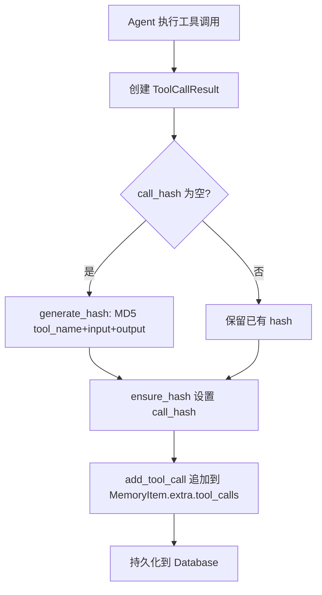
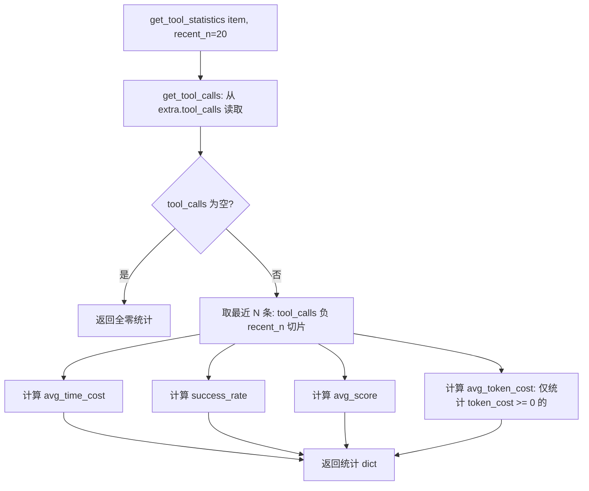
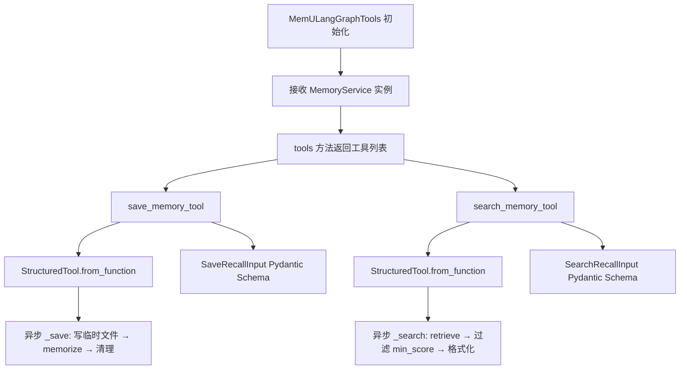

# PD-04.XX memU — Tool Memory 记忆化工具系统

> 文档编号：PD-04.XX
> 来源：memU `src/memu/utils/tool.py`, `src/memu/integrations/langgraph.py`, `src/memu/database/models.py`
> GitHub：https://github.com/NevaMind-AI/memU.git
> 问题域：PD-04 工具系统 Tool System Design
> 状态：可复用方案

---

## 第 1 章 问题与动机

### 1.1 核心问题

Agent 系统中的工具调用是"无记忆"的——每次调用都是独立事件，Agent 无法从历史工具调用中学习。具体痛点：

1. **工具选择盲目**：Agent 不知道哪个工具在什么场景下成功率高、耗时短
2. **重复犯错**：同一工具在相同输入下反复失败，Agent 无法避免
3. **缺乏经验沉淀**：工具调用的成功模式、失败教训无法跨会话复用
4. **集成成本高**：将记忆系统暴露为 LangChain/LangGraph 兼容工具需要大量胶水代码

memU 的核心创新是将"工具调用"本身作为一种记忆类型（`memory_type="tool"`），通过 `ToolCallResult` 模型追踪每次调用的 success/time_cost/token_cost/score，并通过 LangGraph 集成将 save_memory/search_memory 暴露为 StructuredTool。

### 1.2 memU 的解法概述

1. **六类记忆类型体系**：定义 `MemoryType = Literal["profile", "event", "knowledge", "behavior", "skill", "tool"]`，其中 `tool` 是专门的工具记忆类型（`src/memu/database/models.py:12`）
2. **ToolCallResult 结构化模型**：Pydantic 模型记录 tool_name/input/output/success/time_cost/token_cost/score/call_hash，支持 MD5 去重（`src/memu/database/models.py:43-66`）
3. **滑动窗口统计**：`get_tool_statistics()` 对最近 N 次调用计算 avg_time_cost/success_rate/avg_score/avg_token_cost（`src/memu/utils/tool.py:55-102`）
4. **LangGraph StructuredTool 适配器**：`MemULangGraphTools` 将 MemoryService 包装为 save_memory + search_memory 两个异步工具（`src/memu/integrations/langgraph.py:53-163`）
5. **Prompt 驱动的工具记忆提取**：专用 prompt 模板从 Agent 日志中自动提取工具使用模式和 when_to_use 提示（`src/memu/prompts/memory_type/tool.py:1-120`）

### 1.3 设计思想

| 设计原则 | 具体实现 | 理由 | 替代方案 |
|----------|----------|------|----------|
| 记忆即工具 | tool 作为 MemoryType 的一个值，复用整个记忆基础设施 | 避免为工具记忆单独建表/建索引，统一向量检索 | 独立 ToolHistory 表 + 专用查询接口 |
| 结构化追踪 | ToolCallResult Pydantic 模型，7 个度量字段 | 类型安全 + 序列化/反序列化零成本 | 自由 dict 存储，运行时无校验 |
| 去重哈希 | MD5(tool_name\|input\|output) 生成 call_hash | 防止相同调用重复记录膨胀存储 | 全量存储 + 定期清理 |
| 适配器模式 | MemULangGraphTools 桥接 MemoryService → StructuredTool | 解耦记忆核心与框架集成，支持多框架 | 直接在 MemoryService 上实现 LangChain 接口 |
| Prompt 即提取器 | XML 格式 prompt 模板驱动 LLM 提取工具记忆 | 无需硬编码解析逻辑，LLM 自适应不同日志格式 | 正则/AST 解析工具调用日志 |

---

## 第 2 章 源码实现分析

### 2.1 架构概览

memU 的工具系统不是传统意义上的"工具注册 + 调用"系统，而是一个**工具记忆系统**——它记录、分析、检索工具调用历史，让 Agent 从经验中学习。

```
┌─────────────────────────────────────────────────────────┐
│                    Agent / LangGraph                     │
│                                                         │
│  ┌──────────────┐  ┌───────────────┐                   │
│  │ save_memory  │  │ search_memory │  ← StructuredTool │
│  └──────┬───────┘  └───────┬───────┘                   │
│         │                  │                            │
├─────────┼──────────────────┼────────────────────────────┤
│         ▼                  ▼                            │
│  ┌─────────────────────────────────┐                   │
│  │    MemULangGraphTools 适配器     │  langgraph.py     │
│  └──────────────┬──────────────────┘                   │
│                 │                                       │
│                 ▼                                       │
│  ┌─────────────────────────────────┐                   │
│  │       MemoryService             │  service.py       │
│  │  memorize() / retrieve()        │                   │
│  └──────┬──────────────────┬───────┘                   │
│         │                  │                            │
│         ▼                  ▼                            │
│  ┌──────────────┐  ┌──────────────┐                   │
│  │ Workflow      │  │ Database     │                   │
│  │ Pipeline      │  │ (3 backends) │                   │
│  │ (7 steps)     │  │ inmemory/    │                   │
│  └──────────────┘  │ sqlite/      │                   │
│                    │ postgres     │                   │
│                    └──────────────┘                   │
│                                                         │
│  ┌─────────────────────────────────┐                   │
│  │  ToolCallResult + tool.py       │  工具统计层       │
│  │  get_tool_statistics()          │                   │
│  │  add_tool_call()                │                   │
│  └─────────────────────────────────┘                   │
└─────────────────────────────────────────────────────────┘
```

### 2.2 核心实现

#### 2.2.1 ToolCallResult 数据模型



对应源码 `src/memu/database/models.py:43-66`：

```python
class ToolCallResult(BaseModel):
    """Represents the result of a tool invocation for Tool Memory."""
    tool_name: str = Field(..., description="Name of the tool that was called")
    input: dict[str, Any] | str = Field(default="", description="Tool input parameters")
    output: str = Field(default="", description="Tool output result")
    success: bool = Field(default=True, description="Whether the tool invocation succeeded")
    time_cost: float = Field(default=0.0, description="Time consumed in seconds")
    token_cost: int = Field(default=-1, description="Token consumption (-1 if unknown)")
    score: float = Field(default=0.0, description="Quality score from 0.0 to 1.0")
    call_hash: str = Field(default="", description="Hash of input+output for deduplication")
    created_at: datetime = Field(default_factory=lambda: pendulum.now("UTC"))

    def generate_hash(self) -> str:
        input_str = json.dumps(self.input, sort_keys=True) if isinstance(self.input, dict) else str(self.input)
        combined = f"{self.tool_name}|{input_str}|{self.output}"
        return hashlib.md5(combined.encode("utf-8"), usedforsecurity=False).hexdigest()
```

关键设计点：
- `input` 支持 `dict | str` 双类型，兼容结构化参数和原始字符串
- `token_cost` 默认 -1 表示未知，区分"0 token"和"未追踪"
- `generate_hash()` 使用 `sort_keys=True` 确保 dict 参数顺序无关
- `usedforsecurity=False` 明确标记非安全用途，避免 FIPS 环境报错

#### 2.2.2 滑动窗口工具统计



对应源码 `src/memu/utils/tool.py:55-102`：

```python
def get_tool_statistics(item: MemoryItem, recent_n: int = 20) -> dict[str, Any]:
    tool_calls = get_tool_calls(item)
    if not tool_calls:
        return {"total_calls": 0, "recent_calls_analyzed": 0,
                "avg_time_cost": 0.0, "success_rate": 0.0,
                "avg_score": 0.0, "avg_token_cost": 0.0}

    recent_calls = tool_calls[-recent_n:]
    recent_count = len(recent_calls)

    total_time = sum(c.get("time_cost", 0.0) for c in recent_calls)
    avg_time_cost = total_time / recent_count if recent_count > 0 else 0.0

    successful = sum(1 for c in recent_calls if c.get("success", True))
    success_rate = successful / recent_count if recent_count > 0 else 0.0

    # 仅统计已知 token 消耗的调用
    valid_token_calls = [c for c in recent_calls if c.get("token_cost", -1) >= 0]
    avg_token_cost = (
        sum(c.get("token_cost", 0) for c in valid_token_calls) / len(valid_token_calls)
        if valid_token_calls else 0.0
    )
    return {
        "total_calls": len(tool_calls),
        "recent_calls_analyzed": recent_count,
        "avg_time_cost": round(avg_time_cost, 3),
        "success_rate": round(success_rate, 4),
        "avg_score": round(avg_score, 3),
        "avg_token_cost": round(avg_token_cost, 2),
    }
```

关键设计点：
- 滑动窗口（默认 20）避免历史数据稀释近期趋势
- `success` 默认 `True`——缺失字段视为成功，向后兼容旧数据
- `token_cost` 过滤 -1（未知），避免拉低平均值
- 返回 `total_calls` 和 `recent_calls_analyzed` 双计数，调用方可判断数据充分性

#### 2.2.3 LangGraph StructuredTool 适配器



对应源码 `src/memu/integrations/langgraph.py:53-163`：

```python
class MemULangGraphTools:
    def __init__(self, memory_service: MemoryService):
        self.memory_service = memory_service

    def tools(self) -> list[BaseTool]:
        return [self.save_memory_tool(), self.search_memory_tool()]

    def save_memory_tool(self) -> StructuredTool:
        async def _save(content: str, user_id: str, metadata: dict | None = None) -> str:
            filename = f"memu_input_{uuid.uuid4()}.txt"
            file_path = os.path.join(tempfile.gettempdir(), filename)
            try:
                with open(file_path, "w", encoding="utf-8") as f:
                    f.write(content)
                await self.memory_service.memorize(
                    resource_url=file_path, modality="conversation",
                    user={"user_id": user_id, **(metadata or {})},
                )
            finally:
                if os.path.exists(file_path):
                    with contextlib.suppress(OSError):
                        os.remove(file_path)
            return "Memory saved successfully."

        return StructuredTool.from_function(
            func=None, coroutine=_save,
            name="save_memory",
            description="Save a piece of information for a user.",
            args_schema=SaveRecallInput,
        )
```

关键设计点：
- `func=None` + `coroutine=_save`：纯异步工具，不提供同步回退
- 临时文件策略：MemoryService.memorize 接受 resource_url（文件路径），适配器通过写临时文件桥接纯文本输入
- `finally` 块确保临时文件清理，`contextlib.suppress(OSError)` 容忍并发删除
- Pydantic `args_schema` 自动生成 JSON Schema 供 LLM 理解参数

### 2.3 实现细节

#### tool_record 在数据库层的处理

`create_item` 和 `update_item` 方法都支持 `tool_record` 参数，将 `when_to_use`、`metadata`、`tool_calls` 三个字段平铺到 `extra` dict 中（`src/memu/database/inmemory/repositories/memory_item_repo.py:99-107`）：

```python
extra: dict[str, Any] = {}
if tool_record:
    if tool_record.get("when_to_use") is not None:
        extra["when_to_use"] = tool_record["when_to_use"]
    if tool_record.get("metadata") is not None:
        extra["metadata"] = tool_record["metadata"]
    if tool_record.get("tool_calls") is not None:
        extra["tool_calls"] = tool_record["tool_calls"]
```

这种设计让 tool 类型记忆与其他类型共享同一张表，通过 `extra` JSON 列存储差异化字段。

#### Prompt 驱动的工具记忆提取

`src/memu/prompts/memory_type/tool.py` 定义了专用的 Tool Memory Extractor prompt，指导 LLM 从 Agent 日志中提取：
- 成功的工具使用模式（含上下文）
- 失败的工具调用（含教训）
- 工具组合模式（哪些工具配合使用效果好）
- 性能洞察（快/慢工具的场景适配）

输出格式为 XML `<item><memory><content>...</content><when_to_use>...</when_to_use></memory></item>`，`when_to_use` 字段直接存入 `extra` 供检索时使用。

#### 记忆类型体系与 tool 的特殊处理

`MemoryType` 定义了 6 种类型（`models.py:12`），其中 `tool` 类型有两个特殊行为：
1. **跳过 reinforcement**：`create_item` 中 `if reinforce and memory_type != "tool"` 分支（`memory_item_repo.py:90`），tool 记忆不做去重强化，因为每次调用都是独立事件
2. **额外字段**：tool 记忆的 `extra` 包含 `when_to_use`（检索提示）、`metadata`（工具元信息）、`tool_calls`（调用历史列表）


---

## 第 3 章 迁移指南

### 3.1 迁移清单

**阶段 1：数据模型（1 个文件）**
- [ ] 定义 `ToolCallResult` Pydantic 模型（7 个度量字段 + hash 生成）
- [ ] 在现有 MemoryItem 或等价模型的 `extra` JSON 列中预留 `tool_calls`、`when_to_use`、`metadata` 字段
- [ ] 实现 `compute_content_hash()` 用于记忆去重

**阶段 2：工具统计层（1 个文件）**
- [ ] 实现 `get_tool_calls()`、`set_tool_calls()`、`add_tool_call()` 三个工具函数
- [ ] 实现 `get_tool_statistics()` 滑动窗口统计
- [ ] 确保 `add_tool_call()` 在追加前调用 `ensure_hash()` 去重

**阶段 3：LangGraph 集成（1 个文件）**
- [ ] 创建 `MemULangGraphTools` 适配器类
- [ ] 定义 `SaveRecallInput` / `SearchRecallInput` Pydantic schema
- [ ] 实现 `save_memory_tool()` 和 `search_memory_tool()` 异步工具
- [ ] 注册到 LangGraph Agent 的 tools 列表

**阶段 4：Prompt 模板（可选）**
- [ ] 编写 Tool Memory Extractor prompt 模板
- [ ] 集成到记忆提取 workflow 中

### 3.2 适配代码模板

#### 最小可用的 ToolCallResult + 统计

```python
"""tool_memory.py — 可直接复用的工具记忆模块"""
from __future__ import annotations

import hashlib
import json
from datetime import datetime, timezone
from typing import Any

from pydantic import BaseModel, Field


class ToolCallResult(BaseModel):
    """单次工具调用的结构化记录。"""
    tool_name: str
    input: dict[str, Any] | str = ""
    output: str = ""
    success: bool = True
    time_cost: float = 0.0
    token_cost: int = -1  # -1 = unknown
    score: float = 0.0
    call_hash: str = ""
    created_at: datetime = Field(default_factory=lambda: datetime.now(timezone.utc))

    def ensure_hash(self) -> None:
        if not self.call_hash:
            input_str = json.dumps(self.input, sort_keys=True) if isinstance(self.input, dict) else str(self.input)
            combined = f"{self.tool_name}|{input_str}|{self.output}"
            self.call_hash = hashlib.md5(combined.encode(), usedforsecurity=False).hexdigest()


def get_tool_statistics(tool_calls: list[dict[str, Any]], recent_n: int = 20) -> dict[str, Any]:
    """对最近 N 次工具调用计算统计指标。"""
    if not tool_calls:
        return {"total_calls": 0, "success_rate": 0.0, "avg_time_cost": 0.0, "avg_token_cost": 0.0}

    recent = tool_calls[-recent_n:]
    n = len(recent)
    success_rate = sum(1 for c in recent if c.get("success", True)) / n
    avg_time = sum(c.get("time_cost", 0.0) for c in recent) / n
    valid_tokens = [c for c in recent if c.get("token_cost", -1) >= 0]
    avg_tokens = sum(c["token_cost"] for c in valid_tokens) / len(valid_tokens) if valid_tokens else 0.0

    return {
        "total_calls": len(tool_calls),
        "recent_analyzed": n,
        "success_rate": round(success_rate, 4),
        "avg_time_cost": round(avg_time, 3),
        "avg_token_cost": round(avg_tokens, 2),
    }
```

#### LangGraph 工具适配器模板

```python
"""langgraph_tools.py — 将任意 MemoryService 暴露为 LangGraph 工具"""
from langchain_core.tools import StructuredTool
from pydantic import BaseModel, Field


class SaveInput(BaseModel):
    content: str = Field(description="要保存的文本内容")
    user_id: str = Field(description="用户唯一标识")


class SearchInput(BaseModel):
    query: str = Field(description="搜索查询")
    user_id: str = Field(description="用户唯一标识")
    limit: int = Field(default=5, description="返回结果数量")
    min_score: float = Field(default=0.0, description="最低相关度阈值")


def create_memory_tools(memory_service) -> list[StructuredTool]:
    """工厂函数：从 memory_service 创建 LangGraph 兼容工具。"""

    async def _save(content: str, user_id: str) -> str:
        await memory_service.save(content=content, user_id=user_id)
        return "Memory saved."

    async def _search(query: str, user_id: str, limit: int = 5, min_score: float = 0.0) -> str:
        results = await memory_service.search(query=query, user_id=user_id, limit=limit)
        filtered = [r for r in results if r.get("score", 1.0) >= min_score]
        if not filtered:
            return "No relevant memories found."
        return "\n".join(f"{i+1}. [{r['score']:.2f}] {r['summary']}" for i, r in enumerate(filtered))

    return [
        StructuredTool.from_function(func=None, coroutine=_save,
            name="save_memory", description="Save information for a user.",
            args_schema=SaveInput),
        StructuredTool.from_function(func=None, coroutine=_search,
            name="search_memory", description="Search user memories by query.",
            args_schema=SearchInput),
    ]
```

### 3.3 适用场景

| 场景 | 适用度 | 说明 |
|------|--------|------|
| 长期运行的对话 Agent | ⭐⭐⭐ | 核心场景：Agent 需要记住用户偏好和历史工具使用模式 |
| 多工具选择优化 | ⭐⭐⭐ | 通过 success_rate/time_cost 统计帮助 Agent 选择最优工具 |
| Agent 经验复用 | ⭐⭐⭐ | when_to_use 提示让新会话直接复用历史经验 |
| 工具调用审计 | ⭐⭐ | ToolCallResult 提供完整调用记录，但非专业审计系统 |
| 短期一次性任务 | ⭐ | 记忆化的价值在长期积累，短期任务收益有限 |
| 实时工具编排 | ⭐ | memU 是记忆层不是编排层，不替代 LangGraph 的 DAG 编排 |

---

## 第 4 章 测试用例

```python
"""test_tool_memory.py — 基于 memU 真实接口的测试用例"""
import pytest
from datetime import datetime, timezone
from unittest.mock import AsyncMock


# === ToolCallResult 测试 ===

class TestToolCallResult:
    def test_hash_generation_deterministic(self):
        """相同输入应生成相同 hash。"""
        from tool_memory import ToolCallResult
        r1 = ToolCallResult(tool_name="search", input={"q": "hello"}, output="result")
        r2 = ToolCallResult(tool_name="search", input={"q": "hello"}, output="result")
        r1.ensure_hash()
        r2.ensure_hash()
        assert r1.call_hash == r2.call_hash

    def test_hash_dict_key_order_invariant(self):
        """dict 参数顺序不影响 hash（sort_keys=True）。"""
        from tool_memory import ToolCallResult
        r1 = ToolCallResult(tool_name="api", input={"a": 1, "b": 2}, output="ok")
        r2 = ToolCallResult(tool_name="api", input={"b": 2, "a": 1}, output="ok")
        r1.ensure_hash()
        r2.ensure_hash()
        assert r1.call_hash == r2.call_hash

    def test_hash_different_for_different_output(self):
        """不同输出应生成不同 hash。"""
        from tool_memory import ToolCallResult
        r1 = ToolCallResult(tool_name="search", input="q", output="result_a")
        r2 = ToolCallResult(tool_name="search", input="q", output="result_b")
        r1.ensure_hash()
        r2.ensure_hash()
        assert r1.call_hash != r2.call_hash

    def test_ensure_hash_idempotent(self):
        """多次调用 ensure_hash 不改变已有 hash。"""
        from tool_memory import ToolCallResult
        r = ToolCallResult(tool_name="t", input="i", output="o")
        r.ensure_hash()
        first_hash = r.call_hash
        r.ensure_hash()
        assert r.call_hash == first_hash

    def test_token_cost_default_unknown(self):
        """默认 token_cost 为 -1（未知）。"""
        from tool_memory import ToolCallResult
        r = ToolCallResult(tool_name="t")
        assert r.token_cost == -1


# === 统计函数测试 ===

class TestToolStatistics:
    def test_empty_calls(self):
        from tool_memory import get_tool_statistics
        stats = get_tool_statistics([])
        assert stats["total_calls"] == 0
        assert stats["success_rate"] == 0.0

    def test_sliding_window(self):
        """只统计最近 N 条。"""
        from tool_memory import get_tool_statistics
        calls = [{"success": False, "time_cost": 10.0}] * 10  # 旧的失败调用
        calls += [{"success": True, "time_cost": 1.0}] * 5    # 新的成功调用
        stats = get_tool_statistics(calls, recent_n=5)
        assert stats["success_rate"] == 1.0
        assert stats["recent_analyzed"] == 5

    def test_unknown_token_cost_excluded(self):
        """token_cost=-1 的调用不参与平均计算。"""
        from tool_memory import get_tool_statistics
        calls = [
            {"token_cost": 100},
            {"token_cost": -1},  # unknown, should be excluded
            {"token_cost": 200},
        ]
        stats = get_tool_statistics(calls)
        assert stats["avg_token_cost"] == 150.0

    def test_success_defaults_to_true(self):
        """缺失 success 字段视为成功。"""
        from tool_memory import get_tool_statistics
        calls = [{"time_cost": 1.0}, {"time_cost": 2.0}]  # no success field
        stats = get_tool_statistics(calls)
        assert stats["success_rate"] == 1.0


# === LangGraph 适配器测试 ===

class TestLangGraphAdapter:
    @pytest.mark.asyncio
    async def test_tools_count(self):
        """适配器应返回 2 个工具。"""
        mock_service = AsyncMock()
        mock_service.memorize.return_value = {"status": "ok"}
        mock_service.retrieve.return_value = {"items": []}

        # 模拟 MemULangGraphTools 的行为
        from langgraph_tools import create_memory_tools
        tools = create_memory_tools(mock_service)
        assert len(tools) == 2
        names = {t.name for t in tools}
        assert names == {"save_memory", "search_memory"}

    @pytest.mark.asyncio
    async def test_search_min_score_filter(self):
        """min_score 过滤应排除低分结果。"""
        mock_service = AsyncMock()
        mock_service.search.return_value = [
            {"summary": "high", "score": 0.9},
            {"summary": "low", "score": 0.2},
        ]
        from langgraph_tools import create_memory_tools
        tools = create_memory_tools(mock_service)
        search_tool = [t for t in tools if t.name == "search_memory"][0]
        result = await search_tool.ainvoke({"query": "test", "user_id": "u1", "min_score": 0.5})
        assert "high" in result
        assert "low" not in result
```


---

## 第 5 章 跨域关联

| 关联域 | 关系类型 | 说明 |
|--------|----------|------|
| PD-01 上下文管理 | 协同 | memU 的记忆检索结果注入 Agent 上下文，tool 记忆的 when_to_use 提示减少上下文中的工具描述冗余 |
| PD-06 记忆持久化 | 依赖 | Tool Memory 是 memU 记忆系统的一个子类型，依赖 MemoryItem + extra JSON 列的持久化基础设施（inmemory/sqlite/postgres 三后端） |
| PD-08 搜索与检索 | 协同 | search_memory 工具底层使用向量检索（cosine_topk），tool 记忆的 embedding 来自 summary 文本 |
| PD-10 中间件管道 | 协同 | MemoryService 的 memorize workflow 是 7 步管道（ingest→preprocess→extract→dedupe→categorize→persist→response），tool 记忆提取是 extract 步骤的一个 memory_type 分支 |
| PD-11 可观测性 | 协同 | ToolCallResult 的 time_cost/token_cost/score 字段天然支持成本追踪，LLMClientWrapper 的 interceptor 机制可在工具调用前后注入追踪逻辑 |
| PD-02 多 Agent 编排 | 互补 | memU 提供记忆层工具（save/search），LangGraph 提供编排层；MemULangGraphTools 是两者的桥接点 |

---

## 第 6 章 来源文件索引

| 文件 | 行范围 | 关键实现 |
|------|--------|----------|
| `src/memu/database/models.py` | L12 | MemoryType 定义，含 "tool" 类型 |
| `src/memu/database/models.py` | L43-L66 | ToolCallResult Pydantic 模型 + hash 生成 |
| `src/memu/database/models.py` | L76-L94 | MemoryItem 模型，extra 字段含 tool_calls/when_to_use |
| `src/memu/utils/tool.py` | L11-L52 | get_tool_calls / set_tool_calls / add_tool_call 工具函数 |
| `src/memu/utils/tool.py` | L55-L102 | get_tool_statistics 滑动窗口统计 |
| `src/memu/integrations/langgraph.py` | L33-L50 | SaveRecallInput / SearchRecallInput Pydantic schema |
| `src/memu/integrations/langgraph.py` | L53-L163 | MemULangGraphTools 适配器（save_memory + search_memory） |
| `src/memu/prompts/memory_type/tool.py` | L1-L120 | Tool Memory Extractor prompt 模板（XML 输出格式） |
| `src/memu/prompts/memory_type/__init__.py` | L1-L46 | 6 种记忆类型 prompt 注册表 |
| `src/memu/database/inmemory/repositories/memory_item_repo.py` | L79-L120 | create_item 中 tool_record 处理逻辑 |
| `src/memu/database/inmemory/repositories/memory_item_repo.py` | L224-L259 | update_item 中 tool_record 合并逻辑 |
| `src/memu/app/service.py` | L49-L96 | MemoryService 核心类，memorize/retrieve 入口 |
| `src/memu/app/memorize.py` | L97-L166 | memorize workflow 7 步管道定义 |
| `src/memu/workflow/pipeline.py` | L21-L170 | PipelineManager 管道注册/版本化/校验 |
| `src/memu/workflow/step.py` | L17-L48 | WorkflowStep 数据类 + requires/produces 依赖声明 |
| `src/memu/database/factory.py` | L15-L43 | 数据库工厂：inmemory/postgres/sqlite 延迟导入 |
| `tests/integrations/test_langgraph.py` | L1-L81 | LangGraph 集成测试（适配器初始化 + 工具执行） |

---

## 第 7 章 横向对比维度

```json comparison_data
{
  "project": "memU",
  "dimensions": {
    "工具注册方式": "StructuredTool.from_function + Pydantic args_schema 自动生成 JSON Schema",
    "MCP 协议支持": "README 提及 MCP server 支持，通过 MemoryService 桥接",
    "生命周期追踪": "ToolCallResult 记录 success/time_cost/token_cost/score + 滑动窗口统计",
    "Schema 生成方式": "Pydantic BaseModel 自动导出 JSON Schema（SaveRecallInput/SearchRecallInput）",
    "工具轨迹经验化": "tool 类型记忆 + when_to_use 提示 + LLM prompt 自动提取工具使用模式",
    "记忆类型分类": "6 类 MemoryType（profile/event/knowledge/behavior/skill/tool）统一存储",
    "依赖注入": "MemULangGraphTools 构造函数注入 MemoryService 实例",
    "工具内业务校验": "add_tool_call 校验 memory_type=='tool'，ensure_hash 保证去重",
    "参数校验": "Pydantic Field + description 自动校验，min_relevance_score 范围过滤",
    "工具集动态组合": "tools() 方法返回固定 2 工具集（save_memory + search_memory）"
  }
}
```

### 域元数据补充

```json domain_metadata
{
  "solution_summary": "memU 将工具调用作为第六种记忆类型（tool），通过 ToolCallResult 模型追踪 7 维度量 + MD5 去重，滑动窗口统计 success_rate/time_cost，LangGraph StructuredTool 适配器暴露 save/search 两个异步工具",
  "description": "工具系统不仅是注册和调用，还包括工具使用经验的记忆化和跨会话复用",
  "sub_problems": [
    "工具调用记忆化：如何将工具调用历史结构化存储并支持向量检索",
    "工具使用模式提取：如何用 LLM 从 Agent 日志中自动提取可复用的工具使用经验",
    "工具统计滑动窗口：如何对最近 N 次调用计算成功率/耗时/成本等统计指标",
    "记忆类型与工具类型的统一建模：tool 记忆如何复用通用记忆基础设施而非独立建表"
  ],
  "best_practices": [
    "工具调用去重用 hash：MD5(tool_name|input|output) 防止相同调用重复记录",
    "未知值用哨兵值区分：token_cost=-1 区分'未追踪'和'零消耗'",
    "滑动窗口避免历史稀释：只统计最近 N 次调用，反映当前工具状态",
    "适配器模式解耦框架集成：MemULangGraphTools 桥接记忆核心与 LangChain 生态"
  ]
}
```

