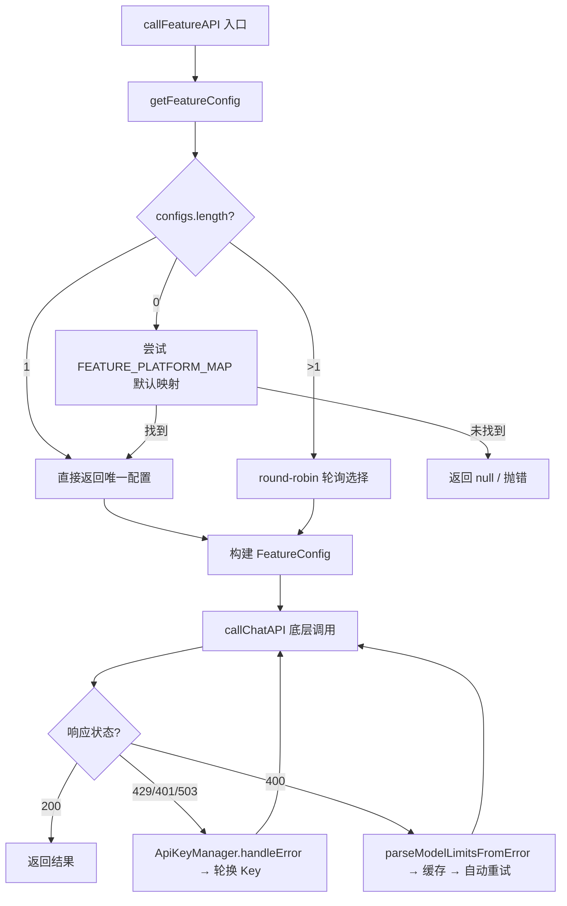
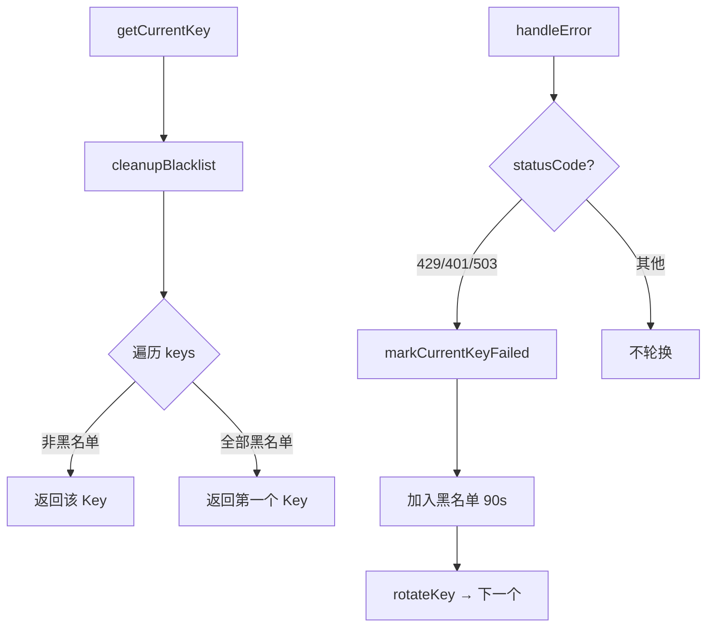
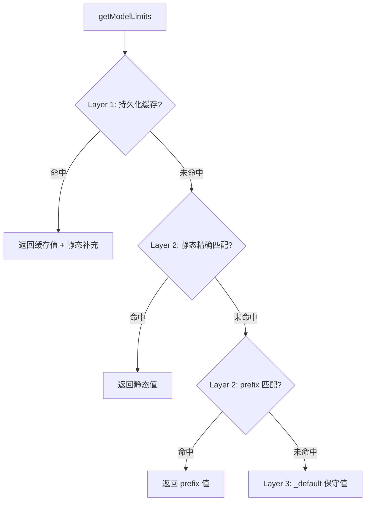

# PD-04.XX moyin-creator — 功能级模型路由与多 Key 轮询调度

> 文档编号：PD-04.XX
> 来源：moyin-creator `src/lib/ai/feature-router.ts`, `src/stores/api-config-store.ts`, `src/lib/api-key-manager.ts`, `src/lib/ai/model-registry.ts`, `src/lib/ai/batch-processor.ts`
> GitHub：https://github.com/MemeCalculate/moyin-creator.git
> 问题域：PD-04 工具系统 Tool System Design
> 状态：可复用方案

---

## 第 1 章 问题与动机（≥ 30 行）

### 1.1 核心问题

AI 应用通常需要调用多种 AI 能力（文本分析、图片生成、视频生成、图片理解等），但不同能力对模型的要求不同：剧本分析需要大上下文文本模型，角色生成需要图片模型，视频生成需要专用视频模型。传统做法是全局配置一个 API Key + 一个模型，所有功能共用——这导致无法为不同功能选择最优模型，也无法利用多 Key 分散限流压力。

moyin-creator 面临的具体挑战：
1. **8 个功能域**需要绑定到不同供应商和模型（剧本分析、角色生成、场景生成、视频生成、图片理解、通用对话、自由板块图片、自由板块视频）
2. **多 Key 轮询**：单个供应商可能配置多个 API Key，需要自动轮询和故障黑名单
3. **多模型轮询**：同一功能可绑定多个模型，需要 round-robin 调度
4. **模型能力自动分类**：供应商动态同步 552+ 模型，需要自动识别每个模型的能力（文本/图片/视频/推理/embedding）
5. **API 端点路由**：不同模型使用不同的 API 端点格式（chat completions / images generations / video generations / kling 专用端点）
6. **Error-driven Discovery**：从 API 400 错误中自动学习模型的 token 限制，持久化缓存避免重复踩坑

### 1.2 moyin-creator 的解法概述

1. **Feature-Router 模式**：定义 8 个 `AIFeature` 类型，每个功能独立绑定供应商+模型组合，通过 `getFeatureConfig()` 统一获取配置（`src/lib/ai/feature-router.ts:133`）
2. **ApiKeyManager 多 Key 轮询**：每个供应商维护独立的 `ApiKeyManager` 实例，支持随机起始索引、90 秒黑名单、自动轮换（`src/lib/api-key-manager.ts:259-387`）
3. **Model Registry 三层查找**：持久化缓存 → 静态注册表（prefix 匹配）→ 保守默认值，自动 clamp max_tokens（`src/lib/ai/model-registry.ts:125-142`）
4. **模型能力自动分类**：`classifyModelByName()` 通过正则模式匹配自动推断模型能力类型（`src/lib/api-key-manager.ts:75-112`）
5. **Zustand 持久化 Store**：9 个版本的 migrate 函数处理 schema 演进，支持 v1 单 Key → v9 多供应商多 Key 多绑定的平滑迁移（`src/stores/api-config-store.ts:864-1149`）

### 1.3 设计思想

| 设计原则 | 具体实现 | 理由 | 替代方案 |
|----------|----------|------|----------|
| 功能级路由 | 8 个 AIFeature 各自绑定 provider:model | 不同功能对模型要求不同，全局配置无法满足 | 全局单模型配置 |
| 多 Key 负载均衡 | 随机起始 + round-robin + 90s 黑名单 | 分散限流压力，单 Key 故障不影响整体 | 固定单 Key |
| Error-driven Discovery | 从 400 错误解析 maxOutput/contextWindow 并缓存 | 552+ 模型不可能全部手动注册限制 | 全部手动维护静态表 |
| 渐进式迁移 | 9 版本 migrate 函数 + legacy 兼容层 | 用户数据不丢失，平滑升级 | 破坏性迁移 |
| 按模型名查表 | prefix 匹配按长度降序 | 代理平台的模型名与直连一致 | 按 URL 查表 |

---

## 第 2 章 源码实现分析（≥ 60 行，核心章节）

### 2.1 架构概览

moyin-creator 的 AI 调度系统由 4 个核心模块组成，形成分层架构：

```
┌─────────────────────────────────────────────────────────────┐
│                    业务层 (Hooks / Services)                  │
│  use-video-generation · image-generator · script-parser      │
│  character-calibrator · scene-calibrator · batch-processor   │
├─────────────────────────────────────────────────────────────┤
│                  Feature Router (调度中心)                    │
│  getFeatureConfig() → round-robin 多模型 → callFeatureAPI() │
├──────────────────┬──────────────────────────────────────────┤
│  ApiKeyManager   │         Model Registry                    │
│  多Key轮询+黑名单 │  三层查找: 缓存→静态→default              │
├──────────────────┴──────────────────────────────────────────┤
│              API Config Store (Zustand + persist)             │
│  providers[] · featureBindings · modelEndpointTypes          │
│  modelTypes · modelTags · discoveredModelLimits              │
│  9 版本 migrate · localStorage 持久化                        │
└─────────────────────────────────────────────────────────────┘
```

### 2.2 核心实现

#### 2.2.1 Feature Router — 功能级模型路由与轮询调度



对应源码 `src/lib/ai/feature-router.ts:133-182`：
```typescript
export function getFeatureConfig(feature: AIFeature): FeatureConfig | null {
  const configs = getAllFeatureConfigs(feature);
  
  if (configs.length === 0) {
    // Fallback: 尝试使用默认平台映射
    const store = useAPIConfigStore.getState();
    const defaultPlatform = FEATURE_PLATFORM_MAP[feature];
    if (defaultPlatform) {
      const provider = store.providers.find(p => p.platform === defaultPlatform);
      if (provider) {
        const keys = parseApiKeys(provider.apiKey);
        if (keys.length > 0) {
          const keyManager = getProviderKeyManager(provider.id, provider.apiKey);
          const featureInfo = AI_FEATURES.find(f => f.key === feature);
          const model = provider.model?.[0] || '';
          return {
            feature, featureName: featureInfo?.name || feature,
            provider, apiKey: keyManager.getCurrentKey() || keys[0],
            allApiKeys: keys, keyManager,
            platform: provider.platform, baseUrl: provider.baseUrl,
            models: provider.model || [], model,
          };
        }
      }
    }
    return null;
  }
  
  if (configs.length === 1) return configs[0];
  
  // 多模型轮询
  const currentIndex = featureRoundRobinIndex.get(feature) || 0;
  const config = configs[currentIndex % configs.length];
  featureRoundRobinIndex.set(feature, currentIndex + 1);
  return config;
}
```

#### 2.2.2 ApiKeyManager — 多 Key 轮询与黑名单



对应源码 `src/lib/api-key-manager.ts:259-387`：
```typescript
export class ApiKeyManager {
  private keys: string[];
  private currentIndex: number;
  private blacklist: Map<string, BlacklistedKey> = new Map();

  constructor(apiKeyString: string) {
    this.keys = parseApiKeys(apiKeyString);
    // 随机起始索引实现负载均衡
    this.currentIndex = this.keys.length > 0
      ? Math.floor(Math.random() * this.keys.length) : 0;
  }

  getCurrentKey(): string | null {
    this.cleanupBlacklist();
    if (this.keys.length === 0) return null;
    for (let i = 0; i < this.keys.length; i++) {
      const index = (this.currentIndex + i) % this.keys.length;
      const key = this.keys[index];
      if (!this.blacklist.has(key)) {
        this.currentIndex = index;
        return key;
      }
    }
    return this.keys.length > 0 ? this.keys[0] : null;
  }

  handleError(statusCode: number): boolean {
    if (statusCode === 429 || statusCode === 401 || statusCode === 503) {
      this.markCurrentKeyFailed();
      return true;
    }
    return false;
  }
}
```

### 2.3 实现细节

#### Error-driven Discovery — 从错误中学习模型限制

`model-registry.ts` 实现了三层查找机制，最关键的创新是 Layer 1 的持久化缓存——从 API 400 错误中自动解析模型的真实 token 限制：



对应源码 `src/lib/ai/model-registry.ts:125-162`：
```typescript
export function getModelLimits(modelName: string): ModelLimits {
  const m = modelName.toLowerCase();
  // Layer 1: 持久化缓存（从 API 错误中学到的真实值）
  if (_getDiscoveredLimits) {
    const discovered = _getDiscoveredLimits(m);
    if (discovered) {
      const staticFallback = lookupStatic(m);
      return {
        contextWindow: discovered.contextWindow ?? staticFallback.contextWindow,
        maxOutput: discovered.maxOutput ?? staticFallback.maxOutput,
      };
    }
  }
  return lookupStatic(m);
}
```

错误解析覆盖 DeepSeek / OpenAI / 智谱等主流 API 的错误格式（`src/lib/ai/model-registry.ts:178-229`），在 `callChatAPI` 中遇到 400 错误时自动触发：

对应源码 `src/lib/script/script-parser.ts:337-367`：
```typescript
if (response.status === 400) {
  const discovered = parseModelLimitsFromError(errorText);
  if (discovered) {
    cacheDiscoveredLimits(model, discovered);
    if (discovered.maxOutput && effectiveMaxTokens > discovered.maxOutput) {
      const correctedMaxTokens = Math.min(requestedMaxTokens, discovered.maxOutput);
      const retryBody = { ...body, max_tokens: correctedMaxTokens };
      const retryResp = await fetch(url, { method: 'POST', headers, body: JSON.stringify(retryBody) });
      if (retryResp.ok) {
        const retryData = await retryResp.json();
        const retryContent = retryData.choices?.[0]?.message?.content;
        if (retryContent) { keyManager.rotateKey(); return retryContent; }
      }
    }
  }
}
```

#### 模型能力自动分类

`classifyModelByName()` 通过正则模式匹配将 552+ 动态同步的模型自动归类为 8 种能力类型（`src/lib/api-key-manager.ts:75-112`）：

- 视频生成：`veo|sora|wan|kling|runway|luma|seedance|cogvideo|...`
- 图片生成：`dall-e|flux|midjourney|gpt-image|ideogram|sd3|...`
- 视觉/识图：`/vision/`
- 推理模型：`r1|thinking|reasoner` 或 `^o[1-9]`
- Embedding：`/embed/`
- 默认：`['text']`

#### API 端点路由

`resolveImageApiFormat()` 和 `resolveVideoApiFormat()` 根据模型的 `supported_endpoint_types` 元数据（从 MemeFast `/api/pricing_new` 同步）决定使用哪种 API 端点格式（`src/lib/api-key-manager.ts:158-208`）：

| 端点格式 | 路径 | 适用模型 |
|----------|------|----------|
| `openai_chat` | `/v1/chat/completions` | Gemini 多模态图片、文本模型 |
| `openai_images` | `/v1/images/generations` | DALL-E、Flux、SD 等 |
| `openai_video` | `/v1/videos/generations` | Sora、Veo、Kling 等 |
| `kling_image` | `/kling/v1/images/*` | Kling 专用图片端点 |


---

## 第 3 章 迁移指南（≥ 40 行）

### 3.1 迁移清单

**阶段 1：基础设施（Feature Router + Key Manager）**
- [ ] 定义项目的 `AIFeature` 类型枚举（按业务功能划分）
- [ ] 实现 `ApiKeyManager` 类（多 Key 解析、round-robin、黑名单）
- [ ] 实现 `FeatureRouter`（功能→供应商+模型的映射 + 轮询调度）
- [ ] 创建持久化 Store（Zustand/Pinia/Redux 均可）存储 providers 和 featureBindings

**阶段 2：模型注册表**
- [ ] 建立静态 `ModelLimits` 注册表（覆盖常用模型的 contextWindow 和 maxOutput）
- [ ] 实现 prefix 匹配（按 key 长度降序排序）
- [ ] 实现 Error-driven Discovery（从 400 错误解析限制 + 持久化缓存）
- [ ] 在 callAPI 层集成 Token Budget Calculator（输入超 90% 直接拒绝）

**阶段 3：高级特性**
- [ ] 实现模型能力自动分类（`classifyModelByName`）
- [ ] 实现 API 端点路由（根据模型类型选择 chat/images/video 端点）
- [ ] 实现自适应批处理（双重约束分批 + 并发执行 + 容错隔离）
- [ ] 实现 Store 版本迁移（处理 schema 演进）

### 3.2 适配代码模板

以下是一个可直接复用的 Feature Router 最小实现（TypeScript）：

```typescript
// feature-router.ts — 最小可运行版本

type AIFeature = 'chat' | 'image_gen' | 'video_gen' | 'analysis';

interface Provider {
  id: string;
  platform: string;
  baseUrl: string;
  apiKeys: string[];  // 支持多 Key
  models: string[];
}

interface FeatureBinding {
  providerId: string;
  model: string;
}

// 功能绑定表：每个功能可绑定多个 provider:model
const featureBindings = new Map<AIFeature, FeatureBinding[]>();

// 轮询索引
const roundRobinIndex = new Map<AIFeature, number>();

class ApiKeyManager {
  private keys: string[];
  private index: number;
  private blacklist = new Map<string, number>(); // key → blacklistedAt
  private readonly BLACKLIST_TTL = 90_000;

  constructor(keys: string[]) {
    this.keys = keys;
    this.index = Math.floor(Math.random() * keys.length);
  }

  getCurrent(): string | null {
    this.cleanup();
    for (let i = 0; i < this.keys.length; i++) {
      const idx = (this.index + i) % this.keys.length;
      if (!this.blacklist.has(this.keys[idx])) {
        this.index = idx;
        return this.keys[idx];
      }
    }
    return this.keys[0] ?? null;
  }

  markFailed(): void {
    const key = this.keys[this.index];
    if (key) this.blacklist.set(key, Date.now());
    this.index = (this.index + 1) % this.keys.length;
  }

  handleError(status: number): boolean {
    if ([429, 401, 503].includes(status)) {
      this.markFailed();
      return true;
    }
    return false;
  }

  private cleanup(): void {
    const now = Date.now();
    for (const [k, t] of this.blacklist) {
      if (now - t >= this.BLACKLIST_TTL) this.blacklist.delete(k);
    }
  }
}

// 全局 KeyManager 池
const keyManagers = new Map<string, ApiKeyManager>();

function getKeyManager(provider: Provider): ApiKeyManager {
  let mgr = keyManagers.get(provider.id);
  if (!mgr) {
    mgr = new ApiKeyManager(provider.apiKeys);
    keyManagers.set(provider.id, mgr);
  }
  return mgr;
}

// 核心路由函数
function getFeatureConfig(feature: AIFeature, providers: Provider[]) {
  const bindings = featureBindings.get(feature) ?? [];
  if (bindings.length === 0) return null;

  const idx = (roundRobinIndex.get(feature) ?? 0) % bindings.length;
  roundRobinIndex.set(feature, idx + 1);

  const binding = bindings[idx];
  const provider = providers.find(p => p.id === binding.providerId);
  if (!provider) return null;

  const keyMgr = getKeyManager(provider);
  return {
    provider,
    model: binding.model,
    apiKey: keyMgr.getCurrent(),
    keyManager: keyMgr,
    baseUrl: provider.baseUrl,
  };
}
```

### 3.3 适用场景

| 场景 | 适用度 | 说明 |
|------|--------|------|
| 多模型 AI 应用（文本+图片+视频） | ⭐⭐⭐ | 核心场景，不同功能绑定不同模型 |
| 多 Key 负载均衡 | ⭐⭐⭐ | 高并发场景分散限流压力 |
| 中转平台集成（MemeFast 等） | ⭐⭐⭐ | 动态同步 500+ 模型 + 自动分类 |
| 单模型简单应用 | ⭐ | 过度设计，直接硬编码即可 |
| 需要精确 token 计数 | ⭐⭐ | 使用保守估算（字符/1.5），不引入 tiktoken |

---

## 第 4 章 测试用例（≥ 20 行）

```typescript
import { describe, it, expect, beforeEach } from 'vitest';

// ==================== ApiKeyManager Tests ====================

describe('ApiKeyManager', () => {
  let manager: ApiKeyManager;

  beforeEach(() => {
    manager = new ApiKeyManager('key1,key2,key3');
  });

  it('should parse comma-separated keys', () => {
    expect(manager.getTotalKeyCount()).toBe(3);
  });

  it('should return a non-blacklisted key', () => {
    const key = manager.getCurrentKey();
    expect(key).toBeTruthy();
    expect(['key1', 'key2', 'key3']).toContain(key);
  });

  it('should rotate on 429 error', () => {
    const firstKey = manager.getCurrentKey();
    manager.handleError(429);
    const secondKey = manager.getCurrentKey();
    // 黑名单后应该换到不同的 key
    expect(secondKey).not.toBe(firstKey);
  });

  it('should not rotate on 400 error', () => {
    const firstKey = manager.getCurrentKey();
    const rotated = manager.handleError(400);
    expect(rotated).toBe(false);
    expect(manager.getCurrentKey()).toBe(firstKey);
  });

  it('should fallback to first key when all blacklisted', () => {
    manager.handleError(429); // blacklist current
    manager.handleError(429); // blacklist next
    manager.handleError(429); // blacklist last
    const key = manager.getCurrentKey();
    expect(key).toBeTruthy(); // 全部黑名单时返回第一个
  });

  it('should recover after blacklist TTL expires', async () => {
    // 模拟 90s 后黑名单过期
    const key = manager.getCurrentKey();
    manager.markCurrentKeyFailed();
    // 手动修改 blacklistedAt 为 91s 前
    // (实际测试中需要 mock Date.now)
    expect(manager.getAvailableKeyCount()).toBeLessThan(3);
  });
});

// ==================== classifyModelByName Tests ====================

describe('classifyModelByName', () => {
  it('should classify video models', () => {
    expect(classifyModelByName('sora-2-all')).toContain('video_generation');
    expect(classifyModelByName('veo3.1')).toContain('video_generation');
    expect(classifyModelByName('grok-video-3-10s')).toContain('video_generation');
  });

  it('should classify image models', () => {
    expect(classifyModelByName('gpt-image-1.5')).toContain('image_generation');
    expect(classifyModelByName('flux-pro')).toContain('image_generation');
    expect(classifyModelByName('gemini-3-pro-image-preview')).toContain('image_generation');
  });

  it('should classify reasoning models', () => {
    const caps = classifyModelByName('deepseek-r1');
    expect(caps).toContain('text');
    expect(caps).toContain('reasoning');
  });

  it('should default to text', () => {
    expect(classifyModelByName('unknown-model-xyz')).toEqual(['text']);
  });
});

// ==================== Model Registry Tests ====================

describe('getModelLimits', () => {
  it('should return exact match for known models', () => {
    const limits = getModelLimits('deepseek-v3.2');
    expect(limits.contextWindow).toBe(128000);
    expect(limits.maxOutput).toBe(8192);
  });

  it('should use prefix matching', () => {
    const limits = getModelLimits('gemini-99-future');
    expect(limits.contextWindow).toBe(1048576); // gemini- prefix
  });

  it('should return conservative defaults for unknown models', () => {
    const limits = getModelLimits('totally-unknown-model');
    expect(limits.contextWindow).toBe(32000);
    expect(limits.maxOutput).toBe(4096);
  });
});

// ==================== parseModelLimitsFromError Tests ====================

describe('parseModelLimitsFromError', () => {
  it('should parse DeepSeek error format', () => {
    const result = parseModelLimitsFromError(
      'Invalid max_tokens value, the valid range of max_tokens is [1, 8192]'
    );
    expect(result?.maxOutput).toBe(8192);
  });

  it('should parse OpenAI context length error', () => {
    const result = parseModelLimitsFromError(
      "This model's maximum context length is 128000 tokens"
    );
    expect(result?.contextWindow).toBe(128000);
  });

  it('should return null for unrecognized errors', () => {
    const result = parseModelLimitsFromError('Something went wrong');
    expect(result).toBeNull();
  });
});
```


---

## 第 5 章 跨域关联

| 关联域 | 关系类型 | 说明 |
|--------|----------|------|
| PD-01 上下文管理 | 依赖 | Model Registry 的 contextWindow 限制直接影响上下文窗口管理；Token Budget Calculator 在输入超 90% 时拒绝请求；`safeTruncate()` 智能截断避免 JSON 结构损坏 |
| PD-03 容错与重试 | 协同 | ApiKeyManager 的 429/401/503 自动轮换是容错的核心机制；Error-driven Discovery 从 400 错误自动学习并重试；batch-processor 的单批次指数退避重试 |
| PD-06 记忆持久化 | 协同 | discoveredModelLimits 通过 Zustand persist 持久化到 localStorage；模型元数据（types/tags/endpoints）同样持久化，避免每次启动重新同步 |
| PD-08 搜索与检索 | 协同 | 模型同步功能从 MemeFast `/api/pricing_new` 和 `/v1/models` 聚合 552+ 模型列表，类似多源数据聚合模式 |
| PD-11 可观测性 | 协同 | callChatAPI 中详细的 `[Dispatch]` 日志记录 input token 估算、context 利用率、max_tokens clamp 等调度决策 |

---

## 第 6 章 来源文件索引

| 文件 | 行范围 | 关键实现 |
|------|--------|----------|
| `src/lib/ai/feature-router.ts` | L1-L336 | Feature Router 核心：AIFeature 类型、round-robin 轮询、callFeatureAPI 统一入口 |
| `src/lib/api-key-manager.ts` | L1-L426 | ApiKeyManager 类、模型能力分类、API 端点路由、Key 解析/掩码工具 |
| `src/stores/api-config-store.ts` | L1-L1196 | Zustand Store：providers/featureBindings 管理、模型同步、9 版本 migrate |
| `src/lib/ai/model-registry.ts` | L1-L304 | Model Registry：三层查找、Error-driven Discovery、Token 估算、智能截断 |
| `src/lib/ai/batch-processor.ts` | L1-L327 | 自适应批处理：双重约束分批、并发执行、容错隔离 |
| `src/lib/script/script-parser.ts` | L209-L420 | callChatAPI 底层实现：Key 轮换、Error-driven Discovery 触发、推理模型回退 |
| `src/lib/ai/image-generator.ts` | L1-L100 | 图片生成：通过 feature-router 获取配置、resolveImageApiFormat 端点路由 |
| `src/components/panels/director/use-video-generation.ts` | L1-L80 | 视频生成 Hook：getVideoApiConfig 从 feature-router 获取配置 |

---

## 第 7 章 横向对比维度

> **重要：** 本章用于自动填充 Butcher Wiki 的横向对比表。

```json comparison_data
{
  "project": "moyin-creator",
  "dimensions": {
    "工具注册方式": "8 个 AIFeature 枚举 + featureBindings 映射表，Zustand persist 持久化",
    "数据供应商路由": "Feature Router 功能级路由，每个功能独立绑定 provider:model",
    "供应商降级策略": "ApiKeyManager 90s 黑名单 + round-robin 轮换，429/401/503 自动降级",
    "凭据安全管理": "多 Key 逗号分隔存储，maskApiKey 前8后4掩码显示",
    "工具条件加载": "classifyModelByName 正则自动分类 552+ 模型能力",
    "热更新/缓存": "Error-driven Discovery 从 400 错误自动学习 token 限制并持久化缓存",
    "生命周期追踪": "9 版本 migrate 函数处理 v1 单Key→v9 多供应商多绑定的 schema 演进",
    "工具集动态组合": "resolveImageApiFormat/resolveVideoApiFormat 按模型元数据动态选择 API 端点",
    "批量查询合并": "batch-processor 双重约束贪心分批 + runStaggered 并发执行",
    "功能级模型绑定": "8 功能域各自绑定多个 provider:model，支持多模型 round-robin 轮询"
  }
}
```

### 域元数据补充

```json domain_metadata
{
  "solution_summary": "moyin-creator 通过 Feature Router 将 8 个 AI 功能域独立绑定到不同供应商+模型，配合 ApiKeyManager 多 Key 轮询黑名单和 Error-driven Discovery 自动学习模型 token 限制",
  "description": "功能级模型路由：按业务功能而非全局配置选择 AI 供应商和模型",
  "sub_problems": [
    "功能级模型绑定：如何让不同业务功能独立选择供应商和模型而非全局共用",
    "多 Key 负载均衡：多个 API Key 如何自动轮询并在故障时临时黑名单",
    "Error-driven Discovery：如何从 API 错误响应中自动学习模型的 token 限制",
    "模型能力自动分类：552+ 动态模型如何按名称模式自动归类为文本/图片/视频等能力",
    "API 端点格式路由：同一供应商的不同模型如何自动选择 chat/images/video 端点",
    "Store 版本迁移：多版本 schema 演进如何平滑迁移用户持久化数据"
  ],
  "best_practices": [
    "按模型名查表而非按 URL：代理平台的模型名与直连一致，避免 URL 变化导致查表失效",
    "prefix 匹配按长度降序：避免短前缀误匹配更具体的模型（如 gpt- 不应覆盖 gpt-image-）",
    "保守 token 估算（字符/1.5）：宁可高估多分批也不低估撞限制，避免引入重型 tiktoken 库",
    "随机起始索引：多 Key 轮询从随机位置开始，避免所有实例都从第一个 Key 开始导致热点"
  ]
}
```
