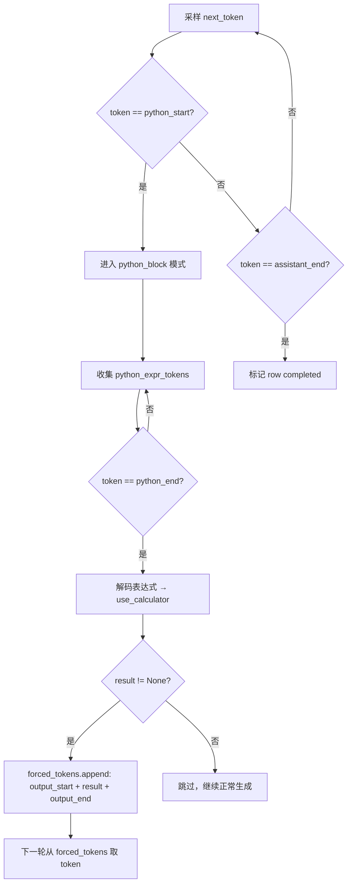
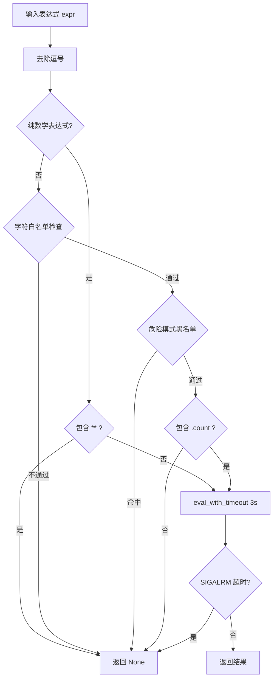

# PD-04.36 nanochat — 特殊 Token 状态机驱动的 Calculator 工具调用

> 文档编号：PD-04.36
> 来源：nanochat `nanochat/engine.py`, `nanochat/tokenizer.py`, `tasks/gsm8k.py`
> GitHub：https://github.com/karpathy/nanochat.git
> 问题域：PD-04 工具系统 Tool System Design
> 状态：可复用方案

---

## 第 1 章 问题与动机

### 1.1 核心问题

大多数 Agent 工具系统依赖外部协议（Function Calling JSON、MCP）来定义和调用工具。这些方案在推理服务场景下运作良好，但在以下场景中存在根本性限制：

1. **RL 训练兼容性**：Function Calling 的 JSON 结构是外挂在模型之外的，模型无法通过自回归生成来"学会"调用工具。RL 训练需要工具调用成为模型可生成的 token 序列。
2. **极简推理引擎**：小模型（如 nanochat 的 12 层 GPT）不需要复杂的工具注册表和 Schema 系统，需要一种零开销的工具集成方式。
3. **训练-推理一致性**：SFT 训练时模型看到的工具调用格式必须与推理时完全一致，否则分布偏移会导致工具调用失败。

nanochat 的核心洞察是：**工具调用可以完全内化为 token 序列**。通过在词表中添加特殊 token（`<|python_start|>`/`<|python_end|>`/`<|output_start|>`/`<|output_end|>`），模型自回归生成工具调用，推理引擎通过状态机检测并执行，结果作为 forced token 注入回生成流。

### 1.2 nanochat 的解法概述

1. **词表级工具协议**：9 个特殊 token 定义在 `SPECIAL_TOKENS` 列表中（`nanochat/tokenizer.py:13-25`），其中 4 个专用于工具调用，与 BPE 词表一起训练
2. **Engine 内置状态机**：`RowState` 类跟踪每行生成状态（`nanochat/engine.py:155-162`），`in_python_block` 标志位驱动 token 收集→表达式解码→calculator 执行→结果注入的完整流程
3. **安全沙箱 calculator**：`use_calculator()` 函数（`nanochat/engine.py:47-80`）实现白名单字符检查 + 危险模式黑名单 + SIGALRM 超时保护的三层防御
4. **训练掩码分离**：`render_conversation()` 中工具输出 token 的 mask=0（`nanochat/tokenizer.py:337-340`），模型只学习"何时调用工具"和"调用什么表达式"，不学习工具返回值
5. **RL 原生兼容**：Engine 的 `generate_batch()` 返回 `(tokens, masks)`，mask=0 标记 forced token，RL 训练直接用 mask 排除工具输出的梯度（`scripts/chat_rl.py:144-146`）

### 1.3 设计思想

| 设计原则 | 具体实现 | 理由 | 替代方案 |
|----------|----------|------|----------|
| Token 即协议 | 特殊 token 定义工具调用边界 | 模型可自回归生成，无需外挂 JSON 解析 | Function Calling JSON Schema |
| 状态机驱动 | RowState 跟踪 python_block 状态 | 逐 token 流式检测，零延迟 | 正则匹配完整输出后再解析 |
| Forced token 注入 | deque 队列存储待注入 token | 工具结果无缝融入生成流，KV cache 连续 | 拼接结果后重新 prefill |
| 训练掩码分离 | 工具输出 mask=0 不参与损失 | 模型学调用不学结果，结果由运行时提供 | 全部 token 参与训练 |
| 最小化工具集 | 仅 calculator 一个工具 | 小模型能力有限，专注数学推理场景 | 注册表 + 多工具路由 |

---

## 第 2 章 源码实现分析

### 2.1 架构概览

nanochat 的工具系统由三层组成：词表层（特殊 token 定义）、引擎层（状态机检测与执行）、数据层（训练样本中的工具调用标注）。

```
┌─────────────────────────────────────────────────────────────┐
│                    Token Vocabulary Layer                     │
│  <|python_start|> <|python_end|> <|output_start|> <|output_end|>  │
│  (nanochat/tokenizer.py:13-25, SPECIAL_TOKENS 列表)          │
└──────────────────────────┬──────────────────────────────────┘
                           │ encode/decode
┌──────────────────────────▼──────────────────────────────────┐
│                    Engine State Machine                       │
│  ┌──────────┐    ┌───────────────┐    ┌──────────────────┐  │
│  │ RowState │───→│ Token 收集器   │───→│ use_calculator() │  │
│  │ per-row  │    │ python_expr   │    │ 安全求值 + 超时   │  │
│  └──────────┘    └───────────────┘    └──────────────────┘  │
│  (nanochat/engine.py:155-276)                                │
└──────────────────────────┬──────────────────────────────────┘
                           │ forced_tokens
┌──────────────────────────▼──────────────────────────────────┐
│                    Training Data Layer                        │
│  GSM8K: <<expr=result>> → {type:"python"} + {type:"python_output"} │
│  render_conversation(): mask=1(调用) / mask=0(输出)           │
│  (tasks/gsm8k.py:59-76, nanochat/tokenizer.py:324-340)      │
└─────────────────────────────────────────────────────────────┘
```

### 2.2 核心实现

#### 2.2.1 特殊 Token 定义与工具调用协议

```mermaid
graph TD
    A[BOS token] --> B[user_start]
    B --> C[用户问题 tokens]
    C --> D[user_end]
    D --> E[assistant_start]
    E --> F[推理文本 tokens]
    F --> G["<|python_start|>"]
    G --> H[表达式 tokens: 12/60]
    H --> I["<|python_end|>"]
    I --> J["<|output_start|> (forced)"]
    J --> K[结果 tokens: 0.2 (forced)]
    K --> L["<|output_end|> (forced)"]
    L --> M[继续推理 tokens]
    M --> N[assistant_end]
```

对应源码 `nanochat/tokenizer.py:13-25`：

```python
SPECIAL_TOKENS = [
    "<|bos|>",
    "<|user_start|>",
    "<|user_end|>",
    "<|assistant_start|>",
    "<|assistant_end|>",
    "<|python_start|>",   # assistant 发起工具调用
    "<|python_end|>",     # 工具调用表达式结束
    "<|output_start|>",   # 工具输出开始（运行时注入）
    "<|output_end|>",     # 工具输出结束（运行时注入）
]
```

这 9 个特殊 token 在 BPE 训练时作为 `special_tokens` 参数传入（`tokenizer.py:89`），获得独立的 token ID，不会被 BPE 合并拆分。

#### 2.2.2 Engine 状态机：逐 token 工具检测与执行



对应源码 `nanochat/engine.py:155-267`：

```python
class RowState:
    def __init__(self, current_tokens=None):
        self.current_tokens = current_tokens or []
        self.forced_tokens = deque()       # 待强制注入的 token 队列
        self.in_python_block = False        # 是否在工具调用块内
        self.python_expr_tokens = []        # 当前表达式的 token 收集器
        self.completed = False              # 该行是否已完成生成

# Engine.generate() 主循环中的工具逻辑 (engine.py:240-267):
for i, state in enumerate(row_states):
    is_forced = len(state.forced_tokens) > 0
    token_masks.append(0 if is_forced else 1)  # forced=0, sampled=1
    next_token = state.forced_tokens.popleft() if is_forced else sampled_tokens[i]
    token_column.append(next_token)
    state.current_tokens.append(next_token)

    if next_token == python_start:
        state.in_python_block = True
        state.python_expr_tokens = []
    elif next_token == python_end and state.in_python_block:
        state.in_python_block = False
        if state.python_expr_tokens:
            expr = self.tokenizer.decode(state.python_expr_tokens)
            result = use_calculator(expr)
            if result is not None:
                result_tokens = self.tokenizer.encode(str(result))
                state.forced_tokens.append(output_start)
                state.forced_tokens.extend(result_tokens)
                state.forced_tokens.append(output_end)
        state.python_expr_tokens = []
    elif state.in_python_block:
        state.python_expr_tokens.append(next_token)
```

关键设计点：
- `forced_tokens` 使用 `deque` 而非 list，`popleft()` 是 O(1)（`engine.py:159`）
- `token_masks` 区分 forced(0) 和 sampled(1)，直接传递给 RL 训练用于梯度掩码（`engine.py:243`）
- 工具执行失败（`result is None`）时静默跳过，不中断生成流（`engine.py:260`）

#### 2.2.3 Calculator 安全执行：三层防御



对应源码 `nanochat/engine.py:26-80`：

```python
def use_calculator(expr):
    expr = expr.replace(",", "")
    # 第一层：纯数学表达式快速路径
    if all([x in "0123456789*+-/.() " for x in expr]):
        if "**" in expr:  # 禁止幂运算（防止 10**10**10 等 DoS）
            return None
        return eval_with_timeout(expr)
    # 第二层：字符白名单
    allowed_chars = "abcdefghijklmnopqrstuvwxyz...0123456789'\"()._ "
    if not all([x in allowed_chars for x in expr]):
        return None
    # 第三层：危险模式黑名单
    dangerous_patterns = ['__', 'import', 'exec', 'eval', 'compile', 'open', ...]
    if any(pattern in expr_lower for pattern in dangerous_patterns):
        return None
    # 第四层：只允许 .count() 方法
    if '.count(' not in expr:
        return None
    return eval_with_timeout(expr)

def eval_with_timeout(formula, max_time=3):
    with timeout(max_time, formula):
        with warnings.catch_warnings():
            warnings.simplefilter("ignore", SyntaxWarning)
            return eval(formula, {"__builtins__": {}}, {})  # 空 builtins 沙箱
```

`eval()` 的第二个参数 `{"__builtins__": {}}` 清空了所有内置函数，这是 Python 沙箱的经典技巧（`engine.py:41`）。

### 2.3 实现细节

#### 训练数据中的工具调用编码

GSM8K 数据集使用 `<<expression=result>>` 格式标注 calculator 调用。`get_example()` 方法将其解析为结构化消息部分（`tasks/gsm8k.py:59-76`）：

```python
# GSM8K 原始格式: "12/60 = $<<12/60=0.2>>0.2 per minute"
parts = re.split(r'(<<[^>]+>>)', answer)
for part in parts:
    if part.startswith('<<') and part.endswith('>>'):
        inner = part[2:-2]  # "12/60=0.2"
        expr, result = inner.rsplit('=', 1)
        assistant_message_parts.append({"type": "python", "text": expr})
        assistant_message_parts.append({"type": "python_output", "text": result})
    else:
        assistant_message_parts.append({"type": "text", "text": part})
```

#### 训练掩码策略

`render_conversation()` 中（`tokenizer.py:324-340`），三种消息部分有不同的掩码：

| 部分类型 | 掩码值 | 含义 |
|----------|--------|------|
| `text` | 1 | 模型需要学习生成的推理文本 |
| `python` | 1 | 模型需要学习何时调用工具、调用什么表达式 |
| `python_output` | 0 | 工具输出由运行时提供，模型不需要学习 |

#### RL 训练中的 forced token 掩码

`chat_rl.py:144-146` 的关键注释：

```python
targets[mask_ids[:, 1:] == 0] = -1  # -1 是 ignore_index
# NOTE: Engine 返回 mask=0 同时覆盖 prompt tokens 和 tool use forced tokens
# 所以我们（正确地）不会在 prompt 或工具输出 token 上训练
```

这确保了 RL 的 policy gradient 只作用于模型自主采样的 token，工具输出的 forced token 不参与梯度计算。


---

## 第 3 章 迁移指南

### 3.1 迁移清单

**阶段 1：词表扩展**
- [ ] 在 tokenizer 的特殊 token 列表中添加工具调用边界 token
- [ ] 重新训练或扩展 BPE 词表以包含新特殊 token
- [ ] 验证 `encode_special()` 能正确编码/解码新 token

**阶段 2：Engine 状态机**
- [ ] 实现 `RowState` 类，添加 `in_tool_block`、`tool_expr_tokens`、`forced_tokens` 字段
- [ ] 在生成循环中添加状态机逻辑：检测开始 token → 收集表达式 → 检测结束 token → 执行 → 注入结果
- [ ] 实现 `forced_tokens` 优先级：forced token 优先于采样 token
- [ ] 返回 `token_masks` 区分 forced(0) 和 sampled(1)

**阶段 3：工具实现**
- [ ] 实现具体工具函数（calculator、code executor 等）
- [ ] 添加安全防护：字符白名单、危险模式黑名单、超时保护
- [ ] 工具执行失败时静默降级（返回 None，不中断生成）

**阶段 4：训练数据**
- [ ] 构建包含工具调用标注的 SFT 数据集
- [ ] 实现 `render_conversation()` 的掩码逻辑：工具调用 mask=1，工具输出 mask=0
- [ ] 实现 `render_for_completion()` 用于 RL 训练

### 3.2 适配代码模板

以下是一个可直接复用的最小化工具状态机实现：

```python
"""
Minimal tool-use state machine for autoregressive generation.
Adapted from nanochat/engine.py pattern.
"""
from collections import deque
from typing import Callable, Optional

class ToolStateMachine:
    """Per-sequence state tracker for special-token-based tool calls."""

    def __init__(self, tool_fn: Callable[[str], Optional[str]],
                 start_token: int, end_token: int,
                 output_start_token: int, output_end_token: int,
                 decode_fn: Callable[[list[int]], str],
                 encode_fn: Callable[[str], list[int]]):
        self.tool_fn = tool_fn
        self.start_token = start_token
        self.end_token = end_token
        self.output_start = output_start_token
        self.output_end = output_end_token
        self.decode = decode_fn
        self.encode = encode_fn
        # State
        self.in_tool_block = False
        self.expr_tokens: list[int] = []
        self.forced_tokens: deque[int] = deque()

    def process_token(self, sampled_token: int) -> tuple[int, bool]:
        """
        Process one generation step.
        Returns (actual_token, is_forced).
        """
        # Forced tokens take priority
        if self.forced_tokens:
            return self.forced_tokens.popleft(), True

        # State machine transitions
        if sampled_token == self.start_token:
            self.in_tool_block = True
            self.expr_tokens = []
        elif sampled_token == self.end_token and self.in_tool_block:
            self.in_tool_block = False
            if self.expr_tokens:
                expr = self.decode(self.expr_tokens)
                result = self.tool_fn(expr)
                if result is not None:
                    result_tokens = self.encode(str(result))
                    self.forced_tokens.append(self.output_start)
                    self.forced_tokens.extend(result_tokens)
                    self.forced_tokens.append(self.output_end)
            self.expr_tokens = []
        elif self.in_tool_block:
            self.expr_tokens.append(sampled_token)

        return sampled_token, False


def safe_calculator(expr: str, max_time: int = 3) -> Optional[str]:
    """Safe math expression evaluator with timeout and sandboxing."""
    import signal, warnings

    expr = expr.replace(",", "")

    # Whitelist: only math characters
    if not all(c in "0123456789*+-/.() " for c in expr):
        return None
    if "**" in expr:
        return None

    def handler(signum, frame):
        raise TimeoutError(f"Eval timed out: {expr}")

    old_handler = signal.signal(signal.SIGALRM, handler)
    signal.alarm(max_time)
    try:
        with warnings.catch_warnings():
            warnings.simplefilter("ignore")
            result = eval(expr, {"__builtins__": {}}, {})
        signal.alarm(0)
        return str(result)
    except Exception:
        signal.alarm(0)
        return None
    finally:
        signal.signal(signal.SIGALRM, old_handler)
```

### 3.3 适用场景

| 场景 | 适用度 | 说明 |
|------|--------|------|
| 小模型 + 数学推理 | ⭐⭐⭐ | nanochat 的原生场景，12 层 GPT + GSM8K |
| RL 训练 + 工具调用 | ⭐⭐⭐ | forced token mask 天然兼容 REINFORCE/GRPO |
| 单工具场景 | ⭐⭐⭐ | calculator、code interpreter 等单一工具 |
| 多工具路由 | ⭐⭐ | 需扩展：不同 start token 对应不同工具 |
| 生产级 Agent 系统 | ⭐ | 缺少工具注册表、Schema 校验、错误恢复等 |
| 需要 MCP 协议的场景 | ⭐ | 完全不同的范式，不适用 |

---

## 第 4 章 测试用例

```python
"""
Tests for nanochat-style special token tool use state machine.
Based on actual function signatures from nanochat/engine.py.
"""
import pytest
from collections import deque


class TestUseCalculator:
    """Tests for use_calculator() (engine.py:47-80)"""

    def test_basic_math(self):
        from nanochat.engine import use_calculator
        assert use_calculator("12/60") == pytest.approx(0.2)
        assert use_calculator("0.2*50") == pytest.approx(10.0)
        assert use_calculator("3+4") == 7

    def test_comma_removal(self):
        from nanochat.engine import use_calculator
        assert use_calculator("1,000+2,000") == 3000

    def test_power_operator_blocked(self):
        from nanochat.engine import use_calculator
        assert use_calculator("10**10") is None

    def test_dangerous_patterns_blocked(self):
        from nanochat.engine import use_calculator
        assert use_calculator("__import__('os').system('ls')") is None
        assert use_calculator("exec('print(1)')") is None

    def test_string_count_allowed(self):
        from nanochat.engine import use_calculator
        assert use_calculator("'strawberry'.count('r')") == 3

    def test_unsupported_string_ops_blocked(self):
        from nanochat.engine import use_calculator
        assert use_calculator("'hello'.upper()") is None

    def test_timeout_protection(self):
        from nanochat.engine import eval_with_timeout
        # Very short timeout for testing
        result = eval_with_timeout("sum(range(10**8))", max_time=1)
        # Should either return None (timeout) or a result if fast enough
        # The key is it doesn't hang


class TestRowState:
    """Tests for RowState (engine.py:155-162)"""

    def test_initial_state(self):
        from nanochat.engine import RowState
        state = RowState()
        assert state.in_python_block is False
        assert state.python_expr_tokens == []
        assert len(state.forced_tokens) == 0
        assert state.completed is False

    def test_forced_tokens_fifo(self):
        from nanochat.engine import RowState
        state = RowState()
        state.forced_tokens.extend([10, 20, 30])
        assert state.forced_tokens.popleft() == 10
        assert state.forced_tokens.popleft() == 20
        assert state.forced_tokens.popleft() == 30


class TestToolStateMachineIntegration:
    """Integration test: tool call detection → execution → injection"""

    def test_calculator_flow(self):
        """Simulate: model generates <|python_start|>12/60<|python_end|>
        Engine should inject <|output_start|>0.2<|output_end|>"""
        # Mock token IDs
        PYTHON_START, PYTHON_END = 256, 257
        OUTPUT_START, OUTPUT_END = 258, 259
        # Mock tokenizer
        token_map = {100: "1", 101: "2", 102: "/", 103: "6", 104: "0"}
        reverse_map = {"0": 200, ".": 201, "2": 202}

        def decode(ids): return "".join(token_map[i] for i in ids)
        def encode(s): return [reverse_map[c] for c in s]

        # Simulate generation
        from collections import deque
        forced = deque()
        in_block = False
        expr_tokens = []
        output_sequence = []

        tokens_from_model = [PYTHON_START, 100, 101, 102, 103, 104, PYTHON_END]
        for token in tokens_from_model:
            if forced:
                actual = forced.popleft()
                output_sequence.append(("forced", actual))
                continue

            output_sequence.append(("sampled", token))
            if token == PYTHON_START:
                in_block = True
                expr_tokens = []
            elif token == PYTHON_END and in_block:
                in_block = False
                expr = decode(expr_tokens)
                assert expr == "12/60"
                result = str(eval(expr))  # "0.2"
                forced.append(OUTPUT_START)
                forced.extend(encode(result))
                forced.append(OUTPUT_END)
            elif in_block:
                expr_tokens.append(token)

        # Drain remaining forced tokens
        while forced:
            output_sequence.append(("forced", forced.popleft()))

        # Verify forced tokens were injected
        forced_tokens = [t for kind, t in output_sequence if kind == "forced"]
        assert forced_tokens[0] == OUTPUT_START
        assert forced_tokens[-1] == OUTPUT_END


class TestRenderConversationMask:
    """Tests for training mask behavior (tokenizer.py:324-340)"""

    def test_tool_output_not_supervised(self):
        """python_output parts should have mask=0"""
        # This tests the core invariant: tool outputs are not trained on
        content = [
            {"type": "text", "text": "Let me calculate: "},
            {"type": "python", "text": "12/60"},
            {"type": "python_output", "text": "0.2"},
            {"type": "text", "text": " per minute"},
        ]
        # In render_conversation, python_output gets mask=0
        # python and text get mask=1
        # This is the key training signal separation
        expected_masks = {
            "text": 1,
            "python": 1,
            "python_output": 0,
        }
        for part in content:
            assert expected_masks[part["type"]] in [0, 1]
```


---

## 第 5 章 跨域关联

| 关联域 | 关系类型 | 说明 |
|--------|----------|------|
| PD-01 上下文管理 | 协同 | forced token 注入会增加序列长度，需要 KV cache 有足够容量（`engine.py:209` 的 `kv_length_hint`） |
| PD-05 沙箱隔离 | 依赖 | `use_calculator()` 的 `eval()` 沙箱是轻量级的；`execution.py` 提供了更重的进程级沙箱用于 HumanEval |
| PD-12 推理增强 | 协同 | 工具调用本身就是推理增强手段——模型通过 calculator 获得精确计算能力，GSM8K 准确率显著提升 |
| PD-03 容错与重试 | 协同 | `use_calculator()` 返回 None 时静默跳过（`engine.py:260`），是一种最简容错：工具失败不中断生成 |

---

## 第 6 章 来源文件索引

| 文件 | 行范围 | 关键实现 |
|------|--------|----------|
| `nanochat/tokenizer.py` | L13-L25 | SPECIAL_TOKENS 定义，含 4 个工具调用专用 token |
| `nanochat/tokenizer.py` | L266-L350 | `render_conversation()` 工具调用掩码逻辑 |
| `nanochat/tokenizer.py` | L367-L385 | `render_for_completion()` RL 训练用 prompt 构建 |
| `nanochat/engine.py` | L26-L34 | `timeout()` 上下文管理器，SIGALRM 超时保护 |
| `nanochat/engine.py` | L36-L45 | `eval_with_timeout()` 安全求值，空 builtins 沙箱 |
| `nanochat/engine.py` | L47-L80 | `use_calculator()` 三层安全防御 |
| `nanochat/engine.py` | L155-L162 | `RowState` 类，per-row 工具调用状态跟踪 |
| `nanochat/engine.py` | L185-L192 | 特殊 token ID 获取（python_start/end, output_start/end） |
| `nanochat/engine.py` | L240-L267 | 生成循环中的工具状态机核心逻辑 |
| `nanochat/engine.py` | L277-L299 | `generate_batch()` 返回 tokens + masks |
| `tasks/gsm8k.py` | L59-L76 | GSM8K `<<expr=result>>` 解析为结构化消息部分 |
| `tasks/gsm8k.py` | L110-L117 | `reward()` 方法，RL 训练奖励计算 |
| `scripts/chat_rl.py` | L112-L121 | Engine 批量采样 rollout |
| `scripts/chat_rl.py` | L139-L146 | forced token 掩码：mask=0 → targets=-1 → 不参与梯度 |
| `scripts/chat_sft.py` | L166 | GSM8K 作为 SFT 训练混合数据的一部分（教工具调用） |
| `nanochat/execution.py` | L134-L203 | `reliability_guard()` 进程级沙箱（HumanEval 用） |

---

## 第 7 章 横向对比维度

```json comparison_data
{
  "project": "nanochat",
  "dimensions": {
    "工具注册方式": "无注册表，特殊 token 硬编码在词表和 Engine 中",
    "工具分组/权限": "无分组，仅 calculator 单一工具，无权限控制",
    "MCP 协议支持": "不支持，完全自定义的特殊 token 协议",
    "超时保护": "SIGALRM 3 秒超时 + 空 builtins 沙箱",
    "安全防护": "三层防御：字符白名单 + 危险模式黑名单 + 空 builtins",
    "RL训练集成": "forced token mask 天然兼容 REINFORCE/GRPO 梯度掩码",
    "流式解析状态机": "RowState 逐 token 状态机，deque 存储 forced tokens",
    "模型专用特殊 token 识别": "4 个专用 token: python_start/end + output_start/end",
    "参数校验": "字符白名单 + 危险模式黑名单，无 JSON Schema 校验",
    "结果摘要": "无摘要，calculator 结果直接编码为 token 注入"
  }
}
```

### 域元数据补充

```json domain_metadata
{
  "solution_summary": "nanochat 通过 4 个特殊 token 定义工具调用边界，Engine 内置 RowState 状态机逐 token 检测 calculator 调用并通过 forced_tokens deque 注入结果，天然兼容 GRPO RL 训练",
  "description": "特殊 token 驱动的工具调用是 RL 训练场景下的轻量级替代方案",
  "sub_problems": [
    "RL 训练兼容的工具掩码：如何区分模型采样 token 和工具注入 token 用于梯度计算",
    "特殊 token 词表设计：工具调用边界 token 如何与 BPE 词表共存且不被合并",
    "工具执行静默降级：calculator 返回 None 时如何不中断自回归生成流"
  ],
  "best_practices": [
    "工具输出 token 训练掩码为 0：模型只学调用时机和表达式，不学结果值",
    "forced token 用 deque 而非 list：popleft O(1) 避免大量注入时的性能退化",
    "eval 沙箱清空 builtins：eval(expr, {'__builtins__': {}}, {}) 是最小化 Python 沙箱"
  ]
}
```
