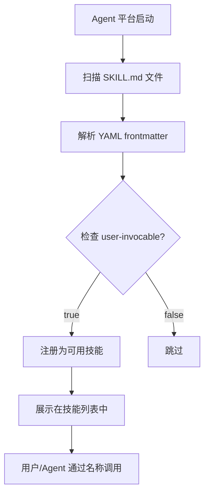
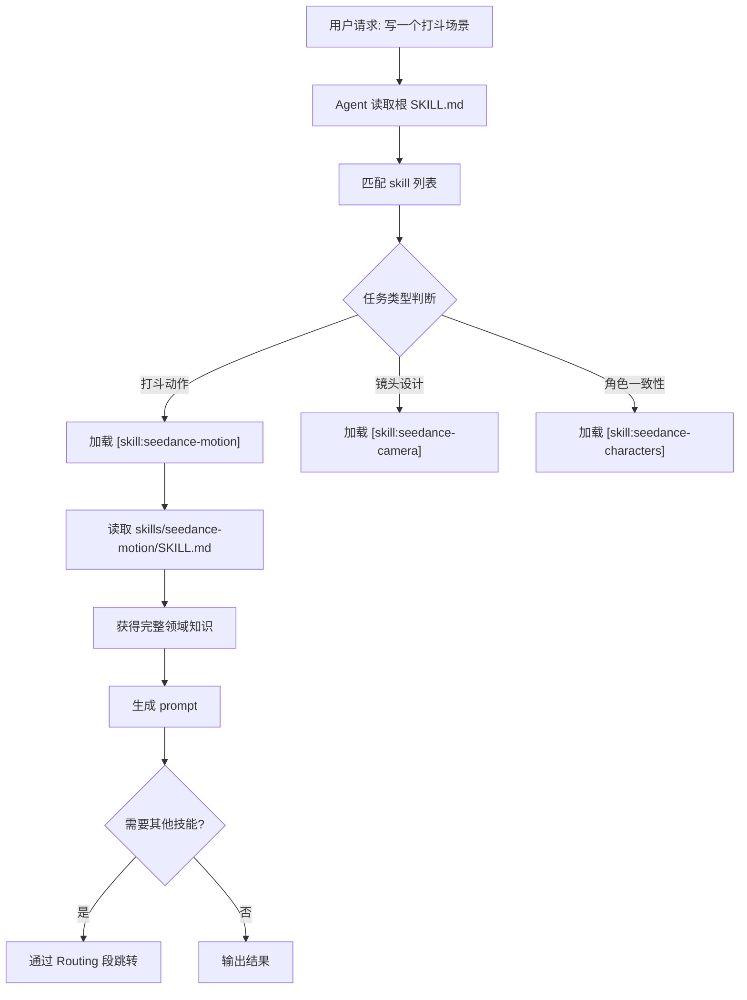

# PD-04.20 seedance-2.0 — AgentSkills 纯 Markdown 技能注册与 [skill:xxx] 引用路由

> 文档编号：PD-04.20
> 来源：seedance-2.0 `SKILL.md` + `skills/*/SKILL.md` + `references/quick-ref.md`
> GitHub：https://github.com/Emily2040/seedance-2.0.git
> 问题域：PD-04 工具系统 Tool System Design
> 状态：可复用方案

---

## 第 1 章 问题与动机

### 1.1 核心问题

AI Agent 的工具系统通常依赖代码级注册（Python 装饰器、JSON Schema、MCP 协议等），这带来三个问题：

1. **跨平台不可移植**：Claude Code 的工具注册方式与 Gemini CLI、Cursor、Codex 完全不同，一套工具定义无法在 10+ 平台间复用。
2. **知识注入 vs Schema 定义的矛盾**：传统 Function Calling 要求精确的参数 Schema，但对于"如何写好一个电影镜头 prompt"这类知识密集型工具，Schema 无法承载领域知识。
3. **工具膨胀问题**：20 个子技能如果全部加载到 LLM 上下文，会稀释选择准确率；但如果不加载，Agent 又不知道有哪些工具可用。

### 1.2 seedance-2.0 的解法概述

seedance-2.0 采用了一种**纯 Markdown + YAML frontmatter** 的工具注册方案，完全不依赖任何编程语言运行时：

1. **AgentSkills 开放标准注册**：每个技能通过 YAML frontmatter 声明 `name`/`description`/`tags`/`metadata`，遵循 agentskills.io 标准（`SKILL.md:1-8`）
2. **根技能作为路由器**：根 `SKILL.md` 仅 81 行，列出所有 20 个子技能的 `[skill:xxx]` 引用，充当工具注册中心和路由表（`SKILL.md:53-66`）
3. **按需加载**：Agent 只读根 SKILL.md（~75 行），根据任务匹配 `[skill:xxx]` 引用后才加载对应子技能的完整内容（`SKILL.md:15`）
4. **知识即工具**：子技能不是 Function Calling Schema，而是领域知识文档（如 seedance-prompt 的 Five-Layer Stack），LLM 通过阅读文档获得工具使用能力（`skills/seedance-prompt/SKILL.md:49-60`）
5. **10 平台统一分发**：同一套 SKILL.md 文件通过不同安装路径适配 Claude Code、Gemini CLI、Cursor、Codex 等 10 个平台（`SKILL.md:20-33`）

### 1.3 设计思想

| 设计原则 | 具体实现 | 理由 | 替代方案 |
|----------|----------|------|----------|
| 知识注入替代 Schema | 子技能是 Markdown 文档而非 JSON Schema | 电影制作知识无法用参数类型表达 | Function Calling + 参数枚举 |
| 根节点路由 | 根 SKILL.md 列出 `[skill:xxx]` 引用 | 75 行即可让 Agent 了解全部 20 个工具 | 全量加载所有技能到上下文 |
| 跨平台标准化 | AgentSkills 开放标准 YAML frontmatter | 一次编写，10 平台可用 | 每平台写一套适配代码 |
| 职责单一 | 每个子技能只管一个领域（camera/motion/audio...） | 减少单文件复杂度，支持按需加载 | 单一巨型 prompt 文件 |
| 显式路由声明 | 每个技能末尾有 Routing 段指向相关技能 | 形成技能间的导航图 | 依赖 LLM 自行推断关联 |

---

## 第 2 章 源码实现分析

### 2.1 架构概览

seedance-2.0 的工具系统是一个**纯文件系统的技能注册表**，没有任何运行时代码：

```
seedance-2.0/
├── SKILL.md                    ← 根路由器（81行，注册中心）
├── skills/                     ← 20 个子技能目录
│   ├── seedance-interview/     ← 🎭 入口技能（Director's Journey）
│   │   └── SKILL.md           ← YAML frontmatter + 领域知识
│   ├── seedance-prompt/        ← ✍️ 核心 prompt 构建
│   │   └── SKILL.md           ← Five-Layer Stack + @Tag 系统
│   ├── seedance-camera/        ← 🎥 镜头语言
│   ├── seedance-motion/        ← 🏃 运动控制
│   ├── seedance-lighting/      ← 💡 灯光设计
│   ├── seedance-characters/    ← 🎭 角色一致性
│   ├── seedance-style/         ← 🎨 风格控制
│   ├── seedance-vfx/           ← ✨ 特效
│   ├── seedance-audio/         ← 🔊 音频 + 口型同步
│   ├── seedance-pipeline/      ← 🔗 API + 后处理
│   ├── seedance-recipes/       ← 📖 类型模板
│   ├── seedance-troubleshoot/  ← 🔧 QA 诊断
│   ├── seedance-copyright/     ← ⚖️ IP 合规
│   ├── seedance-antislop/      ← 🚫 语言质量过滤
│   └── seedance-vocab-{zh,ja,ko,es,ru}/  ← 🌍 5 语言词汇表
└── references/                 ← 5 个参考文档
    ├── json-schema.md          ← JSON prompt schema
    ├── platform-constraints.md ← 平台限制
    ├── quick-ref.md            ← 速查卡
    ├── prompt-examples.md      ← 示例库
    └── storytelling-framework.md ← 叙事框架
```

核心架构模式：**Hub-and-Spoke（轮毂辐条）**——根 SKILL.md 是轮毂，20 个子技能是辐条，`[skill:xxx]` 和 `[ref:xxx]` 是连接线。

### 2.2 核心实现

#### 2.2.1 AgentSkills 标准注册（YAML Frontmatter）



对应源码 `SKILL.md:1-8`：

```yaml
---
name: seedance-20
description: 'Generate and direct cinematic AI videos with Seedance 2.0
  (ByteDance/Dreamina/Jimeng). Covers text-to-video, image-to-video,
  video-to-video, and reference-to-video workflows...'
license: MIT
user-invocable: true
user-invokable: true
tags: ["ai-video", "filmmaking", "bytedance", "seedance", "multimodal",
       "lip-sync", "openclaw", "antigravity", "gemini-cli", "firebase",
       "codex", "cursor", "windsurf", "opencode"]
metadata: {"version": "3.7.0", "updated": "2026-02-26",
  "openclaw": {"emoji": "🎬", "homepage": "..."},
  "antigravity": {"emoji": "🎬", "homepage": "..."},
  ...
  "author": "Emily (@iamemily2050)",
  "repository": "https://github.com/Emily2040/seedance-2.0"}
---
```

关键设计点：
- `user-invocable: true` + `user-invokable: true`（双拼写兼容）声明权限（`SKILL.md:5-6`）
- `metadata.parent: seedance-20` 在子技能中声明父子关系（`skills/seedance-prompt/SKILL.md:8`）
- `tags` 数组同时包含领域标签和平台标签，支持多维度发现（`SKILL.md:7`）
- `description` 以动词开头 + 包含 WHEN 触发短语，遵循 AgentSkills 规范（`SKILL.md:3`）

#### 2.2.2 [skill:xxx] 引用路由系统



对应源码 `SKILL.md:53-66`（根路由表）：

```markdown
## Skills

**Core pipeline**
[skill:seedance-interview] · [skill:seedance-prompt] ·
[skill:seedance-camera] · [skill:seedance-motion] ·
[skill:seedance-lighting] · [skill:seedance-characters] ·
[skill:seedance-style] · [skill:seedance-vfx] ·
[skill:seedance-audio] · [skill:seedance-pipeline] ·
[skill:seedance-recipes] · [skill:seedance-troubleshoot]

**Content quality**
[skill:seedance-copyright] · [skill:seedance-antislop]

**Vocabulary**
[skill:seedance-vocab-zh] · [skill:seedance-vocab-ja] ·
[skill:seedance-vocab-ko] · [skill:seedance-vocab-es] ·
[skill:seedance-vocab-ru]
```

路由机制的三层结构：
1. **分组路由**：Core pipeline / Content quality / Vocabulary 三组，Agent 按任务类型选组
2. **技能内路由**：每个技能末尾的 Routing 段指向相关技能（如 `seedance-prompt/SKILL.md:240-245`）
3. **引用路由**：`[ref:xxx]` 语法引用 references/ 下的参考文档（如 `[ref:json-schema]`、`[ref:platform-constraints]`）

#### 2.2.3 技能间导航图（Routing 段）

每个子技能在文档末尾声明与其他技能的路由关系，形成一个有向导航图。

对应源码 `skills/seedance-prompt/SKILL.md:240-245`：

```markdown
## Routing

Copyright issues → [skill:seedance-copyright]
Slop/quality audit → [skill:seedance-antislop]
Camera phrasing → [skill:seedance-camera]
Character identity → [skill:seedance-characters]
VFX contracts → [skill:seedance-vfx]
Audio layers → [skill:seedance-audio]
```

对应源码 `skills/seedance-troubleshoot/SKILL.md:174-180`：

```markdown
## Routing

Prompt construction errors → [skill:seedance-prompt]
Camera / storyboard issues → [skill:seedance-camera]
API / post-processing → [skill:seedance-pipeline]
Character consistency → [skill:seedance-characters]
Audio issues → [skill:seedance-audio]
```

### 2.3 实现细节

#### 跨平台安装路径映射

seedance-2.0 通过在根 SKILL.md 中声明 10 个平台的安装路径，实现一套代码多平台分发（`SKILL.md:20-33`）：

| 平台 | 安装路径 | 作用域 |
|------|----------|--------|
| Antigravity | `.agent/skills/seedance-20/` | workspace |
| Gemini CLI | `.gemini/skills/seedance-20/` | workspace |
| Firebase Studio | `.idx/skills/seedance-20/` | workspace |
| Claude Code | `.claude/skills/seedance-20/` | workspace |
| GitHub Copilot | `.github/skills/seedance-20/` | workspace |
| Codex | `.agents/skills/seedance-20/` | workspace |
| Cursor | `.cursor/skills/seedance-20/` | workspace |
| Windsurf | `.windsurf/skills/seedance-20/` | workspace |
| OpenCode | `.opencode/skills/seedance-20/` | workspace |

#### 入口技能引导模式

根 SKILL.md 通过 `Start:` 指令声明默认入口（`SKILL.md:15`）：

```markdown
Start: [skill:seedance-interview] — reads story/script, asks gap-fill
questions, outputs production brief.
```

这是一种**伪工具引导**模式：不是通过 tools/list 机制，而是通过自然语言指令告诉 Agent "从这里开始"。

#### Scope/Out-of-scope 边界声明

每个子技能通过 Scope 和 Out of scope 段精确划定职责边界（`skills/seedance-prompt/SKILL.md:16-29`）：

```markdown
## Scope
- Five-layer prompt structure (subject/action/camera/style/sound)
- Delegation levels 1–4 and when to use each
- @Tag role assignment and Universal Reference mode

## Out of scope
- Camera phrasing library — see [skill:seedance-camera]
- Character identity locking — see [skill:seedance-characters]
- VFX contracts — see [skill:seedance-vfx]
- Audio layers — see [skill:seedance-audio]
```

Out of scope 不仅说"我不管这个"，还精确指向应该去哪个技能，形成**反向路由**。
