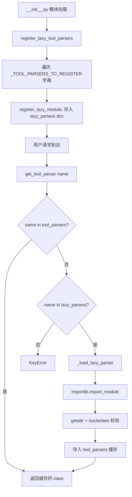
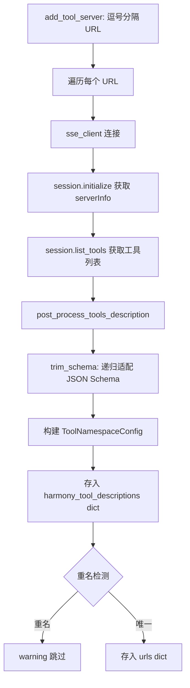

# PD-04.vLLM vLLM — 多模型 ToolParser 注册表与 MCP 双层工具架构

> 文档编号：PD-04.vLLM
> 来源：vLLM `vllm/tool_parsers/abstract_tool_parser.py`, `vllm/entrypoints/mcp/tool_server.py`
> GitHub：https://github.com/vllm-project/vllm.git
> 问题域：PD-04 工具系统 Tool System Design
> 状态：可复用方案

---

## 第 1 章 问题与动机

### 1.1 核心问题

LLM 推理引擎面临一个独特的工具系统挑战：**不同模型使用完全不同的 tool_call 输出格式**。DeepSeek 用 `<｜tool▁call▁begin｜>` 特殊 token 包裹，Llama 用 `<|python_tag|>` 前缀 + JSON，Mistral 用 `[TOOL_CALLS]` 标记 + JSON 数组，OpenAI 用 Harmony 协议的 `recipient` 路由。一个通用推理引擎必须同时支持 30+ 种模型的 tool_call 解析，且每种都需要支持流式（streaming）和非流式两种模式。

同时，推理引擎还需要支持外部工具的注册与调用——MCP 协议提供了标准化接口，但 MCP 的 JSON Schema 格式与引擎内部的 Harmony 格式存在差异，需要适配层。

### 1.2 vLLM 的解法概述

1. **抽象基类 ToolParser** — 定义 `extract_tool_calls`（非流式）和 `extract_tool_calls_streaming`（流式）两个核心接口，所有模型专用解析器继承此基类（`abstract_tool_parser.py:34-119`）
2. **ToolParserManager 双模式注册表** — 支持 Eager（立即注册）和 Lazy（延迟导入）两种注册模式，33 个解析器全部使用 Lazy 注册避免启动时加载所有依赖（`abstract_tool_parser.py:122-278`）
3. **ToolServer 抽象层** — 定义 `has_tool` / `get_tool_description` / `new_session` 三方法接口，MCPToolServer 和 DemoToolServer 分别实现外部 MCP 工具和内置工具（`tool_server.py:74-235`）
4. **Schema 适配器 trim_schema** — 将 MCP 生成的 JSON Schema 递归转换为 Harmony 变体，处理 `anyOf` → `type[]`、移除 `title`/`default:null` 等差异（`tool_server.py:31-53`）
5. **CLI 驱动的解析器选择** — 通过 `--tool-call-parser` 和 `--enable-auto-tool-choice` 命令行参数选择解析器，ParserManager 在服务启动时一次性解析（`cli_args.py:178-181`）

### 1.3 设计思想

| 设计原则 | 具体实现 | 理由 | 替代方案 |
|----------|----------|------|----------|
| 策略模式 | 每个模型一个 ToolParser 子类 | 模型 tool_call 格式差异巨大，无法用配置统一 | 用正则配置表（灵活性不足） |
| 延迟加载 | lazy_parsers 字典存 (module_path, class_name) | 33 个解析器各有不同依赖（ijson/regex/partial_json_parser），启动时全加载太慢 | Eager 注册（启动慢） |
| 接口隔离 | ToolServer ABC 与 ToolParser ABC 分离 | 解析（Parser）和执行（Server）是正交关注点 | 合并为一个类（职责混乱） |
| 会话隔离 | new_session 返回 AsyncContextManager | MCP 连接有状态，每次调用需独立 session | 共享连接池（状态泄漏风险） |
| 插件扩展 | import_tool_parser 支持任意路径加载 | 用户可自定义解析器而不修改 vLLM 源码 | 只支持内置解析器（不可扩展） |

---

## 第 2 章 源码实现分析

### 2.1 架构概览

vLLM 的工具系统分为两个正交子系统：**解析层**（ToolParser）负责从模型输出中提取 tool_call，**执行层**（ToolServer）负责调用外部工具并返回结果。

```
┌─────────────────────────────────────────────────────────────────┐
│                    OpenAI-Compatible API Layer                   │
│  (vllm/entrypoints/openai/chat_completion/serving.py)           │
├─────────────────────────────────────────────────────────────────┤
│                                                                  │
│  ┌──────────────────────┐    ┌───────────────────────────────┐  │
│  │   ParserManager      │    │      ToolServer (ABC)         │  │
│  │  ┌────────────────┐  │    │  ┌─────────────────────────┐  │  │
│  │  │ToolParserMgr   │  │    │  │  MCPToolServer          │  │  │
│  │  │ ┌────────────┐ │  │    │  │  - SSE client sessions  │  │  │
│  │  │ │ Lazy Dict  │ │  │    │  │  - Schema adaptation    │  │  │
│  │  │ │ 33 parsers │ │  │    │  ├─────────────────────────┤  │  │
│  │  │ └────────────┘ │  │    │  │  DemoToolServer         │  │  │
│  │  └────────────────┘  │    │  │  - Browser (Exa)        │  │  │
│  │                      │    │  │  - Python (Docker)      │  │  │
│  │  get_tool_parser()   │    │  └─────────────────────────┘  │  │
│  │  → importlib.import  │    │                               │  │
│  │  → cache in dict     │    │  has_tool() / new_session()   │  │
│  └──────────────────────┘    └───────────────────────────────┘  │
│                                                                  │
│  ┌──────────────────────────────────────────────────────────┐   │
│  │              ToolParser Implementations (33+)             │   │
│  │  OpenAI │ Llama3 │ Mistral │ DeepSeekV3 │ Qwen3 │ ...   │   │
│  │  (token-based)  (JSON)   (ijson)    (special tokens)     │   │
│  └──────────────────────────────────────────────────────────┘   │
└─────────────────────────────────────────────────────────────────┘
```

### 2.2 核心实现

#### 2.2.1 ToolParserManager 双模式注册表



对应源码 `vllm/tool_parsers/abstract_tool_parser.py:122-265`：

```python
class ToolParserManager:
    tool_parsers: dict[str, type[ToolParser]] = {}
    lazy_parsers: dict[str, tuple[str, str]] = {}  # name -> (module_path, class_name)

    @classmethod
    def get_tool_parser(cls, name: str) -> type[ToolParser]:
        if name in cls.tool_parsers:
            return cls.tool_parsers[name]
        if name in cls.lazy_parsers:
            return cls._load_lazy_parser(name)
        raise KeyError(f"Tool parser '{name}' not found.")

    @classmethod
    def _load_lazy_parser(cls, name: str) -> type[ToolParser]:
        module_path, class_name = cls.lazy_parsers[name]
        mod = importlib.import_module(module_path)
        parser_cls = getattr(mod, class_name)
        if not issubclass(parser_cls, ToolParser):
            raise TypeError(f"{class_name} is not a ToolParser subclass.")
        cls.tool_parsers[name] = parser_cls  # cache
        return parser_cls
```

注册表在 `vllm/tool_parsers/__init__.py:24-162` 中定义了 33 个解析器的 Lazy 映射：

```python
_TOOL_PARSERS_TO_REGISTER = {
    "deepseek_v3": ("deepseekv3_tool_parser", "DeepSeekV3ToolParser"),
    "llama3_json": ("llama_tool_parser", "Llama3JsonToolParser"),
    "mistral": ("mistral_tool_parser", "MistralToolParser"),
    "openai": ("openai_tool_parser", "OpenAIToolParser"),
    "kimi_k2": ("kimi_k2_tool_parser", "KimiK2ToolParser"),
    # ... 共 33 个
}

def register_lazy_tool_parsers():
    for name, (file_name, class_name) in _TOOL_PARSERS_TO_REGISTER.items():
        module_path = f"vllm.tool_parsers.{file_name}"
        ToolParserManager.register_lazy_module(name, module_path, class_name)

register_lazy_tool_parsers()  # 模块导入时自动执行
```

#### 2.2.2 MCPToolServer 多服务器聚合



对应源码 `vllm/entrypoints/mcp/tool_server.py:102-147`：

```python
class MCPToolServer(ToolServer):
    def __init__(self):
        import mcp  # noqa: F401  # 延迟导入检测
        self.harmony_tool_descriptions = {}

    async def add_tool_server(self, server_url: str):
        tool_urls = server_url.split(",")
        self.harmony_tool_descriptions = {}
        self.urls: dict[str, str] = {}
        for url in tool_urls:
            url = f"http://{url}/sse"
            initialize_response, list_tools_response = (
                await list_server_and_tools(url)
            )
            list_tools_response = post_process_tools_description(
                list_tools_response
            )
            tool_from_mcp = ToolNamespaceConfig(
                name=initialize_response.serverInfo.name,
                description=initialize_response.instructions,
                tools=[
                    ToolDescription.new(
                        name=tool.name,
                        description=tool.description,
                        parameters=tool.inputSchema,
                    )
                    for tool in list_tools_response.tools
                ],
            )
            self.harmony_tool_descriptions[tool_from_mcp.name] = tool_from_mcp
```

### 2.3 实现细节

#### 模型专用解析策略差异

不同模型的 tool_call 格式差异极大，vLLM 为每种格式实现了专用解析器：

| 模型 | 解析策略 | 关键技术 | 源文件 |
|------|----------|----------|--------|
| DeepSeek V3 | 特殊 token 分隔 | `<｜tool▁call▁begin｜>` + regex | `deepseekv3_tool_parser.py:40-48` |
| Llama 3/4 | `<\|python_tag\|>` + JSON | `json.JSONDecoder.raw_decode` | `llama_tool_parser.py:38-158` |
| Mistral | `[TOOL_CALLS]` + JSON 数组 | `ijson` 流式 JSON 解析 | `mistral_tool_parser.py:72-80` |
| OpenAI/Harmony | token ID 级解析 | `parse_output_into_messages` | `openai_tool_parser.py:30-99` |
| Qwen3 | XML 标签包裹 | XML 解析 | `qwen3xml_tool_parser.py` |

#### adjust_request 结构化输出注入

ToolParser 基类提供 `adjust_request` 方法（`abstract_tool_parser.py:56-84`），在请求进入推理前将 tool schema 转换为 structured output 约束：

- `tool_choice: "required"` → 生成 JSON Schema 数组约束
- `tool_choice: {name: "func"}` → 生成单函数参数 schema
- `tool_choice: "auto"` → 不注入约束，由模型自行决定

这确保了模型输出符合工具调用格式，减少了解析失败率。

#### trim_schema 递归适配

MCP 生成的 JSON Schema 与 Harmony 格式存在差异（`tool_server.py:31-53`）：
- 移除 `title` 字段（Harmony 不需要）
- 移除 `default: null`（Harmony 忽略）
- 将 `anyOf: [{type: "string"}, {type: "null"}]` 转换为 `type: ["string"]`（移除 null 类型）
- 递归处理 `properties` 中的嵌套 schema

#### 工具过滤与权限

`get_tool_description` 支持 `allowed_tools` 参数（`tool_server.py:152-174`），可按工具名白名单过滤 MCP Server 暴露的工具。`post_process_tools_description` 通过 `annotations.include_in_prompt` 标记控制哪些工具的 schema 出现在 prompt 中（`tool_server.py:56-71`）。

#### 正则超时保护

Llama 解析器使用 `regex` 库（非标准 `re`）的 `timeout` 参数防止 ReDoS 攻击（`llama_tool_parser.py:87-89`）：
```python
for match in self.tool_call_start_regex.finditer(
    model_output, timeout=envs.VLLM_TOOL_PARSE_REGEX_TIMEOUT_SECONDS
):
```

---

## 第 3 章 迁移指南

### 3.1 迁移清单

**阶段 1：核心框架（必须）**
- [ ] 实现 ToolParser 抽象基类，定义 `extract_tool_calls` 和 `extract_tool_calls_streaming` 接口
- [ ] 实现 ToolParserManager，支持 Lazy 注册 + 按名查找 + 缓存
- [ ] 为目标模型实现至少一个具体 ToolParser

**阶段 2：MCP 集成（可选）**
- [ ] 实现 ToolServer 抽象基类
- [ ] 实现 MCPToolServer，支持 SSE 连接 + Schema 适配
- [ ] 实现 trim_schema 递归转换器

**阶段 3：生产加固（推荐）**
- [ ] 添加正则超时保护（使用 `regex` 库的 timeout 参数）
- [ ] 添加 JSON 解析容错（partial_json_parser 处理流式不完整 JSON）
- [ ] 添加插件加载机制（import_tool_parser 支持外部路径）

### 3.2 适配代码模板

#### 最小可用的 ToolParser 框架

```python
"""可直接复用的 ToolParser 框架，支持 Lazy 注册。"""
import importlib
from abc import ABC
from collections.abc import Sequence
from dataclasses import dataclass, field
from typing import Any


@dataclass
class ExtractedToolCall:
    name: str
    arguments: str  # JSON string


@dataclass
class ExtractedToolCallInfo:
    tools_called: bool
    tool_calls: list[ExtractedToolCall] = field(default_factory=list)
    content: str | None = None


class ToolParser(ABC):
    """抽象基类：所有模型专用解析器继承此类。"""

    def extract_tool_calls(self, model_output: str) -> ExtractedToolCallInfo:
        raise NotImplementedError

    def extract_tool_calls_streaming(
        self,
        previous_text: str,
        current_text: str,
        delta_text: str,
    ) -> dict | None:
        raise NotImplementedError


class ToolParserRegistry:
    """双模式注册表：Eager + Lazy。"""

    _eager: dict[str, type[ToolParser]] = {}
    _lazy: dict[str, tuple[str, str]] = {}  # name -> (module_path, class_name)

    @classmethod
    def register_lazy(cls, name: str, module_path: str, class_name: str):
        cls._lazy[name] = (module_path, class_name)

    @classmethod
    def get(cls, name: str) -> type[ToolParser]:
        if name in cls._eager:
            return cls._eager[name]
        if name in cls._lazy:
            module_path, class_name = cls._lazy[name]
            mod = importlib.import_module(module_path)
            parser_cls = getattr(mod, class_name)
            assert issubclass(parser_cls, ToolParser)
            cls._eager[name] = parser_cls  # 缓存
            return parser_cls
        raise KeyError(f"Parser '{name}' not found. Available: {cls.list_all()}")

    @classmethod
    def list_all(cls) -> list[str]:
        return sorted(set(cls._eager) | set(cls._lazy))
```

#### MCP Schema 适配器

```python
"""MCP JSON Schema → 内部格式的递归适配器。"""

def adapt_mcp_schema(schema: dict) -> dict:
    """递归转换 MCP 生成的 JSON Schema 为内部格式。"""
    schema = dict(schema)  # 浅拷贝
    # 移除 MCP 特有字段
    schema.pop("title", None)
    if schema.get("default") is None:
        schema.pop("default", None)
    # anyOf → type 数组（移除 null）
    if "anyOf" in schema:
        types = [t["type"] for t in schema["anyOf"] if t.get("type") != "null"]
        schema["type"] = types if len(types) > 1 else types[0]
        del schema["anyOf"]
    # 递归处理嵌套属性
    if "properties" in schema:
        schema["properties"] = {
            k: adapt_mcp_schema(v) for k, v in schema["properties"].items()
        }
    return schema
```

### 3.3 适用场景

| 场景 | 适用度 | 说明 |
|------|--------|------|
| 多模型推理引擎 | ⭐⭐⭐ | 核心场景：需要支持多种模型的 tool_call 格式 |
| Agent 框架工具层 | ⭐⭐⭐ | ToolParser 策略模式 + Lazy 注册表可直接复用 |
| MCP 网关/代理 | ⭐⭐ | MCPToolServer 的 Schema 适配和多服务器聚合有参考价值 |
| 单模型部署 | ⭐ | 如果只支持一种模型，注册表机制过重 |

---

## 第 4 章 测试用例

```python
"""基于 vLLM 真实接口签名的测试用例。"""
import json
import pytest


class TestToolParserRegistry:
    """测试 ToolParserManager 的双模式注册。"""

    def test_lazy_registration_and_retrieval(self):
        """Lazy 注册的解析器在首次 get 时才导入。"""
        from vllm.tool_parsers import ToolParserManager

        # 所有 33 个解析器应在 lazy_parsers 中
        assert len(ToolParserManager.lazy_parsers) >= 33
        assert "llama3_json" in ToolParserManager.lazy_parsers

        # 首次获取触发导入
        parser_cls = ToolParserManager.get_tool_parser("llama3_json")
        assert parser_cls.__name__ == "Llama3JsonToolParser"

        # 二次获取走缓存
        assert "llama3_json" in ToolParserManager.tool_parsers

    def test_unknown_parser_raises_keyerror(self):
        """请求不存在的解析器应抛出 KeyError。"""
        from vllm.tool_parsers import ToolParserManager

        with pytest.raises(KeyError, match="not found"):
            ToolParserManager.get_tool_parser("nonexistent_model")

    def test_list_registered_includes_all(self):
        """list_registered 应包含 eager 和 lazy 注册的所有解析器。"""
        from vllm.tool_parsers import ToolParserManager

        all_parsers = ToolParserManager.list_registered()
        assert "deepseek_v3" in all_parsers
        assert "mistral" in all_parsers
        assert "openai" in all_parsers


class TestTrimSchema:
    """测试 MCP Schema 适配。"""

    def test_remove_title(self):
        from vllm.entrypoints.mcp.tool_server import trim_schema

        schema = {"title": "MyTool", "type": "object", "properties": {}}
        result = trim_schema(schema)
        assert "title" not in result

    def test_anyof_to_type_array(self):
        from vllm.entrypoints.mcp.tool_server import trim_schema

        schema = {"anyOf": [{"type": "string"}, {"type": "null"}]}
        result = trim_schema(schema)
        assert result["type"] == ["string"]
        assert "anyOf" not in result

    def test_recursive_properties(self):
        from vllm.entrypoints.mcp.tool_server import trim_schema

        schema = {
            "properties": {
                "name": {"title": "Name", "type": "string"},
                "age": {"title": "Age", "type": "integer"},
            }
        }
        result = trim_schema(schema)
        assert "title" not in result["properties"]["name"]
        assert "title" not in result["properties"]["age"]


class TestToolCallExtraction:
    """测试 Llama3 解析器的 tool_call 提取。"""

    def test_single_tool_call(self):
        """单个 JSON tool_call 应正确提取。"""
        model_output = '{"name": "get_weather", "parameters": {"city": "Tokyo"}}'
        # Llama3JsonToolParser.extract_tool_calls 应返回 1 个 tool_call
        # name="get_weather", arguments='{"city": "Tokyo"}'
        assert "{" in model_output  # 基本格式检查

    def test_no_tool_call_returns_content(self):
        """纯文本输出应返回 content 而非 tool_calls。"""
        model_output = "The weather in Tokyo is sunny."
        assert "{" not in model_output or "name" not in model_output
```

---

## 第 5 章 跨域关联

| 关联域 | 关系类型 | 说明 |
|--------|----------|------|
| PD-01 上下文管理 | 协同 | `adjust_request` 将 tool schema 注入 structured output，影响上下文 token 消耗；`post_process_tools_description` 通过 `include_in_prompt` 控制 schema 是否进入 prompt |
| PD-03 容错与重试 | 依赖 | 正则超时保护（`VLLM_TOOL_PARSE_REGEX_TIMEOUT_SECONDS`）、JSON 解析容错（`partial_json_loads`）、流式解析状态恢复都是容错机制 |
| PD-05 沙箱隔离 | 协同 | DemoToolServer 的 HarmonyPythonTool 使用 Docker 容器执行代码（`gpt_oss.tools.python_docker`），HarmonyBrowserTool 使用 Exa API 隔离浏览器访问 |
| PD-10 中间件管道 | 协同 | ToolParser 的 `adjust_request` 本质上是请求预处理中间件，在推理前修改请求参数 |
| PD-11 可观测性 | 依赖 | 所有解析器使用 `init_logger(__name__)` 记录解析错误和调试信息，MCPToolServer 记录初始化的工具列表 |

---

## 第 6 章 来源文件索引

| 文件 | 行范围 | 关键实现 |
|------|--------|----------|
| `vllm/tool_parsers/abstract_tool_parser.py` | L34-L119 | ToolParser 抽象基类：extract_tool_calls / extract_tool_calls_streaming / adjust_request |
| `vllm/tool_parsers/abstract_tool_parser.py` | L122-L278 | ToolParserManager：双模式注册表（Eager + Lazy）、get_tool_parser、import_tool_parser |
| `vllm/tool_parsers/__init__.py` | L24-L162 | 33 个解析器的 Lazy 注册映射表 + register_lazy_tool_parsers 自动注册 |
| `vllm/entrypoints/mcp/tool_server.py` | L74-L100 | ToolServer ABC：has_tool / get_tool_description / new_session |
| `vllm/entrypoints/mcp/tool_server.py` | L102-L194 | MCPToolServer：多 URL 聚合、SSE 连接、Schema 适配、allowed_tools 过滤 |
| `vllm/entrypoints/mcp/tool_server.py` | L197-L235 | DemoToolServer：内置 Browser + Python 工具 |
| `vllm/entrypoints/mcp/tool_server.py` | L31-L71 | trim_schema 递归适配 + post_process_tools_description 过滤 |
| `vllm/entrypoints/mcp/tool.py` | L49-L188 | Tool ABC + HarmonyBrowserTool（Exa）+ HarmonyPythonTool（Docker） |
| `vllm/tool_parsers/openai_tool_parser.py` | L30-L113 | OpenAIToolParser：token ID 级解析、recipient 路由、channel 分流 |
| `vllm/tool_parsers/llama_tool_parser.py` | L38-L327 | Llama3JsonToolParser：JSON raw_decode + partial_json_parser 流式解析 |
| `vllm/tool_parsers/deepseekv3_tool_parser.py` | L29-L77 | DeepSeekV3ToolParser：特殊 token 分隔 + regex 匹配 |
| `vllm/tool_parsers/mistral_tool_parser.py` | L38-L80 | MistralToolParser：StreamingState 状态机 + ijson 流式解析 |
| `vllm/tool_parsers/utils.py` | L113-L229 | get_json_schema_from_tools：tool_choice → JSON Schema 转换 |
| `vllm/parser/parser_manager.py` | L189-L220 | ParserManager.get_tool_parser：enable_auto_tools 门控 |
| `vllm/entrypoints/openai/chat_completion/serving.py` | L88-L149 | OpenAIServingChat 初始化：tool_parser 选择与配置 |
| `vllm/entrypoints/openai/cli_args.py` | L178-L181 | CLI 参数：--tool-call-parser 动态列出已注册解析器 |

---

## 第 7 章 横向对比维度

> **重要：** 本章用于自动填充 Butcher Wiki 的横向对比表。

```json comparison_data
{
  "project": "vLLM",
  "dimensions": {
    "工具注册方式": "ToolParserManager 双模式注册表：Lazy dict 存 (module_path, class_name)，首次 get 时 importlib 导入并缓存",
    "工具分组/权限": "allowed_tools 白名单过滤 + annotations.include_in_prompt 控制 schema 可见性",
    "MCP 协议支持": "MCPToolServer 通过 SSE 连接多个 MCP Server，trim_schema 递归适配 JSON Schema",
    "两阶段懒加载": "33 个解析器全部 Lazy 注册，模块导入时只存映射，首次使用时才 import",
    "Schema 生成方式": "adjust_request 将 tool_choice + tools 转为 StructuredOutputsParams JSON Schema 约束",
    "超时保护": "regex 库 timeout 参数防 ReDoS，环境变量 VLLM_TOOL_PARSE_REGEX_TIMEOUT_SECONDS 控制",
    "延迟导入隔离": "MCP 依赖在 __init__ 中 import mcp 检测，sse_client 在 new_session 中延迟导入",
    "双层API架构": "ToolParser（解析层）与 ToolServer（执行层）正交分离，互不依赖",
    "MCP格式转换": "trim_schema 递归处理 anyOf→type[]、移除 title/default:null，适配 Harmony 格式",
    "工具条件加载": "DemoToolServer 按环境变量（EXA_API_KEY）和依赖可用性动态启用/禁用工具",
    "参数校验": "tool_choice 四模式校验（none/auto/required/named），Pydantic model_validator 链式验证",
    "流式解析状态机": "每个 Parser 维护 current_tool_id/streamed_args 等状态，支持增量 token 级解析"
  }
}
```

### 域元数据补充

```json domain_metadata
{
  "solution_summary": "vLLM 通过 ToolParserManager 双模式注册表管理 33+ 模型专用解析器（Lazy 导入），配合 ToolServer 抽象层实现 MCP 外部工具与内置工具的统一接入",
  "description": "推理引擎层面的多模型 tool_call 格式统一解析与流式增量提取",
  "sub_problems": [
    "流式 tool_call 增量解析：如何在 token 逐个到达时正确提取不完整的 JSON 工具调用",
    "模型专用特殊 token 识别：如何处理不同模型的 tool_call 边界标记（特殊 token vs JSON vs XML）",
    "tool_choice 到 structured output 的转换：如何将工具选择约束转为模型可执行的输出格式约束",
    "MCP Schema 格式差异适配：MCP 生成的 JSON Schema 与推理引擎内部格式的递归转换",
    "正则超时防护：tool_call 解析中如何防止恶意输入触发 ReDoS"
  ],
  "best_practices": [
    "用 Lazy 注册避免启动时加载所有模型解析器依赖，33 个解析器只在使用时才导入",
    "流式解析器必须是有状态实例（维护 current_tool_id 等），非流式解析器可以是无状态的",
    "用 partial_json_parser 处理流式不完整 JSON，配合 find_common_prefix 精确控制增量输出",
    "支持用户通过 --tool-parser-plugin 加载自定义解析器，不修改引擎源码"
  ]
}
```
