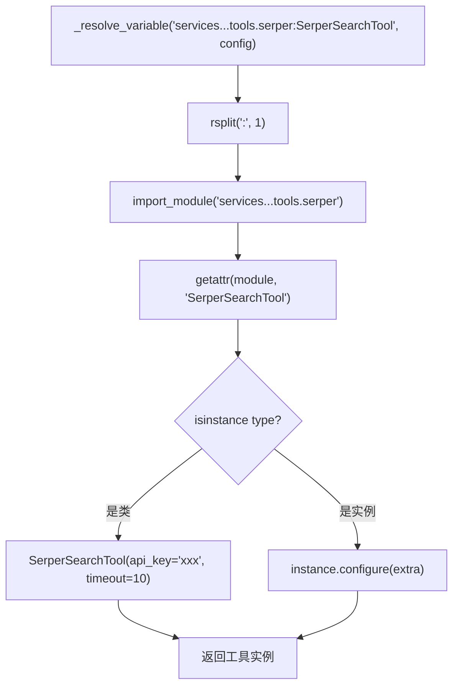

# PD-04.09 vibe-blog — YAML 配置驱动 ToolRegistry 与双层工具架构

> 文档编号：PD-04.09
> 来源：vibe-blog `backend/services/blog_generator/tools/registry.py`
> GitHub：https://github.com/datawhalechina/vibe-blog.git
> 问题域：PD-04 工具系统 Tool System Design
> 状态：可复用方案

---

## 第 1 章 问题与动机

### 1.1 核心问题

博客生成系统需要集成多种异构搜索引擎（智谱、Serper、搜狗、arXiv、Google Scholar）和爬虫工具（Jina Reader、httpx），每种工具有不同的 API Key、超时配置和初始化参数。如果在代码中硬编码工具实例化逻辑，每新增一个搜索引擎就要改代码、改导入、改初始化流程，维护成本线性增长。

同时，vibe-blog 存在两个不同层次的工具消费场景：
1. **ToolRegistry 层**：配置驱动的搜索/爬虫工具注册表，供 ResearcherAgent 按组批量获取可用工具
2. **BlogToolManager 层**：函数级工具注册，供 ToolEnhancedLLM 做 OpenAI Function Calling 风格的自主工具调用

这两层各自独立，解决不同粒度的工具管理问题。

### 1.2 vibe-blog 的解法概述

1. **YAML 声明式工具配置**：`backend/tool_config.yaml` 声明所有工具的名称、分组、Python 模块路径和额外参数，环境变量用 `$VAR` 语法引用（`registry.py:107-115`）
2. **反射加载 resolve_variable**：移植自 DeerFlow 的 `module_path:ClassName` 反射模式，支持类实例化和已有实例配置注入（`registry.py:93-105`）
3. **按组过滤 + 可用性检测**：工具按 search/crawl/knowledge 分组，`get_available_search_tools()` 自动过滤掉 API Key 未配置的工具（`registry.py:136-138`）
4. **BlogToolManager 超时保护**：threading 实现的工具执行超时，配合参数自动修复和执行统计（`tool_manager.py:120-168`）
5. **ToolEnhancedLLM 自主调用**：将工具定义转为 OpenAI Schema，LLM 在推理中自主决定是否调用工具，结果自动回注对话（`tool_enhanced_llm.py:82-170`）

### 1.3 设计思想

| 设计原则 | 具体实现 | 理由 | 替代方案 |
|----------|----------|------|----------|
| 配置与代码分离 | YAML 声明工具，`$ENV` 引用密钥 | 新增工具只改 YAML，不改 Python | 硬编码 if-else 分支 |
| 反射加载 | `module:Class` 路径 + importlib | 工具实现完全解耦，可独立开发 | 手动 import + 工厂字典 |
| 双基类抽象 | BaseSearchTool / BaseCrawlTool | 搜索和爬虫有不同接口契约 | 单一 BaseTool 万能基类 |
| 可用性自检 | `is_available()` 检查 API Key | 运行时自动跳过未配置工具 | 启动时硬性要求所有 Key |
| 双层架构 | ToolRegistry（配置驱动）+ BlogToolManager（函数注册） | 不同消费场景用不同粒度 | 统一为单一注册表 |
| 参数自动修复 | `_PARAM_ALIASES` 别名映射 | LLM 常把 `query` 写成 `q` | 让 LLM 自己修正 |

---

## 第 2 章 源码实现分析

### 2.1 架构概览

vibe-blog 的工具系统由三个独立层组成，各自服务不同的消费者：

```
┌─────────────────────────────────────────────────────────────┐
│                    tool_config.yaml                          │
│  (声明 7 个工具: 5 search + 2 crawl, $ENV 引用)             │
└──────────────────────┬──────────────────────────────────────┘
                       │ load_from_yaml()
                       ▼
┌─────────────────────────────────────────────────────────────┐
│              ToolRegistry (配置驱动层)                        │
│  _resolve_variable() → importlib 反射加载                    │
│  get_tools_by_group("search") → [ZhipuTool, SerperTool...]  │
│  get_available_search_tools() → 过滤 is_available()          │
│  reload() → 运行时热重载                                     │
└──────────────────────┬──────────────────────────────────────┘
                       │ 供 ResearcherAgent 批量获取
                       ▼
┌─────────────────────────────────────────────────────────────┐
│           BlogToolManager (函数注册层)                        │
│  register(name, func, timeout) → ToolDefinition              │
│  execute_tool(name, **kwargs) → threading 超时保护            │
│  fix_arguments() → 参数别名自动修复                           │
│  get_execution_stats() → 调用统计                            │
└──────────────────────┬──────────────────────────────────────┘
                       │ 供 ToolEnhancedLLM 自主调用
                       ▼
┌─────────────────────────────────────────────────────────────┐
│          ToolEnhancedLLM (LLM 自主调用层)                    │
│  ToolFactory.create_search_tool() → OpenAI Schema            │
│  chat_with_tools() → 多轮工具调用 + 结果回注                  │
│  max_rounds=3 → 防止无限循环                                  │
└─────────────────────────────────────────────────────────────┘
```

### 2.2 核心实现

#### 2.2.1 YAML 配置解析与环境变量注入

```mermaid
graph TD
    A[load_from_yaml] --> B{config_path 存在?}
    B -->|否| C[尝试 $VIBE_BLOG_TOOL_CONFIG]
    B -->|是| D[yaml.safe_load]
    C --> D
    D --> E[_resolve_env_vars 递归替换 $VAR]
    E --> F[遍历 tool_groups 建组]
    F --> G[遍历 tools 创建 ToolConfig]
    G --> H[_resolve_variable 反射加载]
    H --> I{是类还是实例?}
    I -->|类| J[Class(**config.extra)]
    I -->|实例| K[instance.configure(extra)]
    J --> L[注册到 _tools 字典]
    K --> L
```

对应源码 `backend/services/blog_generator/tools/registry.py:49-91`：
```python
def load_from_yaml(self, config_path: str = None) -> None:
    """从 YAML 文件加载工具配置"""
    if config_path is None:
        config_path = self._config_path or os.environ.get(
            "VIBE_BLOG_TOOL_CONFIG",
            os.path.join(
                os.path.dirname(__file__), "..", "..", "..", "tool_config.yaml"
            ),
        )
    self._config_path = config_path
    path = Path(config_path)
    if not path.exists():
        logger.warning(f"工具配置文件不存在: {config_path}")
        return
    with open(path) as f:
        data = yaml.safe_load(f) or {}
    # 解析环境变量
    data = self._resolve_env_vars(data)
    # 加载工具组
    for group in data.get("tool_groups", []):
        self._groups.setdefault(group["name"], [])
    # 加载工具
    for tool_data in data.get("tools", []):
        tool_data = dict(tool_data)
        name = tool_data.pop("name")
        group = tool_data.pop("group")
        use = tool_data.pop("use")
        config = ToolConfig(name=name, group=group, use=use, **tool_data)
        self._configs[name] = config
        self._groups.setdefault(group, []).append(name)
        try:
            tool = self._resolve_variable(use, config)
            self._tools[name] = tool
        except Exception as e:
            logger.error(f"工具加载失败: {name} ({use}): {e}")
```

#### 2.2.2 反射加载与配置注入



对应源码 `backend/services/blog_generator/tools/registry.py:93-105`：
```python
def _resolve_variable(self, variable_path: str, config: ToolConfig) -> Any:
    """反射加载工具（移植自 DeerFlow resolve_variable）"""
    module_path, variable_name = variable_path.rsplit(":", 1)
    module = import_module(module_path)
    tool_class_or_instance = getattr(module, variable_name)
    # 如果是类，用 config.extra 实例化
    if isinstance(tool_class_or_instance, type):
        return tool_class_or_instance(**config.extra)
    # 如果是实例，注入配置
    if hasattr(tool_class_or_instance, "configure"):
        tool_class_or_instance.configure(config.extra)
    return tool_class_or_instance
```

### 2.3 实现细节

#### 双基类设计与适配器模式

搜索工具和爬虫工具有不同的接口契约（`base.py:33-71`）：

- `BaseSearchTool`：`search(query, max_results) → SearchResponse`，含 `is_available()` 可用性检查
- `BaseCrawlTool`：`scrape(url) → Optional[str]`，返回 Markdown 文本

两者共享 `configure(extra)` 方法，支持从 `ToolConfig.extra` 注入配置。每个具体工具（如 `SerperSearchTool`）是一个薄适配器，内部延迟导入真正的 Service 类：

```python
# serper.py:22-35 — 延迟导入避免启动时依赖
def search(self, query: str, max_results: int = 5) -> SearchResponse:
    try:
        from ..services.serper_search_service import SerperSearchService
        svc = SerperSearchService(api_key=self.api_key, config={"timeout": self.timeout})
        raw = svc.search(query, max_results=max_results or self.max_results)
        ...
```

#### BlogToolManager 超时保护

`tool_manager.py:120-168` 使用 `threading.Thread` + `join(timeout)` 实现超时保护，适配 Flask 同步架构（不能用 asyncio）：

```
execute_tool(name, **kwargs)
  → fix_arguments()        # 参数别名修复
  → Thread(target=_run)    # 子线程执行
  → thread.join(timeout)   # 等待超时
  → thread.is_alive()?     # 超时检测
    → True:  返回 timeout 错误
    → False: 返回结果或异常
  → _record() + _log_to_task_log()  # 记录统计
```

#### 悬挂工具调用修复

`dangling_tool_call_fixer.py:5-28` 处理 LangGraph 工作流中断后消息历史不完整的问题——扫描所有 `AIMessage.tool_calls`，为缺少 `ToolMessage` 响应的调用注入占位消息，防止 LLM 因消息格式不完整而报错。

#### 统一搜索结果数据结构

`SearchResult` dataclass（`base.py:13-21`）统一了 5 种搜索引擎的返回格式：

| 字段 | 说明 | 来源映射 |
|------|------|----------|
| `title` | 标题 | 各引擎 `title` |
| `url` | 链接 | Serper 用 `link`，智谱用 `source` |
| `content` | 内容摘要 | Serper 用 `snippet`，Scholar 拼接多字段 |
| `source` | 引擎标识 | "serper" / "zhipu" / "sogou" / "arxiv" / "scholar" |
| `source_type` | 内容类型 | "web" / "arxiv" / "scholar" / "wechat" |

---

## 第 3 章 迁移指南

### 3.1 迁移清单

**阶段 1：基础工具注册（1 天）**
- [ ] 创建 `tools/base.py`，定义 `BaseSearchTool` / `BaseCrawlTool` 抽象基类
- [ ] 创建 `tools/registry.py`，实现 `ToolRegistry` + `_resolve_variable` 反射加载
- [ ] 创建 `tool_config.yaml`，声明至少 1 个搜索工具和 1 个爬虫工具
- [ ] 实现 `_resolve_env_vars` 递归环境变量解析

**阶段 2：具体工具适配器（每个工具 0.5 天）**
- [ ] 为每个搜索引擎创建 `XxxSearchTool(BaseSearchTool)` 适配器
- [ ] 为每个爬虫创建 `XxxCrawlTool(BaseCrawlTool)` 适配器
- [ ] 每个适配器实现 `is_available()` 可用性检查

**阶段 3：执行层增强（1 天）**
- [ ] 创建 `BlogToolManager`，实现 threading 超时保护
- [ ] 添加参数别名修复 `_PARAM_ALIASES`
- [ ] 添加执行统计 `get_execution_stats()`
- [ ] 集成 `ToolEnhancedLLM` 实现 LLM 自主工具调用

**阶段 4：健壮性（0.5 天）**
- [ ] 实现 `dangling_tool_call_fixer` 处理中断后消息修复
- [ ] 添加工具黑名单（环境变量 `TOOL_BLACKLIST`）
- [ ] 实现 `reload()` 运行时热重载

### 3.2 适配代码模板

#### 最小可用 ToolRegistry（可直接复用）

```python
"""tool_registry.py — 配置驱动工具注册表（移植自 vibe-blog）"""
import os
import yaml
import logging
from importlib import import_module
from pathlib import Path
from abc import ABC, abstractmethod
from dataclasses import dataclass, field
from typing import Any, Dict, List, Optional

logger = logging.getLogger(__name__)

@dataclass
class SearchResult:
    title: str = ""
    url: str = ""
    content: str = ""
    source: str = ""
    source_type: str = "web"

@dataclass
class SearchResponse:
    success: bool = False
    results: List[SearchResult] = field(default_factory=list)
    error: Optional[str] = None

class BaseSearchTool(ABC):
    name: str = ""
    group: str = "search"

    def configure(self, extra: Dict[str, Any]) -> None:
        for k, v in extra.items():
            if hasattr(self, k):
                setattr(self, k, v)

    @abstractmethod
    def is_available(self) -> bool: ...

    @abstractmethod
    def search(self, query: str, max_results: int = 5) -> SearchResponse: ...

class ToolConfig:
    def __init__(self, name: str, group: str, use: str, **extra):
        self.name, self.group, self.use, self.extra = name, group, use, extra

class ToolRegistry:
    def __init__(self):
        self._tools: Dict[str, Any] = {}
        self._configs: Dict[str, ToolConfig] = {}
        self._groups: Dict[str, List[str]] = {}

    def load_from_yaml(self, config_path: str) -> None:
        with open(config_path) as f:
            data = yaml.safe_load(f) or {}
        data = self._resolve_env_vars(data)
        for tool_data in data.get("tools", []):
            td = dict(tool_data)
            name, group, use = td.pop("name"), td.pop("group"), td.pop("use")
            config = ToolConfig(name=name, group=group, use=use, **td)
            self._configs[name] = config
            self._groups.setdefault(group, []).append(name)
            try:
                mod_path, var_name = use.rsplit(":", 1)
                mod = import_module(mod_path)
                cls_or_inst = getattr(mod, var_name)
                tool = cls_or_inst(**config.extra) if isinstance(cls_or_inst, type) else cls_or_inst
                self._tools[name] = tool
            except Exception as e:
                logger.error(f"加载失败: {name}: {e}")

    def _resolve_env_vars(self, data):
        if isinstance(data, str) and data.startswith("$"):
            return os.getenv(data[1:], "")
        if isinstance(data, dict):
            return {k: self._resolve_env_vars(v) for k, v in data.items()}
        if isinstance(data, list):
            return [self._resolve_env_vars(i) for i in data]
        return data

    def get_tools_by_group(self, group: str) -> List[Any]:
        return [self._tools[n] for n in self._groups.get(group, []) if n in self._tools]

    def get_available_search_tools(self) -> List[BaseSearchTool]:
        return [t for t in self.get_tools_by_group("search") if t.is_available()]
```

#### 超时保护执行器（可直接复用）

```python
"""tool_executor.py — threading 超时保护（移植自 vibe-blog BlogToolManager）"""
import time
import threading
from typing import Any, Callable, Dict

def execute_with_timeout(func: Callable, timeout: int = 300, **kwargs) -> Dict[str, Any]:
    result, error = [None], [None]
    def _run():
        try:
            result[0] = func(**kwargs)
        except Exception as e:
            error[0] = e
    t = threading.Thread(target=_run, daemon=True)
    t.start()
    t.join(timeout=timeout)
    duration_ms = int((time.time() - (time.time() - timeout if t.is_alive() else time.time())) * 1000)
    if t.is_alive():
        return {"success": False, "error": f"Timeout after {timeout}s"}
    if error[0]:
        return {"success": False, "error": str(error[0])}
    return {"success": True, "result": result[0]}
```

### 3.3 适用场景

| 场景 | 适用度 | 说明 |
|------|--------|------|
| 多搜索引擎聚合 | ⭐⭐⭐ | 核心场景：YAML 声明 + 按组过滤 + 可用性自检 |
| LLM Agent 工具调用 | ⭐⭐⭐ | ToolEnhancedLLM 的 OpenAI Schema 转换 + 多轮调用 |
| Flask/同步架构 | ⭐⭐⭐ | threading 超时保护专为同步架构设计 |
| 插件式工具扩展 | ⭐⭐ | 反射加载支持第三方工具，但无版本管理 |
| 高并发场景 | ⭐ | 单线程超时保护不适合高并发，需改用 asyncio |
| MCP 协议集成 | ⭐ | 当前不支持 MCP，需额外适配层 |

---

## 第 4 章 测试用例

```python
"""test_tool_system.py — vibe-blog 工具系统测试"""
import os
import pytest
import tempfile
import yaml
from unittest.mock import MagicMock, patch

# ===== ToolRegistry 测试 =====

class TestToolRegistry:
    """测试 YAML 配置驱动的工具注册表"""

    def _create_yaml_config(self, tools_data: list, tmp_path) -> str:
        config = {"tool_groups": [{"name": "search"}, {"name": "crawl"}], "tools": tools_data}
        path = os.path.join(str(tmp_path), "test_tools.yaml")
        with open(path, "w") as f:
            yaml.dump(config, f)
        return path

    def test_load_from_yaml_basic(self, tmp_path):
        """正常加载 YAML 配置"""
        from backend.services.blog_generator.tools.registry import ToolRegistry
        config_path = self._create_yaml_config([{
            "name": "arxiv_search", "group": "search",
            "use": "services.blog_generator.tools.arxiv:ArxivSearchTool",
            "max_results": 3,
        }], tmp_path)
        reg = ToolRegistry()
        reg.load_from_yaml(config_path)
        assert "arxiv_search" in reg.list_tools()
        assert len(reg.get_tools_by_group("search")) == 1

    def test_env_var_resolution(self):
        """$ENV_VAR 解析"""
        from backend.services.blog_generator.tools.registry import ToolRegistry
        reg = ToolRegistry()
        os.environ["TEST_KEY_123"] = "secret_value"
        result = reg._resolve_env_vars({"api_key": "$TEST_KEY_123"})
        assert result["api_key"] == "secret_value"
        del os.environ["TEST_KEY_123"]

    def test_missing_config_file(self):
        """配置文件不存在时不崩溃"""
        from backend.services.blog_generator.tools.registry import ToolRegistry
        reg = ToolRegistry()
        reg.load_from_yaml("/nonexistent/path.yaml")
        assert reg.list_tools() == []

    def test_get_available_filters_unconfigured(self, tmp_path):
        """get_available_search_tools 过滤未配置 API Key 的工具"""
        from backend.services.blog_generator.tools.registry import ToolRegistry
        config_path = self._create_yaml_config([{
            "name": "serper_search", "group": "search",
            "use": "services.blog_generator.tools.serper:SerperSearchTool",
            "api_key": "",  # 空 Key
        }], tmp_path)
        reg = ToolRegistry()
        reg.load_from_yaml(config_path)
        available = reg.get_available_search_tools()
        assert len(available) == 0  # Serper 无 Key 不可用

    def test_reload_clears_state(self, tmp_path):
        """reload() 清空并重新加载"""
        from backend.services.blog_generator.tools.registry import ToolRegistry
        config_path = self._create_yaml_config([{
            "name": "arxiv_search", "group": "search",
            "use": "services.blog_generator.tools.arxiv:ArxivSearchTool",
        }], tmp_path)
        reg = ToolRegistry()
        reg.load_from_yaml(config_path)
        assert len(reg.list_tools()) == 1
        reg.reload()
        # reload 后仍然有工具（从同一配置重新加载）
        assert len(reg.list_tools()) == 1


# ===== BlogToolManager 测试 =====

class TestBlogToolManager:
    """测试函数级工具管理器"""

    def test_register_and_execute(self):
        """注册并执行工具"""
        from backend.utils.tool_manager import BlogToolManager
        mgr = BlogToolManager()
        mgr.register("echo", lambda text: text, description="Echo tool")
        result = mgr.execute_tool("echo", text="hello")
        assert result["success"] is True
        assert result["result"] == "hello"

    def test_timeout_protection(self):
        """超时保护"""
        import time
        from backend.utils.tool_manager import BlogToolManager
        mgr = BlogToolManager()
        mgr.register("slow", lambda: time.sleep(10), timeout=1)
        result = mgr.execute_tool("slow")
        assert result["success"] is False
        assert "Timeout" in result["error"]

    def test_blacklist(self):
        """黑名单工具不可执行"""
        from backend.utils.tool_manager import BlogToolManager
        mgr = BlogToolManager(blacklist={"blocked_tool"})
        mgr.register("blocked_tool", lambda: "ok")
        result = mgr.execute_tool("blocked_tool")
        assert result["success"] is False
        assert "blacklisted" in result["error"]

    def test_fix_arguments(self):
        """参数别名自动修复"""
        from backend.utils.tool_manager import BlogToolManager
        mgr = BlogToolManager()
        fixed = mgr.fix_arguments("web_search", {"q": "test", "max_results": 5})
        assert "query" in fixed
        assert "q" not in fixed

    def test_execution_stats(self):
        """执行统计"""
        from backend.utils.tool_manager import BlogToolManager
        mgr = BlogToolManager()
        mgr.register("fast", lambda: 42)
        mgr.execute_tool("fast")
        mgr.execute_tool("fast")
        stats = mgr.get_execution_stats()
        assert stats["fast"]["calls"] == 2
        assert stats["fast"]["successes"] == 2
```

---

## 第 5 章 跨域关联

| 关联域 | 关系类型 | 说明 |
|--------|----------|------|
| PD-01 上下文管理 | 协同 | ToolEnhancedLLM 的多轮工具调用会累积消息历史，需要上下文窗口管理配合；`max_rounds=3` 是隐式的 token 预算控制 |
| PD-02 多 Agent 编排 | 依赖 | ResearcherAgent 通过 ToolRegistry 获取搜索工具，SearchCoordinator 编排多工具并行；工具系统是编排层的基础设施 |
| PD-03 容错与重试 | 协同 | `is_available()` 实现工具级优雅降级；BlogToolManager 的 threading 超时保护是容错的一部分；`dangling_tool_call_fixer` 处理中断恢复 |
| PD-06 记忆持久化 | 协同 | ResearcherAgent 的搜索结果缓存（`cache_utils`）与工具系统配合，避免重复调用相同查询 |
| PD-08 搜索与检索 | 依赖 | ToolRegistry 的 5 个搜索工具（智谱/Serper/搜狗/arXiv/Scholar）是搜索检索域的具体实现载体 |
| PD-10 中间件管道 | 协同 | BlogGenerator 的 MiddlewarePipeline（TracingMiddleware、TokenBudgetMiddleware 等）包裹了工具调用的上下文 |
| PD-11 可观测性 | 协同 | BlogToolManager 的 `_execution_log` 和 `get_execution_stats()` 提供工具级调用统计；`_log_to_task_log` 集成 BlogTaskLog |

---

## 第 6 章 来源文件索引

| 文件 | 行范围 | 关键实现 |
|------|--------|----------|
| `backend/services/blog_generator/tools/base.py` | L1-L72 | BaseSearchTool / BaseCrawlTool 抽象基类，SearchResult / SearchResponse 数据结构 |
| `backend/services/blog_generator/tools/registry.py` | L36-L174 | ToolRegistry 核心：YAML 加载、反射加载、按组过滤、全局单例 |
| `backend/services/blog_generator/tools/registry.py` | L93-L105 | `_resolve_variable` 反射加载（移植自 DeerFlow） |
| `backend/services/blog_generator/tools/registry.py` | L107-L115 | `_resolve_env_vars` 递归环境变量解析 |
| `backend/tool_config.yaml` | L1-L66 | 7 个工具声明：5 search + 2 crawl，含 $ENV 引用 |
| `backend/utils/tool_manager.py` | L29-L211 | BlogToolManager：函数注册、超时保护、参数修复、执行统计 |
| `backend/utils/tool_manager.py` | L96-L116 | `_PARAM_ALIASES` 参数别名映射 + `fix_arguments()` |
| `backend/services/blog_generator/tool_enhanced_llm.py` | L22-L41 | ToolDefinition + `to_openai_schema()` OpenAI Function Calling 格式转换 |
| `backend/services/blog_generator/tool_enhanced_llm.py` | L82-L170 | ToolEnhancedLLM：多轮工具调用 + 结果回注 |
| `backend/services/blog_generator/tools/serper.py` | L1-L36 | SerperSearchTool 适配器（延迟导入 Service） |
| `backend/services/blog_generator/tools/zhipu.py` | L1-L37 | ZhipuSearchTool 适配器 |
| `backend/services/blog_generator/tools/arxiv.py` | L1-L31 | ArxivSearchTool 适配器（免费无 Key） |
| `backend/services/blog_generator/tools/scholar.py` | L1-L63 | ScholarSearchTool 适配器（含 `_format_scholar_content` 多字段拼接） |
| `backend/services/blog_generator/tools/sogou.py` | L1-L37 | SogouSearchTool 适配器（腾讯云双 Key） |
| `backend/services/blog_generator/tools/jina.py` | L1-L25 | JinaCrawlTool 适配器 |
| `backend/services/blog_generator/tools/httpx_crawl.py` | L1-L23 | HttpxCrawlTool 降级爬虫适配器 |
| `backend/utils/dangling_tool_call_fixer.py` | L1-L28 | 悬挂工具调用修复（LangGraph 中断恢复） |
| `backend/services/blog_generator/tools/__init__.py` | L1-L21 | 包导出：统一对外接口 |

---

## 第 7 章 横向对比维度

> **重要：** 本章用于自动填充 Butcher Wiki 的横向对比表。

```json comparison_data
{
  "project": "vibe-blog",
  "dimensions": {
    "工具注册方式": "YAML 声明 + importlib 反射加载（resolve_variable 模式）",
    "工具分组/权限": "search/crawl/knowledge 三组 + 环境变量黑名单",
    "MCP 协议支持": "不支持 MCP，纯 Python 函数注册",
    "热更新/缓存": "reload() 清空重载 + 全局单例懒初始化",
    "超时保护": "threading.Thread + join(timeout) 同步超时",
    "生命周期追踪": "execute_tool 返回 success/error/duration_ms 三元组",
    "参数校验": "参数别名自动修复（_PARAM_ALIASES 映射表）",
    "安全防护": "$ENV 引用密钥不硬编码 + 工具黑名单",
    "Schema 生成方式": "ToolDefinition.to_openai_schema() 手动定义",
    "工具推荐策略": "无推荐，按组批量获取 + is_available 过滤",
    "双层API架构": "ToolRegistry（配置驱动）+ BlogToolManager（函数注册）双层独立",
    "结果摘要": "SearchResponse 统一结构 + JSON 截断至 200 字符",
    "工具集动态组合": "get_tools_by_group 按组获取，无场景级动态组合",
    "工具上下文注入": "BaseSearchTool.configure(extra) 从 ToolConfig 注入",
    "数据供应商路由": "5 搜索引擎并列，由 ResearcherAgent 选择",
    "供应商降级策略": "is_available() 过滤不可用工具，无自动降级链"
  }
}
```

### 域元数据补充

```json domain_metadata
{
  "solution_summary": "vibe-blog 用 YAML 声明 + importlib 反射加载实现 ToolRegistry 配置驱动工具注册表，配合 BlogToolManager threading 超时保护和 ToolEnhancedLLM OpenAI Schema 自主调用，形成三层工具架构",
  "description": "配置驱动的工具注册与 LLM 自主调用的分层协作模式",
  "sub_problems": [
    "悬挂工具调用修复：LangGraph 中断后如何为缺失 ToolMessage 的 tool_calls 注入占位响应",
    "LLM 参数别名修复：如何自动纠正 LLM 常见的参数名拼写错误（q→query）",
    "工具结果截断：搜索结果回注 LLM 时如何控制每条结果的字符长度",
    "延迟导入隔离：工具适配器如何通过延迟 import 避免启动时加载所有依赖"
  ],
  "best_practices": [
    "工具适配器应延迟导入底层 Service：避免启动时加载未安装的依赖导致全局失败",
    "双基类优于万能基类：搜索和爬虫接口契约不同，分开定义减少误用",
    "参数别名映射表：预定义 LLM 常见参数错误的修正规则，比让 LLM 重试更高效",
    "工具执行统计应内置：calls/successes/failures/avg_ms 四维统计帮助定位慢工具"
  ]
}
```
