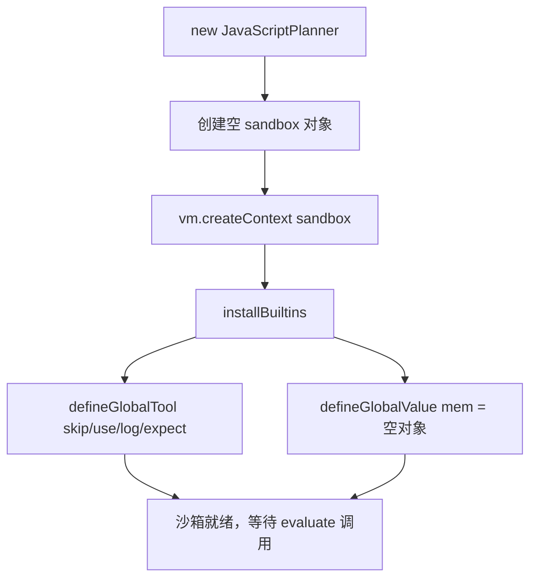
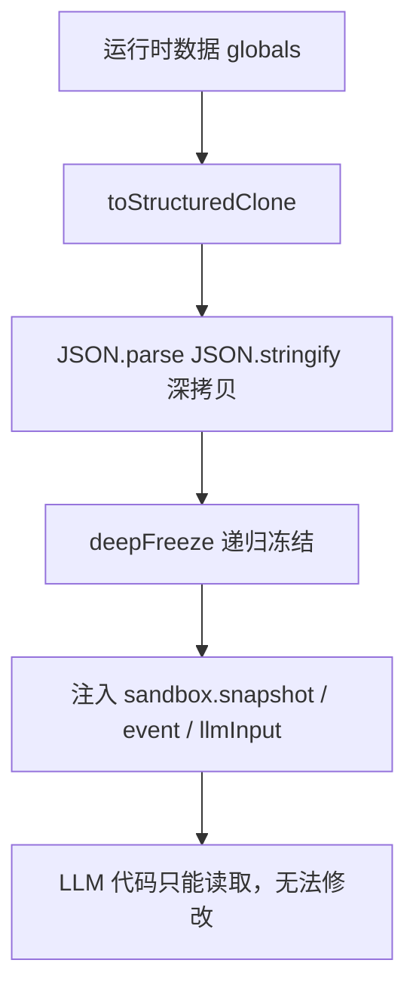
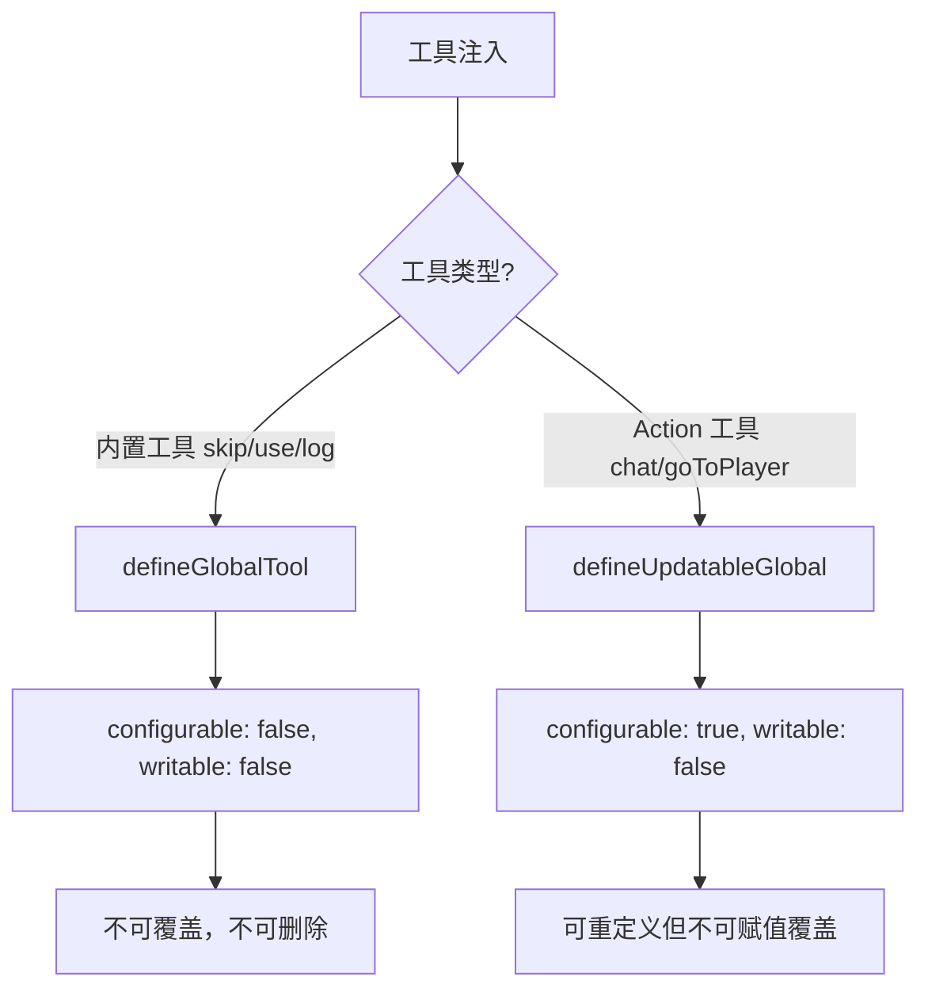

# PD-05.07 AIRI — Node.js VM 沙箱隔离与 LLM 代码执行

> 文档编号：PD-05.07
> 来源：AIRI `services/minecraft/src/cognitive/conscious/js-planner.ts`
> GitHub：https://github.com/moeru-ai/airi.git
> 问题域：PD-05 沙箱隔离 Sandbox Isolation
> 状态：可复用方案

---

## 第 1 章 问题与动机（≥ 30 行）

### 1.1 核心问题

AIRI 是一个 Minecraft AI Agent，其核心认知循环是：感知游戏事件 → LLM 推理 → 生成 JavaScript 代码 → 在沙箱中执行代码 → 操控游戏角色。这种"意图转代码"（Intent-to-Code）架构面临一个关键安全问题：**LLM 生成的代码不可信**，可能包含死循环、越权访问宿主进程内存、篡改全局状态等风险。

与容器级沙箱（Docker/K8s）不同，AIRI 的场景是**进程内代码隔离**——LLM 生成的 JS 代码需要在同一个 Node.js 进程中执行，同时能访问游戏 API（移动、聊天、挖矿等），但不能逃逸到宿主进程的其他部分。

这是一个典型的"既要隔离又要互操作"的矛盾：
- 太严格（如 Worker Thread）→ 无法直接调用 Mineflayer API，通信开销大
- 太宽松（如 eval）→ 代码可以访问 `process.exit()`、`require('fs')` 等危险 API

### 1.2 AIRI 的解法概述

AIRI 选择了 Node.js `vm` 模块作为隔离层，配合多层防御机制：

1. **vm.Context 隔离**：通过 `vm.createContext()` 创建独立的全局作用域，LLM 代码无法访问宿主的 `require`、`process`、`fs` 等 API（`js-planner.ts:130`）
2. **deepFreeze 冻结**：所有注入沙箱的运行时数据（snapshot、event、llmInput）经过 `toStructuredClone` + `deepFreeze` 双重处理，防止 LLM 代码篡改游戏状态（`js-planner.ts:441-447`）
3. **超时保护**：`vm.Script.runInContext` 的 `timeout` 参数（默认 750ms）防止死循环（`js-planner.ts:156`）
4. **动作数限制**：`maxActionsPerTurn`（默认 5）限制单次执行的工具调用次数，防止资源耗尽（`js-planner.ts:522-523`）
5. **白名单工具注入**：沙箱中只能调用预注册的 Action 工具，每个工具参数经 Zod schema 校验（`js-planner.ts:427-438`）

### 1.3 设计思想

| 设计原则 | 具体实现 | 理由 | 替代方案 |
|----------|----------|------|----------|
| 进程内隔离 | `vm.createContext()` 创建独立全局作用域 | 避免 IPC 开销，直接调用游戏 API | Worker Thread（隔离更强但通信复杂） |
| 数据不可变 | `deepFreeze` + `toStructuredClone` 双重防护 | 防止 LLM 代码篡改 snapshot 影响后续决策 | Proxy 拦截写操作（更灵活但性能差） |
| 白名单工具 | `defineGlobalTool` + `defineUpdatableGlobal` 分层注入 | 内置工具不可覆盖，Action 工具可热更新 | 全部不可变（无法适应动态 Action 列表） |
| 代码规范化 | TypeScript AST 将 `const x = 1` 转为 `globalThis.x = 1` | vm.Context 中 `const` 声明不会挂到全局，跨 turn 不可见 | 手动要求 LLM 不用 const（不可靠） |
| 执行预算 | timeout + maxActionsPerTurn 双重限制 | 防止死循环和工具调用风暴 | 单一超时（无法限制 API 调用频率） |

---

## 第 2 章 源码实现分析（≥ 60 行，核心章节）

### 2.1 架构概览

AIRI 的沙箱执行架构分为三层：Brain（认知调度）→ JavaScriptPlanner（沙箱执行）→ TaskExecutor（动作执行）。

```
┌─────────────────────────────────────────────────────────┐
│                    Brain (brain.ts)                       │
│  ┌─────────┐   ┌──────────────┐   ┌──────────────────┐  │
│  │ EventBus │──→│ processEvent │──→│ LLM Agent        │  │
│  │ (感知)   │   │ (认知循环)    │   │ (生成 JS 代码)   │  │
│  └─────────┘   └──────┬───────┘   └──────────────────┘  │
│                       │                                   │
│                       ▼                                   │
│  ┌────────────────────────────────────────────────────┐  │
│  │         JavaScriptPlanner (js-planner.ts)          │  │
│  │  ┌──────────┐  ┌───────────┐  ┌────────────────┐  │  │
│  │  │vm.Context│  │deepFreeze │  │ Action Tools   │  │  │
│  │  │(隔离域)  │  │(数据冻结) │  │ (白名单工具)   │  │  │
│  │  └──────────┘  └───────────┘  └────────────────┘  │  │
│  └────────────────────┬───────────────────────────────┘  │
│                       │                                   │
│                       ▼                                   │
│  ┌────────────────────────────────────────────────────┐  │
│  │         TaskExecutor (task-executor.ts)             │  │
│  │  执行 Minecraft 动作（移动、挖矿、聊天等）          │  │
│  └────────────────────────────────────────────────────┘  │
└─────────────────────────────────────────────────────────┘
```

### 2.2 核心实现

#### 2.2.1 沙箱创建与全局注入



对应源码 `services/minecraft/src/cognitive/conscious/js-planner.ts:119-132`：

```typescript
export class JavaScriptPlanner {
  private readonly context: vm.Context
  private activeRun: ActivePlannerRun | null = null
  private readonly maxActionsPerTurn: number
  private readonly sandbox: Record<string, unknown>
  private readonly timeoutMs: number

  constructor(options: JavaScriptPlannerOptions = {}) {
    this.timeoutMs = options.timeoutMs ?? 750
    this.maxActionsPerTurn = options.maxActionsPerTurn ?? 5
    this.sandbox = {}
    this.context = vm.createContext(this.sandbox)
    this.installBuiltins()
  }
}
```

关键设计：`sandbox` 对象是 `vm.createContext` 的宿主引用，后续通过 `Object.defineProperty` 向 `sandbox` 注入属性，这些属性会自动出现在 vm.Context 的全局作用域中。

#### 2.2.2 数据冻结与隔离



对应源码 `services/minecraft/src/cognitive/conscious/js-planner.ts:50-64` 和 `440-447`：

```typescript
function deepFreeze<T>(value: T): T {
  if (!value || typeof value !== 'object')
    return value
  for (const key of Object.keys(value as Record<string, unknown>)) {
    const child = (value as Record<string, unknown>)[key]
    deepFreeze(child)
  }
  return Object.freeze(value)
}

function toStructuredClone<T>(value: T): T {
  return JSON.parse(JSON.stringify(value)) as T
}

// bindRuntimeGlobals 中的使用：
private bindRuntimeGlobals(globals: RuntimeGlobals, run: ActivePlannerRun): void {
  const snapshot = deepFreeze(toStructuredClone(globals.snapshot))
  const event = deepFreeze(toStructuredClone(globals.event))
  const llmInput = deepFreeze(toStructuredClone(globals.llmInput ?? null))
  // ... 注入到 sandbox
}
```

`toStructuredClone` 先切断原始对象引用（防止沙箱通过引用修改宿主数据），`deepFreeze` 再递归冻结（防止沙箱修改拷贝后的数据）。双重防护确保沙箱中的数据是完全只读的。

#### 2.2.3 工具注入的两层策略



对应源码 `services/minecraft/src/cognitive/conscious/js-planner.ts:601-627`：

```typescript
private defineGlobalTool(name: string, fn: (...args: unknown[]) => unknown): void {
  this.defineGlobalValue(name, fn)
}

private defineGlobalValue(name: string, value: unknown): void {
  if (Object.prototype.hasOwnProperty.call(this.sandbox, name))
    return
  Object.defineProperty(this.sandbox, name, {
    value,
    configurable: false,  // 不可重定义
    enumerable: true,
    writable: false,       // 不可赋值覆盖
  })
}

// Action 工具可热更新（因为 Action 列表每 turn 可能变化）
private defineUpdatableGlobal(name: string, value: unknown): void {
  Object.defineProperty(this.sandbox, name, {
    value,
    configurable: true,   // 可重定义（下次 evaluate 时更新）
    enumerable: true,
    writable: false,       // 但不可被沙箱代码赋值覆盖
  })
}
```

### 2.3 实现细节

#### 代码规范化（REPL Code Normalizer）

LLM 生成的代码中 `const x = 1` 在 vm.Context 中不会挂到全局作用域，导致跨 turn 不可见。AIRI 用 TypeScript AST 将变量声明转为 `globalThis.x = 1`。

对应源码 `services/minecraft/src/cognitive/conscious/repl-code-normalizer.ts:23-38`：

```typescript
function normalizeVariableStatement(
  sourceFile: ts.SourceFile,
  statement: ts.VariableStatement,
): string {
  const keyword = getVariableKeyword(statement.declarationList.flags)
  const fragments: string[] = []
  for (const declaration of statement.declarationList.declarations) {
    if (ts.isIdentifier(declaration.name)) {
      const initializer = declaration.initializer
        ? getNodeText(sourceFile, declaration.initializer)
        : 'undefined'
      fragments.push(`globalThis.${declaration.name.text} = ${initializer};`)
      continue
    }
    const declarationText = getNodeText(sourceFile, declaration)
    fragments.push(`${keyword} ${declarationText};`)
  }
  return fragments.join('\n')
}
```

#### 动作数限制与 skip 互斥

`runAction` 方法中实现了两个关键约束（`js-planner.ts:513-528`）：
- `maxActionsPerTurn` 限制：超过 5 次工具调用直接抛错
- `skip` 互斥：调用 `skip()` 后不能再调用其他工具，防止 LLM 生成矛盾指令

#### Zod Schema 校验

每个 Action 工具的参数都经过 Zod schema 校验（`js-planner.ts:580-598`），校验失败不会抛错而是返回结构化的 `ValidationResult`，让 LLM 代码可以用 `if (!result.ok)` 做降级处理。


---

## 第 3 章 迁移指南（≥ 40 行）

### 3.1 迁移清单

**阶段 1：基础沙箱**
- [ ] 安装 Node.js（vm 模块为内置，无需额外依赖）
- [ ] 创建 `Sandbox` 类，封装 `vm.createContext` + `vm.Script`
- [ ] 实现 `deepFreeze` 和 `toStructuredClone` 工具函数
- [ ] 配置 `timeout` 参数（建议 500ms-2000ms，视场景调整）

**阶段 2：工具注入**
- [ ] 定义工具接口（name + schema + perform）
- [ ] 实现 `defineGlobalTool`（不可变内置）和 `defineUpdatableGlobal`（可热更新工具）
- [ ] 集成 Zod 做参数校验，返回结构化错误而非抛异常

**阶段 3：代码规范化**
- [ ] 如果需要跨 turn 状态持久化，实现变量声明到 `globalThis` 的 AST 转换
- [ ] 如果不需要跨 turn 状态，可跳过此步

**阶段 4：防御加固**
- [ ] 添加 `maxActionsPerTurn` 限制
- [ ] 实现 `mem` 持久化存储（跨 turn 可写的唯一全局变量）
- [ ] 添加 `expect` / `expectMoved` 等断言工具（可选）

### 3.2 适配代码模板

以下是一个可直接运行的最小化沙箱实现：

```typescript
import vm from 'node:vm'

interface Tool {
  name: string
  schema: Record<string, string>  // 简化版，生产环境用 Zod
  execute: (params: Record<string, unknown>) => Promise<unknown>
}

function deepFreeze<T>(value: T): T {
  if (!value || typeof value !== 'object') return value
  for (const key of Object.keys(value as Record<string, unknown>)) {
    deepFreeze((value as Record<string, unknown>)[key])
  }
  return Object.freeze(value)
}

class LLMCodeSandbox {
  private readonly sandbox: Record<string, unknown> = {}
  private readonly context: vm.Context

  constructor(
    private readonly timeoutMs = 750,
    private readonly maxActions = 5,
  ) {
    this.context = vm.createContext(this.sandbox)
    // 持久化存储，跨 evaluate 调用保留
    Object.defineProperty(this.sandbox, 'mem', {
      value: {},
      configurable: false,
      enumerable: true,
      writable: false,
    })
  }

  async evaluate(
    code: string,
    tools: Tool[],
    readonlyGlobals: Record<string, unknown>,
  ) {
    let actionCount = 0
    const results: Array<{ tool: string; ok: boolean; result?: unknown; error?: string }> = []

    // 注入只读全局变量（深拷贝 + 冻结）
    for (const [key, value] of Object.entries(readonlyGlobals)) {
      this.sandbox[key] = deepFreeze(JSON.parse(JSON.stringify(value)))
    }

    // 注入工具函数
    for (const tool of tools) {
      Object.defineProperty(this.sandbox, tool.name, {
        value: async (...args: unknown[]) => {
          if (++actionCount > this.maxActions) {
            throw new Error(`Action limit exceeded: max ${this.maxActions}`)
          }
          const params = typeof args[0] === 'object' ? args[0] as Record<string, unknown> : {}
          try {
            const result = await tool.execute(params)
            const entry = { tool: tool.name, ok: true, result }
            results.push(entry)
            return entry
          } catch (err) {
            const entry = { tool: tool.name, ok: false, error: String(err) }
            results.push(entry)
            return entry
          }
        },
        configurable: true,
        enumerable: true,
        writable: false,
      })
    }

    const wrapped = `(async () => {\n${code}\n})()`
    const returnValue = await new vm.Script(wrapped)
      .runInContext(this.context, { timeout: this.timeoutMs })

    return { results, returnValue }
  }
}
```

### 3.3 适用场景

| 场景 | 适用度 | 说明 |
|------|--------|------|
| 游戏 AI Agent（Minecraft/Roblox） | ⭐⭐⭐ | 完美匹配：需要执行 LLM 生成的代码操控游戏角色 |
| LLM 代码解释器（Code Interpreter） | ⭐⭐⭐ | 适合轻量级 JS/TS 代码执行，无需容器 |
| 聊天机器人插件系统 | ⭐⭐ | 适合执行用户自定义脚本，但需注意 vm 模块的安全边界 |
| 生产级多租户代码执行 | ⭐ | vm 模块不提供完整安全隔离，生产环境建议用 isolated-vm 或容器 |
| 需要文件系统/网络访问的场景 | ⭐ | vm 模块无法隔离文件系统和网络，需要额外的 OS 级隔离 |

---

## 第 4 章 测试用例（≥ 20 行）

基于 AIRI 真实测试文件 `js-planner.test.ts` 的模式：

```typescript
import { describe, expect, it, vi } from 'vitest'
import vm from 'node:vm'

// 测试 deepFreeze 防篡改
describe('deepFreeze', () => {
  function deepFreeze<T>(value: T): T {
    if (!value || typeof value !== 'object') return value
    for (const key of Object.keys(value as Record<string, unknown>)) {
      deepFreeze((value as Record<string, unknown>)[key])
    }
    return Object.freeze(value)
  }

  it('prevents modification of frozen objects', () => {
    const data = deepFreeze({ health: 20, nested: { x: 1 } })
    expect(() => { (data as any).health = 0 }).toThrow()
    expect(() => { (data as any).nested.x = 999 }).toThrow()
    expect(data.health).toBe(20)
  })
})

// 测试 vm.Context 隔离
describe('vm sandbox isolation', () => {
  it('prevents access to host process', () => {
    const sandbox: Record<string, unknown> = {}
    const context = vm.createContext(sandbox)
    expect(() => {
      new vm.Script('process.exit(1)').runInContext(context, { timeout: 100 })
    }).toThrow(/process is not defined/)
  })

  it('prevents require of dangerous modules', () => {
    const sandbox: Record<string, unknown> = {}
    const context = vm.createContext(sandbox)
    expect(() => {
      new vm.Script('require("fs")').runInContext(context, { timeout: 100 })
    }).toThrow(/require is not defined/)
  })

  it('enforces timeout on infinite loops', () => {
    const sandbox: Record<string, unknown> = {}
    const context = vm.createContext(sandbox)
    expect(() => {
      new vm.Script('while(true){}').runInContext(context, { timeout: 50 })
    }).toThrow(/Script execution timed out/)
  })

  it('enforces action count limit', async () => {
    let count = 0
    const maxActions = 3
    const sandbox: Record<string, unknown> = {
      doAction: async () => {
        if (++count > maxActions) throw new Error('Action limit exceeded')
        return 'ok'
      },
    }
    const context = vm.createContext(sandbox)
    const script = `(async () => {
      await doAction(); await doAction(); await doAction();
      await doAction(); // 第 4 次应该失败
    })()`
    await expect(new vm.Script(script).runInContext(context, { timeout: 500 }))
      .rejects.toThrow(/Action limit exceeded/)
  })
})

// 测试跨 turn 状态持久化
describe('cross-turn state persistence', () => {
  it('mem object persists across evaluate calls', () => {
    const sandbox: Record<string, unknown> = {}
    const context = vm.createContext(sandbox)
    Object.defineProperty(sandbox, 'mem', {
      value: {},
      configurable: false,
      writable: false,
    })
    new vm.Script('mem.counter = 42').runInContext(context, { timeout: 100 })
    const result = new vm.Script('mem.counter').runInContext(context, { timeout: 100 })
    expect(result).toBe(42)
  })
})
```


---

## 第 5 章 跨域关联

| 关联域 | 关系类型 | 说明 |
|--------|----------|------|
| PD-01 上下文管理 | 协同 | Brain 的 `autoTrimActiveContext` 和 `exitContext` 管理 LLM 对话上下文窗口，与沙箱执行的 turn 计数紧密耦合 |
| PD-02 多 Agent 编排 | 依赖 | Brain 的事件队列 + 优先级调度（`coalesceQueue`）编排多个感知事件的处理顺序，沙箱是执行层 |
| PD-03 容错与重试 | 协同 | Brain 的 LLM 重试逻辑（3 次 + 指数退避）和 `errorBurstGuard`（连续错误检测）为沙箱执行提供容错保护 |
| PD-04 工具系统 | 依赖 | 沙箱中的 Action 工具来自 `llm-actions.ts` 的 40+ 工具定义，每个工具有 Zod schema 校验 |
| PD-09 Human-in-the-Loop | 协同 | Brain 的 `paused` 状态和 `giveUp` 机制允许人类玩家通过聊天干预 Agent 行为 |
| PD-12 推理增强 | 协同 | `capturedReasoning` 字段保存 LLM 的推理过程，`patterns` 系统提供可复用的行为模式 |

---

## 第 6 章 来源文件索引

| 文件 | 行范围 | 关键实现 |
|------|--------|----------|
| `services/minecraft/src/cognitive/conscious/js-planner.ts` | L1-641 | 核心沙箱类 JavaScriptPlanner：vm.Context 创建、deepFreeze、工具注入、evaluate 执行 |
| `services/minecraft/src/cognitive/conscious/brain.ts` | L254-316 | Brain 类：实例化 JavaScriptPlanner，管理认知循环和事件队列 |
| `services/minecraft/src/cognitive/conscious/brain.ts` | L2045-2092 | processEvent 中的沙箱调用：代码规范化 → evaluate → 动作分发 |
| `services/minecraft/src/cognitive/conscious/repl-code-normalizer.ts` | L23-91 | TypeScript AST 代码规范化：const/let → globalThis 赋值 |
| `services/minecraft/src/cognitive/conscious/query-dsl.ts` | L1-80 | 查询 DSL：BlockQueryChain/EntityQueryChain 等链式查询 API |
| `services/minecraft/src/libs/mineflayer/action.ts` | L1-16 | Action 接口定义：name + schema + perform + execution 模式 |
| `services/minecraft/src/cognitive/action/llm-actions.ts` | L26-66 | 40+ Action 工具定义：chat、giveUp、skip、stop、goToPlayer 等 |
| `services/minecraft/src/cognitive/event-bus.ts` | L67-81 | EventBus 的 deepFreeze 实现：事件数据不可变保护 |
| `services/minecraft/src/cognitive/conscious/js-planner.test.ts` | L1-299 | 测试套件：工具调用、mem 持久化、timeout、skip 互斥、Zod 校验 |

---

## 第 7 章 横向对比维度

> **重要：** 本章用于自动填充 Butcher Wiki 的横向对比表。
> 必须严格按以下 JSON 格式输出，放在 `comparison_data` 代码块中。

```json comparison_data
{
  "project": "AIRI",
  "dimensions": {
    "隔离级别": "Node.js vm.Context 进程内隔离，无 require/process 访问",
    "防御性设计": "deepFreeze+toStructuredClone 双重冻结，数据完全只读",
    "资源限制": "750ms 超时 + 5 次/turn 动作数上限",
    "工具访问控制": "两层注入：内置不可变 + Action 可热更新，Zod schema 校验",
    "导入控制": "vm.Context 天然隔离，无 require/import 可用",
    "Scope 粒度": "单 vm.Context 实例复用，mem 对象跨 turn 持久化",
    "代码修复": "TypeScript AST 规范化 const→globalThis，表达式自动 return",
    "输入过滤": "extractJavaScriptCandidate 剥离 markdown 代码围栏",
    "上下文持久化": "mem 对象 + prevRun.returnRaw 跨 turn 传递状态",
    "双层沙箱": "无双层，单层 vm.Context + 应用层防御"
  }
}
```

### 域元数据补充

```json domain_metadata
{
  "solution_summary": "AIRI 用 Node.js vm.Context 实现进程内 LLM 代码执行隔离，deepFreeze 冻结全局变量 + 750ms 超时 + 5 次动作数限制 + TypeScript AST 代码规范化",
  "description": "进程内代码隔离：同一进程中执行不可信代码同时保持与宿主 API 的互操作性",
  "sub_problems": [
    "变量声明作用域泄露：vm.Context 中 const/let 不挂全局，需 AST 转 globalThis",
    "跨 turn 状态传递：沙箱每次执行需要访问上一次的返回值和持久化数据",
    "工具热更新与不可变冲突：内置工具不可覆盖但 Action 列表需要动态更新",
    "LLM 代码围栏剥离：LLM 输出常带 markdown 代码块标记需要预处理"
  ],
  "best_practices": [
    "toStructuredClone + deepFreeze 双重防护：先切断引用再冻结，比单独使用任一方更安全",
    "Zod 校验失败返回结构化错误而非抛异常：让 LLM 代码可以 if(!ok) 做降级处理",
    "用 TypeScript AST 做代码规范化比正则替换更可靠：能正确处理解构赋值等复杂语法"
  ]
}
```

