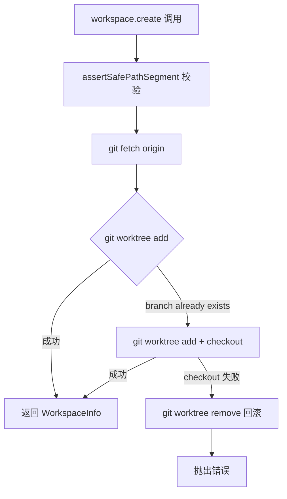
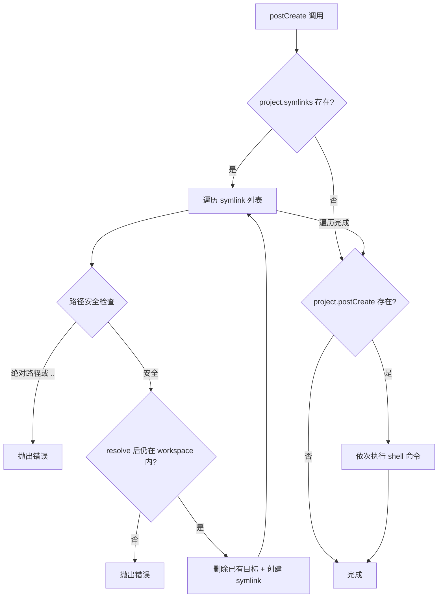
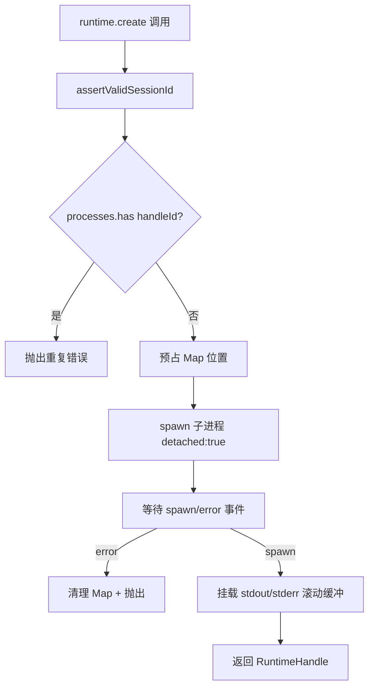

# PD-05.04 Agent-Orchestrator — 插件化工作区与进程级隔离

> 文档编号：PD-05.04
> 来源：Agent-Orchestrator `packages/plugins/workspace-worktree/`, `packages/plugins/runtime-tmux/`, `packages/plugins/runtime-process/`
> GitHub：https://github.com/ComposioHQ/agent-orchestrator.git
> 问题域：PD-05 沙箱隔离 Sandbox Isolation
> 状态：可复用方案

---

## 第 1 章 问题与动机（≥ 30 行）

### 1.1 核心问题

当多个 AI Agent 同时处理同一项目的不同 Issue 时，它们需要各自独立的代码副本和执行环境。如果所有 Agent 共享同一个工作目录，会出现：

- **文件冲突**：Agent A 修改 `src/app.ts` 的同时 Agent B 也在修改同一文件
- **Git 状态污染**：一个 Agent 的 `git add/commit` 操作影响另一个 Agent 的工作树
- **进程干扰**：一个 Agent 启动的 dev server 占用端口，阻塞其他 Agent
- **资源泄漏**：Agent 崩溃后遗留的 worktree、tmux session、子进程无人清理

Agent-Orchestrator 的核心设计目标是让每个 Agent session 拥有完全隔离的工作空间和执行环境，同时保持轻量级——不依赖 Docker 或虚拟机。

### 1.2 Agent-Orchestrator 的解法概述

Agent-Orchestrator 通过 **7 槽位插件架构** 实现隔离，其中 Workspace（槽位 3）和 Runtime（槽位 1）是隔离的两个核心维度：

1. **Workspace 插件负责代码隔离**：提供 `worktree`（git worktree）和 `clone`（完整 git clone）两种策略，每个 session 获得独立的文件系统目录（`packages/core/src/types.ts:379-399`）
2. **Runtime 插件负责进程隔离**：提供 `tmux`（持久化终端会话）和 `process`（子进程）两种策略，每个 session 在独立的进程空间中运行（`packages/core/src/types.ts:197-220`）
3. **Session Manager 编排两层隔离**：`spawn()` 方法按 workspace → postCreate → runtime 的顺序创建，`kill()` 按 runtime → workspace 的逆序销毁，任何步骤失败都有回滚清理（`packages/core/src/session-manager.ts:315-559`）
4. **路径安全防护**：所有 session ID 和 project ID 都经过 `SAFE_PATH_SEGMENT` 正则校验，防止目录遍历攻击（`packages/plugins/workspace-worktree/src/index.ts:33-39`）
5. **Hash 命名空间隔离**：通过 SHA256(configDir) 前 12 位生成全局唯一的 tmux session 名和数据目录，防止多个 orchestrator 实例冲突（`packages/core/src/paths.ts:20-25`）

### 1.3 设计思想

| 设计原则 | 具体实现 | 理由 | 替代方案 |
|----------|----------|------|----------|
| 插件化隔离策略 | Workspace/Runtime 各有 2+ 实现，通过 YAML 配置切换 | 不同场景需要不同隔离级别：worktree 轻量但共享 .git，clone 完全独立 | 硬编码单一隔离方式 |
| 进程级而非容器级 | tmux/process 而非 Docker | Agent 需要访问本地 git、SSH key、环境变量，容器隔离过重 | Docker/K8s 容器 |
| 路径段白名单 | `SAFE_PATH_SEGMENT = /^[a-zA-Z0-9_-]+$/` | 防止 `../../etc/passwd` 类路径遍历，比黑名单更安全 | 路径黑名单过滤 |
| 创建-销毁对称性 | spawn 正序创建 + kill 逆序销毁 + 每步失败回滚 | 防止资源泄漏，任何中间步骤失败都不留孤儿资源 | 手动清理 |
| Symlink 共享 | postCreate 阶段将 node_modules 等大目录 symlink 到 worktree | 避免每个 worktree 重复安装依赖，节省磁盘和时间 | 每个 worktree 独立 install |

---

## 第 2 章 源码实现分析（≥ 60 行，核心章节）

### 2.1 架构概览

Agent-Orchestrator 的隔离架构分为三层：Plugin Registry 管理插件发现与加载，Session Manager 编排 Workspace + Runtime 的生命周期，具体的 Workspace/Runtime 插件实现实际的隔离操作。

```
┌─────────────────────────────────────────────────────────────┐
│                    Session Manager                          │
│  spawn() → workspace.create() → postCreate() → runtime.create()  │
│  kill()  → runtime.destroy() → workspace.destroy()          │
└──────────┬──────────────────────────────┬───────────────────┘
           │                              │
    ┌──────▼──────┐               ┌───────▼───────┐
    │  Workspace  │               │    Runtime     │
    │  (Slot 3)   │               │   (Slot 1)     │
    ├─────────────┤               ├───────────────┤
    │ ● worktree  │               │ ● tmux        │
    │ ● clone     │               │ ● process     │
    └──────┬──────┘               └───────┬───────┘
           │                              │
    ┌──────▼──────┐               ┌───────▼───────┐
    │ 文件系统隔离 │               │  进程级隔离    │
    │ ~/.worktrees│               │ tmux session  │
    │ ~/.ao-clones│               │ child_process │
    └─────────────┘               └───────────────┘
```

### 2.2 核心实现

#### 2.2.1 Workspace-Worktree：Git Worktree 隔离



对应源码 `packages/plugins/workspace-worktree/src/index.ts:49-112`：

```typescript
export function create(config?: Record<string, unknown>): Workspace {
  const worktreeBaseDir = config?.worktreeDir
    ? expandPath(config.worktreeDir as string)
    : join(homedir(), ".worktrees");

  return {
    name: "worktree",

    async create(cfg: WorkspaceCreateConfig): Promise<WorkspaceInfo> {
      assertSafePathSegment(cfg.projectId, "projectId");
      assertSafePathSegment(cfg.sessionId, "sessionId");

      const repoPath = expandPath(cfg.project.path);
      const projectWorktreeDir = join(worktreeBaseDir, cfg.projectId);
      const worktreePath = join(projectWorktreeDir, cfg.sessionId);

      mkdirSync(projectWorktreeDir, { recursive: true });

      // Fetch latest from remote
      try {
        await git(repoPath, "fetch", "origin", "--quiet");
      } catch {
        // Fetch may fail if offline — continue anyway
      }

      const baseRef = `origin/${cfg.project.defaultBranch}`;

      // Create worktree with a new branch
      try {
        await git(repoPath, "worktree", "add", "-b", cfg.branch, worktreePath, baseRef);
      } catch (err: unknown) {
        const msg = err instanceof Error ? err.message : String(err);
        if (!msg.includes("already exists")) {
          throw new Error(`Failed to create worktree for branch "${cfg.branch}": ${msg}`, {
            cause: err,
          });
        }
        // Branch already exists — create worktree and check it out
        await git(repoPath, "worktree", "add", worktreePath, baseRef);
        try {
          await git(worktreePath, "checkout", cfg.branch);
        } catch (checkoutErr: unknown) {
          // Checkout failed — remove the orphaned worktree before rethrowing
          try {
            await git(repoPath, "worktree", "remove", "--force", worktreePath);
          } catch { /* Best-effort cleanup */ }
          throw new Error(`Failed to checkout branch "${cfg.branch}" in worktree: ...`);
        }
      }

      return { path: worktreePath, branch: cfg.branch, sessionId: cfg.sessionId, projectId: cfg.projectId };
    },
```

关键设计点：
- **离线容错**：`git fetch` 失败不阻塞创建（`index.ts:68-72`）
- **分支冲突处理**：先尝试 `-b` 创建新分支，失败后回退到 checkout 已有分支（`index.ts:77-104`）
- **孤儿 worktree 回滚**：checkout 失败时主动 `worktree remove --force`（`index.ts:92-97`）

#### 2.2.2 Symlink 共享与 postCreate 钩子



对应源码 `packages/plugins/workspace-worktree/src/index.ts:249-297`：

```typescript
async postCreate(info: WorkspaceInfo, project: ProjectConfig): Promise<void> {
  const repoPath = expandPath(project.path);

  // Symlink shared resources
  if (project.symlinks) {
    for (const symlinkPath of project.symlinks) {
      // Guard against absolute paths and directory traversal
      if (symlinkPath.startsWith("/") || symlinkPath.includes("..")) {
        throw new Error(
          `Invalid symlink path "${symlinkPath}": must be a relative path without ".." segments`,
        );
      }

      const sourcePath = join(repoPath, symlinkPath);
      const targetPath = resolve(info.path, symlinkPath);

      // Verify resolved target is still within the workspace
      if (!targetPath.startsWith(info.path + "/") && targetPath !== info.path) {
        throw new Error(
          `Symlink target "${symlinkPath}" resolves outside workspace: ${targetPath}`,
        );
      }

      if (!existsSync(sourcePath)) continue;

      // Remove existing target if it exists
      try {
        const stat = lstatSync(targetPath);
        if (stat.isSymbolicLink() || stat.isFile() || stat.isDirectory()) {
          rmSync(targetPath, { recursive: true, force: true });
        }
      } catch { /* Target doesn't exist — that's fine */ }

      mkdirSync(dirname(targetPath), { recursive: true });
      symlinkSync(sourcePath, targetPath);
    }
  }

  // Run postCreate hooks
  if (project.postCreate) {
    for (const command of project.postCreate) {
      await execFileAsync("sh", ["-c", command], { cwd: info.path });
    }
  }
},
```

关键安全设计：
- **双重路径校验**：先检查原始路径不含 `..` 和绝对路径，再检查 `resolve()` 后的路径仍在 workspace 内（`index.ts:256-270`）
- **幂等创建**：先删除已有目标再创建 symlink，支持重复调用（`index.ts:275-280`）

#### 2.2.3 Runtime-Process：子进程隔离与优雅销毁



对应源码 `packages/plugins/runtime-process/src/index.ts:42-146`：

```typescript
async create(config: RuntimeCreateConfig): Promise<RuntimeHandle> {
  assertValidSessionId(config.sessionId);
  const handleId = config.sessionId;

  // Prevent duplicate session IDs — check and reserve atomically
  if (processes.has(handleId)) {
    throw new Error(`Session "${handleId}" already exists — destroy it before re-creating`);
  }

  const entry: ProcessEntry = {
    process: null,
    outputBuffer: [],
    createdAt: Date.now(),
  };
  processes.set(handleId, entry);

  let child: ChildProcess;
  try {
    child = spawn(config.launchCommand, {
      cwd: config.workspacePath,
      env: { ...process.env, ...config.environment },
      stdio: ["pipe", "pipe", "pipe"],
      shell: true,
      detached: true, // Own process group so destroy() can kill child commands
    });
  } catch (err: unknown) {
    processes.delete(handleId);
    throw new Error(`Failed to spawn process for session ${handleId}: ...`);
  }
  // ...
```

进程销毁的优雅降级（`runtime-process/src/index.ts:148-197`）：

```typescript
async destroy(handle: RuntimeHandle): Promise<void> {
  const entry = processes.get(handle.id);
  if (!entry) return;

  const child = entry.process;
  if (child?.exitCode === null && child?.signalCode === null) {
    const pid = child.pid;
    if (pid) {
      try {
        process.kill(-pid, "SIGTERM"); // Kill entire process group
      } catch {
        child.kill("SIGTERM"); // Fallback to direct kill
      }
    }

    // Give it 5 seconds, then SIGKILL
    await new Promise<void>((resolve) => {
      const timeout = setTimeout(() => {
        if (child.exitCode === null && child.signalCode === null) {
          if (pid) {
            try { process.kill(-pid, "SIGKILL"); } catch { child.kill("SIGKILL"); }
          }
        }
        resolve();
      }, 5000);
      child.once("exit", () => { clearTimeout(timeout); resolve(); });
    });
  }

  processes.delete(handle.id);
},
```

关键设计：
- **进程组隔离**：`detached: true` + `process.kill(-pid)` 确保 shell 子命令也被终止（`index.ts:69, 163`）
- **SIGTERM → SIGKILL 两阶段**：先优雅终止，5 秒后强制杀死（`index.ts:174-188`）
- **滚动输出缓冲**：最多保留 1000 行，防止内存泄漏（`index.ts:33, 120-122`）

### 2.3 实现细节

#### Session Manager 的资源回滚链

Session Manager 的 `spawn()` 方法实现了严格的资源回滚链。每个创建步骤失败时，都会清理之前已创建的资源：

```
workspace.create() 失败 → 删除 metadata 预留
postCreate() 失败     → workspace.destroy() + 删除 metadata
runtime.create() 失败 → workspace.destroy() + 删除 metadata
writeMetadata() 失败  → runtime.destroy() + workspace.destroy() + 删除 metadata
```

这在 `session-manager.ts:402-556` 中通过嵌套 try-catch 实现，每层 catch 都执行 best-effort 清理。

#### Hash 命名空间防冲突

`paths.ts:20-25` 使用 `SHA256(dirname(configPath))` 的前 12 位作为命名空间前缀：

- tmux session 名：`{hash}-{prefix}-{num}`（如 `a3b4c5d6e7f8-int-1`）
- 数据目录：`~/.agent-orchestrator/{hash}-{projectId}/`
- `.origin` 文件检测 hash 碰撞（`paths.ts:173-194`）

这确保同一台机器上运行多个 orchestrator 实例时，tmux session 名和数据目录不会冲突。

---

## 第 3 章 迁移指南（≥ 40 行）

### 3.1 迁移清单

**阶段 1：定义隔离接口**

- [ ] 定义 `Workspace` 接口：`create()`, `destroy()`, `list()`, `postCreate()`, `exists()`, `restore()`
- [ ] 定义 `Runtime` 接口：`create()`, `destroy()`, `sendMessage()`, `getOutput()`, `isAlive()`
- [ ] 定义 `WorkspaceInfo`（path, branch, sessionId）和 `RuntimeHandle`（id, runtimeName, data）数据结构

**阶段 2：实现 Workspace 插件**

- [ ] 实现 worktree 策略：`git worktree add/remove` + 路径安全校验
- [ ] 实现 symlink 共享：`postCreate()` 中处理 `project.symlinks` 配置
- [ ] 实现 clone 策略（可选）：`git clone --reference` 完整隔离
- [ ] 添加 `SAFE_PATH_SEGMENT` 正则校验防止目录遍历

**阶段 3：实现 Runtime 插件**

- [ ] 实现 tmux 策略：`tmux new-session/kill-session` + `load-buffer` 长命令处理
- [ ] 实现 process 策略：`child_process.spawn` + `detached: true` 进程组隔离
- [ ] 实现 SIGTERM → SIGKILL 两阶段销毁
- [ ] 实现滚动输出缓冲（限制最大行数）

**阶段 4：编排层**

- [ ] 实现 Session Manager：workspace.create → postCreate → runtime.create 正序创建
- [ ] 实现逆序销毁：runtime.destroy → workspace.destroy
- [ ] 实现每步失败的回滚清理链
- [ ] 实现 Hash 命名空间防冲突（可选，多实例场景）

### 3.2 适配代码模板

以下是一个最小化的 Workspace + Runtime 隔离框架，可直接复用：

```typescript
// workspace.ts — 最小化 worktree 隔离
import { execFile } from "node:child_process";
import { promisify } from "node:util";
import { join } from "node:path";
import { homedir } from "node:os";
import { mkdirSync } from "node:fs";

const execFileAsync = promisify(execFile);
const SAFE_SEGMENT = /^[a-zA-Z0-9_-]+$/;

interface WorkspaceInfo {
  path: string;
  branch: string;
  sessionId: string;
}

async function git(cwd: string, ...args: string[]): Promise<string> {
  const { stdout } = await execFileAsync("git", args, { cwd });
  return stdout.trimEnd();
}

export async function createWorkspace(
  repoPath: string,
  projectId: string,
  sessionId: string,
  branch: string,
  defaultBranch: string,
): Promise<WorkspaceInfo> {
  if (!SAFE_SEGMENT.test(projectId) || !SAFE_SEGMENT.test(sessionId)) {
    throw new Error("Invalid path segment");
  }

  const baseDir = join(homedir(), ".worktrees", projectId);
  const worktreePath = join(baseDir, sessionId);
  mkdirSync(baseDir, { recursive: true });

  try {
    await git(repoPath, "fetch", "origin", "--quiet");
  } catch { /* offline OK */ }

  await git(repoPath, "worktree", "add", "-b", branch, worktreePath, `origin/${defaultBranch}`);
  return { path: worktreePath, branch, sessionId };
}

export async function destroyWorkspace(repoPath: string, worktreePath: string): Promise<void> {
  try {
    await git(repoPath, "worktree", "remove", "--force", worktreePath);
  } catch {
    const { rmSync, existsSync } = await import("node:fs");
    if (existsSync(worktreePath)) rmSync(worktreePath, { recursive: true, force: true });
  }
}
```

```typescript
// runtime.ts — 最小化进程隔离
import { spawn, type ChildProcess } from "node:child_process";

interface RuntimeHandle { id: string; pid?: number; }

const processes = new Map<string, ChildProcess>();

export async function createRuntime(
  sessionId: string,
  workspacePath: string,
  command: string,
  env: Record<string, string> = {},
): Promise<RuntimeHandle> {
  if (processes.has(sessionId)) throw new Error(`Session ${sessionId} exists`);

  const child = spawn(command, {
    cwd: workspacePath,
    env: { ...process.env, ...env },
    stdio: ["pipe", "pipe", "pipe"],
    shell: true,
    detached: true,
  });

  await new Promise<void>((resolve, reject) => {
    child.once("spawn", () => resolve());
    child.once("error", (err) => reject(err));
  });

  processes.set(sessionId, child);
  return { id: sessionId, pid: child.pid };
}

export async function destroyRuntime(handle: RuntimeHandle): Promise<void> {
  const child = processes.get(handle.id);
  if (!child) return;

  if (handle.pid) {
    try { process.kill(-handle.pid, "SIGTERM"); } catch { child.kill("SIGTERM"); }
  }

  await new Promise<void>((resolve) => {
    const timeout = setTimeout(() => {
      if (child.exitCode === null) {
        try { process.kill(-(handle.pid!), "SIGKILL"); } catch { child.kill("SIGKILL"); }
      }
      resolve();
    }, 5000);
    child.once("exit", () => { clearTimeout(timeout); resolve(); });
  });

  processes.delete(handle.id);
}
```

### 3.3 适用场景

| 场景 | 适用度 | 说明 |
|------|--------|------|
| 多 Agent 并行处理同一项目 | ⭐⭐⭐ | 核心场景，worktree 隔离 + tmux 进程隔离 |
| 单 Agent 多 session 管理 | ⭐⭐⭐ | session manager 的 spawn/kill/restore 完整覆盖 |
| CI/CD 并行构建 | ⭐⭐ | worktree 隔离适用，但 runtime 层可能需要 Docker |
| 需要网络隔离的场景 | ⭐ | 进程级隔离不提供网络隔离，需要容器方案 |
| 需要资源限制（CPU/内存） | ⭐ | 进程级隔离无 cgroup 限制，需要 Docker/K8s |
| 跨机器分布式执行 | ⭐ | 当前仅支持本地执行，需扩展 SSH/K8s runtime |

---

## 第 4 章 测试用例（≥ 20 行）

```python
import pytest
import subprocess
import os
import tempfile
import shutil
from pathlib import Path


class TestWorkspaceWorktreeIsolation:
    """测试 git worktree 工作区隔离"""

    @pytest.fixture
    def repo_dir(self, tmp_path):
        """创建一个带有初始提交的 git 仓库"""
        repo = tmp_path / "test-repo"
        repo.mkdir()
        subprocess.run(["git", "init"], cwd=repo, check=True, capture_output=True)
        subprocess.run(["git", "checkout", "-b", "main"], cwd=repo, check=True, capture_output=True)
        (repo / "README.md").write_text("# Test")
        subprocess.run(["git", "add", "."], cwd=repo, check=True, capture_output=True)
        subprocess.run(["git", "commit", "-m", "init"], cwd=repo, check=True, capture_output=True)
        return repo

    def test_worktree_creates_isolated_directory(self, repo_dir, tmp_path):
        """每个 session 获得独立的工作目录"""
        wt_path = tmp_path / "worktrees" / "session-1"
        subprocess.run(
            ["git", "worktree", "add", "-b", "feat/session-1", str(wt_path), "main"],
            cwd=repo_dir, check=True, capture_output=True,
        )
        assert wt_path.exists()
        assert (wt_path / "README.md").exists()
        # 修改 worktree 不影响主仓库
        (wt_path / "new-file.txt").write_text("session 1 only")
        assert not (repo_dir / "new-file.txt").exists()

    def test_safe_path_segment_rejects_traversal(self):
        """路径段校验拒绝目录遍历"""
        import re
        SAFE = re.compile(r"^[a-zA-Z0-9_-]+$")
        assert SAFE.match("session-1")
        assert SAFE.match("my_project")
        assert not SAFE.match("../etc")
        assert not SAFE.match("session/../../root")
        assert not SAFE.match("")

    def test_symlink_stays_within_workspace(self, repo_dir, tmp_path):
        """symlink 目标必须在 workspace 内"""
        wt_path = tmp_path / "worktrees" / "session-2"
        subprocess.run(
            ["git", "worktree", "add", "-b", "feat/session-2", str(wt_path), "main"],
            cwd=repo_dir, check=True, capture_output=True,
        )
        # 合法 symlink
        source = repo_dir / "node_modules"
        source.mkdir()
        target = wt_path / "node_modules"
        os.symlink(str(source), str(target))
        assert target.is_symlink()

        # 非法 symlink（resolve 后超出 workspace）
        evil_target = Path(os.path.realpath(str(wt_path / ".." / ".." / "evil")))
        assert not str(evil_target).startswith(str(wt_path))


class TestRuntimeProcessIsolation:
    """测试子进程运行时隔离"""

    def test_process_group_kill(self):
        """detached 进程组可以被整体终止"""
        import signal
        child = subprocess.Popen(
            ["sh", "-c", "sleep 60 & sleep 60 & wait"],
            start_new_session=True,
        )
        pgid = os.getpgid(child.pid)
        os.killpg(pgid, signal.SIGTERM)
        child.wait(timeout=5)
        assert child.returncode is not None

    def test_output_buffer_rolling_limit(self):
        """输出缓冲不超过最大行数"""
        MAX_LINES = 1000
        buffer = []
        for i in range(1500):
            buffer.append(f"line {i}")
            if len(buffer) > MAX_LINES:
                buffer = buffer[-MAX_LINES:]
        assert len(buffer) == MAX_LINES
        assert buffer[0] == "line 500"

    def test_duplicate_session_rejected(self):
        """重复 session ID 被拒绝"""
        sessions = {}
        session_id = "test-1"
        sessions[session_id] = {"pid": 12345}
        assert session_id in sessions  # 第二次创建应抛出错误
```

---

## 第 5 章 跨域关联

| 关联域 | 关系类型 | 说明 |
|--------|----------|------|
| PD-02 多 Agent 编排 | 依赖 | Session Manager 编排多个 Agent session 的生命周期，每个 session 需要独立的 workspace + runtime 隔离 |
| PD-04 工具系统 | 协同 | 7 槽位插件架构（PluginRegistry）同时管理 Workspace、Runtime、Agent 等插件，工具注册机制与隔离策略共享同一套插件发现/加载体系 |
| PD-06 记忆持久化 | 协同 | Session metadata（worktree 路径、branch、runtimeHandle）通过 flat-file 持久化到 `~/.agent-orchestrator/{hash}/sessions/`，支持 session restore |
| PD-09 Human-in-the-Loop | 协同 | Runtime 插件的 `getAttachInfo()` 返回 tmux attach 命令或 PID，Terminal 插件据此让人类接入正在运行的 Agent session |
| PD-10 中间件管道 | 协同 | postCreate 钩子机制（symlinks + shell commands）类似中间件管道，在 workspace 创建后、runtime 启动前执行初始化链 |
| PD-11 可观测性 | 协同 | Runtime 插件提供 `getMetrics()`（uptime）和 `getOutput()`（滚动日志），Lifecycle Manager 轮询检测 session 状态变化并触发通知 |

---

## 第 6 章 来源文件索引

| 文件 | 行范围 | 关键实现 |
|------|--------|----------|
| `packages/core/src/types.ts` | L197-L252 | Runtime 接口定义（create/destroy/sendMessage/getOutput/isAlive） |
| `packages/core/src/types.ts` | L379-L413 | Workspace 接口定义（create/destroy/list/postCreate/exists/restore） |
| `packages/core/src/types.ts` | L837-L888 | ProjectConfig 定义（symlinks、postCreate、workspace/runtime 配置） |
| `packages/core/src/types.ts` | L917-L945 | PluginSlot/PluginManifest/PluginModule 插件系统类型 |
| `packages/plugins/workspace-worktree/src/index.ts` | L1-L301 | Git worktree 隔离完整实现（create/destroy/list/postCreate/restore） |
| `packages/plugins/workspace-clone/src/index.ts` | L1-L246 | Git clone 隔离完整实现（--reference 加速 + 完全独立） |
| `packages/plugins/runtime-tmux/src/index.ts` | L1-L184 | Tmux session 隔离（load-buffer 长命令 + capture-pane 输出） |
| `packages/plugins/runtime-process/src/index.ts` | L1-L283 | 子进程隔离（detached 进程组 + SIGTERM→SIGKILL + 滚动缓冲） |
| `packages/core/src/session-manager.ts` | L315-L559 | spawn() 编排：workspace→postCreate→runtime + 回滚链 |
| `packages/core/src/session-manager.ts` | L750-L808 | kill() 编排：runtime→workspace 逆序销毁 |
| `packages/core/src/session-manager.ts` | L920-L1107 | restore() 编排：workspace 恢复 + runtime 重建 |
| `packages/core/src/plugin-registry.ts` | L26-L50 | BUILTIN_PLUGINS 列表（17 个内置插件，7 个槽位） |
| `packages/core/src/paths.ts` | L20-L25 | SHA256 hash 命名空间生成 |
| `packages/core/src/paths.ts` | L135-L138 | tmux 全局唯一名称生成（{hash}-{prefix}-{num}） |
| `packages/core/src/paths.ts` | L173-L194 | .origin 文件 hash 碰撞检测 |

---

## 第 7 章 横向对比维度

```json comparison_data
{
  "project": "Agent-Orchestrator",
  "dimensions": {
    "隔离级别": "进程级：git worktree 文件隔离 + tmux/child_process 进程隔离，无容器",
    "虚拟路径": "无虚拟路径，Agent 直接操作真实 worktree 路径",
    "生命周期管理": "Session Manager 正序创建逆序销毁 + 每步回滚 + restore 恢复",
    "防御性设计": "SAFE_PATH_SEGMENT 白名单 + symlink 双重路径校验 + hash 碰撞检测",
    "代码修复": "无自动代码修复，依赖 Agent 自身能力",
    "Scope 粒度": "per-session：每个 Issue/任务一个独立 worktree + runtime",
    "工具访问控制": "无沙箱内工具限制，Agent 拥有 workspace 内完整权限",
    "跨进程发现": "Hash 命名空间 + metadata flat-file 实现跨进程 session 发现",
    "多运行时支持": "插件化：tmux 和 process 两种 runtime，通过 YAML 配置切换",
    "跨平台命令过滤": "无命令过滤，postCreate 钩子以 trusted config 身份执行"
  }
}
```

### 域元数据补充

```json domain_metadata
{
  "solution_summary": "Agent-Orchestrator 用 7 槽位插件架构实现 Workspace（worktree/clone）+ Runtime（tmux/process）双维度隔离，Session Manager 编排正序创建逆序销毁并逐步回滚",
  "description": "插件化隔离策略选择：同一接口下可切换不同隔离级别的实现",
  "sub_problems": [
    "Symlink 逃逸防护：共享依赖的 symlink 可能 resolve 到 workspace 外部",
    "Session 恢复隔离：崩溃 session 的 workspace 和 runtime 需要独立恢复而非重建",
    "Hash 命名空间碰撞：多 orchestrator 实例共享同一台机器时的 tmux/目录名冲突",
    "长命令传输截断：tmux send-keys 对超过 200 字符的命令会截断，需要 load-buffer 绕过"
  ],
  "best_practices": [
    "路径段白名单优于黑名单：SAFE_PATH_SEGMENT 正则只允许安全字符，比过滤危险字符更可靠",
    "进程组隔离（detached + kill -pgid）确保 shell 子命令也被终止，不留孤儿进程",
    "创建-销毁对称性：正序创建逆序销毁 + 每步失败回滚，防止资源泄漏",
    "Symlink 需要双重校验：原始路径不含 .. 且 resolve 后仍在 workspace 内"
  ]
}
```
