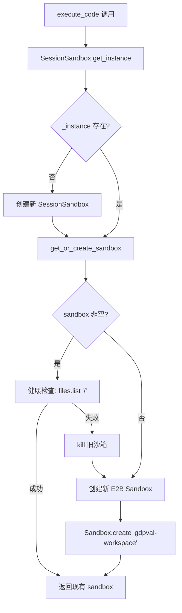
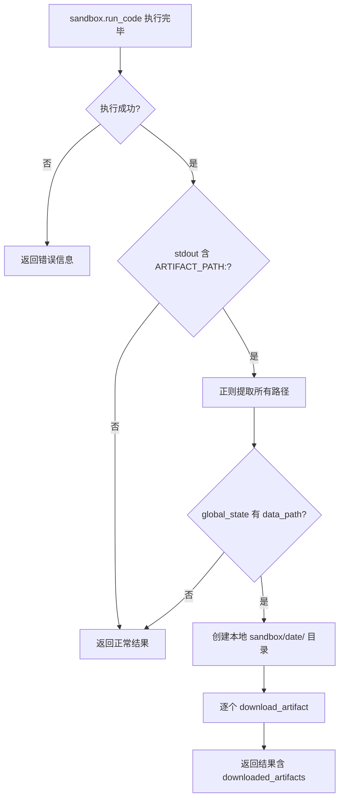
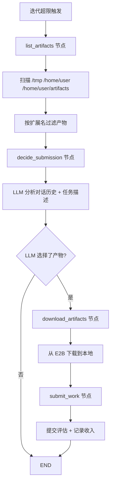

# PD-05.07 ClawWork — E2B 云沙箱单例管理与产物自动回收

> 文档编号：PD-05.07
> 来源：ClawWork `livebench/tools/productivity/code_execution_sandbox.py`
> GitHub：https://github.com/HKUDS/ClawWork.git
> 问题域：PD-05 沙箱隔离 Sandbox Isolation
> 状态：可复用方案

---

## 第 1 章 问题与动机

### 1.1 核心问题

Agent 执行用户任务时需要运行代码（生成 Excel、PDF、图表等），代码执行必须与宿主机完全隔离。ClawWork 面临的具体挑战：

1. **代码执行安全**：Agent 生成的 Python 代码可能包含危险操作（删除文件、网络攻击），必须在隔离环境中运行
2. **文件持久化**：同一任务的多次 `execute_code` 调用之间，文件需要持久存在（第一次创建的文件第二次能读到）
3. **产物回收**：代码在云沙箱中生成的文件（报告、图表）需要下载到宿主机才能提交评估
4. **参考文件注入**：任务附带的参考文件（PDF、Excel）需要上传到沙箱中供代码读取
5. **迭代超限兜底**：Agent 达到迭代上限但未完成任务时，需要自动扫描沙箱中的产物并提交

### 1.2 ClawWork 的解法概述

ClawWork 采用 **E2B 云沙箱 + 单例模式 + ARTIFACT_PATH 协议 + LangGraph WrapUp 工作流** 的四层方案：

1. **E2B 云 VM 隔离**：代码在 E2B 提供的独立 VM 中执行，与宿主机完全隔离（`code_execution_sandbox.py:77`）
2. **SessionSandbox 单例**：每个 Agent 会话共享一个沙箱实例，文件跨调用持久化（`code_execution_sandbox.py:23-41`）
3. **ARTIFACT_PATH 标记协议**：代码通过 `print("ARTIFACT_PATH:/path")` 声明产物，自动下载到宿主机（`code_execution_sandbox.py:252-271`）
4. **WrapUp 工作流**：迭代超限时，LangGraph 工作流自动扫描沙箱、LLM 选择产物、下载并提交（`wrapup_workflow.py:41-93`）
5. **双层沙箱**：E2B 云沙箱用于代码执行，本地沙箱目录用于产物存储和提交（`code_execution.py:59`）

### 1.3 设计思想

| 设计原则 | 具体实现 | 理由 | 替代方案 |
|----------|----------|------|----------|
| 云端隔离 | E2B Sandbox VM，代码不在宿主机执行 | 物理级隔离，无逃逸风险 | Docker 容器（需自建维护） |
| 会话级单例 | SessionSandbox._instance 类变量 | 同一任务多次调用共享文件系统 | 每次调用新建沙箱（文件丢失） |
| 协议驱动产物回收 | stdout 中的 ARTIFACT_PATH: 标记 | Agent 自主声明产物，无需预定义 | 固定输出目录扫描（不灵活） |
| 健康检查自愈 | get_or_create_sandbox 先 list("/") 探活 | 沙箱可能因超时被 E2B 回收 | 捕获执行异常再重建（延迟高） |
| 自定义模板 | gdpval-workspace 预装 20+ 包 | 避免运行时 pip install 浪费时间 | 基础镜像 + 动态安装（慢） |
| 兜底回收 | WrapUp LangGraph 工作流 | 迭代超限不浪费已生成的产物 | 直接丢弃（浪费计算资源） |

---

## 第 2 章 源码实现分析

### 2.1 架构概览

ClawWork 的沙箱系统由四个核心组件构成：

```
┌─────────────────────────────────────────────────────────────┐
│                    LiveAgent (live_agent.py)                  │
│  ┌──────────────┐  ┌──────────────┐  ┌───────────────────┐  │
│  │ _prepare_    │  │ run_daily_   │  │ WrapUp Workflow   │  │
│  │ reference_   │  │ session()    │  │ (LangGraph)       │  │
│  │ files()      │  │              │  │                   │  │
│  └──────┬───────┘  └──────┬───────┘  └────────┬──────────┘  │
│         │                 │                    │             │
│         ▼                 ▼                    ▼             │
│  ┌──────────────────────────────────────────────────────┐   │
│  │          SessionSandbox (单例)                        │   │
│  │  ┌─────────────┐ ┌──────────┐ ┌──────────────────┐  │   │
│  │  │ get_or_     │ │ upload_  │ │ download_        │  │   │
│  │  │ create_     │ │ reference│ │ artifact()       │  │   │
│  │  │ sandbox()   │ │ _file()  │ │                  │  │   │
│  │  └──────┬──────┘ └────┬─────┘ └────────┬─────────┘  │   │
│  └─────────┼─────────────┼────────────────┼─────────────┘   │
│            │             │                │                  │
└────────────┼─────────────┼────────────────┼──────────────────┘
             │             │                │
             ▼             ▼                ▼
    ┌────────────────────────────────────────────┐
    │         E2B Cloud Sandbox VM                │
    │  Template: gdpval-workspace                 │
    │  ┌──────────────────────────────────────┐  │
    │  │ /home/user/reference_files/  (上传)   │  │
    │  │ /tmp/                        (产物)   │  │
    │  │ /home/user/artifacts/        (产物)   │  │
    │  │ 预装: pandas, docx, reportlab...      │  │
    │  └──────────────────────────────────────┘  │
    │  Timeout: 3600s | API: E2B_API_KEY         │
    └────────────────────────────────────────────┘
```

### 2.2 核心实现

#### 2.2.1 SessionSandbox 单例与健康检查



对应源码 `livebench/tools/productivity/code_execution_sandbox.py:23-83`：

```python
class SessionSandbox:
    """
    Manages a persistent E2B sandbox for an agent session.
    This ensures files created in one execute_code call are accessible in subsequent calls.
    """
    _instance: Optional['SessionSandbox'] = None
    
    def __init__(self):
        self.sandbox: Optional[Sandbox] = None
        self.sandbox_id: Optional[str] = None
        self.uploaded_reference_files: Dict[str, str] = {}  # local_path -> remote_path
    
    @classmethod
    def get_instance(cls) -> 'SessionSandbox':
        if cls._instance is None:
            cls._instance = cls()
        return cls._instance
    
    def get_or_create_sandbox(self, timeout: int = 3600) -> Sandbox:
        # Health check existing sandbox
        if self.sandbox is not None:
            try:
                self.sandbox.files.list("/")
                return self.sandbox  # Sandbox is healthy
            except Exception as e:
                print(f"⚠️ Sandbox {self.sandbox_id} died ({e}), recreating...")
                try:
                    self.sandbox.kill()
                except:
                    pass
                self.sandbox = None
                self.sandbox_id = None
                self.uploaded_reference_files = {}
        
        if self.sandbox is None:
            self.sandbox = Sandbox.create("gdpval-workspace", timeout=timeout)
            self.sandbox_id = getattr(self.sandbox, "id", None)
        return self.sandbox
```

#### 2.2.2 ARTIFACT_PATH 协议与自动下载



对应源码 `livebench/tools/productivity/code_execution_sandbox.py:250-296`：

```python
# Parse ARTIFACT_PATH markers and download files
downloaded_artifacts = []
if success and "ARTIFACT_PATH:" in stdout_str:
    artifact_paths = re.findall(r'ARTIFACT_PATH:(\S+)', stdout_str)
    
    if artifact_paths and global_state.get("data_path"):
        current_date = global_state.get("current_date", "unknown")
        sandbox_dir = os.path.join(
            global_state["data_path"], 
            "sandbox", 
            current_date
        )
        os.makedirs(sandbox_dir, exist_ok=True)
        
        for remote_path in artifact_paths:
            try:
                local_path = session_sandbox.download_artifact(remote_path, sandbox_dir)
                downloaded_artifacts.append(local_path)
            except Exception as e:
                print(f"⚠️ Warning: Could not download {remote_path}: {e}")
```

#### 2.2.3 WrapUp 工作流：迭代超限产物回收



对应源码 `livebench/agent/wrapup_workflow.py:64-93`：

```python
def _build_graph(self) -> StateGraph:
    workflow = StateGraph(WrapUpState)
    
    workflow.add_node("list_artifacts", self._list_artifacts_node)
    workflow.add_node("decide_submission", self._decide_submission_node)
    workflow.add_node("download_artifacts", self._download_artifacts_node)
    workflow.add_node("submit_work", self._submit_work_node)
    
    workflow.set_entry_point("list_artifacts")
    workflow.add_edge("list_artifacts", "decide_submission")
    workflow.add_conditional_edges(
        "decide_submission",
        self._should_download,
        {"download": "download_artifacts", "end": END}
    )
    workflow.add_edge("download_artifacts", "submit_work")
    workflow.add_edge("submit_work", END)
    
    return workflow.compile()
```

### 2.3 实现细节

**双层清理机制**（`live_agent.py:836-881`）：

- **任务级清理**：每个任务完成后调用 `SessionSandbox.cleanup()` 杀死沙箱，防止沙箱累积
- **会话级清理**：整个 daily session 结束后调用 `cleanup_session_sandbox()` 重置单例

**参考文件双写**（`live_agent.py:242-318`）：

- 先 `shutil.copy2` 到宿主机 `sandbox/date/reference_files/` 目录
- 再 `upload_task_reference_files` 上传到 E2B 沙箱 `/home/user/reference_files/`
- 两份副本确保本地工具和沙箱代码都能访问

**本地沙箱降级**（`code_execution.py:17-147`）：

- 当 E2B 不可用时，使用本地 subprocess 执行，30s 超时
- `_safe_open` 函数重写 `open()`，限制文件访问在 sandbox_dir 内
- 通过 `os.path.abspath` + `startswith` 检查路径前缀

**自定义模板预装**（`scripts/build_e2b_template.py:50-85`）：

- 基于 220 个 GDPVal 任务分析，预装 20+ Python 包
- 覆盖文档（python-docx, reportlab）、数据（pandas, openpyxl）、可视化（matplotlib, plotly）
- 避免运行时 `pip install` 浪费 Agent 的执行时间和 token

**产物扫描白名单**（`wrapup_workflow.py:117-118`）：

```python
artifact_extensions = ['.txt', '.docx', '.xlsx', '.csv', '.pdf', 
                      '.png', '.jpg', '.jpeg', '.json', '.md', '.pptx']
```

扫描三个目录：`/tmp`、`/home/user`、`/home/user/artifacts`，按扩展名过滤，跳过目录和隐藏文件。


---

## 第 3 章 迁移指南

### 3.1 迁移清单

**阶段 1：基础沙箱（1-2 天）**

- [ ] 注册 E2B 账号，获取 API Key
- [ ] 安装 `e2b-code-interpreter` 包
- [ ] 实现 SessionSandbox 单例类（直接复用 ClawWork 的实现）
- [ ] 实现 `execute_code` 工具函数，注册为 LangChain Tool

**阶段 2：产物管理（1 天）**

- [ ] 实现 ARTIFACT_PATH 协议解析（正则提取 stdout 中的路径）
- [ ] 实现 `download_artifact` 二进制安全下载（注意 `format="bytes"`）
- [ ] 实现 `upload_reference_file` 参考文件上传
- [ ] 配置本地产物存储目录结构 `data_path/sandbox/date/`

**阶段 3：生命周期管理（0.5 天）**

- [ ] 在任务结束时调用 `cleanup()`
- [ ] 在会话结束时调用 `reset()`
- [ ] 添加健康检查逻辑（`files.list("/")` 探活）

**阶段 4：自定义模板（可选）**

- [ ] 分析任务常用包，创建 Dockerfile
- [ ] 用 E2B CLI 构建自定义模板
- [ ] 在 `Sandbox.create` 中使用自定义模板别名

### 3.2 适配代码模板

以下代码可直接复用，实现 E2B 沙箱的核心功能：

```python
"""可复用的 E2B 沙箱管理器 — 从 ClawWork 提取"""

from typing import Optional, Dict, List
from e2b_code_interpreter import Sandbox
import os
import re


class SandboxManager:
    """
    E2B 沙箱单例管理器。
    
    用法:
        manager = SandboxManager.get_instance()
        sandbox = manager.get_or_create(timeout=3600)
        result = sandbox.run_code("print('hello')")
        manager.cleanup()
    """
    _instance: Optional['SandboxManager'] = None
    
    def __init__(self, template: str = "base"):
        self.sandbox: Optional[Sandbox] = None
        self.sandbox_id: Optional[str] = None
        self.template = template
        self._uploaded: Dict[str, str] = {}
    
    @classmethod
    def get_instance(cls, template: str = "base") -> 'SandboxManager':
        if cls._instance is None:
            cls._instance = cls(template=template)
        return cls._instance
    
    @classmethod
    def reset(cls):
        if cls._instance and cls._instance.sandbox:
            try:
                cls._instance.sandbox.kill()
            except Exception:
                pass
        cls._instance = None
    
    def get_or_create(self, timeout: int = 3600) -> Sandbox:
        """获取或创建沙箱，含健康检查"""
        if self.sandbox is not None:
            try:
                self.sandbox.files.list("/")
                return self.sandbox
            except Exception:
                try:
                    self.sandbox.kill()
                except Exception:
                    pass
                self.sandbox = None
                self._uploaded = {}
        
        self.sandbox = Sandbox.create(self.template, timeout=timeout)
        self.sandbox_id = getattr(self.sandbox, "id", None)
        return self.sandbox
    
    def upload(self, local_path: str, remote_dir: str = "/home/user/files") -> str:
        """上传文件到沙箱，自动去重"""
        if local_path in self._uploaded:
            return self._uploaded[local_path]
        
        sandbox = self.get_or_create()
        with open(local_path, 'rb') as f:
            content = f.read()
        
        remote_path = f"{remote_dir}/{os.path.basename(local_path)}"
        sandbox.files.write(remote_path, content)
        self._uploaded[local_path] = remote_path
        return remote_path
    
    def download(self, remote_path: str, local_dir: str) -> str:
        """从沙箱下载文件（二进制安全）"""
        if not self.sandbox:
            raise RuntimeError("No active sandbox")
        
        content = self.sandbox.files.read(remote_path, format="bytes")
        os.makedirs(local_dir, exist_ok=True)
        local_path = os.path.join(local_dir, os.path.basename(remote_path))
        with open(local_path, 'wb') as f:
            f.write(content)
        return local_path
    
    def execute_and_collect(self, code: str, output_dir: str) -> Dict:
        """执行代码并自动收集 ARTIFACT_PATH 标记的产物"""
        sandbox = self.get_or_create()
        execution = sandbox.run_code(code)
        
        logs = getattr(execution, "logs", "")
        error = getattr(execution, "error", None)
        stdout_str = '\n'.join(logs.stdout) if hasattr(logs, 'stdout') and isinstance(logs.stdout, list) else str(logs)
        
        artifacts = []
        if error is None and "ARTIFACT_PATH:" in stdout_str:
            paths = re.findall(r'ARTIFACT_PATH:(\S+)', stdout_str)
            for p in paths:
                try:
                    local = self.download(p, output_dir)
                    artifacts.append(local)
                except Exception:
                    pass
        
        return {
            "success": error is None,
            "stdout": stdout_str,
            "error": str(error) if error else None,
            "artifacts": artifacts,
        }
    
    def cleanup(self):
        if self.sandbox:
            try:
                self.sandbox.kill()
            except Exception:
                pass
            self.sandbox = None
            self.sandbox_id = None
            self._uploaded = {}
```

### 3.3 适用场景

| 场景 | 适用度 | 说明 |
|------|--------|------|
| Agent 生成文档/报表 | ⭐⭐⭐ | 核心场景，E2B 预装 docx/xlsx/pdf 库 |
| 数据分析任务 | ⭐⭐⭐ | pandas + matplotlib 在沙箱中运行 |
| 代码评测/竞赛 | ⭐⭐⭐ | 完全隔离，防止恶意代码 |
| 长时间计算任务 | ⭐⭐ | E2B 有 3600s 上限，超长任务需分段 |
| 需要 GPU 的任务 | ⭐ | E2B 标准沙箱无 GPU，需特殊模板 |
| 低延迟场景 | ⭐ | 沙箱创建有冷启动延迟（~2-5s） |

---

## 第 4 章 测试用例

```python
"""基于 ClawWork SessionSandbox 真实接口的测试用例"""

import pytest
from unittest.mock import MagicMock, patch, PropertyMock
from typing import Dict, Any


class MockExecution:
    """模拟 E2B 执行结果"""
    def __init__(self, stdout: list, error=None):
        self.logs = MagicMock()
        self.logs.stdout = stdout
        self.error = error


class MockSandbox:
    """模拟 E2B Sandbox"""
    def __init__(self, sandbox_id="test-sandbox-123"):
        self.id = sandbox_id
        self.files = MagicMock()
        self.files.list = MagicMock(return_value=[])
        self.files.read = MagicMock(return_value=b"file content")
        self.files.write = MagicMock()
        self._killed = False
    
    def run_code(self, code: str):
        return MockExecution(stdout=["Hello from sandbox!"])
    
    def kill(self):
        self._killed = True


class TestSessionSandboxSingleton:
    """测试单例模式"""
    
    def test_singleton_returns_same_instance(self):
        from livebench.tools.productivity.code_execution_sandbox import SessionSandbox
        SessionSandbox.reset()
        
        a = SessionSandbox.get_instance()
        b = SessionSandbox.get_instance()
        assert a is b
    
    def test_reset_clears_instance(self):
        from livebench.tools.productivity.code_execution_sandbox import SessionSandbox
        SessionSandbox.reset()
        
        a = SessionSandbox.get_instance()
        SessionSandbox.reset()
        b = SessionSandbox.get_instance()
        assert a is not b


class TestHealthCheck:
    """测试沙箱健康检查与自愈"""
    
    @patch('livebench.tools.productivity.code_execution_sandbox.Sandbox')
    def test_healthy_sandbox_reused(self, MockSandboxClass):
        from livebench.tools.productivity.code_execution_sandbox import SessionSandbox
        SessionSandbox.reset()
        
        mock_sb = MockSandbox()
        instance = SessionSandbox.get_instance()
        instance.sandbox = mock_sb
        instance.sandbox_id = "test-123"
        
        result = instance.get_or_create_sandbox()
        assert result is mock_sb
        mock_sb.files.list.assert_called_once_with("/")
    
    @patch('livebench.tools.productivity.code_execution_sandbox.Sandbox')
    def test_dead_sandbox_recreated(self, MockSandboxClass):
        from livebench.tools.productivity.code_execution_sandbox import SessionSandbox
        SessionSandbox.reset()
        
        dead_sb = MockSandbox()
        dead_sb.files.list.side_effect = Exception("sandbox died")
        
        new_sb = MockSandbox(sandbox_id="new-sandbox-456")
        MockSandboxClass.create.return_value = new_sb
        
        instance = SessionSandbox.get_instance()
        instance.sandbox = dead_sb
        instance.sandbox_id = "old-123"
        
        result = instance.get_or_create_sandbox()
        assert result is new_sb
        assert dead_sb._killed


class TestArtifactProtocol:
    """测试 ARTIFACT_PATH 协议"""
    
    def test_artifact_path_regex(self):
        import re
        stdout = 'Processing...\nARTIFACT_PATH:/tmp/report.pdf\nDone!\nARTIFACT_PATH:/tmp/chart.png'
        paths = re.findall(r'ARTIFACT_PATH:(\S+)', stdout)
        assert paths == ['/tmp/report.pdf', '/tmp/chart.png']
    
    def test_no_artifact_path(self):
        import re
        stdout = 'Hello world\nNo artifacts here'
        paths = re.findall(r'ARTIFACT_PATH:(\S+)', stdout)
        assert paths == []


class TestDownloadArtifact:
    """测试产物下载"""
    
    def test_download_binary_safe(self, tmp_path):
        from livebench.tools.productivity.code_execution_sandbox import SessionSandbox
        SessionSandbox.reset()
        
        instance = SessionSandbox.get_instance()
        instance.sandbox = MockSandbox()
        instance.sandbox.files.read.return_value = b'\x89PNG\r\n\x1a\n'  # PNG header
        
        local = instance.download_artifact("/tmp/image.png", str(tmp_path))
        assert local.endswith("image.png")
        
        with open(local, 'rb') as f:
            assert f.read() == b'\x89PNG\r\n\x1a\n'
    
    def test_download_no_sandbox_raises(self):
        from livebench.tools.productivity.code_execution_sandbox import SessionSandbox
        SessionSandbox.reset()
        
        instance = SessionSandbox.get_instance()
        with pytest.raises(RuntimeError, match="No active sandbox"):
            instance.download_artifact("/tmp/file.txt", "/tmp/output")


class TestUploadDedup:
    """测试上传去重"""
    
    def test_upload_same_file_twice_only_uploads_once(self, tmp_path):
        from livebench.tools.productivity.code_execution_sandbox import SessionSandbox
        SessionSandbox.reset()
        
        test_file = tmp_path / "data.csv"
        test_file.write_text("a,b,c\n1,2,3")
        
        instance = SessionSandbox.get_instance()
        instance.sandbox = MockSandbox()
        
        path1 = instance.upload_reference_file(str(test_file))
        path2 = instance.upload_reference_file(str(test_file))
        
        assert path1 == path2
        # files.write should only be called once
        assert instance.sandbox.files.write.call_count == 1
```


---

## 第 5 章 跨域关联

| 关联域 | 关系类型 | 说明 |
|--------|----------|------|
| PD-02 多 Agent 编排 | 协同 | WrapUp 工作流是 LangGraph 编排的子图，迭代超限时由主 Agent 触发 |
| PD-03 容错与重试 | 协同 | 沙箱健康检查 + 自动重建是容错的一部分；E2B 创建失败抛 RuntimeError 由上层重试 |
| PD-04 工具系统 | 依赖 | execute_code 注册为 LangChain @tool，通过 direct_tools.get_all_tools() 暴露给 Agent |
| PD-06 记忆持久化 | 协同 | 参考文件上传到沙箱是"记忆注入"的一种形式；uploaded_reference_files 字典跟踪已上传文件 |
| PD-07 质量检查 | 协同 | WrapUp 工作流中 LLM 选择产物是质量判断；submit_work 触发 evaluator.evaluate_artifact 评估 |
| PD-11 可观测性 | 协同 | WrapUp 工作流集成 economic_tracker 追踪 token 成本；sandbox_id 记录在执行结果中 |

---

## 第 6 章 来源文件索引

| 文件 | 行范围 | 关键实现 |
|------|--------|----------|
| `livebench/tools/productivity/code_execution_sandbox.py` | L23-L83 | SessionSandbox 单例类、健康检查、get_or_create_sandbox |
| `livebench/tools/productivity/code_execution_sandbox.py` | L85-L129 | upload_reference_file 上传去重 |
| `livebench/tools/productivity/code_execution_sandbox.py` | L131-L162 | download_artifact 二进制安全下载 |
| `livebench/tools/productivity/code_execution_sandbox.py` | L177-L303 | execute_code 工具函数、ARTIFACT_PATH 协议解析 |
| `livebench/tools/productivity/code_execution_sandbox.py` | L306-L356 | upload_task_reference_files 批量上传、cleanup_session_sandbox |
| `livebench/tools/productivity/code_execution.py` | L17-L147 | 本地沙箱降级方案、_safe_open 路径限制 |
| `livebench/agent/wrapup_workflow.py` | L26-L39 | WrapUpState TypedDict 状态定义 |
| `livebench/agent/wrapup_workflow.py` | L41-L93 | WrapUpWorkflow LangGraph 图构建 |
| `livebench/agent/wrapup_workflow.py` | L101-L179 | _list_artifacts_node 沙箱产物扫描 |
| `livebench/agent/wrapup_workflow.py` | L181-L272 | _decide_submission_node LLM 产物选择 |
| `livebench/agent/live_agent.py` | L242-L318 | _prepare_reference_files 双写（宿主机 + E2B） |
| `livebench/agent/live_agent.py` | L836-L881 | 双层清理：任务级 cleanup + 会话级 reset |
| `livebench/tools/direct_tools.py` | L80-L295 | submit_work 产物提交与评估 |
| `scripts/build_e2b_template.py` | L43-L85 | 自定义模板包列表（20+ 包） |
| `clawmode_integration/artifact_tools.py` | L26-L174 | CreateArtifactTool 本地产物创建 |

---

## 第 7 章 横向对比维度

> **重要：** 本章用于自动填充 Butcher Wiki 的横向对比表。

```json comparison_data
{
  "project": "ClawWork",
  "dimensions": {
    "隔离级别": "E2B 云 VM 级隔离，代码在独立虚拟机执行",
    "虚拟路径": "无虚拟路径翻译，Agent 直接使用沙箱内真实路径",
    "生命周期管理": "SessionSandbox 单例 + 任务级 cleanup + 会话级 reset 双层清理",
    "防御性设计": "健康检查探活 files.list('/') + 死沙箱自动重建",
    "代码修复": "无自动代码修复，执行失败返回错误由 Agent 自行重试",
    "Scope 粒度": "会话级单例，同一任务多次调用共享文件系统",
    "文件追踪": "ARTIFACT_PATH: stdout 标记协议 + 扩展名白名单扫描",
    "资源池化": "无池化，按需创建单个沙箱，3600s 超时自动回收",
    "上下文持久化": "沙箱内文件跨调用持久，uploaded_reference_files 字典跟踪",
    "产物回收机制": "WrapUp LangGraph 工作流：扫描→LLM选择→下载→提交",
    "自定义模板": "gdpval-workspace 预装 20+ 包，基于 220 任务分析定制"
  }
}
```

### 域元数据补充

```json domain_metadata
{
  "solution_summary": "ClawWork 用 E2B 云 VM 单例沙箱 + ARTIFACT_PATH stdout 协议 + LangGraph WrapUp 工作流实现代码隔离执行与产物自动回收",
  "description": "云沙箱的产物回收与迭代超限兜底是沙箱隔离的重要补充维度",
  "sub_problems": [
    "产物回收：沙箱中生成的文件需要下载到宿主机才能提交评估",
    "迭代超限兜底：Agent 达到步数上限时自动扫描并提交已有产物",
    "参考文件双写：任务附件需同时存在于宿主机和沙箱中",
    "二进制文件安全：下载 PNG/DOCX 等二进制文件需用 bytes 模式防止损坏",
    "自定义模板预热：高频依赖包预装到镜像避免运行时安装延迟"
  ],
  "best_practices": [
    "ARTIFACT_PATH stdout 协议让 Agent 自主声明产物，比固定目录扫描更灵活",
    "健康检查用 files.list('/') 探活比捕获执行异常更快发现死沙箱",
    "二进制文件下载必须用 format='bytes'，text 模式会损坏 PNG/DOCX",
    "迭代超限时用 LLM 分析对话历史选择产物，比全量提交更精准"
  ]
}
```

