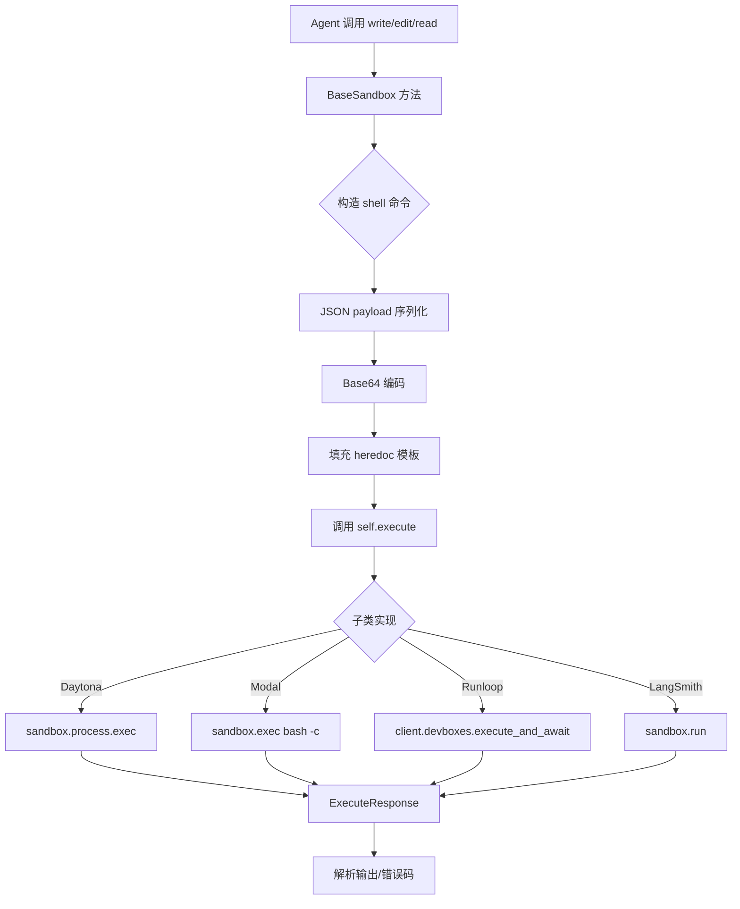
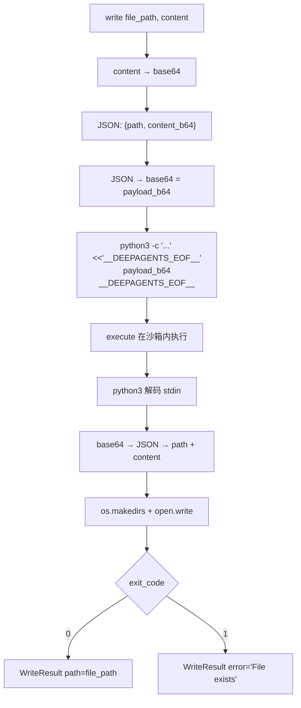
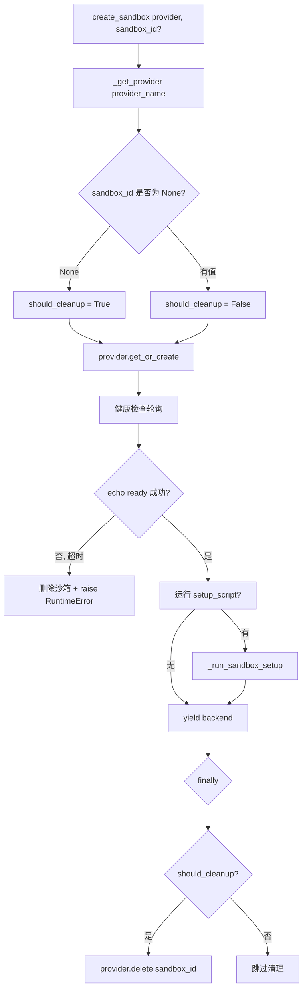

# PD-05.18 DeepAgents — 多提供商沙箱协议抽象

> 文档编号：PD-05.18
> 来源：DeepAgents `libs/deepagents/deepagents/backends/sandbox.py`
> GitHub：https://github.com/langchain-ai/deepagents.git
> 问题域：PD-05 沙箱隔离 Sandbox Isolation
> 状态：可复用方案

---

## 第 1 章 问题与动机（≥ 30 行）

### 1.1 核心问题

Agent 系统需要在远程沙箱中执行用户代码和文件操作，但不同云提供商（Daytona、LangSmith、Modal、Runloop）的 SDK API 各不相同。如果每个 Agent 工具直接耦合某个提供商的 SDK，切换提供商就意味着重写所有工具代码。更深层的问题是：

1. **提供商锁定**：Agent 框架绑定单一沙箱提供商，用户无法按成本/延迟/功能选择最优方案
2. **文件操作安全**：在远程沙箱中执行 read/write/edit/grep 等操作时，需要防止 shell 注入和 ARG_MAX 溢出
3. **生命周期管理**：沙箱的创建、健康检查、清理需要统一的 context manager 模式，避免资源泄漏
4. **大文件传输**：base64 编码后的文件内容可能超过 shell 参数长度限制（ARG_MAX ~100KB），需要 heredoc 绕过

### 1.2 DeepAgents 的解法概述

DeepAgents 采用三层协议抽象实现多提供商沙箱隔离：

1. **BackendProtocol（抽象基类）**：定义 `ls_info/read/write/edit/grep_raw/glob_info/upload_files/download_files` 八个文件操作接口，所有后端必须实现（`libs/deepagents/deepagents/backends/protocol.py:167`）
2. **SandboxBackendProtocol（扩展协议）**：在 BackendProtocol 基础上增加 `execute()` 命令执行和 `id` 属性，专为隔离环境设计（`libs/deepagents/deepagents/backends/protocol.py:437`）
3. **BaseSandbox（模板方法基类）**：实现所有文件操作为 shell 命令模板，子类只需实现 `execute()` 一个方法（`libs/deepagents/deepagents/backends/sandbox.py:204`）
4. **SandboxProvider（生命周期接口）**：`get_or_create()` + `delete()` 管理沙箱创建和销毁（`libs/cli/deepagents_cli/integrations/sandbox_provider.py:26`）
5. **sandbox_factory（统一入口）**：`create_sandbox()` context manager 封装完整生命周期，含 setup script 执行和自动清理（`libs/cli/deepagents_cli/integrations/sandbox_factory.py:67`）

### 1.3 设计思想

| 设计原则 | 具体实现 | 理由 | 替代方案 |
|----------|----------|------|----------|
| 单方法抽象 | BaseSandbox 子类只需实现 `execute()` | 最小化适配成本，新提供商只写 ~30 行代码 | 每个操作都要适配（如 DeerFlow 的 AbstractSandbox） |
| Heredoc 传输 | write/edit/read 用 `<<'__DEEPAGENTS_EOF__'` 传数据 | 绕过 ARG_MAX 限制，支持 >100KB 文件 | base64 内联到命令参数（会溢出） |
| Base64 双重编码 | 文件内容先 base64 再 JSON 再 base64 | 防止特殊字符破坏 shell/heredoc 边界 | 单层 base64（JSON 中的引号可能逃逸） |
| Provider/Backend 分离 | Provider 管生命周期，Backend 管操作 | 关注点分离，Provider 可独立测试 | 单一类同时管理生命周期和操作 |
| Context Manager 清理 | `create_sandbox()` 用 `@contextmanager` + finally | 确保异常时也能清理沙箱，防止资源泄漏 | 手动 try/finally（容易遗漏） |
| 条件清理 | `should_cleanup = sandbox_id is None` | 只清理自己创建的沙箱，复用的不删 | 总是清理（会误删共享沙箱） |

---

## 第 2 章 源码实现分析（≥ 60 行，核心章节）

### 2.1 架构概览

DeepAgents 的沙箱系统分为三个层次：协议层定义接口、基类层实现模板方法、提供商层适配具体 SDK。

```
┌─────────────────────────────────────────────────────────────┐
│                    Agent Tools Layer                         │
│  (read, write, edit, grep, glob, execute, upload, download) │
└──────────────────────────┬──────────────────────────────────┘
                           │ 调用
┌──────────────────────────▼──────────────────────────────────┐
│              SandboxBackendProtocol                          │
│  ┌─────────────────────────────────────────────────────┐    │
│  │ BackendProtocol (8 个文件操作接口)                    │    │
│  │ + execute(command, timeout) → ExecuteResponse        │    │
│  │ + id: str                                            │    │
│  └─────────────────────────────────────────────────────┘    │
└──────────────────────────┬──────────────────────────────────┘
                           │ 继承
┌──────────────────────────▼──────────────────────────────────┐
│              BaseSandbox (模板方法)                           │
│  ls_info() → execute(python3 -c "os.scandir...")            │
│  read()    → execute(python3 -c "open().readlines()...")    │
│  write()   → execute(python3 -c "..." <<HEREDOC)            │
│  edit()    → execute(python3 -c "..." <<HEREDOC)            │
│  grep_raw()→ execute(grep -rHnF ...)                        │
│  glob_info()→execute(python3 -c "glob.glob...")             │
│  ┌──────────────────────────────────────────────────────┐   │
│  │ abstract: execute(), id, upload_files, download_files │   │
│  └──────────────────────────────────────────────────────┘   │
└──────────────────────────┬──────────────────────────────────┘
                           │ 实现
┌──────────┬───────────┬───────────┬──────────────────────────┐
│ Daytona  │ LangSmith │   Modal   │        Runloop           │
│ Backend  │  Backend  │  Backend  │        Backend           │
│ execute: │ execute:  │ execute:  │ execute:                 │
│ sandbox  │ sandbox   │ sandbox   │ client.devboxes          │
│ .process │ .run()    │ .exec()   │ .execute_and_await       │
│ .exec()  │           │           │ _completion()            │
└──────────┴───────────┴───────────┴──────────────────────────┘
                           │
┌──────────────────────────▼──────────────────────────────────┐
│              SandboxProvider (生命周期)                       │
│  get_or_create(sandbox_id?) → SandboxBackendProtocol        │
│  delete(sandbox_id)                                         │
│  ┌──────────┬───────────┬───────────┬──────────┐            │
│  │ Daytona  │ LangSmith │   Modal   │ Runloop  │            │
│  │ Provider │ Provider  │ Provider  │ Provider │            │
│  └──────────┴───────────┴───────────┴──────────┘            │
└─────────────────────────────────────────────────────────────┘
```

### 2.2 核心实现

#### 2.2.1 BaseSandbox 模板方法模式

BaseSandbox 是整个系统的核心创新：它将所有文件操作转化为 shell 命令，子类只需实现 `execute()` 一个抽象方法。



对应源码 `libs/deepagents/deepagents/backends/sandbox.py:204-229`：

```python
class BaseSandbox(SandboxBackendProtocol, ABC):
    """Base sandbox implementation with execute() as abstract method.

    This class provides default implementations for all protocol methods
    using shell commands. Subclasses only need to implement execute().
    """

    @abstractmethod
    def execute(
        self,
        command: str,
        *,
        timeout: int | None = None,
    ) -> ExecuteResponse:
        """Execute a command in the sandbox and return ExecuteResponse."""

    def read(self, file_path: str, offset: int = 0, limit: int = 2000) -> str:
        payload = json.dumps({"path": file_path, "offset": int(offset), "limit": int(limit)})
        payload_b64 = base64.b64encode(payload.encode("utf-8")).decode("ascii")
        cmd = _READ_COMMAND_TEMPLATE.format(payload_b64=payload_b64)
        result = self.execute(cmd)
        # ... 解析输出
```

#### 2.2.2 Heredoc 大文件传输

write 和 edit 操作使用 heredoc 绕过 ARG_MAX 限制，这是 DeepAgents 区别于其他项目的关键设计。



对应源码 `libs/deepagents/deepagents/backends/sandbox.py:57-91`（write 模板）：

```python
_WRITE_COMMAND_TEMPLATE = """python3 -c "
import os, sys, base64, json

# Read JSON payload from stdin containing file_path and content (both base64-encoded)
payload_b64 = sys.stdin.read().strip()
if not payload_b64:
    print('Error: No payload received for write operation', file=sys.stderr)
    sys.exit(1)

try:
    payload = base64.b64decode(payload_b64).decode('utf-8')
    data = json.loads(payload)
    file_path = data['path']
    content = base64.b64decode(data['content']).decode('utf-8')
except Exception as e:
    print(f'Error: Failed to decode write payload: {e}', file=sys.stderr)
    sys.exit(1)

# Check if file already exists (atomic with write)
if os.path.exists(file_path):
    print(f'Error: File \\'{file_path}\\' already exists', file=sys.stderr)
    sys.exit(1)

# Create parent directory if needed
parent_dir = os.path.dirname(file_path) or '.'
os.makedirs(parent_dir, exist_ok=True)

with open(file_path, 'w') as f:
    f.write(content)
" <<'__DEEPAGENTS_EOF__'
{payload_b64}
__DEEPAGENTS_EOF__"""
```

#### 2.2.3 Provider 生命周期管理



对应源码 `libs/cli/deepagents_cli/integrations/sandbox_factory.py:67-124`：

```python
@contextmanager
def create_sandbox(
    provider: str,
    *,
    sandbox_id: str | None = None,
    setup_script_path: str | None = None,
) -> Generator[SandboxBackendProtocol, None, None]:
    provider_obj = _get_provider(provider)
    should_cleanup = sandbox_id is None  # 只清理自己创建的

    backend = provider_obj.get_or_create(sandbox_id=sandbox_id)

    if setup_script_path:
        _run_sandbox_setup(backend, setup_script_path)

    try:
        yield backend
    finally:
        if should_cleanup:
            try:
                provider_obj.delete(sandbox_id=backend.id)
            except Exception as e:
                console.print(f"[yellow]Cleanup failed: {e}[/yellow]")
```

### 2.3 实现细节

**环境变量展开**：setup script 支持 `${VAR}` 语法，在宿主机侧用 `string.Template.safe_substitute(os.environ)` 展开后再发送到沙箱执行（`sandbox_factory.py:44`）。这意味着敏感变量（API key 等）在宿主机解析，不需要在沙箱内设置环境变量。

**提供商工作目录映射**：每个提供商有固定的默认工作目录（`sandbox_factory.py:59-64`）：
- Daytona: `/home/daytona`
- LangSmith: `/tmp`
- Modal: `/workspace`
- Runloop: `/home/user`

**timeout 兼容性检测**：`execute_accepts_timeout()` 用 `inspect.signature` + `lru_cache` 检测旧版 Backend 是否支持 timeout 参数（`protocol.py:494-513`），避免向不兼容的后端传递未知参数。

**Edit 操作的退出码语义**：edit 命令用不同退出码表示不同错误（`sandbox.py:339-344`）：
- 1: 字符串未找到
- 2: 多处匹配但未指定 replace_all
- 3: 文件不存在
- 4: payload 解码失败

**LangSmith 模板自动创建**：LangSmithProvider 在创建沙箱前会检查模板是否存在，不存在则自动创建（`langsmith.py:257-283`），默认使用 `python:3` 镜像。


---

## 第 3 章 迁移指南（≥ 40 行）

### 3.1 迁移清单

**阶段 1：协议层（1 天）**
- [ ] 复制 `BackendProtocol` 和 `SandboxBackendProtocol` 接口定义
- [ ] 复制 `ExecuteResponse`、`FileInfo`、`GrepMatch`、`WriteResult`、`EditResult` 数据类
- [ ] 复制 `FileOperationError` 类型定义

**阶段 2：BaseSandbox 模板（1 天）**
- [ ] 复制 `BaseSandbox` 类及其 6 个命令模板（`_GLOB_COMMAND_TEMPLATE` 等）
- [ ] 验证 heredoc 分隔符 `__DEEPAGENTS_EOF__` 不与业务内容冲突
- [ ] 确认目标沙箱环境有 `python3`、`grep`、`base64` 可用

**阶段 3：Provider 适配（每个提供商 0.5 天）**
- [ ] 为每个目标提供商实现 `execute()` 方法（~30 行）
- [ ] 为每个目标提供商实现 `upload_files()` 和 `download_files()`
- [ ] 实现 `SandboxProvider` 的 `get_or_create()` 和 `delete()`

**阶段 4：Factory 集成（0.5 天）**
- [ ] 实现 `create_sandbox()` context manager
- [ ] 配置提供商名称到工作目录的映射
- [ ] 实现 setup script 的环境变量展开

### 3.2 适配代码模板

以下是为新提供商（如 AWS CodeBuild）适配 BaseSandbox 的最小实现：

```python
"""AWS CodeBuild sandbox backend — 适配 DeepAgents BaseSandbox 模式."""
from __future__ import annotations
import boto3
from deepagents.backends.protocol import (
    ExecuteResponse, FileDownloadResponse, FileUploadResponse,
)
from deepagents.backends.sandbox import BaseSandbox

class CodeBuildBackend(BaseSandbox):
    """只需实现 execute() + id + upload/download."""

    def __init__(self, build_id: str, session: boto3.Session | None = None) -> None:
        self._session = session or boto3.Session()
        self._client = self._session.client("codebuild")
        self._build_id = build_id
        self._default_timeout = 30 * 60

    @property
    def id(self) -> str:
        return self._build_id

    def execute(self, command: str, *, timeout: int | None = None) -> ExecuteResponse:
        effective_timeout = timeout if timeout is not None else self._default_timeout
        # 通过 SSM Run Command 在 CodeBuild 容器内执行
        result = self._client.batch_get_builds(ids=[self._build_id])
        # ... 实际实现取决于 CodeBuild API
        return ExecuteResponse(output="", exit_code=0, truncated=False)

    def upload_files(self, files: list[tuple[str, bytes]]) -> list[FileUploadResponse]:
        # 通过 S3 中转上传
        responses = []
        for path, content in files:
            # self._s3.put_object(Bucket=..., Key=path, Body=content)
            responses.append(FileUploadResponse(path=path, error=None))
        return responses

    def download_files(self, paths: list[str]) -> list[FileDownloadResponse]:
        responses = []
        for path in paths:
            # content = self._s3.get_object(...)['Body'].read()
            responses.append(FileDownloadResponse(path=path, content=b"", error=None))
        return responses
```

### 3.3 适用场景

| 场景 | 适用度 | 说明 |
|------|--------|------|
| 多云沙箱切换 | ⭐⭐⭐ | 核心场景：同一 Agent 代码在 Daytona/Modal/Runloop 间无缝切换 |
| Agent 框架开发 | ⭐⭐⭐ | 提供标准化的沙箱接口，降低工具开发者的适配成本 |
| 大文件操作 | ⭐⭐⭐ | Heredoc 传输解决 ARG_MAX 限制，支持 >100KB 文件 |
| 本地开发测试 | ⭐⭐ | 可以实现 LocalBackend 用于开发，但 BaseSandbox 假设有 shell 环境 |
| 高安全场景 | ⭐ | 协议层不含安全策略（无命令黑名单、无路径白名单），需额外实现 |

---

## 第 4 章 测试用例（≥ 20 行）

```python
"""Tests for DeepAgents sandbox protocol abstraction."""
import base64
import json
import pytest
from unittest.mock import MagicMock
from deepagents.backends.protocol import ExecuteResponse, WriteResult, EditResult
from deepagents.backends.sandbox import BaseSandbox


class FakeSandbox(BaseSandbox):
    """测试用 BaseSandbox 实现，记录所有 execute 调用."""

    def __init__(self):
        self._calls: list[str] = []
        self._responses: dict[str, ExecuteResponse] = {}

    @property
    def id(self) -> str:
        return "fake-sandbox-001"

    def execute(self, command: str, *, timeout: int | None = None) -> ExecuteResponse:
        self._calls.append(command)
        # 默认返回成功
        for pattern, resp in self._responses.items():
            if pattern in command:
                return resp
        return ExecuteResponse(output="", exit_code=0)

    def upload_files(self, files):
        return []

    def download_files(self, paths):
        return []

    def set_response(self, pattern: str, resp: ExecuteResponse):
        self._responses[pattern] = resp


class TestBaseSandboxRead:
    def test_read_delegates_to_execute(self):
        sandbox = FakeSandbox()
        sandbox.set_response("python3", ExecuteResponse(
            output="     1\thello world", exit_code=0
        ))
        result = sandbox.read("/workspace/test.py")
        assert "hello world" in result
        assert len(sandbox._calls) == 1
        assert "python3" in sandbox._calls[0]

    def test_read_file_not_found(self):
        sandbox = FakeSandbox()
        sandbox.set_response("python3", ExecuteResponse(
            output="Error: File not found", exit_code=1
        ))
        result = sandbox.read("/nonexistent.py")
        assert "Error" in result


class TestBaseSandboxWrite:
    def test_write_uses_heredoc(self):
        sandbox = FakeSandbox()
        sandbox.write("/workspace/new.py", "print('hello')")
        assert len(sandbox._calls) == 1
        assert "__DEEPAGENTS_EOF__" in sandbox._calls[0]

    def test_write_file_exists_error(self):
        sandbox = FakeSandbox()
        sandbox.set_response("python3", ExecuteResponse(
            output="Error: File '/workspace/new.py' already exists",
            exit_code=1,
        ))
        result = sandbox.write("/workspace/new.py", "content")
        assert result.error is not None
        assert "already exists" in result.error


class TestBaseSandboxEdit:
    def test_edit_exit_code_mapping(self):
        sandbox = FakeSandbox()
        # 退出码 1 = 字符串未找到
        sandbox.set_response("python3", ExecuteResponse(output="", exit_code=1))
        result = sandbox.edit("/f.py", "old", "new")
        assert result.error is not None
        assert "not found" in result.error

    def test_edit_multiple_occurrences_without_replace_all(self):
        sandbox = FakeSandbox()
        sandbox.set_response("python3", ExecuteResponse(output="", exit_code=2))
        result = sandbox.edit("/f.py", "old", "new")
        assert result.error is not None
        assert "multiple" in result.error.lower()


class TestProviderLifecycle:
    def test_should_cleanup_only_when_created(self):
        """验证 should_cleanup 逻辑：只清理自己创建的沙箱."""
        # sandbox_id=None → should_cleanup=True
        assert (None is None) is True
        # sandbox_id="existing" → should_cleanup=False
        assert ("existing" is None) is False

    def test_provider_working_dir_mapping(self):
        """验证每个提供商有正确的默认工作目录."""
        from deepagents_cli.integrations.sandbox_factory import _PROVIDER_TO_WORKING_DIR
        assert _PROVIDER_TO_WORKING_DIR["daytona"] == "/home/daytona"
        assert _PROVIDER_TO_WORKING_DIR["modal"] == "/workspace"
        assert _PROVIDER_TO_WORKING_DIR["runloop"] == "/home/user"
        assert _PROVIDER_TO_WORKING_DIR["langsmith"] == "/tmp"
```


---

## 第 5 章 跨域关联

| 关联域 | 关系类型 | 说明 |
|--------|----------|------|
| PD-04 工具系统 | 依赖 | BaseSandbox 的 read/write/edit/grep/glob 直接映射为 Agent 工具，工具系统通过 SandboxBackendProtocol 调用沙箱操作 |
| PD-01 上下文管理 | 协同 | ExecuteResponse.truncated 标志告知 Agent 输出被截断，需要上下文管理策略处理不完整信息 |
| PD-03 容错与重试 | 协同 | Provider 的健康检查轮询（echo ready 循环）和 context manager 的 finally 清理是容错的基础设施 |
| PD-06 记忆持久化 | 协同 | BackendProtocol 同时支持 checkpoint 存储（files_update 字段）和外部存储（files_update=None），记忆系统可选择不同持久化策略 |
| PD-11 可观测性 | 协同 | execute_accepts_timeout 的 lru_cache 检测和 console.print 日志为可观测性提供基础数据 |

---

## 第 6 章 来源文件索引

| 文件 | 行范围 | 关键实现 |
|------|--------|----------|
| `libs/deepagents/deepagents/backends/protocol.py` | L167-L418 | BackendProtocol 抽象基类，定义 8 个文件操作接口 + async 版本 |
| `libs/deepagents/deepagents/backends/protocol.py` | L420-L517 | ExecuteResponse 数据类 + SandboxBackendProtocol 扩展 + timeout 兼容检测 |
| `libs/deepagents/deepagents/backends/sandbox.py` | L28-L201 | 6 个 shell 命令模板（glob/write/edit/read），heredoc 传输 |
| `libs/deepagents/deepagents/backends/sandbox.py` | L204-L446 | BaseSandbox 模板方法基类，实现所有文件操作 |
| `libs/cli/deepagents_cli/integrations/sandbox_provider.py` | L26-L72 | SandboxProvider ABC + SandboxError 异常层次 |
| `libs/cli/deepagents_cli/integrations/sandbox_factory.py` | L22-L56 | setup script 环境变量展开 + 执行 |
| `libs/cli/deepagents_cli/integrations/sandbox_factory.py` | L59-L192 | Provider 工作目录映射 + create_sandbox context manager + _get_provider 工厂 |
| `libs/cli/deepagents_cli/integrations/daytona.py` | L25-L220 | DaytonaBackend + DaytonaProvider 完整实现 |
| `libs/cli/deepagents_cli/integrations/langsmith.py` | L29-L284 | LangSmithBackend + LangSmithProvider + 模板自动创建 |
| `libs/cli/deepagents_cli/integrations/modal.py` | L24-L225 | ModalBackend + ModalProvider 完整实现 |
| `libs/cli/deepagents_cli/integrations/runloop.py` | L31-L227 | RunloopBackend + RunloopProvider + SandboxNotFoundError 处理 |
| `libs/partners/daytona/langchain_daytona/sandbox.py` | L15-L124 | DaytonaSandbox partner 包实现，含路径验证 |
| `libs/partners/modal/langchain_modal/sandbox.py` | L16-L114 | ModalSandbox partner 包实现，含 memoryview 处理 |
| `libs/partners/runloop/langchain_runloop/sandbox.py` | L18-L79 | RunloopSandbox partner 包实现 |

---

## 第 7 章 横向对比维度

```json comparison_data
{
  "project": "DeepAgents",
  "dimensions": {
    "隔离级别": "远程容器/VM 级隔离，四种云提供商（Daytona/LangSmith/Modal/Runloop）",
    "生命周期管理": "SandboxProvider.get_or_create + delete，context manager 自动清理，条件清理（只删自己创建的）",
    "配置驱动选择": "provider 字符串参数选择后端，_get_provider 工厂延迟导入，_PROVIDER_TO_WORKING_DIR 映射工作目录",
    "健康检查": "echo ready 轮询，2s 间隔，timeout//2 次重试，失败则删除沙箱并 raise RuntimeError",
    "多运行时支持": "四种远程沙箱提供商统一为 SandboxBackendProtocol，BaseSandbox 模板方法使子类只需实现 execute()",
    "资源限制": "默认 30 分钟执行超时（_default_timeout=1800s），execute_accepts_timeout 兼容旧版后端",
    "产物回收机制": "upload_files/download_files 批量操作，支持 partial success，FileOperationError 标准化错误码",
    "自定义模板": "LangSmithProvider 自动检测并创建模板（DEFAULT_TEMPLATE_NAME + python:3 镜像）",
    "大文件传输": "heredoc + base64 双重编码绕过 ARG_MAX 限制，支持 >100KB 文件的 write/edit/read",
    "输入过滤": "base64 编码防止 shell 注入，shlex.quote 转义 grep 参数，路径验证（partner 包检查 startswith /）"
  }
}
```

```json domain_metadata
{
  "solution_summary": "DeepAgents 用 BaseSandbox 模板方法 + SandboxProvider 生命周期接口实现四提供商（Daytona/LangSmith/Modal/Runloop）统一沙箱协议，子类只需实现 execute() 一个方法",
  "description": "多云沙箱提供商的协议统一与零成本适配",
  "sub_problems": [
    "大文件传输：base64 编码后超过 ARG_MAX 限制需要 heredoc stdin 绕过",
    "timeout 向后兼容：旧版 Backend 不支持 timeout 参数需要 inspect.signature 运行时检测",
    "模板自动创建：沙箱模板不存在时需要自动创建而非报错",
    "setup script 宿主机变量展开：${VAR} 需在宿主机侧解析避免在沙箱内暴露环境变量获取能力"
  ],
  "best_practices": [
    "单方法抽象最小化适配成本：BaseSandbox 将 8 个文件操作转为 shell 命令，新提供商只需实现 execute() 约 30 行代码",
    "条件清理防止误删共享沙箱：should_cleanup = sandbox_id is None，只清理自己创建的沙箱",
    "heredoc 传输绕过 ARG_MAX：用 stdin 而非命令参数传递大文件内容，避免 >100KB 文件操作失败"
  ]
}
```
