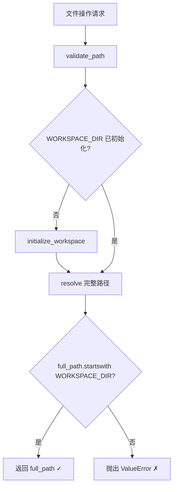
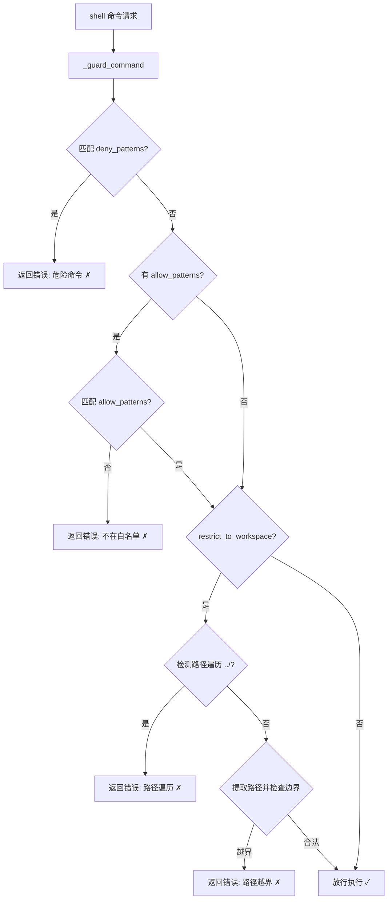

# PD-05.06 DeepCode — Workspace 路径验证与命令黑名单沙箱

> 文档编号：PD-05.06
> 来源：DeepCode `tools/code_implementation_server.py`, `nanobot/nanobot/agent/tools/shell.py`
> GitHub：https://github.com/HKUDS/DeepCode.git
> 问题域：PD-05 沙箱隔离 Sandbox Isolation
> 状态：可复用方案

---

## 第 1 章 问题与动机

### 1.1 核心问题

DeepCode 是一个论文代码复现系统，LLM Agent 需要在宿主机上执行文件读写和 shell 命令来生成、测试代码。这带来两个核心安全风险：

1. **文件系统越界**：Agent 可能读写 workspace 之外的系统文件（如 `/etc/passwd`、`~/.ssh/`）
2. **危险命令执行**：Agent 可能执行 `rm -rf /`、`dd if=/dev/zero`、fork bomb 等破坏性命令

DeepCode 没有使用 Docker/容器级隔离，而是选择了**进程级软隔离**——通过路径验证和命令黑名单在应用层实现安全边界。这是一种轻量级方案，适合开发环境和受信任场景。

### 1.2 DeepCode 的解法概述

DeepCode 的沙箱隔离分布在两个独立子系统中，各自解决不同层面的问题：

1. **MCP Server 层（code_implementation_server.py）**：`validate_path()` 函数对所有文件操作做路径边界检查，`execute_bash()` 内置字符串匹配黑名单拦截危险命令，`execute_python()` 使用 subprocess + timeout 执行代码（`tools/code_implementation_server.py:92-100`）
2. **Nanobot Agent 层（shell.py）**：`ExecTool._guard_command()` 使用正则表达式黑名单（deny_patterns）+ 可选白名单（allow_patterns）双重过滤，支持 `restrict_to_workspace` 模式检测路径遍历（`nanobot/nanobot/agent/tools/shell.py:105-135`）
3. **文件系统工具层（filesystem.py）**：`_resolve_path()` 函数对 ReadFile/WriteFile/EditFile/ListDir 四个工具统一做 `allowed_dir` 边界检查（`nanobot/nanobot/agent/tools/filesystem.py:9-14`）
4. **配置驱动**：`restrict_to_workspace` 开关在 `Config.tools` 中定义，通过 `AgentLoop` 构造函数传递到所有工具（`nanobot/nanobot/agent/loop.py:85-101`）
5. **超时保护**：MCP Server 默认 30s，Nanobot ExecTool 默认 60s，防止死循环

### 1.3 设计思想

| 设计原则 | 具体实现 | 理由 | 替代方案 |
|----------|----------|------|----------|
| 进程级软隔离 | subprocess.run + Path.resolve() 边界检查 | 无需 Docker，部署简单，适合开发环境 | Docker 容器隔离（更安全但更重） |
| 双层防御 | MCP Server 和 Nanobot 各自独立实现安全检查 | 两个子系统可独立部署，各自保证安全 | 统一安全中间件（耦合度高） |
| 正则黑名单 | deny_patterns 用正则匹配危险命令模式 | 比字符串匹配更精确，能匹配变体 | 白名单模式（更安全但限制太多） |
| 配置驱动隔离 | restrict_to_workspace 开关控制是否启用 | 开发时可关闭，生产时开启 | 硬编码始终启用（不灵活） |
| 统一路径解析 | _resolve_path() 用 Path.resolve() 消除符号链接和 `..` | 防止路径遍历攻击 | 字符串检查（容易被绕过） |

---

## 第 2 章 源码实现分析

### 2.1 架构概览

DeepCode 的沙箱隔离分布在两个独立子系统中，通过不同的机制实现文件和命令的安全边界：

```
┌─────────────────────────────────────────────────────────┐
│                    DeepCode 沙箱架构                      │
├─────────────────────┬───────────────────────────────────┤
│   MCP Server 层     │        Nanobot Agent 层            │
│  (code_impl_server) │     (tools/shell + filesystem)     │
├─────────────────────┼───────────────────────────────────┤
│                     │                                    │
│  validate_path()    │  _resolve_path(allowed_dir)        │
│  ┌───────────┐      │  ┌───────────────┐                 │
│  │ WORKSPACE │      │  │  allowed_dir  │                 │
│  │  _DIR     │      │  │  (optional)   │                 │
│  │ resolve() │      │  │  resolve()    │                 │
│  │ startswith│      │  │  startswith   │                 │
│  └───────────┘      │  └───────────────┘                 │
│                     │                                    │
│  execute_bash()     │  ExecTool._guard_command()         │
│  ┌───────────┐      │  ┌───────────────────────┐         │
│  │ 字符串黑名 │      │  │ deny_patterns (正则)   │         │
│  │ 单匹配    │      │  │ allow_patterns (正则)  │         │
│  │ dangerous_ │      │  │ restrict_to_workspace │         │
│  │ commands   │      │  │ 路径遍历检测           │         │
│  └───────────┘      │  └───────────────────────┘         │
│                     │                                    │
│  execute_python()   │  ExecTool.execute()                │
│  ┌───────────┐      │  ┌───────────────┐                 │
│  │ subprocess│      │  │ asyncio       │                 │
│  │ timeout=30│      │  │ create_sub    │                 │
│  │ tempfile  │      │  │ process_shell │                 │
│  │ cleanup   │      │  │ timeout=60    │                 │
│  └───────────┘      │  └───────────────┘                 │
└─────────────────────┴───────────────────────────────────┘
```

### 2.2 核心实现

#### 2.2.1 MCP Server 路径验证



对应源码 `tools/code_implementation_server.py:92-100`：

```python
def validate_path(path: str) -> Path:
    """Validate if path is within workspace"""
    if WORKSPACE_DIR is None:
        initialize_workspace()

    full_path = (WORKSPACE_DIR / path).resolve()
    if not str(full_path).startswith(str(WORKSPACE_DIR)):
        raise ValueError(f"Path {path} is outside workspace scope")
    return full_path
```

该函数被 `read_file`、`write_file`、`write_multiple_files`、`search_code`、`get_file_structure` 等所有文件操作工具调用。关键点：
- 使用 `Path.resolve()` 消除 `..`、符号链接等路径遍历手段
- 使用 `str.startswith()` 做前缀匹配，确保解析后的路径仍在 workspace 内
- workspace 通过 `set_workspace` MCP 工具由 workflow 动态设置（`tools/code_implementation_server.py:1396-1447`）

#### 2.2.2 Nanobot ExecTool 命令黑名单



对应源码 `nanobot/nanobot/agent/tools/shell.py:15-36`（deny_patterns 定义）：

```python
class ExecTool(Tool):
    def __init__(
        self,
        timeout: int = 60,
        working_dir: str | None = None,
        deny_patterns: list[str] | None = None,
        allow_patterns: list[str] | None = None,
        restrict_to_workspace: bool = False,
    ):
        self.timeout = timeout
        self.working_dir = working_dir
        self.deny_patterns = deny_patterns or [
            r"\brm\s+-[rf]{1,2}\b",       # rm -r, rm -rf, rm -fr
            r"\bdel\s+/[fq]\b",           # del /f, del /q (Windows)
            r"\brmdir\s+/s\b",            # rmdir /s (Windows)
            r"\b(format|mkfs|diskpart)\b", # 磁盘操作
            r"\bdd\s+if=",                # dd 写盘
            r">\s*/dev/sd",               # 直接写磁盘设备
            r"\b(shutdown|reboot|poweroff)\b",  # 系统电源
            r":\(\)\s*\{.*\};\s*:",       # fork bomb
        ]
        self.allow_patterns = allow_patterns or []
        self.restrict_to_workspace = restrict_to_workspace
```

对应源码 `nanobot/nanobot/agent/tools/shell.py:105-135`（_guard_command 实现）：

```python
def _guard_command(self, command: str, cwd: str) -> str | None:
    """Best-effort safety guard for potentially destructive commands."""
    cmd = command.strip()
    lower = cmd.lower()

    for pattern in self.deny_patterns:
        if re.search(pattern, lower):
            return "Error: Command blocked by safety guard (dangerous pattern detected)"

    if self.allow_patterns:
        if not any(re.search(p, lower) for p in self.allow_patterns):
            return "Error: Command blocked by safety guard (not in allowlist)"

    if self.restrict_to_workspace:
        if "..\\" in cmd or "../" in cmd:
            return "Error: Command blocked by safety guard (path traversal detected)"

        cwd_path = Path(cwd).resolve()
        win_paths = re.findall(r"[A-Za-z]:\\[^\\\"']+", cmd)
        posix_paths = re.findall(r"/[^\s\"']+", cmd)

        for raw in win_paths + posix_paths:
            try:
                p = Path(raw).resolve()
            except Exception:
                continue
            if cwd_path not in p.parents and p != cwd_path:
                return "Error: Command blocked by safety guard (path outside working dir)"

    return None
```

### 2.3 实现细节

#### 工具注册与隔离开关传递

`AgentLoop._register_default_tools()` 是隔离配置的分发中心（`nanobot/nanobot/agent/loop.py:85-101`）：

```python
def _register_default_tools(self) -> None:
    # 文件工具：根据配置决定是否限制到 workspace
    allowed_dir = self.workspace if self.restrict_to_workspace else None
    self.tools.register(ReadFileTool(allowed_dir=allowed_dir))
    self.tools.register(WriteFileTool(allowed_dir=allowed_dir))
    self.tools.register(EditFileTool(allowed_dir=allowed_dir))
    self.tools.register(ListDirTool(allowed_dir=allowed_dir))

    # Shell 工具：传递 workspace 和隔离开关
    self.tools.register(
        ExecTool(
            working_dir=str(self.workspace),
            timeout=self.exec_config.timeout,
            restrict_to_workspace=self.restrict_to_workspace,
        )
    )
```

数据流：`Config.tools.restrict_to_workspace` → `AgentLoop.__init__` → `_register_default_tools` → 每个 Tool 实例。

#### Nanobot 文件系统工具的路径隔离

`_resolve_path()` 是所有文件工具共享的路径验证函数（`nanobot/nanobot/agent/tools/filesystem.py:9-14`）：

```python
def _resolve_path(path: str, allowed_dir: Path | None = None) -> Path:
    """Resolve path and optionally enforce directory restriction."""
    resolved = Path(path).expanduser().resolve()
    if allowed_dir and not str(resolved).startswith(str(allowed_dir.resolve())):
        raise PermissionError(f"Path {path} is outside allowed directory {allowed_dir}")
    return resolved
```

与 MCP Server 的 `validate_path` 相比，多了 `expanduser()` 处理 `~` 路径。

#### MCP Server 的 execute_bash 黑名单

MCP Server 层使用更简单的字符串匹配（`tools/code_implementation_server.py:779-790`）：

```python
dangerous_commands = ["rm -rf", "sudo", "chmod 777", "mkfs", "dd if="]
if any(dangerous in command.lower() for dangerous in dangerous_commands):
    result = {
        "status": "error",
        "message": f"Dangerous command execution prohibited: {command}",
    }
```

对比 Nanobot 的正则黑名单，MCP Server 的字符串匹配更粗糙但也更简单。


---

## 第 3 章 迁移指南

### 3.1 迁移清单

**阶段 1：路径验证（1 个文件）**
- [ ] 实现 `validate_path(path, workspace_dir)` 函数
- [ ] 在所有文件操作入口调用 validate_path
- [ ] 使用 `Path.resolve()` 而非字符串拼接

**阶段 2：命令黑名单（1 个文件）**
- [ ] 定义 deny_patterns 正则列表
- [ ] 实现 `guard_command(command, cwd, deny_patterns)` 函数
- [ ] 在 shell 执行入口调用 guard_command

**阶段 3：配置驱动（可选）**
- [ ] 添加 `restrict_to_workspace` 配置项
- [ ] 在工具注册时根据配置传递 allowed_dir
- [ ] 支持运行时切换隔离级别

### 3.2 适配代码模板

```python
"""可直接复用的轻量级沙箱模块"""
import re
import asyncio
from pathlib import Path
from typing import Optional


class LightSandbox:
    """轻量级进程沙箱：路径验证 + 命令黑名单 + 超时保护"""

    DEFAULT_DENY_PATTERNS = [
        r"\brm\s+-[rf]{1,2}\b",
        r"\bdel\s+/[fq]\b",
        r"\brmdir\s+/s\b",
        r"\b(format|mkfs|diskpart)\b",
        r"\bdd\s+if=",
        r">\s*/dev/sd",
        r"\b(shutdown|reboot|poweroff)\b",
        r":\(\)\s*\{.*\};\s*:",  # fork bomb
    ]

    def __init__(
        self,
        workspace: str | Path,
        timeout: int = 60,
        deny_patterns: list[str] | None = None,
        restrict_paths: bool = True,
    ):
        self.workspace = Path(workspace).resolve()
        self.workspace.mkdir(parents=True, exist_ok=True)
        self.timeout = timeout
        self.deny_patterns = deny_patterns or self.DEFAULT_DENY_PATTERNS
        self.restrict_paths = restrict_paths

    def validate_path(self, path: str) -> Path:
        """验证路径在 workspace 内，返回解析后的绝对路径"""
        resolved = (self.workspace / path).resolve()
        if not str(resolved).startswith(str(self.workspace)):
            raise PermissionError(f"Path '{path}' escapes workspace boundary")
        return resolved

    def guard_command(self, command: str) -> Optional[str]:
        """检查命令安全性，返回 None 表示安全，返回错误信息表示拦截"""
        lower = command.strip().lower()

        # 黑名单检查
        for pattern in self.deny_patterns:
            if re.search(pattern, lower):
                return f"Blocked: dangerous pattern '{pattern}' matched"

        # 路径遍历检查
        if self.restrict_paths and ("../" in command or "..\\" in command):
            return "Blocked: path traversal detected"

        return None

    async def execute(self, command: str) -> dict:
        """安全执行 shell 命令"""
        error = self.guard_command(command)
        if error:
            return {"status": "blocked", "message": error}

        try:
            proc = await asyncio.create_subprocess_shell(
                command,
                stdout=asyncio.subprocess.PIPE,
                stderr=asyncio.subprocess.PIPE,
                cwd=str(self.workspace),
            )
            stdout, stderr = await asyncio.wait_for(
                proc.communicate(), timeout=self.timeout
            )
            return {
                "status": "success" if proc.returncode == 0 else "error",
                "returncode": proc.returncode,
                "stdout": stdout.decode("utf-8", errors="replace"),
                "stderr": stderr.decode("utf-8", errors="replace"),
            }
        except asyncio.TimeoutError:
            proc.kill()
            return {"status": "timeout", "message": f"Timed out after {self.timeout}s"}

    def read_file(self, path: str) -> str:
        """安全读取文件"""
        full_path = self.validate_path(path)
        if not full_path.exists():
            raise FileNotFoundError(f"File not found: {path}")
        return full_path.read_text(encoding="utf-8")

    def write_file(self, path: str, content: str) -> None:
        """安全写入文件"""
        full_path = self.validate_path(path)
        full_path.parent.mkdir(parents=True, exist_ok=True)
        full_path.write_text(content, encoding="utf-8")
```

### 3.3 适用场景

| 场景 | 适用度 | 说明 |
|------|--------|------|
| 开发/测试环境的 Agent 代码执行 | ⭐⭐⭐ | 轻量、无需 Docker，快速部署 |
| 论文复现/代码生成系统 | ⭐⭐⭐ | DeepCode 的原始场景，验证充分 |
| 多租户 SaaS 生产环境 | ⭐ | 软隔离不够，需要容器级隔离 |
| CI/CD 流水线中的代码检查 | ⭐⭐ | 配合超时保护可用，但建议加容器 |
| 教育平台在线编程 | ⭐⭐ | 基础防护可用，但需加导入控制 |

---

## 第 4 章 测试用例

```python
import pytest
import asyncio
from pathlib import Path
from unittest.mock import patch, AsyncMock


class TestValidatePath:
    """测试路径验证逻辑（对应 code_implementation_server.py:92-100）"""

    def setup_method(self):
        self.workspace = Path("/tmp/test-sandbox-workspace")
        self.workspace.mkdir(parents=True, exist_ok=True)

    def test_normal_path(self):
        """正常子路径应通过验证"""
        full = (self.workspace / "src/main.py").resolve()
        assert str(full).startswith(str(self.workspace))

    def test_path_traversal_blocked(self):
        """../../../etc/passwd 应被拦截"""
        full = (self.workspace / "../../../etc/passwd").resolve()
        assert not str(full).startswith(str(self.workspace))

    def test_absolute_path_outside(self):
        """绝对路径 /etc/hosts 经 resolve 后不在 workspace 内"""
        # 模拟 validate_path 的逻辑
        path = "/etc/hosts"
        full = (self.workspace / path).resolve()
        # /tmp/test-sandbox-workspace/etc/hosts 实际上在 workspace 内
        # 但 /etc/hosts 作为绝对路径不会被 Path / 拼接
        # DeepCode 的实现是 (WORKSPACE_DIR / path).resolve()
        # 所以 /etc/hosts 会变成 /etc/hosts（绝对路径覆盖）
        # 这取决于 Python Path 的行为

    def test_symlink_resolved(self):
        """符号链接应被 resolve() 解析到真实路径"""
        target = Path("/tmp/outside-file")
        target.write_text("secret", encoding="utf-8")
        link = self.workspace / "sneaky_link"
        if link.exists():
            link.unlink()
        link.symlink_to(target)
        resolved = link.resolve()
        assert not str(resolved).startswith(str(self.workspace))
        # 清理
        link.unlink()
        target.unlink()


class TestGuardCommand:
    """测试命令黑名单逻辑（对应 shell.py:105-135）"""

    def setup_method(self):
        import re
        self.deny_patterns = [
            r"\brm\s+-[rf]{1,2}\b",
            r"\bdel\s+/[fq]\b",
            r"\b(format|mkfs|diskpart)\b",
            r"\bdd\s+if=",
            r"\b(shutdown|reboot|poweroff)\b",
            r":\(\)\s*\{.*\};\s*:",
        ]

    def _guard(self, command: str) -> bool:
        """返回 True 表示被拦截"""
        import re
        lower = command.strip().lower()
        return any(re.search(p, lower) for p in self.deny_patterns)

    def test_rm_rf_blocked(self):
        assert self._guard("rm -rf /")

    def test_rm_r_blocked(self):
        assert self._guard("rm -r /tmp/important")

    def test_fork_bomb_blocked(self):
        assert self._guard(":(){ :|:& };:")

    def test_dd_blocked(self):
        assert self._guard("dd if=/dev/zero of=/dev/sda")

    def test_safe_command_allowed(self):
        assert not self._guard("ls -la")
        assert not self._guard("python test.py")
        assert not self._guard("pip install numpy")

    def test_shutdown_blocked(self):
        assert self._guard("shutdown -h now")

    def test_format_blocked(self):
        assert self._guard("mkfs.ext4 /dev/sda1")


class TestExecToolTimeout:
    """测试超时保护（对应 shell.py:74-78）"""

    @pytest.mark.asyncio
    async def test_timeout_kills_process(self):
        """超时后进程应被 kill"""
        proc = await asyncio.create_subprocess_shell(
            "sleep 100",
            stdout=asyncio.subprocess.PIPE,
            stderr=asyncio.subprocess.PIPE,
        )
        with pytest.raises(asyncio.TimeoutError):
            await asyncio.wait_for(proc.communicate(), timeout=0.1)
        proc.kill()
        await proc.wait()
        assert proc.returncode is not None


class TestRestrictToWorkspace:
    """测试 restrict_to_workspace 路径遍历检测"""

    def test_path_traversal_string_check(self):
        """../ 和 ..\\ 应被检测"""
        cmd1 = "cat ../../../etc/passwd"
        cmd2 = "type ..\\..\\windows\\system32\\config\\sam"
        assert "../" in cmd1
        assert "..\\" in cmd2

    def test_absolute_path_outside_workspace(self):
        """绝对路径不在 workspace 内应被拦截"""
        cwd = Path("/tmp/workspace").resolve()
        target = Path("/etc/passwd").resolve()
        assert cwd not in target.parents and target != cwd
```


---

## 第 5 章 跨域关联

| 关联域 | 关系类型 | 说明 |
|--------|----------|------|
| PD-04 工具系统 | 依赖 | 沙箱的路径验证和命令过滤嵌入在工具执行链中，ToolRegistry.execute() 调用 Tool.execute() 前无额外拦截，安全检查在各 Tool 内部实现 |
| PD-03 容错与重试 | 协同 | execute_python 的 timeout 机制既是容错（防死循环）也是沙箱保护（防资源耗尽），两个域共享超时基础设施 |
| PD-01 上下文管理 | 协同 | ExecTool 的输出截断（max_len=10000）既防止上下文爆炸，也限制了恶意命令的信息泄露量 |
| PD-09 Human-in-the-Loop | 互补 | DeepCode 的沙箱是自动化防御，没有人工审批环节；高安全场景可叠加 HITL 对危险操作做人工确认 |

---

## 第 6 章 来源文件索引

| 文件 | 行范围 | 关键实现 |
|------|--------|----------|
| `tools/code_implementation_server.py` | L92-L100 | validate_path() 路径边界验证 |
| `tools/code_implementation_server.py` | L686-L763 | execute_python() subprocess + timeout |
| `tools/code_implementation_server.py` | L766-L849 | execute_bash() 字符串黑名单 + subprocess |
| `tools/code_implementation_server.py` | L56-L77 | initialize_workspace() 工作区初始化 |
| `tools/code_implementation_server.py` | L1396-L1447 | set_workspace() MCP 工具动态设置工作区 |
| `nanobot/nanobot/agent/tools/shell.py` | L12-L36 | ExecTool.__init__() deny_patterns 定义 |
| `nanobot/nanobot/agent/tools/shell.py` | L60-L103 | ExecTool.execute() asyncio subprocess |
| `nanobot/nanobot/agent/tools/shell.py` | L105-L135 | _guard_command() 三层安全检查 |
| `nanobot/nanobot/agent/tools/filesystem.py` | L9-L14 | _resolve_path() 统一路径验证 |
| `nanobot/nanobot/agent/tools/filesystem.py` | L17-L52 | ReadFileTool 带 allowed_dir |
| `nanobot/nanobot/agent/tools/filesystem.py` | L55-L89 | WriteFileTool 带 allowed_dir |
| `nanobot/nanobot/agent/tools/base.py` | L7-L105 | Tool 抽象基类 + 参数验证 |
| `nanobot/nanobot/agent/loop.py` | L44-L83 | AgentLoop 构造函数接收 restrict_to_workspace |
| `nanobot/nanobot/agent/loop.py` | L85-L126 | _register_default_tools() 隔离配置分发 |
| `nanobot/nanobot/config/schema.py` | L198-L209 | ToolsConfig.restrict_to_workspace 配置定义 |

---

## 第 7 章 横向对比维度

> **重要：** 本章用于自动填充 Butcher Wiki 的横向对比表。

```json comparison_data
{
  "project": "DeepCode",
  "dimensions": {
    "隔离级别": "进程级软隔离：subprocess + Path.resolve() 边界检查，无容器",
    "虚拟路径": "无虚拟路径，直接使用真实路径 + startswith 前缀检查",
    "生命周期管理": "无显式生命周期，workspace 随进程存在，tempfile 用后即删",
    "防御性设计": "双层防御：MCP 字符串黑名单 + Nanobot 正则黑名单 + 路径遍历检测",
    "代码修复": "无自动修复，execute_python 失败后由 LLM 迭代修改代码",
    "Scope 粒度": "workspace 级别，所有工具共享同一 workspace 边界",
    "工具访问控制": "配置驱动：restrict_to_workspace 开关统一控制文件和 shell 工具",
    "跨进程发现": "不涉及：MCP Server 和 Nanobot 是独立进程，各自管理 workspace",
    "多运行时支持": "支持 Docker Compose 部署，但沙箱逻辑不区分运行时",
    "跨平台命令过滤": "deny_patterns 同时覆盖 POSIX 和 Windows 命令模式"
  }
}
```

### 域元数据补充

```json domain_metadata
{
  "solution_summary": "DeepCode 通过 validate_path 路径边界检查 + deny_patterns 正则命令黑名单实现进程级软隔离，MCP Server 和 Nanobot 双层独立防御",
  "description": "轻量级进程沙箱：不依赖容器，通过应用层路径验证和命令过滤实现安全边界",
  "sub_problems": [
    "跨平台命令过滤：同一黑名单需覆盖 POSIX（rm -rf）和 Windows（del /f）命令变体",
    "双系统独立防御：MCP Server 和 Agent 框架各自实现安全检查，如何保持一致性"
  ],
  "best_practices": [
    "正则黑名单优于字符串匹配：\\brm\\s+-[rf]{1,2}\\b 能匹配 rm -rf 的各种变体，避免简单 in 检查被绕过",
    "配置驱动隔离开关：restrict_to_workspace 允许开发时关闭、生产时开启，兼顾便利和安全"
  ]
}
```
