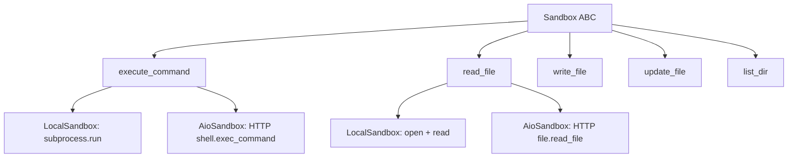
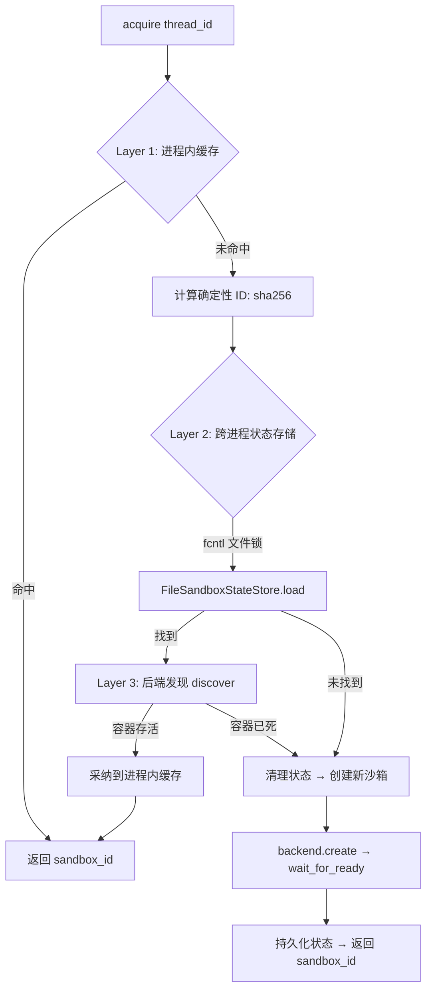

# PD-05.03 DeerFlow — Abstract Sandbox + Provider 双后端沙箱隔离

> 文档编号：PD-05.03
> 来源：DeerFlow `backend/src/sandbox/`, `backend/src/community/aio_sandbox/`
> GitHub：https://github.com/bytedance/deer-flow
> 问题域：PD-05 沙箱隔离 Sandbox Isolation
> 状态：可复用方案

---

## 第 1 章 问题与动机

### 1.1 核心问题

Agent 系统需要执行用户代码（Python 脚本、Shell 命令、文件操作），但直接在宿主机上运行存在三大风险：

1. **安全风险**：用户代码可能执行 `rm -rf /`、读取 `/etc/passwd`、安装恶意包
2. **路径泄露**：Agent 看到宿主机真实路径（如 `/Users/john/projects/`），会在后续推理中引用这些路径，导致不可移植
3. **资源争抢**：多个线程的 Agent 同时执行代码，共享文件系统导致互相覆盖

DeerFlow 面临的额外挑战是**部署环境多样性**：开发者本地用 macOS 直接运行，测试环境用 Docker，生产环境用 K8s Pod。沙箱系统必须在不改代码的情况下适配所有环境。

### 1.2 DeerFlow 的解法概述

DeerFlow 实现了一套四层抽象的沙箱系统：

1. **Sandbox ABC**（`sandbox.py:4`）— 定义 5 个抽象操作：execute_command、read_file、write_file、update_file、list_dir
2. **SandboxProvider ABC**（`sandbox_provider.py:8`）— 定义生命周期管理：acquire/get/release，配合配置驱动的单例工厂
3. **双后端实现** — LocalSandbox（进程内路径映射）和 AioSandbox（Docker 容器 HTTP API），通过配置切换
4. **虚拟路径系统**（`tools.py:17`）— `/mnt/user-data/` 前缀双向翻译，Agent 永远看不到真实路径
5. **三层一致性获取**（`aio_sandbox_provider.py:327-359`）— 进程内缓存 → 跨进程状态存储 → 后端发现，确保同一 thread 总是获得同一沙箱

### 1.3 设计思想

| 设计原则 | 具体实现 | 理由 | 替代方案 |
|----------|----------|------|----------|
| 操作与生命周期分离 | Sandbox 管操作，Provider 管生命周期 | 操作接口稳定，生命周期策略多变 | 单一类同时管理（耦合度高） |
| 配置驱动后端选择 | `config.sandbox.use` 指定 Provider 类路径，`resolve_class()` 动态加载 | 零代码切换 Local/Docker/K8s | 硬编码 if-else 分支 |
| 虚拟路径双向翻译 | 输入命令翻译 + 输出结果反向翻译 | Agent 推理链中不出现真实路径 | 只做单向翻译（输出仍泄露） |
| 懒初始化 | `SandboxMiddleware(lazy_init=True)` + `ensure_sandbox_initialized()` | 不是所有 Agent 都需要沙箱，首次工具调用才创建 | 预创建（浪费资源） |
| 确定性 ID | `sha256(thread_id)[:8]` 生成 sandbox_id | 跨进程发现同一容器，无需共享内存 | UUID（每次不同，无法跨进程复用） |
| 跨进程状态持久化 | FileSandboxStateStore + fcntl 文件锁 | 多 worker 进程共享沙箱映射 | Redis（需额外基础设施） |

---

## 第 2 章 源码实现分析

### 2.1 架构概览

DeerFlow 的沙箱系统由四层抽象组成，从上到下：

```
┌─────────────────────────────────────────────────────────────────┐
│                    Tool Layer (tools.py)                         │
│  bash_tool / ls_tool / read_file_tool / write_file_tool         │
│  ┌─────────────────────────────────────────────────────────┐    │
│  │ ensure_sandbox_initialized() → 懒获取 Sandbox 实例       │    │
│  │ replace_virtual_paths_in_command() → 虚拟路径翻译         │    │
│  └─────────────────────────────────────────────────────────┘    │
├─────────────────────────────────────────────────────────────────┤
│                 Middleware Layer (middleware.py)                  │
│  SandboxMiddleware: before_agent() 注入 sandbox_id 到 state     │
├─────────────────────────────────────────────────────────────────┤
│                 Provider Layer (sandbox_provider.py)             │
│  ┌──────────────────────┐  ┌──────────────────────────────┐    │
│  │ LocalSandboxProvider │  │    AioSandboxProvider        │    │
│  │ (单例 LocalSandbox)  │  │ (三层一致性 + 空闲回收)       │    │
│  └──────────────────────┘  └──────────────────────────────┘    │
├─────────────────────────────────────────────────────────────────┤
│                 Sandbox Layer (sandbox.py)                       │
│  ┌──────────────────────┐  ┌──────────────────────────────┐    │
│  │    LocalSandbox      │  │       AioSandbox             │    │
│  │ (subprocess + 路径映射)│  │ (HTTP API → Docker 容器)     │    │
│  └──────────────────────┘  └──────────────────────────────┘    │
├─────────────────────────────────────────────────────────────────┤
│                 Backend Layer (AIO only)                         │
│  ┌──────────────────────┐  ┌──────────────────────────────┐    │
│  │ LocalContainerBackend│  │  RemoteSandboxBackend        │    │
│  │ (Docker/Apple Cont.) │  │  (K8s Provisioner HTTP)      │    │
│  └──────────────────────┘  └──────────────────────────────┘    │
└─────────────────────────────────────────────────────────────────┘
```

### 2.2 核心实现

#### 2.2.1 Sandbox 抽象基类



对应源码 `backend/src/sandbox/sandbox.py:1-73`：

```python
class Sandbox(ABC):
    """Abstract base class for sandbox environments"""
    _id: str

    def __init__(self, id: str):
        self._id = id

    @property
    def id(self) -> str:
        return self._id

    @abstractmethod
    def execute_command(self, command: str) -> str: ...

    @abstractmethod
    def read_file(self, path: str) -> str: ...

    @abstractmethod
    def list_dir(self, path: str, max_depth=2) -> list[str]: ...

    @abstractmethod
    def write_file(self, path: str, content: str, append: bool = False) -> None: ...

    @abstractmethod
    def update_file(self, path: str, content: bytes) -> None: ...
```

5 个抽象方法覆盖了 Agent 需要的全部文件系统操作。注意 `update_file` 单独处理二进制内容（base64 编码），这是因为 AioSandbox 的 HTTP API 需要区分文本和二进制传输。

#### 2.2.2 LocalSandbox 的双向路径翻译


对应源码 `backend/src/sandbox/local/local_sandbox.py:22-155`：

```python
class LocalSandbox(Sandbox):
    def __init__(self, id: str, path_mappings: dict[str, str] | None = None):
        super().__init__(id)
        self.path_mappings = path_mappings or {}

    def _resolve_path(self, path: str) -> str:
        """容器路径 → 本地路径（最长前缀优先匹配）"""
        path_str = str(path)
        for container_path, local_path in sorted(
            self.path_mappings.items(), key=lambda x: len(x[0]), reverse=True
        ):
            if path_str.startswith(container_path):
                relative = path_str[len(container_path):].lstrip("/")
                resolved = str(Path(local_path) / relative) if relative else local_path
                return resolved
        return path_str

    def _reverse_resolve_paths_in_output(self, output: str) -> str:
        """输出中的本地路径 → 容器路径（正则批量替换）"""
        result = output
        for container_path, local_path in sorted(
            self.path_mappings.items(), key=lambda x: len(x[1]), reverse=True
        ):
            local_path_resolved = str(Path(local_path).resolve())
            escaped_local = re.escape(local_path_resolved)
            pattern = re.compile(escaped_local + r"(?:/[^\s\"';&|<>()]*)?")
            result = pattern.sub(
                lambda m: self._reverse_resolve_path(m.group(0)), result
            )
        return result

    def execute_command(self, command: str) -> str:
        resolved_command = self._resolve_paths_in_command(command)
        result = subprocess.run(
            resolved_command, executable="/bin/zsh",
            shell=True, capture_output=True, text=True, timeout=600,
        )
        output = result.stdout
        if result.stderr:
            output += f"\nStd Error:\n{result.stderr}" if output else result.stderr
        final_output = output if output else "(no output)"
        return self._reverse_resolve_paths_in_output(final_output)
```

关键设计点：
- **最长前缀优先**（`sorted(..., reverse=True)`）：避免 `/mnt/skills` 被 `/mnt` 先匹配
- **正则匹配路径边界**（`[^\s"';&|<>()]*`）：不会误替换路径中间的子串
- **600 秒超时**：防止死循环命令耗尽资源

#### 2.2.3 AioSandboxProvider 的三层一致性获取



对应源码 `backend/src/community/aio_sandbox/aio_sandbox_provider.py:305-359`：

```python
def acquire(self, thread_id: str | None = None) -> str:
    if thread_id:
        thread_lock = self._get_thread_lock(thread_id)
        with thread_lock:
            return self._acquire_internal(thread_id)
    else:
        return self._acquire_internal(thread_id)

def _acquire_internal(self, thread_id: str | None) -> str:
    # Layer 1: In-process cache
    if thread_id:
        with self._lock:
            if thread_id in self._thread_sandboxes:
                existing_id = self._thread_sandboxes[thread_id]
                if existing_id in self._sandboxes:
                    self._last_activity[existing_id] = time.time()
                    return existing_id

    sandbox_id = self._deterministic_sandbox_id(thread_id) if thread_id else str(uuid.uuid4())[:8]

    # Layer 2 & 3: Cross-process recovery + creation
    if thread_id:
        with self._state_store.lock(thread_id):
            recovered_id = self._try_recover(thread_id)
            if recovered_id is not None:
                return recovered_id
            return self._create_sandbox(thread_id, sandbox_id)
    else:
        return self._create_sandbox(thread_id, sandbox_id)
```

### 2.3 实现细节

#### 虚拟路径系统（tools.py 层）

除了 LocalSandbox 自身的路径映射，tools.py 还实现了一套独立的 `/mnt/user-data/` 虚拟路径翻译（`tools.py:17-61`），将三个子目录映射到线程专属物理路径：

| 虚拟路径 | 物理路径 |
|----------|----------|
| `/mnt/user-data/workspace/*` | `thread_data['workspace_path']/*` |
| `/mnt/user-data/uploads/*` | `thread_data['uploads_path']/*` |
| `/mnt/user-data/outputs/*` | `thread_data['outputs_path']/*` |

这套翻译**仅在 LocalSandbox 模式下生效**（`is_local_sandbox()` 检查），因为 AioSandbox 的 Docker 容器已经通过 volume mount 将 `/mnt/user-data/` 挂载到了正确的物理路径。

#### 空闲回收机制

AioSandboxProvider 启动一个守护线程（`sandbox-idle-checker`），每 60 秒扫描一次，释放超过 `idle_timeout`（默认 600 秒）未活动的沙箱（`aio_sandbox_provider.py:236-270`）。

#### 结构化异常体系

`exceptions.py` 定义了 6 级异常层次（`exceptions.py:4-72`）：

```
SandboxError (base)
├── SandboxNotFoundError    — 沙箱不存在
├── SandboxRuntimeError     — 运行时不可用
├── SandboxCommandError     — 命令执行失败（含 command + exit_code）
└── SandboxFileError        — 文件操作失败
    ├── SandboxPermissionError  — 权限不足
    └── SandboxFileNotFoundError — 文件不存在
```

每个异常携带结构化 `details` 字典，便于上层日志和错误报告。

---

## 第 3 章 迁移指南

### 3.1 迁移清单

**阶段 1：核心抽象（1 天）**
- [ ] 创建 `Sandbox` ABC，定义 5 个抽象方法
- [ ] 创建 `SandboxProvider` ABC，定义 acquire/get/release
- [ ] 实现 `get_sandbox_provider()` 单例工厂 + `resolve_class()` 动态加载
- [ ] 定义结构化异常体系（SandboxError → 子类）

**阶段 2：LocalSandbox 实现（1 天）**
- [ ] 实现 LocalSandbox：subprocess.run 执行命令
- [ ] 实现路径映射：`_resolve_path()` + `_reverse_resolve_path()`
- [ ] 实现双向翻译：命令输入翻译 + 输出反向翻译
- [ ] 实现 LocalSandboxProvider：单例模式 + 配置读取路径映射

**阶段 3：虚拟路径工具层（0.5 天）**
- [ ] 实现 `replace_virtual_path()` 和 `replace_virtual_paths_in_command()`
- [ ] 实现 `ensure_sandbox_initialized()` 懒初始化
- [ ] 包装 bash_tool / read_file_tool / write_file_tool 等工具函数

**阶段 4：Docker 后端（可选，2 天）**
- [ ] 实现 AioSandbox：HTTP API 客户端
- [ ] 实现 SandboxBackend ABC + LocalContainerBackend
- [ ] 实现 SandboxStateStore + FileSandboxStateStore（fcntl 文件锁）
- [ ] 实现 AioSandboxProvider：三层一致性获取 + 空闲回收

### 3.2 适配代码模板

#### 最小可用版本：Sandbox ABC + LocalSandbox

```python
"""sandbox/base.py — 沙箱抽象基类"""
from abc import ABC, abstractmethod


class Sandbox(ABC):
    def __init__(self, sandbox_id: str):
        self._id = sandbox_id

    @property
    def id(self) -> str:
        return self._id

    @abstractmethod
    def execute_command(self, command: str) -> str: ...

    @abstractmethod
    def read_file(self, path: str) -> str: ...

    @abstractmethod
    def write_file(self, path: str, content: str, append: bool = False) -> None: ...


class SandboxProvider(ABC):
    @abstractmethod
    def acquire(self, thread_id: str | None = None) -> str: ...

    @abstractmethod
    def get(self, sandbox_id: str) -> Sandbox | None: ...

    @abstractmethod
    def release(self, sandbox_id: str) -> None: ...
```

```python
"""sandbox/local.py — 本地沙箱实现（含路径映射）"""
import re
import subprocess
from pathlib import Path
from .base import Sandbox, SandboxProvider


class LocalSandbox(Sandbox):
    def __init__(self, sandbox_id: str, path_mappings: dict[str, str] | None = None):
        super().__init__(sandbox_id)
        self._mappings = path_mappings or {}

    def _resolve(self, path: str) -> str:
        for container_path, local_path in sorted(
            self._mappings.items(), key=lambda x: len(x[0]), reverse=True
        ):
            if path.startswith(container_path):
                relative = path[len(container_path):].lstrip("/")
                return str(Path(local_path) / relative) if relative else local_path
        return path

    def _reverse_resolve_output(self, output: str) -> str:
        result = output
        for container_path, local_path in sorted(
            self._mappings.items(), key=lambda x: len(x[1]), reverse=True
        ):
            resolved = str(Path(local_path).resolve())
            pattern = re.compile(re.escape(resolved) + r"(?:/[^\s\"';&|<>()]*)?")
            result = pattern.sub(
                lambda m: self._reverse_single(m.group(0), resolved, container_path),
                result,
            )
        return result

    def _reverse_single(self, matched: str, local_base: str, container_base: str) -> str:
        relative = matched[len(local_base):].lstrip("/")
        return f"{container_base}/{relative}" if relative else container_base

    def execute_command(self, command: str) -> str:
        # 翻译命令中的虚拟路径
        for cp, lp in sorted(self._mappings.items(), key=lambda x: len(x[0]), reverse=True):
            command = command.replace(cp, str(Path(lp).resolve()))
        result = subprocess.run(
            command, shell=True, capture_output=True, text=True, timeout=600,
        )
        output = result.stdout + (f"\n{result.stderr}" if result.stderr else "")
        return self._reverse_resolve_output(output or "(no output)")

    def read_file(self, path: str) -> str:
        with open(self._resolve(path)) as f:
            return f.read()

    def write_file(self, path: str, content: str, append: bool = False) -> None:
        resolved = self._resolve(path)
        Path(resolved).parent.mkdir(parents=True, exist_ok=True)
        with open(resolved, "a" if append else "w") as f:
            f.write(content)


class LocalSandboxProvider(SandboxProvider):
    _instance: LocalSandbox | None = None

    def __init__(self, path_mappings: dict[str, str] | None = None):
        self._mappings = path_mappings or {}

    def acquire(self, thread_id: str | None = None) -> str:
        if self._instance is None:
            LocalSandboxProvider._instance = LocalSandbox("local", self._mappings)
        return self._instance.id

    def get(self, sandbox_id: str) -> LocalSandbox | None:
        return self._instance if sandbox_id == "local" else None

    def release(self, sandbox_id: str) -> None:
        pass  # 单例模式，不释放
```

### 3.3 适用场景

| 场景 | 适用度 | 说明 |
|------|--------|------|
| Agent 执行用户代码 | ⭐⭐⭐ | 核心场景，LocalSandbox 即可满足开发需求 |
| 多租户 SaaS | ⭐⭐⭐ | AioSandbox + 线程级容器隔离 |
| CI/CD 流水线 | ⭐⭐ | 可用但需要额外的构建工具支持 |
| 纯文本生成 Agent | ⭐ | 不需要代码执行，沙箱是多余的 |
| K8s 多 Pod 部署 | ⭐⭐⭐ | RemoteSandboxBackend + Provisioner 模式 |

---

## 第 4 章 测试用例

```python
"""tests/test_sandbox.py — 沙箱系统核心测试"""
import os
import tempfile
from pathlib import Path
from unittest.mock import MagicMock, patch

import pytest


# ── 测试 LocalSandbox 路径映射 ──

class TestLocalSandboxPathMapping:
    """测试 LocalSandbox 的双向路径翻译"""

    def setup_method(self):
        self.tmp_dir = tempfile.mkdtemp()
        self.mappings = {
            "/mnt/skills": f"{self.tmp_dir}/skills",
            "/mnt/user-data": f"{self.tmp_dir}/user-data",
        }
        # 创建目录
        os.makedirs(f"{self.tmp_dir}/skills", exist_ok=True)
        os.makedirs(f"{self.tmp_dir}/user-data", exist_ok=True)

        from sandbox.local import LocalSandbox
        self.sandbox = LocalSandbox("test", path_mappings=self.mappings)

    def test_resolve_path_exact_match(self):
        """精确匹配容器路径"""
        resolved = self.sandbox._resolve("/mnt/skills")
        assert resolved == f"{self.tmp_dir}/skills"

    def test_resolve_path_with_subpath(self):
        """容器路径 + 子路径"""
        resolved = self.sandbox._resolve("/mnt/skills/python/main.py")
        assert resolved == f"{self.tmp_dir}/skills/python/main.py"

    def test_resolve_path_longest_prefix_wins(self):
        """最长前缀优先匹配"""
        self.sandbox._mappings["/mnt/skills/special"] = f"{self.tmp_dir}/special"
        resolved = self.sandbox._resolve("/mnt/skills/special/file.py")
        assert resolved == f"{self.tmp_dir}/special/file.py"

    def test_resolve_path_no_mapping(self):
        """无映射时返回原路径"""
        resolved = self.sandbox._resolve("/usr/local/bin/python")
        assert resolved == "/usr/local/bin/python"

    def test_reverse_resolve_output(self):
        """输出中的本地路径被反向翻译"""
        local_path = str(Path(f"{self.tmp_dir}/skills").resolve())
        output = f"File saved to {local_path}/out.py"
        reversed_output = self.sandbox._reverse_resolve_output(output)
        assert "/mnt/skills/out.py" in reversed_output
        assert local_path not in reversed_output

    def test_execute_command_bidirectional(self):
        """命令执行的双向翻译"""
        # 创建测试文件
        os.makedirs(f"{self.tmp_dir}/skills/test", exist_ok=True)
        Path(f"{self.tmp_dir}/skills/test/hello.txt").write_text("hello")

        result = self.sandbox.execute_command("cat /mnt/skills/test/hello.txt")
        assert "hello" in result


# ── 测试 SandboxProvider 单例工厂 ──

class TestSandboxProviderFactory:
    """测试配置驱动的 Provider 单例"""

    def test_acquire_returns_same_id(self):
        from sandbox.local import LocalSandboxProvider
        provider = LocalSandboxProvider()
        id1 = provider.acquire("thread-1")
        id2 = provider.acquire("thread-2")
        assert id1 == id2 == "local"  # 单例模式

    def test_get_returns_sandbox(self):
        from sandbox.local import LocalSandboxProvider
        provider = LocalSandboxProvider()
        provider.acquire()
        sandbox = provider.get("local")
        assert sandbox is not None
        assert sandbox.id == "local"

    def test_get_unknown_returns_none(self):
        from sandbox.local import LocalSandboxProvider
        provider = LocalSandboxProvider()
        assert provider.get("nonexistent") is None


# ── 测试虚拟路径翻译 ──

class TestVirtualPathReplacement:
    """测试 tools.py 层的虚拟路径翻译"""

    def test_replace_workspace_path(self):
        thread_data = {
            "workspace_path": "/tmp/threads/abc/workspace",
            "uploads_path": "/tmp/threads/abc/uploads",
            "outputs_path": "/tmp/threads/abc/outputs",
        }
        # 模拟 replace_virtual_path 逻辑
        path = "/mnt/user-data/workspace/project/main.py"
        prefix = "/mnt/user-data"
        relative = path[len(prefix):].lstrip("/")
        parts = relative.split("/", 1)
        actual_base = thread_data.get(f"{parts[0]}_path")
        result = f"{actual_base}/{parts[1]}" if len(parts) > 1 else actual_base
        assert result == "/tmp/threads/abc/workspace/project/main.py"

    def test_non_virtual_path_unchanged(self):
        """非虚拟路径不做翻译"""
        path = "/usr/local/bin/python"
        assert not path.startswith("/mnt/user-data")


# ── 测试确定性 ID 生成 ──

class TestDeterministicSandboxId:
    """测试 sha256 确定性 ID"""

    def test_same_thread_same_id(self):
        import hashlib
        thread_id = "thread-abc-123"
        id1 = hashlib.sha256(thread_id.encode()).hexdigest()[:8]
        id2 = hashlib.sha256(thread_id.encode()).hexdigest()[:8]
        assert id1 == id2

    def test_different_threads_different_ids(self):
        import hashlib
        id1 = hashlib.sha256("thread-1".encode()).hexdigest()[:8]
        id2 = hashlib.sha256("thread-2".encode()).hexdigest()[:8]
        assert id1 != id2
```

---

## 第 5 章 跨域关联

| 关联域 | 关系类型 | 说明 |
|--------|----------|------|
| PD-01 上下文管理 | 协同 | 沙箱内文件操作的输出会进入 Agent 上下文，虚拟路径翻译确保上下文中不含真实路径 |
| PD-04 工具系统 | 依赖 | 沙箱工具（bash_tool、read_file_tool 等）是工具系统的一部分，通过 `@tool` 装饰器注册 |
| PD-06 记忆持久化 | 协同 | 线程数据目录（workspace/uploads/outputs）是记忆持久化的物理载体，沙箱提供隔离访问 |
| PD-09 Human-in-the-Loop | 协同 | 沙箱中间件在 Agent 执行前注入 sandbox_id，与 Human Review 中间件共享 state 管道 |
| PD-10 中间件管道 | 依赖 | SandboxMiddleware 是中间件管道的一环，通过 before_agent() 钩子注入沙箱状态 |
| PD-11 可观测性 | 协同 | 沙箱的 last_activity 时间戳和空闲回收日志是可观测性数据的来源 |

---

## 第 6 章 来源文件索引

| 文件 | 行范围 | 关键实现 |
|------|--------|----------|
| `backend/src/sandbox/sandbox.py` | L1-L73 | Sandbox ABC：5 个抽象方法定义 |
| `backend/src/sandbox/sandbox_provider.py` | L1-L97 | SandboxProvider ABC + 单例工厂 + shutdown/reset |
| `backend/src/sandbox/middleware.py` | L1-L61 | SandboxMiddleware：懒初始化 + before_agent 注入 |
| `backend/src/sandbox/tools.py` | L1-L404 | 工具函数：虚拟路径翻译 + ensure_sandbox_initialized + 5 个 @tool |
| `backend/src/sandbox/consts.py` | L1-L5 | 常量：THREAD_DATA_BASE_DIR、VIRTUAL_PATH_PREFIX |
| `backend/src/sandbox/exceptions.py` | L1-L72 | 6 级结构化异常体系 |
| `backend/src/sandbox/local/local_sandbox.py` | L1-L184 | LocalSandbox：subprocess + 双向路径翻译 |
| `backend/src/sandbox/local/local_sandbox_provider.py` | L1-L61 | LocalSandboxProvider：单例 + 配置路径映射 |
| `backend/src/sandbox/local/list_dir.py` | L1-L113 | 目录遍历 + IGNORE_PATTERNS 过滤 |
| `backend/src/community/aio_sandbox/aio_sandbox.py` | L1-L129 | AioSandbox：HTTP API 客户端（shell/file 操作） |
| `backend/src/community/aio_sandbox/aio_sandbox_provider.py` | L1-L498 | AioSandboxProvider：三层一致性 + 空闲回收 + 信号处理 |
| `backend/src/community/aio_sandbox/backend.py` | L1-L99 | SandboxBackend ABC + wait_for_sandbox_ready |
| `backend/src/community/aio_sandbox/local_backend.py` | L1-L295 | LocalContainerBackend：Docker/Apple Container 管理 |
| `backend/src/community/aio_sandbox/remote_backend.py` | L1-L158 | RemoteSandboxBackend：K8s Provisioner HTTP 客户端 |
| `backend/src/community/aio_sandbox/state_store.py` | L1-L71 | SandboxStateStore ABC：跨进程状态持久化 |
| `backend/src/community/aio_sandbox/file_state_store.py` | L1-L103 | FileSandboxStateStore：JSON + fcntl 文件锁 |
| `backend/src/community/aio_sandbox/sandbox_info.py` | L1-L42 | SandboxInfo dataclass：跨进程发现元数据 |
| `backend/src/config/sandbox_config.py` | L1-L67 | SandboxConfig Pydantic 模型：配置驱动 |
| `backend/src/agents/thread_state.py` | L1-L56 | SandboxState/ThreadDataState TypedDict |

---

## 第 7 章 横向对比维度

```json comparison_data
{
  "project": "DeerFlow",
  "dimensions": {
    "隔离级别": "双模式：LocalSandbox（进程级路径映射）+ AioSandbox（Docker 容器级）",
    "虚拟路径": "双层翻译：LocalSandbox 路径映射 + tools.py /mnt/user-data 翻译，最长前缀优先",
    "生命周期管理": "三层一致性获取（进程缓存→文件锁状态存储→后端发现）+ 空闲回收守护线程",
    "防御性设计": "结构化 6 级异常体系 + 600s 执行超时 + IGNORE_PATTERNS 目录过滤",
    "代码修复": "无自动修复，异常上报由工具层统一 try-except 处理",
    "Scope 粒度": "线程级隔离：每个 thread_id 独立 workspace/uploads/outputs 三目录",
    "工具访问控制": "工具层统一入口：5 个 @tool 函数均经过 ensure_sandbox_initialized 门控",
    "跨进程发现": "确定性 ID（sha256(thread_id)[:8]）+ FileSandboxStateStore + fcntl 文件锁",
    "多运行时支持": "自动检测 Apple Container / Docker，K8s 通过 RemoteSandboxBackend + Provisioner"
  }
}
```

### 域元数据补充

```json domain_metadata
{
  "solution_summary": "DeerFlow 用 Sandbox ABC + Provider ABC 双层抽象实现 Local/Docker/K8s 三环境沙箱切换，配合确定性 ID + fcntl 文件锁实现跨进程沙箱发现与复用",
  "description": "沙箱系统需要支持多部署环境（本地/Docker/K8s）的无缝切换和跨进程一致性",
  "sub_problems": [
    "跨进程沙箱发现：多 worker 进程需要找到同一 thread 的已有沙箱，避免重复创建",
    "多运行时适配：同一代码需要在 macOS Apple Container、Docker、K8s 三种运行时下工作"
  ],
  "best_practices": [
    "确定性 ID 是跨进程发现的关键：sha256(thread_id) 让所有进程推导出相同的沙箱标识",
    "三层一致性获取（进程缓存→状态存储→后端发现）兼顾性能和正确性",
    "技能目录只读挂载（read_only=True）防止沙箱内代码篡改共享资源"
  ]
}
```
