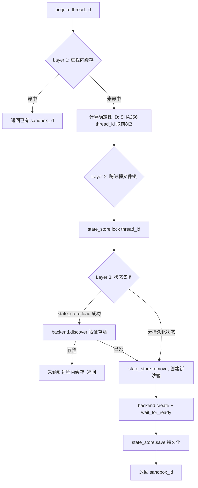
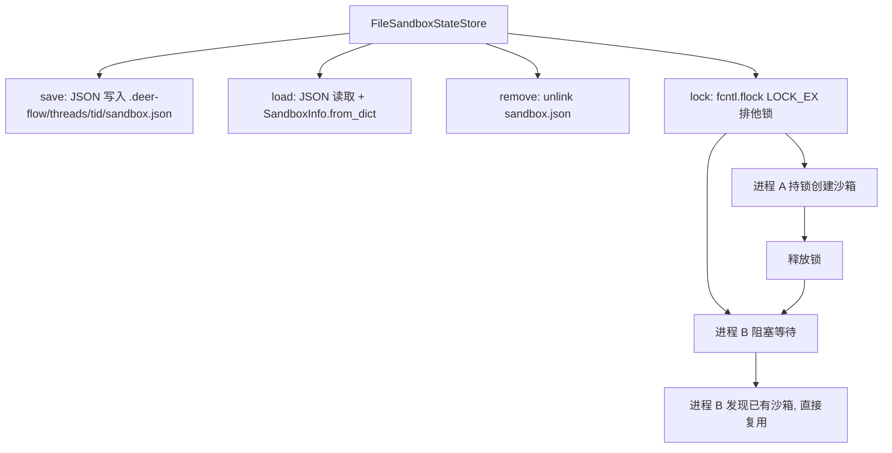

# PD-05.03 DeerFlow — 三层沙箱抽象与跨进程状态持久化

> 文档编号：PD-05.03
> 来源：DeerFlow `backend/src/sandbox/`, `backend/src/community/aio_sandbox/`
> GitHub：https://github.com/bytedance/deer-flow.git
> 问题域：PD-05 沙箱隔离 Sandbox Isolation
> 状态：可复用方案

---

## 第 1 章 问题与动机（≥ 30 行）

### 1.1 核心问题

Agent 系统中代码执行隔离面临三个层次的挑战：

1. **单进程内**：同一进程中多个 thread 共享沙箱实例，需要线程安全的 acquire/release
2. **跨进程**：gateway 进程和 langgraph worker 进程需要找到同一 thread 的沙箱，避免重复创建容器
3. **跨主机**：K8s 多 Pod 部署时，不同节点的 worker 需要共享沙箱映射状态

DeerFlow 2.0 的沙箱系统不仅解决了代码执行隔离，更重要的是解决了**跨进程沙箱发现**和**多运行时适配**两个工程难题。传统方案（如 MiroThinker 的 tmux 沙箱）只在单进程内管理状态，DeerFlow 通过三层一致性模型（进程内缓存 → 文件锁 + 状态持久化 → 后端发现）实现了真正的跨进程沙箱复用。

### 1.2 DeerFlow 的解法概述

1. **三层 ABC 抽象**：`Sandbox`（操作接口）→ `SandboxProvider`（生命周期管理）→ `SandboxBackend`（容器供给），每层职责清晰分离（`sandbox.py:4`, `sandbox_provider.py:8`, `backend.py:38`）
2. **配置驱动的 Provider 选择**：通过 `resolve_class(config.sandbox.use, SandboxProvider)` 动态加载 Provider 类，支持 `LocalSandboxProvider`（本地直接执行）和 `AioSandboxProvider`（容器化执行）两种模式（`sandbox_provider.py:54`）
3. **三层一致性获取**：`_acquire_internal` 方法实现 Layer 1 进程内缓存 → Layer 2 跨进程文件锁 + 状态恢复 → Layer 3 后端容器发现的三层 fallback（`aio_sandbox_provider.py:327-359`）
4. **确定性 ID 生成**：`SHA256(thread_id)[:8]` 确保所有进程对同一 thread 生成相同的 sandbox_id，无需共享内存即可跨进程发现（`aio_sandbox_provider.py:175-181`）
5. **双向虚拟路径翻译**：LocalSandbox 的 `_resolve_path` 和 `_reverse_resolve_paths_in_output` 实现输入翻译 + 输出反向翻译，Agent 始终看到 `/mnt/user-data/` 虚拟路径（`local_sandbox.py:22-103`）

### 1.3 设计思想

| 设计原则 | 具体实现 | 理由 | 替代方案 |
|----------|----------|------|----------|
| 三层 ABC 分离 | Sandbox/SandboxProvider/SandboxBackend 各自独立 | 操作、生命周期、供给三个关注点解耦 | 单一 God Class 管理一切 |
| 配置驱动多态 | `resolve_class()` 动态加载 Provider | 切换 Local/Docker/K8s 只改配置文件 | if-else 硬编码 |
| 确定性 ID | SHA256 哈希 thread_id 取前 8 位 | 跨进程无需通信即可推导同一 sandbox_id | UUID 随机 + 共享存储查询 |
| 懒初始化 | `ensure_sandbox_initialized()` 首次工具调用才创建 | 不是所有 Agent 都需要沙箱 | 启动时预创建 |
| 双向路径翻译 | 输入 resolve + 输出 reverse_resolve | Agent 看到一致的虚拟路径，不暴露宿主机真实路径 | 只做单向翻译 |
| 信号优雅关闭 | atexit + SIGTERM/SIGINT handler | 进程退出时释放所有容器资源 | 依赖 --rm 自动清理 |

---

## 第 2 章 源码实现分析（核心章节）

### 2.1 架构概览

DeerFlow 的沙箱系统由三层抽象组成，每层有明确的职责边界：

```
┌─────────────────────────────────────────────────────────────────┐
│                        Tool Layer                                │
│  bash_tool / ls_tool / read_file_tool / write_file_tool         │
│  → ensure_sandbox_initialized() 懒获取                          │
│  → replace_virtual_paths_in_command() 路径翻译                   │
├─────────────────────────────────────────────────────────────────┤
│                    SandboxMiddleware                              │
│  before_agent() → lazy_init / eager_init                         │
├─────────────────────────────────────────────────────────────────┤
│                    SandboxProvider (ABC)                          │
│  acquire(thread_id) → sandbox_id                                 │
│  get(sandbox_id) → Sandbox                                       │
│  release(sandbox_id)                                             │
│  ┌──────────────────────┐  ┌──────────────────────────────────┐ │
│  │ LocalSandboxProvider │  │ AioSandboxProvider               │ │
│  │ (单例, 无容器)        │  │ (三层一致性, 容器化)              │ │
│  └──────────────────────┘  └──────────────────────────────────┘ │
├─────────────────────────────────────────────────────────────────┤
│                    SandboxBackend (ABC)                           │
│  create / destroy / is_alive / discover                          │
│  ┌──────────────────────┐  ┌──────────────────────────────────┐ │
│  │ LocalContainerBackend│  │ RemoteSandboxBackend             │ │
│  │ (Docker/Apple Cont.) │  │ (K8s Provisioner HTTP)           │ │
│  └──────────────────────┘  └──────────────────────────────────┘ │
├─────────────────────────────────────────────────────────────────┤
│                    SandboxStateStore (ABC)                        │
│  save / load / remove / lock                                     │
│  ┌──────────────────────┐  ┌──────────────────────────────────┐ │
│  │ FileSandboxStateStore│  │ (TODO) RedisSandboxStateStore    │ │
│  │ (JSON + fcntl flock) │  │ (分布式多主机)                    │ │
│  └──────────────────────┘  └──────────────────────────────────┘ │
├─────────────────────────────────────────────────────────────────┤
│                    Sandbox (ABC)                                  │
│  execute_command / read_file / write_file / list_dir             │
│  ┌──────────────────────┐  ┌──────────────────────────────────┐ │
│  │ LocalSandbox         │  │ AioSandbox                       │ │
│  │ (subprocess 直接执行) │  │ (HTTP API → 容器内执行)           │ │
│  └──────────────────────┘  └──────────────────────────────────┘ │
└─────────────────────────────────────────────────────────────────┘
```

### 2.2 核心实现

#### 2.2.1 三层一致性获取（AioSandboxProvider）



对应源码 `aio_sandbox_provider.py:327-359`：

```python
def _acquire_internal(self, thread_id: str | None) -> str:
    """Internal sandbox acquisition with three-layer consistency.

    Layer 1: In-process cache (fastest, covers same-process repeated access)
    Layer 2: Cross-process state store + file lock (covers multi-process)
    Layer 3: Backend discovery (covers containers started by other processes)
    """
    # ── Layer 1: In-process cache (fast path) ──
    if thread_id:
        with self._lock:
            if thread_id in self._thread_sandboxes:
                existing_id = self._thread_sandboxes[thread_id]
                if existing_id in self._sandboxes:
                    self._last_activity[existing_id] = time.time()
                    return existing_id
                else:
                    del self._thread_sandboxes[thread_id]

    sandbox_id = self._deterministic_sandbox_id(thread_id) if thread_id else str(uuid.uuid4())[:8]

    # ── Layer 2 & 3: Cross-process recovery + creation ──
    if thread_id:
        with self._state_store.lock(thread_id):
            recovered_id = self._try_recover(thread_id)
            if recovered_id is not None:
                return recovered_id
            return self._create_sandbox(thread_id, sandbox_id)
    else:
        return self._create_sandbox(thread_id, sandbox_id)
```

#### 2.2.2 跨进程文件锁与状态持久化



对应源码 `file_state_store.py:81-102`：

```python
@contextmanager
def lock(self, thread_id: str) -> Generator[None, None, None]:
    """Acquire a cross-process file lock using fcntl.flock."""
    thread_dir = self._thread_dir(thread_id)
    os.makedirs(thread_dir, exist_ok=True)
    lock_path = thread_dir / SANDBOX_LOCK_FILE
    lock_file = open(lock_path, "w")
    try:
        fcntl.flock(lock_file.fileno(), fcntl.LOCK_EX)
        yield
    finally:
        try:
            fcntl.flock(lock_file.fileno(), fcntl.LOCK_UN)
            lock_file.close()
        except OSError:
            pass
```

#### 2.2.3 双向虚拟路径翻译（LocalSandbox）


对应源码 `local_sandbox.py:22-43` 和 `local_sandbox.py:69-103`：

```python
def _resolve_path(self, path: str) -> str:
    """Resolve container path to actual local path using mappings."""
    path_str = str(path)
    for container_path, local_path in sorted(
        self.path_mappings.items(), key=lambda x: len(x[0]), reverse=True
    ):
        if path_str.startswith(container_path):
            relative = path_str[len(container_path):].lstrip("/")
            resolved = str(Path(local_path) / relative) if relative else local_path
            return resolved
    return path_str

def _reverse_resolve_paths_in_output(self, output: str) -> str:
    """Reverse resolve local paths back to container paths in output string."""
    sorted_mappings = sorted(
        self.path_mappings.items(), key=lambda x: len(x[1]), reverse=True
    )
    result = output
    for container_path, local_path in sorted_mappings:
        local_path_resolved = str(Path(local_path).resolve())
        escaped_local = re.escape(local_path_resolved)
        pattern = re.compile(escaped_local + r"(?:/[^\s\"';&|<>()]*)?")
        result = pattern.sub(
            lambda m: self._reverse_resolve_path(m.group(0)), result
        )
    return result
```

### 2.3 实现细节

#### 多运行时自动检测

`LocalContainerBackend` 在 macOS 上优先使用 Apple Container，不可用时降级到 Docker（`local_backend.py:63-88`）：

```python
def _detect_runtime(self) -> str:
    if platform.system() == "Darwin":
        try:
            result = subprocess.run(
                ["container", "--version"],
                capture_output=True, text=True, check=True, timeout=5,
            )
            return "container"
        except (FileNotFoundError, subprocess.CalledProcessError, subprocess.TimeoutExpired):
            pass
    return "docker"
```

#### 空闲超时回收

后台守护线程每 60 秒扫描一次，超过 `idle_timeout`（默认 600s）的沙箱自动释放（`aio_sandbox_provider.py:236-270`）。

#### 信号处理优雅关闭

注册 SIGTERM/SIGINT handler，进程退出前释放所有沙箱。保存原始 handler 并在自身清理后链式调用（`aio_sandbox_provider.py:274-292`）。

#### 懒初始化工具层

`ensure_sandbox_initialized()` 在首次工具调用时才 acquire 沙箱，并将 sandbox_id 写入 `runtime.state["sandbox"]` 持久化到 LangGraph 状态中（`tools.py:141-192`）。


---

## 第 3 章 迁移指南

### 3.1 迁移清单

**阶段 1：基础抽象层（必须）**

- [ ] 定义 `Sandbox` ABC：`execute_command`, `read_file`, `write_file`, `list_dir`, `update_file`
- [ ] 定义 `SandboxProvider` ABC：`acquire(thread_id) → sandbox_id`, `get(sandbox_id) → Sandbox`, `release(sandbox_id)`
- [ ] 实现 `LocalSandbox`：subprocess 直接执行，带路径映射
- [ ] 实现 `LocalSandboxProvider`：单例模式，无容器开销

**阶段 2：容器化支持（按需）**

- [ ] 定义 `SandboxBackend` ABC：`create`, `destroy`, `is_alive`, `discover`
- [ ] 实现 `LocalContainerBackend`：Docker/Apple Container 自动检测
- [ ] 实现 `SandboxStateStore` ABC + `FileSandboxStateStore`：JSON + fcntl 文件锁
- [ ] 实现 `AioSandboxProvider`：三层一致性获取 + 空闲超时回收

**阶段 3：生产加固（可选）**

- [ ] 实现 `RemoteSandboxBackend`：K8s Provisioner HTTP 客户端
- [ ] 实现 `RedisSandboxStateStore`：分布式多主机状态共享
- [ ] 添加信号处理和 atexit 优雅关闭
- [ ] 添加 SandboxMiddleware 集成到 LangGraph Agent

### 3.2 适配代码模板

以下是可直接复用的最小沙箱抽象层实现：

```python
"""minimal_sandbox.py — 可直接复用的沙箱抽象层骨架"""
from abc import ABC, abstractmethod
import hashlib
import threading
import time
import subprocess
from pathlib import Path
from dataclasses import dataclass, field


# ── Layer 1: Sandbox 操作接口 ──
class Sandbox(ABC):
    def __init__(self, id: str):
        self._id = id

    @property
    def id(self) -> str:
        return self._id

    @abstractmethod
    def execute_command(self, command: str) -> str: ...

    @abstractmethod
    def read_file(self, path: str) -> str: ...

    @abstractmethod
    def write_file(self, path: str, content: str) -> None: ...


class LocalSandbox(Sandbox):
    """无容器的本地沙箱，适合开发环境。"""
    def __init__(self, id: str, path_mappings: dict[str, str] | None = None):
        super().__init__(id)
        self._mappings = path_mappings or {}

    def _resolve(self, path: str) -> str:
        for virt, real in sorted(self._mappings.items(), key=lambda x: -len(x[0])):
            if path.startswith(virt):
                return str(Path(real) / path[len(virt):].lstrip("/"))
        return path

    def execute_command(self, command: str) -> str:
        for virt, real in self._mappings.items():
            command = command.replace(virt, real)
        r = subprocess.run(command, shell=True, capture_output=True, text=True, timeout=600)
        output = r.stdout + (f"\nStderr: {r.stderr}" if r.stderr else "")
        return output or "(no output)"

    def read_file(self, path: str) -> str:
        return Path(self._resolve(path)).read_text()

    def write_file(self, path: str, content: str) -> None:
        p = Path(self._resolve(path))
        p.parent.mkdir(parents=True, exist_ok=True)
        p.write_text(content)


# ── Layer 2: Provider 生命周期管理 ──
class SandboxProvider(ABC):
    @abstractmethod
    def acquire(self, thread_id: str | None = None) -> str: ...

    @abstractmethod
    def get(self, sandbox_id: str) -> Sandbox | None: ...

    @abstractmethod
    def release(self, sandbox_id: str) -> None: ...


@dataclass
class SandboxInfo:
    sandbox_id: str
    sandbox_url: str
    container_name: str | None = None
    created_at: float = field(default_factory=time.time)


class ContainerSandboxProvider(SandboxProvider):
    """带跨进程一致性的容器化 Provider（简化版）。"""
    def __init__(self):
        self._lock = threading.Lock()
        self._sandboxes: dict[str, Sandbox] = {}
        self._thread_map: dict[str, str] = {}
        self._last_activity: dict[str, float] = {}

    @staticmethod
    def _deterministic_id(thread_id: str) -> str:
        return hashlib.sha256(thread_id.encode()).hexdigest()[:8]

    def acquire(self, thread_id: str | None = None) -> str:
        if not thread_id:
            import uuid
            return self._create(str(uuid.uuid4())[:8])

        with self._lock:
            if thread_id in self._thread_map:
                sid = self._thread_map[thread_id]
                if sid in self._sandboxes:
                    self._last_activity[sid] = time.time()
                    return sid

        sid = self._deterministic_id(thread_id)
        # 此处可加 fcntl 文件锁实现跨进程互斥
        return self._create(sid, thread_id)

    def _create(self, sandbox_id: str, thread_id: str | None = None) -> str:
        # 替换为实际的容器启动逻辑
        sandbox = LocalSandbox(sandbox_id)
        with self._lock:
            self._sandboxes[sandbox_id] = sandbox
            self._last_activity[sandbox_id] = time.time()
            if thread_id:
                self._thread_map[thread_id] = sandbox_id
        return sandbox_id

    def get(self, sandbox_id: str) -> Sandbox | None:
        with self._lock:
            s = self._sandboxes.get(sandbox_id)
            if s:
                self._last_activity[sandbox_id] = time.time()
            return s

    def release(self, sandbox_id: str) -> None:
        with self._lock:
            self._sandboxes.pop(sandbox_id, None)
            self._last_activity.pop(sandbox_id, None)
            self._thread_map = {
                t: s for t, s in self._thread_map.items() if s != sandbox_id
            }
```

### 3.3 适用场景

| 场景 | 适用度 | 说明 |
|------|--------|------|
| 多 Agent 并行执行代码 | ⭐⭐⭐ | 三层一致性确保不重复创建容器 |
| 开发环境快速迭代 | ⭐⭐⭐ | LocalSandbox 零容器开销 |
| K8s 多 Pod 部署 | ⭐⭐⭐ | RemoteBackend + Provisioner 动态创建 Pod |
| 单用户桌面应用 | ⭐⭐ | LocalSandboxProvider 单例即可，不需要完整三层 |
| 高安全隔离（金融/医疗） | ⭐⭐ | 需要额外的网络隔离和 seccomp 策略 |

---

## 第 4 章 测试用例

```python
"""test_sandbox.py — 基于 DeerFlow 真实接口的测试用例"""
import json
import os
import tempfile
import threading
import time
from pathlib import Path
from unittest.mock import MagicMock, patch

import pytest


# ── 测试 Sandbox ABC 和 LocalSandbox ──

class TestLocalSandbox:
    """测试 LocalSandbox 的路径映射和命令执行。"""

    def test_resolve_path_with_mapping(self):
        """验证虚拟路径正确映射到本地路径。"""
        sandbox = LocalSandbox("test", path_mappings={
            "/mnt/skills": "/tmp/test-skills",
            "/mnt/user-data": "/tmp/test-data",
        })
        assert sandbox._resolve("/mnt/skills/tool.py") == "/tmp/test-skills/tool.py"
        assert sandbox._resolve("/mnt/user-data/workspace/main.py") == "/tmp/test-data/workspace/main.py"
        assert sandbox._resolve("/other/path") == "/other/path"

    def test_resolve_longest_prefix_first(self):
        """验证最长前缀优先匹配。"""
        sandbox = LocalSandbox("test", path_mappings={
            "/mnt": "/tmp/mnt",
            "/mnt/user-data": "/tmp/data",
        })
        # /mnt/user-data 更长，应优先匹配
        assert sandbox._resolve("/mnt/user-data/file.txt") == "/tmp/data/file.txt"

    def test_execute_command(self):
        """验证命令执行和路径翻译。"""
        sandbox = LocalSandbox("test")
        result = sandbox.execute_command("echo hello")
        assert "hello" in result

    def test_write_and_read_file(self):
        """验证文件读写。"""
        with tempfile.TemporaryDirectory() as tmpdir:
            sandbox = LocalSandbox("test")
            path = f"{tmpdir}/test.txt"
            sandbox.write_file(path, "hello world")
            content = sandbox.read_file(path)
            assert content == "hello world"


# ── 测试确定性 ID 生成 ──

class TestDeterministicId:
    """测试跨进程确定性 sandbox_id 生成。"""

    def test_same_thread_same_id(self):
        """同一 thread_id 在不同进程中生成相同 sandbox_id。"""
        import hashlib
        thread_id = "thread-abc-123"
        id1 = hashlib.sha256(thread_id.encode()).hexdigest()[:8]
        id2 = hashlib.sha256(thread_id.encode()).hexdigest()[:8]
        assert id1 == id2

    def test_different_threads_different_ids(self):
        """不同 thread_id 生成不同 sandbox_id。"""
        import hashlib
        id1 = hashlib.sha256("thread-1".encode()).hexdigest()[:8]
        id2 = hashlib.sha256("thread-2".encode()).hexdigest()[:8]
        assert id1 != id2


# ── 测试 FileSandboxStateStore ──

class TestFileSandboxStateStore:
    """测试文件级状态持久化和跨进程锁。"""

    def test_save_and_load(self):
        """验证状态保存和加载。"""
        with tempfile.TemporaryDirectory() as tmpdir:
            store = FileSandboxStateStore(base_dir=tmpdir)
            info = SandboxInfo(sandbox_id="abc123", sandbox_url="http://localhost:8080")
            store.save("thread-1", info)
            loaded = store.load("thread-1")
            assert loaded is not None
            assert loaded.sandbox_id == "abc123"
            assert loaded.sandbox_url == "http://localhost:8080"

    def test_remove(self):
        """验证状态删除。"""
        with tempfile.TemporaryDirectory() as tmpdir:
            store = FileSandboxStateStore(base_dir=tmpdir)
            info = SandboxInfo(sandbox_id="abc123", sandbox_url="http://localhost:8080")
            store.save("thread-1", info)
            store.remove("thread-1")
            assert store.load("thread-1") is None

    def test_load_nonexistent(self):
        """验证加载不存在的状态返回 None。"""
        with tempfile.TemporaryDirectory() as tmpdir:
            store = FileSandboxStateStore(base_dir=tmpdir)
            assert store.load("nonexistent") is None

    def test_concurrent_lock(self):
        """验证跨线程文件锁互斥。"""
        with tempfile.TemporaryDirectory() as tmpdir:
            store = FileSandboxStateStore(base_dir=tmpdir)
            results = []

            def worker(n):
                with store.lock("thread-1"):
                    results.append(f"start-{n}")
                    time.sleep(0.1)
                    results.append(f"end-{n}")

            t1 = threading.Thread(target=worker, args=(1,))
            t2 = threading.Thread(target=worker, args=(2,))
            t1.start(); t2.start()
            t1.join(); t2.join()

            # 锁保证不会交错：start-1, start-2, end-1, end-2 不会出现
            assert results[0].startswith("start-")
            assert results[1].startswith("end-")


# ── 测试空闲超时回收 ──

class TestIdleTimeout:
    """测试沙箱空闲超时回收。"""

    def test_idle_sandbox_released(self):
        """验证超时沙箱被自动释放。"""
        provider = ContainerSandboxProvider()
        sid = provider.acquire("thread-1")
        # 模拟超时
        provider._last_activity[sid] = time.time() - 700  # 超过 600s
        provider._cleanup_idle_sandboxes = lambda t: None  # 简化测试
        assert provider.get(sid) is not None
```


---

## 第 5 章 跨域关联

| 关联域 | 关系类型 | 说明 |
|--------|----------|------|
| PD-01 上下文管理 | 协同 | 沙箱内执行结果需要截断后注入 Agent 上下文，输出截断策略（成功取头/错误取尾）影响 LLM 理解 |
| PD-02 多 Agent 编排 | 依赖 | AioSandboxProvider 的三层一致性获取确保多 worker 进程共享同一 thread 的沙箱 |
| PD-04 工具系统 | 依赖 | bash_tool/ls_tool/read_file_tool 等工具通过 `ensure_sandbox_initialized()` 懒获取沙箱 |
| PD-06 记忆持久化 | 协同 | FileSandboxStateStore 的 JSON 持久化模式与记忆系统的文件持久化模式一致 |
| PD-10 中间件管道 | 协同 | SandboxMiddleware 作为 LangGraph AgentMiddleware 在 before_agent 阶段注入沙箱状态 |
| PD-11 可观测性 | 协同 | 沙箱创建/释放/超时回收事件通过 logging 记录，可接入结构化日志系统 |

---

## 第 6 章 来源文件索引

| 文件 | 行范围 | 关键实现 |
|------|--------|----------|
| `backend/src/sandbox/sandbox.py` | L1-L73 | Sandbox ABC：5 个抽象方法定义 |
| `backend/src/sandbox/sandbox_provider.py` | L1-L97 | SandboxProvider ABC + 单例管理 + resolve_class 动态加载 |
| `backend/src/sandbox/consts.py` | L1-L5 | THREAD_DATA_BASE_DIR 和 VIRTUAL_PATH_PREFIX 常量 |
| `backend/src/sandbox/exceptions.py` | L1-L72 | 6 级异常层次：SandboxError → NotFound/Runtime/Command/File/Permission |
| `backend/src/sandbox/tools.py` | L1-L404 | 5 个沙箱工具 + 虚拟路径翻译 + 懒初始化 |
| `backend/src/sandbox/middleware.py` | L1-L61 | SandboxMiddleware：lazy_init 控制获取时机 |
| `backend/src/sandbox/local/local_sandbox.py` | L1-L184 | LocalSandbox：双向路径翻译 + subprocess 执行 |
| `backend/src/sandbox/local/local_sandbox_provider.py` | L1-L61 | LocalSandboxProvider：单例模式 + skills 路径映射 |
| `backend/src/community/aio_sandbox/aio_sandbox_provider.py` | L1-L498 | AioSandboxProvider：三层一致性 + 空闲回收 + 信号处理 |
| `backend/src/community/aio_sandbox/aio_sandbox.py` | L1-L129 | AioSandbox：HTTP API 客户端 + base64 二进制写入 |
| `backend/src/community/aio_sandbox/backend.py` | L1-L99 | SandboxBackend ABC + wait_for_sandbox_ready 健康检查 |
| `backend/src/community/aio_sandbox/local_backend.py` | L1-L295 | LocalContainerBackend：Docker/Apple Container 自动检测 + 端口分配 |
| `backend/src/community/aio_sandbox/remote_backend.py` | L1-L158 | RemoteSandboxBackend：K8s Provisioner HTTP 客户端 |
| `backend/src/community/aio_sandbox/state_store.py` | L1-L71 | SandboxStateStore ABC：save/load/remove/lock |
| `backend/src/community/aio_sandbox/file_state_store.py` | L1-L103 | FileSandboxStateStore：JSON + fcntl.flock 跨进程锁 |
| `backend/src/community/aio_sandbox/sandbox_info.py` | L1-L42 | SandboxInfo dataclass：跨进程发现元数据 |
| `backend/src/config/sandbox_config.py` | L1-L67 | SandboxConfig Pydantic 模型：12 个配置字段 |
| `backend/src/reflection/resolvers.py` | L1-L72 | resolve_class：配置驱动的动态类加载 |

---

## 第 7 章 横向对比维度

```json comparison_data
{
  "project": "DeerFlow",
  "dimensions": {
    "隔离级别": "三级：LocalSandbox 无隔离 / Docker 容器 / K8s Pod",
    "虚拟路径": "/mnt/user-data 双向翻译，LocalSandbox 正反向 regex 替换",
    "生命周期管理": "三层一致性获取 + 空闲超时回收 + 信号优雅关闭",
    "防御性设计": "结构化异常层次（6 级），工具层统一 try-except",
    "跨进程发现": "SHA256 确定性 ID + fcntl 文件锁 + JSON 状态持久化",
    "多运行时支持": "macOS Apple Container 优先，降级 Docker，远程 K8s Provisioner",
    "资源池化": "空闲超时回收（默认 600s），守护线程 60s 轮询",
    "上下文持久化": "FileSandboxStateStore JSON + fcntl，预留 Redis 扩展点",
    "工具访问控制": "5 个沙箱工具（bash/ls/read/write/str_replace）统一懒初始化",
    "Scope 粒度": "thread 级：每个 thread_id 独立沙箱，workspace/uploads/outputs 三目录隔离",
    "自定义模板": "Pydantic SandboxConfig 12 字段，image/mounts/environment 全可配",
    "配置驱动选择": "resolve_class 动态加载 Provider，切换模式只改 config.yaml"
  }
}
```

### 域元数据补充

```json domain_metadata
{
  "solution_summary": "DeerFlow 用三层 ABC 抽象（Sandbox/Provider/Backend）+ SHA256 确定性 ID + fcntl 文件锁实现跨进程沙箱发现与复用，支持 Local/Docker/K8s 三种运行时自动切换",
  "description": "跨进程沙箱一致性：多 worker 进程如何发现并复用同一 thread 的已有沙箱",
  "sub_problems": [
    "空闲沙箱回收：守护线程定期扫描超时沙箱的轮询间隔与误杀风险",
    "信号链式传递：自定义 SIGTERM handler 清理后需恢复原始 handler 避免吞信号",
    "环境变量引用解析：配置中 $VAR 引用需在容器启动前从宿主机 env 解析",
    "健康检查轮询：容器启动后 wait_for_ready 的超时与轮询间隔平衡"
  ],
  "best_practices": [
    "确定性 ID 是跨进程发现的关键：SHA256(thread_id) 让所有进程推导出相同 sandbox_id",
    "三层 fallback 保证一致性：进程缓存 → 文件锁+持久化 → 后端发现，逐层降速但覆盖更广",
    "信号处理必须链式调用：保存原始 handler，自身清理后恢复，避免吞掉其他组件的信号",
    "配置驱动 Provider 选择：resolve_class 动态加载，开发用 Local、生产用 Aio，零代码切换"
  ]
}
```
