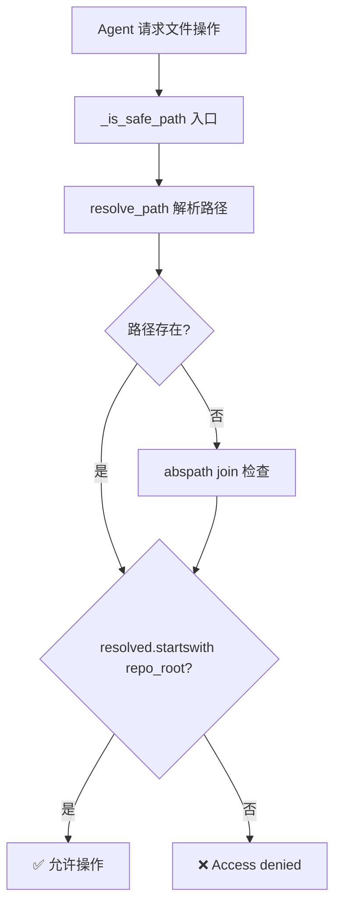
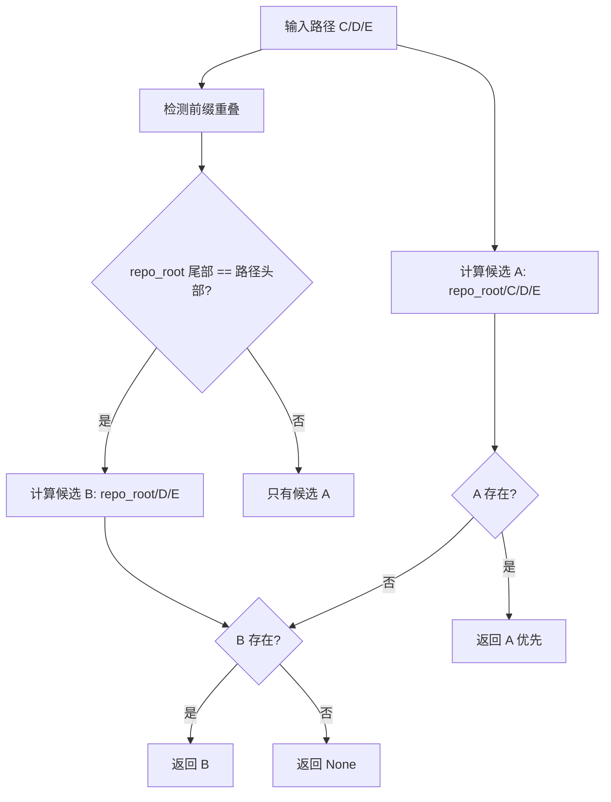
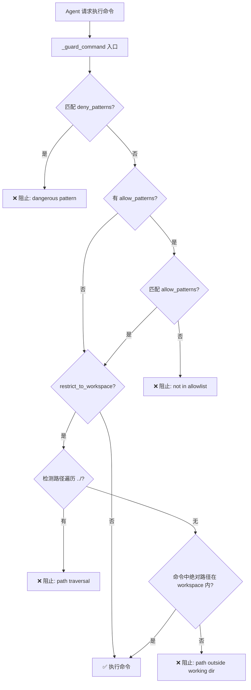

# PD-05.10 FastCode — 双系统路径边界与命令黑名单沙箱

> 文档编号：PD-05.10
> 来源：FastCode `fastcode/agent_tools.py` `nanobot/nanobot/agent/tools/shell.py` `nanobot/nanobot/agent/tools/filesystem.py`
> GitHub：https://github.com/HKUDS/FastCode.git
> 问题域：PD-05 沙箱隔离 Sandbox Isolation
> 状态：可复用方案

---

## 第 1 章 问题与动机

### 1.1 核心问题

Agent 系统需要让 LLM 驱动的代理执行文件读写和 Shell 命令，但不能让代理逃逸出指定的工作目录。FastCode 项目包含两个独立系统——FastCode 核心引擎（代码理解/RAG）和 Nanobot 多通道 Agent 框架——它们各自面临相同的安全问题：

1. **路径遍历攻击**：LLM 可能生成 `../../etc/passwd` 这样的路径，突破工作目录边界
2. **危险命令执行**：LLM 可能生成 `rm -rf /`、`dd if=/dev/zero` 等破坏性命令
3. **子代理权限膨胀**：子代理不应拥有与主代理相同的工具集和会话历史
4. **双系统一致性**：FastCode 和 Nanobot 各自实现安全检查，需要保持防御策略一致

### 1.2 FastCode 的解法概述

FastCode 采用**应用层路径边界 + 命令黑名单**的轻量级沙箱方案，不依赖 Docker 或操作系统级隔离：

1. **PathUtils 集中路径安全检查**：所有文件操作通过 `PathUtils.is_safe_path()` 验证路径在 `repo_root` 内（`fastcode/path_utils.py:246-265`）
2. **智能路径解析防重叠**：`resolve_path()` 处理 repo_root 与输入路径的前缀重叠问题，避免误判（`fastcode/path_utils.py:162-244`）
3. **ExecTool 命令黑名单**：正则匹配 8 类危险命令模式（rm -rf、dd、fork bomb 等），阻止执行（`nanobot/nanobot/agent/tools/shell.py:25-34`）
4. **restrict_to_workspace 全局开关**：一个布尔值控制所有工具（文件读写 + Shell）的路径限制（`nanobot/nanobot/agent/loop.py:48,82-93`）
5. **子代理工具裁剪**：子代理不注册 MessageTool 和 SpawnTool，无法发消息或再生子代理（`nanobot/nanobot/agent/subagent.py:99-111`）

### 1.3 设计思想

| 设计原则 | 具体实现 | 理由 | 替代方案 |
|----------|----------|------|----------|
| 应用层防御优先 | PathUtils + _guard_command 纯 Python 实现 | 零依赖，任何环境可用，不需要 Docker | OS 级沙箱（Docker/gVisor） |
| 集中式路径验证 | PathUtils 类封装所有路径操作 | 避免每个工具重复实现安全检查 | 每个工具各自验证 |
| 黑名单 + 白名单双模式 | deny_patterns 默认启用，allow_patterns 可选 | 黑名单防已知危险，白名单可进一步收紧 | 纯白名单（过于严格） |
| 最小权限子代理 | 子代理无 message/spawn/cron 工具 | 防止子代理发消息或无限递归生成子代理 | 共享主代理全部工具 |
| 配置驱动隔离级别 | restrict_to_workspace 布尔开关 | 开发时关闭方便调试，生产时开启 | 硬编码始终限制 |

---

## 第 2 章 源码实现分析

### 2.1 架构概览

FastCode 的沙箱隔离分为两个独立但平行的系统：

```
┌─────────────────────────────────────────────────────────────┐
│                    FastCode 核心引擎                          │
│  ┌──────────────┐    ┌──────────────┐    ┌──────────────┐   │
│  │  AgentTools   │───→│  PathUtils   │───→│  repo_root   │   │
│  │ (agent_tools) │    │ (path_utils) │    │  边界检查     │   │
│  └──────────────┘    └──────────────┘    └──────────────┘   │
│  每个方法入口调用 _is_safe_path()                              │
├─────────────────────────────────────────────────────────────┤
│                    Nanobot Agent 框架                         │
│  ┌──────────────┐    ┌──────────────┐    ┌──────────────┐   │
│  │  AgentLoop    │───→│  ToolRegistry│───→│  各 Tool 实例 │   │
│  │ (loop.py)     │    │              │    │  allowed_dir  │   │
│  └──────┬───────┘    └──────────────┘    └──────────────┘   │
│         │                                                    │
│  ┌──────▼───────┐    ┌──────────────┐                       │
│  │SubagentMgr   │───→│  裁剪版 Tools │                       │
│  │(subagent.py)  │    │ 无 msg/spawn │                       │
│  └──────────────┘    └──────────────┘                       │
└─────────────────────────────────────────────────────────────┘
```

### 2.2 核心实现

#### 2.2.1 PathUtils 路径安全边界



对应源码 `fastcode/path_utils.py:246-265`：

```python
class PathUtils:
    def __init__(self, repo_root: str):
        self.repo_root = os.path.abspath(repo_root)
        # Security: ensure repo_root exists and is a directory
        if not os.path.isdir(self.repo_root):
            raise ValueError(f"Repository root does not exist or is not a directory: {self.repo_root}")

    def is_safe_path(self, path: str) -> bool:
        try:
            resolved = self.resolve_path(path)
            if resolved is None:
                # Also check if the joined path would be safe (even if doesn't exist yet)
                abs_path = os.path.abspath(os.path.join(self.repo_root, path))
                return abs_path.startswith(self.repo_root)
            return resolved.startswith(self.repo_root)
        except Exception as e:
            self.logger.warning(f"Path security check failed for {path}: {e}")
            return False
```

关键细节：
- 构造时验证 `repo_root` 必须是已存在的目录（`path_utils.py:159-160`）
- 路径不存在时仍做安全检查（`path_utils.py:259-261`），防止创建文件时逃逸
- 所有异常都返回 `False`（安全默认值）

#### 2.2.2 智能路径解析（防重叠）



对应源码 `fastcode/path_utils.py:162-244`：

```python
def resolve_path(self, path: str) -> Optional[str]:
    # 1. Prepare two candidate paths
    path_a = os.path.abspath(os.path.join(self.repo_root, path))

    # 2. Smart dedup: find overlap between repo_root tail and path head
    root_parts = norm_root.split(os.sep)
    input_parts = norm_path.split(os.sep)
    overlap_len = 0
    min_len = min(len(root_parts), len(input_parts))
    for i in range(min_len, 0, -1):
        if root_parts[-i:] == input_parts[:i]:
            overlap_len = i
            break

    if overlap_len > 0:
        remaining_parts = input_parts[overlap_len:]
        if remaining_parts:
            path_b = os.path.abspath(os.path.join(self.repo_root, *remaining_parts))
        else:
            path_b = self.repo_root

    # 3. Decision: A exists → A; B exists → B; neither → None
    if exists_a and exists_b:
        return path_a  # Direct join wins on ambiguity
    elif exists_a:
        return path_a
    elif exists_b:
        return path_b
    else:
        return None
```

这个设计解决了一个实际问题：当 `repo_root` 是 `/User/project/A/B/C`，LLM 输出路径 `C/D/E` 时，直接拼接会得到 `/User/project/A/B/C/C/D/E`（不存在），而智能去重得到 `/User/project/A/B/C/D/E`（正确路径）。

#### 2.2.3 ExecTool 命令黑名单



对应源码 `nanobot/nanobot/agent/tools/shell.py:25-141`：

```python
class ExecTool(Tool):
    def __init__(self, timeout: int = 60, working_dir: str | None = None,
                 deny_patterns: list[str] | None = None,
                 allow_patterns: list[str] | None = None,
                 restrict_to_workspace: bool = False):
        self.deny_patterns = deny_patterns or [
            r"\brm\s+-[rf]{1,2}\b",          # rm -r, rm -rf, rm -fr
            r"\bdel\s+/[fq]\b",              # del /f, del /q (Windows)
            r"\brmdir\s+/s\b",               # rmdir /s (Windows)
            r"\b(format|mkfs|diskpart)\b",   # disk operations
            r"\bdd\s+if=",                   # dd
            r">\s*/dev/sd",                  # write to disk
            r"\b(shutdown|reboot|poweroff)\b",  # system power
            r":\(\)\s*\{.*\};\s*:",          # fork bomb
        ]

    def _guard_command(self, command: str, cwd: str) -> str | None:
        cmd = command.strip()
        lower = cmd.lower()
        # 1. Deny patterns check
        for pattern in self.deny_patterns:
            if re.search(pattern, lower):
                return "Error: Command blocked by safety guard (dangerous pattern detected)"
        # 2. Allow patterns check (if configured)
        if self.allow_patterns:
            if not any(re.search(p, lower) for p in self.allow_patterns):
                return "Error: Command blocked by safety guard (not in allowlist)"
        # 3. Workspace restriction
        if self.restrict_to_workspace:
            if "..\\" in cmd or "../" in cmd:
                return "Error: Command blocked by safety guard (path traversal detected)"
            # Check absolute paths in command
            cwd_path = Path(cwd).resolve()
            win_paths = re.findall(r"[A-Za-z]:\\[^\\\"']+", cmd)
            posix_paths = re.findall(r"/[^\s\"']+", cmd)
            for raw in win_paths + posix_paths:
                try:
                    p = Path(raw).resolve()
                except Exception:
                    continue
                if cwd_path not in p.parents and p != cwd_path:
                    return "Error: Command blocked by safety guard (path outside working dir)"
        return None
```

注意黑名单同时覆盖 POSIX（`rm -rf`）和 Windows（`del /f`、`rmdir /s`）命令变体，这是跨平台防御的体现。

### 2.3 实现细节

#### Nanobot 文件工具的 allowed_dir 机制

`_resolve_path` 函数是所有文件工具（ReadFileTool、WriteFileTool、EditFileTool、ListDirTool）的统一入口（`nanobot/nanobot/agent/tools/filesystem.py:9-14`）：

```python
def _resolve_path(path: str, allowed_dir: Path | None = None) -> Path:
    """Resolve path and optionally enforce directory restriction."""
    resolved = Path(path).expanduser().resolve()
    if allowed_dir and not str(resolved).startswith(str(allowed_dir.resolve())):
        raise PermissionError(f"Path {path} is outside allowed directory {allowed_dir}")
    return resolved
```

AgentLoop 在注册工具时根据 `restrict_to_workspace` 决定是否传入 `allowed_dir`（`nanobot/nanobot/agent/loop.py:82-86`）：

```python
allowed_dir = self.workspace if self.restrict_to_workspace else None
self.tools.register(ReadFileTool(allowed_dir=allowed_dir))
self.tools.register(WriteFileTool(allowed_dir=allowed_dir))
self.tools.register(EditFileTool(allowed_dir=allowed_dir))
self.tools.register(ListDirTool(allowed_dir=allowed_dir))
```

#### 子代理工具裁剪

SubagentManager 在 `_run_subagent` 中创建独立的 ToolRegistry，只注册文件工具 + Shell + Web 工具，不注册 MessageTool、SpawnTool、CronTool（`nanobot/nanobot/agent/subagent.py:99-111`）：

```python
# Build subagent tools (no message tool, no spawn tool)
tools = ToolRegistry()
allowed_dir = self.workspace if self.restrict_to_workspace else None
tools.register(ReadFileTool(allowed_dir=allowed_dir))
tools.register(WriteFileTool(allowed_dir=allowed_dir))
tools.register(ListDirTool(allowed_dir=allowed_dir))
tools.register(ExecTool(
    working_dir=str(self.workspace),
    timeout=self.exec_config.timeout,
    restrict_to_workspace=self.restrict_to_workspace,
))
```

子代理还有独立的系统 prompt，明确声明"你不能发消息或生成子代理"（`subagent.py:229-236`），形成 prompt 层 + 工具层的双重限制。


---

## 第 3 章 迁移指南

### 3.1 迁移清单

**阶段 1：路径安全边界（1 个文件）**
- [ ] 复制 `PathUtils` 类到项目中，设置 `repo_root` 为工作目录
- [ ] 在所有文件操作入口调用 `is_safe_path()` 验证
- [ ] 处理路径不存在时的安全检查（创建新文件场景）

**阶段 2：命令黑名单（1 个文件）**
- [ ] 定义 `deny_patterns` 列表，覆盖 POSIX + Windows 危险命令
- [ ] 在 Shell 执行入口添加 `_guard_command()` 检查
- [ ] 可选：添加 `allow_patterns` 白名单进一步收紧

**阶段 3：工具级隔离（改造工具注册）**
- [ ] 为文件工具添加 `allowed_dir` 参数
- [ ] 添加 `restrict_to_workspace` 全局开关
- [ ] 子代理使用裁剪版工具集（移除消息/生成工具）

### 3.2 适配代码模板

#### 通用路径安全检查器

```python
import os
from pathlib import Path
from typing import Optional


class WorkspaceBoundary:
    """应用层路径安全边界，限制所有文件操作在 workspace 内。"""

    def __init__(self, workspace: str):
        self.workspace = os.path.abspath(workspace)
        if not os.path.isdir(self.workspace):
            raise ValueError(f"Workspace does not exist: {self.workspace}")

    def is_safe(self, path: str) -> bool:
        """检查路径是否在 workspace 内。"""
        try:
            abs_path = os.path.abspath(os.path.join(self.workspace, path))
            return abs_path.startswith(self.workspace)
        except Exception:
            return False

    def resolve(self, path: str) -> Optional[str]:
        """解析路径并验证安全性，返回绝对路径或 None。"""
        if not self.is_safe(path):
            return None
        full = os.path.abspath(os.path.join(self.workspace, path))
        return full if os.path.exists(full) else None

    def safe_read(self, path: str) -> str:
        """安全读取文件内容。"""
        resolved = self.resolve(path)
        if resolved is None:
            raise PermissionError(f"Access denied: {path}")
        with open(resolved, 'r', encoding='utf-8') as f:
            return f.read()
```

#### 命令安全守卫

```python
import re
from pathlib import Path


class CommandGuard:
    """Shell 命令安全守卫，黑名单 + 可选白名单 + 路径限制。"""

    DEFAULT_DENY = [
        r"\brm\s+-[rf]{1,2}\b",
        r"\bdel\s+/[fq]\b",
        r"\brmdir\s+/s\b",
        r"\b(format|mkfs|diskpart)\b",
        r"\bdd\s+if=",
        r">\s*/dev/sd",
        r"\b(shutdown|reboot|poweroff)\b",
        r":\(\)\s*\{.*\};\s*:",
    ]

    def __init__(
        self,
        workspace: str,
        deny_patterns: list[str] | None = None,
        restrict_paths: bool = True,
    ):
        self.workspace = Path(workspace).resolve()
        self.deny_patterns = deny_patterns or self.DEFAULT_DENY
        self.restrict_paths = restrict_paths

    def check(self, command: str) -> str | None:
        """返回错误消息（如果命令被阻止），否则返回 None。"""
        lower = command.strip().lower()

        for pattern in self.deny_patterns:
            if re.search(pattern, lower):
                return f"Blocked: dangerous pattern '{pattern}'"

        if self.restrict_paths:
            if "../" in command or "..\\" in command:
                return "Blocked: path traversal detected"
            for raw in re.findall(r"/[^\s\"']+", command):
                try:
                    p = Path(raw).resolve()
                    if self.workspace not in p.parents and p != self.workspace:
                        return f"Blocked: path {raw} outside workspace"
                except Exception:
                    continue
        return None
```

### 3.3 适用场景

| 场景 | 适用度 | 说明 |
|------|--------|------|
| 轻量级 Agent 框架 | ⭐⭐⭐ | 无需 Docker，纯 Python 实现，适合快速集成 |
| 代码理解/RAG 系统 | ⭐⭐⭐ | 只需读取权限，PathUtils 的只读模式完美匹配 |
| 多通道聊天 Bot | ⭐⭐⭐ | Nanobot 的 restrict_to_workspace 开关适合生产部署 |
| 需要执行不可信代码 | ⭐ | 应用层黑名单无法防御所有攻击，需要 Docker/gVisor |
| 多租户隔离 | ⭐ | 单进程内的路径检查不提供进程级隔离 |
| 高安全要求场景 | ⭐⭐ | 可作为第一层防御，但需配合 OS 级沙箱 |

---

## 第 4 章 测试用例

```python
import os
import tempfile
import pytest
from pathlib import Path


class TestWorkspaceBoundary:
    """测试路径安全边界。"""

    def setup_method(self):
        self.tmpdir = tempfile.mkdtemp()
        # 创建测试文件
        os.makedirs(os.path.join(self.tmpdir, "src"), exist_ok=True)
        with open(os.path.join(self.tmpdir, "src", "main.py"), "w") as f:
            f.write("print('hello')")

    def test_safe_path_within_workspace(self):
        """正常路径应通过安全检查。"""
        from fastcode.path_utils import PathUtils
        pu = PathUtils(self.tmpdir)
        assert pu.is_safe_path("src/main.py") is True
        assert pu.is_safe_path(".") is True

    def test_unsafe_path_traversal(self):
        """目录遍历路径应被拒绝。"""
        from fastcode.path_utils import PathUtils
        pu = PathUtils(self.tmpdir)
        assert pu.is_safe_path("../../etc/passwd") is False
        assert pu.is_safe_path("/etc/passwd") is False

    def test_resolve_path_overlap(self):
        """路径前缀重叠应正确解析。"""
        from fastcode.path_utils import PathUtils
        # 创建嵌套目录模拟重叠
        nested = os.path.join(self.tmpdir, "project")
        os.makedirs(os.path.join(nested, "src"), exist_ok=True)
        pu = PathUtils(nested)
        # 当 repo_root=/tmp/xxx/project, path=project/src 时
        # 应解析为 /tmp/xxx/project/src 而非 /tmp/xxx/project/project/src
        result = pu.resolve_path("src")
        assert result is not None
        assert result.endswith("src")

    def test_nonexistent_path_still_checked(self):
        """不存在的路径仍应做安全检查。"""
        from fastcode.path_utils import PathUtils
        pu = PathUtils(self.tmpdir)
        # 不存在但在 workspace 内 → safe
        assert pu.is_safe_path("nonexistent/file.py") is True
        # 不存在且在 workspace 外 → unsafe
        assert pu.is_safe_path("../../nonexistent") is False


class TestCommandGuard:
    """测试命令黑名单。"""

    def test_block_rm_rf(self):
        """rm -rf 应被阻止。"""
        from nanobot.nanobot.agent.tools.shell import ExecTool
        tool = ExecTool(restrict_to_workspace=True)
        result = tool._guard_command("rm -rf /", "/tmp/workspace")
        assert result is not None
        assert "blocked" in result.lower()

    def test_block_fork_bomb(self):
        """Fork bomb 应被阻止。"""
        from nanobot.nanobot.agent.tools.shell import ExecTool
        tool = ExecTool()
        result = tool._guard_command(":() { :|:& }; :", "/tmp")
        assert result is not None

    def test_block_windows_del(self):
        """Windows del /f 应被阻止。"""
        from nanobot.nanobot.agent.tools.shell import ExecTool
        tool = ExecTool()
        result = tool._guard_command("del /f important.txt", "/tmp")
        assert result is not None

    def test_allow_safe_command(self):
        """安全命令应被允许。"""
        from nanobot.nanobot.agent.tools.shell import ExecTool
        tool = ExecTool()
        result = tool._guard_command("ls -la", "/tmp")
        assert result is None

    def test_block_path_traversal_in_command(self):
        """命令中的路径遍历应被阻止。"""
        from nanobot.nanobot.agent.tools.shell import ExecTool
        tool = ExecTool(restrict_to_workspace=True)
        result = tool._guard_command("cat ../../etc/passwd", "/tmp/workspace")
        assert result is not None

    def test_block_absolute_path_outside_workspace(self):
        """workspace 外的绝对路径应被阻止。"""
        from nanobot.nanobot.agent.tools.shell import ExecTool
        tool = ExecTool(restrict_to_workspace=True)
        result = tool._guard_command("cat /etc/passwd", "/tmp/workspace")
        assert result is not None


class TestSubagentIsolation:
    """测试子代理工具裁剪。"""

    def test_subagent_no_message_tool(self):
        """子代理不应有 message 工具。"""
        # SubagentManager._run_subagent 中只注册了
        # ReadFileTool, WriteFileTool, ListDirTool, ExecTool,
        # WebSearchTool, WebFetchTool
        # 不包含 MessageTool, SpawnTool, CronTool
        expected_tools = {"read_file", "write_file", "list_dir", "exec",
                          "web_search", "web_fetch"}
        forbidden_tools = {"message", "spawn", "cron"}
        # 验证子代理工具集不包含禁止工具
        assert expected_tools & forbidden_tools == set()

    def test_subagent_inherits_workspace_restriction(self):
        """子代理应继承 restrict_to_workspace 设置。"""
        # SubagentManager 构造时接收 restrict_to_workspace
        # 并在 _run_subagent 中传递给每个工具
        # 这确保子代理不能绕过主代理的安全策略
        pass  # 集成测试需要完整的 provider mock
```


---

## 第 5 章 跨域关联

| 关联域 | 关系类型 | 说明 |
|--------|----------|------|
| PD-04 工具系统 | 依赖 | 沙箱隔离通过工具注册机制实现（ToolRegistry + allowed_dir 参数），工具系统是沙箱的载体 |
| PD-02 多 Agent 编排 | 协同 | SubagentManager 的工具裁剪是编排层面的隔离策略，子代理无法生成子代理防止递归爆炸 |
| PD-03 容错与重试 | 协同 | ExecTool 的 timeout 机制（默认 60s）防止命令无限执行，是容错的一部分 |
| PD-09 Human-in-the-Loop | 互补 | 当前方案是自动化防御，无人工审批环节；高安全场景可叠加 HitL 审批危险操作 |
| PD-01 上下文管理 | 协同 | 子代理有独立的 messages 列表和系统 prompt，不共享主代理会话历史，是上下文隔离 |

---

## 第 6 章 来源文件索引

| 文件 | 行范围 | 关键实现 |
|------|--------|----------|
| `fastcode/path_utils.py` | L145-L265 | PathUtils 类：路径安全边界核心，is_safe_path + resolve_path |
| `fastcode/path_utils.py` | L162-L244 | resolve_path：智能路径解析，处理前缀重叠 |
| `fastcode/agent_tools.py` | L15-L46 | AgentTools 类：所有方法入口调用 _is_safe_path |
| `fastcode/agent_tools.py` | L40-L46 | _is_safe_path 委托给 PathUtils |
| `nanobot/nanobot/agent/tools/shell.py` | L12-L141 | ExecTool：命令黑名单 + 路径限制 |
| `nanobot/nanobot/agent/tools/shell.py` | L25-L34 | deny_patterns：8 类危险命令正则 |
| `nanobot/nanobot/agent/tools/shell.py` | L111-L141 | _guard_command：三层安全检查 |
| `nanobot/nanobot/agent/tools/filesystem.py` | L9-L14 | _resolve_path：文件工具统一路径验证 |
| `nanobot/nanobot/agent/tools/filesystem.py` | L17-L57 | ReadFileTool：带 allowed_dir 的安全读取 |
| `nanobot/nanobot/agent/loop.py` | L38-L93 | AgentLoop.__init__ + _register_default_tools：restrict_to_workspace 开关 |
| `nanobot/nanobot/agent/subagent.py` | L20-L47 | SubagentManager：继承 restrict_to_workspace |
| `nanobot/nanobot/agent/subagent.py` | L88-L111 | _run_subagent：裁剪版工具注册（无 message/spawn/cron） |
| `nanobot/nanobot/agent/subagent.py` | L211-L240 | _build_subagent_prompt：prompt 层权限声明 |
| `nanobot/nanobot/config/schema.py` | L173-L182 | ExecToolConfig + ToolsConfig：restrict_to_workspace 配置定义 |

---

## 第 7 章 横向对比维度

> **重要：** 本章用于自动填充 Butcher Wiki 的横向对比表。
> 必须严格按以下 JSON 格式输出，放在 `comparison_data` 代码块中。

```json comparison_data
{
  "project": "FastCode",
  "dimensions": {
    "隔离级别": "应用层路径检查 + 命令正则黑名单，无 OS 级隔离",
    "虚拟路径": "无虚拟路径，直接用 repo_root 前缀检查 startswith",
    "生命周期管理": "工具实例随 AgentLoop 创建，子代理工具随任务创建销毁",
    "防御性设计": "PathUtils 异常默认拒绝 + deny_patterns 8 类危险命令",
    "代码修复": "无自动代码修复，EditFileTool 仅做唯一性检查",
    "Scope 粒度": "workspace 级别，restrict_to_workspace 布尔开关控制",
    "工具访问控制": "子代理裁剪 message/spawn/cron，prompt+工具双重限制",
    "跨进程发现": "不涉及，单进程内 asyncio 任务管理",
    "多运行时支持": "不涉及，纯 Python 应用层实现",
    "跨平台命令过滤": "deny_patterns 同时覆盖 POSIX rm/dd 和 Windows del/rmdir",
    "双系统独立防御": "FastCode PathUtils 和 Nanobot allowed_dir 各自独立实现路径检查",
    "路径重叠解析": "resolve_path 智能去重，处理 repo_root 与输入路径前缀重叠"
  }
}
```

### 域元数据补充

```json domain_metadata
{
  "solution_summary": "FastCode 用 PathUtils 路径边界 + ExecTool 8 类命令黑名单实现双系统应用层沙箱，子代理通过工具裁剪 + prompt 声明双重限制权限",
  "description": "应用层沙箱可作为零依赖的第一道防线，适合不需要 Docker 的轻量场景",
  "sub_problems": [
    "路径前缀重叠：repo_root 尾部与输入路径头部相同时的歧义解析",
    "子代理递归生成：子代理若能 spawn 新子代理会导致无限递归资源耗尽"
  ],
  "best_practices": [
    "路径安全检查应集中到一个工具类，避免每个工具重复实现",
    "子代理工具裁剪 + prompt 声明形成双重限制，比单一手段更可靠",
    "命令黑名单应同时覆盖 POSIX 和 Windows 变体，一份列表跨平台"
  ]
}
```

