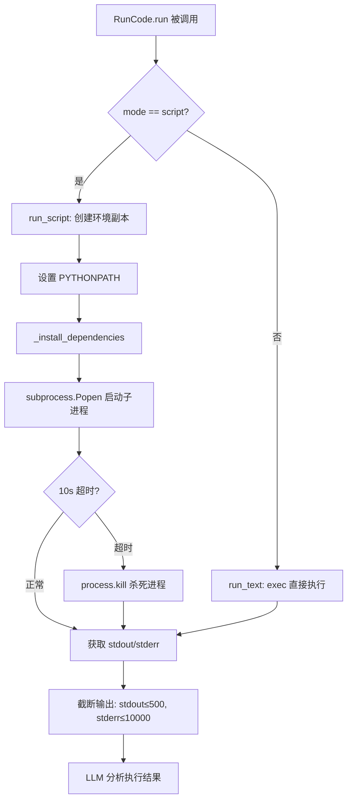
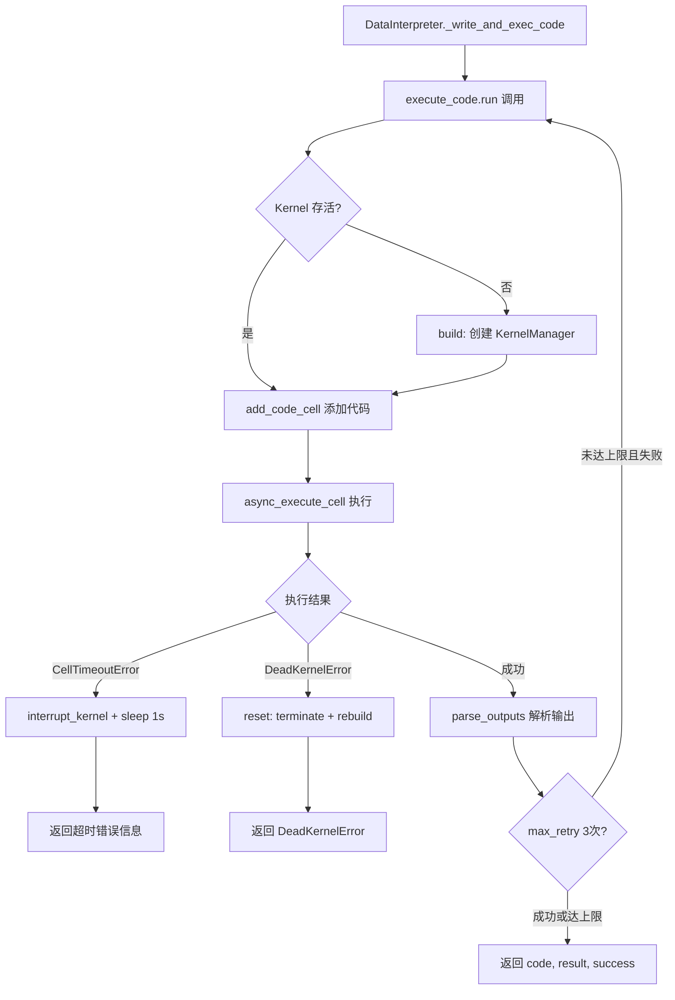
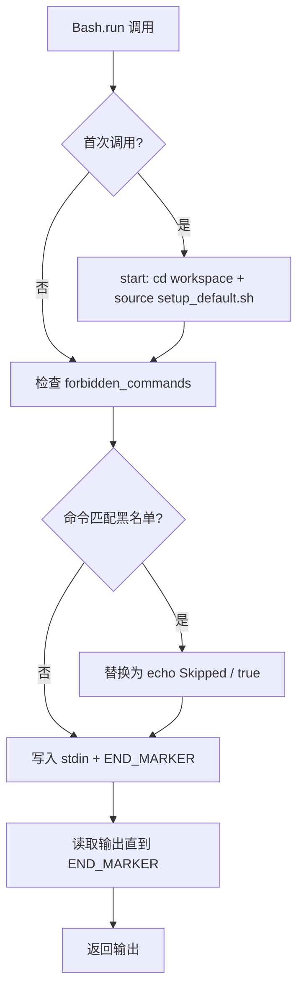

# PD-05.04 MetaGPT — 三层代码执行隔离体系

> 文档编号：PD-05.04
> 来源：MetaGPT `metagpt/actions/run_code.py`, `metagpt/actions/di/execute_nb_code.py`, `metagpt/tools/libs/terminal.py`
> GitHub：https://github.com/FoundationAgents/MetaGPT.git
> 问题域：PD-05 沙箱隔离 Sandbox Isolation
> 状态：可复用方案

---

## 第 1 章 问题与动机（≥ 30 行）

### 1.1 核心问题

MetaGPT 是一个多角色协作的 Agent 框架，其中多个角色（Engineer、QaEngineer、DataInterpreter）需要执行 LLM 生成的代码。代码执行是 Agent 系统中最危险的操作之一：

1. **LLM 生成的代码不可信** — 模型可能产生删除文件、无限循环、内存泄漏等危险代码
2. **多角色共享宿主环境** — Engineer 写的代码和 QaEngineer 的测试代码都在同一台机器上运行
3. **数据分析场景的特殊性** — DataInterpreter 需要持续交互式执行，状态需要跨 cell 保持
4. **SWE-Bench 场景的复杂性** — 需要在目标仓库中执行 git 操作、编辑文件、运行测试，操作范围大

MetaGPT 没有选择单一的沙箱方案，而是根据不同角色和场景提供了三层隔离机制：
- **Layer 1: subprocess 进程隔离**（RunCode action）— 最轻量，用于一次性脚本执行
- **Layer 2: Jupyter Kernel 隔离**（ExecuteNbCode action）— 中等隔离，用于交互式数据分析
- **Layer 3: Docker 容器隔离**（Dockerfile + devcontainer）— 最强隔离，用于整体部署

### 1.2 MetaGPT 的解法概述

1. **RunCode action** (`metagpt/actions/run_code.py:78`) — 通过 `subprocess.Popen` 在独立进程中执行代码，设置 10s 超时，自定义 PYTHONPATH 环境变量隔离依赖路径
2. **ExecuteNbCode action** (`metagpt/actions/di/execute_nb_code.py:69`) — 通过 nbclient 启动独立 Jupyter Kernel 进程，600s 超时，支持 kernel 中断和重置，notebook 文件持久化执行历史
3. **Terminal + Bash 工具** (`metagpt/tools/libs/terminal.py:17`) — 持久化 shell 进程 + SWE-Agent 命令集，提供受限的文件操作命令（open/edit/search），内置 forbidden_commands 黑名单
4. **Docker 部署** (`Dockerfile:1-25`) — 基于 `python3.9-nodejs20-slim` 镜像，`/app/metagpt` 工作目录，独立 `workspace` 目录，bridge 网络隔离
5. **环境隔离** (`metagpt/context.py:70-75`) — `new_environ()` 方法为每次执行创建 `os.environ` 的副本，避免环境变量污染

### 1.3 设计思想

| 设计原则 | 具体实现 | 理由 | 替代方案 |
|----------|----------|------|----------|
| 按场景分层隔离 | 三种执行器对应三种隔离级别 | 不同角色对隔离的需求不同，一刀切会浪费资源或不够安全 | 统一用 Docker（过重）或统一用 subprocess（不够灵活） |
| 超时是第一道防线 | RunCode 10s、ExecuteNbCode 600s、shell_execute 600s | 防止 LLM 生成的死循环代码耗尽资源 | 不设超时（危险）或统一超时（不灵活） |
| 环境变量副本隔离 | `os.environ.copy()` 创建独立环境 | 防止子进程修改影响父进程和其他角色 | 直接使用 `os.environ`（会互相污染） |
| Kernel 生命周期管理 | build/terminate/reset 三态管理 | Jupyter Kernel 是重量级资源，需要显式管理 | 每次执行都创建新 Kernel（太慢） |
| 命令黑名单防御 | Terminal.forbidden_commands 字典 | 简单有效地阻止已知危险命令模式 | 白名单（限制太多）或不限制（太危险） |

---

## 第 2 章 源码实现分析（≥ 60 行，核心章节）

### 2.1 架构概览

MetaGPT 的代码执行隔离体系由三个独立的执行器组成，分别服务不同的角色和场景：

```
┌─────────────────────────────────────────────────────────────┐
│                    MetaGPT Agent Framework                   │
├─────────────┬──────────────────┬────────────────────────────┤
│  Engineer   │  DataInterpreter │  SWE-Agent (Bash)          │
│  QaEngineer │                  │                            │
├─────────────┼──────────────────┼────────────────────────────┤
│  RunCode    │  ExecuteNbCode   │  Terminal + SWE Commands   │
│  (Action)   │  (Action)        │  (Tool)                    │
├─────────────┼──────────────────┼────────────────────────────┤
│ subprocess  │ Jupyter Kernel   │ Persistent bash process    │
│ Popen       │ (nbclient)       │ + forbidden_commands       │
│ timeout=10s │ timeout=600s     │ + flake8 lint guard        │
├─────────────┴──────────────────┴────────────────────────────┤
│              Docker Container (可选部署层)                    │
│  python3.9-nodejs20-slim / /app/metagpt / bridge network    │
└─────────────────────────────────────────────────────────────┘
```

### 2.2 核心实现

#### 2.2.1 Layer 1: RunCode — subprocess 进程隔离



对应源码 `metagpt/actions/run_code.py:92-118`：

```python
async def run_script(self, working_directory, additional_python_paths=[], command=[]) -> Tuple[str, str]:
    working_directory = str(working_directory)
    additional_python_paths = [str(path) for path in additional_python_paths]

    # Copy the current environment variables
    env = self.context.new_environ()

    # Modify the PYTHONPATH environment variable
    additional_python_paths = [working_directory] + additional_python_paths
    additional_python_paths = ":".join(additional_python_paths)
    env["PYTHONPATH"] = additional_python_paths + ":" + env.get("PYTHONPATH", "")
    RunCode._install_dependencies(working_directory=working_directory, env=env)

    # Start the subprocess
    process = subprocess.Popen(
        command, cwd=working_directory, stdout=subprocess.PIPE, stderr=subprocess.PIPE, env=env
    )

    try:
        # Wait for the process to complete, with a timeout
        stdout, stderr = process.communicate(timeout=10)
    except subprocess.TimeoutExpired:
        process.kill()  # Kill the process if it times out
        stdout, stderr = process.communicate()
    return stdout.decode("utf-8"), stderr.decode("utf-8")
```

关键设计点：
- `self.context.new_environ()` (`metagpt/context.py:70`) 创建环境变量副本，防止子进程污染宿主
- `subprocess.Popen` 使用 `stdout=PIPE, stderr=PIPE` 捕获输出，不让子进程直接写终端
- 10s 硬超时 + `process.kill()` 确保失控进程被终止
- 输出截断 (`run_code.py:140-141`)：stdout 限 500 字符、stderr 限 10000 字符，防止 token 溢出

#### 2.2.2 Layer 2: ExecuteNbCode — Jupyter Kernel 隔离



对应源码 `metagpt/actions/di/execute_nb_code.py:69-112`：

```python
class ExecuteNbCode(Action):
    """execute notebook code block, return result to llm, and display it."""
    nb: NotebookNode
    nb_client: RealtimeOutputNotebookClient = None
    console: Console
    interaction: str
    timeout: int = 600

    def __init__(self, nb=nbformat.v4.new_notebook(), timeout=600):
        super().__init__(
            nb=nb, timeout=timeout, console=Console(),
            interaction=("ipython" if self.is_ipython() else "terminal"),
        )
        self.reporter = NotebookReporter()
        self.set_nb_client()
        self.init_called = False

    async def build(self):
        if self.nb_client.kc is None or not await self.nb_client.kc.is_alive():
            self.nb_client.create_kernel_manager()
            self.nb_client.start_new_kernel()
            self.nb_client.start_new_kernel_client()

    async def terminate(self):
        """kill NotebookClient"""
        if self.nb_client.km is not None and await self.nb_client.km.is_alive():
            await self.nb_client.km.shutdown_kernel(now=True)
            await self.nb_client.km.cleanup_resources()
            channels = [
                self.nb_client.kc.stdin_channel,
                self.nb_client.kc.hb_channel,
                self.nb_client.kc.control_channel,
            ]
            for channel in channels:
                if channel.is_alive():
                    channel.stop()
            self.nb_client.kc = None
            self.nb_client.km = None
```

关键设计点：
- Kernel 生命周期三态：`build`（懒初始化）→ `terminate`（显式关闭）→ `reset`（terminate + sleep 1s + rebuild）
- `RealtimeOutputNotebookClient` (`execute_nb_code.py:40`) 继承 `NotebookClient`，实现实时输出流式推送
- `CellTimeoutError` 处理 (`execute_nb_code.py:234-239`)：先 `interrupt_kernel` 中断，再 sleep 1s 等待清理
- `DeadKernelError` 处理 (`execute_nb_code.py:240-242`)：直接 `reset` 重建整个 Kernel
- Notebook 文件持久化 (`execute_nb_code.py:278-279`)：每次执行后写入 `workspace/code.ipynb`，保留完整执行历史

### 2.3 实现细节

#### Terminal + SWE-Agent 命令集



`Terminal` 类 (`metagpt/tools/libs/terminal.py:17-45`) 的防御机制：

```python
class Terminal:
    def __init__(self):
        if sys.platform.startswith("win"):
            self.shell_command = ["cmd.exe"]
        else:
            self.shell_command = ["bash"]
        self.forbidden_commands = {
            "run dev": "Use Deployer.deploy_to_public instead.",
            "serve ": "Use Deployer.deploy_to_public instead.",
        }
```

`Bash` 子类 (`metagpt/tools/libs/terminal.py:184-282`) 继承 Terminal 并加载 SWE-Agent 命令集：

- `SWE_SETUP_PATH` 指向 `metagpt/tools/swe_agent_commands/setup_default.sh`
- 加载 `defaults.sh`（open/goto/scroll/create/submit）、`search.sh`（search_dir_and_preview/search_file/find_file）、`edit_linting.sh`（edit with flake8 lint guard）
- `edit` 命令 (`edit_linting.sh:21-165`) 在编辑前后都运行 `flake8 --select=F821,F822,F831,E112,E113,E999,E902`，如果引入新语法错误则自动回滚
- `SWE_CMD_WORK_DIR` 环境变量 (`terminal.py:193`) 设置为 `Config.default().workspace.path`，限制操作范围

#### 输出安全处理

`ExecuteNbCode.parse_outputs` (`execute_nb_code.py:160-197`) 对执行输出做多层过滤：

1. 过滤 MetaGPT 内部日志（含 `metagpt` 标记的 INFO/ERROR/WARNING/DEBUG 行）
2. 检测未 await 的协程对象（`<coroutine object` 开头），标记为失败
3. `remove_escape_and_color_codes` 清除 ANSI 转义序列
4. `remove_log_and_warning_lines` 清除 `[warning]`、`[cv]`、`[info]` 等噪音行
5. 成功时截取前 5000 字符，失败时截取后 5000 字符（错误信息通常在末尾）

---

## 第 3 章 迁移指南（≥ 40 行）

### 3.1 迁移清单

**阶段 1：基础 subprocess 隔离（1-2 天）**
- [ ] 实现 `CodeExecutor` 基类，定义 `run(code, timeout) -> (stdout, stderr, success)` 接口
- [ ] 实现 `SubprocessExecutor`，使用 `subprocess.Popen` + 超时 + 环境变量副本
- [ ] 添加输出截断逻辑（防止 token 溢出）

**阶段 2：Jupyter Kernel 隔离（2-3 天）**
- [ ] 安装 `nbclient` + `nbformat` 依赖
- [ ] 实现 `NotebookExecutor`，封装 Kernel 生命周期（build/terminate/reset）
- [ ] 实现超时中断（CellTimeoutError → interrupt_kernel）和死亡恢复（DeadKernelError → reset）
- [ ] 添加 notebook 文件持久化（执行历史可追溯）

**阶段 3：命令黑名单与 lint 防护（1 天）**
- [ ] 实现 `forbidden_commands` 字典，拦截已知危险命令模式
- [ ] 集成 flake8 lint guard（编辑前后对比，新增语法错误则回滚）

**阶段 4：Docker 部署隔离（可选）**
- [ ] 编写 Dockerfile，基于轻量级 Python 镜像
- [ ] 配置 workspace 目录挂载和 bridge 网络
- [ ] 设置 devcontainer 配置（VS Code 远程开发支持）

### 3.2 适配代码模板

#### 通用代码执行器（可直接复用）

```python
import subprocess
import os
from typing import Tuple
from abc import ABC, abstractmethod


class CodeExecutor(ABC):
    """代码执行器基类，定义统一接口"""

    @abstractmethod
    async def run(self, code: str, timeout: int = 30) -> Tuple[str, str, bool]:
        """执行代码，返回 (stdout, stderr, success)"""
        ...


class SubprocessExecutor(CodeExecutor):
    """基于 subprocess 的进程隔离执行器（参考 MetaGPT RunCode）"""

    def __init__(self, working_directory: str, python_paths: list[str] = None):
        self.working_directory = working_directory
        self.python_paths = python_paths or []

    def _make_env(self) -> dict:
        """创建隔离的环境变量副本"""
        env = os.environ.copy()
        paths = [self.working_directory] + self.python_paths
        env["PYTHONPATH"] = ":".join(paths) + ":" + env.get("PYTHONPATH", "")
        return env

    async def run(self, code: str, timeout: int = 30) -> Tuple[str, str, bool]:
        env = self._make_env()
        process = subprocess.Popen(
            ["python", "-c", code],
            cwd=self.working_directory,
            stdout=subprocess.PIPE,
            stderr=subprocess.PIPE,
            env=env,
        )
        try:
            stdout, stderr = process.communicate(timeout=timeout)
            success = process.returncode == 0
        except subprocess.TimeoutExpired:
            process.kill()
            stdout, stderr = process.communicate()
            success = False
        return (
            stdout.decode("utf-8")[:5000],  # 截断防 token 溢出
            stderr.decode("utf-8")[-5000:],  # 错误信息取末尾
            success,
        )


class NotebookExecutor(CodeExecutor):
    """基于 Jupyter Kernel 的隔离执行器（参考 MetaGPT ExecuteNbCode）"""

    def __init__(self, timeout: int = 600, workspace_path: str = "."):
        import nbformat
        from nbclient import NotebookClient

        self.timeout = timeout
        self.nb = nbformat.v4.new_notebook()
        self.client = NotebookClient(
            self.nb,
            timeout=timeout,
            resources={"metadata": {"path": workspace_path}},
        )
        self._alive = False

    async def build(self):
        if not self._alive:
            self.client.create_kernel_manager()
            self.client.start_new_kernel()
            self.client.start_new_kernel_client()
            self._alive = True

    async def terminate(self):
        if self._alive and self.client.km is not None:
            await self.client.km.shutdown_kernel(now=True)
            await self.client.km.cleanup_resources()
            self.client.kc = None
            self.client.km = None
            self._alive = False

    async def reset(self):
        import asyncio
        await self.terminate()
        await asyncio.sleep(1)
        await self.build()

    async def run(self, code: str, timeout: int = None) -> Tuple[str, str, bool]:
        from nbclient.exceptions import CellTimeoutError, DeadKernelError
        from nbformat.v4 import new_code_cell

        await self.build()
        cell = new_code_cell(source=code)
        self.nb.cells.append(cell)
        cell_index = len(self.nb.cells) - 1

        try:
            await self.client.async_execute_cell(cell, cell_index)
            outputs = cell.get("outputs", [])
            text = "\n".join(o.get("text", "") for o in outputs if o.get("output_type") == "stream")
            return text, "", True
        except CellTimeoutError:
            await self.client.km.interrupt_kernel()
            return "", "Cell execution timed out", False
        except DeadKernelError:
            await self.reset()
            return "", "DeadKernelError: kernel restarted", False
```

### 3.3 适用场景

| 场景 | 适用度 | 说明 |
|------|--------|------|
| 多角色 Agent 系统（各角色需执行代码） | ⭐⭐⭐ | MetaGPT 的三层隔离正是为此设计 |
| 数据分析 Agent（交互式 Python） | ⭐⭐⭐ | Jupyter Kernel 隔离是最佳选择 |
| SWE-Bench 类代码修复任务 | ⭐⭐⭐ | Terminal + SWE 命令集 + lint guard |
| 单次脚本执行（CI/CD 场景） | ⭐⭐ | subprocess 隔离足够，但缺少容器级隔离 |
| 高安全要求场景（多租户） | ⭐ | 需要额外加 Docker/gVisor 容器隔离 |

---

## 第 4 章 测试用例（≥ 20 行）

```python
import pytest
import asyncio
import subprocess
from unittest.mock import patch, MagicMock


class TestSubprocessIsolation:
    """测试 RunCode 的 subprocess 隔离机制"""

    def test_timeout_kills_process(self):
        """验证超时后进程被 kill"""
        process = subprocess.Popen(
            ["python", "-c", "import time; time.sleep(100)"],
            stdout=subprocess.PIPE, stderr=subprocess.PIPE,
        )
        try:
            stdout, stderr = process.communicate(timeout=2)
        except subprocess.TimeoutExpired:
            process.kill()
            stdout, stderr = process.communicate()
        assert process.returncode is not None  # 进程已终止

    def test_env_isolation(self):
        """验证环境变量副本不影响父进程"""
        import os
        original_path = os.environ.get("PYTHONPATH", "")
        env = os.environ.copy()
        env["PYTHONPATH"] = "/tmp/test:" + env.get("PYTHONPATH", "")
        subprocess.run(["python", "-c", "pass"], env=env)
        assert os.environ.get("PYTHONPATH", "") == original_path

    def test_output_truncation(self):
        """验证输出截断逻辑"""
        long_output = "x" * 10000
        truncated = long_output[:500]
        assert len(truncated) == 500

    def test_stderr_tail_truncation(self):
        """验证错误输出取末尾"""
        long_error = "line{}\n".format(i) if False else "".join(f"line{i}\n" for i in range(1000))
        truncated = long_error[-10000:]
        assert truncated.endswith("line999\n")


class TestNotebookIsolation:
    """测试 ExecuteNbCode 的 Jupyter Kernel 隔离"""

    def test_kernel_lifecycle(self):
        """验证 Kernel 三态管理：build → terminate → reset"""
        import nbformat
        from nbclient import NotebookClient

        nb = nbformat.v4.new_notebook()
        client = NotebookClient(nb, timeout=10)
        # build
        client.create_kernel_manager()
        client.start_new_kernel()
        client.start_new_kernel_client()
        assert client.kc is not None
        # terminate
        client.km.shutdown_kernel(now=True)
        assert True  # 未抛异常即成功

    def test_init_code_suppresses_warnings(self):
        """验证初始化代码抑制 warnings 和 logging"""
        ini_code = """import warnings\nimport logging\nroot_logger = logging.getLogger()\nroot_logger.setLevel(logging.ERROR)\nwarnings.filterwarnings('ignore')"""
        assert "filterwarnings('ignore')" in ini_code
        assert "setLevel(logging.ERROR)" in ini_code


class TestTerminalForbiddenCommands:
    """测试 Terminal 的命令黑名单"""

    def test_forbidden_command_replaced(self):
        """验证黑名单命令被替换"""
        import re
        forbidden_commands = {
            "run dev": "Use Deployer.deploy_to_public instead.",
            "serve ": "Use Deployer.deploy_to_public instead.",
        }
        cmd = "npm run dev && echo done"
        commands = re.split(r"\s*&&\s*", cmd)
        for cmd_name, reason in forbidden_commands.items():
            for index, command in enumerate(commands):
                if cmd_name in command:
                    commands[index] = "true"
        assert commands[0] == "true"
        assert commands[1] == "echo done"

    def test_edit_lint_guard_rollback(self):
        """验证 edit 命令的 flake8 lint guard 回滚逻辑"""
        # edit_linting.sh 在编辑前后对比 flake8 输出
        # 如果新增语法错误，恢复备份文件
        flake8_select = "F821,F822,F831,E112,E113,E999,E902"
        assert "E999" in flake8_select  # E999 = SyntaxError
        assert "F821" in flake8_select  # F821 = undefined name
```

---

## 第 5 章 跨域关联

| 关联域 | 关系类型 | 说明 |
|--------|----------|------|
| PD-01 上下文管理 | 协同 | ExecuteNbCode 的输出截断（stdout≤5000, stderr≤5000）直接影响 LLM 上下文窗口消耗；RunCode 的 stdout≤500 更激进 |
| PD-03 容错与重试 | 依赖 | DataInterpreter 的 `max_retry=3` 重试机制依赖 ExecuteNbCode 的 Kernel 恢复能力（DeadKernelError → reset） |
| PD-04 工具系统 | 协同 | Terminal 和 Bash 通过 `@register_tool()` 注册到 MetaGPT 工具系统，SWE-Agent 命令集作为 shell 函数注入 |
| PD-07 质量检查 | 协同 | edit_linting.sh 的 flake8 lint guard 是代码质量检查的前置防线；RunCode 的 LLM 分析执行结果是后置质量检查 |
| PD-11 可观测性 | 协同 | RealtimeOutputNotebookClient 实时推送执行输出到 NotebookReporter；Terminal 通过 TerminalReporter 流式报告命令输出 |

---

## 第 6 章 来源文件索引

| 文件 | 行范围 | 关键实现 |
|------|--------|----------|
| `metagpt/actions/run_code.py` | L78-L174 | RunCode action：subprocess 进程隔离、10s 超时、环境变量副本、依赖安装 |
| `metagpt/actions/di/execute_nb_code.py` | L40-L67 | RealtimeOutputNotebookClient：实时输出流式推送 |
| `metagpt/actions/di/execute_nb_code.py` | L69-L283 | ExecuteNbCode action：Jupyter Kernel 生命周期、600s 超时、输出解析 |
| `metagpt/roles/di/data_interpreter.py` | L36-L191 | DataInterpreter 角色：plan_and_act 模式、max_retry=3、execute_code 调用 |
| `metagpt/tools/libs/terminal.py` | L17-L176 | Terminal 工具：持久化 shell 进程、forbidden_commands 黑名单、命令输出流式读取 |
| `metagpt/tools/libs/terminal.py` | L184-L283 | Bash 工具：继承 Terminal、加载 SWE-Agent 命令集、SWE_CMD_WORK_DIR 设置 |
| `metagpt/tools/libs/shell.py` | L10-L53 | shell_execute 函数：subprocess.run 封装、600s 超时 |
| `metagpt/tools/swe_agent_commands/edit_linting.sh` | L21-L165 | edit 命令：flake8 lint guard、语法错误自动回滚 |
| `metagpt/tools/swe_agent_commands/defaults.sh` | L1-L193 | SWE 基础命令：open/goto/scroll/create/submit |
| `metagpt/tools/swe_agent_commands/search.sh` | L1-L246 | SWE 搜索命令：search_dir_and_preview/search_file/find_file |
| `metagpt/tools/swe_agent_commands/setup_default.sh` | L1-L19 | SWE 环境初始化：安装 flake8、设置 PATH、source 所有命令脚本 |
| `metagpt/tools/swe_agent_commands/_setup_default_env.sh` | L1-L21 | SWE 环境变量：WINDOW=100、OVERLAP=2、state() 函数 |
| `metagpt/context.py` | L58-L75 | Context 类：new_environ() 环境变量副本 |
| `metagpt/configs/workspace_config.py` | L18-L33 | WorkspaceConfig：workspace 路径配置、UID 隔离 |
| `metagpt/schema.py` | L811-L828 | RunCodeContext/RunCodeResult：代码执行输入输出数据结构 |
| `Dockerfile` | L1-L25 | Docker 部署：python3.9-nodejs20-slim、/app/metagpt、workspace 目录 |

---

## 第 7 章 横向对比维度

> **重要：** 本章用于自动填充 Butcher Wiki 的横向对比表。

```json comparison_data
{
  "project": "MetaGPT",
  "dimensions": {
    "隔离级别": "三层递进：subprocess 进程级 → Jupyter Kernel 级 → Docker 容器级",
    "虚拟路径": "WorkspaceConfig 统一 workspace 路径，SWE_CMD_WORK_DIR 限制操作范围",
    "生命周期管理": "ExecuteNbCode 三态管理 build/terminate/reset，DataInterpreter 结束时显式 terminate",
    "防御性设计": "forbidden_commands 命令黑名单 + flake8 lint guard 编辑回滚 + 输出截断防 token 溢出",
    "代码修复": "edit_linting.sh 编辑前后 flake8 对比，新增语法错误自动回滚到备份",
    "Scope 粒度": "按角色分层：Engineer 用 subprocess，DataInterpreter 用 Kernel，SWE-Agent 用 Terminal",
    "工具访问控制": "SWE-Agent 命令集白名单（open/edit/search/submit），Terminal forbidden_commands 黑名单",
    "多运行时支持": "subprocess 本地执行 + Docker 容器部署，无 K8s/Apple Container 原生支持",
    "跨平台命令过滤": "Terminal 区分 win(cmd.exe)/unix(bash)，forbidden_commands 统一拦截"
  }
}
```

### 域元数据补充

```json domain_metadata
{
  "solution_summary": "MetaGPT 按角色分三层隔离：subprocess 进程级（RunCode 10s 超时）、Jupyter Kernel 级（ExecuteNbCode 600s + 三态生命周期）、Docker 容器级部署，配合 SWE-Agent 命令白名单和 flake8 lint guard",
  "description": "按角色职责选择不同隔离级别，避免一刀切的资源浪费",
  "sub_problems": [
    "Kernel 死亡恢复：Jupyter Kernel 崩溃后如何快速重建并恢复执行上下文",
    "编辑语法防护：LLM 生成的代码编辑可能引入语法错误，需要 lint 前后对比和自动回滚",
    "输出截断策略：成功输出取头部、错误输出取尾部，不同截断方向影响 LLM 理解"
  ],
  "best_practices": [
    "按角色分层选择隔离级别：轻量脚本用 subprocess，交互式分析用 Jupyter Kernel，生产部署用 Docker",
    "编辑操作加 lint guard：flake8 前后对比，新增语法错误自动回滚，防止 LLM 破坏代码",
    "输出截断要区分方向：成功取头部（有用信息在前）、失败取尾部（错误信息在后）"
  ]
}
```
