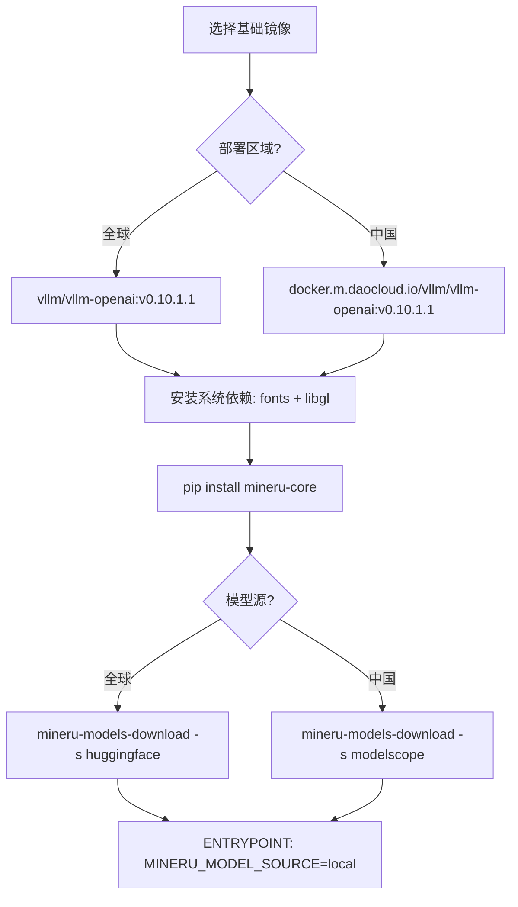
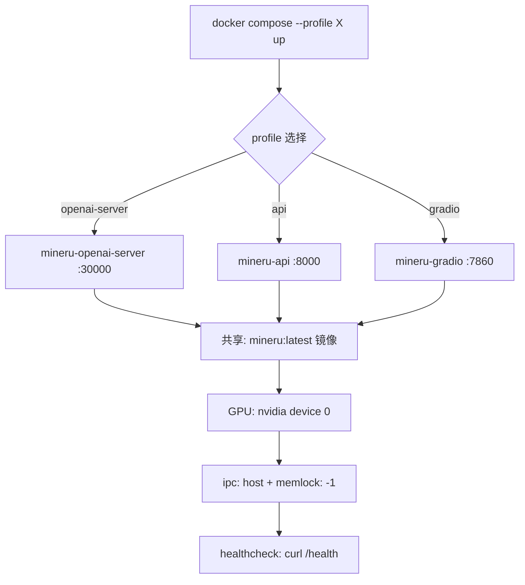
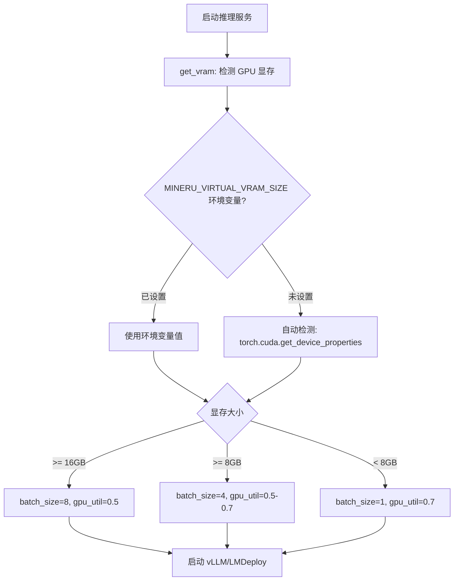

# PD-05.06 MinerU — Docker 多服务 GPU 容器化隔离与自适应资源管理

> 文档编号：PD-05.06
> 来源：MinerU `docker/compose.yaml` `docker/global/Dockerfile` `projects/mcp/Dockerfile`
> GitHub：https://github.com/opendatalab/MinerU.git
> 问题域：PD-05 沙箱隔离 Sandbox Isolation
> 状态：可复用方案

---

## 第 1 章 问题与动机（≥ 30 行）

### 1.1 核心问题

MinerU 是一个 PDF/文档解析工具，核心依赖 GPU 加速的 VLM（Vision Language Model）推理。其运行环境极其复杂：需要 CUDA 驱动、vLLM 推理引擎、多种字体库、OpenCV 依赖、以及数 GB 的预训练模型。这带来三个隔离需求：

1. **环境一致性**：开发者本地环境千差万别（不同 CUDA 版本、不同 GPU 架构），需要一个确定性的运行环境
2. **多服务隔离**：MinerU 提供 OpenAI 兼容 API、FastAPI REST、Gradio Web UI、MCP Server 四种服务形态，各自需要独立的端口和生命周期管理
3. **GPU 资源争抢**：多个服务共享同一块 GPU 时，VRAM 分配不当会导致 OOM 崩溃

与 DeerFlow/MiroThinker 等项目的"代码执行沙箱"不同，MinerU 的隔离重心在**推理环境隔离**——确保 GPU 密集型 ML 推理在容器内稳定运行，同时通过自适应资源管理避免 OOM。

### 1.2 MinerU 的解法概述

1. **双区域镜像策略**：提供 global（DockerHub + HuggingFace）和 china（DaoCloud + ModelScope）两套完全对等的 Dockerfile，解决模型下载的网络隔离问题（`docker/global/Dockerfile:1-4`, `docker/china/Dockerfile:1-4`）
2. **Compose Profile 多服务编排**：通过 Docker Compose profiles 将 4 个服务声明在同一 compose 文件中，按需启动，共享同一镜像但独立端口和 entrypoint（`docker/compose.yaml:1-88`）
3. **构建时模型预热**：在 Dockerfile 的 `RUN` 阶段预下载所有模型到镜像内，运行时设置 `MINERU_MODEL_SOURCE=local` 跳过网络请求（`docker/global/Dockerfile:26-29`）
4. **自适应 GPU 资源管理**：运行时根据 VRAM 大小动态调整 batch size、GPU memory utilization、推理引擎选择（`mineru/backend/vlm/utils.py:82-108`）
5. **请求级并发隔离**：FastAPI 层通过 asyncio.Semaphore 实现请求级并发控制，防止 GPU 过载（`mineru/cli/fast_api.py:31-46`）

### 1.3 设计思想

| 设计原则 | 具体实现 | 理由 | 替代方案 |
|----------|----------|------|----------|
| 构建时确定性 | 模型预下载到镜像层 | 运行时零网络依赖，启动即可用 | 运行时下载（首次启动慢 10-30 分钟） |
| 区域感知 | 双 Dockerfile 双镜像源 | 中国区 HuggingFace 不可达 | 单一镜像 + 运行时代理（不稳定） |
| Profile 隔离 | Compose profiles 按需启动 | 避免启动不需要的服务浪费 GPU | 多个 compose 文件（维护成本高） |
| 自适应资源 | VRAM 检测 → 动态参数 | 8GB 和 24GB 显卡需要不同配置 | 固定参数（低端卡 OOM，高端卡浪费） |
| 请求级隔离 | Semaphore 并发控制 | 防止并发请求耗尽 GPU 内存 | 无限制（高并发下 OOM） |

---

## 第 2 章 源码实现分析（≥ 60 行，核心章节）

### 2.1 架构概览

MinerU 的容器化隔离架构分为三层：镜像构建层、服务编排层、运行时资源管理层。

```
┌─────────────────────────────────────────────────────────┐
│                   Docker Compose 编排层                    │
│  ┌──────────────┐ ┌──────────────┐ ┌──────────────────┐  │
│  │ openai-server│ │  mineru-api  │ │  mineru-gradio   │  │
│  │  :30000      │ │  :8000       │ │  :7860           │  │
│  │ profile:     │ │ profile:     │ │ profile:         │  │
│  │ openai-server│ │ api          │ │ gradio           │  │
│  └──────┬───────┘ └──────┬───────┘ └────────┬─────────┘  │
│         │                │                   │            │
│         └────────────────┼───────────────────┘            │
│                          ▼                                │
│              ┌───────────────────────┐                    │
│              │   mineru:latest 镜像   │                    │
│              │  vllm-openai base     │                    │
│              │  + fonts + libgl      │                    │
│              │  + mineru[core]       │                    │
│              │  + 预下载模型          │                    │
│              └───────────────────────┘                    │
│                          │                                │
│              ┌───────────────────────┐                    │
│              │   NVIDIA GPU 设备      │                    │
│              │  device_ids: ["0"]    │                    │
│              │  ipc: host            │                    │
│              │  ulimits: memlock=-1  │                    │
│              └───────────────────────┘                    │
└─────────────────────────────────────────────────────────┘

┌─────────────────────────────────────────────────────────┐
│                   MCP Server（独立部署）                    │
│  ┌──────────────────────────────────────────────────┐    │
│  │  python:3.12-slim                                │    │
│  │  FastMCP SSE/stdio/streamable-http               │    │
│  │  volumes: ./downloads:/app/downloads             │    │
│  │  port: 8001                                      │    │
│  └──────────────────────────────────────────────────┘    │
└─────────────────────────────────────────────────────────┘
```

### 2.2 核心实现

#### 2.2.1 双区域 Dockerfile 与模型预热



对应源码 `docker/global/Dockerfile:1-29`：
```dockerfile
# 基于 vLLM OpenAI 兼容镜像，内置 CUDA + PyTorch + vLLM
FROM vllm/vllm-openai:v0.10.1.1

# 安装 OpenCV 依赖和中文字体
RUN apt-get update && \
    apt-get install -y \
        fonts-noto-core fonts-noto-cjk fontconfig libgl1 && \
    fc-cache -fv && \
    apt-get clean && rm -rf /var/lib/apt/lists/*

# 安装 MinerU 核心包
RUN python3 -m pip install -U 'mineru[core]>=2.7.0' --break-system-packages && \
    python3 -m pip cache purge

# 构建时预下载所有模型（约 2-5 GB）
RUN /bin/bash -c "mineru-models-download -s huggingface -m all"

# ENTRYPOINT 设置本地模型源，exec "$@" 透传命令
ENTRYPOINT ["/bin/bash", "-c", "export MINERU_MODEL_SOURCE=local && exec \"$@\"", "--"]
```

关键设计点：
- `exec "$@"` 模式让 ENTRYPOINT 成为透明包装器，compose 中的 `entrypoint` + `command` 可以覆盖实际启动命令
- `pip cache purge` 和 `rm -rf /var/lib/apt/lists/*` 减小镜像体积
- `--break-system-packages` 因为 vLLM 基础镜像不使用 virtualenv

#### 2.2.2 Compose Profile 多服务编排



对应源码 `docker/compose.yaml:1-30`：
```yaml
services:
  mineru-openai-server:
    image: mineru:latest
    container_name: mineru-openai-server
    restart: always
    profiles: ["openai-server"]
    ports:
      - 30000:30000
    environment:
      MINERU_MODEL_SOURCE: local
    entrypoint: mineru-openai-server
    command:
      --host 0.0.0.0
      --port 30000
    ulimits:
      memlock: -1        # GPU 内存锁定需要
      stack: 67108864    # 64MB 栈空间
    ipc: host            # GPU 进程间通信
    healthcheck:
      test: ["CMD-SHELL", "curl -f http://localhost:30000/health || exit 1"]
    deploy:
      resources:
        reservations:
          devices:
            - driver: nvidia
              device_ids: ["0"]
              capabilities: [gpu]
```

#### 2.2.3 自适应 GPU 资源管理



对应源码 `mineru/backend/vlm/utils.py:82-108`：
```python
def set_default_gpu_memory_utilization() -> float:
    from vllm import __version__ as vllm_version
    device = get_device()
    gpu_memory = get_vram(device)
    # vLLM 0.11.0+ 在低显存卡上需要更高的利用率
    if version.parse(vllm_version) >= version.parse("0.11.0") and gpu_memory <= 8:
        return 0.7
    else:
        return 0.5

def set_default_batch_size() -> int:
    try:
        device = get_device()
        gpu_memory = get_vram(device)
        if gpu_memory >= 16:
            batch_size = 8
        elif gpu_memory >= 8:
            batch_size = 4
        else:
            batch_size = 1
        logger.info(f'gpu_memory: {gpu_memory} GB, batch_size: {batch_size}')
    except Exception as e:
        logger.warning(f'Error determining VRAM: {e}, using default batch_ratio: 1')
        batch_size = 1
    return batch_size
```

对应源码 `mineru/utils/model_utils.py:450-486`（VRAM 检测，支持 7 种加速器）：
```python
def get_vram(device) -> int:
    env_vram = os.getenv("MINERU_VIRTUAL_VRAM_SIZE")
    if env_vram is not None:
        try:
            total_memory = int(env_vram)
            if total_memory > 0:
                return total_memory
        except ValueError:
            logger.warning(f"MINERU_VIRTUAL_VRAM_SIZE value '{env_vram}' is not valid")
    # 自动检测：CUDA > NPU > GCU > MUSA > MLU > SDAA
    total_memory = 1
    if torch.cuda.is_available() and str(device).startswith("cuda"):
        total_memory = round(torch.cuda.get_device_properties(device).total_memory / (1024 ** 3))
    elif str(device).startswith("npu"):
        # ... 华为昇腾 NPU
    elif str(device).startswith("gcu"):
        # ... 燧原 GCU
    # ... 更多加速器
    return total_memory
```

### 2.3 实现细节

#### 请求级并发隔离（`mineru/cli/fast_api.py:31-46`）

FastAPI 服务通过 `asyncio.Semaphore` 实现请求级并发控制，防止多个并发请求同时占用 GPU 导致 OOM：

```python
_request_semaphore: Optional[asyncio.Semaphore] = None

async def limit_concurrency():
    if _request_semaphore is not None:
        if _request_semaphore._value == 0:
            raise HTTPException(
                status_code=503,
                detail=f"Server is at maximum capacity: "
                       f"{os.getenv('MINERU_API_MAX_CONCURRENT_REQUESTS')}"
            )
        async with _request_semaphore:
            yield
    else:
        yield
```

#### 路径安全与临时文件隔离（`mineru/cli/fast_api.py:83-93, 200-207`）

每个请求创建 UUID 隔离目录，处理完成后自动清理：

```python
def sanitize_filename(filename: str) -> str:
    sanitized = re.sub(r"[/\\.]{2,}|[/\\]", "", filename)  # 防路径遍历
    sanitized = re.sub(r"[^\w.-]", "_", sanitized, flags=re.UNICODE)
    if sanitized.startswith("."):
        sanitized = "_" + sanitized[1:]  # 防隐藏文件
    return sanitized or "unnamed"

# 每个请求独立目录
unique_dir = os.path.join(output_dir, str(uuid.uuid4()))
os.makedirs(unique_dir, exist_ok=True)
background_tasks.add_task(cleanup_file, unique_dir)  # 后台自动清理
```

#### 多加速器设备检测链（`mineru/utils/config_reader.py:75-107`）

```python
def get_device():
    device_mode = os.getenv('MINERU_DEVICE_MODE', None)
    if device_mode is not None:
        return device_mode
    # 优先级链：CUDA > MPS > NPU > GCU > MUSA > MLU > SDAA > CPU
    if torch.cuda.is_available():
        return "cuda"
    elif torch.backends.mps.is_available():
        return "mps"
    # ... 逐级 try-except 降级
    return "cpu"
```


---

## 第 3 章 迁移指南（≥ 40 行）

### 3.1 迁移清单

**阶段 1：基础容器化（1-2 天）**
- [ ] 选择合适的 GPU 基础镜像（vLLM、PyTorch、NVIDIA CUDA）
- [ ] 编写 Dockerfile，安装系统依赖和 Python 包
- [ ] 在构建阶段预下载模型文件
- [ ] 配置 ENTRYPOINT 的 `exec "$@"` 透传模式

**阶段 2：多服务编排（1 天）**
- [ ] 编写 Docker Compose 文件，使用 profiles 区分服务
- [ ] 配置 GPU 设备映射（`deploy.resources.reservations.devices`）
- [ ] 设置 `ipc: host` 和 `ulimits.memlock: -1`（GPU 通信必需）
- [ ] 添加健康检查端点

**阶段 3：自适应资源管理（1 天）**
- [ ] 实现 VRAM 检测函数（支持环境变量覆盖）
- [ ] 根据 VRAM 动态调整 batch size 和 memory utilization
- [ ] 添加 Semaphore 并发控制
- [ ] 实现请求级临时目录隔离

### 3.2 适配代码模板

#### GPU 自适应资源管理器

```python
import os
import gc
from typing import Optional
from dataclasses import dataclass

@dataclass
class GPUConfig:
    batch_size: int
    memory_utilization: float
    device: str

def detect_gpu_config() -> GPUConfig:
    """自适应 GPU 配置检测，可直接复用"""
    import torch
    
    # 1. 环境变量覆盖
    device = os.getenv("DEVICE_MODE", None)
    vram_override = os.getenv("VIRTUAL_VRAM_SIZE", None)
    
    # 2. 设备检测
    if device is None:
        if torch.cuda.is_available():
            device = "cuda"
        elif torch.backends.mps.is_available():
            device = "mps"
        else:
            device = "cpu"
    
    # 3. VRAM 检测
    if vram_override:
        vram_gb = int(vram_override)
    elif device == "cuda":
        vram_gb = round(
            torch.cuda.get_device_properties(0).total_memory / (1024 ** 3)
        )
    else:
        vram_gb = 0
    
    # 4. 自适应参数
    if vram_gb >= 16:
        return GPUConfig(batch_size=8, memory_utilization=0.5, device=device)
    elif vram_gb >= 8:
        return GPUConfig(batch_size=4, memory_utilization=0.7, device=device)
    else:
        return GPUConfig(batch_size=1, memory_utilization=0.8, device=device)

def clean_gpu_memory(device: str = "cuda"):
    """多设备内存清理"""
    import torch
    if device.startswith("cuda") and torch.cuda.is_available():
        torch.cuda.empty_cache()
        torch.cuda.ipc_collect()
    elif device.startswith("mps"):
        torch.mps.empty_cache()
    gc.collect()
```

#### 请求级隔离中间件

```python
import asyncio
import uuid
import shutil
from pathlib import Path
from fastapi import FastAPI, HTTPException, Depends

class RequestIsolation:
    """请求级目录隔离 + 并发控制"""
    
    def __init__(self, base_dir: str, max_concurrent: int = 0):
        self.base_dir = Path(base_dir)
        self.semaphore = (
            asyncio.Semaphore(max_concurrent) if max_concurrent > 0 else None
        )
    
    async def acquire(self):
        if self.semaphore and self.semaphore._value == 0:
            raise HTTPException(503, "Server at maximum capacity")
        if self.semaphore:
            await self.semaphore.acquire()
    
    def release(self):
        if self.semaphore:
            self.semaphore.release()
    
    def create_workspace(self) -> Path:
        workspace = self.base_dir / str(uuid.uuid4())
        workspace.mkdir(parents=True, exist_ok=True)
        return workspace
    
    def cleanup_workspace(self, workspace: Path):
        if workspace.exists():
            shutil.rmtree(workspace)
```

### 3.3 适用场景

| 场景 | 适用度 | 说明 |
|------|--------|------|
| GPU 推理服务容器化 | ⭐⭐⭐ | MinerU 的核心场景，模型预热 + 自适应资源管理非常成熟 |
| 多服务共享 GPU | ⭐⭐⭐ | Compose profiles + Semaphore 并发控制是实用方案 |
| 跨区域部署 | ⭐⭐⭐ | 双镜像源策略可直接复用 |
| Agent 代码执行沙箱 | ⭐ | MinerU 不涉及用户代码执行，无进程级隔离 |
| 多租户隔离 | ⭐⭐ | 请求级 UUID 目录隔离可用，但无用户级资源配额 |

---

## 第 4 章 测试用例（≥ 20 行）

```python
import os
import asyncio
import pytest
import tempfile
import shutil
from pathlib import Path
from unittest.mock import patch, MagicMock

class TestGPUResourceAdaptation:
    """测试 GPU 自适应资源管理"""
    
    def test_vram_env_override(self):
        """环境变量覆盖 VRAM 检测"""
        with patch.dict(os.environ, {"MINERU_VIRTUAL_VRAM_SIZE": "24"}):
            from mineru.utils.model_utils import get_vram
            assert get_vram("cuda") == 24
    
    def test_vram_invalid_env_fallback(self):
        """无效环境变量回退到自动检测"""
        with patch.dict(os.environ, {"MINERU_VIRTUAL_VRAM_SIZE": "invalid"}):
            from mineru.utils.model_utils import get_vram
            # 应该回退到自动检测，不抛异常
            result = get_vram("cpu")
            assert isinstance(result, int)
    
    def test_batch_size_high_vram(self):
        """高显存卡应使用大 batch"""
        with patch("mineru.backend.vlm.utils.get_vram", return_value=24):
            with patch("mineru.backend.vlm.utils.get_device", return_value="cuda"):
                from mineru.backend.vlm.utils import set_default_batch_size
                assert set_default_batch_size() == 8
    
    def test_batch_size_low_vram(self):
        """低显存卡应使用小 batch"""
        with patch("mineru.backend.vlm.utils.get_vram", return_value=4):
            with patch("mineru.backend.vlm.utils.get_device", return_value="cuda"):
                from mineru.backend.vlm.utils import set_default_batch_size
                assert set_default_batch_size() == 1
    
    def test_gpu_memory_utilization_low_vram(self):
        """低显存 + 新版 vLLM 应使用 0.7"""
        with patch("mineru.backend.vlm.utils.get_vram", return_value=8):
            with patch("mineru.backend.vlm.utils.get_device", return_value="cuda"):
                with patch("vllm.__version__", "0.11.0"):
                    from mineru.backend.vlm.utils import set_default_gpu_memory_utilization
                    assert set_default_gpu_memory_utilization() == 0.7


class TestRequestIsolation:
    """测试请求级隔离"""
    
    def test_sanitize_filename_path_traversal(self):
        """路径遍历攻击应被过滤"""
        from mineru.cli.fast_api import sanitize_filename
        assert "/" not in sanitize_filename("../../etc/passwd")
        assert "\\" not in sanitize_filename("..\\..\\windows\\system32")
    
    def test_sanitize_filename_hidden_file(self):
        """隐藏文件名应被修正"""
        from mineru.cli.fast_api import sanitize_filename
        result = sanitize_filename(".hidden")
        assert not result.startswith(".")
    
    def test_sanitize_filename_empty(self):
        """空文件名应返回 unnamed"""
        from mineru.cli.fast_api import sanitize_filename
        assert sanitize_filename("") == "unnamed"
    
    def test_unique_dir_creation(self):
        """每个请求应创建独立的 UUID 目录"""
        import uuid
        base = tempfile.mkdtemp()
        try:
            dir1 = os.path.join(base, str(uuid.uuid4()))
            dir2 = os.path.join(base, str(uuid.uuid4()))
            os.makedirs(dir1)
            os.makedirs(dir2)
            assert dir1 != dir2
            assert os.path.exists(dir1)
            assert os.path.exists(dir2)
        finally:
            shutil.rmtree(base)


class TestConcurrencyControl:
    """测试并发控制"""
    
    @pytest.mark.asyncio
    async def test_semaphore_rejects_at_capacity(self):
        """达到最大并发时应返回 503"""
        sem = asyncio.Semaphore(1)
        await sem.acquire()  # 占满
        assert sem._value == 0
        # 此时新请求应被拒绝
        sem.release()
        assert sem._value == 1


class TestDeviceDetection:
    """测试多设备检测"""
    
    def test_device_mode_env_override(self):
        """环境变量应覆盖自动检测"""
        with patch.dict(os.environ, {"MINERU_DEVICE_MODE": "cpu"}):
            from mineru.utils.config_reader import get_device
            assert get_device() == "cpu"
    
    def test_platform_detection(self):
        """平台检测函数应返回布尔值"""
        from mineru.utils.check_sys_env import (
            is_windows_environment, is_mac_environment, is_linux_environment
        )
        # 至少一个为 True
        results = [is_windows_environment(), is_mac_environment(), is_linux_environment()]
        assert any(results)
```


---

## 第 5 章 跨域关联

| 关联域 | 关系类型 | 说明 |
|--------|----------|------|
| PD-01 上下文管理 | 协同 | GPU VRAM 限制直接影响 VLM 推理的上下文窗口大小，`set_default_batch_size` 间接控制了单次处理的页面数 |
| PD-03 容错与重试 | 协同 | `get_vram` 的环境变量回退机制是容错设计；`clean_vram` 在低显存时主动清理防止 OOM |
| PD-04 工具系统 | 依赖 | MCP Server 作为工具暴露给 Agent，其容器化部署依赖本域的 Docker 隔离方案 |
| PD-08 搜索与检索 | 协同 | MinerU 的文档解析是 RAG 管线的前置步骤，容器化保证了解析环境的一致性 |
| PD-11 可观测性 | 协同 | Docker healthcheck + loguru 日志 + Semaphore 状态构成了基础可观测性 |

---

## 第 6 章 来源文件索引

| 文件 | 行范围 | 关键实现 |
|------|--------|----------|
| `docker/global/Dockerfile` | L1-L29 | 全球区域 GPU 镜像构建，vLLM 基础 + 模型预热 |
| `docker/china/Dockerfile` | L1-L29 | 中国区域镜像，DaoCloud + ModelScope 源 |
| `docker/compose.yaml` | L1-L88 | 多服务 Compose 编排，profiles + GPU 设备映射 |
| `projects/mcp/Dockerfile` | L1-L35 | MCP Server 轻量镜像，python:3.12-slim 基础 |
| `projects/mcp/docker-compose.yml` | L1-L12 | MCP Server 独立编排，volume 挂载 |
| `projects/mcp/src/mineru/server.py` | L39-L70 | FastMCP SSE 传输层，多模式服务启动 |
| `projects/mcp/src/mineru/config.py` | L1-L92 | 环境变量配置管理，dotenv 加载 |
| `mineru/cli/fast_api.py` | L31-L46 | Semaphore 并发控制 |
| `mineru/cli/fast_api.py` | L83-L93 | 文件名安全过滤 |
| `mineru/cli/fast_api.py` | L200-L207 | UUID 请求目录隔离 |
| `mineru/utils/model_utils.py` | L416-L486 | 多设备内存清理 + VRAM 检测 |
| `mineru/backend/vlm/utils.py` | L82-L108 | 自适应 GPU 参数（batch size + memory utilization） |
| `mineru/utils/config_reader.py` | L14-L31 | 配置文件层级加载 |
| `mineru/utils/config_reader.py` | L75-L107 | 多加速器设备检测链 |
| `mineru/utils/check_sys_env.py` | L1-L38 | 跨平台环境检测 |
| `mineru/data/data_reader_writer/filebase.py` | L1-L63 | 文件系统抽象，parent_dir 作用域 |

---

## 第 7 章 横向对比维度

```json comparison_data
{
  "project": "MinerU",
  "dimensions": {
    "隔离级别": "Docker 容器级隔离，无进程级沙箱",
    "生命周期管理": "Compose profiles 按需启动，restart: always 自动恢复",
    "防御性设计": "路径遍历过滤 + UUID 目录隔离 + 后台自动清理",
    "资源池化": "Semaphore 并发控制，无预创建沙箱池",
    "自定义模板": "双区域 Dockerfile 模板，构建时模型预热",
    "配置驱动选择": "环境变量驱动设备/VRAM/并发参数，支持运行时覆盖",
    "多运行时支持": "7 种加速器自动检测：CUDA/MPS/NPU/GCU/MUSA/MLU/SDAA",
    "GPU自适应资源": "VRAM 检测 → 动态 batch size + memory utilization",
    "区域感知部署": "global/china 双 Dockerfile + 双模型源",
    "健康检查": "Docker healthcheck curl /health，30s 间隔 3 次重试"
  }
}
```

### 域元数据补充

```json domain_metadata
{
  "solution_summary": "MinerU 用双区域 Dockerfile 预热模型 + Compose profiles 多服务编排 + VRAM 自适应参数实现 GPU 推理环境容器化隔离",
  "description": "GPU 密集型推理服务的容器化隔离与自适应资源管理",
  "sub_problems": [
    "GPU VRAM 自适应：不同显存容量需要不同的 batch size 和 memory utilization 参数",
    "区域感知镜像：模型下载源在不同地区不可达，需要双镜像策略",
    "多加速器适配：同一代码需支持 CUDA/MPS/NPU/GCU/MUSA/MLU/SDAA 七种加速器",
    "推理并发控制：GPU 推理请求并发过高导致 VRAM OOM，需要请求级限流"
  ],
  "best_practices": [
    "构建时预下载模型到镜像层，运行时设置 MODEL_SOURCE=local 实现零网络依赖启动",
    "ENTRYPOINT 使用 exec \"$@\" 透传模式，让 Compose 的 entrypoint+command 灵活覆盖",
    "VRAM 检测支持环境变量覆盖，方便在 CI/CD 或虚拟化环境中模拟不同显卡",
    "Compose profiles 将多服务声明在同一文件中按需启动，比多个 compose 文件更易维护"
  ]
}
```
