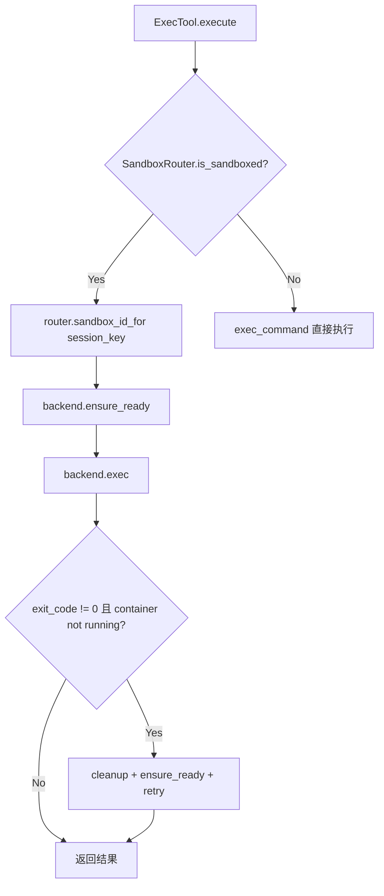
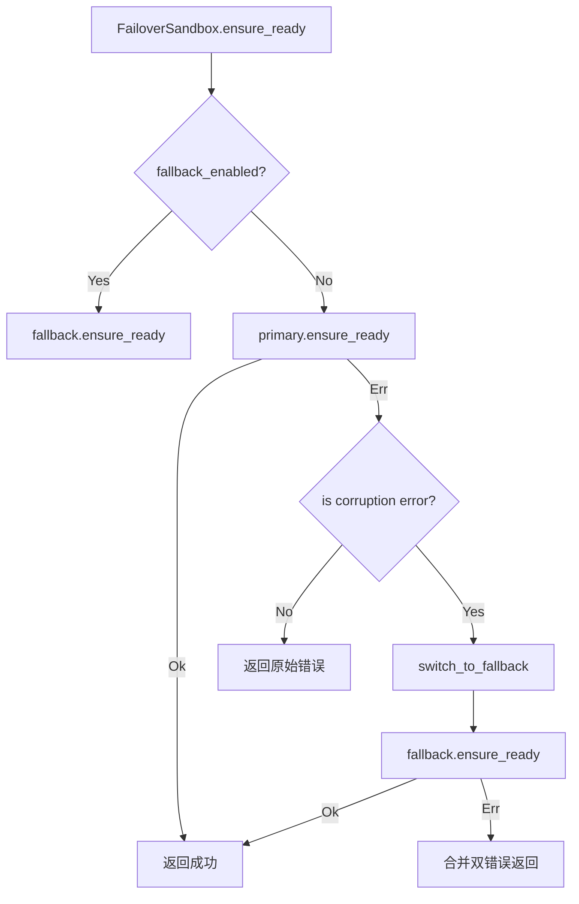
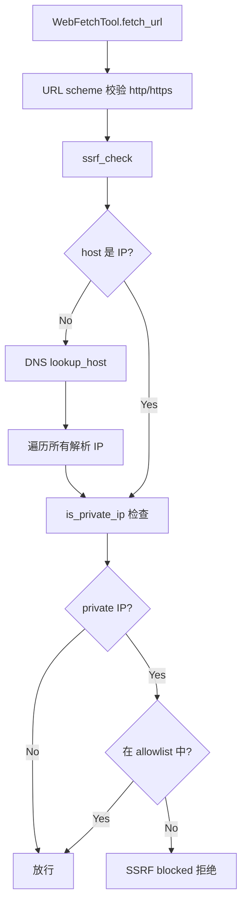

# PD-05.01 Moltis — 双沙箱后端 + FailoverSandbox + SSRF 防护

> 文档编号：PD-05.01
> 来源：Moltis `crates/tools/src/sandbox.rs`, `crates/tools/src/exec.rs`, `crates/tools/src/web_fetch.rs`
> GitHub：https://github.com/moltis-org/moltis.git
> 问题域：PD-05 沙箱隔离 Sandbox Isolation
> 状态：可复用方案

---

## 第 1 章 问题与动机

### 1.1 核心问题

Agent 系统需要在沙箱中执行用户代码和 LLM 生成的命令，但面临三重挑战：

1. **多运行时适配**：macOS 上有 Apple Container（轻量 VM）和 Docker 两种容器运行时，Linux 上有 Docker 和 cgroup v2，需要统一抽象
2. **容器不可靠**：Apple Container 存在 daemon 腐败、容器名冲突等问题，需要自动故障转移到 Docker
3. **网络安全**：Agent 的 `web_fetch` 工具可能被 LLM 利用发起 SSRF 攻击，访问内网元数据服务或私有 API

### 1.2 Moltis 的解法概述

1. **Sandbox trait 统一抽象**：定义 `ensure_ready/exec/cleanup/build_image` 四方法 trait，Docker、Apple Container、Cgroup、NoSandbox 四种后端实现同一接口（`sandbox.rs:548-578`）
2. **FailoverSandbox 自动降级**：Apple Container 作为 primary，Docker 作为 fallback，检测到 corruption error 时自动切换（`sandbox.rs:2538-2641`）
3. **SandboxRouter 动态路由**：per-session 粒度的沙箱开关和镜像覆盖，支持运行时动态启用/禁用沙箱（`sandbox.rs:3226-3419`）
4. **确定性哈希镜像标签**：SHA256(Dockerfile 内容) 作为镜像 tag，保证相同配置产生相同镜像，支持按需重建（`sandbox.rs:731-737`）
5. **SSRF 防护 + 可配置白名单**：DNS 解析后检查 IP 是否为 private/loopback/link-local/CGNAT，支持 CIDR 白名单放行内网服务（`web_fetch.rs:193-248`）

### 1.3 设计思想

| 设计原则 | 具体实现 | 理由 | 替代方案 |
|----------|----------|------|----------|
| 多后端统一 trait | `Sandbox` trait + 4 种 impl | 上层代码无需关心具体运行时 | 枚举 match（扩展性差） |
| 自动故障转移 | `FailoverSandbox` 装饰器模式 | Apple Container daemon 不稳定 | 手动切换（用户体验差） |
| per-session 路由 | `SandboxRouter` + override map | 不同 session 可能需要不同隔离级别 | 全局开关（粒度太粗） |
| 确定性镜像 | SHA256(Dockerfile) 作为 tag | 避免重复构建，支持删除后自动重建 | 版本号递增（需要状态管理） |
| DNS 后 SSRF 检查 | 解析 IP 后逐个检查 private 范围 | 防止 DNS rebinding 和内网穿透 | 域名黑名单（易绕过） |
| 秘密值多编码脱敏 | raw + base64 + hex 三重 redaction | 防止 LLM 通过编码变换泄露 secret | 仅 raw 替换（可被 base64 绕过） |

---

## 第 2 章 源码实现分析

### 2.1 架构概览

```
┌─────────────────────────────────────────────────────────┐
│                     ExecTool                            │
│  (AgentTool impl, approval gating, secret redaction)    │
├─────────────────────────────────────────────────────────┤
│                   SandboxRouter                         │
│  (per-session mode/image override, event broadcast)     │
├──────────┬──────────┬──────────┬────────────────────────┤
│  Docker  │  Apple   │  Cgroup  │  NoSandbox             │
│ Sandbox  │Container │ Sandbox  │  (passthrough)         │
│          │ Sandbox  │ (Linux)  │                        │
├──────────┴──────────┴──────────┴────────────────────────┤
│              FailoverSandbox (decorator)                 │
│  primary=AppleContainer → fallback=Docker               │
├─────────────────────────────────────────────────────────┤
│                   WebFetchTool                           │
│  (SSRF check → DNS resolve → IP allowlist filter)       │
└─────────────────────────────────────────────────────────┘
```

### 2.2 核心实现

#### 2.2.1 Sandbox Trait 与多后端



对应源码 `sandbox.rs:548-578`：

```rust
/// Trait for sandbox implementations (Docker, cgroups, Apple Container, etc.).
#[async_trait]
pub trait Sandbox: Send + Sync {
    fn backend_name(&self) -> &'static str;
    async fn ensure_ready(&self, id: &SandboxId, image_override: Option<&str>) -> Result<()>;
    async fn exec(&self, id: &SandboxId, command: &str, opts: &ExecOpts) -> Result<ExecResult>;
    async fn cleanup(&self, id: &SandboxId) -> Result<()>;
    fn is_real(&self) -> bool { true }
    async fn build_image(&self, _base: &str, _packages: &[String])
        -> Result<Option<BuildImageResult>> { Ok(None) }
}
```

四种后端实现：
- `DockerSandbox`（`sandbox.rs:1421`）：`docker run -d` 启动容器，`docker exec` 执行命令
- `AppleContainerSandbox`（`sandbox.rs:1849`）：macOS 26+ 的 `container` CLI，轻量 VM 隔离
- `CgroupSandbox`（`sandbox.rs:1730`）：Linux `systemd-run --user --scope`，无需 root
- `NoSandbox`（`sandbox.rs:1703`）：直接调用 `exec_command`，无隔离

#### 2.2.2 FailoverSandbox 自动降级



对应源码 `sandbox.rs:2538-2571`：

```rust
#[async_trait]
impl Sandbox for FailoverSandbox {
    async fn ensure_ready(&self, id: &SandboxId, image_override: Option<&str>) -> Result<()> {
        if self.fallback_enabled().await {
            return self.fallback.ensure_ready(id, image_override).await;
        }
        match self.primary.ensure_ready(id, image_override).await {
            Ok(()) => Ok(()),
            Err(primary_error) => {
                if !self.should_failover(&primary_error) {
                    return Err(primary_error);
                }
                self.switch_to_fallback(&primary_error).await;
                let primary_message = format!("{primary_error:#}");
                self.fallback.ensure_ready(id, image_override).await
                    .map_err(|fallback_error| anyhow::anyhow!(
                        "primary ({}) failed: {}; fallback ({}) also failed: {}",
                        self.primary_name, primary_message,
                        self.fallback_name, fallback_error
                    ))
            },
        }
    }
}
```

关键设计：`should_failover` 仅对 Apple Container 的 corruption error 触发降级（`sandbox.rs:2528-2534`），普通错误不降级。一旦降级，后续所有操作都走 fallback，不再尝试 primary。

#### 2.2.3 SSRF 防护



对应源码 `web_fetch.rs:193-248`：

```rust
async fn ssrf_check(url: &Url, allowlist: &[ipnet::IpNet]) -> Result<()> {
    let host = url.host_str()
        .ok_or_else(|| anyhow::anyhow!("URL has no host"))?;
    // 直接 IP 检查
    if let Ok(ip) = host.parse::<IpAddr>() {
        if is_private_ip(&ip) && !is_ssrf_allowed(&ip, allowlist) {
            bail!("SSRF blocked: {host} resolves to private IP {ip}");
        }
        return Ok(());
    }
    // DNS 解析后检查每个 IP
    let addrs: Vec<_> = tokio::net::lookup_host(format!("{host}:{port}"))
        .await?.collect();
    for addr in &addrs {
        if is_private_ip(&addr.ip()) && !is_ssrf_allowed(&addr.ip(), allowlist) {
            bail!("SSRF blocked: {host} resolves to private IP {}", addr.ip());
        }
    }
    Ok(())
}
```

`is_private_ip` 覆盖范围（`web_fetch.rs:226-248`）：
- IPv4: loopback, private (10/172.16/192.168), link-local (169.254), broadcast, unspecified, CGNAT (100.64/10), 192.0.0/24
- IPv6: loopback (::1), unspecified (::), unique local (fc00::/7), link-local (fe80::/10)

### 2.3 实现细节

**确定性镜像标签**（`sandbox.rs:731-737`）：

```rust
pub fn sandbox_image_tag(repo: &str, base: &str, packages: &[String]) -> String {
    let dockerfile = sandbox_image_dockerfile(base, packages);
    let digest = Sha256::digest(dockerfile.as_bytes());
    format!("{repo}:{digest:x}")
}
```

将 Dockerfile 内容（包含 base image + 排序去重后的 packages）做 SHA256 哈希作为 tag。好处：
- 相同配置 → 相同 tag → 不重复构建
- 用户删除镜像后，`rebuildable_sandbox_image_tag` 检测到缺失会自动重建

**秘密值多编码脱敏**（`exec.rs:618-644`）：

```rust
fn redaction_needles(value: &str) -> Vec<String> {
    let mut needles = vec![value.to_string()];
    // base64 standard + URL-safe
    needles.push(base64::engine::general_purpose::STANDARD.encode(value.as_bytes()));
    needles.push(base64::engine::general_purpose::URL_SAFE_NO_PAD.encode(value.as_bytes()));
    // hex lowercase
    needles.push(value.as_bytes().iter().map(|b| format!("{b:02x}")).collect());
    needles
}
```

防止 LLM 通过 `echo $SECRET | base64` 或 `xxd -p` 泄露注入的环境变量。

**容器恢复重试**（`exec.rs:469-494`）：当 `docker exec` 返回 "container is not running" 错误时，自动 cleanup → ensure_ready → retry，最多重试 `MAX_SANDBOX_RECOVERY_RETRIES`（1 次）。

**Apple Container 代际命名**（`sandbox.rs:1897-1913`）：当容器名冲突时，通过 `bump_container_generation` 追加 `-g{N}` 后缀，避免 stale container 阻塞新建。


---

## 第 3 章 迁移指南

### 3.1 迁移清单

**阶段 1：Sandbox Trait 抽象（1-2 天）**
- [ ] 定义 `Sandbox` trait：`ensure_ready`, `exec`, `cleanup`, `backend_name`, `is_real`
- [ ] 实现 `NoSandbox`（直通模式）作为默认后端
- [ ] 实现 `DockerSandbox`：`docker run -d` + `docker exec` + `docker rm -f`
- [ ] 定义 `SandboxId`（scope + key）和 `SandboxConfig`（mode/scope/image/packages/resource_limits）

**阶段 2：SandboxRouter 动态路由（1 天）**
- [ ] 实现 `SandboxRouter`：global mode + per-session override map
- [ ] 三种 mode：`Off`（全部直通）、`All`（全部沙箱）、`NonMain`（仅非 main session）
- [ ] 镜像解析优先级：skill_image > session override > global override > config > default

**阶段 3：FailoverSandbox（可选，macOS 场景）**
- [ ] 实现 `FailoverSandbox` 装饰器：primary + fallback
- [ ] 定义 corruption error 检测逻辑
- [ ] 一旦降级，后续操作全走 fallback

**阶段 4：SSRF 防护（半天）**
- [ ] 实现 `ssrf_check`：DNS 解析 → IP 分类 → allowlist 过滤
- [ ] 覆盖 IPv4/IPv6 的 loopback、private、link-local、CGNAT 范围
- [ ] 支持 CIDR 格式的 allowlist 配置

**阶段 5：安全加固（半天）**
- [ ] 实现 secret redaction：raw + base64 + hex 三重替换
- [ ] 容器恢复重试：检测 "container not running" → cleanup → ensure_ready → retry
- [ ] 输出截断：`truncate_output_for_display` 处理 UTF-8 边界

### 3.2 适配代码模板

#### Sandbox Trait（Rust）

```rust
use async_trait::async_trait;
use anyhow::Result;

pub struct SandboxId {
    pub scope: SandboxScope,
    pub key: String,
}

#[derive(Clone, Default)]
pub enum SandboxScope { #[default] Session, Agent, Shared }

pub struct ExecResult {
    pub stdout: String,
    pub stderr: String,
    pub exit_code: i32,
}

pub struct ExecOpts {
    pub timeout: std::time::Duration,
    pub max_output_bytes: usize,
    pub working_dir: Option<std::path::PathBuf>,
    pub env: Vec<(String, String)>,
}

#[async_trait]
pub trait Sandbox: Send + Sync {
    fn backend_name(&self) -> &'static str;
    async fn ensure_ready(&self, id: &SandboxId, image: Option<&str>) -> Result<()>;
    async fn exec(&self, id: &SandboxId, cmd: &str, opts: &ExecOpts) -> Result<ExecResult>;
    async fn cleanup(&self, id: &SandboxId) -> Result<()>;
    fn is_real(&self) -> bool { true }
}
```

#### SSRF 检查（Rust）

```rust
use std::net::IpAddr;
use anyhow::{Result, bail};

fn is_private_ip(ip: &IpAddr) -> bool {
    match ip {
        IpAddr::V4(v4) => {
            v4.is_loopback() || v4.is_private() || v4.is_link_local()
            || v4.is_broadcast() || v4.is_unspecified()
            || (v4.octets()[0] == 100 && (v4.octets()[1] & 0xC0) == 64) // CGNAT
        },
        IpAddr::V6(v6) => {
            v6.is_loopback() || v6.is_unspecified()
            || (v6.segments()[0] & 0xFE00) == 0xFC00  // unique local
            || (v6.segments()[0] & 0xFFC0) == 0xFE80  // link-local
        },
    }
}

async fn ssrf_check(url: &url::Url, allowlist: &[ipnet::IpNet]) -> Result<()> {
    let host = url.host_str().ok_or_else(|| anyhow::anyhow!("no host"))?;
    if let Ok(ip) = host.parse::<IpAddr>() {
        if is_private_ip(&ip) && !allowlist.iter().any(|net| net.contains(&ip)) {
            bail!("SSRF blocked: {ip}");
        }
        return Ok(());
    }
    let port = url.port_or_known_default().unwrap_or(443);
    for addr in tokio::net::lookup_host(format!("{host}:{port}")).await? {
        if is_private_ip(&addr.ip()) && !allowlist.iter().any(|net| net.contains(&addr.ip())) {
            bail!("SSRF blocked: {host} → {}", addr.ip());
        }
    }
    Ok(())
}
```

#### FailoverSandbox 装饰器（Rust）

```rust
pub struct FailoverSandbox {
    primary: Arc<dyn Sandbox>,
    fallback: Arc<dyn Sandbox>,
    use_fallback: RwLock<bool>,
}

#[async_trait]
impl Sandbox for FailoverSandbox {
    async fn exec(&self, id: &SandboxId, cmd: &str, opts: &ExecOpts) -> Result<ExecResult> {
        if *self.use_fallback.read().await {
            return self.fallback.exec(id, cmd, opts).await;
        }
        match self.primary.exec(id, cmd, opts).await {
            Ok(r) => Ok(r),
            Err(e) if self.should_failover(&e) => {
                *self.use_fallback.write().await = true;
                self.fallback.ensure_ready(id, None).await?;
                self.fallback.exec(id, cmd, opts).await
            },
            Err(e) => Err(e),
        }
    }
    // ... ensure_ready, cleanup 同理
}
```

### 3.3 适用场景

| 场景 | 适用度 | 说明 |
|------|--------|------|
| 多运行时 Agent 平台 | ⭐⭐⭐ | 需要同时支持 Docker/Apple Container/裸机 |
| SaaS Agent 服务 | ⭐⭐⭐ | per-session 隔离 + SSRF 防护是刚需 |
| 本地 AI 编码助手 | ⭐⭐ | 单用户场景可简化为 Docker-only |
| CI/CD 流水线 | ⭐ | 通常已有容器环境，不需要多后端切换 |

---

## 第 4 章 测试用例

```rust
#[cfg(test)]
mod tests {
    use super::*;
    use std::sync::Arc;

    // --- Sandbox Trait 测试 ---

    #[tokio::test]
    async fn test_no_sandbox_passthrough() {
        let sandbox = NoSandbox;
        let id = SandboxId { scope: SandboxScope::Session, key: "test".into() };
        sandbox.ensure_ready(&id, None).await.unwrap();
        assert_eq!(sandbox.backend_name(), "none");
        assert!(!sandbox.is_real());
    }

    #[tokio::test]
    async fn test_sandbox_id_sanitization() {
        let config = SandboxConfig::default();
        let router = SandboxRouter::new(config);
        let id = router.sandbox_id_for("session:abc/def");
        // 特殊字符被替换为 '-'
        assert_eq!(id.key, "session-abc-def");
    }

    // --- SandboxRouter 测试 ---

    #[tokio::test]
    async fn test_router_mode_all_sandboxes_everything() {
        let config = SandboxConfig { mode: SandboxMode::All, ..Default::default() };
        let router = SandboxRouter::with_backend(config, Arc::new(NoSandbox));
        // NoSandbox.is_real() = false, 所以即使 mode=All 也返回 false
        assert!(!router.is_sandboxed("main").await);
    }

    #[tokio::test]
    async fn test_router_per_session_override() {
        let config = SandboxConfig { mode: SandboxMode::Off, ..Default::default() };
        let router = SandboxRouter::with_backend(config, Arc::new(NoSandbox));
        router.set_override("session:abc", true).await;
        // 即使 override=true，NoSandbox.is_real()=false 仍返回 false
        assert!(!router.is_sandboxed("session:abc").await);
    }

    // --- SSRF 测试 ---

    #[tokio::test]
    async fn test_ssrf_blocks_loopback() {
        let url = url::Url::parse("http://127.0.0.1/secret").unwrap();
        assert!(ssrf_check(&url, &[]).await.is_err());
    }

    #[tokio::test]
    async fn test_ssrf_blocks_private_range() {
        let url = url::Url::parse("http://192.168.1.1/admin").unwrap();
        assert!(ssrf_check(&url, &[]).await.is_err());
    }

    #[tokio::test]
    async fn test_ssrf_allowlist_permits() {
        let allowlist: Vec<ipnet::IpNet> = vec!["172.22.0.0/16".parse().unwrap()];
        let url = url::Url::parse("http://172.22.1.5/api").unwrap();
        assert!(ssrf_check(&url, &allowlist).await.is_ok());
    }

    #[test]
    fn test_ssrf_blocks_cgnat() {
        let ip: std::net::IpAddr = "100.64.0.1".parse().unwrap();
        assert!(is_private_ip(&ip));
    }

    #[test]
    fn test_ssrf_blocks_ipv6_unique_local() {
        let ip: std::net::IpAddr = "fd00::1".parse().unwrap();
        assert!(is_private_ip(&ip));
    }

    // --- Secret Redaction 测试 ---

    #[test]
    fn test_redaction_covers_base64() {
        let needles = redaction_needles("secret123");
        assert!(needles.iter().any(|n| n.contains("c2VjcmV0MTIz")));
    }

    #[test]
    fn test_redaction_covers_hex() {
        let needles = redaction_needles("secret123");
        assert!(needles.iter().any(|n| n.contains("736563726574313233")));
    }

    // --- 确定性镜像标签测试 ---

    #[test]
    fn test_deterministic_image_tag() {
        let tag1 = sandbox_image_tag("moltis-sandbox", "ubuntu:25.10", &["git".into(), "curl".into()]);
        let tag2 = sandbox_image_tag("moltis-sandbox", "ubuntu:25.10", &["curl".into(), "git".into()]);
        // 排序后相同 → 相同 tag
        assert_eq!(tag1, tag2);
    }

    // --- 容器恢复重试测试 ---

    #[test]
    fn test_container_not_running_detection() {
        assert!(is_container_not_running_exec_error(
            "cannot exec: container is not running"
        ));
        assert!(is_container_not_running_exec_error(
            "Error: notFound: \"container moltis-sandbox-main not found\""
        ));
        assert!(!is_container_not_running_exec_error(
            "permission denied"
        ));
    }
}
```


---

## 第 5 章 跨域关联

| 关联域 | 关系类型 | 说明 |
|--------|----------|------|
| PD-03 容错与重试 | 协同 | `FailoverSandbox` 是容错模式在沙箱层的具体应用；`ExecTool` 的容器恢复重试（cleanup → ensure_ready → retry）是 PD-03 重试策略的实例 |
| PD-04 工具系统 | 依赖 | `ExecTool` 和 `WebFetchTool` 都实现 `AgentTool` trait，沙箱是工具执行的底层基础设施 |
| PD-06 记忆持久化 | 协同 | `HomePersistence`（Off/Session/Shared）控制 `/home/sandbox` 的持久化策略，影响 Agent 跨 session 的状态保留 |
| PD-11 可观测性 | 协同 | `SandboxEvent` 广播机制（Preparing/Prepared/PrepareFailed/Provisioning）为 UI 提供沙箱生命周期可见性；exec metrics（`sandbox_metrics::COMMAND_EXECUTIONS_TOTAL`）追踪沙箱命令执行 |
| PD-09 Human-in-the-Loop | 协同 | `ApprovalManager` 在非沙箱模式下对危险命令（如 `curl`）要求人工审批，沙箱模式下跳过审批 |

---

## 第 6 章 来源文件索引

| 文件 | 行范围 | 关键实现 |
|------|--------|----------|
| `crates/tools/src/sandbox.rs` | L548-L578 | `Sandbox` trait 定义（ensure_ready/exec/cleanup/build_image） |
| `crates/tools/src/sandbox.rs` | L336-L344 | `SandboxMode` 枚举（Off/NonMain/All） |
| `crates/tools/src/sandbox.rs` | L357-L365 | `SandboxScope` 枚举（Session/Agent/Shared） |
| `crates/tools/src/sandbox.rs` | L443-L523 | `SandboxConfig` 完整配置结构 |
| `crates/tools/src/sandbox.rs` | L731-L737 | `sandbox_image_tag` 确定性哈希 |
| `crates/tools/src/sandbox.rs` | L663-L679 | `sandbox_image_dockerfile` 生成 |
| `crates/tools/src/sandbox.rs` | L1421-L1700 | `DockerSandbox` 完整实现 |
| `crates/tools/src/sandbox.rs` | L1728-L1845 | `CgroupSandbox` Linux cgroup v2 实现 |
| `crates/tools/src/sandbox.rs` | L1849-L3070 | `AppleContainerSandbox` macOS VM 实现 |
| `crates/tools/src/sandbox.rs` | L2490-L2641 | `FailoverSandbox` 装饰器 |
| `crates/tools/src/sandbox.rs` | L3073-L3167 | `create_sandbox` / `auto_detect_backend` 后端选择 |
| `crates/tools/src/sandbox.rs` | L3226-L3419 | `SandboxRouter` per-session 路由 |
| `crates/tools/src/exec.rs` | L162-L236 | `ExecTool` 结构体与 builder 方法 |
| `crates/tools/src/exec.rs` | L269-L613 | `ExecTool::execute` 完整执行流程 |
| `crates/tools/src/exec.rs` | L469-L494 | 容器恢复重试逻辑 |
| `crates/tools/src/exec.rs` | L533-L544 | 秘密值多编码脱敏 |
| `crates/tools/src/exec.rs` | L618-L644 | `redaction_needles` 三重编码 |
| `crates/tools/src/exec.rs` | L646-L662 | `is_container_not_running_exec_error` 检测 |
| `crates/tools/src/web_fetch.rs` | L24-L60 | `WebFetchTool` 结构体与配置 |
| `crates/tools/src/web_fetch.rs` | L88-L185 | `fetch_url` 含 SSRF 检查和重定向处理 |
| `crates/tools/src/web_fetch.rs` | L193-L248 | `ssrf_check` + `is_private_ip` 完整实现 |

---

## 第 7 章 横向对比维度

```json comparison_data
{
  "project": "Moltis",
  "dimensions": {
    "隔离级别": "四后端：Docker 容器、Apple Container VM、Linux cgroup v2、NoSandbox 直通",
    "虚拟路径": "沙箱内固定 /home/sandbox，host 绝对路径被拒绝或重写",
    "生命周期管理": "SandboxRouter per-session 路由 + FailoverSandbox 自动降级",
    "防御性设计": "SSRF DNS 解析后 IP 检查 + CIDR 白名单 + 三重编码 secret 脱敏",
    "多运行时支持": "auto_detect_backend 自动探测 Apple Container → Docker → NoSandbox",
    "Scope 粒度": "Session/Agent/Shared 三级 scope + per-session override",
    "资源池化": "确定性 SHA256 镜像标签避免重复构建，删除后按需自动重建",
    "上下文持久化": "HomePersistence 三模式：Off/Session/Shared，host 目录 bind mount",
    "工具访问控制": "ApprovalManager 对非沙箱命令做人工审批，沙箱内跳过",
    "跨进程发现": "SandboxRouter 集中管理所有 session 的沙箱状态，无需跨进程发现",
    "容器代际命名": "Apple Container 冲突时 bump_container_generation 追加 -g{N} 后缀"
  }
}
```

### 域元数据补充

```json domain_metadata
{
  "solution_summary": "Moltis 用 Sandbox trait 统一 Docker/Apple Container/cgroup/NoSandbox 四后端，FailoverSandbox 装饰器自动降级，SandboxRouter 实现 per-session 动态路由，SHA256 确定性镜像标签，DNS 解析后 SSRF 防护 + CIDR 白名单",
  "description": "沙箱后端自动探测与故障转移是多平台 Agent 的关键能力",
  "sub_problems": [
    "容器 daemon 腐败恢复：Apple Container daemon 异常时自动降级到 Docker",
    "确定性镜像重建：用户删除本地镜像后根据配置哈希自动重建",
    "host fallback 包安装：无容器运行时时在 Debian host 上直接 apt-get 安装",
    "秘密值编码泄露：LLM 可能通过 base64/hex 编码绕过 raw 值脱敏",
    "容器代际命名冲突：stale 容器占用名称时通过代际后缀避免阻塞"
  ],
  "best_practices": [
    "FailoverSandbox 装饰器模式：primary 失败自动切 fallback，一旦降级不再回退",
    "SHA256(Dockerfile) 作为镜像 tag：相同配置不重复构建，删除后可自动重建",
    "SSRF 检查必须在 DNS 解析后做：直接检查域名无法防御 DNS rebinding",
    "secret 脱敏需覆盖 raw + base64 + hex 三种编码：防止 LLM 通过编码变换泄露",
    "SandboxRouter 即使 mode=Off 也创建真实后端：per-session override 可能动态启用沙箱"
  ]
}
```

