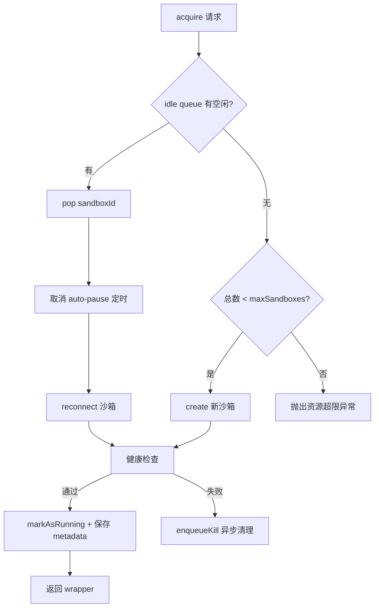
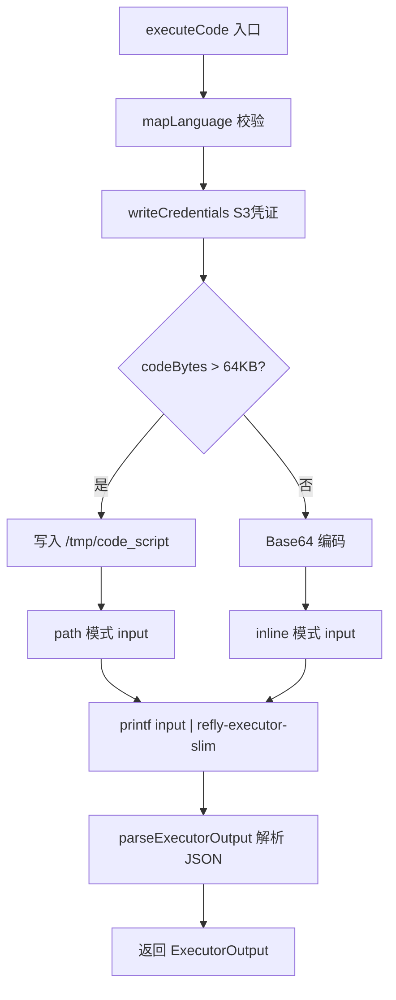
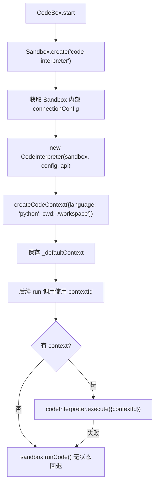

# PD-05.06 Refly — Scalebox 沙箱池化与 CodeContext 状态持久化

> 文档编号：PD-05.06
> 来源：Refly `packages/sandbox-agent/`, `apps/api/src/modules/tool/sandbox/`
> GitHub：https://github.com/refly-ai/refly.git
> 问题域：PD-05 沙箱隔离 Sandbox Isolation
> 状态：可复用方案

---

## 第 1 章 问题与动机

### 1.1 核心问题

在 AI Agent 产品中，用户通过自然语言描述意图，LLM 将其转化为代码并执行——这个"意图→代码→执行"链条的安全性至关重要。代码执行必须在隔离环境中进行，防止用户代码影响宿主机。同时，多用户并发场景下沙箱资源的高效复用是工程难题：冷启动慢（创建新沙箱需数秒）、资源浪费（每次执行都创建新沙箱）、状态丢失（执行间变量不持久）。

Refly 面临的具体挑战：
1. **多用户并发**：SaaS 产品需要同时服务大量用户的代码执行请求
2. **执行间状态**：用户期望像 Jupyter Notebook 一样，前一次执行的变量在后续执行中可用
3. **文件持久化**：代码生成的图表、CSV 等文件需要持久化到用户的 Drive 空间
4. **资源成本**：云沙箱按时间计费，空闲沙箱需要及时暂停

### 1.2 Refly 的解法概述

Refly 实现了**双层沙箱架构**——生产级 Scalebox 服务层 + SDK 级 CodeBox 适配层：

1. **Redis 驱动的沙箱池**（`scalebox.pool.ts:20`）：idle queue + metadata 存储，实现沙箱的 acquire/release/pause/kill 全生命周期管理
2. **BullMQ 异步执行队列**（`scalebox.service.ts:280-310`）：请求排队 + 队列过载保护，防止资源耗尽
3. **CodeContext 状态持久化**（`codebox-adapter.ts:93-104`）：通过 Scalebox SDK 的 CodeInterpreter 维护执行上下文，变量跨调用持久
4. **自定义 Executor 二进制**（`wrapper/executor.ts:44`）：`refly-executor-slim` 处理代码执行、S3 挂载、文件 diff 追踪
5. **双模式代码传输**（`wrapper/executor.ts:145-174`）：小代码 Base64 内联，大代码（>64KB）写文件后路径引用

### 1.3 设计思想

| 设计原则 | 具体实现 | 理由 | 替代方案 |
|----------|----------|------|----------|
| 池化复用 | Redis idle queue + auto-pause 调度 | 冷启动耗时数秒，池化将延迟降至毫秒级 | 每次创建新沙箱（延迟高、成本高） |
| 异步队列 | BullMQ + QueueEvents 等待完成 | 解耦请求接收与执行，支持并发限制 | 同步执行（无法限流） |
| 上下文持久化 | CodeInterpreter + CodeContext ID | 用户期望 Notebook 式交互体验 | 每次执行独立（无状态，体验差） |
| 文件系统隔离 | S3 FUSE 挂载 `/mnt/refly` | 文件持久化到云存储，沙箱销毁不丢数据 | 本地文件系统（沙箱销毁即丢失） |
| 分级超时 | 单次执行 5min + 沙箱总超时 1h | 防止单次死循环，也防止沙箱长期占用 | 单一超时（粒度不够） |
| 优雅降级 | CodeInterpreter 失败回退到 sandbox.runCode | 上下文执行失败不阻塞功能 | 直接报错（可用性差） |

---

## 第 2 章 源码实现分析

### 2.1 架构概览

Refly 的沙箱系统分为三层：API 服务层、沙箱池层、执行器层。

```
┌─────────────────────────────────────────────────────────────────┐
│                        API Layer                                 │
│  ScaleboxService (scalebox.service.ts)                          │
│  ├─ execute() → BullMQ 队列 → executeCode()                     │
│  ├─ Queue 过载保护 (maxQueueSize=100)                            │
│  └─ 文件注册 → DriveService                                     │
├─────────────────────────────────────────────────────────────────┤
│                        Pool Layer                                │
│  SandboxPool (scalebox.pool.ts)                                 │
│  ├─ acquire(): idle queue pop → reconnect / create              │
│  ├─ release(): mark idle → push queue → schedule pause          │
│  └─ Redis: metadata + idle queue + locks                        │
├─────────────────────────────────────────────────────────────────┤
│                      Executor Layer                              │
│  ExecutorWrapper (wrapper/executor.ts)                           │
│  ├─ executeCode(): S3 cred → code prep → executor binary        │
│  ├─ healthCheck(): refly-executor-slim --version                 │
│  └─ parseExecutorOutput(): JSON from stdout                     │
├─────────────────────────────────────────────────────────────────┤
│                     Scalebox Cloud                               │
│  Sandbox.create() / Sandbox.connect() / sandbox.betaPause()     │
│  └─ 进程隔离 + 文件系统隔离 + 网络隔离                            │
└─────────────────────────────────────────────────────────────────┘
```

SDK 层（sandbox-agent 包）提供了独立的 CodeBox 适配器和 CodeInterpreterSession，面向单用户 SDK 场景：

```
┌──────────────────────────────────────────────┐
│  CodeInterpreterSession (session.ts)         │
│  ├─ LangChain AgentExecutor + python tool    │
│  ├─ 多 LLM 支持 (OpenAI/Azure/Anthropic)     │
│  └─ 文件上传/下载 + 输出处理                   │
├──────────────────────────────────────────────┤
│  CodeBox (codebox-adapter.ts)                │
│  ├─ Scalebox SDK 封装                        │
│  ├─ CodeInterpreter + CodeContext            │
│  └─ 文件元数据提取 (savefig/to_csv 等)        │
├──────────────────────────────────────────────┤
│  Scalebox SDK (@scalebox/sdk)                │
│  └─ Sandbox + CodeInterpreter 原生 API       │
└──────────────────────────────────────────────┘
```

### 2.2 核心实现

#### 2.2.1 沙箱池 acquire/release 流程



对应源码 `apps/api/src/modules/tool/sandbox/scalebox.pool.ts:51-108`：

```typescript
@Trace('pool.acquire', { 'operation.type': 'pool_acquire' })
async acquire(context: ExecutionContext): Promise<ISandboxWrapper> {
  const onFailed = (sandboxId: string, error: Error) => {
    this.enqueueKill(sandboxId, `acquire:${error.message.slice(0, 50)}`);
  };

  const wrapper = await guard(async () => {
    const sandboxId = await this.storage.popFromIdleQueue(this.templateName);
    if (!sandboxId) {
      throw new SandboxCreationException('No idle sandbox available');
    }
    try {
      await this.cancelPause(sandboxId);
    } catch (error) {
      throw error;
    }
    return await this.reconnect(sandboxId, context);
  }).orElse(async (error) => {
    const totalCount = await this.storage.getTotalSandboxCount();
    guard.ensure(totalCount < this.maxSandboxes)
      .orThrow(() => new SandboxCreationException(
        `Sandbox resource limit exceeded (${totalCount}/${this.maxSandboxes})`
      ));
    return await this.wrapperFactory.create(context, this.sandboxTimeoutMs, onFailed);
  });

  await guard.bestEffort(async () => {
    wrapper.markAsRunning();
    await this.storage.saveMetadata(wrapper);
  });

  return wrapper;
}
```

关键设计点：
- `guard().orElse()` 模式：idle queue 取不到就创建新的，优雅的 fallback 链
- `enqueueKill`（`scalebox.pool.ts:202-211`）：失败的沙箱通过 BullMQ 异步清理，不阻塞主流程
- `cancelPause`（`scalebox.pool.ts:155-163`）：从 idle queue 取出时取消待执行的 pause 任务

#### 2.2.2 代码执行与双模式传输



对应源码 `apps/api/src/modules/tool/sandbox/wrapper/executor.ts:124-197`：

```typescript
@Trace('sandbox.executeCode', { 'operation.type': 'code_execution' })
async executeCode(
  params: SandboxExecuteParams,
  ctx: ExecuteCodeContext,
): Promise<ExecutorOutput> {
  const { logger, timeoutMs, s3Config, s3DrivePath, limits, codeSizeThreshold } = ctx;

  // 1. Map language
  const language = mapLanguage(params.language);
  if (!language) throw new SandboxLanguageNotSupportedException(params.language);

  // 2. Write S3 credentials
  await this.writeCredentials(s3Config);

  // 3. Prepare code (inline vs path mode)
  const codeBytes = Buffer.byteLength(params.code, 'utf8');
  const usePathMode = codeBytes > codeSizeThreshold;

  let input: ExecutorInput;
  if (usePathMode) {
    const codePath = '/tmp/code_script';
    await this.sandbox.files.write(codePath, params.code);
    input = { path: codePath, language, timeout: Math.floor(timeoutMs / 1000),
              cwd: this.cwd, delete: true, s3: this.buildS3Input(s3Config, s3DrivePath), limits };
  } else {
    input = { code: Buffer.from(params.code).toString('base64'), language,
              timeout: Math.floor(timeoutMs / 1000), cwd: this.cwd,
              s3: this.buildS3Input(s3Config, s3DrivePath), limits };
  }

  // 4. Execute via executor binary
  const escaped = JSON.stringify(input).replace(/'/g, "'\"'\"'");
  const result = await guard(() =>
    this.sandbox.commands.run(`printf '%s' '${escaped}' | refly-executor-slim`, {
      timeoutMs: timeoutMs + 10000,
    })
  ).orThrow((error) => new SandboxExecutionFailedException(error));

  return this.parseExecutorOutput(result.stdout);
}
```

#### 2.2.3 CodeContext 状态持久化（SDK 层）



对应源码 `packages/sandbox-agent/src/sandbox/codebox-adapter.ts:152-203`：

```typescript
async start(): Promise<CodeBoxStatus> {
  try {
    this.sandbox = await Sandbox.create('code-interpreter', {
      timeoutMs: this.options.timeoutMs || 1800000,
      metadata: this.options.metadata || {},
      apiKey: this.options.apiKey || process.env.SCALEBOX_API_KEY || '',
    });

    const info = await this.sandbox.getInfo();
    this._sessionId = info.sandboxId;

    // 关键：通过 Sandbox 内部 API 创建 CodeInterpreter
    try {
      const sandboxInternal = this.sandbox as any;
      const connectionConfig = sandboxInternal.connectionConfig;
      const api = sandboxInternal.api;

      if (connectionConfig && api) {
        this.codeInterpreter = new CodeInterpreter(this.sandbox, connectionConfig, api);
        // 创建默认上下文，变量在此上下文内跨调用持久
        this._defaultContext = await this.codeInterpreter.createCodeContext({
          language: 'python',
          cwd: '/workspace',
        });
      }
    } catch (error) {
      console.log('[CodeBox] Falling back to Sandbox session-level persistence');
    }

    return 'running';
  } catch (error) {
    return 'error';
  }
}
```

### 2.3 实现细节

**资源限制体系**（`scalebox.constants.ts:17-22`）：

| 限制项 | 默认值 | 说明 |
|--------|--------|------|
| maxFileSize | 10MB | 单文件大小上限 |
| maxTotalWrite | 50MB | 总写入量上限 |
| maxFiles | 100 | 文件数量上限 |
| maxProcesses | 50 | 进程数量上限 |
| SANDBOX_TIMEOUT_MS | 1 小时 | 沙箱总生命周期 |
| RUN_CODE_TIMEOUT_SEC | 5 分钟 | 单次执行超时 |
| AUTO_PAUSE_DELAY_MS | 2 分钟 | 空闲后自动暂停延迟 |

**分布式锁体系**（`scalebox.service.ts:163-174`）：

执行代码时使用三层 `guard.defer` 嵌套锁：
1. `acquireExecuteLock(uid, canvasId)` — 用户+画布级别锁，防止同一画布并发执行
2. `acquireSandboxWrapper(context)` — 从池中获取沙箱（含自动释放）
3. `acquireSandboxLock(sandboxId)` — 沙箱级别锁，防止同一沙箱并发操作

**自动包安装**（`session.ts:528-536`）：

当代码执行报 `ModuleNotFoundError` 时，自动提取包名并安装：
```typescript
const moduleNotFoundMatch = output.content.match(
  /ModuleNotFoundError: No module named '(.*)'/
);
if (moduleNotFoundMatch) {
  const packageName = moduleNotFoundMatch[1];
  await this.codebox.install(packageName);
  return `${packageName} was missing but got installed now. Please try again.`;
}
```

**文件元数据静态提取**（`codebox-adapter.ts:278-380`）：

CodeBox 在执行前通过正则匹配代码中的文件操作调用（`savefig`、`to_csv`、`to_json`、`to_excel`、`Image.save`、`open(..., 'w')`），提取预期生成的文件列表。这是一种"预测式"文件追踪，与生产层 executor 的"实际 diff"追踪互补。


---

## 第 3 章 迁移指南

### 3.1 迁移清单

**阶段 1：基础沙箱执行**
- [ ] 选择沙箱后端（Scalebox / Docker / Firecracker）
- [ ] 实现 `ISandboxWrapper` 接口：`executeCode`、`healthCheck`、`betaPause`、`kill`
- [ ] 实现 `BaseSandboxWrapper` 基类的状态管理（running/idle/paused）
- [ ] 配置资源限制（文件大小、进程数、执行超时）

**阶段 2：沙箱池化**
- [ ] 实现 Redis 存储层（idle queue + metadata）
- [ ] 实现 `SandboxPool.acquire()`：idle queue pop → reconnect → fallback create
- [ ] 实现 `SandboxPool.release()`：mark idle → push queue → schedule pause
- [ ] 实现 auto-pause 调度（BullMQ delayed job）
- [ ] 实现异步 kill 清理（fire-and-forget 模式）

**阶段 3：执行队列与并发控制**
- [ ] 配置 BullMQ 执行队列 + QueueEvents
- [ ] 实现队列过载保护（maxQueueSize 检查）
- [ ] 实现分布式锁（用户级 + 沙箱级双层锁）

**阶段 4：上下文持久化（可选）**
- [ ] 集成 CodeInterpreter API
- [ ] 实现 CodeContext 创建/销毁
- [ ] 实现 context 回退机制（CodeInterpreter 失败 → 无状态执行）

### 3.2 适配代码模板

**沙箱池核心实现（TypeScript + Redis）：**

```typescript
import { Redis } from 'ioredis';

interface SandboxMetadata {
  sandboxId: string;
  cwd: string;
  createdAt: number;
  idleSince: number;
  isPaused: boolean;
}

class SandboxPool {
  private redis: Redis;
  private maxSandboxes: number;
  private autoPauseDelayMs: number;

  constructor(redis: Redis, options: { maxSandboxes: number; autoPauseDelayMs: number }) {
    this.redis = redis;
    this.maxSandboxes = options.maxSandboxes;
    this.autoPauseDelayMs = options.autoPauseDelayMs;
  }

  async acquire(context: { apiKey: string; canvasId: string }): Promise<SandboxWrapper> {
    // 1. 尝试从 idle queue 获取
    const sandboxId = await this.redis.lpop('sandbox:idle');
    if (sandboxId) {
      const metadata = await this.loadMetadata(sandboxId);
      if (metadata) {
        const wrapper = await SandboxWrapper.reconnect(sandboxId, context.apiKey);
        if (await wrapper.healthCheck()) {
          wrapper.markAsRunning();
          await this.saveMetadata(wrapper);
          return wrapper;
        }
        // 健康检查失败，异步清理
        this.enqueueKill(sandboxId);
      }
    }

    // 2. 检查资源限制
    const total = await this.redis.scard('sandbox:all');
    if (total >= this.maxSandboxes) {
      throw new Error(`Resource limit: ${total}/${this.maxSandboxes}`);
    }

    // 3. 创建新沙箱
    const wrapper = await SandboxWrapper.create(context);
    await this.saveMetadata(wrapper);
    return wrapper;
  }

  async release(wrapper: SandboxWrapper): Promise<void> {
    wrapper.markAsIdle();
    await this.saveMetadata(wrapper);
    await this.redis.rpush('sandbox:idle', wrapper.sandboxId);
    // 调度 auto-pause
    setTimeout(() => this.pauseIfIdle(wrapper.sandboxId), this.autoPauseDelayMs);
  }

  private async pauseIfIdle(sandboxId: string): Promise<void> {
    const meta = await this.loadMetadata(sandboxId);
    if (meta && !meta.isPaused && Date.now() - meta.idleSince > this.autoPauseDelayMs) {
      // 执行 pause
    }
  }

  private async loadMetadata(id: string): Promise<SandboxMetadata | null> {
    const data = await this.redis.get(`sandbox:meta:${id}`);
    return data ? JSON.parse(data) : null;
  }

  private async saveMetadata(wrapper: SandboxWrapper): Promise<void> {
    await this.redis.set(
      `sandbox:meta:${wrapper.sandboxId}`,
      JSON.stringify(wrapper.toMetadata()),
    );
    await this.redis.sadd('sandbox:all', wrapper.sandboxId);
  }

  private enqueueKill(sandboxId: string): void {
    // 异步清理，不阻塞主流程
    setImmediate(async () => { /* kill sandbox */ });
  }
}
```

### 3.3 适用场景

| 场景 | 适用度 | 说明 |
|------|--------|------|
| SaaS 代码执行产品 | ⭐⭐⭐ | 完美匹配：多用户并发 + 池化复用 + 队列限流 |
| AI Agent 代码解释器 | ⭐⭐⭐ | CodeContext 持久化提供 Notebook 式体验 |
| 在线编程教育平台 | ⭐⭐ | 池化有价值，但可能不需要 S3 文件持久化 |
| CI/CD 构建系统 | ⭐ | 构建任务通常需要更大资源，池化收益有限 |
| 单用户本地 Agent | ⭐ | 过度设计，直接用 Docker 即可 |

---

## 第 4 章 测试用例

```python
import pytest
from unittest.mock import AsyncMock, MagicMock, patch
from dataclasses import dataclass

@dataclass
class MockSandboxMetadata:
    sandboxId: str
    cwd: str
    createdAt: int
    idleSince: int
    isPaused: bool = False

class TestSandboxPool:
    """测试沙箱池 acquire/release 生命周期"""

    @pytest.fixture
    def mock_redis(self):
        redis = AsyncMock()
        redis.lpop = AsyncMock(return_value=None)
        redis.rpush = AsyncMock()
        redis.scard = AsyncMock(return_value=0)
        redis.get = AsyncMock(return_value=None)
        redis.set = AsyncMock()
        redis.sadd = AsyncMock()
        return redis

    @pytest.mark.asyncio
    async def test_acquire_creates_new_when_idle_empty(self, mock_redis):
        """idle queue 为空时应创建新沙箱"""
        mock_redis.lpop.return_value = None
        mock_redis.scard.return_value = 0
        # 验证 create 被调用而非 reconnect

    @pytest.mark.asyncio
    async def test_acquire_reuses_idle_sandbox(self, mock_redis):
        """idle queue 有沙箱时应复用"""
        mock_redis.lpop.return_value = "sandbox-123"
        mock_redis.get.return_value = '{"sandboxId":"sandbox-123","cwd":"/mnt/refly","createdAt":1000,"idleSince":2000}'
        # 验证 reconnect 被调用

    @pytest.mark.asyncio
    async def test_acquire_respects_max_sandboxes(self, mock_redis):
        """超过 maxSandboxes 应抛出异常"""
        mock_redis.lpop.return_value = None
        mock_redis.scard.return_value = 10  # 已达上限
        # 验证抛出 SandboxCreationException

    @pytest.mark.asyncio
    async def test_release_pushes_to_idle_queue(self, mock_redis):
        """release 应将沙箱推回 idle queue"""
        # 验证 rpush 被调用 + metadata 更新

    @pytest.mark.asyncio
    async def test_acquire_kills_unhealthy_sandbox(self, mock_redis):
        """健康检查失败的沙箱应被异步清理"""
        mock_redis.lpop.return_value = "sandbox-bad"
        # 验证 enqueueKill 被调用


class TestCodeExecution:
    """测试代码执行双模式传输"""

    def test_small_code_uses_inline_mode(self):
        """小于 64KB 的代码应使用 Base64 内联模式"""
        code = "print('hello')"
        code_bytes = len(code.encode('utf-8'))
        assert code_bytes < 64 * 1024
        # 验证 input 包含 code 字段而非 path

    def test_large_code_uses_path_mode(self):
        """大于 64KB 的代码应使用文件路径模式"""
        code = "x = 1\n" * 10000  # ~60KB+
        code_bytes = len(code.encode('utf-8'))
        # 验证 input 包含 path 字段且 delete=true

    def test_executor_output_parsing(self):
        """应从 stdout 最后一行解析 JSON"""
        stdout = "some log line\n{\"exitCode\":0,\"stdout\":\"hello\"}\n"
        lines = stdout.strip().split('\n')
        for i in range(len(lines) - 1, -1, -1):
            line = lines[i].strip()
            if line.startswith('{') and line.endswith('}'):
                import json
                parsed = json.loads(line)
                assert parsed['exitCode'] == 0
                break


class TestCodeContext:
    """测试 CodeContext 状态持久化"""

    def test_context_fallback_on_failure(self):
        """CodeInterpreter 失败应回退到无状态执行"""
        # 验证 codeInterpreter.execute 失败后调用 sandbox.runCode

    def test_file_metadata_extraction(self):
        """应从代码中提取文件元数据"""
        code = """
import matplotlib.pyplot as plt
plt.savefig('chart.png')
df.to_csv('data.csv')
"""
        # 正则匹配应提取 chart.png 和 data.csv
        import re
        savefig_matches = re.findall(
            r"(?:plt\.|pyplot\.|fig\.)savefig\s*\(\s*['\"]([\\w\\-_./]+\\.(?:png|jpg|jpeg|svg|pdf))['\"]",
            code
        )
        csv_matches = re.findall(r"\\.to_csv\\s*\\(\\s*['\"]([\\w\\-_./]+\\.csv)['\"]", code)
        # 验证提取结果

    def test_auto_package_install(self):
        """ModuleNotFoundError 应触发自动安装"""
        error_output = "ModuleNotFoundError: No module named 'seaborn'"
        import re
        match = re.match(r"ModuleNotFoundError: No module named '(.*)'", error_output)
        assert match is not None
        assert match.group(1) == 'seaborn'
```


---

## 第 5 章 跨域关联

| 关联域 | 关系类型 | 说明 |
|--------|----------|------|
| PD-01 上下文管理 | 协同 | CodeContext 维护执行间变量状态，本质是代码执行层面的上下文管理 |
| PD-02 多 Agent 编排 | 依赖 | CodeInterpreterSession 作为 LangChain AgentExecutor 的工具，被上层编排调度 |
| PD-03 容错与重试 | 协同 | `withLifecycleRetry` 为沙箱创建/重连提供 3 次重试；`guard.bestEffort` 处理非关键失败 |
| PD-04 工具系统 | 依赖 | `BuiltinExecuteCode` 是 Agent 工具系统中的一个 tool，通过 `reflyService.execute` 调用沙箱 |
| PD-06 记忆持久化 | 协同 | 沙箱内文件通过 S3 FUSE 持久化到用户 Drive，跨 session 可访问 |
| PD-08 搜索与检索 | 互斥 | 沙箱内代码执行与外部搜索是两种独立的 Agent 能力，互不干扰 |
| PD-11 可观测性 | 协同 | `@Trace` 装饰器为每个沙箱操作添加分布式追踪 span |

---

## 第 6 章 来源文件索引

| 文件 | 行范围 | 关键实现 |
|------|--------|----------|
| `apps/api/src/modules/tool/sandbox/scalebox.pool.ts` | L20-L212 | SandboxPool：acquire/release/reconnect/enqueueKill |
| `apps/api/src/modules/tool/sandbox/scalebox.service.ts` | L47-L311 | ScaleboxService：execute/executeViaQueue/runCodeInSandbox/registerFiles |
| `apps/api/src/modules/tool/sandbox/wrapper/base.ts` | L49-L280 | ISandboxWrapper 接口 + BaseSandboxWrapper 基类 + 生命周期工具函数 |
| `apps/api/src/modules/tool/sandbox/wrapper/executor.ts` | L44-L306 | ExecutorWrapper：executeCode/healthCheck/writeCredentials/parseExecutorOutput |
| `apps/api/src/modules/tool/sandbox/scalebox.constants.ts` | L1-L103 | 全部常量：资源限制、超时、Redis key、S3 配置 |
| `packages/sandbox-agent/src/sandbox/codebox-adapter.ts` | L93-L631 | CodeBox：start/run/upload/download/extractFileMetadata |
| `packages/sandbox-agent/src/session.ts` | L71-L748 | CodeInterpreterSession：LangChain 集成/多 LLM/文件处理 |
| `packages/agent-tools/src/builtin/sandbox.ts` | L12-L190 | BuiltinExecuteCode：Agent 工具定义/请求构建/错误分类 |
| `packages/sandbox-agent/src/sandbox/types.ts` | L1-L373 | CodeContext/ExecutionResult/Language 类型定义 |

---

## 第 7 章 横向对比维度

> **重要：** 本章用于自动填充 Butcher Wiki 的横向对比表。

```json comparison_data
{
  "project": "Refly",
  "dimensions": {
    "隔离级别": "Scalebox 云沙箱进程级隔离 + S3 FUSE 文件系统隔离",
    "生命周期管理": "Redis idle queue 池化 + BullMQ auto-pause/kill 调度",
    "防御性设计": "三层分布式锁 + 队列过载保护 + 资源限制四维度",
    "Scope 粒度": "用户+画布级锁隔离，同一画布串行执行",
    "多运行时支持": "单一 Scalebox 云运行时，双模板 executor/interpreter",
    "代码修复": "ModuleNotFoundError 自动安装缺失包后重试",
    "工具访问控制": "BuiltinExecuteCode 工具级 allow/deny + 预装包白名单",
    "上下文持久化": "CodeContext ID 跨调用变量持久 + 优雅降级到无状态",
    "资源池化": "Redis idle queue + auto-pause 2min + 最大10沙箱池",
    "文件追踪": "双轨：executor diff 实际追踪 + 正则预测式元数据提取"
  }
}
```

### 域元数据补充

```json domain_metadata
{
  "solution_summary": "Refly 基于 Scalebox 云沙箱实现 Redis 驱动的沙箱池化（idle queue + auto-pause），通过 CodeContext ID 实现跨调用变量持久化，三层分布式锁保障并发安全",
  "description": "云沙箱池化复用与执行上下文跨调用持久化的工程实践",
  "sub_problems": [
    "沙箱池化冷启动：idle queue 为空时创建新沙箱的延迟优化",
    "执行队列过载：高并发下队列满时的请求拒绝与反压策略",
    "大代码传输：超过 shell 参数长度限制的代码需要文件中转",
    "S3 凭证生命周期：沙箱内临时凭证的写入时机与自动清理",
    "暂停态恢复：paused 沙箱 reconnect 后的状态一致性验证"
  ],
  "best_practices": [
    "guard().orElse() 链式降级：idle queue 取不到就 create，比 if-else 更优雅",
    "三层 defer 嵌套锁保障并发：用户锁→沙箱获取→沙箱锁，自动释放不泄漏",
    "双模式代码传输：小代码 Base64 内联，大代码（>64KB）写文件路径引用",
    "fire-and-forget 异步清理：失败沙箱通过 BullMQ 异步 kill，不阻塞主流程",
    "CodeContext 优雅降级：上下文执行失败自动回退到无状态 sandbox.runCode"
  ]
}
```
