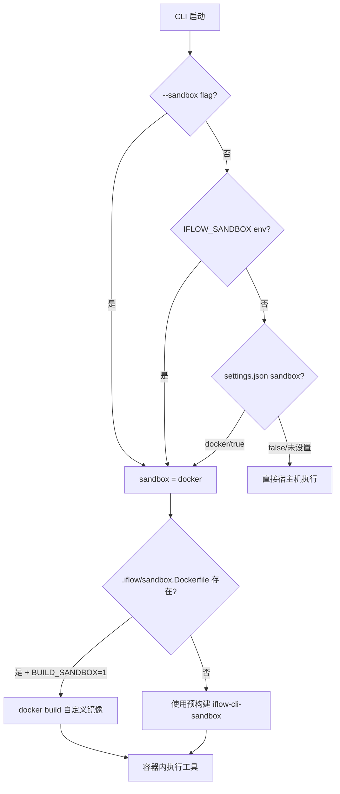
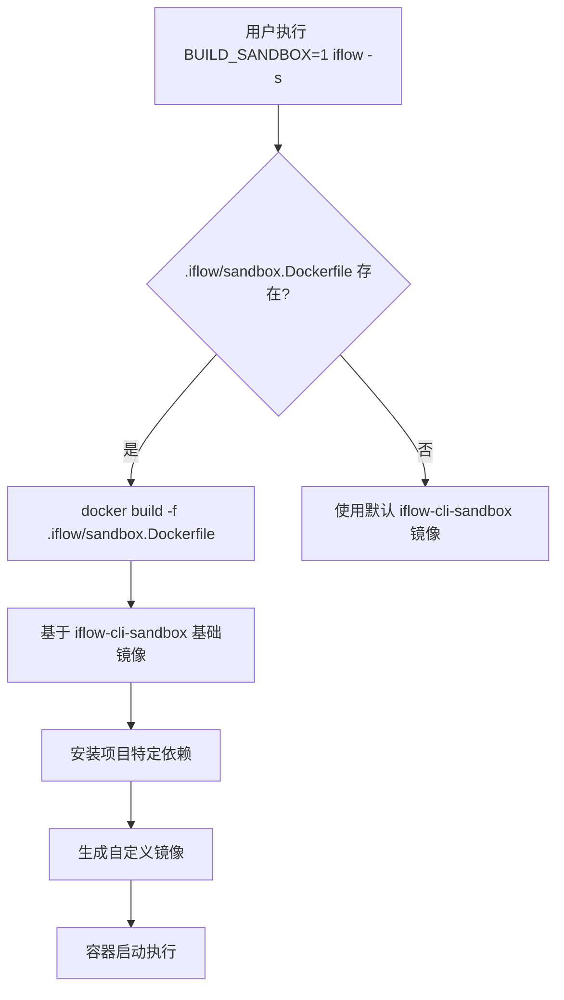
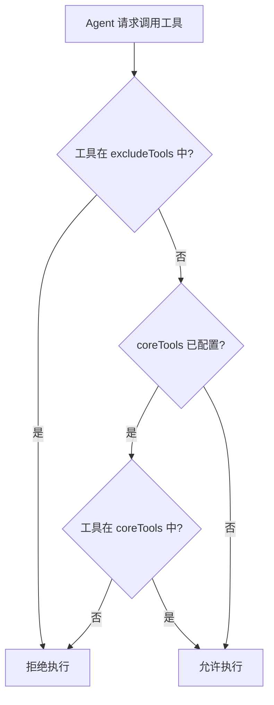
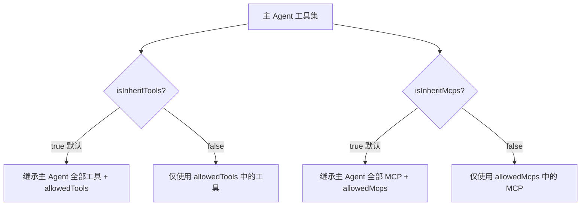

# PD-05.07 iflow-cli — Docker 容器沙箱与多层工具访问控制

> 文档编号：PD-05.07
> 来源：iflow-cli `docs_en/features/sandbox.md` `docs_en/configuration/settings.md`
> GitHub：https://github.com/iflow-ai/iflow-cli.git
> 问题域：PD-05 沙箱隔离 Sandbox Isolation
> 状态：可复用方案

---

## 第 1 章 问题与动机（≥ 30 行）

### 1.1 核心问题

AI CLI 工具在终端中拥有与用户等同的系统权限，当 LLM 驱动的 Agent 执行 shell 命令和文件修改时，
一条错误的 `rm -rf /` 或恶意代码注入就可能摧毁宿主机环境。问题的本质是：
**如何在保持 Agent 完整工具能力的同时，将其破坏半径限制在可控范围内？**

这个问题在 iFlow CLI 场景下尤为突出，因为：
1. iFlow CLI 支持多种 AI 模型（Kimi K2、Qwen3 Coder、DeepSeek v3 等），不同模型的行为可预测性不同
2. 用户可通过 MCP 协议接入第三方工具服务器，扩大了攻击面
3. Sub Agent 系统允许创建专业化子代理，每个子代理都可能执行 shell 命令
4. 支持 `!{command}` 语法在 prompt 中内嵌 shell 命令，增加了注入风险

### 1.2 iflow-cli 的解法概述

iFlow CLI 采用**三层防御纵深**策略实现沙箱隔离：

1. **Docker 容器隔离层**：使用预构建 `iflow-cli-sandbox` Docker 镜像，将 shell 命令和文件修改操作隔离在容器内执行（`docs_en/features/sandbox.md:8`）
2. **工具访问控制层**：通过 `coreTools`/`excludeTools` 配置细粒度控制 Agent 可用工具集，支持命令级限制如 `ShellTool(ls -l)`（`docs_en/configuration/settings.md:281-289`）
3. **Hook 拦截层**：通过 PreToolUse Hook 在工具执行前进行安全检查，可拦截对敏感文件的修改（`docs_en/examples/hooks.md:462-486`）

此外，Sub Agent 的权限继承机制（`isInheritTools`/`isInheritMcps`）提供了第四层——**代理级权限边界**。

### 1.3 设计思想

| 设计原则 | 具体实现 | 理由 | 替代方案 |
|----------|----------|------|----------|
| 默认安全 | 沙箱默认禁用，需显式 `--sandbox` 启用 | 避免 Docker 依赖阻碍新用户上手 | 默认启用（会增加安装门槛） |
| 多入口启用 | CLI flag / 环境变量 / settings.json 三种方式 | 适配交互式、CI/CD、团队统一配置等不同场景 | 仅 CLI flag（不够灵活） |
| 自定义镜像 | `.iflow/sandbox.Dockerfile` + `BUILD_SANDBOX=1` | 项目特定依赖需预装到沙箱，避免运行时安装延迟 | 运行时 apt-get（慢且不可复现） |
| 工具白名单优于黑名单 | `coreTools` 白名单 > `excludeTools` 黑名单 | 黑名单基于字符串匹配易被绕过，文档明确警告 | 仅黑名单（不安全） |
| 权限最小化继承 | Sub Agent 可设 `isInheritTools: false` 切断继承 | 安全审计 Agent 不应继承写文件权限 | 全继承（权限膨胀） |
| macOS 原生沙箱 | `.iflow/sandbox-macos-custom.sb` 配置文件 | macOS 用户无需安装 Docker 也能获得隔离 | 仅 Docker（macOS 体验差） |

---

## 第 2 章 源码实现分析（≥ 60 行，核心章节）

### 2.1 架构概览

> **注意**：iflow-cli 的源码以 npm 包 `@iflow-ai/iflow-cli` 形式分发，GitHub 仓库仅包含文档和安装脚本。
> 以下分析基于文档描述的架构行为和配置接口，结合实际文档中的代码示例。

```
┌─────────────────────────────────────────────────────────┐
│                    iFlow CLI 主进程                       │
│                                                          │
│  ┌──────────┐  ┌──────────────┐  ┌───────────────────┐  │
│  │ Settings  │  │  Tool Router │  │  Sub Agent Engine │  │
│  │ Resolver  │  │              │  │                   │  │
│  │           │  │ coreTools    │  │ isInheritTools    │  │
│  │ sandbox:  │  │ excludeTools │  │ isInheritMcps     │  │
│  │ "docker"  │  │ ShellTool()  │  │ allowedTools      │  │
│  └─────┬─────┘  └──────┬───────┘  └────────┬──────────┘  │
│        │               │                    │             │
│        ▼               ▼                    ▼             │
│  ┌─────────────────────────────────────────────────┐     │
│  │              Hook Pipeline                       │     │
│  │  PreToolUse → [file_protection.py] → Allow/Deny │     │
│  └──────────────────────┬──────────────────────────┘     │
│                         │                                 │
│                         ▼                                 │
│  ┌─────────────────────────────────────────────────┐     │
│  │         Sandbox Execution Layer                  │     │
│  │                                                  │     │
│  │  if sandbox == "docker":                         │     │
│  │    docker run iflow-cli-sandbox <command>        │     │
│  │  elif sandbox-macos-custom.sb exists:            │     │
│  │    sandbox-exec -f .sb <command>                 │     │
│  │  else:                                           │     │
│  │    direct host execution                         │     │
│  └──────────────────────────────────────────────────┘     │
└─────────────────────────────────────────────────────────┘
```

### 2.2 核心实现

#### 2.2.1 沙箱启用与配置解析



对应配置 `docs_en/configuration/settings.md:318-321`：
```json
{
  "sandbox": "docker"
}
```

配置优先级链（`docs_en/configuration/settings.md:112-120`）：
```
CLI 参数 (--sandbox) 
  > IFLOW_ 环境变量 (IFLOW_SANDBOX)
    > 系统配置 (/etc/iflow-cli/settings.json)
      > 工作区配置 (.iflow/settings.json)
        > 用户配置 (~/.iflow/settings.json)
          > 默认值 (false)
```

环境变量支持 4 种命名约定（`docs_en/configuration/settings.md:30-35`）：
```bash
# 以下四种写法等价
export IFLOW_sandbox=docker
export IFLOW_SANDBOX=docker
export iflow_sandbox=docker
export iflow_SANDBOX=docker
```

#### 2.2.2 自定义沙箱镜像构建



对应源码 `docs_en/features/sandbox.md:17-32`：
```dockerfile
# .iflow/sandbox.Dockerfile
FROM iflow-cli-sandbox

# 项目特定依赖预装
RUN apt-get update && apt-get install -y some-package
COPY ./my-config /app/my-config
```

构建触发方式：
```bash
BUILD_SANDBOX=1 iflow -s
```

`--sandbox-image` 参数允许指定任意镜像 URI（`docs_en/configuration/settings.md:548-549`），
适用于团队共享预构建镜像的场景。

#### 2.2.3 工具访问控制——白名单与黑名单



对应配置 `docs_en/configuration/settings.md:280-289`：
```json
{
  "coreTools": ["ReadFileTool", "GlobTool", "ShellTool(ls)"],
  "excludeTools": ["ShellTool(rm -rf)"]
}
```

关键设计细节：
- `coreTools` 是白名单：只有列出的工具可用
- `excludeTools` 是黑名单：列出的工具被禁用
- 两者冲突时 `excludeTools` 优先
- `ShellTool(command)` 语法支持命令级粒度控制
- **安全警告**：`excludeTools` 基于简单字符串匹配，**不是安全机制**，可被绕过（`docs_en/configuration/settings.md:289`）

#### 2.2.4 Sub Agent 权限继承与隔离



对应配置 `docs_en/examples/subagent.md:356-367`：
```markdown
---
agentType: "security-auditor"
systemPrompt: "You are a security audit expert..."
whenToUse: "Use when performing security audits"
allowedTools: ["Read", "Grep", "Bash"]
allowedMcps: ["security-scanner", "vulnerability-db"]
isInheritTools: false
isInheritMcps: false
---
```

此配置确保安全审计 Agent 只能读取和搜索代码，不能写入或修改文件。

### 2.3 实现细节

#### Hook 拦截机制

iFlow CLI 的 Hook 系统提供了工具执行前后的拦截点（`docs_en/examples/hooks.md:451-486`）。
文件保护 Hook 示例：

```python
# file_protection.py — PreToolUse Hook
import json, sys
data = json.load(sys.stdin)
file_path = data.get('tool_input', {}).get('file_path', '')
sensitive_files = ['.env', 'package-lock.json', '.git/']
sys.exit(2 if any(p in file_path for p in sensitive_files) else 0)
```

Hook 通过 stdin 接收 JSON 格式的工具调用参数，返回非零退出码即可阻止执行。
环境变量 `IFLOW_TOOL_NAME` 和 `IFLOW_TOOL_ARGS` 提供额外上下文（`docs_en/examples/hooks.md:960-966`）。

#### 环境变量引用解析

settings.json 中支持 `$VAR_NAME` 或 `${VAR_NAME}` 语法引用宿主机环境变量（`docs_en/configuration/settings.md:219`）。
这对 MCP Docker 服务器配置尤为重要：

```json
{
  "myDockerServer": {
    "command": "docker",
    "args": ["run", "-i", "--rm", "-e", "API_KEY", "ghcr.io/foo/bar"],
    "env": {
      "API_KEY": "$MY_API_TOKEN"
    }
  }
}
```

变量在配置加载时解析，确保敏感值不硬编码在配置文件中。

#### 遥测追踪

沙箱状态通过 OpenTelemetry 追踪（`docs_en/features/telemetry.md:164`）：
- `sandbox_enabled`（boolean）记录在 `iflow_cli.config` 事件中
- 与 `model`、`approval_mode`、`core_tools_enabled` 等属性一起上报
- 支持 Jaeger UI 可视化查看


---

## 第 3 章 迁移指南（≥ 40 行）

### 3.1 迁移清单

**阶段 1：Docker 沙箱基础**
- [ ] 创建基础沙箱 Docker 镜像（包含 Node.js 运行时 + 常用工具）
- [ ] 实现 `sandbox` 配置项解析（支持 boolean / string 类型）
- [ ] 实现三入口启用：CLI flag、环境变量、配置文件
- [ ] 实现配置优先级链：CLI > env > system > workspace > user > default
- [ ] 将 shell 命令执行路由到 Docker 容器

**阶段 2：自定义镜像支持**
- [ ] 支持项目级 `sandbox.Dockerfile` 检测与构建
- [ ] 实现 `BUILD_SANDBOX=1` 环境变量触发自动构建
- [ ] 支持 `--sandbox-image` 参数指定任意镜像 URI
- [ ] 镜像缓存：相同 Dockerfile 内容不重复构建

**阶段 3：工具访问控制**
- [ ] 实现 `coreTools` 白名单过滤
- [ ] 实现 `excludeTools` 黑名单过滤（excludeTools 优先）
- [ ] 支持 `ToolName(command)` 命令级粒度控制
- [ ] Sub Agent 权限继承机制（`isInheritTools`/`isInheritMcps`）

**阶段 4：Hook 拦截层**
- [ ] 实现 PreToolUse Hook 管道
- [ ] Hook 通过 stdin JSON 接收工具调用参数
- [ ] 非零退出码阻止工具执行
- [ ] 环境变量注入（TOOL_NAME、TOOL_ARGS）

### 3.2 适配代码模板

#### 沙箱配置解析器

```typescript
interface SandboxConfig {
  enabled: boolean;
  type: 'docker' | 'macos-native' | 'none';
  image: string;
  customDockerfile?: string;
}

function resolveSandboxConfig(
  cliArgs: { sandbox?: boolean; sandboxImage?: string },
  env: Record<string, string>,
  settings: { sandbox?: boolean | string }
): SandboxConfig {
  // 优先级：CLI > env > settings > default
  const sandboxValue = cliArgs.sandbox
    ?? parseBoolOrString(env['IFLOW_SANDBOX'] ?? env['iflow_SANDBOX'])
    ?? settings.sandbox
    ?? false;

  if (!sandboxValue) {
    return { enabled: false, type: 'none', image: '' };
  }

  const image = cliArgs.sandboxImage ?? 'iflow-cli-sandbox';
  const customDockerfile = findCustomDockerfile('.iflow/sandbox.Dockerfile');

  return {
    enabled: true,
    type: typeof sandboxValue === 'string' && sandboxValue === 'docker' ? 'docker' : 'docker',
    image,
    customDockerfile: customDockerfile ?? undefined,
  };
}
```

#### 工具访问控制过滤器

```typescript
interface ToolFilter {
  coreTools?: string[];    // 白名单
  excludeTools?: string[]; // 黑名单
}

function isToolAllowed(toolName: string, command: string | undefined, filter: ToolFilter): boolean {
  const fullName = command ? `${toolName}(${command})` : toolName;

  // excludeTools 优先级最高
  if (filter.excludeTools?.some(t => fullName.includes(t) || toolName === t)) {
    return false;
  }

  // 如果 coreTools 未配置，允许所有
  if (!filter.coreTools || filter.coreTools.length === 0) {
    return true;
  }

  // coreTools 白名单检查
  return filter.coreTools.some(t => fullName.includes(t) || toolName === t);
}
```

#### Sub Agent 权限继承

```typescript
function resolveAgentTools(
  parentTools: string[],
  agentConfig: {
    allowedTools?: string[];
    isInheritTools?: boolean; // default true
  }
): string[] {
  if (agentConfig.isInheritTools === false) {
    return agentConfig.allowedTools ?? [];
  }
  // 继承父级 + 自身额外工具
  return [...new Set([...parentTools, ...(agentConfig.allowedTools ?? [])])];
}
```

### 3.3 适用场景

| 场景 | 适用度 | 说明 |
|------|--------|------|
| CLI AI 助手（类 Claude Code） | ⭐⭐⭐ | 完美匹配：shell 命令 + 文件修改需要隔离 |
| CI/CD 中的 AI 代码审查 | ⭐⭐⭐ | 通过环境变量启用沙箱，无需交互 |
| 多模型 Agent 平台 | ⭐⭐ | 工具访问控制适用，但 Docker 沙箱可能不够（需要更细粒度的网络/资源限制） |
| 纯对话 AI 应用 | ⭐ | 无工具执行需求，沙箱无意义 |
| 高安全要求场景 | ⭐⭐ | excludeTools 字符串匹配可被绕过，需额外加固 |

---

## 第 4 章 测试用例（≥ 20 行）

```python
import pytest
from unittest.mock import patch, MagicMock

class TestSandboxConfigResolution:
    """测试沙箱配置解析优先级链"""

    def test_cli_flag_highest_priority(self):
        config = resolve_sandbox_config(
            cli_args={"sandbox": True},
            env={"IFLOW_SANDBOX": ""},
            settings={"sandbox": False}
        )
        assert config["enabled"] is True
        assert config["type"] == "docker"

    def test_env_var_overrides_settings(self):
        config = resolve_sandbox_config(
            cli_args={},
            env={"IFLOW_SANDBOX": "docker"},
            settings={"sandbox": False}
        )
        assert config["enabled"] is True

    def test_default_disabled(self):
        config = resolve_sandbox_config(
            cli_args={},
            env={},
            settings={}
        )
        assert config["enabled"] is False

    def test_custom_image_uri(self):
        config = resolve_sandbox_config(
            cli_args={"sandbox": True, "sandbox_image": "my-team/custom-sandbox:v2"},
            env={},
            settings={}
        )
        assert config["image"] == "my-team/custom-sandbox:v2"


class TestToolAccessControl:
    """测试工具白名单/黑名单过滤"""

    def test_exclude_takes_priority(self):
        """excludeTools 优先于 coreTools"""
        f = {"coreTools": ["ShellTool"], "excludeTools": ["ShellTool(rm -rf)"]}
        assert is_tool_allowed("ShellTool", "ls", f) is True
        assert is_tool_allowed("ShellTool", "rm -rf /", f) is False

    def test_core_tools_whitelist(self):
        """coreTools 白名单模式"""
        f = {"coreTools": ["ReadFileTool", "GlobTool"]}
        assert is_tool_allowed("ReadFileTool", None, f) is True
        assert is_tool_allowed("ShellTool", "ls", f) is False

    def test_no_filter_allows_all(self):
        """无过滤器时允许所有工具"""
        f = {}
        assert is_tool_allowed("ShellTool", "rm -rf /", f) is True

    def test_string_matching_bypass_warning(self):
        """验证字符串匹配可被绕过（文档已警告）"""
        f = {"excludeTools": ["ShellTool(rm -rf)"]}
        # 变体命令绕过黑名单
        assert is_tool_allowed("ShellTool", "rm  -rf /", f) is True  # 双空格绕过


class TestSubAgentPermissionInheritance:
    """测试 Sub Agent 权限继承机制"""

    def test_inherit_true_merges_tools(self):
        parent_tools = ["Read", "Write", "Shell"]
        agent_config = {"allowedTools": ["Grep"], "isInheritTools": True}
        result = resolve_agent_tools(parent_tools, agent_config)
        assert set(result) == {"Read", "Write", "Shell", "Grep"}

    def test_inherit_false_isolates(self):
        parent_tools = ["Read", "Write", "Shell"]
        agent_config = {"allowedTools": ["Read", "Grep"], "isInheritTools": False}
        result = resolve_agent_tools(parent_tools, agent_config)
        assert set(result) == {"Read", "Grep"}

    def test_no_allowed_tools_with_no_inherit(self):
        parent_tools = ["Read", "Write"]
        agent_config = {"isInheritTools": False}
        result = resolve_agent_tools(parent_tools, agent_config)
        assert result == []
```


---

## 第 5 章 跨域关联

| 关联域 | 关系类型 | 说明 |
|--------|----------|------|
| PD-01 上下文管理 | 协同 | `summarizeToolOutput` 对 `run_shell_command` 输出做 token 预算压缩，沙箱内命令输出同样受此控制 |
| PD-02 多 Agent 编排 | 依赖 | Sub Agent 的 `isInheritTools`/`isInheritMcps` 权限继承直接影响沙箱内工具可用性 |
| PD-04 工具系统 | 强依赖 | `coreTools`/`excludeTools` 是工具注册表的过滤层，MCP 服务器的 `includeTools`/`excludeTools` 是另一层 |
| PD-09 Human-in-the-Loop | 协同 | `autoAccept: false` 时用户需确认工具调用，与沙箱形成双重保护；Hook 的 exit code 2 可阻止执行 |
| PD-10 中间件管道 | 协同 | Hook Pipeline（PreToolUse/PostToolUse）本质是中间件模式，file_protection.py 是安全中间件 |
| PD-11 可观测性 | 协同 | `sandbox_enabled` 通过 OpenTelemetry 上报，Jaeger UI 可追踪沙箱内工具执行链路 |

---

## 第 6 章 来源文件索引

| 文件 | 行范围 | 关键实现 |
|------|--------|----------|
| `docs_en/features/sandbox.md` | L1-L32 | 沙箱功能完整文档：启用方式、默认镜像、自定义 Dockerfile |
| `docs_en/configuration/settings.md` | L318-L321 | `sandbox` 配置项定义（boolean/string） |
| `docs_en/configuration/settings.md` | L546-L549 | `--sandbox` 和 `--sandbox-image` CLI 参数 |
| `docs_en/configuration/settings.md` | L280-L289 | `coreTools`/`excludeTools` 工具访问控制 |
| `docs_en/configuration/settings.md` | L219 | 环境变量 `$VAR` 引用解析 |
| `docs_en/configuration/settings.md` | L112-L120 | 配置优先级链 |
| `docs_en/configuration/settings.md` | L225 | `.iflow/sandbox-macos-custom.sb` macOS 沙箱配置 |
| `docs_en/examples/hooks.md` | L451-L486 | PreToolUse Hook 文件保护示例 |
| `docs_en/examples/hooks.md` | L960-L966 | Hook 环境变量（TOOL_NAME/TOOL_ARGS） |
| `docs_en/examples/hooks.md` | L979-L981 | Hook 安全建议：沙箱化、资源限制、错误隔离 |
| `docs_en/examples/subagent.md` | L329-L367 | Sub Agent 权限继承配置（isInheritTools/isInheritMcps） |
| `docs_en/features/telemetry.md` | L164 | `sandbox_enabled` 遥测属性 |
| `docs_en/configuration/settings.md` | L352-L358 | MCP Docker 服务器配置示例 |
| `docs_en/examples/subcommand.md` | L442-L445 | Shell 命令安全机制：白名单 + 危险命令确认 |

---

## 第 7 章 横向对比维度

> **重要：** 本章用于自动填充 Butcher Wiki 的横向对比表。

```json comparison_data
{
  "project": "iflow-cli",
  "dimensions": {
    "隔离级别": "Docker 容器级隔离，shell 命令和文件修改在容器内执行",
    "自定义模板": ".iflow/sandbox.Dockerfile + BUILD_SANDBOX=1 自动构建",
    "配置驱动选择": "CLI flag / 环境变量 / settings.json 三入口，6 级优先级链",
    "工具访问控制": "coreTools 白名单 + excludeTools 黑名单 + ShellTool(cmd) 命令级粒度",
    "生命周期管理": "默认禁用，显式启用；预构建镜像 + 按需自定义构建",
    "防御性设计": "三层纵深：Docker 隔离 + 工具过滤 + Hook 拦截，文档警告黑名单可绕过",
    "Scope 粒度": "Sub Agent 级权限继承控制（isInheritTools/isInheritMcps）",
    "多运行时支持": "Docker + macOS 原生沙箱（.sb profile），双运行时适配",
    "健康检查": "遥测系统追踪 sandbox_enabled 状态，OpenTelemetry + Jaeger 可视化"
  }
}
```

### 域元数据补充

```json domain_metadata
{
  "solution_summary": "iflow-cli 用 Docker 容器 + coreTools/excludeTools 白黑名单 + PreToolUse Hook 三层纵深实现沙箱隔离，Sub Agent 通过 isInheritTools 切断权限继承",
  "description": "多层防御纵深比单一容器隔离更可靠，工具级和代理级权限控制是必要补充",
  "sub_problems": [
    "字符串匹配绕过：excludeTools 基于简单字符串匹配，命令变体（如双空格、别名）可绕过黑名单",
    "多入口配置一致性：CLI flag、环境变量、settings.json 三入口需要统一的优先级解析，避免配置冲突",
    "macOS 原生沙箱与 Docker 沙箱的能力差异：两种运行时的隔离粒度和文件系统行为不同"
  ],
  "best_practices": [
    "白名单优于黑名单：coreTools 显式声明可用工具比 excludeTools 排除危险工具更安全，iflow-cli 文档明确警告黑名单可被绕过",
    "Sub Agent 权限最小化：安全审计类 Agent 应设 isInheritTools: false 切断继承，仅授予 Read/Grep 等只读工具",
    "三层纵深防御：容器隔离 + 工具过滤 + Hook 拦截，任一层被突破仍有其他层兜底"
  ]
}
```
