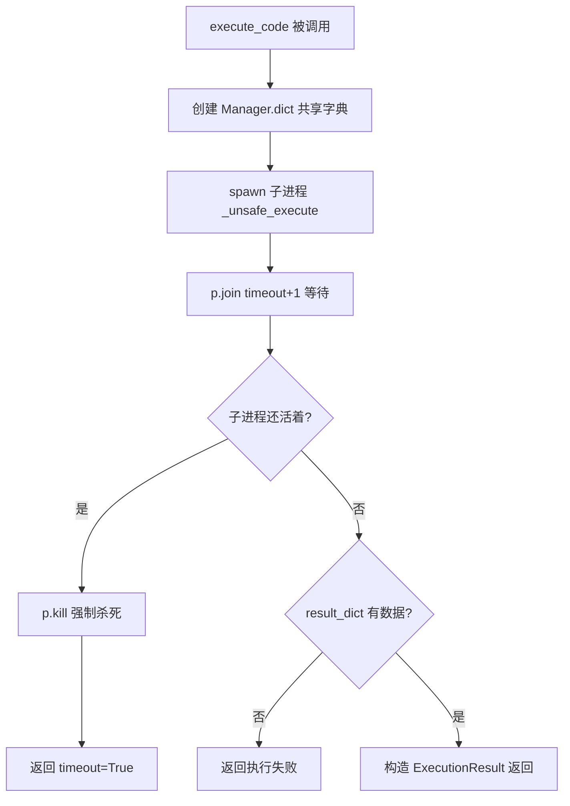
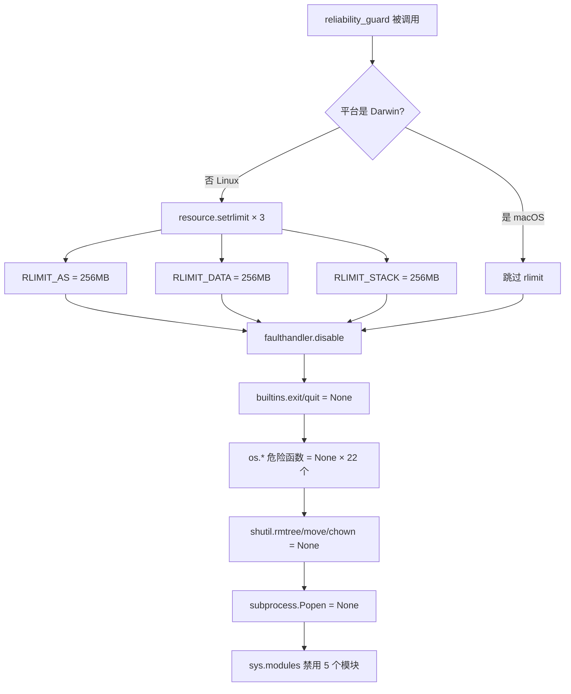
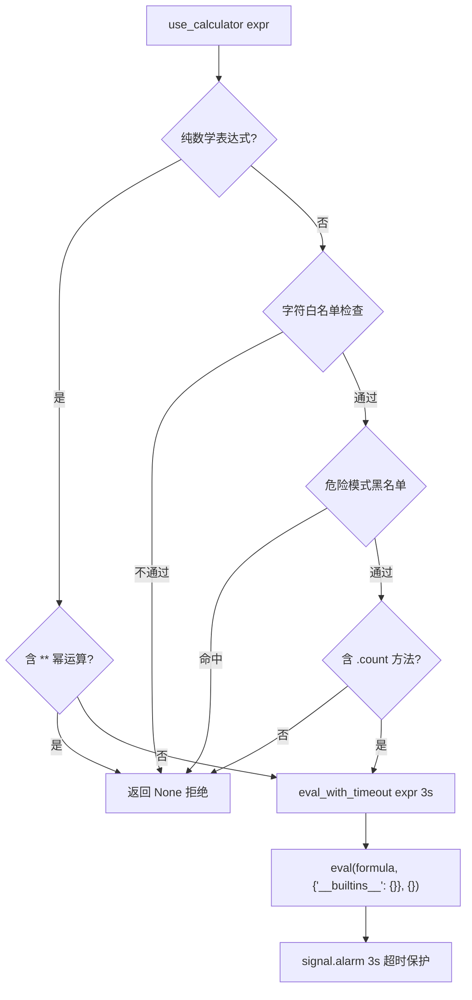

# PD-05.17 nanochat — 进程级 Python 代码沙箱

> 文档编号：PD-05.17
> 来源：nanochat `nanochat/execution.py`
> GitHub：https://github.com/karpathy/nanochat.git
> 问题域：PD-05 沙箱隔离 Sandbox Isolation
> 状态：可复用方案

---

## 第 1 章 问题与动机

### 1.1 核心问题

LLM 训练流水线中，模型生成的代码需要被执行以评估其正确性（如 HumanEval benchmark）。这些代码来自模型采样，可能包含无限循环、内存爆炸、文件系统破坏、进程杀死等危险行为。如果直接在宿主进程中 `exec()` 执行，一次失控的生成就可能导致整个评估流水线崩溃甚至宿主机受损。

nanochat 面临的具体挑战：
- **评估吞吐量**：HumanEval 有 164 道题，每题可能生成多个候选解，需要快速批量执行
- **故障隔离**：单个生成代码的崩溃不能影响其他题目的评估
- **资源可控**：模型可能生成 `while True` 死循环或分配巨量内存
- **轻量级**：作为训练流水线的一部分，沙箱不能引入 Docker/容器等重依赖

nanochat 的定位是"最简实验平台"（simplest experimental harness），因此沙箱方案也追求极简：纯 Python 标准库实现，零外部依赖，单文件 350 行完成全部隔离逻辑。

### 1.2 nanochat 的解法概述

nanochat 采用 **multiprocessing 进程隔离 + 多层防御** 的方案，核心思路是"用子进程当一次性容器"：

1. **进程级隔离**：每次代码执行 spawn 一个独立子进程，通过 `multiprocessing.Process` 实现（`execution.py:313`）
2. **双重超时保护**：进程内 `signal.ITIMER_REAL` 精确计时 + 进程外 `p.join(timeout)` 兜底杀进程（`execution.py:69` + `execution.py:318`）
3. **内存硬限制**：`resource.setrlimit` 设置 RLIMIT_AS/DATA/STACK 三重内存上限，默认 256MB（`execution.py:150-152`）
4. **API 猴子补丁**：将 `os.kill`、`os.fork`、`subprocess.Popen` 等 30+ 个危险函数置为 None（`execution.py:165-201`）
5. **临时目录隔离**：每次执行在 `tempfile.TemporaryDirectory` 中运行，执行后自动清理（`execution.py:90-93`）

### 1.3 设计思想

| 设计原则 | 具体实现 | 理由 | 替代方案 |
|----------|----------|------|----------|
| 进程即容器 | multiprocessing.Process 一次性子进程 | 进程崩溃不影响父进程，OS 自动回收资源 | Docker 容器（太重）、线程（无法隔离） |
| 纵深防御 | 超时 + 内存限制 + API 禁用三层独立 | 任一层被绕过，其他层仍能兜底 | 单一 seccomp 策略（配置复杂） |
| 先保存后禁用 | 禁用 os.rmdir 前先保存引用到局部变量 | 清理临时目录需要这些函数 | 不清理（泄漏磁盘空间） |
| 零依赖 | 纯 Python 标准库（multiprocessing/signal/resource） | 与 nanochat "最简"哲学一致 | E2B/Firecracker（引入外部服务） |
| 结构化结果 | ExecutionResult dataclass 包含 6 个字段 | 调用方可精确区分超时/OOM/异常 | 返回 bool（丢失诊断信息） |

---

## 第 2 章 源码实现分析

### 2.1 架构概览

nanochat 的沙箱由两个独立层组成：

```
┌─────────────────────────────────────────────────────────┐
│                    宿主进程 (评估流水线)                    │
│                                                         │
│  tasks/humaneval.py                                     │
│    └─ evaluate() ──→ execute_code(program)              │
│                          │                              │
│  ┌───────────────────────┼──────────────────────────┐   │
│  │        execution.py   │   公共 API 层             │   │
│  │                       ▼                          │   │
│  │  execute_code(code, timeout=5, mem=256MB)        │   │
│  │    ├─ Manager().dict()  ← 跨进程共享结果          │   │
│  │    ├─ Process(target=_unsafe_execute)             │   │
│  │    ├─ p.join(timeout+1) ← 外层超时兜底            │   │
│  │    └─ p.kill() if alive ← 强制终止                │   │
│  └──────────────────────────────────────────────────┘   │
│                          │ spawn                        │
│  ┌───────────────────────┼──────────────────────────┐   │
│  │        子进程          ▼   隔离执行层              │   │
│  │                                                  │   │
│  │  _unsafe_execute(code, timeout, mem, result_dict) │   │
│  │    ├─ create_tempdir()    ← 临时目录隔离           │   │
│  │    ├─ 保存 rmtree/rmdir   ← 清理函数备份          │   │
│  │    ├─ reliability_guard() ← API 猴子补丁          │   │
│  │    │   ├─ resource.setrlimit × 3                 │   │
│  │    │   ├─ os.kill = None (30+ 函数)              │   │
│  │    │   ├─ subprocess.Popen = None                │   │
│  │    │   └─ sys.modules 禁用 5 个模块               │   │
│  │    ├─ capture_io()        ← stdout/stderr 捕获    │   │
│  │    ├─ time_limit(timeout) ← ITIMER_REAL 信号超时  │   │
│  │    ├─ exec(code, {})      ← 实际执行              │   │
│  │    └─ 恢复 rmtree/rmdir   ← 清理临时目录          │   │
│  └──────────────────────────────────────────────────┘   │
│                                                         │
│  engine.py (独立的计算器沙箱)                             │
│    └─ use_calculator(expr)                              │
│        ├─ 字符白名单过滤                                 │
│        ├─ 危险模式黑名单                                 │
│        └─ eval_with_timeout(expr, 3s)                   │
│            └─ eval(formula, {"__builtins__": {}}, {})    │
└─────────────────────────────────────────────────────────┘
```

nanochat 实际上有**两套沙箱**：
- **execution.py**：重量级沙箱，用于 HumanEval 等需要执行完整 Python 程序的场景
- **engine.py:36-80**：轻量级计算器沙箱，用于推理时的 `<|python_start|>...<|python_end|>` 工具调用

### 2.2 核心实现

#### 2.2.1 进程隔离与双重超时



对应源码 `nanochat/execution.py:286-348`：

```python
def execute_code(
    code: str,
    timeout: float = 5.0, # 5 seconds default
    maximum_memory_bytes: Optional[int] = 256 * 1024 * 1024, # 256MB default
) -> ExecutionResult:
    manager = multiprocessing.Manager()
    result_dict = manager.dict()

    p = multiprocessing.Process(
        target=_unsafe_execute,
        args=(code, timeout, maximum_memory_bytes, result_dict)
    )
    p.start()
    p.join(timeout=timeout + 1)  # 外层超时 = 内层超时 + 1s 缓冲

    if p.is_alive():
        p.kill()  # 信号超时失败时的兜底：直接杀进程
        return ExecutionResult(
            success=False, stdout="", stderr="",
            error="Execution timed out (process killed)",
            timeout=True, memory_exceeded=False,
        )

    if not result_dict:
        return ExecutionResult(
            success=False, stdout="", stderr="",
            error="Execution failed (no result returned)",
            timeout=True, memory_exceeded=False,
        )

    return ExecutionResult(
        success=result_dict["success"],
        stdout=result_dict["stdout"],
        stderr=result_dict["stderr"],
        error=result_dict["error"],
        timeout=result_dict["timeout"],
        memory_exceeded=result_dict["memory_exceeded"],
    )
```

关键设计点：
- **双重超时**：子进程内部用 `signal.ITIMER_REAL`（`execution.py:69`）做精确超时，父进程用 `p.join(timeout+1)`（`execution.py:318`）做兜底。如果代码捕获了 SIGALRM 或信号机制失效，父进程仍能在 1 秒后强制杀死子进程
- **Manager().dict()**：使用 multiprocessing.Manager 的代理字典实现跨进程结果传递，比 Pipe/Queue 更简洁

#### 2.2.2 reliability_guard：API 猴子补丁防御



对应源码 `nanochat/execution.py:134-211`：

```python
def reliability_guard(maximum_memory_bytes: Optional[int] = None):
    if platform.uname().system != "Darwin":
        import resource
        resource.setrlimit(resource.RLIMIT_AS, (maximum_memory_bytes, maximum_memory_bytes))
        resource.setrlimit(resource.RLIMIT_DATA, (maximum_memory_bytes, maximum_memory_bytes))
        resource.setrlimit(resource.RLIMIT_STACK, (maximum_memory_bytes, maximum_memory_bytes))

    faulthandler.disable()

    import builtins
    builtins.exit = None
    builtins.quit = None

    import os
    os.environ["OMP_NUM_THREADS"] = "1"
    os.kill = None
    os.system = None
    os.putenv = None
    os.remove = None
    os.removedirs = None
    os.rmdir = None
    os.fchdir = None
    os.setuid = None
    os.fork = None
    os.forkpty = None
    os.killpg = None
    os.rename = None
    os.renames = None
    os.truncate = None
    os.replace = None
    os.unlink = None
    os.fchmod = None
    os.fchown = None
    os.chmod = None
    os.chown = None
    os.chroot = None
    os.lchflags = None
    os.lchmod = None
    os.lchown = None
    os.getcwd = None
    os.chdir = None

    import shutil
    shutil.rmtree = None
    shutil.move = None
    shutil.chown = None

    subprocess.Popen = None

    __builtins__["help"] = None

    import sys
    sys.modules["ipdb"] = None
    sys.modules["joblib"] = None
    sys.modules["resource"] = None
    sys.modules["psutil"] = None
    sys.modules["tkinter"] = None
```

被禁用的 API 分为 5 类：
1. **进程控制**（7 个）：`os.kill`, `os.fork`, `os.forkpty`, `os.killpg`, `os.setuid`, `os.system`, `subprocess.Popen`
2. **文件破坏**（10 个）：`os.remove`, `os.removedirs`, `os.rmdir`, `os.unlink`, `os.truncate`, `os.rename`, `os.renames`, `os.replace`, `shutil.rmtree`, `shutil.move`
3. **权限修改**（7 个）：`os.fchmod`, `os.fchown`, `os.chmod`, `os.chown`, `os.chroot`, `os.lchflags`, `os.lchmod`, `os.lchown`, `shutil.chown`
4. **目录逃逸**（3 个）：`os.fchdir`, `os.getcwd`, `os.chdir`
5. **模块禁用**（5 个）：`ipdb`, `joblib`, `resource`, `psutil`, `tkinter`

#### 2.2.3 先保存后禁用模式

`_unsafe_execute` 中有一个精巧的设计（`execution.py:219-226`）：在调用 `reliability_guard` 之前，先把清理临时目录需要的函数保存到局部变量：

```python
def _unsafe_execute(code, timeout, maximum_memory_bytes, result_dict):
    with create_tempdir():
        import os
        import shutil
        # 先保存，后面清理临时目录要用
        rmtree = shutil.rmtree
        rmdir = os.rmdir
        chdir = os.chdir
        unlink = os.unlink

        # 现在可以安全地禁用这些函数了
        reliability_guard(maximum_memory_bytes=maximum_memory_bytes)

        # ... 执行用户代码 ...

        # 恢复函数引用，让 tempdir 的 __exit__ 能正常清理
        shutil.rmtree = rmtree
        os.rmdir = rmdir
        os.chdir = chdir
        os.unlink = unlink
```

这解决了一个矛盾：`reliability_guard` 需要禁用 `os.rmdir` 等函数防止用户代码破坏文件系统，但 `TemporaryDirectory` 的 `__exit__` 又需要这些函数来清理临时目录。

#### 2.2.4 计算器沙箱（engine.py 的轻量方案）



对应源码 `engine.py:47-80`：

```python
def use_calculator(expr):
    expr = expr.replace(",", "")
    # 纯数学表达式：只允许数字和基本运算符
    if all([x in "0123456789*+-/.() " for x in expr]):
        if "**" in expr:  # 禁止幂运算（防止 9**9**9 等指数爆炸）
            return None
        return eval_with_timeout(expr)
    # 字符串操作：严格白名单
    allowed_chars = "abcdefghijklmnopqrstuvwxyz...0123456789'\"()._ "
    if not all([x in allowed_chars for x in expr]):
        return None
    # 危险模式黑名单
    dangerous_patterns = ['__', 'import', 'exec', 'eval', 'compile', 'open', ...]
    if any(pattern in expr_lower for pattern in dangerous_patterns):
        return None
    # 只允许 .count() 方法
    if '.count(' not in expr:
        return None
    return eval_with_timeout(expr)
```

计算器沙箱与 execution.py 的沙箱是完全独立的两套方案：
- **execution.py**：进程隔离 + API 禁用，用于评估完整程序
- **engine.py**：`eval()` + 空 builtins + 白名单过滤，用于推理时的简单计算

### 2.3 实现细节

#### I/O 捕获与 stdin 阻断

`capture_io()`（`execution.py:78-86`）同时捕获 stdout/stderr 并阻断 stdin：

```python
@contextlib.contextmanager
def capture_io():
    stdout_capture = io.StringIO()
    stderr_capture = io.StringIO()
    stdin_block = WriteOnlyStringIO()  # 读取时抛 IOError
    with contextlib.redirect_stdout(stdout_capture):
        with contextlib.redirect_stderr(stderr_capture):
            with redirect_stdin(stdin_block):
                yield stdout_capture, stderr_capture
```

`WriteOnlyStringIO`（`execution.py:100-114`）是一个自定义的 StringIO 子类，所有读操作都抛出 `IOError`。这防止了生成代码通过 `input()` 阻塞等待用户输入。

#### ExecutionResult 结构化返回

`ExecutionResult`（`execution.py:37-61`）是一个 dataclass，包含 6 个字段：

| 字段 | 类型 | 含义 |
|------|------|------|
| `success` | bool | 代码是否成功执行 |
| `stdout` | str | 标准输出内容 |
| `stderr` | str | 标准错误内容 |
| `error` | Optional[str] | 错误描述 |
| `timeout` | bool | 是否超时 |
| `memory_exceeded` | bool | 是否内存超限 |

调用方（如 `tasks/humaneval.py:95-96`）只需检查 `result.success` 即可判断代码是否通过测试。

#### macOS 兼容性处理

`reliability_guard` 中有一个平台检测（`execution.py:147`）：

```python
if platform.uname().system != "Darwin":
    import resource
    resource.setrlimit(...)
```

macOS 的 `resource.setrlimit` 对 `RLIMIT_AS` 等限制支持不完整，会抛出异常。nanochat 选择在 macOS 上跳过内存限制，而非尝试兼容。这意味着在 macOS 上运行评估时，内存保护层失效，但进程隔离和 API 禁用仍然有效。


---

## 第 3 章 迁移指南

### 3.1 迁移清单

将 nanochat 的进程级沙箱迁移到自己的项目，分三个阶段：

**阶段 1：核心隔离（必须）**
- [ ] 复制 `ExecutionResult` dataclass 作为结果协议
- [ ] 实现 `execute_code()` 函数：multiprocessing.Process + Manager().dict()
- [ ] 实现 `_unsafe_execute()`：create_tempdir + exec(code)
- [ ] 实现双重超时：内层 signal.ITIMER_REAL + 外层 p.join(timeout+1)

**阶段 2：防御加固（推荐）**
- [ ] 实现 `reliability_guard()`：API 猴子补丁
- [ ] 添加 macOS 平台检测，跳过不支持的 rlimit
- [ ] 实现 I/O 捕获：redirect_stdout/stderr + WriteOnlyStringIO 阻断 stdin
- [ ] 实现"先保存后禁用"模式，确保临时目录能正常清理

**阶段 3：场景适配（可选）**
- [ ] 根据业务调整超时时间（nanochat 默认 5s，训练评估场景可能需要更长）
- [ ] 根据业务调整内存限制（nanochat 默认 256MB）
- [ ] 添加网络隔离（nanochat 未实现，如需要可用 seccomp 或 iptables）
- [ ] 添加自定义禁用模块列表（nanochat 禁用了 ipdb/joblib/resource/psutil/tkinter）

### 3.2 适配代码模板

以下是一个可直接运行的最小化迁移模板，保留了 nanochat 的核心设计但简化了部分细节：

```python
"""
Minimal sandboxed code execution, adapted from nanochat/execution.py.
Usage:
    result = execute_code("print('hello')", timeout=5.0, max_memory_mb=256)
    if result.success:
        print(result.stdout)
"""

import contextlib
import faulthandler
import io
import multiprocessing
import os
import platform
import signal
import tempfile
from dataclasses import dataclass
from typing import Optional


@dataclass
class ExecutionResult:
    success: bool
    stdout: str
    stderr: str
    error: Optional[str] = None
    timeout: bool = False
    memory_exceeded: bool = False


class TimeoutException(Exception):
    pass


class WriteOnlyStringIO(io.StringIO):
    """stdin 替代品：所有读操作抛异常，阻止 input() 阻塞。"""
    def read(self, *a, **kw): raise IOError
    def readline(self, *a, **kw): raise IOError
    def readlines(self, *a, **kw): raise IOError
    def readable(self, *a, **kw): return False


class _RedirectStdin(contextlib._RedirectStream):
    _stream = "stdin"


@contextlib.contextmanager
def _time_limit(seconds: float):
    """ITIMER_REAL 精确超时，仅限 POSIX。"""
    def handler(signum, frame):
        raise TimeoutException("Timed out!")
    signal.setitimer(signal.ITIMER_REAL, seconds)
    signal.signal(signal.SIGALRM, handler)
    try:
        yield
    finally:
        signal.setitimer(signal.ITIMER_REAL, 0)


def _apply_restrictions(max_memory_bytes: Optional[int]):
    """猴子补丁：禁用危险 API + 内存限制。"""
    if max_memory_bytes and platform.uname().system != "Darwin":
        import resource
        for limit in (resource.RLIMIT_AS, resource.RLIMIT_DATA, resource.RLIMIT_STACK):
            resource.setrlimit(limit, (max_memory_bytes, max_memory_bytes))

    faulthandler.disable()

    # 禁用危险的 os 函数
    for attr in ('kill', 'system', 'fork', 'forkpty', 'killpg', 'remove',
                 'removedirs', 'rmdir', 'unlink', 'truncate', 'rename',
                 'renames', 'replace', 'putenv', 'setuid', 'fchdir',
                 'fchmod', 'fchown', 'chmod', 'chown', 'chroot',
                 'lchflags', 'lchmod', 'lchown', 'getcwd', 'chdir'):
        if hasattr(os, attr):
            setattr(os, attr, None)

    import shutil, subprocess
    shutil.rmtree = shutil.move = shutil.chown = None
    subprocess.Popen = None

    import builtins
    builtins.exit = builtins.quit = None


def _run_in_sandbox(code: str, timeout: float, max_memory_bytes: Optional[int], result_dict):
    """子进程入口：在临时目录中执行代码。"""
    with tempfile.TemporaryDirectory() as tmpdir:
        orig_cwd = os.getcwd()
        os.chdir(tmpdir)

        # 先保存清理函数，再禁用
        import shutil
        saved = (shutil.rmtree, os.rmdir, os.chdir, os.unlink)

        _apply_restrictions(max_memory_bytes)

        result_dict.update({"success": False, "stdout": "", "stderr": "",
                            "timeout": False, "memory_exceeded": False, "error": None})
        try:
            stdout_buf, stderr_buf = io.StringIO(), io.StringIO()
            with contextlib.redirect_stdout(stdout_buf), \
                 contextlib.redirect_stderr(stderr_buf), \
                 _RedirectStdin(WriteOnlyStringIO()):
                with _time_limit(timeout):
                    exec(code, {})
            result_dict.update({"success": True,
                                "stdout": stdout_buf.getvalue(),
                                "stderr": stderr_buf.getvalue()})
        except TimeoutException:
            result_dict.update({"timeout": True, "error": "Execution timed out"})
        except MemoryError as e:
            result_dict.update({"memory_exceeded": True, "error": f"Memory limit exceeded: {e}"})
        except BaseException as e:
            result_dict.update({"error": f"{type(e).__name__}: {e}"})

        # 恢复清理函数
        shutil.rmtree, os.rmdir, os.chdir, os.unlink = saved
        os.chdir(orig_cwd)


def execute_code(
    code: str,
    timeout: float = 5.0,
    max_memory_mb: int = 256,
) -> ExecutionResult:
    """在沙箱中执行 Python 代码，返回结构化结果。"""
    max_bytes = max_memory_mb * 1024 * 1024 if max_memory_mb else None
    manager = multiprocessing.Manager()
    result_dict = manager.dict()

    p = multiprocessing.Process(target=_run_in_sandbox,
                                args=(code, timeout, max_bytes, result_dict))
    p.start()
    p.join(timeout=timeout + 1)

    if p.is_alive():
        p.kill()
        return ExecutionResult(success=False, stdout="", stderr="",
                               error="Process killed (timeout)", timeout=True)

    if not result_dict:
        return ExecutionResult(success=False, stdout="", stderr="",
                               error="No result returned", timeout=True)

    return ExecutionResult(**dict(result_dict))
```

### 3.3 适用场景

| 场景 | 适用度 | 说明 |
|------|--------|------|
| LLM 代码评估（HumanEval/MBPP） | ⭐⭐⭐ | 完美匹配：nanochat 的原始用途 |
| 训练流水线中的 reward 计算 | ⭐⭐⭐ | RL 训练中执行生成代码计算 reward |
| Jupyter-like 代码执行服务 | ⭐⭐ | 可用但缺少状态持久化（每次执行独立） |
| 生产环境代码沙箱 | ⭐ | 不适合：无网络隔离、无 seccomp、可被 ctypes 绕过 |
| 多租户 SaaS 代码执行 | ⭐ | 不适合：需要容器级隔离（Docker/gVisor） |
| 简单计算器/表达式求值 | ⭐⭐⭐ | engine.py 的 eval + 白名单方案更轻量 |

---

## 第 4 章 测试用例

基于 nanochat 的真实函数签名编写的测试：

```python
"""
Tests for nanochat-style sandboxed execution.
Run: pytest test_sandbox.py -v
"""
import pytest
import time
from execution import execute_code, ExecutionResult


class TestNormalExecution:
    """正常路径测试"""

    def test_simple_print(self):
        result = execute_code("print('hello world')")
        assert result.success is True
        assert result.stdout == "hello world\n"
        assert result.error is None
        assert result.timeout is False

    def test_computation(self):
        result = execute_code("x = sum(range(100))\nprint(x)")
        assert result.success is True
        assert result.stdout.strip() == "4950"

    def test_import_allowed_modules(self):
        result = execute_code("import math\nprint(math.pi)")
        assert result.success is True
        assert "3.14159" in result.stdout

    def test_stderr_capture(self):
        result = execute_code("import sys\nprint('err', file=sys.stderr)")
        assert result.success is True
        assert "err" in result.stderr


class TestTimeoutProtection:
    """超时保护测试"""

    def test_infinite_loop_timeout(self):
        result = execute_code("while True: pass", timeout=1.0)
        assert result.success is False
        assert result.timeout is True

    def test_sleep_timeout(self):
        result = execute_code("import time\ntime.sleep(100)", timeout=1.0)
        assert result.success is False
        assert result.timeout is True

    def test_within_timeout(self):
        result = execute_code("x = 1 + 1", timeout=5.0)
        assert result.success is True
        assert result.timeout is False


class TestMemoryProtection:
    """内存限制测试（仅 Linux）"""

    @pytest.mark.skipif(
        __import__("platform").uname().system == "Darwin",
        reason="macOS 不支持 RLIMIT_AS"
    )
    def test_memory_exceeded(self):
        # 尝试分配 512MB，限制为 64MB
        code = "x = bytearray(512 * 1024 * 1024)"
        result = execute_code(code, maximum_memory_bytes=64 * 1024 * 1024)
        assert result.success is False
        # 可能是 memory_exceeded 或 error（取决于 OS 行为）
        assert result.memory_exceeded or result.error is not None


class TestAPIRestrictions:
    """API 禁用测试"""

    def test_os_system_disabled(self):
        result = execute_code("import os\nos.system('echo pwned')")
        assert result.success is False
        assert "TypeError" in result.error or "NoneType" in result.error

    def test_os_kill_disabled(self):
        result = execute_code("import os\nos.kill(1, 9)")
        assert result.success is False

    def test_subprocess_disabled(self):
        result = execute_code("import subprocess\nsubprocess.Popen(['ls'])")
        assert result.success is False

    def test_fork_disabled(self):
        result = execute_code("import os\nos.fork()")
        assert result.success is False

    def test_file_removal_disabled(self):
        code = "open('test.txt','w').write('x')\nimport os\nos.remove('test.txt')"
        result = execute_code(code)
        assert result.success is False

    def test_shutil_rmtree_disabled(self):
        result = execute_code("import shutil\nshutil.rmtree('/')")
        assert result.success is False


class TestIOIsolation:
    """I/O 隔离测试"""

    def test_stdin_blocked(self):
        result = execute_code("x = input('prompt')")
        assert result.success is False
        assert "IOError" in result.error or "EOF" in result.error

    def test_tempdir_isolation(self):
        """代码在临时目录中运行，不影响宿主"""
        code = "import os\nprint(os.listdir('.'))"
        result = execute_code(code)
        # 注意：os.listdir 未被禁用，但 getcwd 被禁用了
        # 这里测试的是临时目录隔离，不是 API 禁用
        assert result.success is True


class TestEdgeCases:
    """边界情况测试"""

    def test_syntax_error(self):
        result = execute_code("def f(\n")
        assert result.success is False
        assert "SyntaxError" in result.error

    def test_empty_code(self):
        result = execute_code("")
        assert result.success is True

    def test_exception_in_code(self):
        result = execute_code("raise ValueError('test')")
        assert result.success is False
        assert "ValueError" in result.error
        assert "test" in result.error

    def test_result_structure(self):
        """验证 ExecutionResult 的所有字段"""
        result = execute_code("print('ok')")
        assert isinstance(result, ExecutionResult)
        assert isinstance(result.success, bool)
        assert isinstance(result.stdout, str)
        assert isinstance(result.stderr, str)
        assert isinstance(result.timeout, bool)
        assert isinstance(result.memory_exceeded, bool)
```


---

## 第 5 章 跨域关联

| 关联域 | 关系类型 | 说明 |
|--------|----------|------|
| PD-03 容错与重试 | 协同 | `execute_code` 的双重超时机制（ITIMER_REAL + p.join）本身就是容错设计；HumanEval 评估中单题失败不影响其他题目，天然具备故障隔离 |
| PD-04 工具系统 | 依赖 | engine.py 的 `use_calculator` 是工具系统的一部分（`<\|python_start\|>...<\|python_end\|>` 工具调用），其沙箱设计直接影响工具安全性 |
| PD-07 质量检查 | 协同 | HumanEval 评估（`tasks/humaneval.py`）依赖沙箱执行来判断生成代码的正确性，沙箱是质量检查的基础设施 |
| PD-11 可观测性 | 互补 | `ExecutionResult` 的 6 字段结构化返回（success/timeout/memory_exceeded/error）为可观测性提供了细粒度的执行状态信息 |
| PD-12 推理增强 | 协同 | engine.py 的计算器沙箱直接服务于推理增强：模型在推理时调用 `<\|python_start\|>` 执行计算，结果通过 `<\|output_start\|>` 注入回生成流 |

---

## 第 6 章 来源文件索引

| 文件 | 行范围 | 关键实现 |
|------|--------|----------|
| `nanochat/execution.py` | L1-L22 | 模块文档：沙箱能力边界声明（覆盖/未覆盖） |
| `nanochat/execution.py` | L37-L61 | `ExecutionResult` dataclass：6 字段结构化结果 |
| `nanochat/execution.py` | L64-L74 | `time_limit()`：ITIMER_REAL 信号超时上下文管理器 |
| `nanochat/execution.py` | L78-L86 | `capture_io()`：stdout/stderr 捕获 + stdin 阻断 |
| `nanochat/execution.py` | L90-L93 | `create_tempdir()`：临时目录隔离 |
| `nanochat/execution.py` | L100-L118 | `WriteOnlyStringIO` + `redirect_stdin`：stdin 阻断实现 |
| `nanochat/execution.py` | L121-L131 | `chdir()`：工作目录切换上下文管理器 |
| `nanochat/execution.py` | L134-L211 | `reliability_guard()`：API 猴子补丁（30+ 函数禁用） |
| `nanochat/execution.py` | L214-L283 | `_unsafe_execute()`：子进程入口，先保存后禁用模式 |
| `nanochat/execution.py` | L286-L348 | `execute_code()`：公共 API，进程管理 + 双重超时 |
| `nanochat/engine.py` | L27-L34 | `timeout()`：signal.alarm 超时上下文管理器 |
| `nanochat/engine.py` | L36-L45 | `eval_with_timeout()`：空 builtins 的安全 eval |
| `nanochat/engine.py` | L47-L80 | `use_calculator()`：白名单 + 黑名单双重过滤 |
| `nanochat/engine.py` | L252-L267 | Engine.generate 中的工具调用状态机（python_start/end 处理） |
| `tasks/humaneval.py` | L9 | `from nanochat.execution import execute_code`：沙箱调用入口 |
| `tasks/humaneval.py` | L79-L97 | `HumanEval.evaluate()`：组装代码 + 沙箱执行 + 判断成功 |

---

## 第 7 章 横向对比维度

> **重要：** 本章用于自动填充 Butcher Wiki 的横向对比表。

```json comparison_data
{
  "project": "nanochat",
  "dimensions": {
    "隔离级别": "multiprocessing.Process 进程级隔离，无容器/VM",
    "虚拟路径": "tempfile.TemporaryDirectory 临时目录，执行后自动删除",
    "生命周期管理": "一次性进程：每次 execute_code 创建新进程，执行完即销毁",
    "防御性设计": "三层纵深：API 猴子补丁(30+函数) + rlimit 内存 + 双重超时",
    "代码修复": "无自动修复，仅返回 ExecutionResult 供调用方判断",
    "导入控制": "sys.modules 置 None 禁用 5 个模块(ipdb/joblib/resource/psutil/tkinter)",
    "资源限制": "RLIMIT_AS/DATA/STACK 三重 256MB + 5s 超时，macOS 跳过 rlimit",
    "双层沙箱": "execution.py 进程沙箱(评估) + engine.py eval 沙箱(推理计算器)",
    "输入过滤": "engine.py 计算器用字符白名单+危险模式黑名单+方法白名单三重过滤"
  }
}
```

### 域元数据补充

```json domain_metadata
{
  "solution_summary": "nanochat 用 multiprocessing.Process 一次性子进程 + reliability_guard 30+ API 猴子补丁 + ITIMER_REAL/p.join 双重超时实现零依赖进程级代码沙箱",
  "description": "评估场景的轻量沙箱：不依赖容器，纯标准库实现进程级隔离",
  "sub_problems": [
    "先保存后禁用：猴子补丁禁用 API 后临时目录清理函数也失效，需提前保存引用",
    "平台 rlimit 差异：macOS 不支持 RLIMIT_AS 导致内存保护层在开发机上失效",
    "eval 表达式沙箱：推理时计算器需要比 exec 更轻量的隔离（空 builtins + 白名单）",
    "幂运算拒绝服务：9**9**9 等指数爆炸表达式需要在 eval 前显式拦截"
  ],
  "best_practices": [
    "双重超时是必须的：进程内信号超时可能被代码捕获，进程外 join+kill 是最终兜底",
    "API 猴子补丁按类别组织：进程控制/文件破坏/权限修改/目录逃逸/模块禁用五类分治",
    "结构化返回优于布尔值：ExecutionResult 的 timeout/memory_exceeded 字段让调用方能区分失败原因",
    "OMP_NUM_THREADS=1 限制线程：防止生成代码通过 OpenMP 并行消耗所有 CPU 核心"
  ]
}
```

