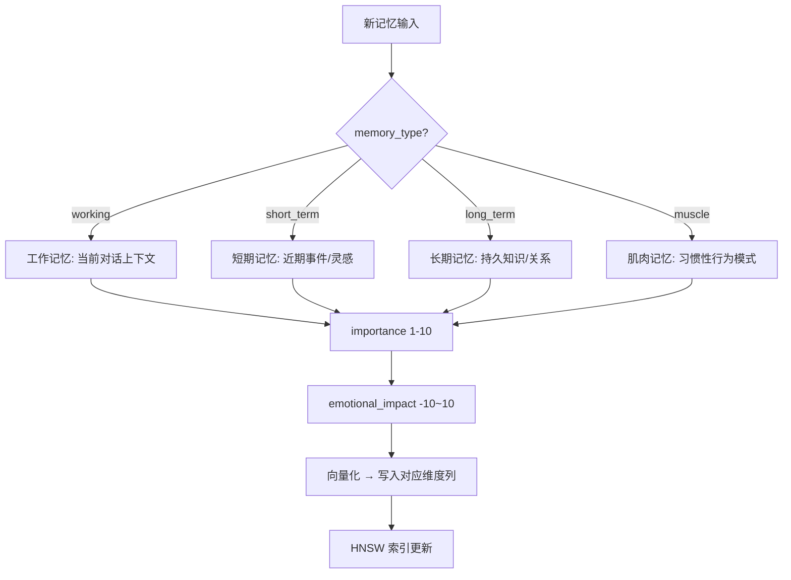
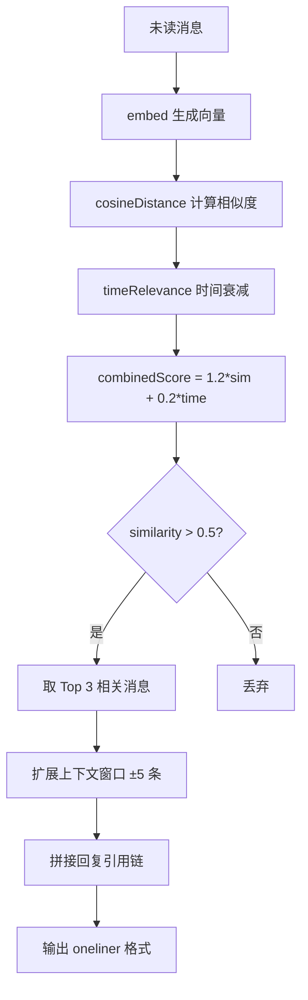

# PD-06.07 AIRI — PostgreSQL+pgvector 多层记忆与三维度向量检索

> 文档编号：PD-06.07
> 来源：AIRI `services/telegram-bot/src/db/schema.ts`
> GitHub：https://github.com/moeru-ai/airi.git
> 问题域：PD-06 记忆持久化 Memory Persistence
> 状态：可复用方案

---

## 第 1 章 问题与动机

### 1.1 核心问题

AI 角色扮演 Bot 需要在多轮对话中保持连贯的记忆能力。具体挑战包括：

1. **多类型记忆共存**：工作记忆（当前对话上下文）、短期记忆（近期事件）、长期记忆（持久知识）、肌肉记忆（习惯性行为）需要不同的存储策略和生命周期管理
2. **语义检索**：基于关键词的精确匹配无法捕获对话中的语义关联，需要向量相似度搜索
3. **多模态内容**：文本消息、贴纸描述、照片描述都需要统一的向量化存储和检索
4. **Embedding 模型兼容**：不同 embedding 提供商输出维度不同（768/1024/1536），系统需要同时支持多种维度
5. **情感与重要性建模**：记忆不仅有内容，还有情感色彩和重要程度，影响检索排序

### 1.2 AIRI 的解法概述

AIRI 采用 PostgreSQL + pgvector + Drizzle ORM 构建了一套完整的多层记忆系统：

1. **5 张记忆表分层存储**：`memory_fragments`（核心记忆片段）、`memory_episodic`（事件记忆）、`memory_tags`（标签系统）、`memory_long_term_goals`（目标追踪）、`memory_short_term_ideas`（灵感捕获），每张表职责明确 (`schema.ts:110-206`)
2. **三维度向量列并存**：每张需要语义检索的表同时定义 768/1024/1536 三个 vector 列，运行时根据 `EMBEDDING_DIMENSION` 环境变量选择写入哪一列 (`chat-message.ts:57-69`)
3. **HNSW 索引加速**：所有向量列均建立 `vector_cosine_ops` 的 HNSW 索引，支持高效近似最近邻搜索 (`schema.ts:20-22, 127-129`)
4. **余弦相似度 + 时间衰减混合排序**：检索时用 `1.2 * similarity + 0.2 * timeRelevance` 公式平衡语义相关性和时间新鲜度 (`chat-message.ts:112`)
5. **上下文窗口扩展**：找到相关消息后，自动获取前后各 5 条消息作为上下文，还原完整对话场景 (`chat-message.ts:89, 146-207`)

### 1.3 设计思想

| 设计原则 | 具体实现 | 理由 | 替代方案 |
|----------|----------|------|----------|
| 关系型 + 向量混合 | PostgreSQL + pgvector 单库承载结构化数据和向量检索 | 避免维护两套存储（如 PG + Pinecone），事务一致性有保障 | 独立向量数据库（Pinecone/Qdrant）+ 关系型数据库 |
| 多维度向量列 | 同一表定义 768/1024/1536 三列 | 支持切换 embedding 模型而无需数据迁移，运行时按环境变量选择 | 单一维度列 + 迁移脚本 |
| 软删除 | `deleted_at` nullable timestamp | 记忆可恢复，支持审计追溯 | 硬删除 + 备份表 |
| 情感维度建模 | `emotional_impact` (-10~10) + `importance` (1~10) | 模拟人类记忆的情感加权，重要/强烈情感的记忆更容易被召回 | 纯语义相似度排序 |
| Drizzle ORM 类型安全 | TypeScript schema 定义 + 自动迁移 | 编译期类型检查，避免 SQL 注入和字段类型错误 | 原生 SQL / Prisma |

---

## 第 2 章 源码实现分析

### 2.1 架构概览

AIRI 的记忆系统围绕 PostgreSQL 构建，通过 Drizzle ORM 提供类型安全的数据访问层：

```
┌─────────────────────────────────────────────────────────────────┐
│                    Telegram Bot Agent                           │
│  ┌──────────┐  ┌──────────────┐  ┌───────────────────────┐     │
│  │ Actions   │  │ Models Layer │  │ Prompts               │     │
│  │ (read-   │──│ (chat-msg,   │──│ (actionReadMessages)  │     │
│  │  message) │  │  stickers,   │  └───────────────────────┘     │
│  └──────────┘  │  photos)     │                                 │
│                └──────┬───────┘                                 │
│                       │                                         │
│                ┌──────▼───────┐                                 │
│                │  Drizzle ORM │                                 │
│                │  (useDrizzle)│                                 │
│                └──────┬───────┘                                 │
│                       │                                         │
└───────────────────────┼─────────────────────────────────────────┘
                        │
              ┌─────────▼──────────┐
              │  PostgreSQL + pgvector                            │
              │  ┌───────────────────────────────────────┐       │
              │  │ memory_fragments (4 types)             │       │
              │  │ memory_episodic (events)               │       │
              │  │ memory_tags (labels)                   │       │
              │  │ memory_long_term_goals (hierarchical)  │       │
              │  │ memory_short_term_ideas (dreams)       │       │
              │  │ chat_messages (conversations)          │       │
              │  │ stickers / photos (multimodal)         │       │
              │  └───────────────────────────────────────┘       │
              │  HNSW indexes: 768 / 1024 / 1536 dims           │
              └──────────────────────────────────────────────────┘
```

### 2.2 核心实现

#### 2.2.1 记忆片段表 — 四类型分层存储



对应源码 `services/telegram-bot/src/db/schema.ts:110-136`：

```typescript
export const memoryFragmentsTable = pgTable('memory_fragments', {
  id: uuid().primaryKey().defaultRandom(),
  content: text().notNull(),
  memory_type: text().notNull(), // 'working', 'short_term', 'long_term', 'muscle'
  category: text().notNull(),    // 'chat', 'relationships', 'people', 'life'
  importance: integer().notNull().default(5),       // 1-10 scale
  emotional_impact: integer().notNull().default(0), // -10 to 10 scale
  created_at: bigint({ mode: 'number' }).notNull().default(0).$defaultFn(() => Date.now()),
  last_accessed: bigint({ mode: 'number' }).notNull().default(0).$defaultFn(() => Date.now()),
  access_count: integer().notNull().default(1),
  metadata: jsonb().notNull().default({}),
  content_vector_1536: vector({ dimensions: 1536 }),
  content_vector_1024: vector({ dimensions: 1024 }),
  content_vector_768: vector({ dimensions: 768 }),
  deleted_at: bigint({ mode: 'number' }),
}, table => [
  index('memory_items_content_vector_1536_index')
    .using('hnsw', table.content_vector_1536.op('vector_cosine_ops')),
  index('memory_items_content_vector_1024_index')
    .using('hnsw', table.content_vector_1024.op('vector_cosine_ops')),
  index('memory_items_content_vector_768_index')
    .using('hnsw', table.content_vector_768.op('vector_cosine_ops')),
  index('memory_items_memory_type_index').on(table.memory_type),
  index('memory_items_category_index').on(table.category),
  index('memory_items_importance_index').on(table.importance),
])
```

关键设计点：
- `access_count` + `last_accessed` 实现 LRU 式访问追踪，为未来的记忆衰减/清理提供数据基础
- `metadata` 用 JSONB 存储扩展信息，避免频繁 ALTER TABLE
- 三个向量列同时存在但运行时只写入一个，通过 `EMBEDDING_DIMENSION` 环境变量控制

#### 2.2.2 向量检索 — 余弦相似度 + 时间衰减



对应源码 `services/telegram-bot/src/models/chat-message.ts:87-141`：

```typescript
export async function findRelevantMessages(
  botId: string, chatId: string,
  unreadHistoryMessagesEmbedding: { embedding: number[] }[],
  excludeMessageIds: string[] = []
) {
  const db = useDrizzle()
  const contextWindowSize = 5

  return await Promise.all(unreadHistoryMessagesEmbedding.map(async (embedding) => {
    let similarity: SQL<number>
    switch (env.EMBEDDING_DIMENSION) {
      case '1536':
        similarity = sql<number>`(1 - (${cosineDistance(
          chatMessagesTable.content_vector_1536, embedding.embedding
        )}))`
        break
      case '1024':
        similarity = sql<number>`(1 - (${cosineDistance(
          chatMessagesTable.content_vector_1024, embedding.embedding
        )}))`
        break
      case '768':
        similarity = sql<number>`(1 - (${cosineDistance(
          chatMessagesTable.content_vector_768, embedding.embedding
        )}))`
        break
    }

    const timeRelevance = sql<number>`(1 - (CEIL(EXTRACT(EPOCH FROM NOW()) * 1000)::bigint
      - ${chatMessagesTable.created_at}) / 86400 / 30)`
    const combinedScore = sql<number>`((1.2 * ${similarity}) + (0.2 * ${timeRelevance}))`

    const relevantMessages = await db
      .select({ /* ... fields + similarity + combined_score ... */ })
      .from(chatMessagesTable)
      .where(and(
        eq(chatMessagesTable.platform, 'telegram'),
        eq(chatMessagesTable.in_chat_id, chatId),
        gt(similarity, 0.5),
        notInArray(chatMessagesTable.platform_message_id, excludeMessageIds),
      ))
      .orderBy(desc(sql`combined_score`))
      .limit(3)
    // ... context window expansion ...
  }))
}
```

### 2.3 实现细节

#### 三维度向量写入策略

消息录入时根据环境变量动态选择写入哪个向量列 (`chat-message.ts:57-69`)：

```typescript
switch (env.EMBEDDING_DIMENSION) {
  case '1536':
    values.content_vector_1536 = embedding.embedding
    break
  case '1024':
    values.content_vector_1024 = embedding.embedding
    break
  case '768':
    values.content_vector_768 = embedding.embedding
    break
  default:
    throw new Error(`Unsupported embedding dimension: ${env.EMBEDDING_DIMENSION}`)
}
```

这意味着同一张表中，不同时期写入的数据可能使用不同维度的向量列。检索时也按同一环境变量选择对应列，保证写入和读取维度一致。

#### 事件记忆与目标追踪

`memory_episodic` 表通过 FK 关联 `memory_fragments`，为记忆片段附加事件上下文 (`schema.ts:151-162`)：
- `event_type`：conversation / introduction / argument 等事件类型
- `participants`：JSONB 数组存储参与者 ID
- `location`：事件发生地点

`memory_long_term_goals` 支持层级目标 (`schema.ts:165-183`)：
- `parent_goal_id` 自引用外键实现目标树
- `progress` 0-100 百分比追踪
- `status` 四态：planned → in_progress → completed / abandoned

#### 数据库迁移演进

从迁移历史可以看到 schema 的演进路径：
- `0000_harsh_king_cobra.sql`：初始 schema，仅 768 和 1536 两个维度
- `0003_black_warbird.sql`：引入完整记忆系统（5 张记忆表 + 1024 维度 + HNSW 索引）
- `0005_workable_shockwave.sql`：增加贴纸包和照片描述字段

#### Embedding 生成与重试

`read-message.ts:42-70` 中对每条未读消息并行生成 embedding，使用 `@xsai/embed` 库 + `withRetry` 包装（最多 5 次重试），并通过 OpenTelemetry span 追踪每次 embed 调用的模型、输入和 API 地址。

#### 单例数据库连接

`db/index.ts:7-18` 使用模块级变量 + 惰性初始化实现单例：

```typescript
let db: ReturnType<typeof initDb>
export function useDrizzle() {
  if (!db) db = initDb()
  return db
}
```

---

## 第 3 章 迁移指南

### 3.1 迁移清单

**阶段 1：基础设施**
- [ ] 安装 PostgreSQL 15+ 并启用 pgvector 扩展（`CREATE EXTENSION vector`）
- [ ] 安装依赖：`drizzle-orm`、`drizzle-kit`、`@xsai/embed`（或其他 embedding SDK）
- [ ] 配置环境变量：`DATABASE_URL`、`EMBEDDING_API_BASE_URL`、`EMBEDDING_API_KEY`、`EMBEDDING_MODEL`、`EMBEDDING_DIMENSION`

**阶段 2：Schema 定义**
- [ ] 定义 `memory_fragments` 表（含三维度向量列 + HNSW 索引）
- [ ] 定义辅助表：`memory_tags`、`memory_episodic`（按需）
- [ ] 运行 `drizzle-kit generate` 生成迁移 SQL
- [ ] 运行 `drizzle-kit migrate` 应用迁移

**阶段 3：业务逻辑**
- [ ] 实现 `recordMemory()` — 向量化 + 写入对应维度列
- [ ] 实现 `findRelevantMemories()` — 余弦相似度 + 时间衰减混合排序
- [ ] 实现上下文窗口扩展（前后 N 条消息）

**阶段 4：可选增强**
- [ ] 添加 `memory_long_term_goals` 层级目标追踪
- [ ] 添加 `memory_short_term_ideas` 灵感捕获
- [ ] 实现软删除 + 记忆衰减清理

### 3.2 适配代码模板

以下是一个可直接运行的最小化迁移模板（TypeScript + Drizzle ORM）：

```typescript
// schema.ts — 记忆表定义
import { bigint, index, integer, jsonb, pgTable, text, uuid, vector } from 'drizzle-orm/pg-core'

export const memoryFragments = pgTable('memory_fragments', {
  id: uuid().primaryKey().defaultRandom(),
  content: text().notNull(),
  memory_type: text().notNull(), // 'working' | 'short_term' | 'long_term'
  category: text().notNull().default('general'),
  importance: integer().notNull().default(5),
  emotional_impact: integer().notNull().default(0),
  created_at: bigint({ mode: 'number' }).notNull().$defaultFn(() => Date.now()),
  last_accessed: bigint({ mode: 'number' }).notNull().$defaultFn(() => Date.now()),
  access_count: integer().notNull().default(1),
  metadata: jsonb().notNull().default({}),
  // 按需选择维度，或像 AIRI 一样三列并存
  content_vector: vector({ dimensions: 1536 }),
  deleted_at: bigint({ mode: 'number' }),
}, table => [
  index('memory_content_vector_idx')
    .using('hnsw', table.content_vector.op('vector_cosine_ops')),
  index('memory_type_idx').on(table.memory_type),
  index('memory_importance_idx').on(table.importance),
])

// memory-service.ts — 记忆 CRUD
import { and, cosineDistance, desc, gt, sql } from 'drizzle-orm'
import { embed } from '@xsai/embed'
import { drizzle } from 'drizzle-orm/node-postgres'
import { memoryFragments } from './schema'

const db = drizzle(process.env.DATABASE_URL!)

export async function storeMemory(content: string, type: string, category: string, importance: number) {
  const { embedding } = await embed({
    baseURL: process.env.EMBEDDING_API_BASE_URL!,
    apiKey: process.env.EMBEDDING_API_KEY!,
    model: process.env.EMBEDDING_MODEL!,
    input: content,
  })

  await db.insert(memoryFragments).values({
    content,
    memory_type: type,
    category,
    importance,
    content_vector: embedding,
  })
}

export async function findRelevant(query: string, limit = 5) {
  const { embedding } = await embed({
    baseURL: process.env.EMBEDDING_API_BASE_URL!,
    apiKey: process.env.EMBEDDING_API_KEY!,
    model: process.env.EMBEDDING_MODEL!,
    input: query,
  })

  const similarity = sql<number>`(1 - (${cosineDistance(memoryFragments.content_vector, embedding)}))`
  const timeDecay = sql<number>`(1 - (CEIL(EXTRACT(EPOCH FROM NOW()) * 1000)::bigint
    - ${memoryFragments.created_at}) / 86400 / 30)`
  const score = sql<number>`((1.2 * ${similarity}) + (0.2 * ${timeDecay}))`

  return db
    .select({
      id: memoryFragments.id,
      content: memoryFragments.content,
      memory_type: memoryFragments.memory_type,
      importance: memoryFragments.importance,
      score: sql`${score} AS score`,
    })
    .from(memoryFragments)
    .where(and(gt(similarity, 0.5)))
    .orderBy(desc(sql`score`))
    .limit(limit)
}
```

### 3.3 适用场景

| 场景 | 适用度 | 说明 |
|------|--------|------|
| 聊天 Bot 对话记忆 | ⭐⭐⭐ | AIRI 的核心场景，消息级向量检索 + 上下文窗口 |
| AI 角色扮演 / 虚拟伴侣 | ⭐⭐⭐ | 情感维度 + 目标追踪 + 事件记忆完美匹配 |
| 客服知识库 | ⭐⭐ | 向量检索部分可复用，但不需要情感/目标模块 |
| 多 Agent 协作记忆 | ⭐⭐ | 需要额外的 agent_id 隔离，当前 schema 未设计 |
| 浏览器端离线记忆 | ⭐ | DuckDB WASM 包已迁移到独立仓库，当前方案依赖 PostgreSQL |

---

## 第 4 章 测试用例

```typescript
import { describe, it, expect, beforeAll, afterAll } from 'vitest'
import { drizzle } from 'drizzle-orm/node-postgres'
import { sql, eq, desc } from 'drizzle-orm'
import { memoryFragments } from './schema'

// 假设测试环境已配置 DATABASE_URL 指向测试数据库
const db = drizzle(process.env.DATABASE_URL!)

describe('MemoryFragments CRUD', () => {
  let testMemoryId: string

  it('should insert a memory fragment with vector', async () => {
    const fakeVector = Array.from({ length: 1536 }, () => Math.random())
    const [result] = await db.insert(memoryFragments).values({
      content: 'User prefers dark mode and minimal UI',
      memory_type: 'long_term',
      category: 'preferences',
      importance: 8,
      emotional_impact: 2,
      content_vector: fakeVector,
    }).returning()

    testMemoryId = result.id
    expect(result.memory_type).toBe('long_term')
    expect(result.importance).toBe(8)
  })

  it('should soft-delete a memory', async () => {
    await db.update(memoryFragments)
      .set({ deleted_at: Date.now() })
      .where(eq(memoryFragments.id, testMemoryId))

    const [deleted] = await db.select()
      .from(memoryFragments)
      .where(eq(memoryFragments.id, testMemoryId))

    expect(deleted.deleted_at).not.toBeNull()
  })

  it('should find memories by type and importance', async () => {
    const results = await db.select()
      .from(memoryFragments)
      .where(eq(memoryFragments.memory_type, 'long_term'))
      .orderBy(desc(memoryFragments.importance))
      .limit(10)

    expect(results.length).toBeGreaterThanOrEqual(0)
    // All returned should be long_term type
    results.forEach(r => expect(r.memory_type).toBe('long_term'))
  })
})

describe('Vector Similarity Search', () => {
  it('should return results above similarity threshold', async () => {
    const queryVector = Array.from({ length: 1536 }, () => Math.random())
    const similarity = sql<number>`(1 - (${memoryFragments.content_vector} <=> ${JSON.stringify(queryVector)}::vector))`

    const results = await db
      .select({ content: memoryFragments.content, sim: similarity })
      .from(memoryFragments)
      .orderBy(desc(similarity))
      .limit(3)

    // Similarity scores should be between 0 and 1
    results.forEach(r => {
      expect(r.sim).toBeGreaterThanOrEqual(0)
      expect(r.sim).toBeLessThanOrEqual(1)
    })
  })

  it('should handle empty embedding gracefully', async () => {
    // Edge case: zero vector should still return results (low similarity)
    const zeroVector = Array.from({ length: 1536 }, () => 0)
    const similarity = sql<number>`(1 - (${memoryFragments.content_vector} <=> ${JSON.stringify(zeroVector)}::vector))`

    const results = await db
      .select({ content: memoryFragments.content, sim: similarity })
      .from(memoryFragments)
      .limit(1)

    // Should not throw, even with zero vector
    expect(results).toBeDefined()
  })
})

describe('Memory Lifecycle', () => {
  it('should track access count on retrieval', async () => {
    // Simulate access count increment pattern
    const [memory] = await db.select()
      .from(memoryFragments)
      .limit(1)

    if (memory) {
      const originalCount = memory.access_count
      await db.update(memoryFragments)
        .set({
          access_count: originalCount + 1,
          last_accessed: Date.now(),
        })
        .where(eq(memoryFragments.id, memory.id))

      const [updated] = await db.select()
        .from(memoryFragments)
        .where(eq(memoryFragments.id, memory.id))

      expect(updated.access_count).toBe(originalCount + 1)
    }
  })
})
```

---

## 第 5 章 跨域关联

| 关联域 | 关系类型 | 说明 |
|--------|----------|------|
| PD-01 上下文管理 | 协同 | AIRI 在上下文接近限制时截断 messages 数组（`index.ts:232-233`），记忆系统的向量检索可作为截断后的补偿——从长期记忆中召回被截断的关键信息 |
| PD-04 工具系统 | 依赖 | embedding 生成依赖 `@xsai/embed` 工具，API 配置（baseURL/apiKey/model）通过环境变量注入，工具系统的配置管理直接影响记忆写入质量 |
| PD-08 搜索与检索 | 协同 | 向量相似度检索是记忆系统的核心能力，HNSW 索引策略、相似度阈值（0.5）、混合排序公式可复用到外部知识检索场景 |
| PD-11 可观测性 | 协同 | `read-message.ts` 中每次 embed 调用都包裹在 OpenTelemetry span 中，追踪模型名、输入内容、API 地址，为记忆系统的性能监控提供基础 |
| PD-03 容错与重试 | 依赖 | embedding 生成使用 `withRetry` 包装（5 次重试），记忆写入的可靠性依赖容错机制 |

---

## 第 6 章 来源文件索引

| 文件 | 行范围 | 关键实现 |
|------|--------|----------|
| `services/telegram-bot/src/db/schema.ts` | L1-207 | 全部 Schema 定义：7 张表 + 向量索引 + 外键约束 |
| `services/telegram-bot/src/db/schema.ts` | L110-136 | `memoryFragmentsTable`：四类型记忆 + 三维度向量 + 情感/重要性评分 |
| `services/telegram-bot/src/db/schema.ts` | L151-162 | `memoryEpisodicTable`：事件记忆 + 参与者 + 地点 |
| `services/telegram-bot/src/db/schema.ts` | L165-183 | `memoryLongTermGoalsTable`：层级目标 + 进度追踪 |
| `services/telegram-bot/src/db/schema.ts` | L186-206 | `memoryShortTermIdeas`：灵感捕获 + 兴奋度评分 |
| `services/telegram-bot/src/models/chat-message.ts` | L17-74 | `recordMessage()`：多模态消息向量化写入 |
| `services/telegram-bot/src/models/chat-message.ts` | L87-244 | `findRelevantMessages()`：余弦相似度 + 时间衰减 + 上下文窗口 |
| `services/telegram-bot/src/bots/telegram/agent/actions/read-message.ts` | L42-70 | embedding 并行生成 + 5 次重试 + OTel 追踪 |
| `services/telegram-bot/src/db/index.ts` | L7-18 | Drizzle 单例连接管理 |
| `services/telegram-bot/drizzle.config.ts` | L1-18 | Drizzle Kit 迁移配置 |
| `services/telegram-bot/drizzle/0000_harsh_king_cobra.sql` | L1-59 | 初始迁移：chat_messages + stickers + photos + 768/1536 向量 |
| `services/telegram-bot/drizzle/0003_black_warbird.sql` | L1-97 | 记忆系统迁移：5 张记忆表 + 1024 维度 + 全部 HNSW 索引 |
| `packages/memory-pgvector/src/index.ts` | L1-24 | memory-pgvector 模块入口（stub，通过 server-sdk Client 通信） |

---

## 第 7 章 横向对比维度

> **重要：** 本章用于自动填充 Butcher Wiki 的横向对比表。

```json comparison_data
{
  "project": "AIRI",
  "dimensions": {
    "记忆结构": "5 表分层：fragments(4类型) + episodic + tags + goals + ideas",
    "更新机制": "access_count + last_accessed 追踪访问，软删除 deleted_at",
    "事实提取": "消息级自动向量化，多模态(文本/贴纸/照片)统一 embed",
    "存储方式": "PostgreSQL + pgvector 单库，Drizzle ORM 类型安全",
    "注入方式": "余弦相似度 + 时间衰减混合排序，上下文窗口 ±5 条扩展",
    "生命周期管理": "四类型分层(working/short_term/long_term/muscle) + 软删除",
    "记忆检索": "HNSW 索引 + cosineDistance + 0.5 阈值 + Top3 + 上下文扩展",
    "Schema 迁移": "Drizzle Kit 自动生成 SQL 迁移，增量演进(0000→0005)",
    "粒度化嵌入": "三维度向量列并存(768/1024/1536)，运行时按环境变量选择",
    "多渠道会话隔离": "platform + in_chat_id 字段组合隔离不同平台和群组",
    "角色记忆隔离": "未实现，所有记忆共享同一命名空间",
    "记忆增长控制": "importance 1-10 评分 + emotional_impact 提供清理依据，但未实现自动清理",
    "情感维度建模": "emotional_impact(-10~10) + importance(1~10) + excitement(1~10)"
  }
}
```

### 域元数据补充

```json domain_metadata
{
  "solution_summary": "AIRI 用 PostgreSQL+pgvector+Drizzle ORM 构建 5 表分层记忆：fragments 支持 working/short_term/long_term/muscle 四类型，三维度向量列(768/1024/1536)并存，余弦相似度+时间衰减混合检索",
  "description": "情感维度和兴奋度评分为记忆赋予人格化权重，影响召回优先级",
  "sub_problems": [
    "情感权重检索：如何将 emotional_impact 和 importance 融入向量检索排序公式",
    "三维度向量列冗余：同表多维度列并存时如何处理历史数据的维度不一致",
    "事件记忆参与者解析：JSONB 数组存储的 participants 如何高效查询特定参与者的所有事件",
    "目标树完整性：parent_goal_id 自引用外键在删除父目标时的级联策略选择",
    "灵感来源追溯：ideas 的 source_id 引用 dream/conversation 等异构来源时的类型安全"
  ],
  "best_practices": [
    "三维度向量列并存：同表定义多维度列避免切换 embedding 模型时的数据迁移",
    "余弦相似度+时间衰减混合排序：1.2*sim+0.2*time 平衡语义相关性和时间新鲜度",
    "上下文窗口扩展：检索到相关消息后自动获取前后 N 条还原完整对话场景",
    "HNSW 索引 + cosine_ops：pgvector 的 HNSW 索引比 IVFFlat 更适合中小规模高精度场景",
    "单库混合存储：PostgreSQL 同时承载结构化数据和向量检索，减少运维复杂度"
  ]
}
```
